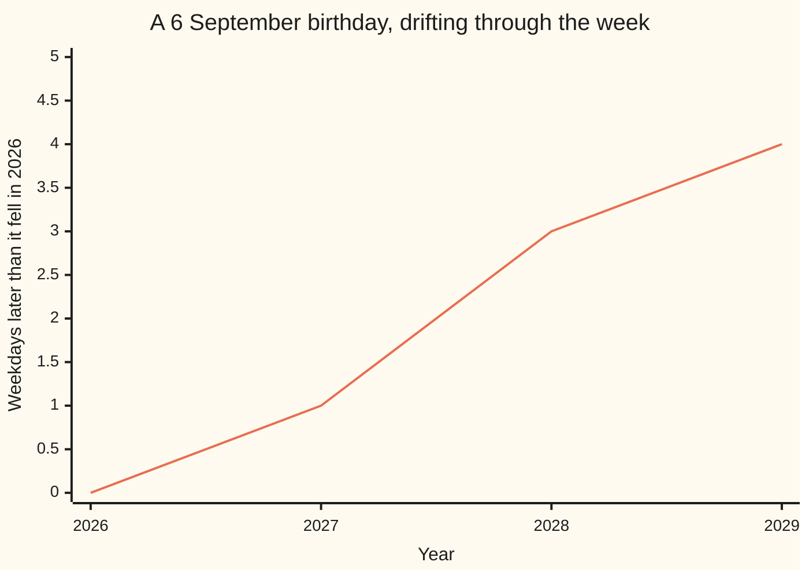

# Division with a remainder: the quotient and the leftover are unique, and the leftover is smaller than the divisor

Number theory → Divisibility and Primes → Divisibility → Division with a remainder

---

## General Overview

Your birthday is 6 September. In 2026 it falls on a Sunday. In 2027, a Monday.

A year is 365 days. A week is 7 days. Pack whole weeks into the year and 52 fit, using 364 days. One day is left over. That spare day is the shift.

Then a 29 February turns up. September 2027 to September 2028 runs 366 days: still 52 whole weeks, now 2 days over. The birthday jumps two, Monday to Wednesday.

Splitting a count into whole helpings plus what will not fill another is **division with a remainder**. The **quotient** counts the whole helpings. The **remainder** is the leftover. The **divisor** is one helping's size, 7 days here.

The count is a whole number, 0 or more. The divisor is a whole number, 1 or more.

**Every division has exactly one answer of this shape: so many whole copies of the divisor, plus a leftover too small to make one more copy.**

Textbooks call this the division algorithm, or the division theorem. It is one step, not the Euclidean algorithm, which repeats it.

### The picture: where the birthday has drifted to



The line is how many weekdays later the birthday falls than in 2026. Ordinary years lift it one, the leftover day. The step into 2028 is two: a 29 February.

---

## The formula

The year, written out, is the statement:

**365 = 52 × 7 + 1, and 1 is smaller than 7**

Read aloud: 365 days is 52 whole weeks plus 1 day that cannot fill another week. The leap year, same shape:

**366 = 52 × 7 + 2, and 2 is smaller than 7**

In general: **the number you started with = the quotient × the divisor + the remainder, where the remainder is at least 0 and smaller than the divisor.**

Later cards write it short: b = q × a + r, with r below a — b what you started with, a the divisor, q the quotient, r the remainder. Books often swap the letters; the shape is what matters.

| Piece | Plain meaning | In our example |
| --- | --- | --- |
| the number you started with, b | the count being split | 365 days |
| the divisor, a | the size of one helping, 1 or more | 7 days, a week |
| the quotient, q | how many whole helpings fit | 52 weeks |
| the remainder, r | what is left, too small for another helping | 1 day |
| the rule on r | at least 0, under the divisor | 1 is under 7 |

---

## Why it works

### Take a week away until you cannot

Start with 365 days. Take 7 away: 358 left, one week counted. Again: 351, two weeks. The pile drops by 7 each time, so it cannot drop forever. It stops after 52 goes, with 1 day standing.

A pencil can do it, and it always ends. The code does this too, by subtraction.

### The leftover has to be smaller than the divisor

If 7 or more were left, another week would still fit, so you would not have stopped. A leftover of 8 is an unfinished job, not an answer: 365 = 51 × 7 + 8 is true arithmetic in the wrong shape.

### There is only one answer

Two people split 365 days into weeks plus a leftover and disagree. Different week counts differ by a whole week at least, so their leftovers must differ by 7 or more. But both leftovers sit between 0 and 6. So they cannot disagree: one quotient, one remainder. That is what makes it safe to say *the* remainder.

The code checks that bluntly: it tries every week count from 0 to 99 and keeps the ones whose leftover lands under 7. One survives.

---

## Worked numbers, by hand

The birthday, 2026 to 2029. A birthday after February sees the 366-day stretch in the year ending in the leap year.

| Step | Arithmetic | Value |
| --- | --- | --- |
| whole weeks in a year | 52 × 7 | 364 |
| days over, ordinary year | 365 − 364 | 1 |
| days over, leap year | 366 − 364 | 2 |
| 2026 to 2027, ordinary | Sunday + 1 | Monday |
| 2027 to 2028, leap | Monday + 2 | Wednesday |
| 2028 to 2029, ordinary | Wednesday + 1 | **Thursday** |

Three years, four weekdays of drift.

### What breaks if you drop a piece

| Mistake | Comes out at | What went wrong |
| --- | --- | --- |
| Calling 52 weeks the whole year | 364 days | The spare day does the work |
| Stopping at 51 weeks, 8 days over | 51 weeks | 8 is not under 7, so a week still fits |
| Giving every year 365 days | Wednesday in 2029 | A leap year shifts it two, not one |

The code prints all three.

---

## Code, from first principles, and it actually runs

Nothing is imported. The year is divided the plain way, then again by taking 7 away over and over. Every week count is tried, to show one pair fits. The birthday walks to 2029.

### Python

```python
# Division with a remainder -- the check behind the card.  Nothing is imported.
# A 365-day year measured in 7-day weeks, then a 366-day leap year, then the
# weekday a 6 September birthday lands on, 2026 to 2029.
DAYS = ["Sunday", "Monday", "Tuesday", "Wednesday", "Thursday", "Friday", "Saturday"]

def strip(total, size):            # the long way: take 7 away until under 7 is left
    q = 0
    while total >= size:
        total, q = total - size, q + 1
    return q, total

def row(name, total, q, r):
    print(f"{name:<30}{total:>7}{q:>7}{r:>11}")

print(f"{'what':<30}{'total':>7}{'weeks':>7}{'days over':>11}")
row("ordinary year", 365, 365 // 7, 365 % 7)   # // whole weeks, % days over
row("leap year", 366, 366 // 7, 366 % 7)
row("by taking 7 away over and over", 365, *strip(365, 7))
pairs = [(q, 365 - 7 * q) for q in range(100) if 0 <= 365 - 7 * q < 7]
print(f"quotient-and-leftover pairs with the leftover under 7: {len(pairs)}")
moved = [0]
for length in (365, 366, 365):
    moved.append((moved[-1] + length % 7) % 7)
print("6 September: " + ", ".join(f"{y} {DAYS[m]}" for y, m in zip(range(2026, 2030), moved)))
print("weekdays moved since 2026: " + ", then ".join(str(m) for m in moved))
print(f"the three mistakes come out at {52 * 7} days, 51 weeks with {365 - 51 * 7} days over, and {DAYS[3]}")
assert (365 // 7, 365 % 7) == (52, 1) and 52 * 7 + 1 == 365
assert (366 // 7, 366 % 7) == (52, 2) and strip(365, 7) == (52, 1)
assert pairs == [(52, 1)] and moved == [0, 1, 3, 4]
print("ALL CHECKS PASS")
```

**Ran 2026-09-06 on macOS, Python 3.14.6, standard library only. All checks passed. Output, pasted from the run:**

```
what                            total  weeks  days over
ordinary year                     365     52          1
leap year                         366     52          2
by taking 7 away over and over    365     52          1
quotient-and-leftover pairs with the leftover under 7: 1
6 September: 2026 Sunday, 2027 Monday, 2028 Wednesday, 2029 Thursday
weekdays moved since 2026: 0, then 1, then 3, then 4
the three mistakes come out at 364 days, 51 weeks with 8 days over, and Wednesday
ALL CHECKS PASS
```

### Rust

Same numbers, same labels, built with `rustc --edition 2021 -O`.

```rust
// Division with a remainder -- the same check as division_with_remainder_check.py,
// in Rust.  No crates.  A 365-day year measured in 7-day weeks, then a 366-day
// leap year, then a 6 September birthday's weekday, 2026 to 2029.
const DAYS: [&str; 7] = ["Sunday", "Monday", "Tuesday", "Wednesday", "Thursday", "Friday", "Saturday"];

fn strip(total: i64, size: i64) -> (i64, i64) {   // the long way: take 7 away until under 7 is left
    let (mut t, mut q) = (total, 0);
    while t >= size { t -= size; q += 1; }
    (q, t)
}
fn row(name: &str, total: i64, q: i64, r: i64) {
    println!("{:<30}{:>7}{:>7}{:>11}", name, total, q, r);
}

fn main() {
    println!("{:<30}{:>7}{:>7}{:>11}", "what", "total", "weeks", "days over");
    row("ordinary year", 365, 365 / 7, 365 % 7);   // / whole weeks, % days over
    row("leap year", 366, 366 / 7, 366 % 7);
    let (q, r) = strip(365, 7);
    row("by taking 7 away over and over", 365, q, r);
    let mut pairs: Vec<(i64, i64)> = Vec::new();
    for k in 0..100 { if 365 - 7 * k >= 0 && 365 - 7 * k < 7 { pairs.push((k, 365 - 7 * k)); } }
    println!("quotient-and-leftover pairs with the leftover under 7: {}", pairs.len());
    let mut moved: Vec<usize> = vec![0];
    for length in [365usize, 366, 365] { moved.push((moved[moved.len() - 1] + length % 7) % 7); }
    let mut line = String::from("6 September: ");
    for (i, m) in moved.iter().enumerate() {
        if i > 0 { line.push_str(", "); }
        line.push_str(&format!("{} {}", 2026 + i, DAYS[*m]));
    }
    println!("{}", line);
    let steps: Vec<String> = moved.iter().map(|m| m.to_string()).collect();
    println!("weekdays moved since 2026: {}", steps.join(", then "));
    println!("the three mistakes come out at {} days, 51 weeks with {} days over, and {}",
             52 * 7, 365 - 51 * 7, DAYS[3]);
    assert!((365 / 7, 365 % 7) == (52, 1) && 52 * 7 + 1 == 365);
    assert!((366 / 7, 366 % 7) == (52, 2) && strip(365, 7) == (52, 1));
    assert!(pairs == vec![(52, 1)] && moved == vec![0, 1, 3, 4]);
    println!("ALL CHECKS PASS");
}
```

**Ran 2026-09-06 on macOS, rustc 1.98.1, no crates. All checks passed. Output, pasted from the run:**

```
what                            total  weeks  days over
ordinary year                     365     52          1
leap year                         366     52          2
by taking 7 away over and over    365     52          1
quotient-and-leftover pairs with the leftover under 7: 1
6 September: 2026 Sunday, 2027 Monday, 2028 Wednesday, 2029 Thursday
weekdays moved since 2026: 0, then 1, then 3, then 4
the three mistakes come out at 364 days, 51 weeks with 8 days over, and Wednesday
ALL CHECKS PASS
```

The two outputs match line for line: whole days, nothing to round.

> [!TIP]
> **Try changing**
> Guess first, then run it. The asserts are pinned to the house numbers.
> - **Give every year 366 days.** Change the three year lengths to 366, 366, 366. The birthday moves two weekdays a year, and the last assert fires.
> - **Take 5 away instead of 7.** Call `strip(365, 5)`: a quotient of 73, nothing over, because 5 goes into 365 exactly. A remainder of 0 is the [divides](01-divides.md) case. This one runs clean.

---

## The usual mistake

> [!warning]
> **Reading the leftover as a piece of a helping.** A calculator dividing 365 by 7 runs past the decimal point; that tail is a fraction of a week. This card wants whole things: 52 whole weeks and 1 whole day.
>
> - Letting the leftover reach the divisor: 51 weeks with 8 days over is not an answer.
> - Swapping the words: the quotient counts the whole copies, the remainder what did not fill one.
> - Dividing a negative count. Which way the leftover goes is a separate rule, in [congruence-mod-n](../03-Clock%20Arithmetic/01-congruence-mod-n.md).

---

## Where you meet it in real life

- **Calendars.** Any day-of-the-week question is a leftover after dividing by 7: [day-of-the-week](../05-Check%20Digits%2C%20Calendars%20and%20Cycles/03-day-of-the-week.md).
- **Clocks.** 100 minutes is 1 hour and 40 minutes: divide by 60, keep the leftover.
- **Loading a van.** 365 chairs into vans holding 7 needs 52 full vans plus one carrying a single chair. The leftover still costs a van.

> **Say it back**
> Take a whole count and a divisor, 1 or more. Fit in as many whole copies of the divisor as you can: that is the quotient. What is left is the remainder, smaller than the divisor — otherwise another copy would fit. Only one such pair works. A year is 52 weeks and 1 day, so a birthday walks one weekday a year, two across a 29 February.

---

## What this builds on

- [multiplying-and-dividing](../../01-Foundations/01-Everyday%20Arithmetic/03-multiplying-and-dividing.md): whole-number division, and the 52 × 7 that dividing 365 by 7 undoes.
- [divides](01-divides.md): the case where nothing is left over. This card covers the rest.

## Where this goes next

- [primes-and-composites](05-primes-and-composites.md): testing for a prime asks for remainders, caring only whether one is 0.
- [euclidean-algorithm](../02-Greatest%20Common%20Divisor%20and%20Euclid%27s%20Algorithm/03-euclidean-algorithm.md): this step run again on each leftover, to find the largest number dividing two numbers.
- [congruence-mod-n](../03-Clock%20Arithmetic/01-congruence-mod-n.md): keeping the remainder and throwing the quotient away, negative counts included.
- [day-of-the-week](../05-Check%20Digits%2C%20Calendars%20and%20Cycles/03-day-of-the-week.md): this drift, built into a rule for any date.

---

## Sources

Verified 6 Sep 2026; every link resolves.

- Euclid. *Elements*, Book VII, Propositions 1 and 2, in David E. Joyce's edition, Clark University. [Book VII](https://mathcs.clarku.edu/~djoyce/elements/bookVII/bookVII.html). The oldest written form of it.
- Graham, Ronald L., Donald E. Knuth and Oren Patashnik. *Concrete Mathematics*, 2nd ed. Addison-Wesley, 1994. [Publisher page](https://www.informit.com/store/concrete-mathematics-a-foundation-for-computer-science-9780201558029). Chapter 3, quotients and remainders, negative counts included.
- United States Naval Observatory. *Introduction to Calendars*. [aa.usno.navy.mil](https://aa.usno.navy.mil/faq/calendars). Where the 365 and 366 come from.
