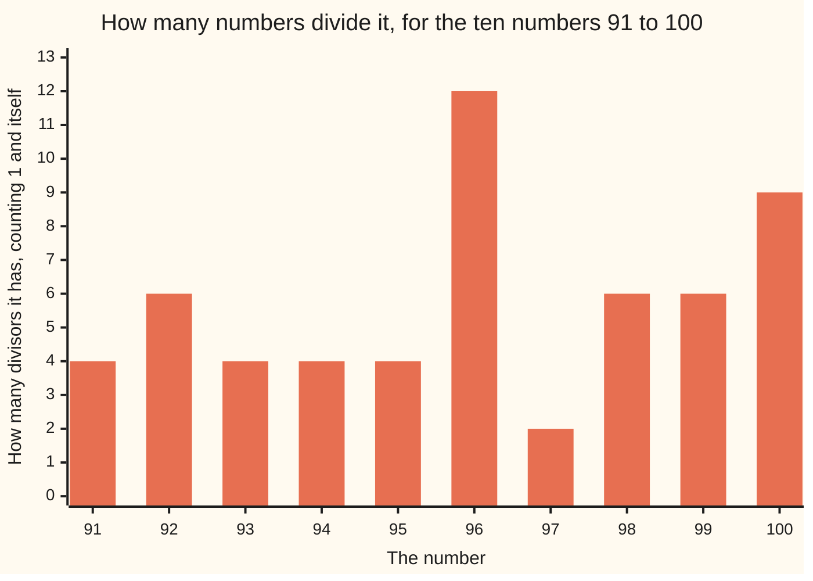

# Primes and composites: the numbers that will not split into equal rows, and the ones that will

[Syllabus](../../../SYLLABUS.md) → [Number theory](../../../SYLLABUS.md#w02) → [Divisibility and Primes](../../../SYLLABUS.md#w02-s01) → Primes and composites

---

## General Overview

You are setting out chairs in a hall. 97 of them, in equal rows, nothing left standing. Rows of 2, 3, 4, 6 and 8 leave one over; rows of 5, 7 and 9 leave more. The only layouts with nothing left over are one row of 97, and 97 rows of one.

Now 91 chairs. Rows of 2, 3, 4, 5, 6 all leave something over — as stubborn as 97. Then rows of 7 land exactly: 7 rows of 13.

A number bigger than 1 that will not split into equal rows of more than one is **prime**; one that will is **composite**. This card tells the two apart without the chairs.

**A number bigger than 1 is prime when nothing divides it but 1 and itself, and you find out by trying 2, 3, 4, 5 and up — stopping the moment the number you are trying, times itself, passes the number tested.**

### The picture: how many divisors, 91 to 100



One bar per number: how many divisors it has. Everything has at least two, 1 and itself; only 97 sits at 2, and that is what prime means.

---

## The formula

The test, run on our two numbers:

**97: try 2 to 9, leftovers 1, 1, 1, 2, 1, 6, 1, 7. Nothing goes in, and 10 × 10 = 100 is past 97, so the trying is over. 97 is prime.**

**91: try 2 to 6, leftovers 1, 1, 3, 1, 1. Then 7 goes in with nothing left: 91 = 7 × 13. 91 is composite.**

| Piece | Plain meaning | In our two numbers |
| --- | --- | --- |
| a divisor | goes in with nothing left over ([Divides](01-divides.md)) | 1, 7, 13, 91 divide 91 |
| a trial divisor | the next number you try | 2 to 9, for 97 |
| the leftover | chairs still standing ([Division with a remainder](04-division-with-remainder.md)) | 6, from 97 in rows of 7 |
| prime | bigger than 1, no divisor but 1 and itself | 97 |
| composite | bigger than 1, something else divides it | 91, because 7 does |

---

## Why it works

### A row is a divisor

"91 chairs make 7 rows of 13" and "7 divides 91" say one thing twice. A layout with nothing left over *is* a divisor, so being prime is a hunt for divisors that came up empty.

### Why you can stop so early

Suppose 97 did split: rows times chairs per row, two numbers multiplied. One is the smaller — call it the short side.

The short side cannot be big. If it were 10 or more, the long side would be too, and 10 × 10 = 100 is already past 97. So a split of 97 would have a short side of 9 or under — and every number up to 9 has been tried.

**Keep going while the trial divisor times itself is at or below the number; stop the moment it passes.** Eight divisions settle 97. Four would do: once 2 fails, 4, 6 and 8 cannot go in either. Trying them all keeps the rule simple.

### Where 1 and 2 sit

1 is neither: its only divisor is itself. It is left out on purpose — count 1 as prime and you could pad any number with extra 1s, so [Prime factorisation](07-prime-factorisation.md) would lose its single clean answer.

2 is prime, and the only even prime, since 2 divides every other even number ([Even and odd](02-even-and-odd.md)). Odd is a different question: 91 is odd and composite.

---

## Worked numbers, by hand

The hall, one trial divisor at a time.

| Step | Arithmetic | Value |
| --- | --- | --- |
| 97 in rows of 2 to 9 | leftovers | 1, 1, 1, 2, 1, 6, 1, 7 |
| is 9 the last trial? | 9 × 9 = 81 under 97, 10 × 10 = 100 past it | stop at 9 |
| the verdict | no divisor but 1 and 97 | **97 is prime** |
| 91 in rows of 2 to 6 | leftovers | 1, 1, 3, 1, 1 |
| 91 in rows of 7 | leftover | 0 |
| the verdict | 7 rows of 13 | **91 = 7 × 13, composite** |

### What breaks if you drop a piece

| Mistake | Comes out at | What went wrong |
| --- | --- | --- |
| Counting 1 as prime | 26 primes below 100, not 25 | 1 has one divisor, not two |
| Stopping the trials at 5 | 28 | 49, 77 and 91 slip through — short side 7 |

The code prints both.

---

## Code, from first principles, and it actually runs

Nothing is imported. The plain road is trial division: divisors from 2 up, stopping when the trial divisor times itself passes the number. The second road lists every number that goes in, and calls it prime when the list has two entries. Both roads agree below 1,000: all 168 primes.

### Python

```python
# Primes and composites -- the check behind the card.  Nothing is imported.  97 chairs will not make equal
# rows; 91 chairs make 7 rows of 13.  Trial division is one road, listing every divisor is the other.
def trials(n):                  # the divisors tried, stopping at the first that goes in
    tried = []
    for d in range(2, n):
        if d * d > n: break
        tried.append(d)
        if n % d == 0: break
    return tried
def is_prime(n, floor=1): return n > floor and all(n % d for d in trials(n))   # the first road
def divisors(n): return [d for d in range(1, n + 1) if n % d == 0]     # the second road
for n, verdict in ((97, "prime"), (91, "composite, 91 = 7 x 13")):
    t = trials(n)
    print(f"{n} -- trial divisors {' '.join(map(str, t))}, remainders "
          f"{' '.join(str(n % d) for d in t)} -> {verdict}")
print("stop rule: 9 x 9 = 81 is under 97, 10 x 10 = 100 is past it, so 9 is the last trial")
d97, d91 = divisors(97), divisors(91)
print(f"divisors: 97 has {', '.join(map(str, d97))} ({len(d97)} of them); 91 has {', '.join(map(str, d91))} ({len(d91)} of them)")
print("how many divisors, 91 to 100: " + " ".join(str(len(divisors(n))) for n in range(91, 101)))
p100, p1000 = [n for n in range(2, 100) if is_prime(n)], [n for n in range(2, 1000) if is_prime(n)]
slip = [n for n in range(2, 100) if not is_prime(n) and all(n % d for d in (2, 3, 4, 5))]
print(f"primes below 100: {len(p100)}")
print(f"counting 1 as prime instead: {len([n for n in range(1, 100) if is_prime(n, 0)])}")
print(f"stopping the trials at 5 instead: {len(p100) + len(slip)}  ({', '.join(map(str, slip))} slip through)")
print(f"odd numbers above 1 below 100: {len(range(3, 100, 2))}")
assert p1000 == [n for n in range(2, 1000) if len(divisors(n)) == 2]   # the two roads agree
print(f"both roads agree on every number below 1,000: {len(p1000)} primes")
assert len(p100) == 25 and d91 == [1, 7, 13, 91] and 7 * 13 == 91 and not is_prime(1) and len(divisors(1)) == 1
assert 9 * 9 < 97 < 10 * 10 and len(slip) == 3 and len(range(3, 100, 2)) == 49
print("ALL CHECKS PASS")
```

**Ran 2026-09-06 on macOS, Python 3.14.6, standard library only. All checks passed. Output, pasted from the run:**

```
97 -- trial divisors 2 3 4 5 6 7 8 9, remainders 1 1 1 2 1 6 1 7 -> prime
91 -- trial divisors 2 3 4 5 6 7, remainders 1 1 3 1 1 0 -> composite, 91 = 7 x 13
stop rule: 9 x 9 = 81 is under 97, 10 x 10 = 100 is past it, so 9 is the last trial
divisors: 97 has 1, 97 (2 of them); 91 has 1, 7, 13, 91 (4 of them)
how many divisors, 91 to 100: 4 6 4 4 4 12 2 6 6 9
primes below 100: 25
counting 1 as prime instead: 26
stopping the trials at 5 instead: 28  (49, 77, 91 slip through)
odd numbers above 1 below 100: 49
both roads agree on every number below 1,000: 168 primes
ALL CHECKS PASS
```

### Rust

Same numbers, same labels, built with `rustc --edition 2021 -O`.

```rust
// Primes and composites -- the same check as the Python twin, in Rust.  No crates.  97 chairs will not
// make equal rows; 91 chairs make 7 rows of 13.  Trial division is one road, every divisor is the other.
fn trials(n: i64) -> Vec<i64> {          // the divisors tried, stopping at the first that goes in
    let mut tried = Vec::new();
    let mut d = 2;
    while d * d <= n {
        tried.push(d);
        if n % d == 0 { break; }
        d += 1;
    }
    tried
}
fn is_prime(n: i64, floor: i64) -> bool { n > floor && trials(n).iter().all(|d| n % d != 0) }  // the first road
fn divisors(n: i64) -> Vec<i64> { (1..=n).filter(|d| n % d == 0).collect() }         // the second road
fn join(v: &[i64], sep: &str) -> String { v.iter().map(|x| x.to_string()).collect::<Vec<String>>().join(sep) }
fn main() {
    for (n, verdict) in [(97i64, "prime"), (91, "composite, 91 = 7 x 13")] {
        let t = trials(n);
        let rem: Vec<i64> = t.iter().map(|d| n % d).collect();
        println!("{} -- trial divisors {}, remainders {} -> {}", n, join(&t, " "), join(&rem, " "), verdict);
    }
    println!("stop rule: 9 x 9 = 81 is under 97, 10 x 10 = 100 is past it, so 9 is the last trial");
    let (d97, d91) = (divisors(97), divisors(91));
    println!("divisors: 97 has {} ({} of them); 91 has {} ({} of them)", join(&d97, ", "), d97.len(), join(&d91, ", "), d91.len());
    let counts: Vec<i64> = (91..=100).map(|n| divisors(n).len() as i64).collect();
    println!("how many divisors, 91 to 100: {}", join(&counts, " "));
    let p100: Vec<i64> = (2..100).filter(|&n| is_prime(n, 1)).collect();
    let p1000: Vec<i64> = (2..1000).filter(|&n| is_prime(n, 1)).collect();
    let slip: Vec<i64> = (2..100).filter(|&n| !is_prime(n, 1) && [2, 3, 4, 5].iter().all(|d| n % d != 0)).collect();
    let odd = (3..100).step_by(2).count();
    println!("primes below 100: {}", p100.len());
    println!("counting 1 as prime instead: {}", (1..100).filter(|&n| is_prime(n, 0)).count());
    println!("stopping the trials at 5 instead: {}  ({} slip through)", p100.len() + slip.len(), join(&slip, ", "));
    println!("odd numbers above 1 below 100: {}", odd);
    assert!(p1000 == (2..1000).filter(|&n| divisors(n).len() == 2).collect::<Vec<i64>>());  // the two roads agree
    println!("both roads agree on every number below 1,000: {} primes", p1000.len());
    assert!(p100.len() == 25 && d91 == vec![1, 7, 13, 91] && 7 * 13 == 91 && !is_prime(1, 1) && divisors(1).len() == 1);
    assert!(9 * 9 < 97 && 97 < 10 * 10 && slip.len() == 3 && odd == 49);
    println!("ALL CHECKS PASS");
}
```

**Ran 2026-09-06 on macOS, rustc 1.98.1, no crates. All checks passed. Output, pasted from the run:**

```
97 -- trial divisors 2 3 4 5 6 7 8 9, remainders 1 1 1 2 1 6 1 7 -> prime
91 -- trial divisors 2 3 4 5 6 7, remainders 1 1 3 1 1 0 -> composite, 91 = 7 x 13
stop rule: 9 x 9 = 81 is under 97, 10 x 10 = 100 is past it, so 9 is the last trial
divisors: 97 has 1, 97 (2 of them); 91 has 1, 7, 13, 91 (4 of them)
how many divisors, 91 to 100: 4 6 4 4 4 12 2 6 6 9
primes below 100: 25
counting 1 as prime instead: 26
stopping the trials at 5 instead: 28  (49, 77, 91 slip through)
odd numbers above 1 below 100: 49
both roads agree on every number below 1,000: 168 primes
ALL CHECKS PASS
```

The two outputs match line for line.

> [!TIP]
> **Try changing**
> Guess first, then run it. The asserts are pinned to the house numbers, so expect one to fire.
> - **Stop one step early.** Break while the trial divisor times itself is under the number, not at it: 4, 9, 25 and 49 turn prime, because every prime times itself slips through.
> - **Drop 1 from the divisor list.** In `divisors`, change `range(1, n + 1)` to `range(1, n)`: 97 shows 1 divisor, the two roads disagree, the assert fires.
> - **Stop the trials at 5.** In `trials`, change `if d * d > n` to `if d > 5`: 49, 77 and 91 pass as prime, 28 primes below 100.

---

## The usual mistake

> [!warning]
> **Thinking every number is either prime or composite.** 1 is neither. Count it as prime and the primes below 100 come out at 26 instead of 25, and every later card that factors a number inherits the mistake.
>
> - **Trying every divisor up to the number.** Testing 97 is eight divisions, not 95.
> - **Reading odd as prime.** 49 numbers above 1 and below 100 are odd; only 25 are prime. 9, 15, 25 and 91 are odd and composite.
> - **Giving up after five failed tries.** 91 survives 2, 3, 4, 5 and 6 and is still composite.

---

## Where you meet it in real life

- **Bank sites and web browsers.** Their locks are two large primes multiplied together, betting nobody can pull the product apart.
- **Gears.** A gear with a prime number of teeth, paired with a gear whose count it does not divide, meets every tooth on its partner before repeating, spreading the wear.

> **Say it back**
> Equal rows, nothing left standing. A number bigger than 1 that will not make them is prime; one that will is composite. Divide by 2, then 3, then 4, while the number you are trying, times itself, stays at or below the number tested; if nothing has gone in by then, nothing will. 97 is prime; 91 is 7 rows of 13. 1 is neither, and 2 is the only even prime.

---

## What this builds on

- [Multiplying and dividing](../../01-Foundations/01-Everyday%20Arithmetic/03-multiplying-and-dividing.md): rows times chairs per row, and the division that undoes it.
- [Divides](01-divides.md): "goes in with nothing left over", and divisors in pairs.
- [Division with a remainder](04-division-with-remainder.md): the leftover, always smaller than the row.

## Where this goes next

- [The sieve of Eratosthenes](06-sieve-of-eratosthenes.md): the same test on a block of numbers at once, by crossing out multiples.
- [Prime factorisation](07-prime-factorisation.md): what a composite is made of — 91 breaks into 7 and 13.
- [Euclid's lemma](../02-Greatest%20Common%20Divisor%20and%20Euclid%27s%20Algorithm/06-euclids-lemma.md): the fact that makes those pieces unique, proved properly.
- [One-way streets](../06-Codes%20and%20Secrets/01-one-way-streets.md): multiplying large primes is easy, undoing it is not.

---

## Sources

Verified 6 Sep 2026: every link below resolves to the publisher's page.

- Euclid. *Elements*, Book VII, Definitions 11 and 13, c. 300 BC. [D. E. Joyce's edition](https://mathcs.clarku.edu/~djoyce/elements/bookVII/bookVII.html). The oldest surviving version of both words.
- Crandall, Richard, and Carl Pomerance. *Prime Numbers: A Computational Perspective*, 2nd ed. Springer, 2005. [doi:10.1007/0-387-28979-8](https://link.springer.com/book/10.1007/0-387-28979-8). Where trial division stops being enough.
- Apostol, Tom M. *Introduction to Analytic Number Theory*. Springer, 1976. [doi:10.1007/978-1-4757-5579-4](https://link.springer.com/book/10.1007/978-1-4757-5579-4). The careful statement.
