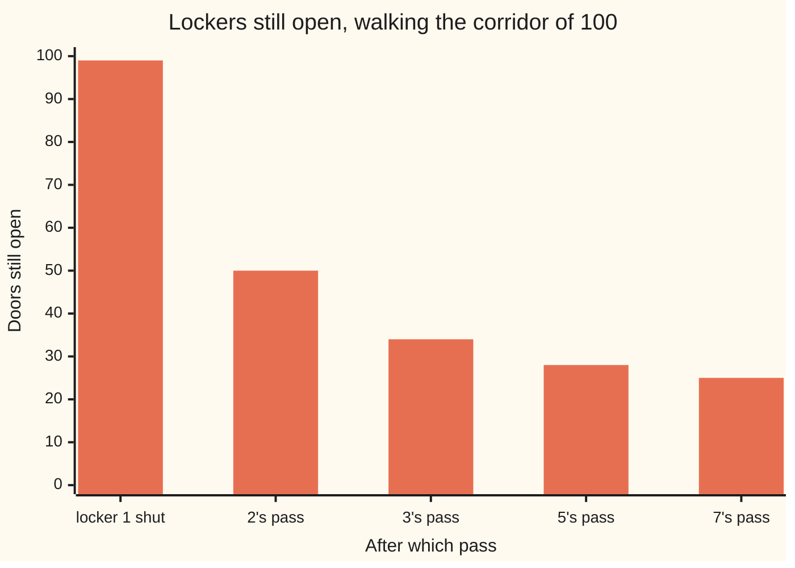

# The sieve of Eratosthenes: cross out every multiple and the primes are what is left standing

[Syllabus](../../../SYLLABUS.md) → [Number theory](../README.md) → [Divisibility and Primes](../README.md#s01) → The sieve of Eratosthenes

---

## General Overview

A school corridor. 100 lockers, numbered 1 to 100, every door open.

Shut locker 1. Leave locker 2 open, but slam every second locker after it: 4, 6, 8, on to 100. The next door still open is 3. Leave it, slam every third locker after it — 6 and 12 are shut already, so the slams land on 9, 15, 21, on to 99. Next open is 5: same again, and the slams land on 25, 35, 55, 65, 85, 95. Next is 7: leave it, slam 49, 77, 91.

Count what is still open: 25 doors — exactly the primes up to 100 ([Primes and composites](05-primes-and-composites.md)).

You never asked whether a number was prime. You slammed multiples of numbers you had already kept. That is a **sieve**: the composites fall through, the primes stay in the mesh. Its name is the sieve of Eratosthenes, from around 240 BC, and still how computers build prime lists.

**Keep the first door still open, slam every multiple of it, repeat. Stop once the door you keep, times itself, runs past the end of the corridor. Everything still open is prime.**

### The picture: doors still open



Each pass finds less to do: 2's pass slams 49 doors, 7's pass just 3.

---

## The formula

The corridor is the method:

**Shut locker 1. Keep 2 and slam every second door after it; keep 3 and slam every third; then 5, then 7. Stop, because 11 × 11 = 121 is past 100. The 25 doors still open are the primes.**

| Piece | Plain meaning | In our corridor |
| --- | --- | --- |
| a pass | a kept number, every multiple of it slammed | 3's pass slams 16 doors |
| where a pass starts | the kept number times itself | 9, not 6 |
| the stopping rule | the next kept number times itself passes the end | 11 × 11 = 121 |
| a door still open | prime: only 1 and itself divide it | 97 |
| a door slammed shut | composite: some kept number divides it | 91, by 7's pass |
| locker 1 | shut first; neither prime nor composite | 1 |

---

## Why it works

### A slam is a divisor

Every door a pass slams is a multiple of the kept number — that number goes in with nothing left over ([Divides](01-divides.md)). So a slammed door has a divisor besides 1 and itself: composite. A prime door is never slammed, then — not by its own pass, not by any later one.

### Every composite gets slammed

Take 91. It splits: 91 = 7 × 13. Its smallest divisor above 1 is 7 — and a smallest divisor is always prime, since if it split further the smaller piece would divide 91 too and be smaller still. And 13 is at least 7, so 91 sits at or past 49, where 7's pass begins. Every composite has a prime divisor; that prime's door stayed open, and its pass slammed the composite.

Slammed means composite. Open means prime. Nothing in between.

### Why the slamming stops at 7

Every composite in the corridor is two numbers multiplied, both above 1. Take the smaller. It cannot be 11 or more: two such numbers multiply to at least 121, past the end.

So the smaller factor is 10 or under, and its own smallest divisor is prime and no bigger: 2, 3, 5 or 7. Those four passes catch everything. 11 gets no pass: 11 × 11 = 121 is past the end.

**Pass while the kept number times itself stays inside the corridor; stop the moment it runs past.**

### Why a pass starts so far along

3's pass starts at 9, not 6, because 6 is 3 × 2 and 2's pass already slammed it. Any multiple below the kept number times itself has a smaller prime divisor, whose pass came first.

---

## Worked numbers, by hand

| Step | Arithmetic | Value |
| --- | --- | --- |
| the corridor, locker 1 shut | 100 − 1 | 99 |
| 2's pass: 4, 6, 8 … 100 | 99 − 49 | 50 |
| 3's pass: 9, 15, 21 … 99 | 50 − 16 | 34 |
| 5's pass: 25, 35, 55, 65, 85, 95 | 34 − 6 | 28 |
| 7's pass: 49, 77, 91 | 28 − 3 | 25 |
| next open door is 11 | 11 × 11 = 121, past 100 | stop |
| doors still open | the primes up to 100 | **25** |

Those 25 doors: 2, 3, 5, 7, 11, 13, 17, 19, 23, 29, 31, 37, 41, 43, 47, 53, 59, 61, 67, 71, 73, 79, 83, 89, 97.

### What breaks if you drop a piece

| Mistake | Comes out at | What went wrong |
| --- | --- | --- |
| Stopping after 5's pass | 28 | 49, 77 and 91 stay open, none of them prime |
| Slamming each kept number too | 21 | 2, 3, 5 and 7 shut their own doors |
| Leaving locker 1 open | 26 | 1 is neither prime nor composite |

---

## Code, from first principles, and it actually runs

Nothing is imported. The corridor is walked the plain way, one pass per open door. The second road never sieves: it tests each locker by trial division ([Primes and composites](05-primes-and-composites.md)), and the two lists must match. Then the three mistakes.

### Python

```python
# The sieve of Eratosthenes -- the check behind the card.  Nothing is imported.  100 lockers, all open.  Shut locker 1,
# keep 2 and slam every second locker after it, then 3, then 5, then 7.  Trial division is the second road to the 25.
TOP, divs = 100, []                                              # divs tallies trial division's work
def sieve(top, shut_prime=False, shut_one=True, last=99):        # the plain road: slam the multiples
    open_, passes = [False, not shut_one] + [True] * (top - 1), []
    for p in [q for q in range(2, top + 1) if q * q <= top and q <= last]:
        if open_[p]:
            hit = [k for k in range(p if shut_prime else p * p, top + 1, p) if open_[k]]   # start at p x p
            for k in hit: open_[k] = False
            passes.append((p, hit, sum(open_)))
    return [n for n in range(1, top + 1) if open_[n]], passes
def by_trial(n): return n > 1 and all(divs.append(1) or n % d for d in range(2, n) if d * d <= n)   # the second road
def open_count(ps): return sum(1 for n in range(2, TOP + 1) if n in ps or all(n % q for q in ps))
primes, passes = sieve(TOP)
for p, hit, still in passes:
    shown = " ".join(map(str, hit)) if len(hit) <= 6 else " ".join(map(str, hit[:3])) + " ... " + str(hit[-1])
    print(f"{p}'s pass slams {shown:<21} -- {len(hit):>2} lockers, {still} still open")
print(f"next open locker is 11, and 11 x 11 = {11 * 11} is past {TOP}, so the passes stop")
counts = [open_count(ps) for ps in ((2,), (2, 3), (2, 3, 5), (2, 3, 5, 7))]
print(f"lockers still open, before any pass and after each: {TOP - 1} " + " ".join(map(str, counts)))
print(f"the {len(primes)} open lockers: " + ", ".join(map(str, primes)))
trial, open5 = [n for n in range(1, TOP + 1) if by_trial(n)], sieve(TOP, last=5)[0]
print(f"trial division, one locker at a time, agrees: {len(trial)} primes, the same list, after {len(divs)} divisions")
print(f"stopping after 5's pass: {len(open5)} open, and {', '.join(str(n) for n in open5 if n not in primes)} are not prime")
print(f"slamming each prime along with its multiples: {len(sieve(TOP, shut_prime=True)[0])} open")
print(f"leaving locker 1 open: {len(sieve(TOP, shut_one=False)[0])} open")
assert primes == trial and len(primes) == 25 and primes[-1] == 97
assert [still for _, _, still in passes] == counts and counts == [50, 34, 28, 25]
assert len(open5) == 28 and 7 * 7 <= TOP < 11 * 11
print("ALL CHECKS PASS")
```

**Ran 2026-09-06 on macOS, Python 3.14.6, standard library only. All checks passed. Output, pasted from the run:**

```
2's pass slams 4 6 8 ... 100         -- 49 lockers, 50 still open
3's pass slams 9 15 21 ... 99        -- 16 lockers, 34 still open
5's pass slams 25 35 55 65 85 95     --  6 lockers, 28 still open
7's pass slams 49 77 91              --  3 lockers, 25 still open
next open locker is 11, and 11 x 11 = 121 is past 100, so the passes stop
lockers still open, before any pass and after each: 99 50 34 28 25
the 25 open lockers: 2, 3, 5, 7, 11, 13, 17, 19, 23, 29, 31, 37, 41, 43, 47, 53, 59, 61, 67, 71, 73, 79, 83, 89, 97
trial division, one locker at a time, agrees: 25 primes, the same list, after 236 divisions
stopping after 5's pass: 28 open, and 49, 77, 91 are not prime
slamming each prime along with its multiples: 21 open
leaving locker 1 open: 26 open
ALL CHECKS PASS
```

### Rust

```rust
// The sieve of Eratosthenes -- the same check as the Python twin, in Rust.  No crates.  100 lockers, all open.
// Shut locker 1, keep 2 and slam every second locker after it, then 3, then 5, then 7.  Trial division is road two.
const TOP: usize = 100;
fn sieve(top: usize, shut_prime: bool, shut_one: bool, last: usize) -> (Vec<usize>, Vec<(usize, Vec<usize>, usize)>) {
    let (mut open, mut passes) = (vec![true; top + 1], Vec::new());   // the plain road: slam the multiples
    (open[0], open[1]) = (false, !shut_one);      // locker 1 is shut before any pass
    for p in (2..=top).take_while(|&q| q * q <= top && q <= last) {
        if !open[p] { continue; }
        let start = if shut_prime { p } else { p * p };     // the first locker this pass slams that is still open
        let hit: Vec<usize> = (start..=top).step_by(p).filter(|&k| open[k]).collect();
        for &k in &hit { open[k] = false; }
        passes.push((p, hit, (1..=top).filter(|&n| open[n]).count()));
    }
    ((1..=top).filter(|&n| open[n]).collect(), passes)
}
fn by_trial(n: usize) -> bool { n > 1 && (2..n).all(|d| d * d > n || n % d != 0) }     // the second road
fn divisions(n: usize) -> usize { let (mut c, mut d) = (0, 2); while d * d <= n { c += 1; if n % d == 0 { break; } d += 1; } c }
fn open_count(ps: &[usize]) -> usize { (2..=TOP).filter(|&n| ps.contains(&n) || ps.iter().all(|q| n % q != 0)).count() }
fn join(v: &[usize], sep: &str) -> String { v.iter().map(|x| x.to_string()).collect::<Vec<String>>().join(sep) }
fn main() {
    let (primes, passes) = sieve(TOP, false, true, 99);
    for (p, hit, still) in &passes {
        let shown = if hit.len() <= 6 { join(hit, " ") } else { format!("{} ... {}", join(&hit[..3], " "), hit[hit.len() - 1]) };
        println!("{}'s pass slams {:<21} -- {:>2} lockers, {} still open", p, shown, hit.len(), still);
    }
    println!("next open locker is 11, and 11 x 11 = {} is past {}, so the passes stop", 11 * 11, TOP);
    let counts: Vec<usize> = [&[2][..], &[2, 3], &[2, 3, 5], &[2, 3, 5, 7]].iter().map(|&ps| open_count(ps)).collect();   // one prime at a time
    println!("lockers still open, before any pass and after each: {} {}", TOP - 1, join(&counts, " "));
    println!("the {} open lockers: {}", primes.len(), join(&primes, ", "));
    let (trial, open5): (Vec<usize>, Vec<usize>) = ((1..=TOP).filter(|&n| by_trial(n)).collect(), sieve(TOP, false, true, 5).0);
    println!("trial division, one locker at a time, agrees: {} primes, the same list, after {} divisions", trial.len(), (1..=TOP).map(divisions).sum::<usize>());
    let extra: Vec<usize> = open5.iter().cloned().filter(|n| !primes.contains(n)).collect();   // 49, 77, 91
    println!("stopping after 5's pass: {} open, and {} are not prime", open5.len(), join(&extra, ", "));
    println!("slamming each prime along with its multiples: {} open", sieve(TOP, true, true, 99).0.len());
    println!("leaving locker 1 open: {} open", sieve(TOP, false, false, 99).0.len());
    assert!(primes == trial && primes.len() == 25 && primes[24] == 97);
    assert!(passes.iter().map(|t| t.2).collect::<Vec<usize>>() == counts && counts == vec![50, 34, 28, 25]);
    assert!(open5.len() == 28 && 7 * 7 <= TOP && TOP < 11 * 11);
    println!("ALL CHECKS PASS");
}
```

**Ran 2026-09-06 on macOS, rustc 1.98.1, no crates. All checks passed. Output, pasted from the run:**

```
2's pass slams 4 6 8 ... 100         -- 49 lockers, 50 still open
3's pass slams 9 15 21 ... 99        -- 16 lockers, 34 still open
5's pass slams 25 35 55 65 85 95     --  6 lockers, 28 still open
7's pass slams 49 77 91              --  3 lockers, 25 still open
next open locker is 11, and 11 x 11 = 121 is past 100, so the passes stop
lockers still open, before any pass and after each: 99 50 34 28 25
the 25 open lockers: 2, 3, 5, 7, 11, 13, 17, 19, 23, 29, 31, 37, 41, 43, 47, 53, 59, 61, 67, 71, 73, 79, 83, 89, 97
trial division, one locker at a time, agrees: 25 primes, the same list, after 236 divisions
stopping after 5's pass: 28 open, and 49, 77, 91 are not prime
slamming each prime along with its multiples: 21 open
leaving locker 1 open: 26 open
ALL CHECKS PASS
```

The two outputs match line for line.

> [!TIP]
> **Try changing**
> Guess first, then run it.
> - **Start each pass at the kept number doubled.** In `hit`, swap `p * p` for `2 * p`. Nothing changes — every door in between was already slammed by a smaller pass.
> - **Lengthen the corridor.** Set `TOP` to 1000. More passes run: they continue while the kept number times itself stays inside. The "11" line and the still-open counts are written for 100 and will read wrong; the first assert still fires.

---

## The usual mistake

> [!warning]
> **Thinking the sieve tests numbers.** It never divides anything by anything. It counts doors: every second, every third, every fifth. Here that took 74 slams; trial division needed 236 divisions for the same 25 primes. A "sieve" that asks each number for its divisors is trial division wearing the name.
>
> - **Stopping the passes too early.** Stop after 5's pass and 49, 77 and 91 are still open: 28 doors, three of them not prime.
> - **Slamming the door you just kept.** A pass slams multiples of its number, not the number. Slam it too and 2, 3, 5 and 7 vanish, leaving 21.
> - **Leaving locker 1 open.** No pass, no slam, so it survives: 26 instead of 25.

---

## Where you meet it in real life

- **Programs wanting many small primes.** Breaking a number into factors starts with a prime list, built faster by a sieve than by testing candidates: [Prime factorisation](07-prime-factorisation.md).
- **The locks on bank and browser traffic.** Those keys are built from very large primes. Sieving out the small factors first means the costly test runs only on survivors.
- **Rotas and clashes.** Weeks divisible by 2, 3 or 5 are booked: cross those out, and the free weeks are what is left standing.

> **Say it back**
> 100 lockers, all open. Shut locker 1. Leave the first open door, slam every multiple of it, then move to the next open door. 2, then 3, then 5, then 7. Stop when the next open door times itself passes the end: 11 × 11 = 121. Every slammed door is composite; every composite was slammed by its smallest prime divisor's pass. The 25 still open are the primes.

---

## What this builds on

- [Multiplying and dividing](../../01-Foundations/01-Everyday%20Arithmetic/03-multiplying-and-dividing.md): a pass is counting in multiples.
- [Primes and composites](05-primes-and-composites.md): what open and slammed mean, and why a composite's smaller factor is small.

## Where this goes next

- [Prime factorisation](07-prime-factorisation.md): every composite splits into the primes the sieve just handed you.
- [Counting divisors](08-counting-divisors.md): how many divisors a number has, read straight off that split.

---

## Sources

Verified 6 Sep 2026: every link below resolves to the publisher's page.

- O'Neill, Melissa E. "The Genuine Sieve of Eratosthenes." *Journal of Functional Programming* 19 (2009). [doi:10.1017/S0956796808007004](https://doi.org/10.1017/S0956796808007004). Sieve versus trial division.
- Crandall, Richard, and Carl Pomerance. *Prime Numbers: A Computational Perspective*, 2nd ed. Springer, 2005. [doi:10.1007/0-387-28979-8](https://link.springer.com/book/10.1007/0-387-28979-8). Chapter 3, sieving at scale.
- Sorenson, Jonathan. "An Introduction to Prime Number Sieves." Technical Report 909, University of Wisconsin–Madison, 1990. [Repository page](https://minds.wisconsin.edu/handle/1793/59248). Sieve variants.
