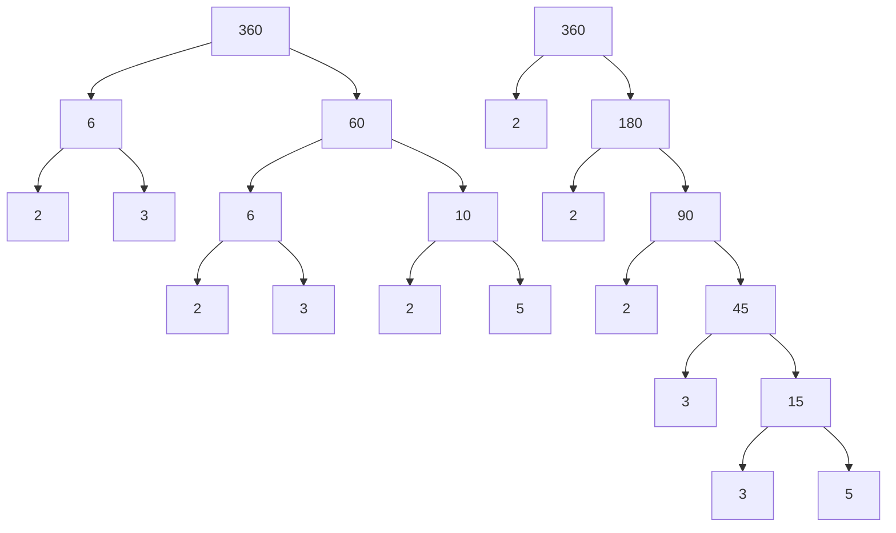

# Prime factorisation: a factor tree breaks any number into prime atoms, and every route reaches the same atoms

[Syllabus](../../../SYLLABUS.md) → [Number theory](../README.md) → [Divisibility and Primes](../README.md#s01) → Prime factorisation

---

## General Overview

A circle has 360 degrees. That is a choice, not a fact of nature: 360 takes halves, thirds, quarters, fifths, sixths, eighths, ninths and tenths without splitting a degree — 24 different equal cuts in all.

Pull it apart and you see why. Halve it: 180, 90, 45. Then thirds: 15, 5. Nothing splits further, and six numbers are left: 2, 2, 2, then 3, 3, then 5.

Now start differently. 360 = 6 × 60, then 60 = 6 × 10, then 6 = 2 × 3 and 10 = 2 × 5. The same six.

A number bigger than 1 that will not split is prime ([Primes and composites](05-primes-and-composites.md)). Splitting until every piece is prime is a **factor tree**; the primes at the ends are the **prime factorisation**.

**Split a number, split the pieces, keep going until every piece is prime. That always finishes, and whichever splits you choose you end with the same primes, each the same number of times.**

### The picture: two trees, the same ends



Left: road two, 6 × 60, then 6 × 10, then 2 × 3 and 2 × 5. Right: road one, a 2 off three times, then a 3 twice. Different middles, same ends.

---

## The formula

On our number:

**360 = 2 × 2 × 2 × 3 × 3 × 5**

Multiply those six and you get 360.

The claim underneath:

**Every whole number bigger than 1 is a product of primes, and apart from the order, it is that product and no other. This is the fundamental theorem of arithmetic.**

A prime is already finished: 7 is just 7, a tree with no branches.

| Piece | Plain meaning | In 360 |
| --- | --- | --- |
| a factor | goes in with nothing left over ([Divides](01-divides.md)) | 6, 60, 10 |
| a prime | bigger than 1, nothing goes in but 1 and itself | 2, 3, 5 |
| a factor tree | split, split the pieces, until you cannot | 360 = 6 × 60 |
| the prime factorisation | the primes at the ends, repeats and all | 2 × 2 × 2 × 3 × 3 × 5 |
| the fundamental theorem | that list is the same whichever route | three 2s, two 3s, a 5 |

---

## Why it works

### The splitting always finishes

Not prime means something other than 1 and the number itself goes in. Split there: 360 = 6 × 60. Neither piece is 1, so both are smaller than 360.

Every split shrinks the pieces, and whole numbers cannot shrink forever — the floor is 2. So each branch runs out, and stops only where its number refuses to split, which is what prime means. So every number bigger than 1 has a prime factorisation. (1 is kept out on purpose: 360 = 1 × 360 gets nowhere, and 1s could be hung on any list.)

### Why the route does not change the ends

The two trees disagree all the way down and agree at the ends.

Take the 5 that road one found. Road two's list also multiplies to 360, so 5 goes into that product — and a prime that goes into a product must go into one of the pieces. Those pieces are all prime, and a prime that 5 goes into can only be 5 itself. Cross a 5 off each list and start again; neither list runs out first.

That middle step needs a real proof — 6 goes into 4 × 3 but into neither 4 nor 3, so only primes pass it: [Why the factorisation is unique](../02-Greatest%20Common%20Divisor%20and%20Euclid%27s%20Algorithm/07-unique-factorisation.md), next shelf. Until then, the code runs two roads over every number to 1,000 and checks the ends match.

---

## Worked numbers, by hand

| Step | Arithmetic | Value |
| --- | --- | --- |
| road one, take out a 2, three times | 360 ÷ 2, ÷ 2, ÷ 2 | 180, 90, 45 |
| then a 3, twice, and 5 will not split | 45 ÷ 3, ÷ 3 | 15, 5, so **2 × 2 × 2 × 3 × 3 × 5** |
| road two, split anywhere | 360 = 6 × 60, then 60 = 6 × 10 | 6, 6, 10 |
| split the rest, then put it in order | 6 = 2 × 3, 10 = 2 × 5 | 2, 3, 2, 3, 2, 5, so **2 × 2 × 2 × 3 × 3 × 5** |

Three 2s, two 3s and a 5 are the whole of 360. Every number that divides it is built from those pieces — where the 24 cuts come from ([Counting divisors](08-counting-divisors.md)).

### What breaks if you drop a piece

| Mistake | Comes out at | What went wrong |
| --- | --- | --- |
| Stopping at 36 × 10 | 360 | Right product, wrong pieces: both split further |
| Dropping one of the 2s | 180 | Half a circle. Each repeat counts: three 2s, not two |
| Listing each prime once | 30 | How often each shows up is the rest of the answer |

---

## Code, from first principles, and it actually runs

Nothing is imported. Road one peels the smallest prime off 360, over and over. Road two follows the hand tree from the picture, one split per row. Road three splits at the biggest factor instead. The lists are sorted and compared, and roads one and three are run against each other on every number to 1,000.

### Python

```python
# Prime factorisation -- the check behind the card.  Nothing is imported.  360, the degrees in a
# circle, broken three ways: smallest prime first, the hand tree, and biggest factor first.
def smallest_prime(n): return next((d for d in range(2, n) if n % d == 0), n)   # n itself if none goes in
def peel(n):                    # road one: pull the smallest prime out, over and over
    out, chain = [], [n]
    while n > 1: p = smallest_prime(n); out.append(p); n //= p; chain.append(n)
    return out, chain
TREE = [(360, 6, 60), (60, 6, 10), (6, 2, 3), (10, 2, 5)]      # the hand tree, one split per row
def leaves(n):                  # road two: follow that tree down to the numbers that do not split
    for parent, a, b in TREE:
        if parent == n and a * b == n: return leaves(a) + leaves(b)
    return [n]
def biggest(n):                 # road three: split at the biggest factor under n, then split the pieces
    for d in range(n - 1, 1, -1):
        if n % d == 0: return biggest(d) + biggest(n // d)
    return [n]
def product(fs): return fs[0] * product(fs[1:]) if fs else 1
def show(fs): return " x ".join(str(f) for f in fs)
(one, chain), two, three = peel(360), leaves(360), biggest(360)
print(f"road one, peel the smallest prime: {' -> '.join(str(c) for c in chain)}  gives  {show(one)}")
print("the hand tree:  " + ",  ".join(f"{a} x {b} = {p}" for p, a, b in TREE))
print(f"road two, the leaves of that tree:  {show(two)};  road three, biggest factor first:  {show(three)}")
print(f"all three sorted:  {show(sorted(one))},  {show(sorted(two))},  {show(sorted(three))},  product {product(one)}")
print(f"a circle splits into equal whole-degree wedges {sum(1 for d in range(1, 361) if 360 % d == 0)} ways")
print(f"dropping one 2:  {show([2, 2, 3, 3, 5])} = {product([2, 2, 3, 3, 5])};  each prime listed once:  {show(sorted(set(one)))} = {product(sorted(set(one)))}")
print(f"stopping at 36 x 10 = {36 * 10}:  36 = {show(peel(36)[0])} and 10 = {show(peel(10)[0])}, neither is prime")
assert sorted(one) == sorted(two) == sorted(three) == [2, 2, 2, 3, 3, 5] and product(one) == 360
assert all(sorted(peel(n)[0]) == sorted(biggest(n)) and product(biggest(n)) == n and all(smallest_prime(p) == p for p in biggest(n)) for n in range(2, 1001))
print("every number from 2 to 1,000: roads one and three end at the same primes, and they multiply back")
print("ALL CHECKS PASS")
```

**Ran 2026-09-06 on macOS, Python 3.14.6, standard library only. All checks passed. Output, pasted from the run:**

```
road one, peel the smallest prime: 360 -> 180 -> 90 -> 45 -> 15 -> 5 -> 1  gives  2 x 2 x 2 x 3 x 3 x 5
the hand tree:  6 x 60 = 360,  6 x 10 = 60,  2 x 3 = 6,  2 x 5 = 10
road two, the leaves of that tree:  2 x 3 x 2 x 3 x 2 x 5;  road three, biggest factor first:  5 x 3 x 3 x 2 x 2 x 2
all three sorted:  2 x 2 x 2 x 3 x 3 x 5,  2 x 2 x 2 x 3 x 3 x 5,  2 x 2 x 2 x 3 x 3 x 5,  product 360
a circle splits into equal whole-degree wedges 24 ways
dropping one 2:  2 x 2 x 3 x 3 x 5 = 180;  each prime listed once:  2 x 3 x 5 = 30
stopping at 36 x 10 = 360:  36 = 2 x 2 x 3 x 3 and 10 = 2 x 5, neither is prime
every number from 2 to 1,000: roads one and three end at the same primes, and they multiply back
ALL CHECKS PASS
```

### Rust

Same numbers, same labels, built with `rustc --edition 2021 -O`.

```rust
// Prime factorisation -- the same check as the Python twin, in Rust.  No crates.  360, the degrees in
// a circle, broken three ways: smallest prime first, the hand tree, and biggest factor first.
fn smallest_prime(n: i64) -> i64 { (2..n).find(|d| n % d == 0).unwrap_or(n) }   // n itself if none goes in
fn peel(n: i64) -> (Vec<i64>, Vec<i64>) {       // road one: pull the smallest prime out, over and over
    let (mut out, mut chain, mut m) = (Vec::new(), vec![n], n);
    while m > 1 { let p = smallest_prime(m); out.push(p); m /= p; chain.push(m); }
    (out, chain)
}
const TREE: [(i64, i64, i64); 4] = [(360, 6, 60), (60, 6, 10), (6, 2, 3), (10, 2, 5)];   // the hand tree
fn leaves(n: i64) -> Vec<i64> {         // road two: follow that tree down to the numbers that do not split
    for (parent, a, b) in TREE {
        if parent == n && a * b == n { let mut v = leaves(a); v.extend(leaves(b)); return v; }
    }
    vec![n]
}
fn biggest(n: i64) -> Vec<i64> {        // road three: split at the biggest factor under n, then the pieces
    for d in (2..n).rev() { if n % d == 0 { let mut v = biggest(d); v.extend(biggest(n / d)); return v; } }
    vec![n]
}
fn product(fs: &[i64]) -> i64 { fs.iter().product() }
fn join(fs: &[i64], sep: &str) -> String { fs.iter().map(|f| f.to_string()).collect::<Vec<String>>().join(sep) }
fn main() {
    let ((one, chain), two, three) = (peel(360), leaves(360), biggest(360));
    println!("road one, peel the smallest prime: {}  gives  {}", join(&chain, " -> "), join(&one, " x "));
    println!("the hand tree:  {}", TREE.iter().map(|(p, a, b)| format!("{} x {} = {}", a, b, p)).collect::<Vec<String>>().join(",  "));
    println!("road two, the leaves of that tree:  {};  road three, biggest factor first:  {}", join(&two, " x "), join(&three, " x "));
    let (mut s1, mut s2, mut s3) = (one.clone(), two.clone(), three.clone()); s1.sort(); s2.sort(); s3.sort();
    println!("all three sorted:  {},  {},  {},  product {}", join(&s1, " x "), join(&s2, " x "), join(&s3, " x "), product(&one));
    println!("a circle splits into equal whole-degree wedges {} ways", (1..=360).filter(|d| 360 % d == 0).count());
    let mut once = s1.clone(); once.dedup();
    println!("dropping one 2:  {} = {};  each prime listed once:  {} = {}",
             join(&[2, 2, 3, 3, 5], " x "), product(&[2, 2, 3, 3, 5]), join(&once, " x "), product(&once));
    println!("stopping at 36 x 10 = {}:  36 = {} and 10 = {}, neither is prime",
             36 * 10, join(&peel(36).0, " x "), join(&peel(10).0, " x "));
    assert!(s1 == vec![2, 2, 2, 3, 3, 5] && s2 == s1 && s3 == s1 && product(&one) == 360);
    assert!((2..=1000).all(|n| { let (mut a, mut b) = (peel(n).0, biggest(n)); a.sort(); b.sort();
        a == b && product(&b) == n && b.iter().all(|&p| smallest_prime(p) == p) }));
    println!("every number from 2 to 1,000: roads one and three end at the same primes, and they multiply back");
    println!("ALL CHECKS PASS");
}
```

**Ran 2026-09-06 on macOS, rustc 1.98.1, no crates. All checks passed. Output, pasted from the run:**

```
road one, peel the smallest prime: 360 -> 180 -> 90 -> 45 -> 15 -> 5 -> 1  gives  2 x 2 x 2 x 3 x 3 x 5
the hand tree:  6 x 60 = 360,  6 x 10 = 60,  2 x 3 = 6,  2 x 5 = 10
road two, the leaves of that tree:  2 x 3 x 2 x 3 x 2 x 5;  road three, biggest factor first:  5 x 3 x 3 x 2 x 2 x 2
all three sorted:  2 x 2 x 2 x 3 x 3 x 5,  2 x 2 x 2 x 3 x 3 x 5,  2 x 2 x 2 x 3 x 3 x 5,  product 360
a circle splits into equal whole-degree wedges 24 ways
dropping one 2:  2 x 2 x 3 x 3 x 5 = 180;  each prime listed once:  2 x 3 x 5 = 30
stopping at 36 x 10 = 360:  36 = 2 x 2 x 3 x 3 and 10 = 2 x 5, neither is prime
every number from 2 to 1,000: roads one and three end at the same primes, and they multiply back
ALL CHECKS PASS
```

The two outputs match line for line.

> [!TIP]
> **Try changing**
> Guess first, then run it.
> - **Break a node.** Change `(10, 2, 5)` to `(10, 2, 6)`. That split no longer makes 10, so road two leaves it whole — 2 × 2 × 3 × 3 × 10 — and the first assert fires.
> - **Start somewhere else.** Use the rows `(360, 36, 10)`, `(36, 6, 6)`, `(6, 2, 3)`, `(10, 2, 5)`. Road two goes through 36, not 60, and still ends at three 2s, two 3s and a 5. Nothing fires.

---

## The usual mistake

> [!warning]
> **Thinking a number is factorised once it is split in two.** 360 = 36 × 10 is a true split, not a prime factorisation: both pieces split further. The job is done only when nothing splits further.
>
> - **Tidying away the repeats.** Each prime listed once gives 2 × 3 × 5 = 30, not 360.
> - **Expecting the route to matter.** Every road reaches the same six primes.
> - **Leaving an odd number hanging.** 45 and 15 look finished because 2 will not go in. Neither is prime.

---

## Where you meet it in real life

- **The circle itself.** Degrees survive three halvings and two cuts in thirds, because 360 is 2 × 2 × 2 × 3 × 3 × 5. [Counting divisors](08-counting-divisors.md) turns the list into the count, 24.
- **Packing a run.** A batch of 360 fills boxes of 6, 10 or 60, sizes built from its 2s, 3s and 5.
- **Splitting a rota.** Anything halved and also cut in thirds wants a 2 and a 3 in it. Shared pieces between two numbers: [Greatest common divisor](../02-Greatest%20Common%20Divisor%20and%20Euclid%27s%20Algorithm/01-gcd.md).

> **Say it back**
> Split a number into two factors, split those, until every piece is prime. That is a factor tree; its ends are the prime factorisation. It always finishes: the pieces shrink and cannot go below 2. The ends do not depend on the route: 360 is 2 × 2 × 2 × 3 × 3 × 5. Repeats count: three 2s, not one.

---

## What this builds on

- [Multiplying and dividing](../../01-Foundations/01-Everyday%20Arithmetic/03-multiplying-and-dividing.md): a split is a multiplication read backwards.
- [Primes and composites](05-primes-and-composites.md): which numbers refuse to split, and how to tell.
- [Divides](01-divides.md): goes in with nothing left over, the test at every node.

## Where this goes next

- [Counting divisors](08-counting-divisors.md): how many divisors a number has, read off this list.
- [Greatest common divisor](../02-Greatest%20Common%20Divisor%20and%20Euclid%27s%20Algorithm/01-gcd.md): two numbers side by side, and the pieces they share.
- [Why the factorisation is unique](../02-Greatest%20Common%20Divisor%20and%20Euclid%27s%20Algorithm/07-unique-factorisation.md): the proof that the route cannot change the ends.
- [There are infinitely many primes](../02-Greatest%20Common%20Divisor%20and%20Euclid%27s%20Algorithm/08-infinitude-of-primes.md): the atoms never run out.

---

## Sources

Verified 6 Sep 2026: every link below resolves to the publisher's page.

- Euclid. *Elements*, Book VII, Propositions 31 and 32, c. 300 BC. [D. E. Joyce's edition](https://mathcs.clarku.edu/~djoyce/elements/bookVII/propVII31.html). The splitting half, 2,300 years old.
- Gauss, Carl Friedrich. *Disquisitiones Arithmeticae*, Article 16, 1801; Clarke translation, Springer, 1986; reprint 2018. [doi:10.1007/978-1-4939-7560-0](https://doi.org/10.1007/978-1-4939-7560-0). One way only, repeats and all.
- Apostol, Tom M. *Introduction to Analytic Number Theory*. Springer, 1976. [doi:10.1007/978-1-4757-5579-4](https://doi.org/10.1007/978-1-4757-5579-4). Theorem 1.10, the modern statement.
