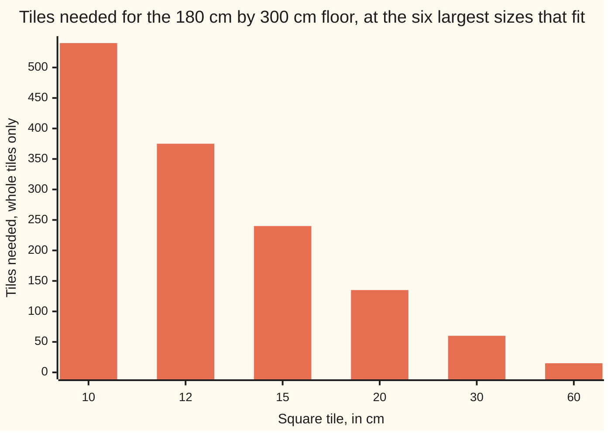

# Greatest common divisor: the biggest number that divides both, from factor lists and from prime factorisations

Number theory → Greatest Common Divisor and Euclid's Algorithm → Common factors → Greatest common divisor

---

## General Overview

The bathroom floor is 180 cm by 300 cm. You want square tiles, whole ones, no cutting, flush along both walls.

That rules almost every size out: the tile has to go into 180 exactly and into 300 exactly. Twelve sizes survive. The biggest is 60 cm — 3 across, 5 down, 15 tiles, no saw. A 30 cm tile takes 60 of them.

A number that goes into another with nothing left over **divides** it ([divides](../01-Divisibility%20and%20Primes/01-divides.md)). The sizes that work divide 180 and divide 300: the **common divisors**. The biggest is this card.

**The greatest common divisor of two whole numbers bigger than zero is the largest number that divides both: the biggest equal piece both can be cut into.**

### The picture: bigger tile, fewer tiles, and 60 stops it



One bar per size that divides both walls. They fall to the right and stop: 60 cm needs 15 tiles, nothing bigger fits.

---

## The formula

Write it gcd, with the two numbers in brackets. For any pair it is gcd(a, b) — a and b just stand for the two numbers:

**gcd(180, 300) = 60**

Said aloud: the biggest number going into both 180 and 300, nothing left over, is 60. Two roads reach it.

Road one, the lists — what divides each wall, kept where they agree:

**180 splits by: 1, 2, 3, 4, 5, 6, 9, 10, 12, 15, 18, 20, 30, 36, 45, 60, 90, 180**

**shared with 300: 1, 2, 3, 4, 5, 6, 10, 12, 15, 20, 30, 60 — the largest is 60**

Road two, the primes ([prime-factorisation](../01-Divisibility%20and%20Primes/07-prime-factorisation.md)) — kept where both hold them:

**180 = 2 × 2 × 3 × 3 × 5 and 300 = 2 × 2 × 3 × 5 × 5, shared: 2 × 2 × 3 × 5 = 60**

| Piece | Plain meaning | On our floor |
| --- | --- | --- |
| a divisor | goes in with nothing left over | 60 goes into 180 three times |
| a common divisor | goes into both numbers | the twelve sizes above |
| the greatest common divisor | the largest of those | 60 |
| the shared primes | a prime both hold, as often as the poorer side holds it | two 2s, one 3, one 5 |

---

## Why it works

### The list has a biggest member

1 divides everything, so the shared list is never empty, and nothing above 180 divides 180, so it stops. A list of whole numbers that is not empty and has a ceiling has a largest member — that follows from well-ordering, [strong-induction-and-well-ordering](../../01-Foundations/06-Proof/05-strong-induction-and-well-ordering.md).

### The shared primes settle it

Take 12 = 2 × 2 × 3. Those primes all sit in 180's list (2, 2, 3, 3, 5), so 12 goes into 180. What is left — 3 × 5 = 15 — is what 12 multiplies by: 12 × 15 = 180. Repeats count: 8 = 2 × 2 × 2 fails, because 180 has only two 2s.

So hold the lists side by side. 180 has two 2s, 300 has two: a shared number may use two. 180 has two 3s, 300 has one: one. Both have a 5, 180 only one: one. Anything dividing both is built from those primes and nothing else, so using all of them is as far as you can go — 2 × 2 × 3 × 5 = 60. Both factor routes end at the same primes — proved on [unique-factorisation](07-unique-factorisation.md).

### Every shared number hides inside the gcd

Each common divisor is built from those same primes, so each divides 60. That is why the twelve common divisors of 180 and 300 are exactly the twelve divisors of 60; the code counts both.

Factoring gets slow fast, and there is a way round it: Euclid's — divide, keep the remainder, repeat — reaches the same 60 without meeting a prime: [euclidean-algorithm](03-euclidean-algorithm.md).

---

## Worked numbers, by hand

| Step | Arithmetic | Value |
| --- | --- | --- |
| what divides each wall | count them, 180 then 300 | 18 and 18 |
| on both lists | 1, 2, 3, 4, 5, 6, 10, 12, 15, 20, 30, 60 | 12 |
| road one, the largest | the last of those | **60** |
| road two, the shared primes | 2 × 2 × 3 × 3 × 5 beside 2 × 2 × 3 × 5 × 5 | 2 × 2 × 3 × 5 = **60** |
| the tiling | 180 ÷ 60 = 3, 300 ÷ 60 = 5 | **15 tiles** |

Fifteen whole tiles, no saw.

### What breaks if you drop a piece

| Mistake | Comes out at | What went wrong |
| --- | --- | --- |
| Every prime either side has: 2 × 2 × 3 × 3 × 5 × 5 | 900 | A 900 cm tile in a 180 cm room: that is [lcm](02-lcm.md) |
| Keeping the spare 5 only 300 has | 300 | 300 does not go into 180 |
| Stopping at a size that looks big | 30 | It fits, but costs 60 tiles, not 15 |

The code prints all three.

---

## Code, from first principles, and it actually runs

Nothing is imported. Road one is brute force: every number that goes into 180, kept if it goes into 300, largest wins. Road two factors both sides and pairs the two prime lists off. A third check walks every number above 60 up to 180: none divides both.

### Python

```python
# Greatest common divisor -- the check behind the card.  Nothing is imported.  A 180 cm by 300 cm
# bathroom floor, one square tile, no cutting.  Road one lists the divisors of each side and keeps
# the largest they share.  Road two multiplies the primes they share, each at the poorer count.
A, B, SIZES = 180, 300, [10, 12, 15, 20, 30, 60]
def divisors(n): return [d for d in range(1, n + 1) if n % d == 0]
def join(xs, sep): return sep.join(str(v) for v in xs)
def primes(n):                                     # 180 -> [2, 2, 3, 3, 5]
    out, d = [], 2
    while d * d <= n:
        while n % d == 0: out.append(d); n //= d
        d += 1
    return out + ([n] if n > 1 else [])
common = [d for d in divisors(A) if B % d == 0]
big = max(common)                                  # road one, the largest shared
pool, sh, prod = primes(B), [], 1
for p in primes(A):                                # road two, the shared primes
    if p in pool: pool.remove(p); sh.append(p); prod *= p
mix, tiles = A, [(A // s) * (B // s) for s in SIZES]
for p in pool: mix *= p                            # every prime either side has
spare, second = pool[0] if pool else 1, common[-2]  # the 5 only 300 owns; the next size down
print(f"floor {A} cm by {B} cm, one square tile, no cutting")
print(f"{A} = {join(primes(A), ' x ')}, {len(divisors(A))} divisors;  {B} = {join(primes(B), ' x ')}, {len(divisors(B))} divisors")
print(f"common divisors: {join(common, ', ')}  ({len(common)} of them, and they are the {len(divisors(big))} divisors of {big})")
print(f"road one, the largest of those: {big}.  road two, the shared primes {join(sh, ' x ')}: {prod}")
print(f"at {big} cm the floor is {A // big} tiles across and {B // big} down, {tiles[5]} in all")
print(f"tiles needed at {join(SIZES, ', ')} cm: {join(tiles, ', ')}")
print(f"the three mistakes come out at {mix}, {prod * spare} and {second}")
assert big == 60 and prod == 60 and common == divisors(big) and not [d for d in range(big + 1, A + 1) if A % d == 0 and B % d == 0]
assert tiles == [540, 375, 240, 135, 60, 15] and (A // big) * (B // big) == 15
print("ALL CHECKS PASS")
```

**Ran 2026-09-06 on macOS, Python 3.14.6, standard library only. All checks passed. Output, pasted from the run:**

```
floor 180 cm by 300 cm, one square tile, no cutting
180 = 2 x 2 x 3 x 3 x 5, 18 divisors;  300 = 2 x 2 x 3 x 5 x 5, 18 divisors
common divisors: 1, 2, 3, 4, 5, 6, 10, 12, 15, 20, 30, 60  (12 of them, and they are the 12 divisors of 60)
road one, the largest of those: 60.  road two, the shared primes 2 x 2 x 3 x 5: 60
at 60 cm the floor is 3 tiles across and 5 down, 15 in all
tiles needed at 10, 12, 15, 20, 30, 60 cm: 540, 375, 240, 135, 60, 15
the three mistakes come out at 900, 300 and 30
ALL CHECKS PASS
```

### Rust

Same labels, built with `rustc --edition 2021 -O`.

```rust
// Greatest common divisor -- the same check as gcd_check.py, in Rust.  No crates.  A 180 cm by
// 300 cm bathroom floor, one square tile, no cutting.  Road one lists the divisors of each side
// and keeps the largest they share.  Road two multiplies the primes they share, at the poorer count.
const A: u64 = 180;
const B: u64 = 300;
const SIZES: [u64; 6] = [10, 12, 15, 20, 30, 60];
fn divisors(n: u64) -> Vec<u64> { (1..=n).filter(|d| n % d == 0).collect() }
fn join(xs: &[u64], sep: &str) -> String { xs.iter().map(|v| v.to_string()).collect::<Vec<String>>().join(sep) }
fn primes(mut n: u64) -> Vec<u64> {                 // 180 -> [2, 2, 3, 3, 5]
    let (mut out, mut d) = (Vec::new(), 2);
    while d * d <= n {
        while n % d == 0 { out.push(d); n /= d; }
        d += 1;
    }
    if n > 1 { out.push(n); }
    out
}

fn main() {
    let common: Vec<u64> = divisors(A).into_iter().filter(|d| B % d == 0).collect();
    let big = *common.iter().max().unwrap();        // road one, the largest shared
    let (mut pool, mut sh, mut prod) = (primes(B), Vec::new(), 1u64);
    for p in primes(A) {                            // road two, the shared primes
        if let Some(i) = pool.iter().position(|&q| q == p) { pool.remove(i); sh.push(p); prod *= p; }
    }
    let (mut mix, tiles) = (A, SIZES.iter().map(|s| (A / s) * (B / s)).collect::<Vec<u64>>());
    for p in &pool { mix *= p; }                    // every prime either side has
    let (spare, second) = (*pool.first().unwrap_or(&1), common[common.len() - 2]);  // the 5 only 300 owns; the next size down
    println!("floor {} cm by {} cm, one square tile, no cutting", A, B);
    println!("{} = {}, {} divisors;  {} = {}, {} divisors", A, join(&primes(A), " x "), divisors(A).len(), B, join(&primes(B), " x "), divisors(B).len());
    println!("common divisors: {}  ({} of them, and they are the {} divisors of {})", join(&common, ", "), common.len(), divisors(big).len(), big);
    println!("road one, the largest of those: {}.  road two, the shared primes {}: {}", big, join(&sh, " x "), prod);
    println!("at {} cm the floor is {} tiles across and {} down, {} in all", big, A / big, B / big, tiles[5]);
    println!("tiles needed at {} cm: {}", join(&SIZES, ", "), join(&tiles, ", "));
    println!("the three mistakes come out at {}, {} and {}", mix, prod * spare, second);
    assert!(big == 60 && prod == 60 && common == divisors(big) && !(big + 1..=A).any(|d| A % d == 0 && B % d == 0));
    assert!(tiles == vec![540, 375, 240, 135, 60, 15] && (A / big) * (B / big) == 15);
    println!("ALL CHECKS PASS");
}
```

**Ran 2026-09-06 on macOS, rustc 1.98.1, no crates. All checks passed. Output, pasted from the run:**

```
floor 180 cm by 300 cm, one square tile, no cutting
180 = 2 x 2 x 3 x 3 x 5, 18 divisors;  300 = 2 x 2 x 3 x 5 x 5, 18 divisors
common divisors: 1, 2, 3, 4, 5, 6, 10, 12, 15, 20, 30, 60  (12 of them, and they are the 12 divisors of 60)
road one, the largest of those: 60.  road two, the shared primes 2 x 2 x 3 x 5: 60
at 60 cm the floor is 3 tiles across and 5 down, 15 in all
tiles needed at 10, 12, 15, 20, 30, 60 cm: 540, 375, 240, 135, 60, 15
the three mistakes come out at 900, 300 and 30
ALL CHECKS PASS
```

Whole centimetres throughout: the outputs match line for line.

> [!TIP]
> **Try changing**
> Guess first, then run it; the asserts are pinned to this floor, so one will fire.
> - **Make the room square.** Set the long wall to 180: everything dividing 180 is now shared, the gcd is 180, one tile does it.
> - **Shorten the long wall to 200 cm.** The shared primes fall to 2 × 2 × 5, so the biggest tile drops to 20 cm.

---

## The usual mistake

> [!warning]
> **Taking every prime either number has, instead of only the ones they share.** That gives 2 × 2 × 3 × 3 × 5 × 5 = 900 — the smallest number both divide into, the far end from the gcd: [lcm](02-lcm.md).
>
> - Using a prime only one side owns: the spare 5 in 300 gives 300, which does not go into 180.
> - Mixing the number up with the method. gcd(180, 300) is 60, a number; finding it fast is [euclidean-algorithm](03-euclidean-algorithm.md).
> - Settling for a shared factor that looks big enough. 30 costs 60 tiles, 60 costs 15.

---

## Where you meet it in real life

- **Cutting one size to fit two lengths.** Tiles, cable drums, shelf runs: the biggest piece wasting nothing is the gcd.
- **Fractions in lowest terms.** Divide top and bottom by their gcd, done in one move: 180 over 300 becomes 3 over 5 ([fractions](../../01-Foundations/01-Everyday%20Arithmetic/07-fractions.md)).
- **Gears.** Two wheels come back into line on a cycle set by what their tooth counts share ([coprime-numbers](05-coprime-numbers.md)).

> **Say it back**
> The greatest common divisor is the largest number that goes into both with nothing left over. For a 180 cm by 300 cm floor it is 60: 3 tiles across, 5 down, 15 in all, no cutting. Find it by listing what divides each and taking the largest they share, or by keeping each shared prime as often as the poorer side has it. Everything else they share divides 60.

---

## What this builds on

- [multiplying-and-dividing](../../01-Foundations/01-Everyday%20Arithmetic/03-multiplying-and-dividing.md): dividing 180 by 60 and knowing when it comes out whole.
- [divides](../01-Divisibility%20and%20Primes/01-divides.md): what "nothing left over" means, and that divisors come in pairs.
- [prime-factorisation](../01-Divisibility%20and%20Primes/07-prime-factorisation.md): a number as a list of primes, what road two compares.

## Where this goes next

- [lcm](02-lcm.md): the other end — the first number both divide into, and why gcd times lcm is the product.
- [euclidean-algorithm](03-euclidean-algorithm.md): the same answer by remainders, fast even for numbers nobody can factor.
- [coprime-numbers](05-coprime-numbers.md): when the gcd is 1 and two numbers share nothing.

---

## Sources

Verified 6 Sep 2026; every link resolves.

- Euclid. *Elements*, Book VII, Proposition 2, c. 300 BC. [D. E. Joyce's edition](https://mathcs.clarku.edu/~djoyce/elements/bookVII/propVII2.html). The greatest common measure.
- Hardy, G. H., and E. M. Wright. *An Introduction to the Theory of Numbers*, 6th ed. Oxford University Press, 2008. [Publisher page](https://global.oup.com/academic/product/an-introduction-to-the-theory-of-numbers-9780199219865). The standard reference.
- Hammack, Richard. *Book of Proof*, 3rd ed., 2018. [Full text, free](https://richardhammack.github.io/BookOfProof/Main.pdf). Free full text.
