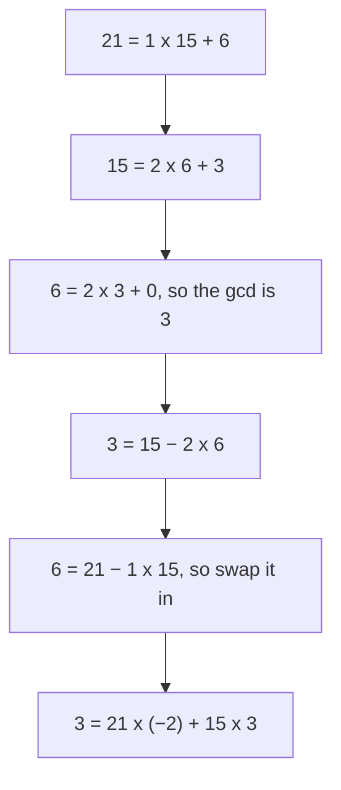

# Bezout's identity: the gcd is always a whole-number mix of the two numbers, and running Euclid backwards finds the mix

[Syllabus](../../../SYLLABUS.md) → [Number theory](../../../SYLLABUS.md#w02) → [Greatest Common Divisor and Euclid's Algorithm](../../../SYLLABUS.md#w02-s02) → Bezout's identity

---

## General Overview

Two jugs, no markings. One holds 21 litres, one holds 15. A tap, and a tub. Fill a jug and tip it in, or dip a jug out and throw that jugful away. Leave exactly 3 litres.

It works. Fill the 15 three times: 45 litres in. Dip the 21 twice and throw both away: 42 gone. Left: 3.

One line holds the session: **21 × (−2) + 15 × 3 = 3**. Pouring in counts up, throwing away counts down, so the minus sign is a real move ([Negative numbers](../../01-Foundations/01-Everyday%20Arithmetic/06-negative-numbers.md)).

The 3 is not luck: it is the greatest common divisor — gcd for short — of 21 and 15, the biggest number dividing both ([Greatest common divisor](01-gcd.md)).

**Any whole-number mix of two numbers — copies of one poured in, copies of the other thrown away — lands on a multiple of their gcd, and the gcd itself is always reachable.**

A mix's real name is an integer linear combination; the counts are the Bezout coefficients.

### The picture: down, then back up



Down: divide until the remainder is 0. Up: replace each remainder by the line above it.

---

## The formula

**21 × (−2) + 15 × 3 = −42 + 45 = 3**

In general: **first number × its count + second number × its count = their gcd.**

**Read it aloud: two jugfuls of the 21 thrown away, three of the 15 poured in, 3 litres left.**

| Piece | Plain meaning | In our jugs |
| --- | --- | --- |
| the two numbers | what the jugs hold | 21 and 15 |
| a count (a Bezout coefficient) | jugfuls, minus meaning thrown away | −2 and 3 |
| a mix (an integer linear combination) | each number times its count, added | 21 × (−2) + 15 × 3 |
| the gcd | biggest number dividing both; mixes reach its multiples | 3 |

---

## Why it works

### Step 0: a mix can only reach multiples of a shared divisor

3 divides 21 and 3 divides 15. Copies of a multiple of 3 stay multiples of 3, and so does their sum ([Divides](../01-Divisibility%20and%20Primes/01-divides.md)). So every mix of these jugs is a multiple of 3 — nothing between 0 and 3 is reachable.

### Step 1: rearrange Euclid's chain

The chain's three lines are in the picture ([Euclid's algorithm](03-euclidean-algorithm.md)). Stand the remainders on their own:

- 6 = 21 − 1 × 15
- 3 = 15 − 2 × 6

### Step 2: walk back up, swapping in

The second line mixes 15 and 6, and 6 is not a jug. The first says what 6 is, so swap it in:

3 = 15 − 2 × (21 − 1 × 15)

Multiply out and gather like pieces ([The three rearranging laws](../../01-Foundations/01-Everyday%20Arithmetic/05-arithmetic-laws.md)):

3 = 21 × (−2) + 15 × 3

Only the jugs are left: those are the pours.

Nothing here can fail: every chain stops, every line rearranges, and a mix swapped into a mix is still a mix ([Euclid's algorithm](03-euclidean-algorithm.md); careful form on [Strong induction and the least element](../../01-Foundations/06-Proof/05-strong-induction-and-well-ordering.md)).

Step 0 rules out everything below the gcd; Step 2 reaches it. So the gcd is the smallest amount above zero the tub can hold: biggest thing dividing both, smallest thing you can build.

### There is never just one answer

Pour 5 more of the 21 in and throw 7 more of the 15 away. They cancel: both are 105. The 5 is 15 ÷ 3, the 7 is 21 ÷ 3 — each jug over the gcd. The counts move with it: −2 + 5 = 3, 3 − 7 = −4.

21 × 3 + 15 × (−4) = 63 − 60 = 3

Either direction, forever: infinitely many pairs, all leaving 3 litres.

---

## Worked numbers, by hand

| Step | Arithmetic | Value |
| --- | --- | --- |
| divide 21 by 15 | 21 = 1 × 15 + 6 | 6 |
| divide 15 by 6 | 15 = 2 × 6 + 3 | 3 |
| divide 6 by 3, and stop | 6 = 2 × 3 + 0 | 0 |
| swap the 6 out | 3 = 15 − 2 × (21 − 1 × 15) | — |
| gather | 21 × (−2) + 15 × 3 = −42 + 45 | **3** |
| slide one step | 21 × 3 + 15 × (−4) | **3** |

### What breaks if you drop a piece

| Mistake | Comes out at | What went wrong |
| --- | --- | --- |
| Pouring in only | 87 | 21 × 2 + 15 × 3; positive counts only fill |
| Reading the leftover as a jug | −27 | 3 = 15 − 2 × 6 is right; 21 in place of the 6 gives 15 − 42 |
| Swapping the counts | 33 | 21 × 3 + 15 × (−2); a count belongs to its number |

The code prints all three.

---

## Code, from first principles, and it actually runs

Nothing is imported. Road one runs Euclid's chain on 21 and 15, then walks it backwards until only the jugs remain. Road two tries every small mix: does anything above zero beat 3, does 1 or 2 turn up? A third route to the gcd — just listing the divisors — pins Euclid's answer.

### Python

```python
# Bezout's identity -- the check behind the card.  Nothing is imported.  Two
# jugs, 21 and 15 litres.  Road one: Euclid's chain, walked backwards, to write
# 3 as a mix of 21 and 15.  Road two: try every small mix and see what turns up.
A, B = 21, 15

def listing_gcd(a, b):            # independent of Euclid: list the divisors
    return max(d for d in range(1, min(a, b) + 1) if a % d == 0 and b % d == 0)

chain, a, b = [], A, B
while b:
    chain.append((a, a // b, b, a % b))
    a, b = b, a % b
g = a
print(f"{'gcd(21, 15) by Euclid':<38}{g:>4}")
for (u, q, v, r) in chain:
    print(f"{u} = {q} x {v} + {r}")
p, s = 1, -chain[-2][1]           # the last useful line: 3 = 15 - 2 x 6
for (u, q, v, r) in reversed(chain[:-2]):
    p, s = s, p - s * q           # swap in the line above it
print(f"Bezout: 21 x {p} + 15 x {s} = {A * p} + {B * s} = {A * p + B * s}")
p2, s2 = p + B // g, s - A // g   # slide along by one whole step
print(f"one step along (21 x {B // g} = 15 x {A // g} = {A * (B // g)}): 21 x {p2} + 15 x {s2} = {A * p2} + {B * s2} = {A * p2 + B * s2}")
mixes = [A * i + B * j for i in range(-9, 10) for j in range(-9, 10)]
print(f"{'smallest mix above zero, by search':<38}{min(m for m in mixes if m > 0):>4}")
print(f"{'mixes that land on 1 or 2 litres':<38}{sum(m in (1, 2) for m in mixes):>4}")
print(f"the three mistakes come out at {A * 2 + B * 3}, {B - 2 * A} and {A * 3 - B * 2}")
assert g == 3 and g == listing_gcd(A, B)
assert (p, s) == (-2, 3) and A * p + B * s == g and A * p2 + B * s2 == g
assert min(m for m in mixes if m > 0) == g and 1 not in mixes and 2 not in mixes
print("ALL CHECKS PASS")
```

**Ran 2026-09-06 on macOS, Python 3.14.6, standard library only. All checks passed. Output, pasted from the run:**

```
gcd(21, 15) by Euclid                    3
21 = 1 x 15 + 6
15 = 2 x 6 + 3
6 = 2 x 3 + 0
Bezout: 21 x -2 + 15 x 3 = -42 + 45 = 3
one step along (21 x 5 = 15 x 7 = 105): 21 x 3 + 15 x -4 = 63 + -60 = 3
smallest mix above zero, by search       3
mixes that land on 1 or 2 litres         0
the three mistakes come out at 87, -27 and 33
ALL CHECKS PASS
```

### Rust

Same numbers, same labels, built with `rustc --edition 2021 -O`.

```rust
// Bezout's identity -- the same check as the Python twin, in Rust.  No crates.
// Two jugs, 21 and 15 litres.  Road one: Euclid's chain, walked backwards, to
// write 3 as a mix of 21 and 15.  Road two: try every small mix and look.
const A: i64 = 21;
const B: i64 = 15;

fn listing_gcd(a: i64, b: i64) -> i64 {   // independent of Euclid: list the divisors
    (1..=a.min(b)).filter(|d| a % d == 0 && b % d == 0).max().unwrap()
}

fn main() {
    let (mut a, mut b) = (A, B);
    let mut chain: Vec<(i64, i64, i64, i64)> = Vec::new();
    while b != 0 { let t = a % b; chain.push((a, a / b, b, t)); a = b; b = t; }
    let g = a;
    println!("{:<38}{:>4}", "gcd(21, 15) by Euclid", g);
    for &(u, q, v, r) in &chain { println!("{} = {} x {} + {}", u, q, v, r); }
    let n = chain.len();
    let (mut p, mut s) = (1, -chain[n - 2].1);   // the last useful line: 3 = 15 - 2 x 6
    for &(_, q, _, _) in chain[..n - 2].iter().rev() { let (np, ns) = (s, p - s * q); p = np; s = ns; }
    println!("Bezout: 21 x {} + 15 x {} = {} + {} = {}", p, s, A * p, B * s, A * p + B * s);
    let (p2, s2) = (p + B / g, s - A / g);       // slide along by one whole step
    println!("one step along (21 x {} = 15 x {} = {}): 21 x {} + 15 x {} = {} + {} = {}", B / g, A / g, A * (B / g), p2, s2, A * p2, B * s2, A * p2 + B * s2);
    let mut mixes: Vec<i64> = Vec::new();
    for i in -9..=9 { for j in -9..=9 { mixes.push(A * i + B * j); } }
    let best = *mixes.iter().filter(|&&m| m > 0).min().unwrap();
    let hits = mixes.iter().filter(|&&m| m == 1 || m == 2).count();
    println!("{:<38}{:>4}", "smallest mix above zero, by search", best);
    println!("{:<38}{:>4}", "mixes that land on 1 or 2 litres", hits);
    println!("the three mistakes come out at {}, {} and {}", A * 2 + B * 3, B - 2 * A, A * 3 - B * 2);
    assert!(g == 3 && g == listing_gcd(A, B));
    assert!(p == -2 && s == 3 && A * p + B * s == g && A * p2 + B * s2 == g);
    assert!(best == g && !mixes.contains(&1) && !mixes.contains(&2));
    println!("ALL CHECKS PASS");
}
```

**Ran 2026-09-06 on macOS, rustc 1.98.1, no crates. All checks passed. Output, pasted from the run:**

```
gcd(21, 15) by Euclid                    3
21 = 1 x 15 + 6
15 = 2 x 6 + 3
6 = 2 x 3 + 0
Bezout: 21 x -2 + 15 x 3 = -42 + 45 = 3
one step along (21 x 5 = 15 x 7 = 105): 21 x 3 + 15 x -4 = 63 + -60 = 3
smallest mix above zero, by search       3
mixes that land on 1 or 2 litres         0
the three mistakes come out at 87, -27 and 33
ALL CHECKS PASS
```

Both outputs match line for line.

> [!TIP]
> **Try changing**
> Guess first, then run. The asserts are pinned to these jugs, so one will fire.
> - **Make the jugs 21 and 14.** The gcd becomes 7, and 3 litres turns impossible.
> - **Ban throwing away.** Start the search at 0, not −9. The smallest mix above zero jumps to 15.

---

## The usual mistake

> [!warning]
> **Thinking both counts have to be positive.** Usually one is not. Throwing a jugful away is what lets 21 and 15 land on something as small as 3.
>
> - **Reading the counts off the chain.** The multipliers 1, 2, 2 down the chain (the quotients) are ingredients; only the walk back up turns them into −2 and 3.
> - **Reading the leftover as a jug.** Stop one line early and 3 = 15 − 2 × 6 is right. Write 21 where the 6 stands: 15 − 42 = −27.
> - **Expecting one right pair.** −2 and 3 is an answer, not the answer. So is 3 and −4.

---

## Where you meet it in real life

- **Undoing a multiplication on a clock.** What to multiply by to get back to 1 is exactly this, and needs gcd 1: [The modular inverse](../03-Clock%20Arithmetic/04-modular-inverse.md).
- **Sharing no factors.** With gcd 1 the mix lands on 1 itself, the hinge of [Coprime numbers](05-coprime-numbers.md) and [Euclid's lemma](06-euclids-lemma.md).
- **Measuring puzzles and gear teeth.** A target is reachable exactly when the gcd divides it: 21 and 15 can leave 6 or 9 litres, never 4, and two cogs line up on the multiples of their gcd.

> **Say it back**
> Pour copies of one number in, throw copies of the other away, and what is left is a multiple of their gcd — so 21 and 15 can never leave 1 or 2 litres. The gcd itself is always reachable: run Euclid down to it, then walk back up, swapping remainders out. Here, 21 × (−2) + 15 × 3 = 3. Slide by each jug over the gcd for another pair, forever.

---

## What this builds on

- [Greatest common divisor](01-gcd.md): the greatest common divisor, the number every mix is a multiple of.
- [Negative numbers](../../01-Foundations/01-Everyday%20Arithmetic/06-negative-numbers.md): a negative count is a jugful thrown away.
- [The three rearranging laws](../../01-Foundations/01-Everyday%20Arithmetic/05-arithmetic-laws.md): multiplying out the bracket, gathering like pieces.
- [Euclid's algorithm](03-euclidean-algorithm.md): the chain that finds the gcd and, backwards, the counts.

## Where this goes next

- [Coprime numbers](05-coprime-numbers.md): what changes when the gcd is 1 and the mix lands on 1.
- [Euclid's lemma](06-euclids-lemma.md): multiply that mix by another number; a prime dividing a product must divide a factor.
- [The modular inverse](../03-Clock%20Arithmetic/04-modular-inverse.md): the same counts, dividing on a clock.

---

## Sources

Verified 6 Sep 2026: every link below resolves.

- Euclid. *Elements*, Book VII, Proposition 2 (c. 300 BC), trans. David E. Joyce. [Clark University edition](https://mathcs.clarku.edu/~djoyce/elements/bookVII/propVII2.html). The chain, and Step 0, in Greek.
- Knuth, Donald E. *The Art of Computer Programming, Volume 2*, 3rd ed. Addison-Wesley, 1997. [Publisher page](https://www.informit.com/store/art-of-computer-programming-volume-2-seminumerical-9780201896848). Section 4.5.2, counts carried down the chain instead.
- O'Connor, J. J., and E. F. Robertson. "Étienne Bézout." *MacTutor History of Mathematics Archive*, University of St Andrews. [Biography](https://mathshistory.st-andrews.ac.uk/Biographies/Bezout/). Where the name came from.
