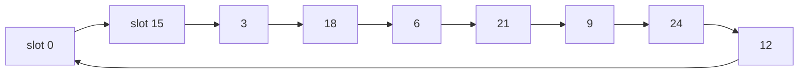

# Coprime numbers: sharing no factor but 1, and why that one condition unlocks so much

[Syllabus](../../../SYLLABUS.md) → [Number theory](../README.md) → [Greatest Common Divisor and Euclid's Algorithm](../README.md#s02) → Coprime numbers

---

## General Overview

A small gear with 15 teeth drives a bigger one with 28 teeth. Number the teeth 0 to 14 and the slots 0 to 27. Tooth 0 drops into slot 0. One full turn of the small gear advances the big one 15 slots, so tooth 0 comes back down at slot 15, then 2, then 17.

Keep turning. Tooth 0 visits all 28 slots before it repeats, and so does every tooth: 420 tooth-and-slot pairings, all 420 used, so a rough tooth wears a little off every slot.

Swap in a 27-tooth gear. Tooth 0 now meets slots 0, 15, 3, 18, 6, 21, 9, 24, 12 — nine of them — then repeats forever. Only 135 of the 405 pairings happen, and the tooth grinds those nine slots.

One number does that: 15 and 27 both divide by 3; 15 and 28 divide by nothing but 1.

**Two numbers are coprime when the only whole number that divides both of them is 1 — their greatest common divisor is 1.**

### The picture: where tooth 0 can land on the 27-gear



Each arrow is one turn of the small gear: nine slots, all multiples of 3, then back to the start. On the 28-tooth gear the walk visits all 28.

---

## The formula

The whole test is one number:

**the greatest common divisor of 15 and 28 = 1**

The greatest common divisor, gcd for short, is the biggest whole number going into both with nothing left over ([Greatest common divisor](01-gcd.md)). When it is 1 the pair is **coprime**.

The same fact in the form that does the work:

**28 × 7 − 15 × 13 = 1**

**Read it aloud:** seven 28s take away thirteen 15s lands exactly on 1 — only a coprime pair can.

| Piece | Plain meaning | In our gears |
| --- | --- | --- |
| a common factor | goes into both, nothing over | 1 for 15 and 28; 1 and 3 for 15 and 27 |
| greatest common divisor | the biggest common factor ([Greatest common divisor](01-gcd.md)) | 1 here, 3 for 15 and 27 |
| coprime | that divisor is 1 | 15 and 28 |
| a whole-number mix | so many of one, less so many of the other ([Bezout's identity](04-bezouts-identity.md)) | 28 × 7 − 15 × 13 |

---

## Why it works

### Step 0: a shared factor rules everything you build

3 goes into 15 five times and into 27 nine times, so both are whole numbers of 3s. Mix them however you like: the total is still a whole number of 3s, never 1. The smallest they build is 3 itself: 27 × 4 − 15 × 7 = 3.

### Step 1: coprime is exactly "some mix of them equals 1"

Forward: Bezout's identity ([Bezout's identity](04-bezouts-identity.md)) says the greatest common divisor is always a mix of the two. For 15 and 28 it is 1, so some mix is 1: 28 × 7 − 15 × 13.

Back: suppose a mix equals 1. Anything dividing both numbers divides everything built from them, so it divides that mix, so it divides 1 — so it is 1. A direct proof ([Direct proof](../../01-Foundations/06-Proof/01-direct-proof.md)), three lines. **Coprime is a licence to build 1**, not merely a shortage of shared factors.

### Step 2: neighbours are always coprime

28 − 27 = 1 is already a mix equal to 1, so 27 and 28 are coprime. Nothing about them was special: any neighbours are.

### Step 3: lowest terms means coprime

15/27 cancels: divide both by 3 to get 5/9. 15/28 does not cancel at all. A fraction is in lowest terms exactly when top and bottom are coprime ([Fractions](../../01-Foundations/01-Everyday%20Arithmetic/07-fractions.md)).

### Step 4: back to the gears

Tooth 0 comes home after a run of teeth that is a whole number of both counts: their least common multiple ([Least common multiple](02-lcm.md)), the counts multiplied then divided by the shared factor. Factor 1 gives the full 420; factor 3 gives 135 of the 405, and tooth 0 sees 9 slots.

---

## Worked numbers, by hand

| Step | Arithmetic | Value |
| --- | --- | --- |
| shared factor of 15 and 28 | Euclid ([Euclid's algorithm](03-euclidean-algorithm.md)) | **1** |
| the same, by a mix | 28 × 7 − 15 × 13 | **1** |
| pairings used, of 420 | 15 × 28 | **420** |
| shared factor of 15 and 27 | Euclid | **3** |
| slots tooth 0 meets, 27-gear | 0, 15, 3, 18, 6, 21, 9, 24, 12 | 9 |
| pairings used, of 405 | 15 × 9 | **135** |
| 15/27 in lowest terms | divide by 3 | **5/9** |

The coprime pair uses every pairing; the other, one in three.

### What breaks if you drop a piece

| Mistake | Comes out at | What went wrong |
| --- | --- | --- |
| Fitting a 27-tooth gear | 135 | The shared 3 costs two thirds of the pairings |
| Mixing 15 and 27 to get 1 | 3 | The smallest positive mix is the shared factor |
| Counting all 27 slots as met | 9 | Only multiples of 3 come round |

The code prints all three.

---

## Code, from first principles, and it actually runs

Nothing is imported. Each pair is done twice: Euclid's algorithm for the shared factor, and walking the small gear round the big one for the pairings. The mix is a third road.

### Python

```python
# Coprime numbers -- the check behind the card.  Nothing is imported.  Two
# meshing gears, 15 teeth and 28 teeth, then 15 and 27 for contrast.  Euclid
# finds the shared factor; a whole-number mix of the two is the second road.
def gcd(a, b):                       # Euclid: keep the remainder, repeat
    while b:
        a, b = b, a % b
    return a
def meets(small, big):               # slots of the big gear that tooth 0 meets
    seen, step = [0], small
    while step % big:
        seen.append(step % big)
        step += small
    return seen
def row(name, value):
    print(f"{name:<42}{value:>7}")
for small, big in ((15, 28), (15, 27)):
    g = gcd(small, big)
    met = meets(small, big)
    row(f"gcd of {small} and {big}, by Euclid", g)
    row(f"slots of the {big}-gear that tooth 0 meets", len(met))
    row(f"tooth pairs used, of the {small * big} there are", small * len(met))
    row(f"{small}/{big} in lowest terms", f"{small // g}/{big // g}")
row("the mix 28 x 7 - 15 x 13", 28 * 7 - 15 * 13)
row("the mix 27 x 4 - 15 x 7, the smallest", 27 * 4 - 15 * 7)
print("slots of the 27-gear tooth 0 meets: " + " ".join(str(t) for t in meets(15, 27)))
assert gcd(15, 28) == 1 and 28 * 7 - 15 * 13 == 1 and meets(15, 28)[:4] == [0, 15, 2, 17]
assert len(meets(15, 28)) == 28 and 15 * len(meets(15, 28)) == 15 * 28
assert gcd(15, 27) == 3 and len(meets(15, 27)) == 27 // 3 and 15 * len(meets(15, 27)) == 135
print("ALL CHECKS PASS")
```

**Ran 2026-09-06 on macOS, Python 3.14.6, standard library only. All checks passed. Output, pasted from the run:**

```
gcd of 15 and 28, by Euclid                     1
slots of the 28-gear that tooth 0 meets        28
tooth pairs used, of the 420 there are        420
15/28 in lowest terms                       15/28
gcd of 15 and 27, by Euclid                     3
slots of the 27-gear that tooth 0 meets         9
tooth pairs used, of the 405 there are        135
15/27 in lowest terms                         5/9
the mix 28 x 7 - 15 x 13                        1
the mix 27 x 4 - 15 x 7, the smallest           3
slots of the 27-gear tooth 0 meets: 0 15 3 18 6 21 9 24 12
ALL CHECKS PASS
```

### Rust

Same numbers, same labels, built with `rustc --edition 2021 -O`.

```rust
// Coprime numbers -- the same check as coprime_numbers_check.py, in Rust.  No
// crates.  Two meshing gears, 15 teeth and 28 teeth, then 15 and 27 for
// contrast.  Euclid finds the shared factor; a whole-number mix is the second road.
fn gcd(mut a: i64, mut b: i64) -> i64 {      // Euclid: keep the remainder, repeat
    while b != 0 { let r = a % b; a = b; b = r; }
    a
}
fn meets(small: i64, big: i64) -> Vec<i64> { // slots of the big gear that tooth 0 meets
    let (mut seen, mut step) = (vec![0], small);
    while step % big != 0 {
        seen.push(step % big);
        step += small;
    }
    seen
}
fn row(name: &str, value: &str) { println!("{:<42}{:>7}", name, value); }
fn main() {
    for (small, big) in [(15i64, 28i64), (15, 27)] {
        let g = gcd(small, big);
        let met = meets(small, big);
        row(&format!("gcd of {} and {}, by Euclid", small, big), &g.to_string());
        row(&format!("slots of the {}-gear that tooth 0 meets", big), &met.len().to_string());
        row(&format!("tooth pairs used, of the {} there are", small * big),
            &(small * met.len() as i64).to_string());
        row(&format!("{}/{} in lowest terms", small, big),
            &format!("{}/{}", small / g, big / g));
    }
    row("the mix 28 x 7 - 15 x 13", &(28 * 7 - 15 * 13).to_string());
    row("the mix 27 x 4 - 15 x 7, the smallest", &(27 * 4 - 15 * 7).to_string());
    let list: Vec<String> = meets(15, 27).iter().map(|t| t.to_string()).collect();
    println!("slots of the 27-gear tooth 0 meets: {}", list.join(" "));
    assert!(gcd(15, 28) == 1 && 28 * 7 - 15 * 13 == 1 && meets(15, 28)[..4] == [0, 15, 2, 17]);
    assert!(meets(15, 28).len() == 28 && 15 * meets(15, 28).len() == 15 * 28);
    assert!(gcd(15, 27) == 3 && meets(15, 27).len() == 27 / 3 && 15 * meets(15, 27).len() == 135);
    println!("ALL CHECKS PASS");
}
```

**Ran 2026-09-06 on macOS, rustc 1.98.1, no crates. All checks passed. Output, pasted from the run:**

```
gcd of 15 and 28, by Euclid                     1
slots of the 28-gear that tooth 0 meets        28
tooth pairs used, of the 420 there are        420
15/28 in lowest terms                       15/28
gcd of 15 and 27, by Euclid                     3
slots of the 27-gear that tooth 0 meets         9
tooth pairs used, of the 405 there are        135
15/27 in lowest terms                         5/9
the mix 28 x 7 - 15 x 13                        1
the mix 27 x 4 - 15 x 7, the smallest           3
slots of the 27-gear tooth 0 meets: 0 15 3 18 6 21 9 24 12
ALL CHECKS PASS
```

Both outputs match line for line.

> [!TIP]
> **Try changing**
> Guess first, then run it.
> - **Fit a 30-tooth gear.** Change the first pair in the loop to (15, 30). They share 15, so tooth 0 meets 2 of the 30 slots and only 30 of the 450 pairings happen.
> - **Break the mix.** Change 28 × 7 − 15 × 13 to 28 × 7 − 15 × 12 in the printed row *and* in the first assert: the row prints 16, not 1, and that assert fires.

---

## The usual mistake

> [!warning]
> **Reading coprime as "both prime".** 15 is 3 × 5 and 28 is 2 × 2 × 7. Neither is prime, yet they are coprime: no factor turns up in both lists. Coprime is a fact about a pair, never about one number.
>
> - "No common factor" is never true: 1 divides everything. The test is no common factor **except** 1.
> - Expecting any pair to reach 1. Mix 15 and 27 how you like; you cannot get below 3.
> - Thinking coprime pairs are rare. Any pair of neighbours is coprime.

---

## Where you meet it in real life

- **Gear and chain design.** A "hunting tooth" is added to make the counts coprime, so wear spreads over 420 pairings instead of 135.
- **Fractions in lowest terms.** Reducing hunts the shared factor; stop when top and bottom are coprime: [Fractions](../../01-Foundations/01-Everyday%20Arithmetic/07-fractions.md).
- **Cicadas.** Some broods surface on a prime number of years, coprime with the cycles of what eats them, so the two seldom peak together.

> **Say it back**
> Two numbers are coprime when nothing but 1 divides both. 15 and 28 are; 15 and 27 share a 3. Coprime also means some mix of the two lands exactly on 1, which is what makes such a pair useful elsewhere. In the gearbox every tooth meets every slot, so wear spreads instead of digging in.

---

## What this builds on

- [Fractions](../../01-Foundations/01-Everyday%20Arithmetic/07-fractions.md): cancelling until nothing goes into both. That end state is coprimality.
- [Greatest common divisor](01-gcd.md): the greatest common divisor, the number this card sets to 1.
- [Bezout's identity](04-bezouts-identity.md): the divisor is always a mix of the two, turning coprime into "some mix equals 1".

## Where this goes next

- [Euclid's lemma](06-euclids-lemma.md): a prime dividing a product divides one of the factors, proved by mixing to 1.
- [The modular inverse](../03-Clock%20Arithmetic/04-modular-inverse.md): undoing a multiplication on a clock face needs a coprime multiplier.
- [Solving a x ≡ b (mod n)](../03-Clock%20Arithmetic/05-linear-congruences.md): which remainder puzzles have answers, decided by the shared factor.
- [The Chinese remainder theorem](../03-Clock%20Arithmetic/06-chinese-remainder-theorem.md): two remainders pin down one number when the counts are coprime.

---

## Sources

Verified 6 Sep 2026; every link resolves.

- Euclid. *Elements*, Book VII, Proposition 22, c. 300 BC. [D. E. Joyce's edition](https://mathcs.clarku.edu/~djoyce/elements/bookVII/propVII22.html). Lowest terms and coprime, one theorem, 2,300 years old.
- Graham, Ronald L., Donald E. Knuth and Oren Patashnik. *Concrete Mathematics*, 2nd ed. Addison-Wesley, 1994. [Publisher page](https://www.informit.com/store/concrete-mathematics-a-foundation-for-computer-science-9780201558029). Section 4.5, "Relative primality".
- Apostol, Tom M. *Introduction to Analytic Number Theory*. Springer, 1976. [doi:10.1007/978-1-4757-5579-4](https://doi.org/10.1007/978-1-4757-5579-4). Chapter 1, the greatest common divisor.
