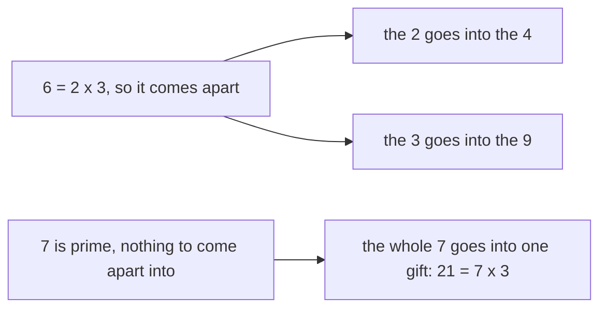

# Euclid's lemma: if a prime divides a product it divides one of the factors, and composites carry no such promise

Number theory → Greatest Common Divisor and Euclid's Algorithm → Why factorisation is unique → Euclid's lemma

---

## General Overview

Four people chip in $21 each for a leaving present. That is $84, in 4 gifts of $21.

7 divides the $84: 84 = 7 × 12. And 7 does not divide the 4, so it had to land in a gift. Look inside one: 21 = 7 × 3. Not luck — 7 is prime.

Leave the office a moment. Take 36, as 4 × 9. 6 divides 36 but neither the 4 nor the 9. The 6 came apart on the way: it is 2 × 3, the 2 into the 4, the 3 into the 9.

**A prime that divides a product divides one of the numbers multiplied. A composite can split its factors across the two and divide neither.**

### The picture: a composite splits, a prime cannot



A composite sends its factors two ways; a prime has nothing to send.

---

## The formula

In this office:

**7 divides 4 × 21, and 7 does not divide 4, so 7 divides 21.**

**Read it aloud:** the prime is in the total, not in the gift count, so it is in the gift.

| Piece | Plain meaning | In our office |
| --- | --- | --- |
| a prime | above 1, divisible only by 1 and itself ([primes-and-composites](../01-Divisibility%20and%20Primes/05-primes-and-composites.md)) | 7 |
| a composite | above 1, not prime, so it splits into factors | 6 = 2 × 3 |
| divides | goes in, nothing left over | 84 = 7 × 12 |
| a mix landing on 1 | copies of one added, copies of the other taken away ([bezouts-identity](04-bezouts-identity.md)) | 4 × 2 + 7 × (−1) |

---

## Why it works

### Step 0: a prime shares nothing with a number it misses

Only 1 and 7 divide 7, so 7 and 4 can share only 1 or 7. But 7 misses the 4: sharing 4 by 7 leaves 4. So the biggest shared number is 1 — they are coprime ([coprime-numbers](05-coprime-numbers.md)).

### Step 1: coprime gives a mix landing on 1

Bezout's identity ([bezouts-identity](04-bezouts-identity.md)): the biggest shared factor is always a mix of the two — copies of one added, copies of the other taken away. Here that factor is 1:

**4 × 2 + 7 × (−1) = 1**

### Step 2: multiply that line by the gift

Multiply both sides by 21:

**84 × 2 + 147 × (−1) = 21**

The 84 is 4 × 21; the 147 is 7 × 21.

### Step 3: the 7 is inside both terms on the left

84 = 7 × 12, so 84 × 2 = 7 × 24. And 147 = 7 × 21. Pull the 7 out:

**7 × 24 − 7 × 21 = 7 × (24 − 21) = 7 × 3**

The left side is 21, so 21 = 7 × 3: the 7 is in the gift. A direct proof ([direct-proof](../../01-Foundations/06-Proof/01-direct-proof.md)), arithmetic the whole way. Nothing in it needed these numbers — only that the divider is prime and misses one side.

### Step 4: where a composite falls out

6 dies at Step 0. 6 and 4 share the factor 2, so every mix of them is even: nothing lands on 1, no line to multiply. And 6 divides 36 but neither the 4 nor the 9.

The tempting route: 84's primes are 2, 2, 3 and 7, so the 7 lands on one side. But that leans on every number having one fixed list of primes — proved *from* this lemma. [unique-factorisation](07-unique-factorisation.md) runs them in that order.

---

## Worked numbers, by hand

The office, in dollars.

| Step | Arithmetic | Value |
| --- | --- | --- |
| the money raised | 4 × 21 | 84 |
| the 7 in the total | 84 = 7 × 12 | 12 |
| the 7 in the gift count | 4 shared by 7, remainder | 4 |
| a mix landing on 1 | 4 × 2 + 7 × (−1) | 1 |
| that line, times 21 | 84 × 2 + 147 × (−1) | 21 |
| pull the 7 out of the left | 24 − 21 | **3** |

So 21 = 7 × 3, remainder 0: the prime that divided the total sits inside the gift.

### What breaks if you drop a piece

| Mistake | Comes out at | What went wrong |
| --- | --- | --- |
| Using 6, not a prime | 4 and 3 | 6 divides 36, but 4 shared by 6 leaves 4, 9 leaves 3 |
| Building 1 out of 6 and 4 | 2 | Their shared factor is 2, so every mix is even |

The code prints both.

---

## Code, from first principles, and it actually runs

Nothing is imported. The plain road divides 84 by 7, then 21 by 7. The second never divides 21 by 7: it finds the mix landing on 1, multiplies by 21, pulls the 7 out and reads the rest. Both give 3.

### Python

```python
# Euclid's lemma -- the check behind the card.  Nothing is imported.  $84 raised
# as 4 gifts of $21: 7 divides the total, and so has to divide a gift.  Then 6,
# not a prime, dividing 4 x 9 = 36 while dividing neither the 4 nor the 9.
P, A, B = 7, 4, 21               # the prime, the number of gifts, one gift
C, U, V = 6, 4, 9                # the composite, and the pair it splits between

def listing_gcd(a, b):           # second road to a shared factor: list divisors
    return max(d for d in range(1, min(a, b) + 1) if a % d == 0 and b % d == 0)

def row(name, value):
    print(f"{name:<40}{value:>4}")

total = A * B
x = next(i for i in range(1, P) if (A * i) % P == 1)   # copies of 4 landing on 1
y = (1 - A * x) // P
row(f"{A} gifts of ${B}, the money raised", total)
print(f"{total} shared by {P}: {total} = {P} x {total // P} + {total % P}")
row(f"the {A} gifts shared by {P}, remainder", A % P)
row(f"shared factor of {P} and {A}, by listing", listing_gcd(P, A))
print(f"a mix landing on 1: {A} x {x} + {P} x {y} = {A * x + P * y}")
print(f"times {B}: {total} x {x} + {P * B} x {y} = {total * x + P * B * y}")
print(f"{total} x {x} = {P} x {(total // P) * x}, {P * B} = {P} x {B}, so {B} = {P} x {(total // P) * x + B * y}")
row(f"the ${B} gift shared by {P}, remainder", B % P)
row(f"{U} x {V} = {U * V} shared by {C}, remainder", (U * V) % C)
print(f"but {C} into {U} leaves {U % C}, {C} into {V} leaves {V % C}, gcd({C}, {U}) = {listing_gcd(C, U)}")
assert total == 84 and total % P == 0 and A % P == 4 and B % P == 0
assert A * x + P * y == 1 and total * x + P * B * y == B and (total // P) * x + B * y == B // P == 3
assert (U * V) % C == 0 and U % C == 4 and V % C == 3 and listing_gcd(C, U) == 2
assert C % 2 == 0 and U % 2 == 0   # both even, so every mix of them is even, never 1
print("ALL CHECKS PASS")
```

**Ran 2026-09-06 on macOS, Python 3.14.6, standard library only. All checks passed. Output, pasted from the run:**

```
4 gifts of $21, the money raised          84
84 shared by 7: 84 = 7 x 12 + 0
the 4 gifts shared by 7, remainder         4
shared factor of 7 and 4, by listing       1
a mix landing on 1: 4 x 2 + 7 x -1 = 1
times 21: 84 x 2 + 147 x -1 = 21
84 x 2 = 7 x 24, 147 = 7 x 21, so 21 = 7 x 3
the $21 gift shared by 7, remainder        0
4 x 9 = 36 shared by 6, remainder          0
but 6 into 4 leaves 4, 6 into 9 leaves 3, gcd(6, 4) = 2
ALL CHECKS PASS
```

### Rust

Same numbers, same labels, `rustc --edition 2021 -O`.

```rust
// Euclid's lemma -- the same check as the Python twin, in Rust.  No crates.
// $84 raised as 4 gifts of $21: 7 divides the total, and so has to divide a
// gift.  Then 6, not a prime, dividing 4 x 9 = 36 but neither the 4 nor the 9.
const P: i64 = 7;                 // the prime
const A: i64 = 4;                 // the number of gifts
const B: i64 = 21;                // one gift
const C: i64 = 6;                 // the composite
const U: i64 = 4;                 // and the pair it splits between
const V: i64 = 9;

fn listing_gcd(a: i64, b: i64) -> i64 {   // second road: list the divisors
    (1..=a.min(b)).filter(|d| a % d == 0 && b % d == 0).max().unwrap()
}

fn row(name: &str, value: i64) { println!("{:<40}{:>4}", name, value); }

fn main() {
    let total = A * B;
    let x = (1..P).find(|i| (A * i) % P == 1).unwrap();   // copies of 4 landing on 1
    let y = (1 - A * x) / P;
    row(&format!("{} gifts of ${}, the money raised", A, B), total);
    println!("{} shared by {}: {} = {} x {} + {}", total, P, total, P, total / P, total % P);
    row(&format!("the {} gifts shared by {}, remainder", A, P), A % P);
    row(&format!("shared factor of {} and {}, by listing", P, A), listing_gcd(P, A));
    println!("a mix landing on 1: {} x {} + {} x {} = {}", A, x, P, y, A * x + P * y);
    println!("times {}: {} x {} + {} x {} = {}", B, total, x, P * B, y, total * x + P * B * y);
    println!("{} x {} = {} x {}, {} = {} x {}, so {} = {} x {}",
             total, x, P, (total / P) * x, P * B, P, B, B, P, (total / P) * x + B * y);
    row(&format!("the ${} gift shared by {}, remainder", B, P), B % P);
    row(&format!("{} x {} = {} shared by {}, remainder", U, V, U * V, C), (U * V) % C);
    println!("but {} into {} leaves {}, {} into {} leaves {}, gcd({}, {}) = {}",
             C, U, U % C, C, V, V % C, C, U, listing_gcd(C, U));
    assert!(total == 84 && total % P == 0 && A % P == 4 && B % P == 0);
    assert!(A * x + P * y == 1 && total * x + P * B * y == B && (total / P) * x + B * y == B / P && B / P == 3);
    assert!((U * V) % C == 0 && U % C == 4 && V % C == 3 && listing_gcd(C, U) == 2);
    assert!(C % 2 == 0 && U % 2 == 0);   // both even, so every mix of them is even, never 1
    println!("ALL CHECKS PASS");
}
```

**Ran 2026-09-06 on macOS, rustc 1.98.1, no crates. All checks passed. Output, pasted from the run:**

```
4 gifts of $21, the money raised          84
84 shared by 7: 84 = 7 x 12 + 0
the 4 gifts shared by 7, remainder         4
shared factor of 7 and 4, by listing       1
a mix landing on 1: 4 x 2 + 7 x -1 = 1
times 21: 84 x 2 + 147 x -1 = 21
84 x 2 = 7 x 24, 147 = 7 x 21, so 21 = 7 x 3
the $21 gift shared by 7, remainder        0
4 x 9 = 36 shared by 6, remainder          0
but 6 into 4 leaves 4, 6 into 9 leaves 3, gcd(6, 4) = 2
ALL CHECKS PASS
```

Both outputs match line for line.

> [!TIP]
> **Try changing**
> Guess first, then run. The numbers are pinned to this office, so the script will stop — on an assert, or on the hunt for the mix coming up empty.
> - **Change the prime to 3.** The printed maths works out: the mix 4 × 1 + 3 × (−1) = 1, the gift 3 × 7. Then the assert pinned to 4 shared by 7 leaving 4 fires.
> - **Change the 7 to 6.** The hunt for a mix landing on 1 finds nothing and the script stops there — the lemma failing in front of you.

---

## The usual mistake

> [!warning]
> **Thinking any number that divides a product sits whole inside one of the two factors.** Only primes promise that. 6 divides 36 and hides in neither: half in the 4, half in the 9.
>
> - **Expecting the prime in both.** One is all it promises: 4 shared by 7 leaves 4.
> - **Dropping the "does not divide" half.** Without it you know the prime is in one of the two, but not which. 7 misses the 4, so it is the 21.
> - **Stretching it to a long product.** It holds one factor at a time, but the repeating needs [strong-induction-and-well-ordering](../../01-Foundations/06-Proof/05-strong-induction-and-well-ordering.md).

---

## Where you meet it in real life

- **Cancelling a fraction to the end.** A prime on the bottom divides the top or it does not — no partial cancel, so lowest terms is a clean stop ([coprime-numbers](05-coprime-numbers.md)).
- **Two factor trees agreeing.** Split a number any way you like: the primes at the bottom match, each having gone down one branch ([unique-factorisation](07-unique-factorisation.md)).
- **Check digits and primality tests.** A check digit against a prime catches two swapped digits ([isbn-check-digit](../05-Check%20Digits%2C%20Calendars%20and%20Cycles/02-isbn-check-digit.md)), and one that squares to 1 on a prime clock must be 1 or −1 — the step [miller-rabin](../06-Codes%20and%20Secrets/05-miller-rabin.md) leans on.

> **Say it back**
> 7 divides the $84, raised as 4 gifts of $21. 7 does not divide 4, so the 7 must be inside a gift — and it is: 21 = 7 × 3. Why: 7 and 4 share no factor, so a mix of them lands on 1, and times 21 that mix puts the 7 in both terms on the left. Only primes get this: 6 divides 36 but neither the 4 nor the 9, since 6 is 2 × 3.

---

## What this builds on

- [direct-proof](../../01-Foundations/06-Proof/01-direct-proof.md): given to arrived-at, no detours.
- [primes-and-composites](../01-Divisibility%20and%20Primes/05-primes-and-composites.md): what makes 7 prime and 6 composite.
- [bezouts-identity](04-bezouts-identity.md): the mix landing on 1, and how to find it.
- [coprime-numbers](05-coprime-numbers.md): sharing no factor but 1, what Step 0 sets up.

## Where this goes next

- [unique-factorisation](07-unique-factorisation.md): apply it over and over; every number has one list of primes.
- [wilsons-theorem](../04-Powers%20on%20the%20Clock/06-wilsons-theorem.md): pairing each number with the one that undoes it, on a prime clock.
- [isbn-check-digit](../05-Check%20Digits%2C%20Calendars%20and%20Cycles/02-isbn-check-digit.md): a check digit against a prime, and why a swap cannot slip past.
- [miller-rabin](../06-Codes%20and%20Secrets/05-miller-rabin.md): the primality test built on a prime dividing one factor.

---

## Sources

Verified 6 Sep 2026: every link below resolves.

- Euclid. *Elements*, Book VII, Proposition 30, trans. David E. Joyce. [Clark University edition](https://mathcs.clarku.edu/~djoyce/elements/bookVII/propVII30.html). The lemma as Euclid stated it.
- Gauss, Carl Friedrich. *Disquisitiones Arithmeticae* (1801), trans. Arthur A. Clarke. Springer. [doi:10.1007/978-1-4939-7560-0](https://doi.org/10.1007/978-1-4939-7560-0). Section II proves it, then pins factorisation down with it.
- Apostol, Tom M. *Introduction to Analytic Number Theory*. Springer, 1976. [doi:10.1007/978-1-4757-5579-4](https://doi.org/10.1007/978-1-4757-5579-4). Chapter 1, this card's proof in modern form.
