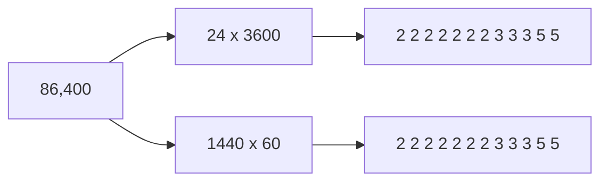

# Why the factorisation is unique: Euclid's lemma turns the factor tree into the fundamental theorem of arithmetic

[Syllabus](../../../SYLLABUS.md) → [Number theory](../README.md) → [Greatest Common Divisor and Euclid's Algorithm](../README.md#s02) → The fundamental theorem of arithmetic

---

## General Overview

A day is 86,400 seconds: 24 hours of 3,600 seconds, or 1,440 minutes of 60 seconds.

Take 24 and 3,600 down to primes — numbers above 1 that will not split ([Primes and composites](../01-Divisibility%20and%20Primes/05-primes-and-composites.md)). 24 gives 2, 2, 2, 3; 3,600 gives 2, 2, 2, 2, 3, 3, 5, 5. Pooled: seven 2s, three 3s, two 5s.

The other pair: 1,440 gives 2, 2, 2, 2, 2, 3, 3, 5; 60 gives 2, 2, 3, 5. Pooled: seven 2s, three 3s, two 5s. The same twelve.

Different trees ([Prime factorisation](../01-Divisibility%20and%20Primes/07-prime-factorisation.md)), same leaves. Every number, every time.

**Every whole number above 1 is a product of primes in exactly one way: the order can change, the primes and their counts cannot.**

That is the **fundamental theorem of arithmetic**.

### The picture



Two routes, twelve primes.

---

## The formula

On our number:

**86,400 = 2 × 2 × 2 × 2 × 2 × 2 × 2 × 3 × 3 × 3 × 5 × 5, and no other list of primes multiplies to it.**

**Read it aloud:** seven 2s, three 3s and two 5s make a day in seconds. Nothing else does.

| Piece | Plain meaning | In our day |
| --- | --- | --- |
| a prime | divides by nothing but 1 and itself ([Primes and composites](../01-Divisibility%20and%20Primes/05-primes-and-composites.md)) | 2, 3, 5 |
| a factor tree | split until every piece is prime ([Prime factorisation](../01-Divisibility%20and%20Primes/07-prime-factorisation.md)) | 24 × 3,600 |
| the leaves | the primes at the ends of a tree | seven 2s, three 3s, two 5s |
| Euclid's lemma | a prime dividing a product divides one factor ([Euclid's lemma](06-euclids-lemma.md)) | 3 divides 86,400, so 3 divides 24 or 3,600 |

---

## Why it works

### Step 0: the trees finish

Every split makes the pieces smaller, and whole numbers cannot shrink forever, so splitting stops at primes. A list always exists — [Prime factorisation](../01-Divisibility%20and%20Primes/07-prime-factorisation.md) does that half. The hard half: never a second.

### Step 1: a smallest failure

Suppose some number above 1 has two genuinely different prime lists. Any collection of whole numbers with something in it has a smallest member ([Strong induction and the least element](../../01-Foundations/06-Proof/05-strong-induction-and-well-ordering.md)), so there is a smallest such number. Call it the offender; its lists, List One and List Two. Now squeeze until two facts collide — proof by contradiction ([Proof by contradiction](../../01-Foundations/06-Proof/03-proof-by-contradiction.md)).

### Step 2: no prime is on both lists

Suppose one is. Cancel a copy from each list. What remains is the offender divided by that prime: smaller, still carrying two different lists. But the offender was the smallest. (If cancelling leaves 1, each list was that prime alone, so they were never different.)

### Step 3: Euclid's lemma puts a prime on both

Take the first prime on List One. List One multiplies to the offender, so our prime divides the offender. List Two multiplies to the offender too, so our prime divides that product. Euclid's lemma ([Euclid's lemma](06-euclids-lemma.md)): a prime dividing a product divides one of the things multiplied. Run it along List Two, and our prime divides one of List Two's primes — which, being prime, it can only equal.

### Step 4: the collision

Step 2 says no prime is on both lists; Step 3 says one is. So there is no smallest offender, and therefore none. Every number above 1 has exactly one prime list. Without Euclid's lemma, Step 3 dies and the theorem with it.

<details>
<summary>A world where uniqueness really is false</summary>

Keep only 1, 5, 9, 13, 17, 21, 25, ... — every fourth whole number. Multiply any two and you stay inside. Here 9 will not split, since 3 is not here; nor will 21 or 49. All three are unsplittable — the local version of prime; mathematicians say **irreducible**. Yet 441 = 9 × 49 = 21 × 21, because Euclid's lemma fails here: 9 divides 21 × 21 without dividing 21.

</details>

---

## Worked numbers, by hand

The day, down both trees.

| Step | Arithmetic | Value |
| --- | --- | --- |
| split 24 | 2 × 2 × 2 × 3 | 24 |
| split 3,600 | 2 × 2 × 2 × 2 × 3 × 3 × 5 × 5 | 3,600 |
| 24 × 3,600, pooled | seven 2s, three 3s, two 5s | **12 primes** |
| split 1,440 | 2 × 2 × 2 × 2 × 2 × 3 × 3 × 5 | 1,440 |
| split 60 | 2 × 2 × 3 × 5 | 60 |
| 1,440 × 60, pooled | seven 2s, three 3s, two 5s | **12 primes** |
| multiplied back | 128 × 27 × 25 | **86,400** |

The trees never met, and agreed anyway.

### What breaks if you drop a piece

| Mistake | Comes out at | What went wrong |
| --- | --- | --- |
| Stopping at 24 × 3,600 | 2 pieces, not 12 | Both still split |
| Counting 1 as a prime | 13, then 14, forever | 1 pads a list, product unchanged |
| The world 1, 5, 9, 13, ... | two lists for 441 | Euclid's lemma is false there |

The code prints all three, and checks the last.

---

## Code, from first principles, and it actually runs

Nothing is imported. The day is factored the plain way, smallest prime first, then twice more down the two trees. Three routes, one list. The last rows step into the 1, 5, 9, 13 world, where 441 has two.

### Python

```python
# Why the factorisation is unique -- the check behind the card.  Nothing is
# imported.  86,400 seconds in a day: the smallest-prime-first split, then the
# same day down two trees, 24 x 3600 and 1440 x 60.  Then a world where it fails.
def factor(n):                           # pull out the smallest prime, over and over
    out, d = [], 2
    while d * d <= n:
        while n % d == 0: out.append(d); n //= d
        d += 1
    return out + ([n] if n > 1 else [])
def tree(a, b):                          # factor both branches, pool the leaves, sort
    return sorted(factor(a) + factor(b))
def unsplittable(m):                     # in the world 1, 5, 9, 13, ...: nothing smaller splits it
    return all(m % a for a in range(5, m, 4))
def show(xs): return " ".join(str(x) for x in xs)
def row(name, value): print(f"{name:<40}{value}")
day, plain = 86400, factor(86400)
p2, p3, p5 = 2 ** plain.count(2), 3 ** plain.count(3), 5 ** plain.count(5)
row("86,400 seconds, smallest prime first", show(plain))
row("the tree 24 x 3600", show(tree(24, 3600)))
row("the tree 1440 x 60", show(tree(1440, 60)))
row("seven 2s, three 3s, two 5s", f"{p2} x {p3} x {p5} = {p2 * p3 * p5}")
row("primes in the list", len(plain))
row("pieces if you stop at 24 x 3600", len([24, 3600]))
row("primes if you let a 1 in, then two", f"{len(plain) + 1} then {len(plain) + 2}")
row("441 in the world 1, 5, 9, 13, ...", f"{9 * 49} = 9 x 49 = 21 x 21")
row("and 9, 21, 49 unsplittable there", show([m for m in (9, 21, 49) if unsplittable(m)]))
assert plain == tree(24, 3600) == tree(1440, 60) and len(plain) == 12
assert p2 * p3 * p5 == day and (plain.count(2), plain.count(3), plain.count(5)) == (7, 3, 2)
assert all(unsplittable(m) for m in (9, 21, 49)) and 9 * 49 == 441 and 21 * 21 == 441
print("ALL CHECKS PASS")
```

**Ran 2026-09-06 on macOS, Python 3.14.6, standard library only. All checks passed. Output, pasted from the run:**

```
86,400 seconds, smallest prime first    2 2 2 2 2 2 2 3 3 3 5 5
the tree 24 x 3600                      2 2 2 2 2 2 2 3 3 3 5 5
the tree 1440 x 60                      2 2 2 2 2 2 2 3 3 3 5 5
seven 2s, three 3s, two 5s              128 x 27 x 25 = 86400
primes in the list                      12
pieces if you stop at 24 x 3600         2
primes if you let a 1 in, then two      13 then 14
441 in the world 1, 5, 9, 13, ...       441 = 9 x 49 = 21 x 21
and 9, 21, 49 unsplittable there        9 21 49
ALL CHECKS PASS
```

### Rust

Same numbers, same labels, built with `rustc --edition 2021 -O`.

```rust
// Why the factorisation is unique -- the same check as unique_factorisation_check.py,
// in Rust.  No crates.  86,400 seconds in a day: the smallest-prime-first split,
// then the same day down two trees, 24 x 3600 and 1440 x 60, and a world where it fails.
fn factor(mut n: i64) -> Vec<i64> {          // pull out the smallest prime, over and over
    let (mut out, mut d) = (Vec::new(), 2);
    while d * d <= n {
        while n % d == 0 { out.push(d); n /= d; }
        d += 1;
    }
    if n > 1 { out.push(n); }
    out
}
fn tree(a: i64, b: i64) -> Vec<i64> {        // factor both branches, pool the leaves, sort
    let mut v = factor(a);
    v.extend(factor(b));
    v.sort();
    v
}
fn unsplittable(m: i64) -> bool { (5..m).step_by(4).all(|a| m % a != 0) }   // world 1, 5, 9, 13, ...
fn show(xs: &[i64]) -> String { xs.iter().map(|x| x.to_string()).collect::<Vec<_>>().join(" ") }
fn row(name: &str, value: &str) { println!("{:<40}{}", name, value); }
fn main() {
    let (day, plain) = (86400i64, factor(86400));
    let count = |p: i64| plain.iter().filter(|&&x| x == p).count() as u32;
    let (p2, p3, p5) = (2i64.pow(count(2)), 3i64.pow(count(3)), 5i64.pow(count(5)));
    row("86,400 seconds, smallest prime first", &show(&plain));
    row("the tree 24 x 3600", &show(&tree(24, 3600)));
    row("the tree 1440 x 60", &show(&tree(1440, 60)));
    row("seven 2s, three 3s, two 5s", &format!("{} x {} x {} = {}", p2, p3, p5, p2 * p3 * p5));
    row("primes in the list", &plain.len().to_string());
    row("pieces if you stop at 24 x 3600", &[24, 3600].len().to_string());
    row("primes if you let a 1 in, then two", &format!("{} then {}", plain.len() + 1, plain.len() + 2));
    row("441 in the world 1, 5, 9, 13, ...", &format!("{} = 9 x 49 = 21 x 21", 9 * 49));
    let odd: Vec<i64> = [9, 21, 49].into_iter().filter(|&m| unsplittable(m)).collect();
    row("and 9, 21, 49 unsplittable there", &show(&odd));
    assert!(plain == tree(24, 3600) && plain == tree(1440, 60) && plain.len() == 12);
    assert!(p2 * p3 * p5 == day && (count(2), count(3), count(5)) == (7, 3, 2));
    assert!([9, 21, 49].iter().all(|&m| unsplittable(m)) && 9 * 49 == 441 && 21 * 21 == 441);
    println!("ALL CHECKS PASS");
}
```

**Ran 2026-09-06 on macOS, rustc 1.98.1, no crates. All checks passed. Output, pasted from the run:**

```
86,400 seconds, smallest prime first    2 2 2 2 2 2 2 3 3 3 5 5
the tree 24 x 3600                      2 2 2 2 2 2 2 3 3 3 5 5
the tree 1440 x 60                      2 2 2 2 2 2 2 3 3 3 5 5
seven 2s, three 3s, two 5s              128 x 27 x 25 = 86400
primes in the list                      12
pieces if you stop at 24 x 3600         2
primes if you let a 1 in, then two      13 then 14
441 in the world 1, 5, 9, 13, ...       441 = 9 x 49 = 21 x 21
and 9, 21, 49 unsplittable there        9 21 49
ALL CHECKS PASS
```

Both outputs match line for line.

> [!TIP]
> **Try changing**
> Guess first, then run it.
> - **Grow a third tree.** Change `tree(24, 3600)` to `tree(96, 900)`. That pair also makes 86,400; the row prints the same twelve primes, under the old label.
> - **Move the world.** In `unsplittable`, change `range(5, m, 4)` to `range(3, m, 2)` — every odd number. 9, 21 and 49 all split there, so the last row empties and the third assert fires.

---

## The usual mistake

> [!warning]
> **Thinking uniqueness is obvious.** A day comes apart as 24 × 3,600, as 1,440 × 60, and dozens of other ways. Uniqueness is a claim about where those roads *end*, and it holds only because Euclid's lemma does. Where the lemma fails, so does the theorem.
>
> - Calling 1 a prime. The list runs to 13, then 14, then forever.
> - Reading "unique" as "one tree". The trees differ. The leaves do not.
> - Stopping at 24 × 3,600 and calling those the atoms: 2 pieces, both still splitting.

---

## Where you meet it in real life

- **Clocks.** Those seven 2s, three 3s and two 5s are why a day cuts into whole halves, thirds, quarters and fifths. A decimal day carries only 2s and 5s, and loses thirds.
- **gcd and lcm.** Off two lists, the smaller count of each prime gives the greatest common divisor, the bigger count the least common multiple ([Greatest common divisor](01-gcd.md), [Least common multiple](02-lcm.md)) — which works only because each number has one list.
- **Public-key cryptography.** RSA leans on both halves at once: a big number has exactly one prime list, and nobody can find it in time.

> **Say it back**
> A day is 86,400 seconds. Split it as 24 × 3,600 or as 1,440 × 60, keep splitting: both routes end at seven 2s, three 3s and two 5s. If a number had two different prime lists, take the smallest. Its lists cannot share a prime — cancel and you get a smaller one. But Euclid's lemma forces a shared prime. So none exists.

---

## What this builds on

- [Proof by contradiction](../../01-Foundations/06-Proof/03-proof-by-contradiction.md): assume it fails, squeeze until two facts collide.
- [Strong induction and the least element](../../01-Foundations/06-Proof/05-strong-induction-and-well-ordering.md): any collection of whole numbers with something in it has a smallest member — that names the offender.
- [Prime factorisation](../01-Divisibility%20and%20Primes/07-prime-factorisation.md): the factor tree, and the easy half.
- [Euclid's lemma](06-euclids-lemma.md): the one line the proof turns on.

## Where this goes next

Next door on this shelf is [There are infinitely many primes](08-infinitude-of-primes.md): multiply the primes you have, add one, and a new prime must exist. Anything read off a prime list — [Counting divisors](../01-Divisibility%20and%20Primes/08-counting-divisors.md), [Greatest common divisor](01-gcd.md), [Least common multiple](02-lcm.md) — stands on this card.

---

## Sources

Verified 6 Sep 2026; every link resolves.

- Euclid. *Elements*, Book VII, Proposition 30, c. 300 BC. [D. E. Joyce's edition](https://mathcs.clarku.edu/~djoyce/elements/bookVII/propVII30.html). The lemma itself.
- Apostol, Tom M. *Introduction to Analytic Number Theory*. Springer, 1976. [doi:10.1007/978-1-4757-5579-4](https://doi.org/10.1007/978-1-4757-5579-4). Chapter 1, the same proof compressed.
- Graham, Ronald L., Donald E. Knuth and Oren Patashnik. *Concrete Mathematics*, 2nd ed. Addison-Wesley, 1994. [Publisher page](https://www.informit.com/store/concrete-mathematics-a-foundation-for-computer-science-9780201558029). Section 4.2, the smallest-offender argument.
