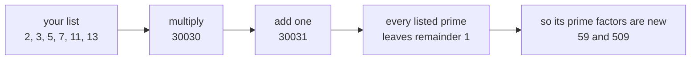

# There are infinitely many primes: multiply the ones you have, add one, and a new prime must exist

[Syllabus](../../../SYLLABUS.md) → [Number theory](../README.md) → [Greatest Common Divisor and Euclid's Algorithm](../README.md#s02) → There are infinitely many primes

---

## General Overview

Write out the first six primes: 2, 3, 5, 7, 11, 13. Pretend that is the lot — the whole supply. Multiply them: 30030. Add one: 30031.

Now try dividing 30031 by anything on the list. Each of the six divides 30030 exactly, so each misses 30031 by 1 and leaves remainder 1.

But 30031 is bigger than 1, so some prime divides it, and it cannot be one of those six. Split 30031 open: 59 × 509. Two primes, neither listed.

The list was not the lot. And nothing above used the fact that it held six primes.

**Multiply any finite list of primes and add one: the answer's prime factors are primes the list did not have, so no finite list is ever all of them.**

### The picture: the machine, run once



Feed the two new primes back in and turn the handle again. It never jams.

---

## The formula

The worked statement is the formula:

**2 × 3 × 5 × 7 × 11 × 13 + 1 = 30031**

**and 30031 = 59 × 509**

**Read it aloud:** multiply your primes, add one, and whatever prime divides the answer is a prime you did not have.

When the list is the first few primes, that product plus one is called a **Euclid number**, after the man who wrote this down around 300 BC.

| Piece | Plain meaning | In our example |
| --- | --- | --- |
| the list | any finite bunch of primes | 2, 3, 5, 7, 11, 13 |
| the product | all of them multiplied together | 30030 |
| the Euclid number | the product, plus one | 30031 |
| the remainder | what is left over after dividing ([Division with a remainder](../01-Divisibility%20and%20Primes/04-division-with-remainder.md)) | 1, for every prime on the list |
| a prime factor | a prime that divides it exactly ([Prime factorisation](../01-Divisibility%20and%20Primes/07-prime-factorisation.md)) | 59, and 509 |
| new | not on the list you started with | neither 59 nor 509 is |

---

## Why it works

### Every prime on the list divides the product

That is what the product is. A 13 went into the multiplication, so 13 comes back out of 30030 exactly. Same for the other five.

### So every prime on the list misses the next number up

Divide 30031 by 13: you land on 30030 with 1 to spare. Remainder 1, not 0, so 13 does not divide it. Same for 2, 3, 5, 7 and 11: six primes, six remainders of 1 — numbers one apart never share a factor above 1 ([Coprime numbers](05-coprime-numbers.md)).

### Something prime divides 30031 anyway

Every whole number above 1 has a prime factor: keep splitting and the pieces shrink, so you cannot split forever ([Prime factorisation](../01-Divisibility%20and%20Primes/07-prime-factorisation.md), and the smallest-counterexample argument on [Strong induction and the least element](../../01-Foundations/06-Proof/05-strong-induction-and-well-ordering.md)). So 30031 has one, and its smallest is 59.

### The squeeze

Suppose those six really were all the primes there are. Then 30031's prime factor is one of them. But none of them divides 30031. Both cannot be true, so the supposition was wrong ([Proof by contradiction](../../01-Foundations/06-Proof/03-proof-by-contradiction.md)).

Nothing in those four steps mentions six. Hand the machine any finite list and it does the same thing — and "no finite list holds them all" is exactly what infinitely many means.

Another route counts how thinly the primes sit as you climb: [How primes thin out](../07-For%20the%20Curious/03-how-primes-thin-out.md).

---

## Worked numbers, by hand

| Step | Arithmetic | Value |
| --- | --- | --- |
| the list, multiplied | 2 × 3 × 5 × 7 × 11 × 13 | 30030 |
| the Euclid number | 30030 + 1 | 30031 |
| divide it by each listed prime | remainder every time | 1 |
| its smallest prime factor | trial division | 59 |
| the other factor | 30031 ÷ 59 | 509 |
| is 509 prime | its smallest factor above 1 is itself | 509 |
| multiply back, as a check | 59 × 509 | **30031** |

Neither 59 nor 509 was on the list. Six primes bought two more.

### What breaks if you drop a piece

| Mistake | Comes out at | What went wrong |
| --- | --- | --- |
| Calling the Euclid number prime | 30031 | It splits: 59 × 509, and the proof never needed it whole |
| Forgetting the plus one | 2 | 30030's factors are the six you listed, nothing new |
| Adding one to 13 alone | 14 | 14 breaks into 2 and 7, both already on the list |

The code prints all three.

---

## Code, from first principles, and it actually runs

Nothing is imported. The new prime is found by factoring 30031 into 59 and 509; the six remainders of 1 prove it cannot be one of the listed six. The two dropped-piece answers follow.

### Python

```python
# There are infinitely many primes -- the check behind the card.  Nothing is
# imported.  Six primes multiplied, plus one, is 30031.  Two roads to a new
# prime: factor it, and divide it by every prime on the list.
LISTED = [2, 3, 5, 7, 11, 13]
def factor(n):                   # trial division: the smallest prime factor of n
    d = 2
    while d * d <= n:
        if n % d == 0:
            return d
        d += 1
    return n
product = 1
for p in LISTED:
    product *= p
euclid = product + 1                              # the Euclid number
small = factor(euclid)                            # road one: factor it
big = euclid // small
rem = " ".join(str(euclid % p) for p in LISTED)   # road two: the remainders
for name, value in [
        ("2 x 3 x 5 x 7 x 11 x 13", product), ("that product plus one", euclid),
        ("remainder of 30031 by each listed prime", rem), ("smallest prime factor of 30031", small),
        ("30031 divided by 59", big), ("59 x 509, multiplied back", small * big),
        ("smallest prime factor of 509", factor(big)), ("drop the plus one, factor 30030", factor(product)),
        ("either factor already listed, 0 is no", sum(q in LISTED for q in (small, big))),
        ("add one to 13 alone", 13 + 1), ("factor that 14 instead", factor(14))]:
    print(f"{name:<41}{value:>6}")
assert product == 30030 and euclid == 30031 and small * big == euclid
assert small == 59 and big == 509 and factor(big) == 509
assert rem == "1 1 1 1 1 1" and factor(product) == 2 and factor(14) == 2
print("ALL CHECKS PASS")
```

**Ran 2026-09-06 on macOS, Python 3.14.6, standard library only. All checks passed. Output, pasted from the run:**

```
2 x 3 x 5 x 7 x 11 x 13                   30030
that product plus one                     30031
remainder of 30031 by each listed prime  1 1 1 1 1 1
smallest prime factor of 30031               59
30031 divided by 59                         509
59 x 509, multiplied back                 30031
smallest prime factor of 509                509
drop the plus one, factor 30030               2
either factor already listed, 0 is no         0
add one to 13 alone                          14
factor that 14 instead                        2
ALL CHECKS PASS
```

### Rust

Same numbers, same labels, built with `rustc --edition 2021 -O`.

```rust
// There are infinitely many primes -- the same check, in Rust.  No crates.
// Six primes multiplied, plus one, is 30031.  Two roads to a new prime:
// factor it, and divide it by every prime on the list.
const LISTED: [i64; 6] = [2, 3, 5, 7, 11, 13];

fn factor(n: i64) -> i64 {       // trial division: the smallest prime factor of n
    let mut d: i64 = 2;
    while d * d <= n {
        if n % d == 0 { return d; }
        d += 1;
    }
    n
}

fn main() {
    let mut product: i64 = 1;
    for p in LISTED { product *= p; }
    let euclid = product + 1;                     // the Euclid number
    let small = factor(euclid);                   // road one: factor it
    let big = euclid / small;
    let mut rem = String::new();                  // road two: the remainders
    for p in LISTED {
        if !rem.is_empty() { rem.push(' '); }
        rem.push_str(&(euclid % p).to_string());
    }
    let seen = LISTED.iter().filter(|&&q| q == small || q == big).count();
    let rows: [(&str, String); 11] = [
        ("2 x 3 x 5 x 7 x 11 x 13", product.to_string()), ("that product plus one", euclid.to_string()),
        ("remainder of 30031 by each listed prime", rem.clone()), ("smallest prime factor of 30031", small.to_string()),
        ("30031 divided by 59", big.to_string()), ("59 x 509, multiplied back", (small * big).to_string()),
        ("smallest prime factor of 509", factor(big).to_string()), ("drop the plus one, factor 30030", factor(product).to_string()),
        ("either factor already listed, 0 is no", seen.to_string()),
        ("add one to 13 alone", (13 + 1).to_string()), ("factor that 14 instead", factor(14).to_string())];
    for (name, value) in rows { println!("{:<41}{:>6}", name, value); }
    assert!(product == 30030 && euclid == 30031 && small * big == euclid);
    assert!(small == 59 && big == 509 && factor(big) == 509);
    assert!(rem == "1 1 1 1 1 1" && factor(product) == 2 && factor(14) == 2);
    println!("ALL CHECKS PASS");
}
```

**Ran 2026-09-06 on macOS, rustc 1.98.1, no crates. All checks passed. Output, pasted from the run:**

```
2 x 3 x 5 x 7 x 11 x 13                   30030
that product plus one                     30031
remainder of 30031 by each listed prime  1 1 1 1 1 1
smallest prime factor of 30031               59
30031 divided by 59                         509
59 x 509, multiplied back                 30031
smallest prime factor of 509                509
drop the plus one, factor 30030               2
either factor already listed, 0 is no         0
add one to 13 alone                          14
factor that 14 instead                        2
ALL CHECKS PASS
```

The two outputs match line for line: whole numbers throughout, nothing to round.

> [!TIP]
> **Try changing**
> Guess first, then run it. The asserts and the printed labels are pinned to the six-prime list, so expect one to fire.
> - **Drop 13 from the list.** Multiply 2, 3, 5, 7 and 11, add one. Does a prime nobody listed still come back? It does, whatever you drop.
> - **Take the plus one away.** Factor the product itself. The smallest factor is 2, already listed, and the first assert fires — the plus one is the whole trick.

---

## The usual mistake

> [!warning]
> **Thinking the proof claims the Euclid number is itself prime.** It does not, and here it is not: 30031 = 59 × 509. All the proof needs is that 30031 has some prime factor, and that it cannot be on the list.
>
> - **Expecting the new prime to beat everything on the list.** The machine promises new, not big. From the list 5, 7: 5 × 7 + 1 = 36, which is 2 × 2 × 3 × 3. The new primes are 2 and 3, both smaller than anything listed.
> - **Reading it as a recipe for the next prime.** From 2, 3, 5, 7, 11, 13 it returns 59, skipping every prime between 13 and 59.
> - **Taking one run as the proof.** 30031 is one turn of the handle. The proof is that the same four steps work on any finite list.

---

## Where you meet it in real life

- **The record-prime hunt.** Volunteers pool spare computer time to find the largest known prime, and the record falls every few years. Euclid is why the search can never finish: there is always a bigger one.
- **Public-key encryption.** Keys are built from large primes nobody has used before, which works only because the supply never dries up ([Primes and composites](../01-Divisibility%20and%20Primes/05-primes-and-composites.md)).
- **Proof by contradiction.** The example everyone learns it on: assume the opposite, build one object, watch it break ([Proof by contradiction](../../01-Foundations/06-Proof/03-proof-by-contradiction.md)).

> **Say it back**
> Take any finite list of primes. Multiply them and add one. Each listed prime divides the product exactly, so each leaves remainder 1 on the answer and none of them divides it. But every number above 1 has a prime factor, so that factor is a prime the list missed. With 2, 3, 5, 7, 11, 13 the answer is 30031 — not prime, but 59 × 509, both new, which is all the proof asked for. No finite list is complete, so the primes never run out.

---

## What this builds on

- [Proof by contradiction](../../01-Foundations/06-Proof/03-proof-by-contradiction.md): assume the opposite, follow it until two facts collide, conclude the assumption was wrong. The shape of this whole card.
- [Prime factorisation](../01-Divisibility%20and%20Primes/07-prime-factorisation.md): every whole number above 1 breaks into primes — what guarantees 30031 has a prime factor.

## Where this goes next

- [How primes thin out](../07-For%20the%20Curious/03-how-primes-thin-out.md): they never run out, but they do get rarer — how much rarer, and how fast.
- [Goldbach, twin primes and friends](../07-For%20the%20Curious/04-goldbach-and-open-problems.md): prime questions as easy to state as this one, still unanswered.

---

## Sources

Verified 6 Sep 2026; every link resolves.

- Euclid. *Elements*, Book IX, Proposition 20, c. 300 BC. [Joyce's edition, Clark University](https://mathcs.clarku.edu/~djoyce/elements/bookIX/propIX20.html). The original: prime numbers are more than any assigned multitude.
- Aigner, Martin, and Günter M. Ziegler. *Proofs from THE BOOK*, 6th ed. Springer, 2018. [doi:10.1007/978-3-662-57265-8](https://doi.org/10.1007/978-3-662-57265-8). Chapter 1, six proofs of this one fact.
- Caldwell, Chris K. "Euclid's Proof that there are Infinitely Many Primes." The Prime Pages. [t5k.org](https://t5k.org/notes/proofs/infinite/euclids.html). The trap on this card, with the same counterexample.
