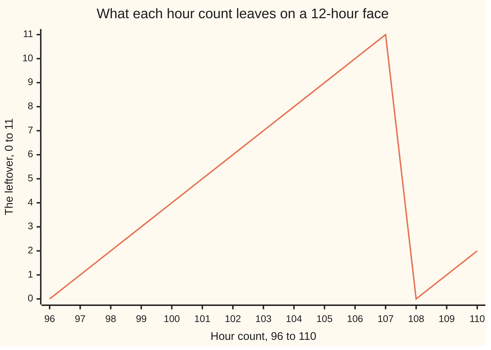

# Congruence: two numbers count as the same when they leave the same remainder, written a ≡ b (mod n)

Number theory → Clock Arithmetic → Congruence → What congruence means

---

## General Overview

It is 9 am. A job takes 100 hours. When does it finish?

Nobody counts out 100 hours. You cut it into whole days and a bit: 100 = 4 × 24 + 4. Four days, four hours over. The days put the clock back where it started, so only the 4 works: 9 am plus 4 hours is 1 pm.

The same cut works on the face, which turns over every 12 hours: 100 = 8 × 12 + 4. Different turns, same 4 over. The turns are throwaway; the leftover is the answer, and its name is the remainder ([division-with-remainder](../01-Divisibility%20and%20Primes/04-division-with-remainder.md)). Two numbers leaving the same remainder land on the same spot, so on the clock they count as the same.

**Two whole numbers are congruent when they leave the same remainder on division by the modulus, the size of one turn — the same thing as saying their difference is a whole number of turns.**

### The picture



The line climbs by one an hour, then drops to 0 at 108: nine whole turns of 12. Count 100 sits at 4, count 109 at 1.

---

## The formula

Nine plus the leftover 4 is 13, and 13 on the face reads 1 — the same answer the count 109 gives. Nine o'clock plus 100 hours is count 109. Cut it:

**109 = 9 × 12 + 1, and 1 = 0 × 12 + 1: the same remainder, so both land on the same spot on the face.**

Gauss's shorthand for that:

**109 ≡ 1 (mod 12)**

**Read it aloud:** 109 leaves the same remainder as 1 when you divide by 12.

**In general: a ≡ b (mod n).** a and b are the two numbers compared; n is the modulus, a whole number of 1 or more.

The three-bar ≡ reads "is congruent to", not "equals". The bracket names the clock: "mod" is short for modulus, what you divide by — one whole turn. Said the other way, which tests quicker:

**109 − 1 = 108, and 108 = 9 × 12, so 12 divides the difference ([divides](../01-Divisibility%20and%20Primes/01-divides.md)).**

| Piece | Plain meaning | In our example |
| --- | --- | --- |
| the modulus | what you divide by: one whole turn | 12 |
| the remainder | what is left once the turns come out | 1 |
| ≡ | "leaves the same remainder as" | 109 ≡ 1 |
| (mod 12) | which clock you are on | the hour face |
| the difference test | the modulus divides one minus the other | 108 = 9 × 12 |

---

## Why it works

### Step 0: a whole turn changes nothing

Add 12 hours to any time and the hand is back where it was. Put in or take out as many 12s as you like; the clock never notices.

### Step 1: every number has exactly one remainder

Any whole number is some number of turns times 12, plus a remainder from 0 to 11, one way only ([division-with-remainder](../01-Divisibility%20and%20Primes/04-division-with-remainder.md)). That remainder is its spot on the face.

### Step 2: the two tests are one

Two numbers with the same remainder: write each as its own turns times 12, plus that shared remainder. Subtract, and the remainders cancel, leaving whole turns. So 12 divides the difference.

The other way round: if 12 divides the difference, one number is the other plus whole turns, which do not move the clock (Step 0). A number gets one remainder only (Step 1), so the remainders match.

### Step 3: counting backwards works too

Nothing said the turns had to be forwards. Three hours before midnight, count back: −3 = (−1) × 12 + 9 ([negative-numbers](../../01-Foundations/01-Everyday%20Arithmetic/06-negative-numbers.md)). The difference test agrees: 9 − (−3) = 12, one turn exactly. So −3 ≡ 9 (mod 12), and the face does read 9.

Some machines cut towards zero and hand back −3. Ours does not: the face has no −3 on it.

---

## Worked numbers, by hand

The 9 am job, on the 12-hour face.

| Step | Arithmetic | Value |
| --- | --- | --- |
| 100 hours, as days and as turns | 4 × 24 + 4, or 8 × 12 + 4 | 100 |
| hour count from 9, cut again | 9 + 100 = 9 × 12 + 1 | 109 |
| the face reads | the leftover | **1** |
| the same, by walking 100 ticks | one at a time | 1 |
| the difference test | 109 − 1 | 108 |
| three before midnight | (−1) × 12 + 9 | **9** |

The job finishes at 1 pm, four days later.

### What breaks if you drop a piece

| Mistake | Comes out at | What went wrong |
| --- | --- | --- |
| Leaving the hour count as it stands | 109 | a count of hours, not an hour |
| Calling 109 and 2 the same hour | not the same hour | their difference, 107, leaves 11 |
| Reading the leftover of −3 as −3 | −3 | one turn back and the face reads 9 |

---

## Code, from first principles, and it actually runs

Nothing is imported. The job is worked the plain way — take the turns out, keep what is left — then by a road that never divides: walk the hand round from 9, a hundred single ticks.

### Python

```python
# Congruence -- the check behind the card.  Nothing is imported.  A 12-hour
# clock at 9 am, 100 hours later.  Two roads to the same hour: take the whole
# turns out by dividing, or walk the face one tick at a time.
def leftover(a, n):        # a = n x whole turns + leftover, with 0 <= leftover < n
    turns = 0
    while a - turns * n < 0: turns -= 1
    while a - turns * n >= n: turns += 1
    return a - turns * n
def walk(start, steps, n):                     # the long way round, tick by tick
    hand = start
    for _ in range(steps): hand = hand + 1 if hand + 1 < n else 0
    return hand
def row(name, value): print(f"{name:<40}{value:>4}")
row("100 = 8 x 12 + 4, leftover on 12", leftover(100, 12))
row("100 = 4 x 24 + 4, leftover on 24", leftover(100, 24))
row("9 + 100, counted straight out", 9 + 100)
row("the face reads, by dividing", leftover(109, 12))
row("the face reads, by walking the ticks", walk(9, 100, 12))
row("109 - 1 = 9 whole turns of 12", 109 - 1)
row("3 hours before midnight: -3 leaves", leftover(-3, 12))
row("9 - (-3), exactly one turn of 12", 9 - (-3))
row("109 - 2 = 107, whose leftover is not 0", leftover(107, 12))
print(f"{'hour count':<20}" + "".join(f"{a:>4}" for a in range(96, 111)))
print(f"{'each one leaves':<20}" + "".join(f"{leftover(a, 12):>4}" for a in range(96, 111)))
assert leftover(100, 12) == 4 and leftover(100, 24) == 4 and 9 + 100 == 109
assert walk(9, 100, 12) == leftover(109, 12) == 1 and (109 - 1) % 12 == 0
assert leftover(-3, 12) == 9 and 9 - (-3) == 12 and leftover(107, 12) == 11
assert [leftover(a, 12) for a in range(96, 111)] == [0,1,2,3,4,5,6,7,8,9,10,11,0,1,2]
assert all(((a-b) % 12 == 0) == (leftover(a,12) == leftover(b,12)) for a in range(-40,41) for b in range(-40,41))
print("ALL CHECKS PASS")
```

**Ran 2026-09-06 on macOS, Python 3.14.6, standard library only. All checks passed. Output, pasted from the run:**

```
100 = 8 x 12 + 4, leftover on 12           4
100 = 4 x 24 + 4, leftover on 24           4
9 + 100, counted straight out            109
the face reads, by dividing                1
the face reads, by walking the ticks       1
109 - 1 = 9 whole turns of 12            108
3 hours before midnight: -3 leaves         9
9 - (-3), exactly one turn of 12          12
109 - 2 = 107, whose leftover is not 0    11
hour count            96  97  98  99 100 101 102 103 104 105 106 107 108 109 110
each one leaves        0   1   2   3   4   5   6   7   8   9  10  11   0   1   2
ALL CHECKS PASS
```

### Rust

Same labels, same numbers; `rustc --edition 2021 -O`.

```rust
// Congruence -- the same check as congruence_mod_n_check.py, in Rust.  No
// crates.  A 12-hour clock at 9 am, 100 hours later.  Two roads to the same
// hour: take the whole turns out by dividing, or walk the face tick by tick.
fn leftover(a: i64, n: i64) -> i64 {   // a = n x whole turns + leftover, 0 <= leftover < n
    let mut turns = 0i64;
    while a - turns * n < 0 { turns -= 1; }
    while a - turns * n >= n { turns += 1; }
    a - turns * n
}
fn walk(start: i64, steps: i64, n: i64) -> i64 {      // the long way round, tick by tick
    let mut hand = start;
    for _ in 0..steps { hand = if hand + 1 < n { hand + 1 } else { 0 }; }
    hand
}
fn row(name: &str, value: i64) { println!("{:<40}{:>4}", name, value); }
fn main() {
    row("100 = 8 x 12 + 4, leftover on 12", leftover(100, 12));
    row("100 = 4 x 24 + 4, leftover on 24", leftover(100, 24));
    row("9 + 100, counted straight out", 9 + 100);
    row("the face reads, by dividing", leftover(109, 12));
    row("the face reads, by walking the ticks", walk(9, 100, 12));
    row("109 - 1 = 9 whole turns of 12", 109 - 1);
    row("3 hours before midnight: -3 leaves", leftover(-3, 12));
    row("9 - (-3), exactly one turn of 12", 9 - (-3));
    row("109 - 2 = 107, whose leftover is not 0", leftover(107, 12));
    let mut hours = format!("{:<20}", "hour count");
    for a in 96..111 { hours.push_str(&format!("{:>4}", a)); }
    println!("{}", hours);
    let mut lefts = format!("{:<20}", "each one leaves");
    for a in 96..111 { lefts.push_str(&format!("{:>4}", leftover(a, 12))); }
    println!("{}", lefts);
    assert!(leftover(100, 12) == 4 && leftover(100, 24) == 4 && 9 + 100 == 109);
    assert!(walk(9, 100, 12) == 1 && leftover(109, 12) == 1 && (109 - 1) % 12 == 0);
    assert!(leftover(-3, 12) == 9 && 9 - (-3) == 12 && leftover(107, 12) == 11);
    assert!((96..111).map(|a| leftover(a, 12)).collect::<Vec<i64>>() == vec![0,1,2,3,4,5,6,7,8,9,10,11,0,1,2]);
    assert!((-40..41).all(|a| (-40..41).all(|b| ((a - b) % 12 == 0) == (leftover(a, 12) == leftover(b, 12)))));
    println!("ALL CHECKS PASS");
}
```

**Ran 2026-09-06 on macOS, rustc 1.98.1, no crates. All checks passed. Output, pasted from the run:**

```
100 = 8 x 12 + 4, leftover on 12           4
100 = 4 x 24 + 4, leftover on 24           4
9 + 100, counted straight out            109
the face reads, by dividing                1
the face reads, by walking the ticks       1
109 - 1 = 9 whole turns of 12            108
3 hours before midnight: -3 leaves         9
9 - (-3), exactly one turn of 12          12
109 - 2 = 107, whose leftover is not 0    11
hour count            96  97  98  99 100 101 102 103 104 105 106 107 108 109 110
each one leaves        0   1   2   3   4   5   6   7   8   9  10  11   0   1   2
ALL CHECKS PASS
```

The two outputs match line for line.

> [!TIP]
> **Try changing**
> Guess first, then run. The asserts are pinned to this clock, so expect one to fire.
> - **Walk one tick short.** Make it 99, not 100. The hand lands on 0 — a face writes that as 12 — and the roads stop agreeing.
> - **Start at midnight.** Change the walk's start from 9 to 0: it lands on 4, the leftover of 100 itself.

---

## The usual mistake

> [!warning]
> **Congruent is not equal.** 109 ≡ 1 (mod 12) does not say 109 is 1. It says they land on the same spot once you count in turns of 12. Take the clock away and 109 is 109.
>
> - Reading it as a division. A congruence compares two numbers, and the test runs on their difference: 109 − 1 = 108.
> - Dropping the bracket. The (mod 12) is part of the sentence: a pair can share a spot on one clock and not another.
> - Testing the wrong pair. 109 and 2 differ by 107, which leaves 11.

---

## Where you meet it in real life

- **Clocks and calendars.** "What time will it be" and "what day will it fall on" are remainders: the week runs on 7, the face on 12.
- **Last digits.** A number's last digit is its remainder on 10 — why the tests for 2, 5 and 10 look only at the end ([divisibility-rules](../01-Divisibility%20and%20Primes/03-divisibility-rules.md)).
- **Check digits.** A barcode's last digit is picked so a running total lands on a fixed spot; mistype one and the till refuses it.

> **Say it back**
> Pick a step size: the modulus, 12 for an hour face. Divide, and keep what is left. Two numbers are congruent, 109 ≡ 1 (mod 12), when those leftovers match — the same as saying 12 divides one minus the other. Whole turns are invisible: 100 hours after 9 am is 1 pm, and −3 is one turn back and 9 over, so midnight less three reads 9.

---

## What this builds on

- [division-with-remainder](../01-Divisibility%20and%20Primes/04-division-with-remainder.md): every whole number splits, one way only, into whole turns plus a remainder — its spot on the face.
- [divides](../01-Divisibility%20and%20Primes/01-divides.md): "12 divides 108" means 108 is a whole number of 12s, nothing over. That is the difference test in one word.
- [negative-numbers](../../01-Foundations/01-Everyday%20Arithmetic/06-negative-numbers.md): counting back past 0, which is how −3 reaches 9.

## Where this goes next

- [modular-addition-and-multiplication](02-modular-addition-and-multiplication.md): reduce before adding or multiplying, or after, and the answers agree.
- [residue-classes](03-residue-classes.md): the numbers sharing a leftover, in buckets with their own small tables.
- [modular-inverse](04-modular-inverse.md): dividing on a clock, which needs a number sharing no factor with the modulus ([coprime-numbers](../02-Greatest%20Common%20Divisor%20and%20Euclid%27s%20Algorithm/05-coprime-numbers.md)).
- [linear-congruences](05-linear-congruences.md): unknown hours, solved on a clock.

---

## Sources

Both URLs below checked 6 Sep 2026.

- Gauss, Carl Friedrich. *Disquisitiones Arithmeticae*, trans. Arthur A. Clarke. Yale University Press, 1965. [Publisher page](https://yalebooks.yale.edu/book/9780300094732/disquisitiones-arithmeticae/). Article 1, where ≡ first appeared.
- Shoup, Victor. *A Computational Introduction to Number Theory and Algebra*, 2nd ed. Cambridge University Press, 2009. [Author's full text](https://www.shoup.net/ntb/). Chapter 2, the same with the machine in mind.
