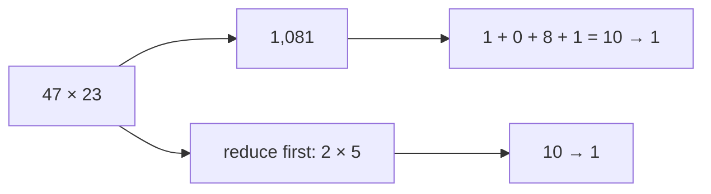

# Adding and multiplying on the clock: reduce before or after, the answer agrees

[Syllabus](../../../SYLLABUS.md) → [Number theory](../README.md) → [Clock Arithmetic](../README.md#s03) → Adding and multiplying on the clock

---

## General Overview

A market stall works your order out by hand on the receipt: 47 boxes at 23 cents, written 47 × 23 = 1,081. You are not redoing that multiplication at the counter.

Add the digits instead. 47 gives 4 + 7 = 11, then 1 + 1 = 2. 23 gives 5. Multiply those: 2 × 5 = 10, then 1. Now the receipt's answer: 1 + 0 + 8 + 1 = 10, then 1.

Both roads end on 1, so the receipt passes. Shrinking a number means keeping the remainder — what is left once whole 9s are thrown away ([Congruence](01-congruence-mod-n.md)).

This is called **casting out nines**. It works because shrinking first then multiplying gives the same result as multiplying first then shrinking.

**Remainders add and multiply on their own. Reduce before or reduce after, you land on the same remainder.**

### The picture: two roads, one answer



Top road: multiply then reduce. Bottom: reduce then multiply.

---

## The formula

On a 9-hour clock, 47 leaves 2 and 23 leaves 5. So:

**47 × 23 leaves the same remainder as 2 × 5 does.**

**47 + 23 leaves the same remainder as 2 + 5 does.**

**Read it aloud:** reduce 47 and 23 to 2 and 5, multiply those, and land where 1,081 lands.

Card 01's shorthand for that: 47 ≡ 2 (mod 9) and 23 ≡ 5 (mod 9), so 47 × 23 ≡ 2 × 5 (mod 9) and 47 + 23 ≡ 2 + 5 (mod 9). We picked 9 because the digit trick comes free with it. The rule holds on any clock.

| Piece | Plain meaning | On the receipt |
| --- | --- | --- |
| the modulus | how many hours the clock has | 9 |
| a remainder | what is left when whole 9s are gone | 47 leaves 2 |
| ≡ … (mod 9) | same remainder on the 9-clock | 47 ≡ 2 (mod 9) |
| casting out nines | reduce both sides, compare | 2 × 5 gives 1, 1,081 gives 1 |

---

## Why it works

### Step 0: remainder plus a pile of 9s

47 = 45 + 2, and 45 is five 9s. 23 = 18 + 5, and 18 is two 9s. The pile is invisible on the 9-clock; the 2 and the 5 are what shows.

### Step 1: adding, the piles merge

47 + 23 = (45 + 2) + (18 + 5). Reorder the pieces ([The three rearranging laws](../../01-Foundations/01-Everyday%20Arithmetic/05-arithmetic-laws.md)) into (45 + 18) + (2 + 5). The first bracket is seven 9s: still invisible. What shows is 2 + 5 = 7. The long way: 47 + 23 = 70, seven 9s and 7 over. The same 7.

### Step 2: multiplying, every cross piece carries a 9

47 × 23 = (45 + 2) × (18 + 5). Multiply that out: four pieces, 45 × 18, 45 × 5, 2 × 18 and 2 × 5. The first three each carry a 45 or an 18, so each is a whole number of 9s — invisible. Only 2 × 5 = 10 is left, and 10 leaves 1. So 1,081 leaves 1.

Nothing there was about 9, or about 47 and 23. Split any two numbers into remainder plus pile: every piece except remainder-times-remainder carries the modulus and vanishes.

### Step 3: why digit sums work

10 leaves 1 on the 9-clock, since 10 = 9 + 1. So does 100, being eleven 9s + 1, and so does 1,000.

Read 1,081 by its columns ([Place value](../../01-Foundations/01-Everyday%20Arithmetic/01-place-value.md)): 1 thousand, 0 hundreds, 8 tens, 1 one. By Step 2 each column's worth can be swapped for the 1 it leaves, and by Step 1 the columns still add, so every digit contributes only itself: 1 + 0 + 8 + 1 = 10, then 1.

A digit total of 9 is remainder 0: nine hours on, the clock reads zero.

---

## Worked numbers, by hand

| Step | Arithmetic | Value |
| --- | --- | --- |
| 47 reduced | 4 + 7 = 11, then 1 + 1 | 2 |
| 23 reduced | 2 + 3 | 5 |
| the remainders multiplied | 2 × 5 = 10, then 1 + 0 | **1** |
| the receipt's answer | 47 × 23 | 1,081 |
| that answer reduced | 1 + 0 + 8 + 1 = 10, then 1 + 0 | **1** |
| the same, no digits | 1,081 take away 9, 120 times | 1 |
| the sum, both roads | 47 + 23 = 70, and 2 + 5 | 7 |

### What breaks if you drop a piece

| Mistake | Comes out at | What went wrong |
| --- | --- | --- |
| Writing 1,801 for 1,081 | 1 | Same digits, same total: a swap is invisible here |
| Slipping to 1,061 | 8 | 8 is not 1, so the check fires |

The code prints both, and the cancelling trap below.

---

## Code, from first principles, and it actually runs

Nothing is imported. The receipt is checked by digit sums, then by a road that never looks at a digit: take 9 away until what is left is under 9. Then the mistakes.

### Python

```python
# Adding and multiplying on the clock -- the check behind the card.  Nothing is
# imported.  The receipt: 47 x 23 = 1,081, checked by casting out nines.  Digit
# sums are one road; taking 9s away from the whole number is the other.
def cast_out(n):                     # add the digits, again and again; 9 lands on 0
    while n > 9:
        n = sum(int(d) for d in str(n))
    return 0 if n == 9 else n
def take_nines_away(n):              # the same remainder, by subtracting 9 over and over
    while n >= 9:
        n -= 9
    return n
def row(name, value):
    print(f"{name:<42}{value:>6}")
row("47 by digit sums", cast_out(47))
row("23 by digit sums", cast_out(23))
row("2 x 5 = 10, by digit sums", cast_out(2 * 5))
row("47 x 23 the long way", 47 * 23)
row("1081 by digit sums", cast_out(47 * 23))
row("1081 by taking 9s away, 120 times", take_nines_away(47 * 23))
row("47 + 23 = 70, and 2 + 5 = 7, both leave", cast_out(47 + 23))
row("a swapped 1801 passes anyway", cast_out(1801))
row("a slipped 1061 is caught, not 1", cast_out(1061))
row("1061 by taking 9s away, 8 again", take_nines_away(1061))
row("3 x 4 = 12 and 3 x 1 = 3 both leave", cast_out(3 * 4))
assert cast_out(47) == 2 and cast_out(23) == 5 and cast_out(2 * 5) == 1 and 47 * 23 == 1081
assert cast_out(1081) == 1 and take_nines_away(1081) == 1 and cast_out(3 * 4) == 3
assert cast_out(47 + 23) == 7 and cast_out(2 + 5) == 7 and cast_out(1801) == 1 and cast_out(1061) == 8
assert take_nines_away(1061) == 8 and cast_out(9) == 0 and cast_out(18) == 0
print("ALL CHECKS PASS")
```

**Ran 2026-09-06 on macOS, Python 3.14.6, standard library only. All checks passed. Output, pasted from the run:**

```
47 by digit sums                               2
23 by digit sums                               5
2 x 5 = 10, by digit sums                      1
47 x 23 the long way                        1081
1081 by digit sums                             1
1081 by taking 9s away, 120 times              1
47 + 23 = 70, and 2 + 5 = 7, both leave        7
a swapped 1801 passes anyway                   1
a slipped 1061 is caught, not 1                8
1061 by taking 9s away, 8 again                8
3 x 4 = 12 and 3 x 1 = 3 both leave            3
ALL CHECKS PASS
```

### Rust

Same numbers, same labels, built with `rustc --edition 2021 -O`.

```rust
// Adding and multiplying on the clock -- the same check as
// modular_addition_and_multiplication_check.py, in Rust.  No crates.  The
// receipt: 47 x 23 = 1,081, checked by casting out nines.  Digit sums are one
// road; taking 9s away from the whole number is the other.
fn cast_out(mut n: i64) -> i64 {          // add the digits, again and again; 9 lands on 0
    while n > 9 {
        let (mut sum, mut rest) = (0, n);
        while rest > 0 { sum += rest % 10; rest /= 10; }
        n = sum;
    }
    if n == 9 { 0 } else { n }
}
fn take_nines_away(mut n: i64) -> i64 {   // the same remainder, by subtracting 9 over and over
    while n >= 9 { n -= 9; }
    n
}
fn row(name: &str, value: i64) { println!("{:<42}{:>6}", name, value); }
fn main() {
    row("47 by digit sums", cast_out(47));
    row("23 by digit sums", cast_out(23));
    row("2 x 5 = 10, by digit sums", cast_out(2 * 5));
    row("47 x 23 the long way", 47 * 23);
    row("1081 by digit sums", cast_out(47 * 23));
    row("1081 by taking 9s away, 120 times", take_nines_away(47 * 23));
    row("47 + 23 = 70, and 2 + 5 = 7, both leave", cast_out(47 + 23));
    row("a swapped 1801 passes anyway", cast_out(1801));
    row("a slipped 1061 is caught, not 1", cast_out(1061));
    row("1061 by taking 9s away, 8 again", take_nines_away(1061));
    row("3 x 4 = 12 and 3 x 1 = 3 both leave", cast_out(3 * 4));
    assert!(cast_out(47) == 2 && cast_out(23) == 5 && cast_out(2 * 5) == 1 && 47 * 23 == 1081);
    assert!(cast_out(1081) == 1 && take_nines_away(1081) == 1 && cast_out(3 * 4) == 3);
    assert!(cast_out(47 + 23) == 7 && cast_out(2 + 5) == 7 && cast_out(1801) == 1 && cast_out(1061) == 8);
    assert!(take_nines_away(1061) == 8 && cast_out(9) == 0 && cast_out(18) == 0);
    println!("ALL CHECKS PASS");
}
```

**Ran 2026-09-06 on macOS, rustc 1.98.1, no crates. All checks passed. Output, pasted from the run:**

```
47 by digit sums                               2
23 by digit sums                               5
2 x 5 = 10, by digit sums                      1
47 x 23 the long way                        1081
1081 by digit sums                             1
1081 by taking 9s away, 120 times              1
47 + 23 = 70, and 2 + 5 = 7, both leave        7
a swapped 1801 passes anyway                   1
a slipped 1061 is caught, not 1                8
1061 by taking 9s away, 8 again                8
3 x 4 = 12 and 3 x 1 = 3 both leave            3
ALL CHECKS PASS
```

The two outputs match line for line: whole numbers, nothing to round.

> [!TIP]
> **Try changing**
> Guess first, then run it.
> - **Break the receipt.** Change every `47 * 23` to `47 * 24`. That is 1,128, which reduces to 3, not 1, and an assert fires.
> - **Move the clock.** In the second road, swap both 9s for 10s. It returns the last digit now: 1 for 1,081, right by luck, and 1 for 1,061, where the answer is 8. The assert fires. Digit sums are a 9 trick, not a 10 trick.

---

## The usual mistake

> [!warning]
> **Dividing.** Adding and multiplying carry over to remainders. Dividing does not. On the 9-clock 3 × 4 = 12 leaves 3, and 3 × 1 = 3 leaves 3 too. Cancel the 3 and you have said 4 and 1 are the same number. Division comes later, with a condition attached ([The modular inverse](04-modular-inverse.md)). Until then, do not cancel.
>
> - The check can catch a wrong answer, never confirm a right one. 1,801 passes and is still wrong.
> - A digit total of 9 is remainder 0, not 9.
> - Reducing one side only: comparing 10 with 1,081 and calling them different. Reduce both.

---

## Where you meet it in real life

- **Check digits.** A barcode's last digit is set so the whole code leaves a fixed remainder; a typo breaks it: [Barcode check digits](../05-Check%20Digits%2C%20Calendars%20and%20Cycles/01-barcode-check-digit.md).
- **Days and dates.** Weekday arithmetic is a 7-hour clock: [Day of the week for any date](../05-Check%20Digits%2C%20Calendars%20and%20Cycles/03-day-of-the-week.md).
- **Enormous powers.** Reducing at every step keeps the numbers small enough to compute: [Powers on the clock](../04-Powers%20on%20the%20Clock/01-modular-exponentiation.md).

> **Say it back**
> On a clock you keep only the remainder. Reduce two numbers and then add or multiply: you land where multiplying first and reducing at the end lands. Each number is its remainder plus a pile of the modulus, and every piece built from a pile is invisible. On the 9-clock every column's worth leaves 1, so reducing is adding the digits: 47 gives 2, 23 gives 5, 2 × 5 gives 1, 1,081 gives 1, receipt passes. Division is not part of the deal.

---

## What this builds on

- [Congruence](01-congruence-mod-n.md): what a remainder on a clock is, and what "leaves the same remainder as" means.
- [The three rearranging laws](../../01-Foundations/01-Everyday%20Arithmetic/05-arithmetic-laws.md): reordering and regrouping a sum or a product, which Steps 1 and 2 lean on.

## Where this goes next

- [Residue classes](03-residue-classes.md): the remainders as numbers in their own right, with their own small tables.
- [Powers on the clock](../04-Powers%20on%20the%20Clock/01-modular-exponentiation.md): multiplying on the clock over and over, so huge powers stay small.
- [Barcode check digits](../05-Check%20Digits%2C%20Calendars%20and%20Cycles/01-barcode-check-digit.md): this check, built into every barcode.
- [Day of the week for any date](../05-Check%20Digits%2C%20Calendars%20and%20Cycles/03-day-of-the-week.md): the 7-hour clock, and what day a date lands on.

---

## Sources

Verified 6 Sep 2026; every link resolves.

- Gauss, Carl Friedrich. *Disquisitiones Arithmeticae*. Trans. Arthur A. Clarke. Springer, 1986. [doi:10.1007/978-1-4939-7560-0](https://doi.org/10.1007/978-1-4939-7560-0). Articles 1 to 8: where congruences are first added and multiplied.
- Hardy, G. H., and E. M. Wright. *An Introduction to the Theory of Numbers*, 6th ed. Oxford University Press, 2008. [Publisher page](https://global.oup.com/academic/product/an-introduction-to-the-theory-of-numbers-9780199219865). Chapter V, congruences.
