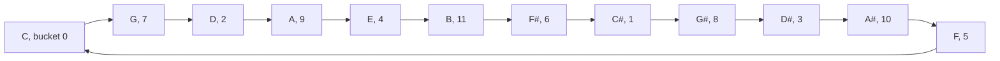

# Residue classes: the n remainder buckets, and the small addition and multiplication tables they form

Number theory → Clock Arithmetic → Remainder buckets → Residue classes

---

## General Overview

A piano has 88 keys and 12 note names: the C near the middle and the C above it are different keys, one name. An octave is 12 semitones, black keys counted.

Number a key by its semitones from C, drop the whole octaves, and what is left is 0 to 11: 0 is C, 7 is G, 2 is D. All 88 keys land in one of twelve buckets, the pitch classes.

Up 7 semitones from C is G; up 7 more is 14 semitones, an octave (12) and 2 over. That is D, bucket 2.

**A residue class is every number leaving the same remainder — bucket 2 out of 12 is ... -22, -10, 2, 14, 26 ... — and the n buckets add and multiply among themselves.**

### The picture: stacking fifths



Each arrow is up 7 semitones, octaves dropped. Twelve brings you home through all 12 buckets: the circle of fifths.

---

## The formula

A bucket is a set, running on forever:

**bucket 2 (mod 12) = ... -22, -10, 2, 14, 26 ...**

"mod 12" says divide by 12 and keep the remainder ([congruence-mod-n](01-congruence-mod-n.md)). Any member names the whole bucket: "bucket 14" and "bucket 2" are one set. The rule behind every table:

**bucket 7 + bucket 7 = bucket 2, because 7 + 7 = 14, and 14 leaves 2 after one whole 12**

**Read it aloud:** add any member of one bucket to any member of the other; where the total lands is the answer.

| Piece | Plain meaning | In our piano |
| --- | --- | --- |
| the modulus, n | how many buckets, and what you divide by | 12 semitones per octave |
| the remainder | what is left after whole n's come off ([division-with-remainder](../01-Divisibility%20and%20Primes/04-division-with-remainder.md)) | 14 leaves 2 |
| a residue class | every number with that remainder, as one thing | bucket 2: ... 2, 14, 26 ... |
| Z mod n | Z, the whole numbers, sorted into all n buckets, with their own plus and times | Z mod 12, the pitch classes |

---

## Why it works

### Step 0: every whole number lands in one bucket and no other

Divide by 12 and exactly one remainder from 0 to 11 comes back ([division-with-remainder](../01-Divisibility%20and%20Primes/04-division-with-remainder.md)) — negatives included, which is why -22 sits in bucket 2. The buckets cover every whole number and none overlap.

### Step 1: which member you pick does not matter

Play the G above middle C, 19 semitones up, not 7, and stack it again: 19 + 19 = 38, octaves off, leaves 2. D again.

[modular-addition-and-multiplication](02-modular-addition-and-multiplication.md) showed that reducing before or after agrees, so the bucket you land in never depends on the members picked — the licence to add buckets rather than numbers.

**Residue classes**, the name from line one, and the set of all n is **Z mod n** — on the piano, Z mod 12. (A set adding and multiplying this well is a **ring** — wing 03 takes that apart.)

### Step 2: out of 6 — six buckets, mod 6 — two non-zero ones multiply to zero

Bucket 2 times bucket 3 is bucket 0: 2 × 3 = 6, one whole 6, nothing over. Neither side is zero and the answer is zero — whole numbers never do that.

Why: 6 splits as 2 × 3, both above 1 and below 6, so those buckets multiply to one whole 6. Any modulus that splits does the same. 5 is prime and cannot split; and if a prime divides a product it divides one of the factors ([euclids-lemma](../02-Greatest%20Common%20Divisor%20and%20Euclid%27s%20Algorithm/06-euclids-lemma.md)), so out of 5 a zero answer needs a zero factor.

---

## Worked numbers, by hand

| Step | Arithmetic | Value |
| --- | --- | --- |
| a fifth from C, then another | 7 + 7 | 14 |
| take off one octave | 14 − 12 | **2, which is D** |
| keep stacking fifths | 0, 7, 2, 9, 4, 11, 6, 1, 8, 3, 10, 5 | all 12 |
| stacking 8 semitones instead | 0, 8, 4 | only 3 |
| bucket 2 times bucket 3, out of 6 | 2 × 3 = 6 | **0** |

Two fifths above C is D, wherever you play them.

### The tables

Row is the first bucket, column the second.

```
mod 5, adding           mod 5, multiplying
 +  0 1 2 3 4            x  0 1 2 3 4
 0  0 1 2 3 4            0  0 0 0 0 0
 1  1 2 3 4 0            1  0 1 2 3 4
 2  2 3 4 0 1            2  0 2 4 1 3
 3  3 4 0 1 2            3  0 3 1 4 2
 4  4 0 1 2 3            4  0 4 3 2 1

mod 6, multiplying
 x  0 1 2 3 4 5
 0  0 0 0 0 0 0
 1  0 1 2 3 4 5
 2  0 2 4 0 2 4
 3  0 3 0 3 0 3
 4  0 4 2 0 4 2
 5  0 5 4 3 2 1
```

Every non-zero row of the mod 5 square holds all four non-zero buckets; rows 2, 3 and 4 of the mod 6 square hit 0: 2 x 3, 3 x 2, 3 x 4, 4 x 3.

### What breaks if you drop a piece

| Mistake | Comes out at | What went wrong |
| --- | --- | --- |
| Cancelling the 2 in 2 × 3 = 2 × 0, out of 6 | 3 = 0 | Nothing undoes bucket 2 ([modular-inverse](04-modular-inverse.md)) |
| Stacking 8 semitones, expecting 12 | 0, 8, 4 | 8 and 12 share a factor ([coprime-numbers](../02-Greatest%20Common%20Divisor%20and%20Euclid%27s%20Algorithm/05-coprime-numbers.md)) |

---

## Code, from first principles, and it actually runs

Nothing is imported. The stacked fifths, the walk round them, then the three tables. Each table is built twice — from the buckets 0, 1, 2 and so on, and from members three whole clocks up and six down. Both must match: Step 1, tested.

### Python

```python
# Residue classes -- the check behind the card.  Nothing is imported.  The 12
# pitch classes: up a fifth twice, 7 + 7 = 14, which lands in bucket 2.  Then the
# mod 5 and mod 6 tables, built from the buckets and again from far-off members.
def bucket(x, n): return x % n           # which of the n buckets x falls in
def table(n, jump, times):               # jump 0 uses 0 to n-1, jump 3 uses far members
    pick = lambda i, s: i + s * jump * n
    return [[bucket(pick(a, 1) * pick(b, -2) if times else pick(a, 1) + pick(b, -2), n)
             for b in range(n)] for a in range(n)]
def walk(step, n):                       # step round the n buckets until back at bucket 0
    seen = [0]
    while bucket(seen[-1] + step, n):
        seen.append(bucket(seen[-1] + step, n))
    return seen
def row(name, rows):
    print(f"{name:<22}" + " | ".join(" ".join(str(v) for v in r) for r in rows))
def zero_pairs(n): return [(a, b) for a in range(1, n) for b in range(1, n) if bucket(a * b, n) == 0]
print(f"{'pitch classes in an octave':<38}{12:>4}")
print(f"{'up two fifths, 7 + 7 = 14, bucket':<38}{bucket(14, 12):>4}")
print(f"{'an octave up, 19 + 19 = 38, bucket':<38}{bucket(38, 12):>4}")
print("bucket 2 holds ... " + " ".join(str(2 + 12 * k) for k in (-2, -1, 0, 1, 2)) + " ...")
print(f"fifths walk by 7: {' '.join(map(str, walk(7, 12)))}, back to 0 after {len(walk(7, 12))} buckets")
print(f"walk by 8 instead: {' '.join(map(str, walk(8, 12)))}, back to 0 after {len(walk(8, 12))} buckets")
row("mod 5 add rows 0-4:", table(5, 0, False))
row("mod 5 times rows 0-4:", table(5, 0, True))
row("mod 6 times rows 0-5:", table(6, 0, True))
print(f"non-zero pairs multiplying to 0: mod 5: {len(zero_pairs(5))}, mod 6: {len(zero_pairs(6))}: " + ", ".join(f"{a} x {b}" for a, b in zero_pairs(6)))
assert bucket(14, 12) == 2 and bucket(38, 12) == 2 and bucket(-22, 12) == 2 and walk(7, 12) == [0, 7, 2, 9, 4, 11, 6, 1, 8, 3, 10, 5] and walk(8, 12) == [0, 8, 4]
assert table(5, 0, True) == [[0, 0, 0, 0, 0], [0, 1, 2, 3, 4], [0, 2, 4, 1, 3], [0, 3, 1, 4, 2], [0, 4, 3, 2, 1]] and zero_pairs(5) == []
assert zero_pairs(6) == [(2, 3), (3, 2), (3, 4), (4, 3)] and table(5, 0, True) == table(5, 3, True) and table(6, 0, True) == table(6, 3, True) and table(5, 0, False) == table(5, 3, False) and table(5, 0, False) == [[0, 1, 2, 3, 4], [1, 2, 3, 4, 0], [2, 3, 4, 0, 1], [3, 4, 0, 1, 2], [4, 0, 1, 2, 3]]
print("ALL CHECKS PASS")
```

**Ran 2026-09-06 on macOS, Python 3.14.6, standard library only. All checks passed. Output, pasted from the run:**

```
pitch classes in an octave              12
up two fifths, 7 + 7 = 14, bucket        2
an octave up, 19 + 19 = 38, bucket       2
bucket 2 holds ... -22 -10 2 14 26 ...
fifths walk by 7: 0 7 2 9 4 11 6 1 8 3 10 5, back to 0 after 12 buckets
walk by 8 instead: 0 8 4, back to 0 after 3 buckets
mod 5 add rows 0-4:   0 1 2 3 4 | 1 2 3 4 0 | 2 3 4 0 1 | 3 4 0 1 2 | 4 0 1 2 3
mod 5 times rows 0-4: 0 0 0 0 0 | 0 1 2 3 4 | 0 2 4 1 3 | 0 3 1 4 2 | 0 4 3 2 1
mod 6 times rows 0-5: 0 0 0 0 0 0 | 0 1 2 3 4 5 | 0 2 4 0 2 4 | 0 3 0 3 0 3 | 0 4 2 0 4 2 | 0 5 4 3 2 1
non-zero pairs multiplying to 0: mod 5: 0, mod 6: 4: 2 x 3, 3 x 2, 3 x 4, 4 x 3
ALL CHECKS PASS
```

### Rust

Same labels, built with `rustc --edition 2021 -O`.

```rust
// Residue classes -- the same check as the Python, in Rust.  No crates.  The 12
// pitch classes: up a fifth twice, 7 + 7 = 14, which lands in bucket 2.  Then the
// mod 5 and mod 6 tables, built from the buckets and again from far-off members.
fn bucket(x: i64, n: i64) -> i64 { x.rem_euclid(n) }   // which of the n buckets x falls in
fn table(n: i64, jump: i64, times: bool) -> Vec<Vec<i64>> {   // jump 0 uses 0 to n-1
    (0..n).map(|a| (0..n).map(|b| { let (p, q) = (a + jump * n, b - 2 * jump * n);
        bucket(if times { p * q } else { p + q }, n) }).collect()).collect()
}
fn walk(step: i64, n: i64) -> Vec<i64> {               // step round until back at bucket 0
    let mut seen = vec![0i64];
    loop { let next = bucket(seen[seen.len() - 1] + step, n); if next == 0 { return seen; } seen.push(next); }
}
fn join(v: &[i64]) -> String { v.iter().map(|x| x.to_string()).collect::<Vec<_>>().join(" ") }
fn row(name: &str, rows: &[Vec<i64>]) {
    println!("{:<22}{}", name, rows.iter().map(|r| join(r)).collect::<Vec<_>>().join(" | "));
}
fn zero_pairs(n: i64) -> Vec<(i64, i64)> {
    (1..n).flat_map(|a| (1..n).map(move |b| (a, b))).filter(|(a, b)| bucket(a * b, n) == 0).collect()
}
fn main() {
    println!("{:<38}{:>4}", "pitch classes in an octave", 12);
    println!("{:<38}{:>4}", "up two fifths, 7 + 7 = 14, bucket", bucket(14, 12));
    println!("{:<38}{:>4}", "an octave up, 19 + 19 = 38, bucket", bucket(38, 12));
    println!("bucket 2 holds ... {} ...", join(&(-2..3).map(|k| 2 + 12 * k).collect::<Vec<_>>()));
    let (w7, w8) = (walk(7, 12), walk(8, 12));
    println!("fifths walk by 7: {}, back to 0 after {} buckets", join(&w7), w7.len());
    println!("walk by 8 instead: {}, back to 0 after {} buckets", join(&w8), w8.len());
    row("mod 5 add rows 0-4:", &table(5, 0, false));
    row("mod 5 times rows 0-4:", &table(5, 0, true));
    row("mod 6 times rows 0-5:", &table(6, 0, true));
    let z6 = zero_pairs(6);
    println!("non-zero pairs multiplying to 0: mod 5: {}, mod 6: {}: {}", zero_pairs(5).len(), z6.len(),
             z6.iter().map(|(a, b)| format!("{} x {}", a, b)).collect::<Vec<_>>().join(", "));
    assert!(bucket(14, 12) == 2 && bucket(38, 12) == 2 && bucket(-22, 12) == 2 && w7 == vec![0, 7, 2, 9, 4, 11, 6, 1, 8, 3, 10, 5] && w8 == vec![0, 8, 4]);
    assert!(table(5, 0, true) == vec![vec![0, 0, 0, 0, 0], vec![0, 1, 2, 3, 4], vec![0, 2, 4, 1, 3], vec![0, 3, 1, 4, 2], vec![0, 4, 3, 2, 1]] && zero_pairs(5).is_empty());
    assert!(z6 == vec![(2, 3), (3, 2), (3, 4), (4, 3)] && table(5, 0, true) == table(5, 3, true) && table(6, 0, true) == table(6, 3, true) && table(5, 0, false) == table(5, 3, false) && table(5, 0, false) == vec![vec![0, 1, 2, 3, 4], vec![1, 2, 3, 4, 0], vec![2, 3, 4, 0, 1], vec![3, 4, 0, 1, 2], vec![4, 0, 1, 2, 3]]);
    println!("ALL CHECKS PASS");
}
```

**Ran 2026-09-06 on macOS, rustc 1.98.1, no crates. All checks passed. Output, pasted from the run:**

```
pitch classes in an octave              12
up two fifths, 7 + 7 = 14, bucket        2
an octave up, 19 + 19 = 38, bucket       2
bucket 2 holds ... -22 -10 2 14 26 ...
fifths walk by 7: 0 7 2 9 4 11 6 1 8 3 10 5, back to 0 after 12 buckets
walk by 8 instead: 0 8 4, back to 0 after 3 buckets
mod 5 add rows 0-4:   0 1 2 3 4 | 1 2 3 4 0 | 2 3 4 0 1 | 3 4 0 1 2 | 4 0 1 2 3
mod 5 times rows 0-4: 0 0 0 0 0 | 0 1 2 3 4 | 0 2 4 1 3 | 0 3 1 4 2 | 0 4 3 2 1
mod 6 times rows 0-5: 0 0 0 0 0 0 | 0 1 2 3 4 5 | 0 2 4 0 2 4 | 0 3 0 3 0 3 | 0 4 2 0 4 2 | 0 5 4 3 2 1
non-zero pairs multiplying to 0: mod 5: 0, mod 6: 4: 2 x 3, 3 x 2, 3 x 4, 4 x 3
ALL CHECKS PASS
```

Both outputs match line for line.

> [!TIP]
> **Try changing**
> Guess first, then run. The asserts are pinned to the house numbers, so the first change fires one.
> - **Walk by 6 semitones, not 7.** Change `walk(7, 12)` to `walk(6, 12)`: a tritone comes home after two buckets, 0 and 6.
> - **Count the zero pairs out of 7.** Change both `zero_pairs(6)` calls in the last print to `zero_pairs(7)` — the label still reads mod 6. Seven is prime, so the count prints 0, as out of 5. Nothing fires: the asserts keep their own 6.

---

## The usual mistake

> [!warning]
> **Treating a bucket as the small number sitting in it.** Bucket 2 is not the number 2. It is 2, 14, 26, -10 and -22 as one thing, each answering to the name.
>
> - Expecting division to work. Out of 6, bucket 2 times bucket 3 is bucket 0, so "divide by 2" means nothing: [modular-inverse](04-modular-inverse.md).
> - Reading Z mod 12 as the numbers 0 to 11. It is twelve buckets, each holding infinitely many, -22 included.

---

## Where you meet it in real life

- **Music.** Pitch classes are Z mod 12: transposing adds one bucket to every note, and the circle of fifths is the walk above.
- **Check digits.** A barcode's last digit is picked so a weighted total lands in bucket 0; mistype one and the scanner sees another bucket.
- **Hash tables.** Storage drops each key into one of n slots by remainder. Keys that share a factor with 6 pile into the few buckets that factor reaches, so n is picked prime.

> **Say it back**
> Sort the whole numbers by their remainder after dividing by 12: twelve buckets, covering everything, overlapping nowhere. Each is a residue class — bucket 2 is 2, 14, 26 and -10 at once. Any member stands in for the bucket, so the buckets add and multiply themselves, and that set is Z mod 12. Out of 5 no two non-zero buckets multiply to 0; out of 6 some do, since 6 = 2 × 3.

---

## What this builds on

- [modular-addition-and-multiplication](02-modular-addition-and-multiplication.md): reducing before or after agrees — what lets a bucket be added and multiplied, not just a number.
- [equivalence-relations-and-partitions](../../01-Foundations/08-Relations%20and%20Functions/06-equivalence-relations-and-partitions.md): cutting a set into non-overlapping bunches, the general idea; these buckets come from [division-with-remainder](../01-Divisibility%20and%20Primes/04-division-with-remainder.md).

## Where this goes next

- [modular-inverse](04-modular-inverse.md): which buckets you may divide by, and why bucket 2 fails out of 6.
- [eulers-totient](../04-Powers%20on%20the%20Clock/03-eulers-totient.md): counting the buckets that have an undo.

---

## Sources

Verified 6 Sep 2026; every link resolves.

- Gauss, Carl Friedrich. *Disquisitiones Arithmeticae* (1801), trans. Arthur A. Clarke. Springer. [doi:10.1007/978-1-4939-7560-0](https://doi.org/10.1007/978-1-4939-7560-0). Section I, where the buckets start.
- Ireland, Kenneth, and Michael Rosen. *A Classical Introduction to Modern Number Theory*, 2nd ed. Springer, 1990. [doi:10.1007/978-1-4757-2103-4](https://doi.org/10.1007/978-1-4757-2103-4). Chapter 3, computing with the buckets.
- Hammack, Richard. *Book of Proof*, 3rd ed., 2018. [Author's full text](https://richardhammack.github.io/BookOfProof/). Chapter 11, Step 0 in general.
