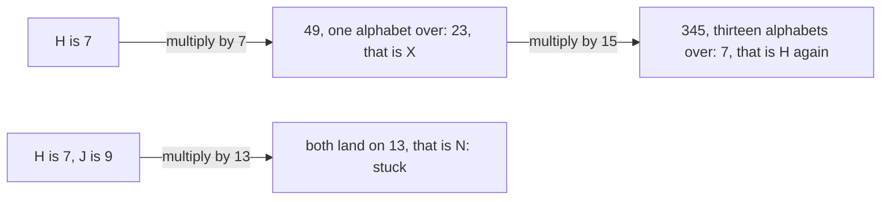

# The modular inverse: dividing on the clock works exactly when the number is coprime to the modulus

[Syllabus](../../../SYLLABUS.md) → [Number theory](../README.md) → [Clock Arithmetic](../README.md#s03) → The modular inverse

---

## General Overview

A note passed across a room, scrambled. Number the letters: A is 0, up to Z is 25. Multiply each by 7, taking off whole alphabets of 26 when it runs past 25 ([Congruence](01-congruence-mod-n.md)).

H is 7: seven sevens is 49, less one alphabet is 23, which is X. I is 8 and goes to E, so HI goes out as XE.

Reading it back is the problem. You would divide by 7, but a letter has no seventh. Multiply by 15 instead: X is 23, and 23 × 15 = 345, thirteen alphabets and 7 over. H again.

15 is the **modular inverse** of 7 on a 26-letter clock: what multiplies 7 back to 1. The 26 is the **modulus**, the clock size; the 7 is the **key**, what each letter is multiplied by.

It does not always exist. Key 13 sends both H (7) and J (9) to N, and nothing pulls two letters out of one: 13 and 26 share 13, while 7 and 26 share nothing above 1.

**A key can be undone exactly when it and the modulus are coprime — sharing no factor above 1 ([Coprime numbers](../02-Greatest%20Common%20Divisor%20and%20Euclid%27s%20Algorithm/05-coprime-numbers.md)) — and the undoing is itself a multiplication, which Euclid's chain ([Euclid's algorithm](../02-Greatest%20Common%20Divisor%20and%20Euclid%27s%20Algorithm/03-euclidean-algorithm.md)) run backwards hands you.**

### The picture



---

## The formula

**7 × 15 = 105 = 4 × 26 + 1**

**Read it aloud: seven fifteens is four alphabets and one letter over, so 7 then 15 leaves a letter where it started.**

In general: **key times inverse is a whole number of alphabets, plus 1** — here, 7 × 15 ≡ 1 (mod 26).

| Piece | Plain meaning | Here |
| --- | --- | --- |
| the modulus | the clock size, where it wraps | 26 |
| the key | what a letter's number is multiplied by | 7 |
| the inverse | what multiplies the key back to 1 | 15 |
| coprime | sharing no factor above 1 (gcd, the biggest divisor of both, is 1) | gcd(7, 26) = 1 |
| a letter's number | A is 0, up to Z is 25 | H is 7 |

---

## Why it works

### Step 0: undoing means landing back on 1

Multiplying by 7 then by 15 is multiplying by 105, whether the alphabets come off in between or at the end ([Adding and multiplying on the clock](02-modular-addition-and-multiplication.md)). And 105 is 1 past four alphabets: multiplying by 1 changes nothing, so every letter comes home.

### Step 1: a shared factor kills the inverse

Start with numbers already here: 7 × 15 − 4 × 26 = 1. That is a **mix** of 7 and 26 — each times a whole number, added up. Anything dividing 7 and 26 divides both parts, so it divides the left side ([Divides](../01-Divisibility%20and%20Primes/01-divides.md)), so it divides 1. Only 1 does. Any key and its undoing number make the same kind of mix, so a key sharing a factor with 26 has no inverse: 13 divides both 13 and 26.

### Step 2: coprime, and Bezout hands you the inverse

[Bezout's identity](../02-Greatest%20Common%20Divisor%20and%20Euclid%27s%20Algorithm/04-bezouts-identity.md): a mix of two numbers reaches their gcd, here 1. Run Euclid down 26 and 7, then feed each line back into the one above — three swaps, in the rows below:

7 × (−11) + 26 × 3 = 1

The 26s are whole alphabets: they vanish, leaving 7 × (−11) on 1. So −11 undoes the key; one alphabet brings it into range ([Negative numbers](../../01-Foundations/01-Everyday%20Arithmetic/06-negative-numbers.md), [Residue classes](03-residue-classes.md)): −11 + 26 = 15.

### Step 3: one inverse only, so cancelling is safe

Two undoing numbers: their difference times 7 lands on 0, a whole run of alphabets. Multiply 7 × (−11) + 26 × 3 = 1 by that difference ([Bezout's identity](../02-Greatest%20Common%20Divisor%20and%20Euclid%27s%20Algorithm/04-bezouts-identity.md)): the 26 term is a run of alphabets, and so is the 7 term, being 7 times the difference — so the difference is one too. −11 and 15 are the same slot, one inverse. Cancelling is then safe: 7 times one letter equal to 7 times another means the letters are equal.

A prime modulus opens another route: [Fermat's little theorem](../04-Powers%20on%20the%20Clock/02-fermats-little-theorem.md). 26 is not prime, so it is shut.

---

## Worked numbers, by hand

Euclid down, then back up ([Euclid's algorithm](../02-Greatest%20Common%20Divisor%20and%20Euclid%27s%20Algorithm/03-euclidean-algorithm.md)). Each line's whole-number answer is its **quotient**.

| Step | Arithmetic | Value |
| --- | --- | --- |
| divide 26 by 7 | 26 = 3 × 7 + 5 | 5 |
| divide 7 by 5 | 7 = 1 × 5 + 2 | 2 |
| divide 5 by 2 | 5 = 2 × 2 + 1 | 1 |
| the last line | 1 = 5 − 2 × 2 | 1 |
| swap in 2 = 7 − 1 × 5 | 1 = 3 × 5 − 2 × 7 | 1 |
| swap in 5 = 26 − 3 × 7 | 1 = 3 × 26 − 11 × 7 = 78 − 77 | 1 |
| into the alphabet | −11 + 26 | **15** |

15 is the multiplier that sends every letter home.

### What breaks if you drop a piece

| Mistake | X reads as | What went wrong |
| --- | --- | --- |
| Reading X with the key, 7 | 5 | Two 7s multiply by 49, not 1 |
| Reading X with a quotient, 3 | 17 | A quotient is an ingredient, not the answer |
| Reading X with key 13 | 13 | 13 shares 13 with 26: no inverse |

---

## Code, from first principles, and it actually runs

Nothing is imported. Road one runs Euclid down and walks the chain back up. Road two tries all 26 keys. Listing divisors is a third route to the gcd.

### Python

```python
# The modular inverse -- the check behind the card.  Nothing is imported.  A cipher
# on 26 letters multiplies each letter's number by the key 7.  Road one: Euclid.
KEY, N, LETTERS = 7, 26, "ABCDEFGHIJKLMNOPQRSTUVWXYZ"
def listing_gcd(a, b):                 # independent of Euclid: list the divisors
    return max(d for d in range(1, min(a, b) + 1) if a % d == 0 and b % d == 0)
chain, g, b = [], N, KEY
while b:                               # divide, keep the remainder, go again
    chain.append((g, g // b, b, g % b))
    g, b = b, g % b                    # g ends as the gcd
print(f"{f'gcd({KEY}, {N}), by listing divisors':<44}{listing_gcd(KEY, N):>3}")
print("Euclid down: " + ", ".join(f"{u} = {q} x {v} + {r}" for (u, q, v, r) in chain[:-1]))
p, s = 1, -chain[-2][1]                # the last useful line: 1 = 5 - 2 x 2
for (u, q, v, r) in reversed(chain[:-2]):
    p, s = s, p - s * q                # swap in the line above it
print(f"Euclid back up: {KEY} x {s} + {N} x {p} = {KEY * s} + {N * p} = {KEY * s + N * p}")
inv = s % N
print(f"inverse of {KEY} on {N} letters: {s} + {N} = {inv}")
print(f"{KEY} x {inv} = {KEY * inv} = {KEY * inv // N} x {N} + {KEY * inv % N}")
brute, lands = [k for k in range(N) if KEY * k % N == 1], sorted({13 * k % N for k in range(N)})
print(f"by search, the only k in 0 to 25 with {KEY} x k = 1: {brute[0]}")
for i in (7, 8):
    e = i * KEY % N
    print(f"{LETTERS[i]} is {i}: {i} x {KEY} = {i * KEY} = {e}, that is {LETTERS[e]}; {e} x {inv} = {e * inv} = {e * inv % N}, back to {LETTERS[e * inv % N]}")
print(f"key 13: gcd(13, {N}) = {listing_gcd(13, N)}, and 13 x k lands only on {lands[0]} or {lands[1]}")
print(f"key 13: H is 7 and J is 9, both land on {13 * 7 % N}, that is {LETTERS[13 * 7 % N]}")
print(f"the three mistakes come out at {23 * KEY % N}, {23 * 3 % N} and {23 * 13 % N}")
assert g == 1 and g == listing_gcd(KEY, N) and KEY * inv == 4 * N + 1
assert inv == 15 and brute == [inv] and 7 * KEY % N == 23 and 23 * inv % N == 7
assert lands == [0, 13] and listing_gcd(13, N) == 13 and 1 not in lands
print("ALL CHECKS PASS")
```

**Ran 2026-09-06 on macOS, Python 3.14.6, standard library only. All checks passed. Output, pasted from the run:**

```
gcd(7, 26), by listing divisors               1
Euclid down: 26 = 3 x 7 + 5, 7 = 1 x 5 + 2, 5 = 2 x 2 + 1
Euclid back up: 7 x -11 + 26 x 3 = -77 + 78 = 1
inverse of 7 on 26 letters: -11 + 26 = 15
7 x 15 = 105 = 4 x 26 + 1
by search, the only k in 0 to 25 with 7 x k = 1: 15
H is 7: 7 x 7 = 49 = 23, that is X; 23 x 15 = 345 = 7, back to H
I is 8: 8 x 7 = 56 = 4, that is E; 4 x 15 = 60 = 8, back to I
key 13: gcd(13, 26) = 13, and 13 x k lands only on 0 or 13
key 13: H is 7 and J is 9, both land on 13, that is N
the three mistakes come out at 5, 17 and 13
ALL CHECKS PASS
```

### Rust

Same numbers, same labels, built with `rustc --edition 2021 -O`.

```rust
// The modular inverse -- the same check as the Python twin, in Rust.  No crates.
// A cipher on 26 letters multiplies each letter's number by the key 7.  Road one: Euclid.
const KEY: i64 = 7;
const N: i64 = 26;
const LETTERS: &str = "ABCDEFGHIJKLMNOPQRSTUVWXYZ";
fn listing_gcd(a: i64, b: i64) -> i64 {   // independent of Euclid: list the divisors
    (1..=a.min(b)).filter(|d| a % d == 0 && b % d == 0).max().unwrap()
}
fn letter(i: i64) -> char { LETTERS.as_bytes()[i as usize] as char }
fn main() {
    let mut chain: Vec<(i64, i64, i64, i64)> = Vec::new();
    let (mut g, mut b) = (N, KEY);
    while b != 0 { let r = g % b; chain.push((g, g / b, b, r)); g = b; b = r; }   // g ends as the gcd
    println!("{:<44}{:>3}", format!("gcd({}, {}), by listing divisors", KEY, N), listing_gcd(KEY, N));
    let n = chain.len();
    let down: Vec<String> = chain[..n - 1].iter().map(|&(u, q, v, r)| format!("{} = {} x {} + {}", u, q, v, r)).collect();
    println!("Euclid down: {}", down.join(", "));
    let (mut p, mut s) = (1, -chain[n - 2].1);   // the last useful line: 1 = 5 - 2 x 2
    for &(_, q, _, _) in chain[..n - 2].iter().rev() { let (np, ns) = (s, p - s * q); p = np; s = ns; }
    println!("Euclid back up: {} x {} + {} x {} = {} + {} = {}", KEY, s, N, p, KEY * s, N * p, KEY * s + N * p);
    let inv = ((s % N) + N) % N;
    println!("inverse of {} on {} letters: {} + {} = {}", KEY, N, s, N, inv);
    println!("{} x {} = {} = {} x {} + {}", KEY, inv, KEY * inv, KEY * inv / N, N, KEY * inv % N);
    let brute: Vec<i64> = (0..N).filter(|k| KEY * k % N == 1).collect();   // road two: try all 26 keys
    let mut lands: Vec<i64> = (0..N).map(|k| 13 * k % N).collect();
    lands.sort(); lands.dedup();
    println!("by search, the only k in 0 to 25 with {} x k = 1: {}", KEY, brute[0]);
    for i in [7_i64, 8] {
        let e = i * KEY % N;
        println!("{} is {}: {} x {} = {} = {}, that is {}; {} x {} = {} = {}, back to {}", letter(i), i, i, KEY, i * KEY, e, letter(e), e, inv, e * inv, e * inv % N, letter(e * inv % N));
    }
    println!("key 13: gcd(13, {}) = {}, and 13 x k lands only on {} or {}", N, listing_gcd(13, N), lands[0], lands[1]);
    println!("key 13: H is 7 and J is 9, both land on {}, that is {}", 13 * 7 % N, letter(13 * 7 % N));
    println!("the three mistakes come out at {}, {} and {}", 23 * KEY % N, 23 * 3 % N, 23 * 13 % N);
    assert!(g == 1 && g == listing_gcd(KEY, N) && KEY * inv == 4 * N + 1);
    assert!(inv == 15 && brute == vec![inv] && 7 * KEY % N == 23 && 23 * inv % N == 7);
    assert!(lands == vec![0, 13] && listing_gcd(13, N) == 13 && !lands.contains(&1));
    println!("ALL CHECKS PASS");
}
```

**Ran 2026-09-06 on macOS, rustc 1.98.1, no crates. All checks passed. Output, pasted from the run:**

```
gcd(7, 26), by listing divisors               1
Euclid down: 26 = 3 x 7 + 5, 7 = 1 x 5 + 2, 5 = 2 x 2 + 1
Euclid back up: 7 x -11 + 26 x 3 = -77 + 78 = 1
inverse of 7 on 26 letters: -11 + 26 = 15
7 x 15 = 105 = 4 x 26 + 1
by search, the only k in 0 to 25 with 7 x k = 1: 15
H is 7: 7 x 7 = 49 = 23, that is X; 23 x 15 = 345 = 7, back to H
I is 8: 8 x 7 = 56 = 4, that is E; 4 x 15 = 60 = 8, back to I
key 13: gcd(13, 26) = 13, and 13 x k lands only on 0 or 13
key 13: H is 7 and J is 9, both land on 13, that is N
the three mistakes come out at 5, 17 and 13
ALL CHECKS PASS
```

The two outputs match line for line.

> [!TIP]
> **Try changing**
> Guess first.
> - **Set the key to 5.** Also coprime to 26: it prints inverse 21, and 5 × 21 = 105 too, then a pinned assert fires, since 15 is written into it.
> - **Set the key to 13.** Euclid stops after one line, so the walk back up has nothing to stand on: an IndexError, before the search runs.

---

## The usual mistake

> [!warning]
> **Thinking every key can be undone, because on paper you can divide by anything.** Key 13 folds the alphabet onto two letters.
>
> - **Cancelling without checking.** 13 × 7 and 13 × 9 both land on 13; cancelling turns 7 into 9.
> - **Taking a quotient off the chain.** The 3 in 26 = 3 × 7 + 5 gives 17, not 15.
> - **Expecting a prime modulus.** 26 is not prime; 7 still has an inverse. Coprime is the test.

---

## Where you meet it in real life

- **Cipher keys.** A multiplication cipher needs a key coprime to 26: every even key, and 13, wrecks the message.
- **Solving on the clock.** Multiply both sides by the inverse: [Solving a x ≡ b (mod n)](05-linear-congruences.md), [The Chinese remainder theorem](06-chinese-remainder-theorem.md).
- **Public key cryptography.** The private key is the inverse of the public one, on a clock nobody else can size: [RSA in outline](../06-Codes%20and%20Secrets/03-rsa-in-outline.md).

> **Say it back**
> On a clock there is no dividing, only multiplying: to undo a key, find its inverse, what multiplies it back to 1. On 26 letters that is 15: 7 × 15 = 105, four alphabets and 1 over, so XE reads as HI. It exists exactly when key and clock size share no factor above 1, since a shared factor would have to divide 1. Euclid's chain, walked backwards, hands it over.

---

## What this builds on

- [Euclid's algorithm](../02-Greatest%20Common%20Divisor%20and%20Euclid%27s%20Algorithm/03-euclidean-algorithm.md): the chain this card runs and reverses.
- [Residue classes](03-residue-classes.md): the 26 letter slots and their tables.
- [Bezout's identity](../02-Greatest%20Common%20Divisor%20and%20Euclid%27s%20Algorithm/04-bezouts-identity.md): 1 as a mix of 7 and 26.
- [Coprime numbers](../02-Greatest%20Common%20Divisor%20and%20Euclid%27s%20Algorithm/05-coprime-numbers.md): the exact condition, sharing no factor above 1.
- [Negative numbers](../../01-Foundations/01-Everyday%20Arithmetic/06-negative-numbers.md): why −11 is a legal count.

## Where this goes next

- [Solving a x ≡ b (mod n)](05-linear-congruences.md): when key and modulus share a factor.
- [The Chinese remainder theorem](06-chinese-remainder-theorem.md): inverses as glue for remainders.
- [Fermat's little theorem](../04-Powers%20on%20the%20Clock/02-fermats-little-theorem.md): the other route, for a prime modulus.
- [RSA in outline](../06-Codes%20and%20Secrets/03-rsa-in-outline.md): one inverse nobody else can compute.

---

## Sources

Verified 6 Sep 2026: every link resolves.

- Shoup, Victor. *A Computational Introduction to Number Theory and Algebra*, 2nd ed. Cambridge University Press, 2008. [Full text](https://shoup.net/ntb/). Chapter 4: chain and inverse.
- Knuth, Donald E. *The Art of Computer Programming, Volume 2*, 3rd ed. Addison-Wesley, 1997. [Publisher page](https://www.informit.com/store/art-of-computer-programming-volume-2-seminumerical-9780201896848). Section 4.5.2, the carried counts.
- Gauss, Carl Friedrich. *Disquisitiones Arithmeticae*, 1801, trans. Arthur A. Clarke. [Archive copy](https://archive.org/details/disquisitionesar0000carl). Section II, where congruence notation began.
