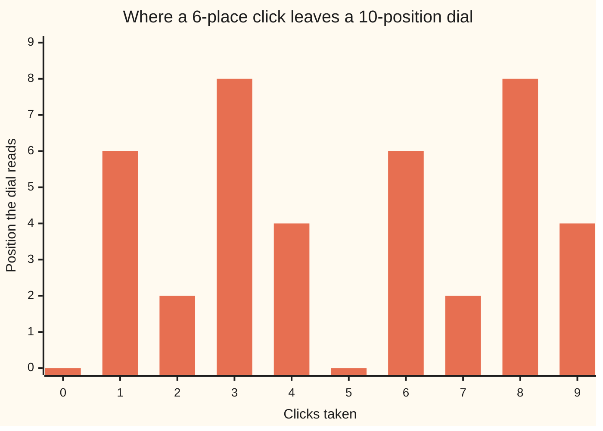

# Solving a x ≡ b (mod n): when it has answers, how many, and how to find them all

[Syllabus](../../../SYLLABUS.md) → [Number theory](../../../SYLLABUS.md#w02) → [Clock Arithmetic](../../../SYLLABUS.md#w02-s03) → Solving a x ≡ b (mod n)

---

## General Overview

A dial with 10 positions, 0 to 9, starting at 0. Each click jumps it 6 places; past 9 it wraps to 0.

You want it to read 4. How many clicks?

Click through. One: 6. Two: 12, reading 2. Three: 18, reading 8. Four: 24, reading **4**. It comes round at nine: 54 reads 4 too. Two answers, only two.

The odd part: the dial never shows 1, 3, 5, 7 or 9. Ask for 3 and you click forever. What rules a target out is 6 and 10 together.

In shorthand: **6x ≡ 4 (mod 10)** — x the clicks, six times them leaving remainder 4 on a 10-dial ([Congruence](01-congruence-mod-n.md)). That is a **linear congruence**: the unknown multiplied by a fixed number, on a clock. In letters, **a x ≡ b (mod n)**: a the step, b the target, n the dial.

**The gcd of the step and the dial — the biggest number dividing both — decides everything: if it does not divide the target there is no answer at all, and if it does, there are exactly that many answers.**

### The picture: click by click



It touches 4 twice, at four clicks and at nine, then repeats.

---

## The formula

The answers:

**6 × 4 = 24 = 2 × 10 + 4**   and   **6 × 9 = 54 = 5 × 10 + 4**

**Read it aloud: four clicks is two whole turns and 4 over; nine is five turns and 4 over.**

The rule: take the gcd of step and dial. If it does not divide the target, stop. Otherwise divide all three by it, solve the smaller clock, unfold.

| Piece | Plain meaning | On our dial |
| --- | --- | --- |
| the step, a | how far one click moves it | 6 |
| the dial, n (the modulus) | positions before wrapping | 10 |
| the target, b | where you want it | 4 |
| the clicks, x | the unknown | 4 and 9 |
| the gcd | biggest divisor of a and n | 2 |
| how many answers | the gcd | 2 |
| the gap between them | dial ÷ gcd | 5 |

---

## Why it works

### Step 0: every reading is a mix of step and dial

After x clicks the dial has moved 6x places, less whole turns of 10. The reading is 6x + 10y, with y counting turns thrown away — negative, since they are gone ([Negative numbers](../../01-Foundations/01-Everyday%20Arithmetic/06-negative-numbers.md)).

Every such mix is a multiple of gcd(6, 10) = 2 ([Bezout's identity](../02-Greatest%20Common%20Divisor%20and%20Euclid%27s%20Algorithm/04-bezouts-identity.md)). So every reading is even: an odd target is out of reach. That is the solvability test.

### Step 1: shrink the line by the gcd

4 is even, so we are in business. Reading 4 after x clicks means the places moved plus the turns thrown away come to 4:

6x + 10y = 4

All three numbers are even. Halve them:

3x + 5y = 2

which says **3x ≡ 2 (mod 5)**: a 5-position dial, 3 places a click, target 2. Halving loses nothing: same answers for x.

### Step 2: solve the small clock, then unfold

3 and 5 share no factor: coprime ([Coprime numbers](../02-Greatest%20Common%20Divisor%20and%20Euclid%27s%20Algorithm/05-coprime-numbers.md)). So 3 has an inverse on the 5-dial, undoing multiplication by 3 ([The modular inverse](04-modular-inverse.md)): 2, since 3 × 2 = 6 = 5 + 1. Multiply both sides:

x ≡ 2 × 2 ≡ 4 (mod 5)

The inverse is unique, so that is the only answer there: x is 4, 9, 14, 19 — every fifth number. On the 10-dial only 4 and 9 differ; 14 is 4 again. Two answers because the gcd is 2; five apart because 10 ÷ 2 = 5.

### The same equation in another costume

Go back to 6x + 10y = 4:

**6 × 4 + 10 × (−2) = 24 − 20 = 4**   and   **6 × 9 + 10 × (−5) = 54 − 50 = 4**

No clock now: whole numbers, two unknowns, one equation. That is a **linear Diophantine equation**: only whole numbers count as answers. The congruence hid the turns; this writes them down. On the dial, two answers; as whole numbers, endless pairs: 14 and −8, then 19 and −11.

<details>
<summary>The same sum, in coins</summary>

Six- and ten-cent coins, a 4-cent bill: four sixes over, two tens back. A 3-cent bill never settles: every mix is even.

</details>

---

## Worked numbers, by hand

The 10-dial, 6 places a click, target 4.

| Step | Arithmetic | Value |
| --- | --- | --- |
| gcd of step and dial | gcd(6, 10), and 4 ÷ 2 | 2, solvable |
| halve all three | 3x ≡ 2 (mod 5) | — |
| undo the 3 | 3 × 2 = 6 = 5 + 1 | inverse 2 |
| the shrunk answer | 2 × 2 | 4 (mod 5) |
| unfold, in steps of 5 | 6 × 4 = 24 = 2 × 10 + 4, 6 × 9 = 54 = 5 × 10 + 4 | **4 and 9** |

Four clicks lands on 4 after two full turns; nine after five.

### What breaks if you drop a piece

| Mistake | Comes out at | What went wrong |
| --- | --- | --- |
| Aiming at 3 | 0 answers | 2 does not divide 3; the dial reads even |
| Stopping at the first hit | 1 answer, 4 | the gcd is 2: two answers, five apart |

---

## Code, from first principles, and it actually runs

Nothing is imported. Road one clicks the dial every way. Road two runs the rule: gcd, halve, undo the step, unfold. Both must return the same pair.

### Python

```python
# Solving 6x = 4 (mod 10) -- the check behind the card.  Nothing is imported.
# A 10-position dial, 6 places per click.  Road one: try all ten step counts.
# Road two: the gcd rule -- shrink the clock, undo the step, unfold.
A, B, N = 6, 4, 10

def plain_gcd(a, b):              # list the divisors; no algorithm assumed
    return max(d for d in range(1, min(a, b) + 1) if a % d == 0 and b % d == 0)

def brute(a, b, n):               # road one: every step count on the dial
    return [x for x in range(n) if (a * x) % n == b % n]

g = plain_gcd(A, N)
orbit = [(A * x) % N for x in range(N)]
print(f"where the dial sits after 0..{N - 1} clicks: " + " ".join(str(p) for p in orbit))
print(f"{f'gcd({A}, {N})':<34}{g:>4}")
print(f"{'answers by trying every click':<34}{str(brute(A, B, N)):>8}")
a2, b2, n2 = A // g, B // g, N // g          # road two: shrink the whole line by 2
inv = next(t for t in range(n2) if (a2 * t) % n2 == 1)
first = (inv * b2) % n2
found = [first + n2 * k for k in range(g)]
print(f"shrunk to {a2}x = {b2} (mod {n2}); undo the {a2} with {inv}; x = {first} (mod {n2})")
print(f"{'unfolded, in steps of ' + str(n2):<34}{str(found):>8}")
print(";  ".join(f"{A} x {x} = {A * x} = {A * x // N} x {N} + {A * x % N}" for x in found))
print("as whole numbers: " + ", ".join(f"{A} x {x} + {N} x {(B - A * x) // N} = {B}" for x in found))
print(f"aiming at 3: {len(brute(A, 3, N))} answers; shrinking {A} and {B} but not the {N}: {brute(a2, b2, N)}")
assert g == 2 and found == brute(A, B, N) == [4, 9] and len(found) == g
assert (A * 4) % N == B and A * 4 + N * -2 == B and A * 9 + N * -5 == B
assert brute(A, 3, N) == [] and brute(a2, b2, N) == [4] and N // g == 5
print("ALL CHECKS PASS")
```

**Ran 2026-09-06 on macOS, Python 3.14.6, standard library only. All checks passed. Output, pasted from the run:**

```
where the dial sits after 0..9 clicks: 0 6 2 8 4 0 6 2 8 4
gcd(6, 10)                           2
answers by trying every click       [4, 9]
shrunk to 3x = 2 (mod 5); undo the 3 with 2; x = 4 (mod 5)
unfolded, in steps of 5             [4, 9]
6 x 4 = 24 = 2 x 10 + 4;  6 x 9 = 54 = 5 x 10 + 4
as whole numbers: 6 x 4 + 10 x -2 = 4, 6 x 9 + 10 x -5 = 4
aiming at 3: 0 answers; shrinking 6 and 4 but not the 10: [4]
ALL CHECKS PASS
```

### Rust

Same numbers, same labels, `rustc --edition 2021 -O`.

```rust
// Solving 6x = 4 (mod 10) -- the same check as the Python twin, in Rust.  No
// crates.  A 10-position dial, 6 places per click.  Road one: try all ten step
// counts.  Road two: the gcd rule -- shrink the clock, undo the step, unfold.
const A: i64 = 6;
const B: i64 = 4;
const N: i64 = 10;

fn plain_gcd(a: i64, b: i64) -> i64 {            // list the divisors; no algorithm assumed
    (1..=a.min(b)).filter(|d| a % d == 0 && b % d == 0).max().unwrap()
}

fn brute(a: i64, b: i64, n: i64) -> Vec<i64> {   // road one: every step count on the dial
    (0..n).filter(|x| (a * x) % n == b % n).collect()
}

fn show(v: &[i64]) -> String {                   // "[4, 9]", the way Python prints a list
    format!("[{}]", v.iter().map(|x| x.to_string()).collect::<Vec<String>>().join(", "))
}

fn main() {
    let g = plain_gcd(A, N);
    let orbit: Vec<String> = (0..N).map(|x| ((A * x) % N).to_string()).collect();
    println!("where the dial sits after 0..{} clicks: {}", N - 1, orbit.join(" "));
    println!("{:<34}{:>4}", format!("gcd({}, {})", A, N), g);
    println!("{:<34}{:>8}", "answers by trying every click", show(&brute(A, B, N)));
    let (a2, b2, n2) = (A / g, B / g, N / g);    // road two: shrink the whole line by 2
    let inv = (0..n2).find(|t| (a2 * t) % n2 == 1).unwrap();
    let first = (inv * b2) % n2;
    let found: Vec<i64> = (0..g).map(|k| first + n2 * k).collect();
    println!("shrunk to {}x = {} (mod {}); undo the {} with {}; x = {} (mod {})", a2, b2, n2, a2, inv, first, n2);
    println!("{:<34}{:>8}", format!("unfolded, in steps of {}", n2), show(&found));
    println!("{}", found.iter().map(|x| format!("{} x {} = {} = {} x {} + {}", A, x, A * x, A * x / N, N, A * x % N)).collect::<Vec<String>>().join(";  "));
    println!("as whole numbers: {}", found.iter().map(|x| format!("{} x {} + {} x {} = {}", A, x, N, (B - A * x) / N, B)).collect::<Vec<String>>().join(", "));
    println!("aiming at 3: {} answers; shrinking {} and {} but not the {}: {}", brute(A, 3, N).len(), A, B, N, show(&brute(a2, b2, N)));
    assert!(g == 2 && found == brute(A, B, N) && found == vec![4, 9] && found.len() as i64 == g);
    assert!((A * 4) % N == B && A * 4 + N * -2 == B && A * 9 + N * -5 == B);
    assert!(brute(A, 3, N).is_empty() && brute(a2, b2, N) == vec![4] && N / g == 5);
    println!("ALL CHECKS PASS");
}
```

**Ran 2026-09-06 on macOS, rustc 1.98.1, no crates. All checks passed. Output, pasted from the run:**

```
where the dial sits after 0..9 clicks: 0 6 2 8 4 0 6 2 8 4
gcd(6, 10)                           2
answers by trying every click       [4, 9]
shrunk to 3x = 2 (mod 5); undo the 3 with 2; x = 4 (mod 5)
unfolded, in steps of 5             [4, 9]
6 x 4 = 24 = 2 x 10 + 4;  6 x 9 = 54 = 5 x 10 + 4
as whole numbers: 6 x 4 + 10 x -2 = 4, 6 x 9 + 10 x -5 = 4
aiming at 3: 0 answers; shrinking 6 and 4 but not the 10: [4]
ALL CHECKS PASS
```

Both outputs match line for line.

> [!TIP]
> **Try changing**
> Guess first, then run. The asserts are pinned to this dial, so one fires.
> - **Aim at 8.** Set `B` to 8. Still two answers, 3 and 8; the shrunk line is 3x ≡ 4 (mod 5).
> - **Make the step 7.** Set `A` to 7. The gcd drops to 1: the dial reaches everything, one answer, 2 clicks.
> - **Change the dial to 12.** Set `A` to 8, `N` to 12. The gcd is 4: four answers, 2, 5, 8 and 11.

---

## The usual mistake

> [!warning]
> **Cancelling the 2 out of 6x = 4 and leaving the 10 alone.** Ordinary algebra, and it loses an answer: 3x ≡ 2 (mod 10) has one solution, 4. The real shrink halves all three — step, target, dial.
>
> - **Assuming an answer exists.** Check the gcd first: aim at 3 and the answer is 0 answers, not a hard one.
> - **Counting 14 as a third answer.** On a 10-dial, 14 clicks and 4 leave it in the same place.

---

## Where you meet it in real life

- **Cycles that must line up.** A 6-tooth advance on a 10-position ratchet reaches only the even stops: the gcd of step and cycle is the ceiling.
- **Cutting stock.** 6- and 10-metre lengths never combine to an odd metre count — the Diophantine costume above.
- **Several clocks at once.** Each is cut to one answer, then stitched: [The Chinese remainder theorem](06-chinese-remainder-theorem.md).

> **Say it back**
> A dial of 10, 6 places a click. Take the gcd of step and dial: 2. If it does not divide the target, nothing works: that is why the dial never shows an odd number. If it does, halve all three, solve the smaller clock with one inverse, then unfold: as many answers as the gcd, five apart. Here, 4 and 9.

---

## What this builds on

- [Congruence](01-congruence-mod-n.md): the (mod n) shorthand.
- [The modular inverse](04-modular-inverse.md): with no shared factor, one multiplication finishes it.
- [Bezout's identity](../02-Greatest%20Common%20Divisor%20and%20Euclid%27s%20Algorithm/04-bezouts-identity.md): every mix of step and dial is a multiple of their gcd.
- [Coprime numbers](../02-Greatest%20Common%20Divisor%20and%20Euclid%27s%20Algorithm/05-coprime-numbers.md): sharing no factor gives the shrunk clock one answer.
- [Negative numbers](../../01-Foundations/01-Everyday%20Arithmetic/06-negative-numbers.md): a thrown-away turn is a negative count.

## Where this goes next

- [The Chinese remainder theorem](06-chinese-remainder-theorem.md): each clock is cut to one answer this way, then the answers stitched together.

---

## Sources

Verified 6 Sep 2026: every link resolves.

- Gauss, Carl Friedrich. *Disquisitiones Arithmeticae*, trans. Clarke. Springer, 1986. [Publisher page](https://link.springer.com/book/10.1007/978-1-4939-7560-0). Articles 29 to 31.
- Shoup, Victor. *A Computational Introduction to Number Theory and Algebra*, 2nd ed. Cambridge, 2008. [Free full text](https://shoup.net/ntb/). Chapter 2.
- Silverman, Joseph H. *A Friendly Introduction to Number Theory*, 4th ed. Pearson, 2013. [Book page](https://www.math.brown.edu/johsilve/frint.html). Chapter 8, at this pace.
