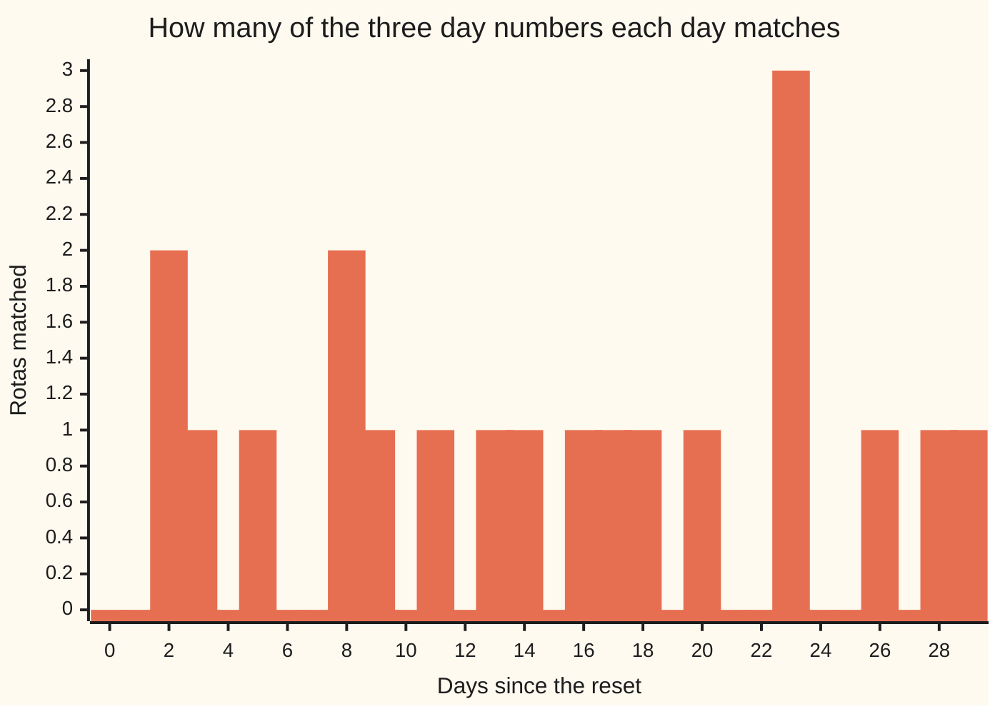

# The Chinese remainder theorem: three rotas, one day — day numbers on cycles that share no factor pin down one day, and how to rebuild it

[Syllabus](../../../SYLLABUS.md) → [Number theory](../README.md) → [Clock Arithmetic](../README.md#s03) → The Chinese remainder theorem

---

## General Overview

One morning a depot resets all its rotas at once. Call it day 0. Cleaning runs a 3-day cycle: day 0, day 1, day 2, back to day 0. Deliveries run a 5-day cycle. The week runs 7 days.

Today the board reads cleaning day 2, deliveries day 3, week day 2. Nobody wrote the date. How many days since the reset?

Count up. Cleaning alone allows day 2, day 5, day 8, on for ever. Deliveries allow day 3, day 8, day 13. 8 is the first on both, then 23, 38, one every 15 days. Add the week and one day in 105 survives: **day 23**.

The rotas line up again only after 3 × 5 × 7 = 105 days. So the answer is not a date but a day of a 105-day cycle: 23, then 128.

**Cycle lengths sharing no factor act as independent dials: the three day numbers pin down one day in 105, and that day can be built rather than hunted for.**

### The picture: how many rotas each day matches



One match is common. Two at day 2 and day 8. Three at day 23, then not for 105 days.

---

## The formula

The answer, read off against each rota:

**23 = 7 × 3 + 2**   and   **23 = 4 × 5 + 3**   and   **23 = 3 × 7 + 2**

**Read it aloud: 23 days is seven 3-day cycles and 2 over, four 5-day cycles and 3 over, three weeks and 2 over.**

In the shelf's shorthand ([Congruence](01-congruence-mod-n.md)): 23 ≡ 2 (mod 3), 23 ≡ 3 (mod 5), 23 ≡ 2 (mod 7).

Building it takes two folds, one modular inverse each. The first turns the 3-day and 5-day rotas into one: day 8 of a 15-day cycle. The second folds in the week: day 23 of 105.

| Piece | Plain meaning | Here |
| --- | --- | --- |
| the cycle length (the modulus) | days before repeating | 3, 5, 7 |
| the day number (the remainder) | where a cycle stands | 2, 3, 2 |
| coprime | no two lengths share a factor | 3, 5, 7 do not |
| the combined cycle | the lengths multiplied | 105 |
| the inverse | what undoes a multiplier | 2 undoes 3 on the 5-cycle |

---

## Why it works

### Step 0: one rota leaves an evenly spaced list

Cleaning day 2 means the count is 2 plus a whole number of 3s. That is all one rota says.

### Step 1: pick the number of 3s so the second rota fits

Each 3 pushes the delivery rota on by 3 too. It starts at day 2 and must reach day 3, one further on. So the number of 3s, times 3, must come to 1 on the 5-cycle.

Because 3 and 5 share no factor ([Coprime numbers](../02-Greatest%20Common%20Divisor%20and%20Euclid%27s%20Algorithm/05-coprime-numbers.md)), multiplying by 3 can be undone there ([The modular inverse](04-modular-inverse.md)): the undoer is 2, since 3 × 2 = 6, one past 5. So the number of 3s is 2, and 2 + 3 × 2 = 8. Any other day fitting both is 8 plus some 15s.

### Step 2: fold the week in with the same move

A 15-cycle and a 7-cycle now, again sharing no factor. Each 15 pushes the week on by 1, since 15 is two weeks and a day over. Day 8 sits on week day 1, we want day 2, so one step: 8 + 15 = 23. The scripts get there by subtracting: 2 − 8 = −6, which is 1 forward on a 7-cycle ([Negative numbers](../../01-Foundations/01-Everyday%20Arithmetic/06-negative-numbers.md)).

### Step 3: why exactly one day fits

Say two days both fit. Their difference is a whole number of 3s, of 5s and of 7s. Divisible by 3 and by 5, which share no factor, means divisible by 15 — for coprime lengths the smallest number both divide is their product ([Least common multiple](../02-Greatest%20Common%20Divisor%20and%20Euclid%27s%20Algorithm/02-lcm.md)). Again with the 7: divisible by 105. So the two are one day of the 105-day cycle. And 105 days give 105 readings, no two alike, so every reading has its day.

---

## Worked numbers, by hand

| Step | Arithmetic | Value |
| --- | --- | --- |
| fold the 5-day rota in | a 3-day step leaves 3 on the 5-cycle; 3 is undone by 2 | steps: 2 |
| the two as one | 2 + 3 × 2 | day 8 of 15 |
| fold the week in | 15 leaves 1 on the 7-cycle, undone by 1 | steps: 1 |
| all three as one | 8 + 15 × 1 | **day 23 of 105** |
| scan all 105 days | one fits; the next is | 23, 128 |

Today is 23 days after the reset, or 128, or any day 105 further on. No board tells them apart.

### What breaks if you drop a piece

| Mistake | Comes out at | What went wrong |
| --- | --- | --- |
| A 6-day cycle for the week | the fold jams | 6 and 3 share a factor: no undoer |
| Adding the day numbers | 7 | day 1 of the 3-day cycle, not day 2 |

---

## Code, from first principles, and it actually runs

Nothing is imported. Road one folds two rotas at a time; road two tries all 105 days.

### Python

```python
# The Chinese remainder theorem -- the check behind the card.  Nothing is
# imported.  Three rotas from a shared reset: day 2 of a 3-day cycle, day 3 of
# a 5-day cycle, day 2 of the 7-day week.  Road one folds two cycles at a time
# with an inverse; road two scans all 105 days of the combined cycle.
CYCLES, DAYS = [3, 5, 7], [2, 3, 2]
def inverse(a, n):                  # the number that undoes multiplying by a
    return next(t for t in range(n) if (a * t) % n == 1)
def fold(day1, cycle1, day2, cycle2):                 # road one: two into one
    inv = inverse(cycle1 % cycle2, cycle2)
    steps = ((day2 - day1) * inv) % cycle2
    print(f"on the {cycle2}-cycle: {cycle1} leaves {cycle1 % cycle2}, undone by {inv}; steps: {steps}")
    return (day1 + cycle1 * steps) % (cycle1 * cycle2)
def fits(cycles, days, span):       # road two: try every day in the span
    return [d for d in range(span) if all(d % c == r for c, r in zip(cycles, days))]
x, m = DAYS[0], CYCLES[0]
for c, r in zip(CYCLES[1:], DAYS[1:]):
    x, m = fold(x, m, r, c), m * c
    print(f"combined so far: day {x} of the {m}-day cycle")
print("by hand: " + ";  ".join(f"{x} = {x // c} x {c} + {x % c}" for c in CYCLES))
print(f"{'by scanning all 105 days':<32}{str(fits(CYCLES, DAYS, 105)):>10}")
print(f"{'the next one, two cycles out':<32}{str(fits(CYCLES, DAYS, 210)):>10}")
counts = [sum(d % c == r for c, r in zip(CYCLES, DAYS)) for d in range(30)]
print("rotas matched, days 0 to 29: " + " ".join(str(n) for n in counts))
print(f"adding the day numbers: {' + '.join(str(d) for d in DAYS)} = {sum(DAYS)}, which is day {sum(DAYS) % 3} of the 3-day cycle")
agree, clash = fits([3, 5, 6], [2, 3, 2], 30), fits([3, 5, 6], [2, 3, 1], 30)
print(f"a 6-day cycle in place of the 7: readings agreeing fit {agree} in 30; readings clashing, {clash}")
assert x == 23 and m == 105 and fits(CYCLES, DAYS, 105) == [23]
assert 23 % 3 == 2 and 23 % 5 == 3 and 23 % 7 == 2 and 23 + 105 == 128
assert counts[23] == 3 and max(counts[:23]) == 2 and agree == [8] and clash == []
print("ALL CHECKS PASS")
```

**Ran 2026-09-06 on macOS, Python 3.14.6, standard library only. All checks passed. Output, pasted from the run:**

```
on the 5-cycle: 3 leaves 3, undone by 2; steps: 2
combined so far: day 8 of the 15-day cycle
on the 7-cycle: 15 leaves 1, undone by 1; steps: 1
combined so far: day 23 of the 105-day cycle
by hand: 23 = 7 x 3 + 2;  23 = 4 x 5 + 3;  23 = 3 x 7 + 2
by scanning all 105 days              [23]
the next one, two cycles out     [23, 128]
rotas matched, days 0 to 29: 0 0 2 1 0 1 0 0 2 1 0 1 0 1 1 0 1 1 1 0 1 0 0 3 0 0 1 0 1 1
adding the day numbers: 2 + 3 + 2 = 7, which is day 1 of the 3-day cycle
a 6-day cycle in place of the 7: readings agreeing fit [8] in 30; readings clashing, []
ALL CHECKS PASS
```

### Rust

Same numbers, same labels.

```rust
// The Chinese remainder theorem -- the same check as the Python twin, in Rust.  No
// crates.  Three rotas from a shared reset: day 2 of a 3-day cycle, day 3 of a 5-day
// cycle, day 2 of the 7-day week.  Road one folds two cycles at a time; road two scans.
const CYCLES: [i64; 3] = [3, 5, 7];
const DAYS: [i64; 3] = [2, 3, 2];
fn inverse(a: i64, n: i64) -> i64 { (0..n).find(|t| (a * t) % n == 1).unwrap() }   // undoes multiplying by a
fn show(v: &[i64]) -> String {      // "[23, 128]", the way Python prints a list
    format!("[{}]", v.iter().map(|x| x.to_string()).collect::<Vec<String>>().join(", "))
}
fn fold(day1: i64, cycle1: i64, day2: i64, cycle2: i64) -> i64 {   // road one: two into one
    let inv = inverse(cycle1 % cycle2, cycle2);
    let steps = ((day2 - day1) * inv).rem_euclid(cycle2);
    println!("on the {}-cycle: {} leaves {}, undone by {}; steps: {}", cycle2, cycle1, cycle1 % cycle2, inv, steps);
    (day1 + cycle1 * steps).rem_euclid(cycle1 * cycle2)
}
fn fits(cycles: &[i64], days: &[i64], span: i64) -> Vec<i64> {     // road two: try every day
    (0..span).filter(|&d| (0..cycles.len()).all(|i| d % cycles[i] == days[i])).collect()
}
fn main() {
    let (mut x, mut m) = (DAYS[0], CYCLES[0]);
    for i in 1..3 {
        x = fold(x, m, DAYS[i], CYCLES[i]);
        m *= CYCLES[i];
        println!("combined so far: day {} of the {}-day cycle", x, m);
    }
    let hand: Vec<String> = CYCLES.iter().map(|c| format!("{} = {} x {} + {}", x, x / c, c, x % c)).collect();
    println!("by hand: {}", hand.join(";  "));
    println!("{:<32}{:>10}", "by scanning all 105 days", show(&fits(&CYCLES, &DAYS, 105)));
    println!("{:<32}{:>10}", "the next one, two cycles out", show(&fits(&CYCLES, &DAYS, 210)));
    let counts: Vec<i64> = (0..30i64).map(|d| (0..3).filter(|&i| d % CYCLES[i] == DAYS[i]).count() as i64).collect();
    println!("rotas matched, days 0 to 29: {}", counts.iter().map(|n| n.to_string()).collect::<Vec<String>>().join(" "));
    let sum: i64 = DAYS.iter().sum();
    println!("adding the day numbers: {} = {}, which is day {} of the 3-day cycle", DAYS.iter().map(|d| d.to_string()).collect::<Vec<String>>().join(" + "), sum, sum % 3);
    let (agree, clash) = (fits(&[3, 5, 6], &[2, 3, 2], 30), fits(&[3, 5, 6], &[2, 3, 1], 30));
    println!("a 6-day cycle in place of the 7: readings agreeing fit {} in 30; readings clashing, {}", show(&agree), show(&clash));
    assert!(x == 23 && m == 105 && fits(&CYCLES, &DAYS, 105) == vec![23]);
    assert!(23 % 3 == 2 && 23 % 5 == 3 && 23 % 7 == 2 && 23 + 105 == 128);
    assert!(counts[23] == 3 && counts[..23].iter().max() == Some(&2) && agree == vec![8] && clash.is_empty());
    println!("ALL CHECKS PASS");
}
```

**Ran 2026-09-06 on macOS, rustc 1.98.1, no crates. All checks passed. Output, pasted from the run:**

```
on the 5-cycle: 3 leaves 3, undone by 2; steps: 2
combined so far: day 8 of the 15-day cycle
on the 7-cycle: 15 leaves 1, undone by 1; steps: 1
combined so far: day 23 of the 105-day cycle
by hand: 23 = 7 x 3 + 2;  23 = 4 x 5 + 3;  23 = 3 x 7 + 2
by scanning all 105 days              [23]
the next one, two cycles out     [23, 128]
rotas matched, days 0 to 29: 0 0 2 1 0 1 0 0 2 1 0 1 0 1 1 0 1 1 1 0 1 0 0 3 0 0 1 0 1 1
adding the day numbers: 2 + 3 + 2 = 7, which is day 1 of the 3-day cycle
a 6-day cycle in place of the 7: readings agreeing fit [8] in 30; readings clashing, []
ALL CHECKS PASS
```

Both outputs match line for line.

> [!TIP]
> **Try changing**
> Guess first, then run. The asserts are pinned to these rotas, so one fires.
> - **Move the week on by one.** Set `DAYS` to `[2, 3, 3]`: still one day in 105, now day 38.
> - **Break the coprime rule.** Set `CYCLES` to `[3, 5, 6]`: no undoer exists, and the run stops with an error.

---

## The usual mistake

> [!warning]
> **Assuming any set of cycles will do.** Folding rests on no two lengths sharing a factor. Swap the week for a 6-day cycle and the fold jams: multiplying by 3 has no undoer on the 6-cycle. Whether a day still fits is a separate question, settled by the shared factor 3. The 6-cycle reading day 2 leaves 2 on the 3, and cleaning reads 2 as well, so they agree and day 8 fits — every 30 days now, not 90. Read the 6-cycle as day 1 and they disagree: no day fits.
>
> - **Reading "day 23" as a date.** 128 fits too.
> - **Adding the day numbers.** 2 + 3 + 2 = 7, which is day 1 of the 3-day cycle.
> - **Folding all three at once.** No single undoer covers three rotas. Fold two, write the middle answer down, then fold that with the third.

---

## Where you meet it in real life

- **Rotas and calendars.** Any "where is every cycle at once" question: shifts, bin collections, a payday against a billing date.
- **Big arithmetic done small.** A sum on one huge clock is split across two smaller coprime ones, done separately, then folded back. It is why bank-grade encryption is fast enough to use.
- **Checking a serial number.** Hold a number as remainders on small coprime clocks: a bad digit shows as one board disagreeing.

> **Say it back**
> Three rotas from one reset: 3 days, 5 days, the 7-day week, reading day 2, day 3, day 2. No two lengths share a factor, so exactly one day in 105 reads that way: day 23. Build it by folding two rotas at a time, each fold picking a step count with one inverse: day 8 of 15, then day 23 of 105.

---

## What this builds on

- [The modular inverse](04-modular-inverse.md): the undoer each fold needs; it exists only when the lengths share no factor.
- [Coprime numbers](../02-Greatest%20Common%20Divisor%20and%20Euclid%27s%20Algorithm/05-coprime-numbers.md): sharing no factor above 1, the condition all of this rests on.
- [Least common multiple](../02-Greatest%20Common%20Divisor%20and%20Euclid%27s%20Algorithm/02-lcm.md): for coprime lengths the smallest number both divide is their product, so the answer repeats every 105 days.
- [Negative numbers](../../01-Foundations/01-Everyday%20Arithmetic/06-negative-numbers.md): a step back on a cycle is a step forward the other way.

## Where this goes next

- [When cycles meet again](../05-Check%20Digits%2C%20Calendars%20and%20Cycles/04-cycles-that-realign.md): cycles that do share factors, and the line-ups that never happen.

---

## Sources

Verified 6 Sep 2026: every link resolves.

- Gauss, Carl Friedrich. *Disquisitiones Arithmeticae*. Trans. Arthur A. Clarke. Springer, 1986. [doi:10.1007/978-1-4939-7560-0](https://doi.org/10.1007/978-1-4939-7560-0). Articles 32 to 36.
- Shoup, Victor. *A Computational Introduction to Number Theory and Algebra*, 2nd ed. Cambridge, 2008. [Free full text](https://shoup.net/ntb/). Section 2.6.
- O'Connor, J. J., and E. F. Robertson. "Sun Zi." MacTutor, University of St Andrews. [Biography page](https://mathshistory.st-andrews.ac.uk/Biographies/Sun_Zi/). The puzzle behind these rotas.
