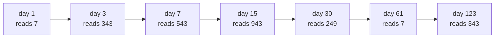

# Powers on the clock: repeated squaring finds 7 to the 123 mod 1000 without ever writing a huge number

Number theory → Powers on the Clock → Fast powers → Powers on the clock

---

## General Overview

A delivery van's trip counter has three wheels. It leaves the depot reading 001, and every night the software multiplies the reading by 7 and writes it back. Anything above 999 has nowhere to sit: only the last three digits survive.

Night one it reads 007, night two 049, night three 343. Night four the true number is 2401 and the counter shows 401 — the thousands fell off the end.

What does it read on day 123? The counter gets there one multiplication a night, 123 of them. You do not have to. Multiply a reading by itself and the days it stands for double at a stroke. Six such squarings, plus five extra 7s for the odd day counts, land on day 123: **eleven multiplications**.

**Throw the thousands away as you go, and square instead of repeating: 123 days costs eleven multiplications instead of 123.**

### The picture



Each arrow squares the reading, doubling the days, and adds a 7 where the day count is odd. Name the parts: the wheels are the modulus, 1000; the day count is the exponent, 123; the 7 is the base. The method is called **modular exponentiation**, done by **square-and-multiply**. Those words carry the rest of the card.

---

## The formula

The question in symbols:

**7^123 ≡ 343 (mod 1000)**

7^123 is 7 multiplied by itself 123 times: 7 the base, 123 the exponent. The three-bar ≡ means "leaves the same remainder as", not "equals" ([congruence-mod-n](../03-Clock%20Arithmetic/01-congruence-mod-n.md)). (mod 1000) names the clock: divide by 1000, keep what is left.

Two lines are the whole method, with b the base and e the exponent:

**Even exponent: b^e = (b^(e/2))^2.** Halve the day count, then square that reading.

**Odd exponent: b^e = b × (b^((e−1)/2))^2.** Halve, drop the spare day, square that reading, then one more 7.

**Read it aloud:** halve the days to 1, then climb back, squaring at each rung and slipping in a 7 where the day count was odd. Keep only the last three digits: 2401 ≡ 401 (mod 1000).

| Piece | Plain meaning | On the counter |
| --- | --- | --- |
| the base, b | what the reading is multiplied by nightly | 7 |
| the exponent, e | how many times the base is used: the days | 123 |
| the modulus, n | what you divide by: what the wheels hold | 1000 |
| the remainder, r | what is left over: what the wheels show | 343 on day 123 |

---

## Why it works

### Step 0: what falls off never comes back

Remainders multiply on their own ([modular-addition-and-multiplication](../03-Clock%20Arithmetic/02-modular-addition-and-multiplication.md)): reduce first or reduce at the end, same remainder. On day 7 the true number is 823543 and the counter reads 543. Dropping the thousands costs nothing.

It also caps the work. Both readings entering a multiplication are under 1000, so every product is under 1000 × 1000 = 1,000,000 — the same ceiling on the last night as the first.

### Step 1: squaring doubles the days

The day 15 reading is 7 used 15 times, thousands thrown away. Square it and 7 has been used 30 times ([exponents-and-powers](../../01-Foundations/03-Powers%2C%20Roots%20and%20Logarithms/01-exponents-and-powers.md)): 943 × 943 = 889249, keep 249. Day 30, one multiplication.

### Step 2: every day count halves to 1

Halve, dropping the spare when the count is odd: 123, 61, 30, 15, 7, 3, 1. Seven rungs; the five odd ones above the bottom each cost an extra 7. Double the days and the list gains one rung, not double the rungs.

### Step 3: climb back up

Day 1: the counter reads 7. Read the list bottom to top. Each rung is double the one below, plus a spare when odd: square for the doubling, one more 7 for the spare.

Nothing drifts: if a rung's reading is right, its square is right for double that rung, and one more 7 is right for double-plus-one. The bottom rung is plainly right, so all are ([proof-by-induction](../../01-Foundations/06-Proof/04-proof-by-induction.md)).

Six rungs sit above the first: six squarings. Five of those are odd: five more 7s. Eleven multiplications, with the day-1 reading of 7 free; the slow road starts at 1 and pays 123.

---

## Worked numbers, by hand

| Step | Arithmetic | Reading |
| --- | --- | --- |
| day 1 | the counter reads 7 | 7 |
| day 3 | square 7, one more 7 | 343 |
| day 7 | square 343, one more 7 | 543 |
| day 15 | square 543, one more 7 | 943 |
| day 30 | square 943: 889249, last three | 249 |
| day 61 | square 249, one more 7 | 7 |
| day 123 | square 7, one more 7 | **343** |

On day 123 the wheels read 343, nothing longer than six digits written. Day 3 reads 343 too, which is not luck: [order-and-primitive-roots](05-order-and-primitive-roots.md).

### What breaks if you drop a piece

| Mistake | Comes out at | What went wrong |
| --- | --- | --- |
| Squaring only, no spare 7s | 401 | The six squarings reach day 64, not day 123: a right reading for the wrong day |
| Keeping the thousands, reducing at the end | 823543 on day 7 | Still ends in 543, but day 123 in full is 104 digits — at key size, more digits than atoms in the street |

---

## Code, from first principles, and it actually runs

Nothing is imported. The ladder is climbed rung by rung, then checked against the counter's own road: 123 nights of multiplying by 7.

### Python

```python
# Powers on the clock -- the check behind the card.  Nothing is imported.  A three-digit
# trip counter multiplies its reading by 7 each day and keeps only the last three digits.
def by_squaring(days, spare=True):     # halve the days down, then square back up
    rungs = []
    while days: rungs.append(days); days //= 2
    rungs.reverse()
    reading, mults, trace = 7, 0, [7]
    for rung in rungs[1:]:
        reading = reading * reading % 1000; mults += 1        # square: doubles the days
        if spare and rung % 2: reading = reading * 7 % 1000; mults += 1   # the spare day
        trace.append(reading)
    return reading, mults, rungs, trace
def slow(days):                        # the counter's own way, one multiplication a day
    reading = 1
    for _ in range(days): reading = reading * 7 % 1000
    return reading
def line(name, values): print(f"{name:<33}" + "".join(f"{v:>7}" for v in values))
fast, mults, rungs, readings = by_squaring(123)
line("the days, from 1 up to 123", rungs)
line("what the counter reads on them", readings)
line("day 123 by squaring, mod 1000", [fast])
line("day 123 the slow way, mod 1000", [slow(123)])
line("multiplications, fast then slow", [mults, 123])
line("day 7 with nothing thrown away", [7 * 7 * 7 * 7 * 7 * 7 * 7])
line("biggest number written down", [943 * 943])
line("skipping the spare 7s", [by_squaring(123, False)[0]])
assert fast == 343 and slow(123) == 343 and fast == slow(123)
assert rungs == [1, 3, 7, 15, 30, 61, 123] and readings == [7, 343, 543, 943, 249, 7, 343]
assert mults == 11 and 7 ** 7 % 1000 == readings[2] and by_squaring(123, False)[0] == 401
print("ALL CHECKS PASS")
```

**Ran 2026-09-06 on macOS, Python 3.14.6, standard library only. All checks passed. Output, pasted from the run:**

```
the days, from 1 up to 123             1      3      7     15     30     61    123
what the counter reads on them         7    343    543    943    249      7    343
day 123 by squaring, mod 1000        343
day 123 the slow way, mod 1000       343
multiplications, fast then slow       11    123
day 7 with nothing thrown away    823543
biggest number written down       889249
skipping the spare 7s                401
ALL CHECKS PASS
```

### Rust

Same numbers, same labels, built with `rustc --edition 2021 -O`.

```rust
// Powers on the clock -- the same check as modular_exponentiation_check.py, in Rust.  No
// crates.  A three-digit trip counter multiplies its reading by 7 each day and keeps only
// the last three digits.
fn by_squaring(mut days: i64, spare: bool) -> (i64, i64, Vec<i64>, Vec<i64>) {
    let mut rungs: Vec<i64> = Vec::new();          // halve the days down, then square back up
    while days > 0 { rungs.push(days); days /= 2; }
    rungs.reverse();
    let (mut reading, mut mults, mut trace) = (7i64, 0i64, vec![7i64]);
    for rung in &rungs[1..] {
        reading = reading * reading % 1000; mults += 1;        // square: doubles the days
        if spare && rung % 2 == 1 { reading = reading * 7 % 1000; mults += 1; }  // spare day
        trace.push(reading);
    }
    (reading, mults, rungs, trace)
}
fn slow(days: i64) -> i64 {             // the counter's own way, one multiplication a day
    let mut reading = 1i64;
    for _ in 0..days { reading = reading * 7 % 1000; }
    reading
}
fn line(name: &str, values: &[i64]) {
    let mut out = format!("{:<33}", name);
    for v in values { out.push_str(&format!("{:>7}", v)); }
    println!("{}", out);
}
fn main() {
    let (fast, mults, rungs, readings) = by_squaring(123, true);
    line("the days, from 1 up to 123", &rungs);
    line("what the counter reads on them", &readings);
    line("day 123 by squaring, mod 1000", &[fast]);
    line("day 123 the slow way, mod 1000", &[slow(123)]);
    line("multiplications, fast then slow", &[mults, 123]);
    line("day 7 with nothing thrown away", &[7 * 7 * 7 * 7 * 7 * 7 * 7]);
    line("biggest number written down", &[943 * 943]);
    line("skipping the spare 7s", &[by_squaring(123, false).0]);
    assert!(fast == 343 && slow(123) == 343 && fast == slow(123));
    assert!(rungs == vec![1, 3, 7, 15, 30, 61, 123] && readings == vec![7, 343, 543, 943, 249, 7, 343]);
    assert!(mults == 11 && 7i64.pow(7) % 1000 == readings[2] && by_squaring(123, false).0 == 401);
    println!("ALL CHECKS PASS");
}
```

**Ran 2026-09-06 on macOS, rustc 1.98.1, no crates. All checks passed. Output, pasted from the run:**

```
the days, from 1 up to 123             1      3      7     15     30     61    123
what the counter reads on them         7    343    543    943    249      7    343
day 123 by squaring, mod 1000        343
day 123 the slow way, mod 1000       343
multiplications, fast then slow       11    123
day 7 with nothing thrown away    823543
biggest number written down       889249
skipping the spare 7s                401
ALL CHECKS PASS
```

The two outputs match line for line.

> [!TIP]
> **Try changing**
> Guess first, then run it.
> - **Take the spare days away.** Switch the spare-day flag off: 401, not 343 — six squarings land on day 64.
> - **Move the day count.** Set all four 123s in the code to 61. Both roads still agree, on 7, and the asserts naming the 123-day list fire.

---

## The usual mistake

> [!warning]
> **Squaring the reading doubles the days, not the reading.** Squaring 943 does not give twice 943. It gives 249: the reading for twice as many days.
>
> - Skipping the spare 7 on an odd rung: 401, not 343.
> - Rounding a halving up instead of dropping the spare day: every odd rung lands a day too far.
> - The reading wraps at 1000; the exponent does not. Shrinking the exponent has its own rule: [fermats-little-theorem](02-fermats-little-theorem.md).

---

## Where you meet it in real life

- **Keys and secrets.** Encryption is this ladder on a clock hundreds of digits wide: [one-way-streets](../06-Codes%20and%20Secrets/01-one-way-streets.md).
- **Testing for primeness.** The standard test is a huge power on a clock: [miller-rabin](../06-Codes%20and%20Secrets/05-miller-rabin.md).
- **Last digits of huge powers.** Every "what does it end in" is a counter with few wheels: [fermats-little-theorem](02-fermats-little-theorem.md).

> **Say it back**
> A three-wheel counter multiplies by 7 nightly and keeps the last three digits: base 7, modulus 1000. To reach exponent 123, halve the day count over and over — 123, 61, 30, 15, 7, 3, 1 — then climb the list backwards from a reading of 7. Square at each rung, since squaring doubles the exponent, and slip in a 7 where the rung is odd. Drop the thousands as you go: no product passes 1,000,000. That is modular exponentiation by square-and-multiply: eleven multiplications, and the counter reads 343.

---

## What this builds on

- [congruence-mod-n](../03-Clock%20Arithmetic/01-congruence-mod-n.md): what ≡ and (mod 1000) mean — same remainder, same spot on the clock.
- [modular-addition-and-multiplication](../03-Clock%20Arithmetic/02-modular-addition-and-multiplication.md): why reducing at every step lands where reducing at the end lands.
- [exponents-and-powers](../../01-Foundations/03-Powers%2C%20Roots%20and%20Logarithms/01-exponents-and-powers.md): why squaring a power doubles how many times the base was used.

## Where this goes next

- [fermats-little-theorem](02-fermats-little-theorem.md): on a prime clock the readings return to 1 on a schedule, shrinking the exponent before you climb.
- [one-way-streets](../06-Codes%20and%20Secrets/01-one-way-streets.md): easy forwards, and nobody knows how to run it backwards.
- [miller-rabin](../06-Codes%20and%20Secrets/05-miller-rabin.md): a primality test, one ladder per round.

---

## Sources

Verified 6 Sep 2026; every link resolves.

- Knuth, Donald E. *The Art of Computer Programming, Volume 2*, 3rd ed. Addison-Wesley, 1997. [Publisher page](https://www.informit.com/store/art-of-computer-programming-volume-2-seminumerical-9780201896848). Section 4.6.3: why squaring is not always the cheapest route.
- Menezes, Alfred J., Paul C. van Oorschot, and Scott A. Vanstone. *Handbook of Applied Cryptography*. CRC Press, 1996. [Free copy from the authors](https://cacr.uwaterloo.ca/hac/). Chapter 14.6: the ladder both ways.
- Hardy, G. H., and E. M. Wright. *An Introduction to the Theory of Numbers*, 6th ed. Oxford University Press, 2008. [Publisher page](https://global.oup.com/academic/product/an-introduction-to-the-theory-of-numbers-9780199219865). Chapter V: the congruence rules behind Step 0.
