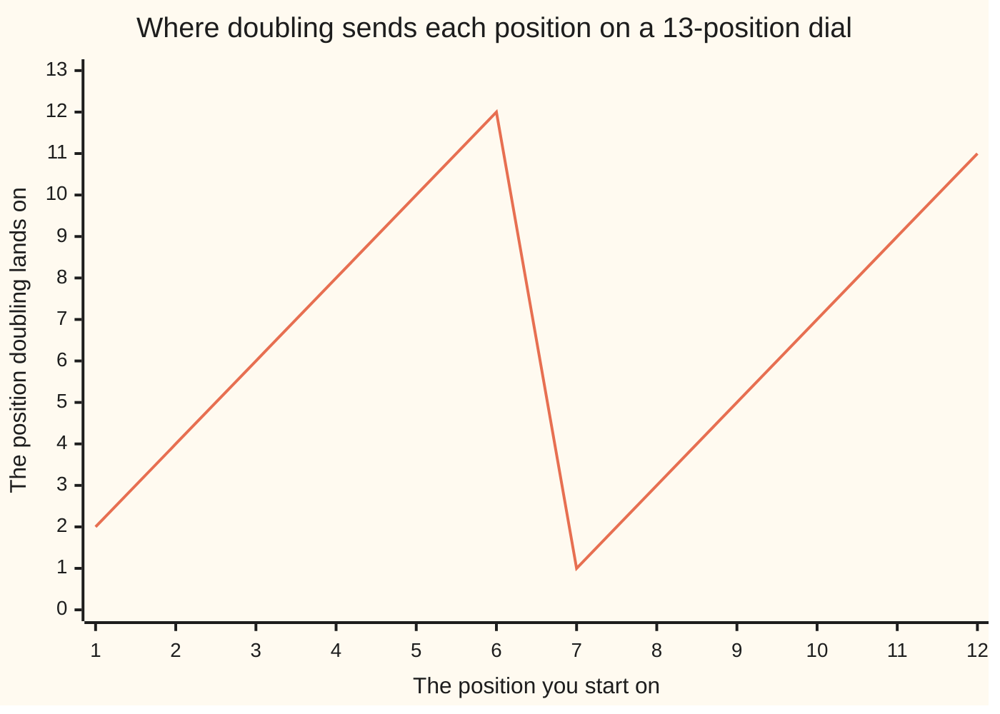

# Fermat's little theorem: raise a number the prime dial does not divide to one below the dial size and it reads 1

Number theory → Powers on the Clock → Fermat and Euler → Fermat's little theorem

---

## General Overview

A lock dial with 13 positions, numbered 0 to 12. Set it to 1 and double: 2, 4, 8, then 16, which runs off the end, so the dial comes round to 3 ([congruence-mod-n](../03-Clock%20Arithmetic/01-congruence-mod-n.md)). Keep doubling. After twelve doublings it reads 1 again: 4,096 is 315 whole dials and 1 over.

Twelve is one less than 13, and 13 is **prime**: nothing divides it but itself and 1 ([primes-and-composites](../01-Divisibility%20and%20Primes/05-primes-and-composites.md)). Take any number 13 does not divide, start at 1 and multiply by it twelve times, and the dial reads 1.

**On a prime-sized dial, take a number the dial size does not divide, start at 1 and multiply by it one time fewer than there are positions: the reading is 1.**

Fermat stated it without proof in a letter to Frénicle de Bessy, 18 October 1640. It is his *little* theorem, not the Last Theorem. Huge powers get cheap: 2 taken a thousand times over runs to 302 digits; this drops the work to four multiplications.

### The picture: doubling deals the dial to itself



The line climbs, falls off the top, climbs again. Twelve starting positions, twelve landings, each used once. That shuffle is the engine of the proof.

---

## The formula

The dial is the statement:

**Start at 1 and multiply by 2 twelve times = 4,096 = 315 × 13 + 1, so the 13-dial reads 1**

| Piece | Plain meaning | Here |
| --- | --- | --- |
| the dial size | how many positions there are, and it must be prime | 13 |
| the number | what you multiply by | 2 |
| the power | one less than the dial size | 12 |
| the reading | what is left when whole dials come off | 1 |

With letters, the dial size is p, for prime, and the number a, which p must not divide: a to the p − 1 ≡ 1 (mod p). The ≡ means the same reading on the dial; the (mod p) says which dial.

One more doubling takes that 1 back to 2: 2 taken thirteen times over is 8,192, and the dial reads 2. That second form, a to the p ≡ a (mod p), needs no condition.

---

## Why it works

### Step 0: doubling deals the positions out again

The live positions are 1 to 12; 0 is stuck, leave it out. Double each and take off whole dials: 2, 4, 6, 8, 10, 12, 1, 3, 5, 7, 9, 11. The same twelve numbers, shuffled.

### Step 1: nothing lands on 0, nothing lands twice

Doubling lands on 0 only if 13 divides twice the position, and 13 is prime, so it would divide the 2 or the position; it divides neither ([euclids-lemma](../02-Greatest%20Common%20Divisor%20and%20Euclid%27s%20Algorithm/06-euclids-lemma.md)). Nor can two land together: doubling can be undone, and an undoable move cannot merge two things ([modular-inverse](../03-Clock%20Arithmetic/04-modular-inverse.md)).

### Step 2: twelve into twelve means the same twelve

Twelve go in, twelve come out, none 0, none repeated. There are only twelve non-zero readings, so all get used.

### Step 3: multiply the row, two ways

The row multiplied: 1 × 2 × 3 × … × 12 = 479,001,600. The doubled row, before dials come off, is the same twelve each carrying a 2: 4,096 × 479,001,600 = 1,961,990,553,600. The same twelve readings, so both products read 12.

### Step 4: cancel the row

So 4,096 times the row's product reads the same as that product alone. It cancels: every factor, 1 up to 12, is smaller than the prime 13, so 13 cannot divide it ([euclids-lemma](../02-Greatest%20Common%20Divisor%20and%20Euclid%27s%20Algorithm/06-euclids-lemma.md)), and what 13 does not divide has an undo ([modular-inverse](../03-Clock%20Arithmetic/04-modular-inverse.md)). Multiply both sides by it.

What is left is 4,096 alone, reading 1. That is the theorem.

The other classical route expands a bracket raised to a power, every middle term carrying a factor of 13. Drop the word prime from the statement and you get [eulers-theorem](04-eulers-theorem.md), the same shuffle over a shorter row.

---

## Worked numbers, by hand

2 taken a thousand times over, on the 13-dial. Readings repeat every twelve steps, so only the leftover matters. Some starting numbers repeat sooner, but the shorter loop's length always divides twelve.

| Step | Arithmetic | Value |
| --- | --- | --- |
| the round trip | 4,096 = 315 × 13 + 1 | 1 |
| split the thousand | 1000 ÷ 12 | 83, remainder 4 |
| what is left | 16 − 13 | **3** |
| the long way, as a check | 2, a thousand times | **3** |

The 83 round trips each read 1, so they cost nothing; only 2 taken four times over is left, 16, reading 3. A thousand multiplications became four.

### What breaks if you drop a piece

| Mistake | Comes out at | What went wrong |
| --- | --- | --- |
| Splitting the thousand by 13 | 1 | 12 is left, a whole round trip |
| Starting from 26, a multiple of 13 | 0 | 26 sits on 0 and stays |
| A 15-dial, power 14 | 4 | 15 is 3 × 5, so the row will not cancel |

Doubling still shuffles this 15-dial; the cancelling is what dies.

---

## Code, from first principles, and it actually runs

Nothing is imported. The dial is built by hand: multiply, take off whole dials, repeat. The thousandth power is worked twice, long way and short.

### Python

```python
# Fermat's little theorem -- the check behind the card.  Nothing is imported.  A
# 13-position lock dial, base 2: twelve doublings land on 1, the twelve doubled
# positions are the twelve positions shuffled, and 2 to the 1000 collapses to 3.
DIAL, BASE = 13, 2

def turn(base, times, dial):      # the reading after that many multiplications
    out = 1
    for _ in range(times): out = (out * base) % dial
    return out

def row(name, value): print(f"{name:<44}{value:>14}")
whole, left = BASE ** (DIAL - 1), 1000 % (DIAL - 1)   # 4096 in full; 1000 split by 12
doubles = [(BASE * k) % DIAL for k in range(1, DIAL)]
plain, shuffled = 1, 1                                # 1 x 2 x ... x 12, and each doubled
for k in range(1, DIAL): plain, shuffled = plain * k, shuffled * (BASE * k)
row("2 doubled twelve times", whole)
row(f"{whole} = {whole // DIAL} x {DIAL} + 1, so the dial shows", whole % DIAL)
row(f"2 to the {DIAL} = {BASE ** DIAL}, so the dial shows", turn(BASE, DIAL, DIAL))
print("1 to 12, each doubled: " + " ".join(str(d) for d in doubles))
row("1 to 12 multiplied", plain)
row("the twelve doubles multiplied", shuffled)
row("both of those, on the 13-dial", plain % DIAL)
row(f"1000 = {1000 // (DIAL - 1)} x {DIAL - 1} + {left}, leftover exponent", left)
row(f"2 to the {left} = {BASE ** left}, so the dial shows", turn(BASE, left, DIAL))
row("2 to the 1000 the long way, on the 13-dial", turn(BASE, 1000, DIAL))
print(f"gone wrong: cut by 13 -> {turn(BASE, 1000 % DIAL, DIAL)}, base 26 -> {turn(2 * DIAL, DIAL - 1, DIAL)}, 14 on a 15-dial ({BASE ** 14}) -> {turn(BASE, 14, 15)}")
assert whole == 4096 and whole == 315 * DIAL + 1 and turn(BASE, DIAL - 1, DIAL) == 1
assert sorted(doubles) == list(range(1, DIAL)) and shuffled % DIAL == plain % DIAL == 12
assert turn(BASE, 1000, DIAL) == turn(BASE, left, DIAL) == 16 % DIAL == 3
print("ALL CHECKS PASS")
```

**Ran 2026-09-06 on macOS, Python 3.14.6, standard library only. All checks passed. Output, pasted from the run:**

```
2 doubled twelve times                                4096
4096 = 315 x 13 + 1, so the dial shows                   1
2 to the 13 = 8192, so the dial shows                    2
1 to 12, each doubled: 2 4 6 8 10 12 1 3 5 7 9 11
1 to 12 multiplied                               479001600
the twelve doubles multiplied                1961990553600
both of those, on the 13-dial                           12
1000 = 83 x 12 + 4, leftover exponent                    4
2 to the 4 = 16, so the dial shows                       3
2 to the 1000 the long way, on the 13-dial               3
gone wrong: cut by 13 -> 1, base 26 -> 0, 14 on a 15-dial (16384) -> 4
ALL CHECKS PASS
```

### Rust

Same numbers, same labels, built with `rustc --edition 2021 -O`.

```rust
// Fermat's little theorem -- the same check as the Python one, in Rust.  No crates.
// A 13-position lock dial, base 2: twelve doublings land on 1, the twelve doubled
// positions are the twelve positions shuffled, and 2 to the 1000 collapses to 3.
const DIAL: i64 = 13;
const BASE: i64 = 2;

fn turn(base: i64, times: i64, dial: i64) -> i64 {   // the reading after that many multiplications
    let mut out = 1;
    for _ in 0..times { out = (out * base) % dial; }
    out
}

fn row(name: &str, value: i64) { println!("{:<44}{:>14}", name, value); }

fn main() {
    let whole = BASE.pow(DIAL as u32 - 1);           // 4096, written out in full
    let left = 1000 % (DIAL - 1);                    // 1000 split by 12
    let doubles: Vec<i64> = (1..DIAL).map(|k| (BASE * k) % DIAL).collect();
    let (mut plain, mut shuffled) = (1i64, 1i64);    // 1 x 2 x ... x 12, and each doubled
    for k in 1..DIAL { plain *= k; shuffled *= BASE * k; }
    let marks: Vec<String> = doubles.iter().map(|d| d.to_string()).collect();
    row("2 doubled twelve times", whole);
    row(&format!("{} = {} x {} + 1, so the dial shows", whole, whole / DIAL, DIAL), whole % DIAL);
    row(&format!("2 to the {} = {}, so the dial shows", DIAL, BASE.pow(DIAL as u32)), turn(BASE, DIAL, DIAL));
    println!("1 to 12, each doubled: {}", marks.join(" "));
    row("1 to 12 multiplied", plain);
    row("the twelve doubles multiplied", shuffled);
    row("both of those, on the 13-dial", plain % DIAL);
    row(&format!("1000 = {} x {} + {}, leftover exponent", 1000 / (DIAL - 1), DIAL - 1, left), left);
    row(&format!("2 to the {} = {}, so the dial shows", left, BASE.pow(left as u32)), turn(BASE, left, DIAL));
    row("2 to the 1000 the long way, on the 13-dial", turn(BASE, 1000, DIAL));
    println!("gone wrong: cut by 13 -> {}, base 26 -> {}, 14 on a 15-dial ({}) -> {}",
             turn(BASE, 1000 % DIAL, DIAL), turn(2 * DIAL, DIAL - 1, DIAL), BASE.pow(14), turn(BASE, 14, 15));
    let mut sorted = doubles.clone(); sorted.sort();
    assert!(whole == 4096 && whole == 315 * DIAL + 1 && turn(BASE, DIAL - 1, DIAL) == 1);
    assert!(sorted == (1..DIAL).collect::<Vec<i64>>() && shuffled % DIAL == 12 && plain % DIAL == 12);
    assert!(turn(BASE, 1000, DIAL) == 16 % DIAL && turn(BASE, left, DIAL) == 3);
    println!("ALL CHECKS PASS");
}
```

**Ran 2026-09-06 on macOS, rustc 1.98.1, no crates. All checks passed. Output, pasted from the run:**

```
2 doubled twelve times                                4096
4096 = 315 x 13 + 1, so the dial shows                   1
2 to the 13 = 8192, so the dial shows                    2
1 to 12, each doubled: 2 4 6 8 10 12 1 3 5 7 9 11
1 to 12 multiplied                               479001600
the twelve doubles multiplied                1961990553600
both of those, on the 13-dial                           12
1000 = 83 x 12 + 4, leftover exponent                    4
2 to the 4 = 16, so the dial shows                       3
2 to the 1000 the long way, on the 13-dial               3
gone wrong: cut by 13 -> 1, base 26 -> 0, 14 on a 15-dial (16384) -> 4
ALL CHECKS PASS
```

> [!TIP]
> **Try changing**
> Guess first, then run it. The asserts are pinned to house numbers, so expect one to fire.
> - **Start from 3.** Set the base to 3: the row still shuffles, the twelfth power still reads 1, the thousandth still reads 3. Only the first assert fires.
> - **Move to a 15-dial.** Set the dial to 15 and the power to 14: the reading is 4, the last wrong answer above.

---

## The usual mistake

> [!warning]
> **Cutting the power down by the dial size instead of by one less.** On the 13-dial, split 1000 by **12**, not by 13. Twelve steps is the round trip. Split by 13 and the leftover of 12 answers 1 instead of 3.
>
> - **Forgetting the exclusion.** Start from 26 and the reading is 0 forever: multiples of the dial size are stuck.
> - **A dial that is not prime.** A 15-dial with power 14 reads 4. The fix is a different count: [eulers-theorem](04-eulers-theorem.md).
> - **Reading it backwards.** A prime dial always gives 1. That only prime dials do is a different claim, and false: [fermat-test-and-carmichael](../06-Codes%20and%20Secrets/04-fermat-test-and-carmichael.md).

---

## Where you meet it in real life

- **Dividing on a prime dial.** The dial does not divide 2, so its undo is 2 raised to the power two below the dial size: 2 to the 11 is 7, and 2 × 7 is one dial and 1 over ([modular-inverse](../03-Clock%20Arithmetic/04-modular-inverse.md), [modular-exponentiation](01-modular-exponentiation.md)).
- **Screening primes at speed.** Software hunting big primes throws a power at a candidate and reads the dial: failure means composite ([fermat-test-and-carmichael](../06-Codes%20and%20Secrets/04-fermat-test-and-carmichael.md)).
- **Public-key encryption.** A message decrypts back to itself because of this fact in Euler's wider form: [eulers-theorem](04-eulers-theorem.md), then [rsa-in-outline](../06-Codes%20and%20Secrets/03-rsa-in-outline.md).

> **Say it back**
> Take a prime-sized dial, 13, and a number it does not divide, 2. Twelve multiplications, one less than 13, and it reads 1. Multiplying every position by 2 only deals the same twelve out in a new order, so the row's product is unchanged; cancel it and 1 remains. That is why huge powers shrink: 2 taken a thousand times over reads 3, like 2 taken four times over.

---

## What this builds on

- [congruence-mod-n](../03-Clock%20Arithmetic/01-congruence-mod-n.md): what a reading on a dial means.
- [euclids-lemma](../02-Greatest%20Common%20Divisor%20and%20Euclid%27s%20Algorithm/06-euclids-lemma.md): a prime dividing a product divides a factor, used in Steps 1 and 4.
- [modular-inverse](../03-Clock%20Arithmetic/04-modular-inverse.md): undoing a multiplication, used in Steps 1 and 4.
- [modular-exponentiation](01-modular-exponentiation.md): powers on a clock without the huge number.
- [exponents-and-powers](../../01-Foundations/03-Powers%2C%20Roots%20and%20Logarithms/01-exponents-and-powers.md): what "taken twelve times over" means.

## Where this goes next

- [eulers-theorem](04-eulers-theorem.md): the same statement without the word prime.
- [fermat-test-and-carmichael](../06-Codes%20and%20Secrets/04-fermat-test-and-carmichael.md): the theorem as a primality test, and the composites that pass anyway.

---

## Sources

Verified 6 Sep 2026: every link resolves.

- Euler, Leonhard. "Theorematum quorundam ad numeros primos spectantium demonstratio" (1741). [Euler Archive, E54](https://scholarlycommons.pacific.edu/euler-works/54/). The first published proof.
- Gauss, Carl Friedrich. *Disquisitiones Arithmeticae*, 1801. [Wikisource, Third Section](https://en.wikisource.org/wiki/Translation:Disquisitiones_Arithmeticae/Third_Section), free; [Clarke translation](https://yalebooks.yale.edu/book/9780300094732/disquisitiones-arithmeticae/), paid. Articles 49 to 51, the shuffle made standard.
- Ireland, Kenneth, and Michael Rosen. *A Classical Introduction to Modern Number Theory*, 2nd ed. Springer, 1990. [doi:10.1007/978-1-4757-2103-4](https://link.springer.com/book/10.1007/978-1-4757-2103-4). Chapter 4, the theorem in its wider setting.
