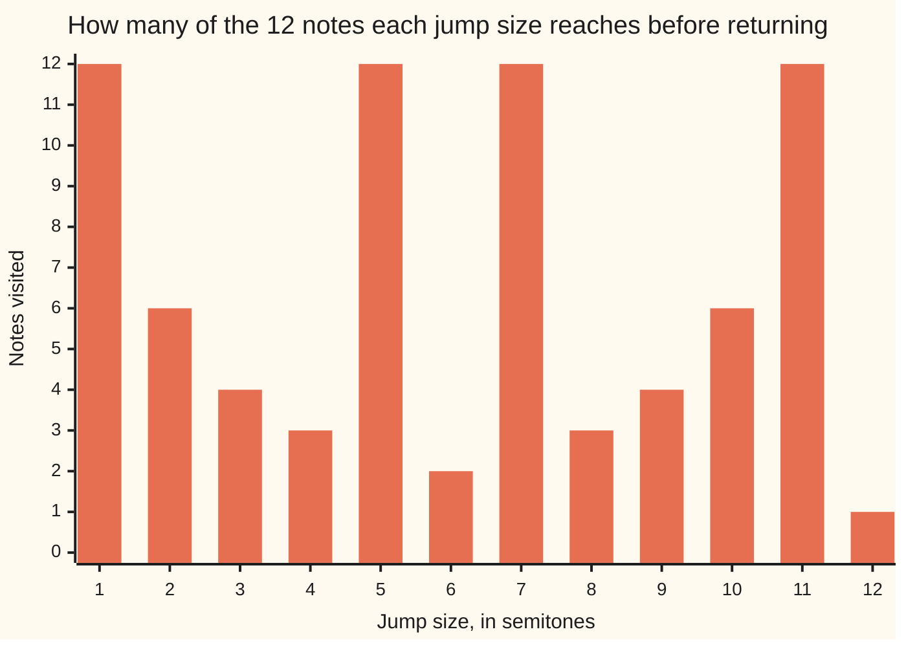

# Euler's totient: counting how many numbers up to n share no factor with n, straight from the factorisation

Number theory → Powers on the Clock → Fermat and Euler → Euler's totient

---

## General Overview

An octave has 12 notes: C, C sharp, D, up to B, then it starts over. Number them 0 to 11 and a keyboard is a 12-hour clock ([congruence-mod-n](../03-Clock%20Arithmetic/01-congruence-mod-n.md)).

Pick a jump size in semitones and keep jumping. Jump 3 from C: C, D sharp, F sharp, A, then C again — four notes, and the other eight never arrive. Jump 7 and all twelve turn up before you are home. Seven semitones is a fifth, so that walk is the circle of fifths.

Four jump sizes tour the octave: 1, 5, 7 and 11 — the numbers from 1 to 12 sharing no factor with 12 ([coprime-numbers](../02-Greatest%20Common%20Divisor%20and%20Euclid%27s%20Algorithm/05-coprime-numbers.md)).

**Euler's totient, written phi(n), or φ in books, is how many of the numbers 1 to n share no factor with n, and the factorisation of n gives that count without any listing.**

### The picture: how far a jump gets



Four bars reach 12: jumps 1, 5, 7 and 11.

---

## The formula

**phi(12) = how many of 1, 2, 3, up to 12 share no factor with 12 = 4**

Now from the factorisation: 12 is 2 × 2 × 3 ([prime-factorisation](../01-Divisibility%20and%20Primes/07-prime-factorisation.md)), so the primes inside are 2 and 3.

**phi(12) = 12 × (1 − 1/2) × (1 − 1/3) = 12 × 1/2 × 2/3 = 4**

One bracket for the 2, one for the 3. The 2 appears twice. It still gets one bracket. Count different primes, not copies.

**Read it aloud: start with all 12, throw away the half that 2 divides, then the third of what is left that 3 divides.**

| Piece | Plain meaning | Here |
| --- | --- | --- |
| the clock size, n | notes before it repeats | 12 |
| shares no factor | nothing above 1 divides both | 1, 5, 7, 11 |
| phi(n), the totient | how many of 1 to n share no factor with n | 4 |
| a bracket, (1 − 1/2) | the share left after one prime is thrown away | a half |

Write p for a prime. A prime clock gets one bracket: phi(7) = 7 × (1 − 1/7) = 6. Of 1 to 7 only 7 shares a factor with 7, so **phi(p) = p − 1**.

---

## Why it works

### Step 0: which jumps tour everything

Take jump 7. Count the jumps with k: after k jumps you stand on 7 × k, wrapped round the clock ([residue-classes](../03-Clock%20Arithmetic/03-residue-classes.md)). You are home when 12 divides 7 × k. Since 7 and 12 share no factor, the 12 has to sit whole inside k ([coprime-numbers](../02-Greatest%20Common%20Divisor%20and%20Euclid%27s%20Algorithm/05-coprime-numbers.md)). So the first way home is k = 12, and the twelve stops before it are all different.

Now jump 3. It shares the factor 3 with 12, so every stop is a multiple of 3: 0, 3, 6, 9. Any jump sharing a factor above 1 misses notes the same way. So the tourists are exactly the jumps sharing no factor with 12, and their count is phi(12).

### Step 1: count by crossing out

Write 1 to 12. Cross out what 2 divides: 2, 4, 6, 8, 10, 12. Then what 3 divides: 3, 6, 9, 12 — 6 and 12 already gone. So 6 + 4 − 2 = 8 are out and 4 stand: 1, 5, 7, 11. Hopeless on a big clock.

### Step 2: split the clock into coprime parts

12 is 4 × 3, sharing no factor. The Chinese remainder theorem ([chinese-remainder-theorem](../03-Clock%20Arithmetic/06-chinese-remainder-theorem.md)) says a place on the 12-clock is just a pair: where you stand on a 4-clock and where you stand on a 3-clock, every pair once. Sharing no factor with 12 means sharing none with 4 and none with 3, so survivors pair with survivors and the counts multiply.

**phi(12) = phi(4) × phi(3) = 2 × 2 = 4**

### Step 3: a part built from one prime is easy

Of 1, 2, 3, 4 those sharing a factor with 4 are the multiples of 2, one in every two ([fractions](../../01-Foundations/01-Everyday%20Arithmetic/07-fractions.md)): phi(4) = 4 − 2 = 2, which is 4 × (1 − 1/2). Any part built from one prime loses one in every p and keeps the share (1 − 1/p). Likewise phi(3) = 3 − 1 = 2 = 3 × (1 − 1/3).

Multiply back: the 4 and the 3 rebuild the 12 out front, one bracket staying per prime. That is the formula.

---

## Worked numbers, by hand

| Step | Arithmetic | Value |
| --- | --- | --- |
| all of 1 to 12 | 12 | 12 |
| drop what 2 divides, a half | 12 × (1 − 1/2) | 6 |
| drop what 3 divides, a third | 6 × (1 − 1/3) | **4** |
| the survivors | 1, 5, 7, 11 | 4 |
| a prime clock | phi(7) = 7 − 1 | 6 |

The four tourists: 1 by semitone, 11 a semitone the other way, 5 and 7 the circles of fourths and fifths.

### What breaks if you drop a piece

| Mistake | Comes out at | What went wrong |
| --- | --- | --- |
| Treating 12 as prime: 12 − 1 | 11 | only prime clocks work that way |
| A bracket per copy of a prime | 2 | the second 2 gets no bracket |
| Stopping after the evens | 6 | 3 takes a third of the rest |

The code prints all three.

---

## Code, from first principles, and it actually runs

Road one walks each jump round the 12 notes and keeps those that reach everything. Road two factors the clock size and multiplies the brackets. The two are compared up to 60.

### Python

```python
# Euler's totient -- the check behind the card.  Nothing is imported.  The musical clock: 12 semitones
# to an octave.  Road one walks each jump size round the N notes; road two reads phi(N) off the primes.
N = 12
gcd = lambda a, b: a if b == 0 else gcd(b, a % b)
def walk(jump, n):                  # the notes one jump size actually visits
    seen, k = [], 0
    while k not in seen: seen.append(k); k = (k + jump) % n
    return seen
primes_of = lambda n: [p for p in range(2, n + 1) if n % p == 0 and all(p % q != 0 for q in range(2, p))]
by_counting = lambda n: sum(1 for k in range(1, n + 1) if gcd(k, n) == 1)   # the definition
def cull(n, ps):                    # start at n; for each p on the list, throw away one in every p
    out = n
    for p in ps: out = out // p * (p - 1)
    return out
by_primes = lambda n: cull(n, primes_of(n))     # one bracket per distinct prime -- the formula
tours, coprime = [j for j in range(1, N + 1) if len(walk(j, N)) == N], [k for k in range(1, N + 1) if gcd(k, N) == 1]
same, brackets = sum(1 for n in range(1, 61) if by_counting(n) == by_primes(n)), " x ".join(f"(1 - 1/{p})" for p in primes_of(N))
per_copy, stop_early = cull(N, [2, 2, 3]), cull(N, [2])   # the same culling, run wrong: a bracket per copy; only the first prime
print("jump by 7 from C: " + " ".join(str(k) for k in walk(7, N)) + ", back to 0")
print(f"notes visited, jumps 1 to {N}: " + " ".join(str(len(walk(j, N))) for j in range(1, N + 1)))
print(f"{'jumps that tour all ' + str(N) + ' notes':<41}{str(tours):>14}")
print(f"{'numbers 1 to ' + str(N) + ' sharing no factor with ' + str(N):<41}{str(coprime):>14}")
print(f"phi({N}) by counting the survivors: {by_counting(N)};  by the primes, {N} x {brackets}: {by_primes(N)}")
print(f"by coprime parts: phi(4) x phi(3) = {by_primes(4)} x {by_primes(3)} = {by_primes(4) * by_primes(3)};  a prime clock: phi(7) = 7 - 1 = {by_primes(7)}")
print(f"the two roads agree for {same} of the 60 clock sizes from 1 to 60")
print(f"the three mistakes come out at {N - 1}, {per_copy} and {stop_early}")
assert coprime == [1, 5, 7, 11] and tours == coprime and by_counting(N) == 4
assert by_primes(N) == 4 and by_primes(4) * by_primes(3) == 4 and by_primes(7) == 6
assert same == 60 and by_counting(1) == 1 and (N - 1, per_copy, stop_early) == (11, 2, 6)
print("ALL CHECKS PASS")
```

**Ran 2026-09-06 on macOS, Python 3.14.6, standard library only. All checks passed. Output, pasted from the run:**

```
jump by 7 from C: 0 7 2 9 4 11 6 1 8 3 10 5, back to 0
notes visited, jumps 1 to 12: 12 6 4 3 12 2 12 3 4 6 12 1
jumps that tour all 12 notes              [1, 5, 7, 11]
numbers 1 to 12 sharing no factor with 12 [1, 5, 7, 11]
phi(12) by counting the survivors: 4;  by the primes, 12 x (1 - 1/2) x (1 - 1/3): 4
by coprime parts: phi(4) x phi(3) = 2 x 2 = 4;  a prime clock: phi(7) = 7 - 1 = 6
the two roads agree for 60 of the 60 clock sizes from 1 to 60
the three mistakes come out at 11, 2 and 6
ALL CHECKS PASS
```

### Rust

```rust
// Euler's totient -- the same check as the Python twin, in Rust.  No crates.  The musical clock:
// 12 semitones to an octave.  Road one walks each jump size round the N notes; road two reads
// phi(N) off the primes.  Same labels, same numbers.
const N: i64 = 12;
fn gcd(a: i64, b: i64) -> i64 { if b == 0 { a } else { gcd(b, a % b) } }
fn walk(jump: i64, n: i64) -> Vec<i64> {        // the notes one jump size actually visits
    let (mut seen, mut k) = (Vec::new(), 0i64);
    while !seen.contains(&k) { seen.push(k); k = (k + jump) % n; }
    seen
}
fn primes_of(n: i64) -> Vec<i64> { (2..=n).filter(|&p| n % p == 0 && (2..p).all(|q| p % q != 0)).collect() }
fn by_counting(n: i64) -> i64 { (1..=n).filter(|&k| gcd(k, n) == 1).count() as i64 }   // the definition
fn cull(n: i64, ps: &[i64]) -> i64 {            // start at n; for each p on the list, throw away one in every p
    let mut out = n;
    for &p in ps { out = out / p * (p - 1); }
    out
}
fn by_primes(n: i64) -> i64 { cull(n, &primes_of(n)) }      // one bracket per distinct prime -- the formula
fn show(v: &[i64]) -> String {                  // "[1, 5, 7, 11]", the way Python prints a list
    format!("[{}]", v.iter().map(|x| x.to_string()).collect::<Vec<String>>().join(", "))
}
fn main() {
    let tours: Vec<i64> = (1..=N).filter(|&j| walk(j, N).len() as i64 == N).collect();
    let coprime: Vec<i64> = (1..=N).filter(|&k| gcd(k, N) == 1).collect();
    let same = (1..=60i64).filter(|&n| by_counting(n) == by_primes(n)).count();
    let brackets = primes_of(N).iter().map(|p| format!("(1 - 1/{})", p)).collect::<Vec<String>>().join(" x ");
    let (per_copy, stop_early) = (cull(N, &[2, 2, 3]), cull(N, &[2]));   // the same culling, run wrong
    println!("jump by 7 from C: {}, back to 0", walk(7, N).iter().map(|k| k.to_string()).collect::<Vec<String>>().join(" "));
    println!("notes visited, jumps 1 to {}: {}", N, (1..=N).map(|j| walk(j, N).len().to_string()).collect::<Vec<String>>().join(" "));
    println!("{:<41}{:>14}", format!("jumps that tour all {} notes", N), show(&tours));
    println!("{:<41}{:>14}", format!("numbers 1 to {} sharing no factor with {}", N, N), show(&coprime));
    println!("phi({}) by counting the survivors: {};  by the primes, {} x {}: {}", N, by_counting(N), N, brackets, by_primes(N));
    println!("by coprime parts: phi(4) x phi(3) = {} x {} = {};  a prime clock: phi(7) = 7 - 1 = {}", by_primes(4), by_primes(3), by_primes(4) * by_primes(3), by_primes(7));
    println!("the two roads agree for {} of the 60 clock sizes from 1 to 60", same);
    println!("the three mistakes come out at {}, {} and {}", N - 1, per_copy, stop_early);
    assert!(coprime == vec![1, 5, 7, 11] && tours == coprime && by_counting(N) == 4);
    assert!(by_primes(N) == 4 && by_primes(4) * by_primes(3) == 4 && by_primes(7) == 6);
    assert!(same == 60 && by_counting(1) == 1 && (N - 1, per_copy, stop_early) == (11, 2, 6));
    println!("ALL CHECKS PASS");
}
```

**Ran 2026-09-06 on macOS, rustc 1.98.1, no crates. All checks passed. Output, pasted from the run:**

```
jump by 7 from C: 0 7 2 9 4 11 6 1 8 3 10 5, back to 0
notes visited, jumps 1 to 12: 12 6 4 3 12 2 12 3 4 6 12 1
jumps that tour all 12 notes              [1, 5, 7, 11]
numbers 1 to 12 sharing no factor with 12 [1, 5, 7, 11]
phi(12) by counting the survivors: 4;  by the primes, 12 x (1 - 1/2) x (1 - 1/3): 4
by coprime parts: phi(4) x phi(3) = 2 x 2 = 4;  a prime clock: phi(7) = 7 - 1 = 6
the two roads agree for 60 of the 60 clock sizes from 1 to 60
the three mistakes come out at 11, 2 and 6
ALL CHECKS PASS
```

Both outputs match line for line.

> [!TIP]
> **Try changing**
> Guess first, then run. The asserts are pinned to the octave, so one fires.
> - **A 7-note clock.** Set `N` to 7: jumps 1 to 6 all tour, so phi(7) = 6.
> - **A clock from one prime.** Set `N` to 9: only multiples of 3 fail, so phi(9) = 6.

---

## The usual mistake

> [!warning]
> **Using n − 1 when n is not prime.** On a prime clock every smaller number is coprime, so p − 1 is right. On the octave seven of the eleven below 12 share a factor: phi(12) is 4, not 11.
>
> - **Counting a repeated prime twice.** 12 is 2 × 2 × 3, but the formula takes two brackets. Use three brackets and you get 2.
> - **Stopping at the first prime.** Dropping only the evens gives 6.
> - **Reading phi(n) as a tour length.** It counts the jumps that tour, not the steps in one. Tour length is [order-and-primitive-roots](05-order-and-primitive-roots.md).

---

## Where you meet it in real life

- **Music.** Which interval generates every note: the circle of fifths works because 7 and 12 share no factor.
- **Gears.** A 12-tooth gear advanced 7 teeth a turn touches every tooth; advanced 3 a turn it wears four flat.
- **Keys and secrets.** The totient is the exponent clock behind public-key encryption: why a message put through two powers comes back unchanged ([eulers-theorem](04-eulers-theorem.md)).

> **Say it back**
> An octave has 12 notes. A jump visits all 12 only if it shares no factor with 12: jumps 1, 5, 7 and 11. That count is Euler's totient, phi(12) = 4. No listing needed: 12 is 2 × 2 × 3, one bracket per different prime, 12 × (1 − 1/2) × (1 − 1/3) = 4. On a prime clock nothing below shares a factor, so phi(p) = p − 1.

---

## What this builds on

- [congruence-mod-n](../03-Clock%20Arithmetic/01-congruence-mod-n.md): the clock that wraps at 12.
- [coprime-numbers](../02-Greatest%20Common%20Divisor%20and%20Euclid%27s%20Algorithm/05-coprime-numbers.md): sharing no factor above 1, the thing counted.
- [prime-factorisation](../01-Divisibility%20and%20Primes/07-prime-factorisation.md): the primes inside n, all the formula needs.
- [residue-classes](../03-Clock%20Arithmetic/03-residue-classes.md): the 12 places a jump walks through.
- [chinese-remainder-theorem](../03-Clock%20Arithmetic/06-chinese-remainder-theorem.md): why a 12-clock is a 4-clock and a 3-clock at once.
- [fractions](../../01-Foundations/01-Everyday%20Arithmetic/07-fractions.md): a half, then a third of the rest.

## Where this goes next

- [eulers-theorem](04-eulers-theorem.md): raise anything coprime to n to the phi(n) and the clock shows 1 — Fermat with the primes taken out.

---

## Sources

Verified 6 Sep 2026: every link resolves.

- Gauss, Carl Friedrich. *Disquisitiones Arithmeticae*. Springer, 1986. [doi:10.1007/978-1-4939-7560-0](https://doi.org/10.1007/978-1-4939-7560-0). Article 38, where the count gets its letter.
- Shoup, Victor. *A Computational Introduction to Number Theory and Algebra*, 2nd ed. Cambridge, 2008. [Free full text](https://shoup.net/ntb/). Chapter 2, the count and the formula.
- OEIS Foundation. Sequence A000010, Euler's totient. [Sequence page](https://oeis.org/A000010). The values in a row.
