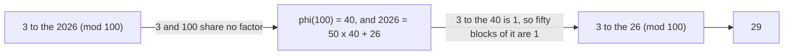

# Euler's theorem: raise a coprime number to the clock's coprime count and get 1, Fermat set free of primes

Number theory → Powers on the Clock → Fermat and Euler → Euler's theorem

---

## General Overview

A pocket calculator runs out of display around twenty threes. Ask for 2026 of them and it errors.

The useful question is smaller: **what are the last two digits of 3 to the 2026?**

Last two digits means: divide by 100, keep the remainder. That is the 100-clock ([congruence-mod-n](../03-Clock%20Arithmetic/01-congruence-mod-n.md)), where nothing gets big. Multiplying out one 3 at a time grinds through every power there; repeated squaring is far quicker but still walks the whole exponent ([modular-exponentiation](01-modular-exponentiation.md)). Euler cuts the exponent first.

Count the numbers below 100 sharing no factor with 100. That count is Euler's totient, written phi(n) ([eulers-totient](03-eulers-totient.md)): phi(100) = 40. Since 3 shares no factor with 100, 3 to the 40 ≡ 1 (mod 100). Multiplying by 1 changes nothing, so whole 40s in the exponent can be thrown away. 2026 = 50 × 40 + 26, and 3 to the 26 ≡ 29 (mod 100).

**Raise anything coprime to the clock to the count of that clock's coprimes and the clock reads 1 — so the exponent can be cut by that count.**

### The picture: the exponent gets cut



---

## The formula

On our clock, this is the whole thing:

**3 to the 40 ≡ 1 (mod 100), because 3 and 100 share no factor above 1, and 40 is how many numbers below 100 share no factor with 100.**

**Read it aloud:** raise a coprime number to the clock's coprime count and it shows 1.

| Piece | Plain meaning | In our example |
| --- | --- | --- |
| the clock size | what you divide by, keeping the remainder | 100, the last two digits |
| the base | the number multiplied by itself | 3 |
| coprime | sharing no factor above 1 ([coprime-numbers](../02-Greatest%20Common%20Divisor%20and%20Euclid%27s%20Algorithm/05-coprime-numbers.md)) | gcd(3, 100) — the largest number dividing both — is 1 |
| phi(n), Euler's totient | how many numbers below the clock are coprime to it ([eulers-totient](03-eulers-totient.md)) | 40 |
| the exponent | how many times the base is multiplied by itself | 2026, cut to 26 |

Nothing about 3 or 100 is special: any clock, any coprime base. On a prime clock everything below is coprime, so the count is one less than the prime: Fermat's little theorem ([fermats-little-theorem](02-fermats-little-theorem.md)).

---

## Why it works

### Step 0: the coprime numbers are the ones you can undo

Multiplying by 3 on the 100-clock can be undone, because 3 shares no factor with 100: something multiplies it back to 1 ([modular-inverse](../03-Clock%20Arithmetic/04-modular-inverse.md)). Exactly the coprime numbers can be undone, and 40 sit below 100. Call them the list.

### Step 1: multiplying the list by 3 only shuffles it

Multiply each of the 40 by 3, keeping remainders.

Every answer is still coprime to 100: 3 brings in no new factor, nor did the number it multiplied. No two collide: if two landed on the same remainder, undoing the 3 would make them equal, and they were not.

Forty answers, all coprime, all different, and only 40 such numbers exist: the same list, reordered. The check prints **the same 40, in a different order**.

### Step 2: multiply the list together, both ways

Multiply the 40 together on the clock: the list product. The shuffled list holds the same numbers, so its product matches. But every entry carries one extra 3, and there are 40 of them, so that product is also 3 to the 40 times the list product.

### Step 3: cancel the list product

It is a product of numbers each coprime to 100, so it is coprime to 100 too ([coprime-numbers](../02-Greatest%20Common%20Divisor%20and%20Euclid%27s%20Algorithm/05-coprime-numbers.md)) and cancels. Take it off both sides:

**3 to the 40 ≡ 1 (mod 100).**

The list product prints as 1; the argument never needed that.

### Step 4: cut the exponent

2026 = 50 × 40 + 26, so 3 to the 2026 is 3 to the 40 fifty times over, times 3 to the 26. Each of the fifty is 1, so only 3 to the 26 is left: 29.

The numbers run on a 100-clock; the exponents run on a 40-clock.

---

## Worked numbers, by hand

| Step | Arithmetic | Value |
| --- | --- | --- |
| coprime? | gcd(3, 100) | 1 |
| count the coprimes | 50 odd, minus the 10 odd multiples of 5 | 40 |
| the count from 2 × 2 x 5 × 5 | half of 100 is 50, four fifths of that | 40 |
| Euler's promise | 3 to the 40 (mod 100) | 1 |
| cut the exponent | 2026 ÷ 40 | 50 remainder 26 |
| what is left | 3 to the 26 (mod 100) | 29 |
| the answer | 3 to the 2026 (mod 100) | **29** |

3 to the 2026 ends in 29; the clock never needs the digits in front.

### What breaks if you drop a piece

| Mistake | Comes out at | What went wrong |
| --- | --- | --- |
| a base sharing a factor: 2 to the 40, 10 to the 40 | 76, 0 | anything but 1, and not always 0 |
| treating 100 as prime: 3 to the 99 | 67 | one less than the clock works on prime clocks only |
| keeping the quotient: 3 to the 50 | 49 | 50 counts the blocks thrown away, 26 is the leftover |

---

## Code, from first principles, and it actually runs

Nothing is imported. The 40 coprime numbers are found one at a time, counted again from the factors of 100, and the shuffle matched against the list. The answer comes twice: Euler's shortcut, and all 2026 multiplications ground out.

### Python

```python
# Euler's theorem -- the check behind the card.  Nothing is imported.  The last
# two digits of 3 to the 2026 on the 100-clock: phi(100) = 40, 2026 = 50 x 40 + 26.
def gcd(a, b): return a if b == 0 else gcd(b, a % b)       # Euclid, the largest common divisor
def product(xs, n):                 # multiply a list together on the n-clock
    p = 1
    for x in xs: p = p * x % n
    return p
def power_mod(base, e, n): return product([base] * e, n)   # ground out, no shortcuts
def row(name, value): print(f"{name:<36}{value:>6}")
n, a, big = 100, 3, 2026
units = [u for u in range(1, n) if gcd(u, n) == 1]         # the coprime residues
phi = len(units)
phi_factored = n // 2 * (2 - 1) // 5 * (5 - 1)             # half of 100, then four fifths
shuffled = sorted(a * u % n for u in units)
q, rem = divmod(big, phi)
row("gcd(3, 100)", gcd(a, n))
row("phi(100), counted one by one", phi)
row("phi(100), from 100 = 2 x 2 x 5 x 5", phi_factored)
row("3 to the 40 (mod 100)", power_mod(a, phi, n))
print(f"the same 40 come back, in a different order: {sum(1 for i in range(phi) if shuffled[i] == units[i])} of {phi} once sorted; multiplied, {product(units, n)} before and {product(shuffled, n)} after")
print(f"{big} = {q} x {phi} + {rem}")
row("3 to the 26 (mod 100), the shortcut", power_mod(a, rem, n))
row("3 to the 2026 (mod 100), ground out", power_mod(a, big, n))
print(f"the mistakes: 10 to the {phi} gives {power_mod(10, phi, n)}, 2 to the {phi} gives {power_mod(2, phi, n)}, 3 to the {n - 1} gives {power_mod(a, n - 1, n)}, 3 to the {q} gives {power_mod(a, q, n)}")
print(f"the wrong cut hides here but shows on the 7-clock: 3 to the 10 is {power_mod(a, 10 % 6, 7)} cut by 6, {power_mod(a, 10 % 7, 7)} cut by 7")
assert gcd(a, n) == 1 and phi == 40 and phi_factored == 40
assert shuffled == units and product(units, n) == product(shuffled, n) and power_mod(a, phi, n) == 1
assert power_mod(a, big, n) == 29 and power_mod(a, rem, n) == 29
assert power_mod(a, 10 % 6, 7) == power_mod(a, 10, 7) != power_mod(a, 10 % 7, 7)
print("ALL CHECKS PASS")
```

**Ran 2026-09-06 on macOS, Python 3.14.6, standard library only. All checks passed. Output, pasted from the run:**

```
gcd(3, 100)                              1
phi(100), counted one by one            40
phi(100), from 100 = 2 x 2 x 5 x 5      40
3 to the 40 (mod 100)                    1
the same 40 come back, in a different order: 40 of 40 once sorted; multiplied, 1 before and 1 after
2026 = 50 x 40 + 26
3 to the 26 (mod 100), the shortcut     29
3 to the 2026 (mod 100), ground out     29
the mistakes: 10 to the 40 gives 0, 2 to the 40 gives 76, 3 to the 99 gives 67, 3 to the 50 gives 49
the wrong cut hides here but shows on the 7-clock: 3 to the 10 is 4 cut by 6, 6 cut by 7
ALL CHECKS PASS
```

### Rust

Same numbers and labels, `rustc --edition 2021 -O`.

```rust
// Euler's theorem -- the same check as eulers_theorem_check.py, in Rust.  No
// crates.  The last two digits of 3 to the 2026 on the 100-clock: phi(100) = 40
// and 2026 = 50 x 40 + 26.
fn gcd(a: i64, b: i64) -> i64 { if b == 0 { a } else { gcd(b, a % b) } }   // the largest common divisor
fn product(xs: &[i64], n: i64) -> i64 {         // multiply a list together on the n-clock
    let mut p = 1i64;
    for x in xs { p = p * x % n; }
    p
}
fn power_mod(base: i64, e: i64, n: i64) -> i64 { product(&vec![base; e as usize], n) }
fn row(name: &str, value: i64) { println!("{:<36}{:>6}", name, value); }
fn main() {
    let (n, a, big) = (100i64, 3i64, 2026i64);
    let units: Vec<i64> = (1..n).filter(|u| gcd(*u, n) == 1).collect();   // the coprime residues
    let phi = units.len() as i64;
    let phi_factored = n / 2 * (2 - 1) / 5 * (5 - 1);                     // half of 100, then four fifths
    let mut shuffled: Vec<i64> = units.iter().map(|u| a * u % n).collect();
    shuffled.sort();
    let (q, rem) = (big / phi, big % phi);
    row("gcd(3, 100)", gcd(a, n));
    row("phi(100), counted one by one", phi);
    row("phi(100), from 100 = 2 x 2 x 5 x 5", phi_factored);
    row("3 to the 40 (mod 100)", power_mod(a, phi, n));
    println!("the same 40 come back, in a different order: {} of {} once sorted; multiplied, {} before and {} after",
             (0..units.len()).filter(|i| shuffled[*i] == units[*i]).count(), phi,
             product(&units, n), product(&shuffled, n));
    println!("{} = {} x {} + {}", big, q, phi, rem);
    row("3 to the 26 (mod 100), the shortcut", power_mod(a, rem, n));
    row("3 to the 2026 (mod 100), ground out", power_mod(a, big, n));
    println!("the mistakes: 10 to the {} gives {}, 2 to the {} gives {}, 3 to the {} gives {}, 3 to the {} gives {}",
             phi, power_mod(10, phi, n), phi, power_mod(2, phi, n), n - 1, power_mod(a, n - 1, n), q, power_mod(a, q, n));
    println!("the wrong cut hides here but shows on the 7-clock: 3 to the 10 is {} cut by 6, {} cut by 7",
             power_mod(a, 10 % 6, 7), power_mod(a, 10 % 7, 7));
    assert!(gcd(a, n) == 1 && phi == 40 && phi_factored == 40);
    assert!(shuffled == units && product(&units, n) == product(&shuffled, n) && power_mod(a, phi, n) == 1);
    assert!(power_mod(a, big, n) == 29 && power_mod(a, rem, n) == 29);
    assert!(power_mod(a, 10 % 6, 7) == power_mod(a, 10, 7) && power_mod(a, 10, 7) != power_mod(a, 10 % 7, 7));
    println!("ALL CHECKS PASS");
}
```

**Ran 2026-09-06 on macOS, rustc 1.98.1, no crates. All checks passed. Output, pasted from the run:**

```
gcd(3, 100)                              1
phi(100), counted one by one            40
phi(100), from 100 = 2 x 2 x 5 x 5      40
3 to the 40 (mod 100)                    1
the same 40 come back, in a different order: 40 of 40 once sorted; multiplied, 1 before and 1 after
2026 = 50 x 40 + 26
3 to the 26 (mod 100), the shortcut     29
3 to the 2026 (mod 100), ground out     29
the mistakes: 10 to the 40 gives 0, 2 to the 40 gives 76, 3 to the 99 gives 67, 3 to the 50 gives 49
the wrong cut hides here but shows on the 7-clock: 3 to the 10 is 4 cut by 6, 6 cut by 7
ALL CHECKS PASS
```

The two outputs match line for line.

> [!TIP]
> **Try changing**
> - **Break the coprime rule.** Set the base to 2. Guess first: 2 to the 40 is 76, not 1, and the first assert fires: the gcd line catches it before Euler is tested.
> - **Move to a prime clock.** Set `n` to 97, then delete the factored-totient line, its row, and the asserts holding 40 and 29. Everything below 97 is coprime, so the count is 96 and 3 to the 96 is 1: Euler back as Fermat.

---

## The usual mistake

> [!warning]
> **Cutting the exponent by the clock size instead of by the totient.** Here they agree: 2026 leaves 26 either way, hiding the mistake. The 7-clock shows it: 3 to the 10 is 4 cut by 6, but 6 cut by 7. Mixing the two quietly ruins RSA keys.
>
> - Skipping the coprime test. 2 to the 40 is 76, 10 to the 40 is 0; no exponent-cutting rescues either.
> - Using one less than the clock size out of habit: on 100 that gives 67.
> - Reducing the base instead of the exponent. The base stays put.
> - Believing 40 is the smallest exponent returning 1. A smaller one already works: the order ([order-and-primitive-roots](05-order-and-primitive-roots.md)).

---

## Where you meet it in real life

- **RSA.** The two exponents multiply to one more than a multiple of the totient, so encrypt-then-decrypt is Euler's 1 times the message: [rsa-in-outline](../06-Codes%20and%20Secrets/03-rsa-in-outline.md).
- **Last digits of huge numbers.** Any "what does it end in" puzzle is a clock of 10, 100 or 1000, exponent cut first: [modular-exponentiation](01-modular-exponentiation.md).
- **Repeating decimals.** A decimal repeats after a run dividing the denominator's totient.

> **Say it back**
> Count the numbers below the clock sharing no factor with it: that is Euler's totient. Raise anything coprime to the clock to that count and the clock reads 1. For 100 the count is 40, so 2026 can be cut by whole 40s, leaving 3 to the 26: 29. The proof is a shuffle: multiply the coprime list by 3, the same list comes back, so the products match and cancel.

---

## What this builds on

- [fermats-little-theorem](02-fermats-little-theorem.md): the prime-clock version, widened here.
- [eulers-totient](03-eulers-totient.md): where the 40 comes from.
- [exponents-and-powers](../../01-Foundations/03-Powers%2C%20Roots%20and%20Logarithms/01-exponents-and-powers.md): what "3 to the 2026" means.

## Where this goes next

- [order-and-primitive-roots](05-order-and-primitive-roots.md): the smallest exponent returning to 1, often below 40.
- [rsa-in-outline](../06-Codes%20and%20Secrets/03-rsa-in-outline.md): the theorem doing paid work.

---

## Sources

Verified 6 Sep 2026: every link resolves.

- Euler, Leonhard. "Theoremata arithmetica nova methodo demonstrata." 1763. [Euler Archive E271](https://scholarlycommons.pacific.edu/euler-works/271/). Where it starts.
- Shoup, Victor. *A Computational Introduction to Number Theory and Algebra*, 2nd ed. Cambridge, 2008. [Free full text](https://shoup.net/ntb/). The congruences chapter: the totient, then this shuffle proof.
- Graham, Ronald L., Donald E. Knuth and Oren Patashnik. *Concrete Mathematics*, 2nd ed. Addison-Wesley, 1994. [Publisher page](https://www.informit.com/store/concrete-mathematics-a-foundation-for-computer-science-9780201558029). Section 4.9, counting the coprimes.
