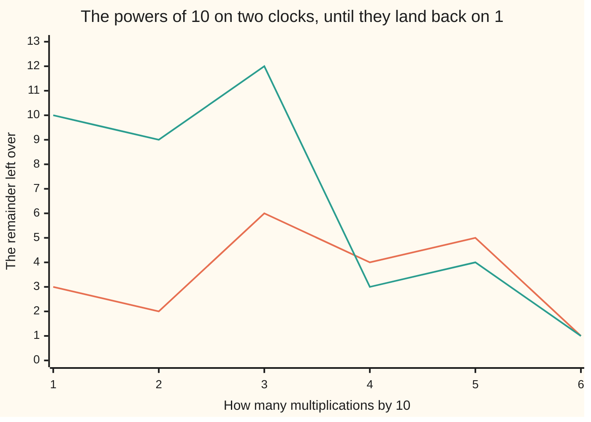

# The order of a number and primitive roots: how many steps until the powers return to 1, and the numbers that visit everything

Number theory → Powers on the Clock → Cycles of powers → The order of a number and primitive roots

---

## General Overview

Divide 1 by 7 on paper. The answer is 0.142857 142857 142857, forever. Six digits, then the same six.

Divide 1 by 13: 0.076923 076923 076923. Six again. The shared six is not luck.

Long division carries a remainder, and each step multiplies that carry by 10 before dividing again. First carry 10, next 10 × 10, and so on. So the carries are the powers of 10 on the clock ([congruence-mod-n](../03-Clock%20Arithmetic/01-congruence-mod-n.md)), and the digits repeat once a carry returns to 1. On the 7-clock they run 3, 2, 6, 4, 5, 1; on the 13-clock, 10, 9, 12, 3, 4, 1. Six steps home both times: the **order** of 10 is 6.

On the 7-clock those carries hit all six numbers you can multiply by and get back from — sharing no factor above 1 with 7; on the 13-clock, half of twelve. A number whose powers reach everything is a **primitive root**.

**The order is how many steps a number's powers take to return to 1. It always divides the count of remainders you can get back from, and equalling that count makes the number a primitive root.**

### The picture



Orange is the 7-clock, teal the 13-clock; both reach 1 at step six.

---

## The formula

A count, not a sum. On the 7-clock:

**Start at 1. Multiply by 10, keep the remainder on 7: 3. Again: 2. Then 6, 4, 5, 1. Six multiplications to reach 1, and no fewer. The order of 10 on the 7-clock is 6.**

**Read it aloud: six tens bring the 7-clock home.**

Six numbers from 1 to 7 share no factor above 1 with 7 — Euler's totient, phi(7) ([eulers-totient](03-eulers-totient.md)). Order and totient match, so 10 is a primitive root here. On the 13-clock the order is 6 but phi(13) is 12.

| Piece | Plain meaning | Here |
| --- | --- | --- |
| clock size | what you divide by, keeping the remainder | 7, 13 |
| the number | what you multiply by | 10 |
| the order | fewest multiplications back to 1 | 6 on both |
| phi(n) | Euler's totient: how many of 1 to n share no factor above 1 with n | 6, 12 |
| primitive root | order equal to phi(n) | 10 on the 7-clock |

A clock can have more than one primitive root. The 7-clock has two, 3 and 5; 10 is 3 in disguise.

---

## Why it works

### Step 0: the powers cannot wander forever

A clock holds only so many remainders, so multiplying by 10 over and over must revisit one. When 10 and the clock size share no factor above 1, every step can be undone ([modular-inverse](../03-Clock%20Arithmetic/04-modular-inverse.md)), so the first repeat is a return to 1.

Drop the condition and it fails. 10 and 14 are both even: the powers of 10 on the 14-clock go 10, 2, 6, 4, 12, 8 and round again, never touching 1.

### Step 1: when a run lands on 1

The order of 10 on the 7-clock is 6. Divide any run length by 6 ([division-with-remainder](../01-Divisibility%20and%20Primes/04-division-with-remainder.md)): so many sixes plus a leftover under 6. Each six lands on 1, which changes nothing, so the run ends where the leftover alone would. It reaches 1 exactly when 6 divides the length.

### Step 2: the order divides phi(n)

Euler's theorem ([eulers-theorem](04-eulers-theorem.md)) lands a run of phi(n) on 1 for any number sharing no factor with the clock size, so by Step 1 the order divides phi(n). On the 7-clock it divides 6 and is 6; on the 13-clock, 12 and 6.

Now let the order be the whole of phi(n). Its first phi(n) powers are all different: two matching would cancel to a shorter run landing on 1, which Step 1 forbids. Only phi(n) remainders share no factor with the clock size, so the powers are all of them: a primitive root.

<details>
<summary>Which clocks have a primitive root at all</summary>

Not all. Only 1, 2, 4, any power of an odd prime, and twice any power of an odd prime. The 8-clock and 12-clock have none. Gauss settled it; proof left off.

</details>

The decimals are the same fact: the carry in long division is the running power of 10 ([decimals](../../01-Foundations/01-Everyday%20Arithmetic/08-decimals.md)).

---

## Worked numbers, by hand

The 7-clock, remainders on 7.

| Step | Arithmetic | Value |
| --- | --- | --- |
| one | 1 × 10 | 3 |
| two | 3 × 10 | 2 |
| three | 2 × 10 | 6 |
| four | 6 × 10 | 4 |
| five | 4 × 10 | 5 |
| six | 5 × 10 | **1** |

Home in six, phi(7) is 6: a primitive root, and 1/7 repeats every 6 digits, 142857. The 13-clock gives 10, 9, 12, 3, 4, 1, six again, but phi(13) is 12. Not a primitive root, and 1/13 still repeats every 6: 076923.

### What breaks if you drop a piece

| Mistake | Comes out at | What went wrong |
| --- | --- | --- |
| phi(13) read as the repeat length | 12 | The order is smaller: 6 |
| Any number taken for a primitive root | 3 | 2 on the 7-clock goes 2, 4, 1 |
| The shared factor ignored | 0 | 10 on the 14-clock has no order |

The code prints all three.

---

## Code, from first principles, and it actually runs

Nothing is imported. Two roads to the same count: multiply by 10 on the clock until the remainder is 1, or long-divide 1 and count digits to the repeat. An assert pins them together.

### Python

```python
# The order of a number, and primitive roots -- the check behind the card.  Nothing
# is imported.  Road one: multiply by 10 on the clock until the remainder is 1.
# Road two: long-divide 1 by n and see how long the repeating block is.
def order(a, n):                # fewest multiplications until the remainder is 1
    r, k = a % n, 1
    while r != 1 and k <= n: r, k = r * a % n, k + 1
    return k if r == 1 else 0
def powers(a, n, k):            # the running remainders, k of them
    out, r = [], 1
    for _ in range(k): r = r * a % n; out.append(r)
    return out
def long_division(n):           # digits of 1/n and block length; right only if n and 10 share no factor
    digits, r, seen = "", 1, []
    while r not in seen: seen.append(r); digits += str(10 * r // n); r = 10 * r % n
    return digits, len(digits)
def phi(n):                     # how many of 1 to n share no factor above 1 with n
    def gcd(x, y): return x if y == 0 else gcd(y, x % y)
    return sum(1 for i in range(1, n + 1) if gcd(i, n) == 1)
for n in (7, 13):
    block, period = long_division(n)
    print(f"1/{n:<3}= 0.{block}...  repeats every {period}")
    print(f"  10 on the {n}-clock: {powers(10, n, 6)}  order {order(10, n)}  phi {phi(n)}")
print(f"2 on the 7-clock: {powers(2, 7, 3)}  order {order(2, 7)}")
print(f"10 on the 14-clock: {powers(10, 14, 6)}  order {order(10, 14)} means it never reaches 1")
assert long_division(7) == ("142857", 6) and long_division(13) == ("076923", 6)
assert all(long_division(m)[1] == order(10, m) for m in (7, 13))   # two roads agree
assert powers(10, 7, 6) == [3, 2, 6, 4, 5, 1] and powers(10, 13, 6) == [10, 9, 12, 3, 4, 1]
assert powers(10, 14, 6) == [10, 2, 6, 4, 12, 8] and powers(2, 7, 3) == [2, 4, 1]
assert phi(7) == 6 and phi(13) == 12 and phi(14) == 6 and order(2, 7) == 3 and order(10, 14) == 0
print("ALL CHECKS PASS")
```

**Ran 2026-09-06 on macOS, Python 3.14.6, standard library only. All checks passed. Output, pasted from the run:**

```
1/7  = 0.142857...  repeats every 6
  10 on the 7-clock: [3, 2, 6, 4, 5, 1]  order 6  phi 6
1/13 = 0.076923...  repeats every 6
  10 on the 13-clock: [10, 9, 12, 3, 4, 1]  order 6  phi 12
2 on the 7-clock: [2, 4, 1]  order 3
10 on the 14-clock: [10, 2, 6, 4, 12, 8]  order 0 means it never reaches 1
ALL CHECKS PASS
```

### Rust

Same numbers, built with `rustc --edition 2021 -O`.

```rust
// The order of a number, and primitive roots -- the same check as
// order_and_primitive_roots_check.py, in Rust.  No crates.  Road one: multiply by
// 10 on the clock until the remainder is 1.  Road two: long-divide 1 by n and see
// how long the repeating block is.
fn order(a: i64, n: i64) -> i64 {           // fewest multiplications until the remainder is 1
    let (mut r, mut k) = (a % n, 1i64);
    while r != 1 && k <= n { r = r * a % n; k += 1; }
    if r == 1 { k } else { 0 }
}
fn powers(a: i64, n: i64, k: usize) -> Vec<i64> {    // the running remainders, k of them
    let (mut out, mut r) = (Vec::new(), 1i64);
    for _ in 0..k { r = r * a % n; out.push(r); }
    out
}
fn long_division(n: i64) -> (String, usize) {   // digits of 1/n and block length; right only if n and 10 share no factor
    let (mut digits, mut r, mut seen) = (String::new(), 1i64, Vec::new());
    while !seen.contains(&r) { seen.push(r); digits.push_str(&(10 * r / n).to_string()); r = 10 * r % n; }
    let len = digits.len();
    (digits, len)
}
fn gcd(x: i64, y: i64) -> i64 { if y == 0 { x } else { gcd(y, x % y) } }
fn phi(n: i64) -> i64 {         // how many of 1 to n share no factor above 1 with n
    (1..=n).filter(|i| gcd(*i, n) == 1).count() as i64
}
fn main() {
    for n in [7i64, 13] {
        let (block, period) = long_division(n);
        println!("1/{:<3}= 0.{}...  repeats every {}", n, block, period);
        println!("  10 on the {}-clock: {:?}  order {}  phi {}", n, powers(10, n, 6), order(10, n), phi(n));
    }
    println!("2 on the 7-clock: {:?}  order {}", powers(2, 7, 3), order(2, 7));
    println!("10 on the 14-clock: {:?}  order {} means it never reaches 1", powers(10, 14, 6), order(10, 14));
    assert!(long_division(7) == ("142857".to_string(), 6) && long_division(13) == ("076923".to_string(), 6));
    assert!([7i64, 13].iter().all(|&m| long_division(m).1 as i64 == order(10, m)));   // two roads agree
    assert!(powers(10, 7, 6) == [3, 2, 6, 4, 5, 1] && powers(10, 13, 6) == [10, 9, 12, 3, 4, 1]);
    assert!(powers(10, 14, 6) == [10, 2, 6, 4, 12, 8] && powers(2, 7, 3) == [2, 4, 1]);
    assert!(phi(7) == 6 && phi(13) == 12 && phi(14) == 6 && order(2, 7) == 3 && order(10, 14) == 0);
    println!("ALL CHECKS PASS");
}
```

**Ran 2026-09-06 on macOS, rustc 1.98.1, no crates. All checks passed. Output, pasted from the run:**

```
1/7  = 0.142857...  repeats every 6
  10 on the 7-clock: [3, 2, 6, 4, 5, 1]  order 6  phi 6
1/13 = 0.076923...  repeats every 6
  10 on the 13-clock: [10, 9, 12, 3, 4, 1]  order 6  phi 12
2 on the 7-clock: [2, 4, 1]  order 3
10 on the 14-clock: [10, 2, 6, 4, 12, 8]  order 0 means it never reaches 1
ALL CHECKS PASS
```

Whole numbers throughout: outputs match line for line.

> [!TIP]
> **Try changing**
> Guess first, then run. Neither edit touches an assert, so both still print ALL CHECKS PASS.
> - **Add the 3-clock.** Put 3 beside 7 and 13 in the `for` line. One third runs 0.333 forever, one digit: the order of 10 is 1.
> - **Ask for more powers.** Change `powers(10, n, 6)` in the print line to `powers(10, n, 12)`. Nothing new: 3, 2, 6, 4, 5, 1, then the same six, and the 13-clock repeats too.

---

## The usual mistake

> [!warning]
> **Taking phi(n) for the answer rather than the ceiling.** Euler's theorem gets you home in phi(n) steps ([eulers-theorem](04-eulers-theorem.md)), not necessarily first. On the 13-clock phi(13) is 12, but 10 arrives after 6: a 12-digit repeat for 1/13 is double.
>
> - **Forgetting the shared factor.** An order needs the number and clock size to share nothing above 1 ([coprime-numbers](../02-Greatest%20Common%20Divisor%20and%20Euclid%27s%20Algorithm/05-coprime-numbers.md)): 10 on the 14-clock never reaches 1.
> - **Treating "primitive root" as a property of one number.** It belongs to the pair: 10 is one on the 7-clock, not the 13-clock.
> - **Counting from 0.** The order counts multiplications, so it starts at 1.

---

## Where you meet it in real life

- **Repeating decimals.** The block of 1/n is as long as the order of 10 on the n-clock ([decimals](../../01-Foundations/01-Everyday%20Arithmetic/08-decimals.md)): 142857 for 7, 076923 for 13.
- **Key exchange.** Diffie-Hellman needs a large prime and a primitive root on it ([diffie-hellman](../06-Codes%20and%20Secrets/02-diffie-hellman.md)).
- **Card shuffles.** A perfect riffle doubles each position on a clock; the deck returns at the order of 2 ([perfect-shuffles](../05-Check%20Digits%2C%20Calendars%20and%20Cycles/05-perfect-shuffles.md)).

> **Say it back**
> Take a clock and a number sharing no factor with it. Multiply by it over and over: the remainder returns to 1, and that count is the order. It always divides phi(n), the count of remainders you can get back from. Equalling phi(n) makes it a primitive root, touching every one. 10 is one on the 7-clock, so 1/7 repeats every 6 digits.

---

## What this builds on

- [eulers-theorem](04-eulers-theorem.md): a run of phi(n) multiplications lands on 1, the ceiling this count divides.
- [decimals](../../01-Foundations/01-Everyday%20Arithmetic/08-decimals.md): long division and the repeating block, what the order measures.

## Where this goes next

- [perfect-shuffles](../05-Check%20Digits%2C%20Calendars%20and%20Cycles/05-perfect-shuffles.md): the order of 2 on a clock, riffles back to a fresh deck.
- [diffie-hellman](../06-Codes%20and%20Secrets/02-diffie-hellman.md): why key exchange rests on a primitive root of a large prime.

---

## Sources

Verified 6 Sep 2026; every link resolves.

- Gauss, Carl Friedrich. *Disquisitiones Arithmeticae*, trans. Clarke. Springer, 1986. [doi:10.1007/978-1-4939-7560-0](https://doi.org/10.1007/978-1-4939-7560-0). Section III, orders and primitive roots.
- Hardy, G. H., and E. M. Wright. *An Introduction to the Theory of Numbers*, 6th ed. Oxford University Press, 2008. [Publisher page](https://global.oup.com/academic/product/an-introduction-to-the-theory-of-numbers-9780199219865). Chapter IX.
- Shoup, Victor. *A Computational Introduction to Number Theory and Algebra*, 2nd ed. Cambridge, 2008. [Free full text](https://shoup.net/ntb/). Chapter 2.
