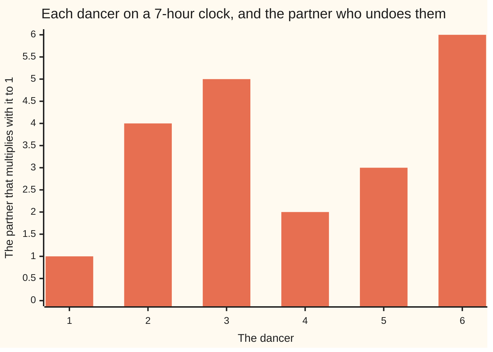

# Wilson's theorem: multiply everything below a prime and the clock shows -1, and only primes do this

[Syllabus](../../../SYLLABUS.md) → [Number theory](../../../SYLLABUS.md#w02) → [Powers on the Clock](../../../SYLLABUS.md#w02-s04) → Wilson's theorem

---

## General Overview

Six dancers, 1 to 6, on a floor marked as a 7-hour clock: hours 0 to 6, and a step past 6 lands on 0 ([Congruence](../03-Clock%20Arithmetic/01-congruence-mod-n.md)). Each must find the partner who undoes them: the one they multiply with to reach 1 ([The modular inverse](../03-Clock%20Arithmetic/04-modular-inverse.md)).

2 takes 4: 2 × 4 is 8, one clock and 1 over. 3 takes 5: 15 is two clocks and 1 over. 1 partners itself, and so does 6: 36 is five clocks and 1 over.

Multiply all six together. Each couple collapses to 1. 6 undoes itself, but it is in the row once, so it has nothing to cancel with. It survives, leaving 1 × 6, which is 6. The long way agrees: 720 is 102 clocks and 6 over.

6 is one short of a full clock, so the reading is -1 ([Negative numbers](../../01-Foundations/01-Everyday%20Arithmetic/06-negative-numbers.md)).

**Multiply every number below a prime clock size together and the clock reads -1 — and no clock that is not prime ever does that.**

Wilson claimed it in 1770; Lagrange proved it a year later.

### The picture: who undoes who



Dancers 1 and 6 sit on their own numbers. The other four cross over: 2 with 4, 3 with 5. Two alone, the rest in couples: that is the proof.

---

## The formula

The clock is the statement:

**1 × 2 × 3 × 4 × 5 × 6 = 720 = 102 × 7 + 6, and 6 - 7 = -1, so 720 ≡ -1 (mod 7)**

The ≡ means the same reading; the (mod 7) says which clock.

| Piece | Plain meaning | Here |
| --- | --- | --- |
| the clock size | how many hours, and it must be prime | 7 |
| the row | 1 up to one below the clock size | 1, 2, 3, 4, 5, 6 |
| a partner | what multiplies with yours to land on 1 | 4 undoes 2 |
| the reading | what is left when whole clocks come off, also called -1 | 6 |

Call the clock size p, for prime: multiply every number from 1 up to p - 1 and the reading is -1 (mod p).

It runs backwards too: a reading of -1 means the clock size is prime.

---

## Why it works

### Step 0: on a prime clock every dancer has one undo

7 is prime, so no dancer from 1 to 6 shares a factor with it. That is the condition for an undo, and it is unique ([The modular inverse](../03-Clock%20Arithmetic/04-modular-inverse.md)). Partnering is mutual: if 4 undoes 2, 2 undoes 4.

### Step 1: only 1 and 6 are their own partner

A dancer is its own partner when multiplying it by itself reads 1. That means 7 divides the dancer times itself, minus 1 — one below the dancer times one above it. Take dancer 3: 3 × 3 - 1 is 8, which is 2 × 4.

7 is prime, so it divides one of those two pieces ([Euclid's lemma](../02-Greatest%20Common%20Divisor%20and%20Euclid%27s%20Algorithm/06-euclids-lemma.md)). One below is 0 only for dancer 1; one above is 7 only for dancer 6.

### Step 2: everyone else cancels in couples, and 1 × 6 is left

2, 3, 4 and 5 remain. Each has a partner in that group, not itself, so they split into two couples: (2, 4) and (3, 5), both reading 1.

Reordered, the row is 1 × (2 × 4) × (3 × 5) × 6. Both brackets read 1, so 1 × 6 survives: one short of the clock, -1.

### Step 3: why no other clock can do it

Take an 8-clock. Its row runs 1 to 7, so 2 and 4 both sit in it. They multiply to 8, a whole clock: the reading is 0 and stays 0. Any clock with room for both its factors goes that way.

A 9-clock has just one factor, 3, twice over. Still 0: 3 and its double 6 both sit in the row, and 3 × 6 = 18 is two whole clocks. Same for any prime times itself, above 4.

That leaves the 4-clock, too small to hold its factors apart: 1 × 2 × 3 is 6, which reads 2.

Fermat's little theorem shuffles these dancers ([Fermat's little theorem](02-fermats-little-theorem.md)); this one multiplies them together.

---

## Worked numbers, by hand

Both roads.

| Step | Arithmetic | Value |
| --- | --- | --- |
| the row, the long way | 1 × 2 × 3 × 4 × 5 × 6 | 720 |
| whole clocks off | 720 = 102 × 7 + 6 | 6 |
| as a negative | 6 - 7 | **-1** |
| first couple | 2 × 4 = 8 | 1 |
| second couple | 3 × 5 = 15 | 1 |
| the pairing road | 1 × 1 × 1 × 6 | **6** |

Same reading both ways, and the pairing road never passes 15 while the long way hits 720.

### What breaks if you drop a piece

| Mistake | Comes out at | What went wrong |
| --- | --- | --- |
| On an 8-clock | 0 | 2 and 4 both sit in the row and multiply to 8 |
| On a 4-clock | 2 | the one composite that reads anything but 0 |

---

## Code, from first principles, and it actually runs

Nothing is imported. The row is multiplied in full, 720, then whole clocks come off. A second way cancels the couples. Two composite clocks follow.

### Python

```python
# Wilson's theorem -- the check behind the card.  Nothing is imported.  Six
# dancers, 1 to 6, on a 7-hour clock: each pairs off with the partner that
# undoes it, so the whole product reads 6, one short of a clock, which is -1.
CLOCK = 7
def product(top, clock):        # 1 x 2 x ... x top, whole clocks taken off
    out = 1
    for k in range(1, top + 1): out = (out * k) % clock
    return out

def row(name, value): print(f"{name:<48}{value:>5}")
partners = [b for a in range(1, CLOCK) for b in range(1, CLOCK) if (a * b) % CLOCK == 1]
alone = [a for a in range(1, CLOCK) if partners[a - 1] == a]          # 1 and 6
pairs = [(a, partners[a - 1]) for a in range(1, CLOCK) if a < partners[a - 1]]
plain = 1
for k in range(1, CLOCK): plain = plain * k                           # 720, in full
paired = 1
for a, b in pairs: paired = (paired * a * b) % CLOCK                  # each pair reads 1
for a in alone: paired = (paired * a) % CLOCK                         # 1 and 6 are left
row("1 x 2 x 3 x 4 x 5 x 6", plain)
row(f"{plain} = {plain // CLOCK} x {CLOCK} + {plain % CLOCK}, so the 7-clock reads", plain % CLOCK)
print("who undoes who, dancers 1 to 6:  " + " ".join(str(b) for b in partners))
print("the two pairs: " + ", ".join(f"{a} x {b} = {a * b} reads {a * b % CLOCK}" for a, b in pairs))
print(f"their own partner: 1 x 1 = 1 and 6 x 6 = {alone[1] * alone[1]}, both read 1")
row("the pairing road, 1 x 1 x 1 x 6, reads", paired)
row(f"that reading as a negative: {plain % CLOCK} - {CLOCK}", plain % CLOCK - CLOCK)
print(f"composites: an 8-clock (5040) reads {product(7, 8)}, a 4-clock (6) reads {product(3, 4)}")
assert plain == 720 and plain == 102 * CLOCK + 6
assert partners == [1, 4, 5, 2, 3, 6] and alone == [1, 6] and pairs == [(2, 4), (3, 5)]
assert paired == 6 and plain % CLOCK == 6 and product(7, 8) == 0 and product(3, 4) == 2
print("ALL CHECKS PASS")
```

**Ran 2026-09-06 on macOS, Python 3.14.6, standard library only. All checks passed. Output, pasted from the run:**

```
1 x 2 x 3 x 4 x 5 x 6                             720
720 = 102 x 7 + 6, so the 7-clock reads             6
who undoes who, dancers 1 to 6:  1 4 5 2 3 6
the two pairs: 2 x 4 = 8 reads 1, 3 x 5 = 15 reads 1
their own partner: 1 x 1 = 1 and 6 x 6 = 36, both read 1
the pairing road, 1 x 1 x 1 x 6, reads              6
that reading as a negative: 6 - 7                  -1
composites: an 8-clock (5040) reads 0, a 4-clock (6) reads 2
ALL CHECKS PASS
```

### Rust

Same numbers, built with `rustc --edition 2021 -O`.

```rust
// Wilson's theorem -- the same check as the Python one, in Rust.  No crates.
// Six dancers, 1 to 6, on a 7-hour clock: each pairs off with the partner that
// undoes it, so the whole product reads 6, one short of a clock, which is -1.
const CLOCK: i64 = 7;

fn product(top: i64, clock: i64) -> i64 {   // 1 x 2 x ... x top, whole clocks taken off
    let mut out = 1;
    for k in 1..=top { out = (out * k) % clock; }
    out
}

fn row(name: &str, value: i64) { println!("{:<48}{:>5}", name, value); }

fn main() {
    let partners: Vec<i64> = (1..CLOCK)
        .map(|a| (1..CLOCK).find(|&b| (a * b) % CLOCK == 1).unwrap()).collect();
    let alone: Vec<i64> = (1..CLOCK).filter(|&a| partners[(a - 1) as usize] == a).collect();
    let pairs: Vec<(i64, i64)> = (1..CLOCK).filter(|&a| a < partners[(a - 1) as usize])
        .map(|a| (a, partners[(a - 1) as usize])).collect();
    let mut plain = 1i64;
    for k in 1..CLOCK { plain = plain * k; }                          // 720, in full
    let mut paired = 1i64;
    for &(a, b) in pairs.iter() { paired = (paired * a * b) % CLOCK; }  // each pair reads 1
    for &a in alone.iter() { paired = (paired * a) % CLOCK; }         // 1 and 6 are left
    row("1 x 2 x 3 x 4 x 5 x 6", plain);
    row(&format!("{} = {} x {} + {}, so the 7-clock reads", plain, plain / CLOCK, CLOCK, plain % CLOCK), plain % CLOCK);
    let who: Vec<String> = partners.iter().map(|b| b.to_string()).collect();
    println!("who undoes who, dancers 1 to 6:  {}", who.join(" "));
    let two: Vec<String> = pairs.iter()
        .map(|&(a, b)| format!("{} x {} = {} reads {}", a, b, a * b, a * b % CLOCK)).collect();
    println!("the two pairs: {}", two.join(", "));
    println!("their own partner: 1 x 1 = 1 and 6 x 6 = {}, both read 1", alone[1] * alone[1]);
    row("the pairing road, 1 x 1 x 1 x 6, reads", paired);
    row(&format!("that reading as a negative: {} - {}", plain % CLOCK, CLOCK), plain % CLOCK - CLOCK);
    println!("composites: an 8-clock (5040) reads {}, a 4-clock (6) reads {}", product(7, 8), product(3, 4));
    assert!(plain == 720 && plain == 102 * CLOCK + 6);
    assert!(partners == vec![1, 4, 5, 2, 3, 6] && alone == vec![1, 6] && pairs == vec![(2, 4), (3, 5)]);
    assert!(paired == 6 && plain % CLOCK == 6 && product(7, 8) == 0 && product(3, 4) == 2);
    println!("ALL CHECKS PASS");
}
```

**Ran 2026-09-06 on macOS, rustc 1.98.1, no crates. All checks passed. Output, pasted from the run:**

```
1 x 2 x 3 x 4 x 5 x 6                             720
720 = 102 x 7 + 6, so the 7-clock reads             6
who undoes who, dancers 1 to 6:  1 4 5 2 3 6
the two pairs: 2 x 4 = 8 reads 1, 3 x 5 = 15 reads 1
their own partner: 1 x 1 = 1 and 6 x 6 = 36, both read 1
the pairing road, 1 x 1 x 1 x 6, reads              6
that reading as a negative: 6 - 7                  -1
composites: an 8-clock (5040) reads 0, a 4-clock (6) reads 2
ALL CHECKS PASS
```

> [!TIP]
> **Try changing**
> Guess first, then run it. The asserts and the printed labels are pinned to the 7-clock: expect an assert to fire, and the labels to lie.
> - **Move to a 5-clock.** The row is 1 × 2 × 3 × 4 = 24: four clocks and 4 over, one short of 5. Still -1.
> - **Break the prime.** Set the clock to 9. Dancers 3 and 6 share its factor 3 and have no partner, so the script trips before printing.

---

## The usual mistake

> [!warning]
> **Expecting the answer 1.** Fermat's theorem sends a number round a loop back to 1. This one reads 6 on the 7-clock: one short, not one over.
>
> - **Thinking -1 is not 6.** Same hour, two names. -1 is the useful one: it holds on every prime clock.
> - **Believing every composite reads 0.** The 4-clock reads 2, alone among them, and still fails.
> - **Using it on big primes.** It never lies, but the row for a 40-digit prime is unwritable: [The Fermat test](../06-Codes%20and%20Secrets/04-fermat-test-and-carmichael.md).

---

## Where you meet it in real life

- **Proving a number prime on paper.** An exact test both ways, no liars to rule out — unlike Fermat's ([Primes and composites](../01-Divisibility%20and%20Primes/05-primes-and-composites.md), [The Fermat test](../06-Codes%20and%20Secrets/04-fermat-test-and-carmichael.md)).
- **Square roots on a prime clock.** Step 1 stands alone: only 1 and the top hour are their own partner, so a square root has two answers or none.
- **Clocks where every number has an undo.** The pairing still runs, but more dancers are their own partner, so the answer changes: an 8-clock and a 12-clock read 1. Only 4, powers of one prime, and twice those, read -1 ([The order of a number and primitive roots](05-order-and-primitive-roots.md)).

> **Say it back**
> Line up 1 to 6. Each has one partner it multiplies with to reach 1 on the 7-clock, and only 1 and 6 are their own partner. So the row folds into couples reading 1, leaving 1 × 6 = 6, one short of the clock: -1. A clock that is not prime never gets there: its own factors sit in the row and spoil it. A reading of -1 proves a prime — exact, and far too slow to use.

---

## What this builds on

- [The modular inverse](../03-Clock%20Arithmetic/04-modular-inverse.md): the partner that undoes a number, and why a prime clock gives everyone one.
- [Euclid's lemma](../02-Greatest%20Common%20Divisor%20and%20Euclid%27s%20Algorithm/06-euclids-lemma.md): a prime dividing a product divides one of its pieces — Step 1.
- [Negative numbers](../../01-Foundations/01-Everyday%20Arithmetic/06-negative-numbers.md): why one short of a full clock is written -1.

## Where this goes next

- [The Fermat test](../06-Codes%20and%20Secrets/04-fermat-test-and-carmichael.md): a quick primality test, and the numbers that fool it.
- [The Miller-Rabin test](../06-Codes%20and%20Secrets/05-miller-rabin.md): the test RSA actually uses.

---

## Sources

Verified 6 Sep 2026: every link resolves.

- Lagrange, Joseph-Louis. "Démonstration d'un théorème nouveau concernant les nombres premiers" (1771), in *Œuvres de Lagrange*, tome 3, Gauthier-Villars, 1869. [Internet Archive](https://archive.org/details/uvresdelagrange03lagr). The first published proof.
- Ireland, Kenneth, and Michael Rosen. *A Classical Introduction to Modern Number Theory*, 2nd ed. Springer, 1990. [doi:10.1007/978-1-4757-2103-4](https://link.springer.com/book/10.1007/978-1-4757-2103-4). Chapter 4.
- Apostol, Tom M. *Introduction to Analytic Number Theory*. Springer, 1976. [doi:10.1007/978-1-4757-5579-4](https://link.springer.com/book/10.1007/978-1-4757-5579-4). Section 5.4, theorem and converse.
