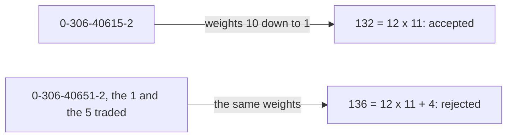

# ISBN-10 and the prime modulus 11: why a check digit on a prime clock also catches two swapped digits

[Syllabus](../../../SYLLABUS.md) → [Number theory](../README.md) → [Check Digits, Calendars and Cycles](../README.md#s05) → ISBN-10 and the prime modulus 11

---

## General Overview

An older book's copyright page carries ten digits: **0-306-40615-2**. Type it into a library catalogue with two traded — 0-306-40651-2 — and the box says no before looking anything up.

Nine digits name the book. The tenth argues. It is picked so one total lands on a multiple of 11: multiply the first digit by 10, the next by 9, down to the last by 1, add. Those multipliers are the weights. That comes to 132, which is 12 × 11, so it passes.

One wrong digit shifts the total off the multiple. So does a swap, and that case works only because 11 is prime.

**A swap shifts the total by one gap between weights times one gap between digits, and 11 divides no such product.**



---

## The formula

**10 × 0 + 9 × 3 + 8 × 0 + 7 × 6 + 6 × 4 + 5 × 0 + 4 × 6 + 3 × 1 + 2 × 5 + 1 × 2 = 132 = 12 × 11**

**Read it aloud: each digit times its weight, added up, and the answer is a whole number of 11s.**

The hyphens are spacing. The last weight is 1, so that digit can be picked last. Any other weight would need a modular inverse ([The modular inverse](../03-Clock%20Arithmetic/04-modular-inverse.md)).

| Piece | Plain meaning | Here |
| --- | --- | --- |
| the modulus | the clock size the total must be a multiple of | 11 |
| a weight | what a place's digit is multiplied by | 10 down to 1 |
| the weighted total | every digit times its weight, added | 132 |
| the check digit | the last digit, picked to land the total right | 2 |
| X | the mark for a check digit of 10 | not needed here |

If the first nine leave 0, the check digit is 0. If they leave 1, it is 10, written X.

---

## Why it works

### Step 0: a swap disturbs only the two places it touches

Every other digit keeps its place and its weight, so its share does not move.

### Step 1: the shift is a weight gap times a digit gap

The 1 sits at weight 3, the 5 at weight 2. Before: 3 × 1 + 2 × 5 = 13. After the trade: 3 × 5 + 2 × 1 = 17. Subtract the before line from the after line: 17 − 13 = 4.

That 4 is not luck. Weight 3 gained the digit gap of 4. Weight 2 lost it. What is left is (3 − 2) × (5 − 1) = 4: the weight gap times the digit gap.

Any swap works this way. One weight gains the digit gap, the other loses it.

### Step 2: 11 is prime, so neither gap can hide the mistake

Two places are 1 to 9 apart in weight. Two different digits are at most 10 apart, counting X as 10. Neither gap is a multiple of 11: too small.

A prime divides a product only by dividing one of the numbers multiplied ([Euclid's lemma](../02-Greatest%20Common%20Divisor%20and%20Euclid%27s%20Algorithm/06-euclids-lemma.md)). 11 divides neither gap, so it cannot divide the shift. The total moves to a new remainder and the ISBN is rejected — every swap of two different digits, every time.

### Step 3: a single wrong digit, same argument

A digit typed wrong shifts the total by its weight, 1 to 10, times how far off it is, at most 10. Neither is a multiple of 11, so the shift never is.

On a clock of 10 this dies. 10 = 2 × 5. A weight gap of 2 and a digit gap of 5 shift the total by 10, which leaves 0. The swap passes unseen. That is the barcode rule's price ([Barcode check digits](01-barcode-check-digit.md)).

---

## Worked numbers, by hand

| Step | Arithmetic | Value |
| --- | --- | --- |
| the ten products, added | 10 × 0 + 9 × 3 + … + 2 × 5 + 1 × 2 | 132 |
| a whole number of 11s? | 132 ÷ 11 | 12 |
| second road, running totals | 0 + 3 + 3 + 9 + 13 + 13 + 19 + 20 + 25 + 27 | 132 |
| the first nine alone | 132 − 1 × 2 | 130 |
| how far past a multiple of 11 | 130 − 11 × 11 | 9 |
| the check digit paying it | 11 − 9 | **2** |
| the 1 and the 5 traded | 132 + (3 − 2) × (5 − 1) | **136** |
| what 136 leaves on 11 | 136 − 12 × 11 | **4** |

The 2 the first nine demand is the 2 printed. The swap misses by 4 and bounces.

### What breaks if you drop a piece

| Mistake | Comes out at | What went wrong |
| --- | --- | --- |
| Adding the digits, no weights | 27 | Not a multiple of 11, and a swap would not move it |
| Testing on a clock of 10 | leaves 2 | 132 is a number of 11s, not 10s |
| Forgetting the check digit | leaves 9 | 130 is 9 short; the 2 pays it |

---

## Code, from first principles, and it actually runs

Nothing is imported. Road one multiplies each digit by its weight and adds. Road two never mentions a weight: it keeps a running total while reading the digits, then adds those ten totals. The first digit is inside all ten of them, so it is counted ten times. That is its weight. The second is inside nine. Then the check digit is rebuilt and the swap totalled.

### Python

```python
# ISBN-10 -- the check behind the card.  Nothing is imported.  ISBN 0-306-40615-2:
# ten digits, weights 10 down to 1, and the total has to land on a multiple of 11.
DIGITS = [0, 3, 0, 6, 4, 0, 6, 1, 5, 2]
WEIGHTS = [10, 9, 8, 7, 6, 5, 4, 3, 2, 1]

def total(ds):                          # each digit times its weight, added up
    return sum(d * w for d, w in zip(ds, WEIGHTS))

t = total(DIGITS)
print(" + ".join(f"{w} x {d}" for d, w in zip(DIGITS, WEIGHTS)) + f" = {t}")
print(f"{t} = {t // 11} x 11, so ISBN 0-306-40615-2 checks out")
runs = [sum(DIGITS[:k + 1]) for k in range(10)]      # second road: running totals
print("running totals: " + ", ".join(str(r) for r in runs) + f", and those add to {sum(runs)}")
nine = total(DIGITS[:9] + [0])          # the first nine alone, weights 10 down to 2
check = (11 - nine % 11) % 11
print(f"first nine digits: {nine} = {nine // 11} x 11 + {nine % 11}, so the check digit is 11 - {nine % 11} = {check}")
swapped = DIGITS[:7] + [DIGITS[8], DIGITS[7]] + DIGITS[9:]
s = total(swapped)
print(f"swap the 1 and the 5: 0-306-40651-2 gives {s} = {s // 11} x 11 + {s % 11}, rejected")
print(f"the swap moved the total by (3 - 2) x (5 - 1) = {s - t}")
print(f"weight gaps run 1 to {WEIGHTS[0] - WEIGHTS[9]} and digit gaps at most 10, and 11 divides neither")
print(f"on a clock of 10 a weight gap of 2 and a digit gap of 5 move it by {2 * 5}, which leaves {2 * 5 % 10}")
print(f"the three mistakes come out at {sum(DIGITS)}, {t % 10} and {nine % 11}")
assert t == 132 and t == sum(runs) and t % 11 == 0
assert check == DIGITS[9] and check == 2 and nine == 130
assert s == 136 and s - t == (3 - 2) * (5 - 1) and s % 11 == 4
print("ALL CHECKS PASS")
```

**Ran 2026-09-06 on macOS, Python 3.14.6, standard library only. All checks passed. Output, pasted from the run:**

```
10 x 0 + 9 x 3 + 8 x 0 + 7 x 6 + 6 x 4 + 5 x 0 + 4 x 6 + 3 x 1 + 2 x 5 + 1 x 2 = 132
132 = 12 x 11, so ISBN 0-306-40615-2 checks out
running totals: 0, 3, 3, 9, 13, 13, 19, 20, 25, 27, and those add to 132
first nine digits: 130 = 11 x 11 + 9, so the check digit is 11 - 9 = 2
swap the 1 and the 5: 0-306-40651-2 gives 136 = 12 x 11 + 4, rejected
the swap moved the total by (3 - 2) x (5 - 1) = 4
weight gaps run 1 to 9 and digit gaps at most 10, and 11 divides neither
on a clock of 10 a weight gap of 2 and a digit gap of 5 move it by 10, which leaves 0
the three mistakes come out at 27, 2 and 9
ALL CHECKS PASS
```

### Rust

Built with `rustc --edition 2021 -O`, same numbers and labels.

```rust
// ISBN-10 -- the same check as the Python twin, in Rust.  No crates.  ISBN
// 0-306-40615-2: ten digits, weights 10 down to 1, total a multiple of 11.
const DIGITS: [i64; 10] = [0, 3, 0, 6, 4, 0, 6, 1, 5, 2];
const WEIGHTS: [i64; 10] = [10, 9, 8, 7, 6, 5, 4, 3, 2, 1];

fn total(ds: [i64; 10]) -> i64 {          // each digit times its weight, added up
    (0..10).map(|i| ds[i] * WEIGHTS[i]).sum()
}

fn main() {
    let t = total(DIGITS);
    let parts: Vec<String> = (0..10).map(|i| format!("{} x {}", WEIGHTS[i], DIGITS[i])).collect();
    println!("{} = {}", parts.join(" + "), t);
    println!("{} = {} x 11, so ISBN 0-306-40615-2 checks out", t, t / 11);
    let (mut runs, mut acc): (Vec<i64>, i64) = (Vec::new(), 0);   // second road: running totals
    for i in 0..10 { acc += DIGITS[i]; runs.push(acc); }
    let runsum: i64 = runs.iter().sum();
    let shown: Vec<String> = runs.iter().map(|r| r.to_string()).collect();
    println!("running totals: {}, and those add to {}", shown.join(", "), runsum);
    let mut first_nine = DIGITS;          // the first nine alone, weights 10 down to 2
    first_nine[9] = 0;
    let nine = total(first_nine);
    let check = (11 - nine % 11) % 11;
    println!("first nine digits: {} = {} x 11 + {}, so the check digit is 11 - {} = {}",
             nine, nine / 11, nine % 11, nine % 11, check);
    let mut swapped = DIGITS;
    swapped.swap(7, 8);
    let s = total(swapped);
    println!("swap the 1 and the 5: 0-306-40651-2 gives {} = {} x 11 + {}, rejected", s, s / 11, s % 11);
    println!("the swap moved the total by (3 - 2) x (5 - 1) = {}", s - t);
    println!("weight gaps run 1 to {} and digit gaps at most 10, and 11 divides neither", WEIGHTS[0] - WEIGHTS[9]);
    println!("on a clock of 10 a weight gap of 2 and a digit gap of 5 move it by {}, which leaves {}", 2 * 5, 2 * 5 % 10);
    println!("the three mistakes come out at {}, {} and {}", DIGITS.iter().sum::<i64>(), t % 10, nine % 11);
    assert!(t == 132 && t == runsum && t % 11 == 0);
    assert!(check == DIGITS[9] && check == 2 && nine == 130);
    assert!(s == 136 && s - t == (3 - 2) * (5 - 1) && s % 11 == 4);
    println!("ALL CHECKS PASS");
}
```

**Ran 2026-09-06 on macOS, rustc 1.98.1, no crates. All checks passed. Output, pasted from the run:**

```
10 x 0 + 9 x 3 + 8 x 0 + 7 x 6 + 6 x 4 + 5 x 0 + 4 x 6 + 3 x 1 + 2 x 5 + 1 x 2 = 132
132 = 12 x 11, so ISBN 0-306-40615-2 checks out
running totals: 0, 3, 3, 9, 13, 13, 19, 20, 25, 27, and those add to 132
first nine digits: 130 = 11 x 11 + 9, so the check digit is 11 - 9 = 2
swap the 1 and the 5: 0-306-40651-2 gives 136 = 12 x 11 + 4, rejected
the swap moved the total by (3 - 2) x (5 - 1) = 4
weight gaps run 1 to 9 and digit gaps at most 10, and 11 divides neither
on a clock of 10 a weight gap of 2 and a digit gap of 5 move it by 10, which leaves 0
the three mistakes come out at 27, 2 and 9
ALL CHECKS PASS
```

The two outputs match line for line.

> [!TIP]
> **Try changing**
> Guess first, then run it.
> - **Make the last digit a 3.** The total comes out at 133, one past a multiple of 11, and the first assert fires.
> - **Swap the two 0s, at weights 8 and 5.** Same digit both sides: the total stays 132 and the swap assert fires. Equal digits traded are invisible, and harmless.

---

## The usual mistake

> [!warning]
> **Treating the 11 as arbitrary, a number the committee liked.** It is the mechanism: a swap shifts the total by one small number times another, and only a prime beats every such product.
>
> - Reading the X as a letter, or as a zero. A clock of 11 has eleven leftovers, 0 to 10, but only ten single digits, 0 to 9. The leftover 10 needs its own mark: X.
> - Expecting a clock of 10 to catch swaps too. It cannot: 10 splits into 2 × 5 ([Barcode check digits](01-barcode-check-digit.md)).

---

## Where you meet it in real life

- **Library and bookshop catalogues.** A mistyped ISBN bounces at the box, no database touched.
- **Every other check digit you scan past.** Bank codes, tax numbers, the milk barcode: same idea, different clock ([Barcode check digits](01-barcode-check-digit.md)).
- **ISBN-13, on books since 2007.** Thirteen digits on a clock of 10: no more X, and a few swaps get through.

> **Say it back**
> Nine digits name a book; the tenth checks them. Multiply by 10, 9, down to 1 and add: for 0-306-40615-2 that is 132, a clean 12 × 11. The first nine come to 130, 9 short, so the check digit is 2. Trade two digits and the total shifts by the weight gap times the digit gap: 1 × 4 = 4, landing on 136, rejected. Both gaps are under 11 and 11 is prime, so no swap slips past.

---

## What this builds on

- [Barcode check digits](01-barcode-check-digit.md): the same weighted total on a clock of 10, and the swaps it lets through.
- [The modular inverse](../03-Clock%20Arithmetic/04-modular-inverse.md): solving for a check digit when the last weight is not 1.
- [Euclid's lemma](../02-Greatest%20Common%20Divisor%20and%20Euclid%27s%20Algorithm/06-euclids-lemma.md): a prime divides a product only by dividing one of the numbers multiplied.

## Where this goes next

Nothing depends on this card yet. The shelf carries on with [Day of the week for any date](03-day-of-the-week.md).

---

## Sources

Verified 6 Sep 2026: every link below resolves to the publisher's page.

- International ISBN Agency. *ISBN Users' Manual*. [Publisher page](https://www.isbn-international.org/content/isbn-users-manual/29). The rule as ISO 2108 sets it: weights 10 to 1, a total divisible by 11, X for 10.
- Kirtland, Joseph. *Identification Numbers and Check Digit Schemes*. Mathematical Association of America, 2001. [Publisher page](https://bookstore.ams.org/clrm-18). Which errors each scheme catches, and which it misses.
