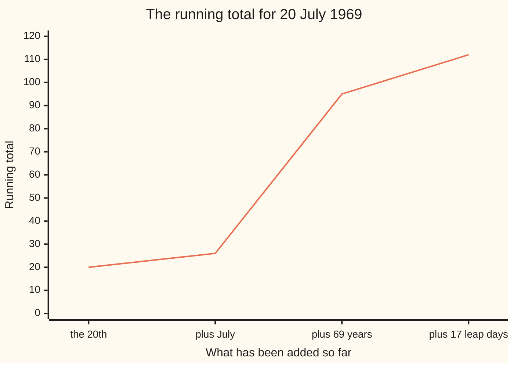

# Day of the week for any date: the calendar is arithmetic mod 7

[Syllabus](../../../SYLLABUS.md) → [Number theory](../README.md) → [Check Digits, Calendars and Cycles](../README.md#s05) → Day of the week for any date

---

## General Overview

Apollo 11 landed on 20 July 1969. What day of the week was that?

The calendar looks like a mess of 30s and 31s and one short month. Underneath it is one number: 7. Weeks never skip, so the question is only how far a date sits past a day you know.

Four numbers do it. For 20 July 1969: the **20** itself, **6** for July, **69** years since 1900, **17** leap days in those years. They add to 112: 16 weeks exactly, nothing over. A leftover of 0 means Sunday. Apollo 11 touched down on a Sunday.

**Every date carries four small numbers; add them, divide by 7, and the leftover names the day.**

### The picture: the four pieces stacking up



It stops at 112, a whole number of weeks.

---

## The formula

The date, written out:

**20 + 6 + 69 + 17 = 112, and 112 = 16 × 7 + 0, so 20 July 1969 was a Sunday**

**Read it aloud:** day of the month, plus month offset, plus years since 1900, plus leap days; throw the whole weeks away and read what is left.

The leftovers name the days: 0 Sunday, 1 Monday, 2 Tuesday, 3 Wednesday, 4 Thursday, 5 Friday, 6 Saturday.

| Piece | Plain meaning | For 20 July 1969 |
| --- | --- | --- |
| the day of the month | which day inside the month | 20 |
| the month's offset | how far its 1st sits past 1 January, whole weeks already thrown away | 6, for July |
| years since 1900 | one step a year | 69 |
| leap days since 1900 | one more step per 29 February gone | 17 |
| the leftover after dividing by 7 | 0 to 6, the answer | 0, Sunday |

The twelve month offsets, January to December: **0, 3, 3, 6, 1, 4, 6, 2, 5, 0, 3, 5**. In January or February of a leap year, take 1 back off: that 29 February has not happened yet.

Good from 1900 to 2099. A century year is a leap year only if it divides by 400 — 1900 was not, 2000 was — so in between, every fourth year is right.

---

## Why it works

### Step 0: only the leftover survives

You can throw 7 away whenever you like and keep what is left, 0 to 6 — congruence mod 7 ([Congruence](../03-Clock%20Arithmetic/01-congruence-mod-n.md)). It also lets the pieces be added in any order, each shrunk at any point ([Adding and multiplying on the clock](../03-Clock%20Arithmetic/02-modular-addition-and-multiplication.md)).

### Step 1: a year moves the calendar on one day, a 29 February one more

365 = 52 × 7 + 1 ([Division with a remainder](../01-Divisibility%20and%20Primes/04-division-with-remainder.md)), so 365 ≡ 1 (mod 7): the same date next year falls one day later in the week. A leap year is 366 days, and 366 ≡ 2 (mod 7) — one step for the year, one more for the 29 February. Count them apart: 1900 to 1969 is 69 steps, and the 29 Februaries, 1904 to 1968, are 69 ÷ 4, fraction dropped, so 17.

### Step 2: each month starts a fixed distance into the year

January's 1st is the anchor, offset 0. February's is 31 days later, and 31 ≡ 3 (mod 7), so 3. March's is 28 days on, and 28 ≡ 0 (mod 7), so 3 again. Walk the year out for the rest; July's is 6. That walk uses the short February, which is why January and February of a leap year need the step back.

### Step 3: one known day pins the rest

1 January 1900 was a Monday: 1 + 0 + 0 + 0 = 1. So leftover 1 is Monday, 0 is Sunday, and the rest follow.

<details>
<summary>The doomsday rule</summary>

Conway's version is the same arithmetic, different bookkeeping: each year has one day of the week, its "doomsday", shared by 4/4, 6/6, 8/8, 10/10 and 12/12. Find it, then step to your date.

</details>

A slower road lands on the same day: count the 25402 days from 1 January 1900 to the date and divide by 7, leaving 6. Six days past Monday is Sunday.

---

## Worked numbers, by hand

20 July 1969, one piece at a time.

| Step | Arithmetic | Value |
| --- | --- | --- |
| the day of the month | 20 | 20 |
| July's offset | 20 + 6 | 26 |
| years since 1900 | 26 + 69 | 95 |
| leap days, 69 ÷ 4 with the fraction dropped | 95 + 17 | 112 |
| throw away whole weeks | 112 − 16 × 7 | 0 |
| the leftover, as a day | 0 | **Sunday** |

### What breaks if you drop a piece

| Mistake | Comes out at | What went wrong |
| --- | --- | --- |
| Leaving out the 17 leap days | Thursday | Sum 95, leftover 4 |
| Leaving out July's offset | Monday | Sum 106: every month starting where January does |
| Counting 1904's leap day on 1 January 1904 | Saturday | That 29 February was two months off; the day is Friday |

The code prints all three.

---

## Code, from first principles, and it actually runs

Nothing is imported. The rule runs for 20 July 1969, then the long road counts every day since 1 January 1900. The two are compared across every month.

### Python

```python
# Day of the week -- the check behind the card.  Nothing is imported.  The rule is
# run for 20 July 1969, the Moon landing, then checked the long way, by counting
# every day since 1 January 1900, which was a Monday.
DAYS = ["Sunday", "Monday", "Tuesday", "Wednesday", "Thursday", "Friday", "Saturday"]
OFFSET = [0, 3, 3, 6, 1, 4, 6, 2, 5, 0, 3, 5]              # January to December
LENGTH = [31, 28, 31, 30, 31, 30, 31, 31, 30, 31, 30, 31]
def leap(year):                    # every fourth year, but a century year needs 400
    return year % 4 == 0 and (year % 100 != 0 or year % 400 == 0)
def weekday(day, month, year):     # 0 is Sunday; good from 1900 to 2099
    t = day + OFFSET[month - 1] + (year - 1900) + (year - 1900) // 4
    return (t - (1 if leap(year) and month <= 2 else 0)) % 7
def by_counting(day, month, year):  # the long road: every day since 1 January 1900
    n = day - 1 + sum(365 + (1 if leap(y) else 0) for y in range(1900, year))
    return n + sum(LENGTH[m - 1] + (1 if m == 2 and leap(year) else 0) for m in range(1, month))
for name, value in (("the day of the month", 20), ("July's offset", OFFSET[6]),
                    ("years since 1900", 1969 - 1900), ("leap days since 1900", 69 // 4)):
    print(f"{name:<30}{value:>5}")
sums = [20, 20 + OFFSET[6], 20 + OFFSET[6] + 69, 20 + OFFSET[6] + 69 + 17]
print("running sum, piece by piece:  " + ", ".join(str(s) for s in sums))
print(f"{sums[3]} = {sums[3] // 7} x 7 + {sums[3] % 7}, so 20 July 1969 was a {DAYS[weekday(20, 7, 1969)]}")
n = by_counting(20, 7, 1969)
print(f"the long road: {n} days on from Monday, {n} = {n // 7} x 7 + {n % 7}, a {DAYS[(1 + n) % 7]}")
print("1 January 1900 " + DAYS[weekday(1, 1, 1900)] + ", 1 January 1904 " + DAYS[weekday(1, 1, 1904)]
      + ", 6 September 2026 " + DAYS[weekday(6, 9, 2026)])
print(f"the three mistakes come out at {DAYS[(sums[3] - 17) % 7]}, {DAYS[(sums[3] - OFFSET[6]) % 7]} and {DAYS[(1 + 0 + 4 + 1) % 7]}")
assert weekday(20, 7, 1969) == (1 + n) % 7 == 0 and sums[3] == 112
assert all(weekday(d, m, y) == (1 + by_counting(d, m, y)) % 7 for y in (1900, 1904, 1943, 2000, 2026, 2099) for m in range(1, 13) for d in (1, 28))
assert n == 25402 and not leap(1900) and leap(2000)
print("ALL CHECKS PASS")
```

**Ran 2026-09-06 on macOS, Python 3.14.6, standard library only. All checks passed. Output, pasted from the run:**

```
the day of the month             20
July's offset                     6
years since 1900                 69
leap days since 1900             17
running sum, piece by piece:  20, 26, 95, 112
112 = 16 x 7 + 0, so 20 July 1969 was a Sunday
the long road: 25402 days on from Monday, 25402 = 3628 x 7 + 6, a Sunday
1 January 1900 Monday, 1 January 1904 Friday, 6 September 2026 Sunday
the three mistakes come out at Thursday, Monday and Saturday
ALL CHECKS PASS
```

### Rust

Same numbers, same labels, built with `rustc --edition 2021 -O`.

```rust
// Day of the week -- the same check as day_of_the_week_check.py, in Rust.  No crates.  The rule is
// run for 20 July 1969, then checked the long way, by counting every day since 1 January 1900.
const DAYS: [&str; 7] = ["Sunday", "Monday", "Tuesday", "Wednesday", "Thursday", "Friday", "Saturday"];
const OFFSET: [i64; 12] = [0, 3, 3, 6, 1, 4, 6, 2, 5, 0, 3, 5];              // January to December
const LENGTH: [i64; 12] = [31, 28, 31, 30, 31, 30, 31, 31, 30, 31, 30, 31];
fn leap(year: i64) -> bool {       // every fourth year, but a century year needs 400
    year % 4 == 0 && (year % 100 != 0 || year % 400 == 0)
}
fn weekday(day: i64, month: i64, year: i64) -> i64 {   // 0 is Sunday; good from 1900 to 2099
    let t = day + OFFSET[(month - 1) as usize] + (year - 1900) + (year - 1900) / 4;
    (t - if leap(year) && month <= 2 { 1 } else { 0 }) % 7
}
fn by_counting(day: i64, month: i64, year: i64) -> i64 {  // the long road: every day since 1900
    let mut n = day - 1;
    for y in 1900..year { n += 365 + if leap(y) { 1 } else { 0 }; }
    for m in 1..month { n += LENGTH[(m - 1) as usize] + if m == 2 && leap(year) { 1 } else { 0 }; }
    n
}
fn main() {
    for (name, value) in [("the day of the month", 20), ("July's offset", OFFSET[6]), ("years since 1900", 1969 - 1900), ("leap days since 1900", 69 / 4)] {
        println!("{:<30}{:>5}", name, value);
    }
    let sums = [20, 20 + OFFSET[6], 20 + OFFSET[6] + 69, 20 + OFFSET[6] + 69 + 17];
    let parts: Vec<String> = sums.iter().map(|s| s.to_string()).collect();
    println!("running sum, piece by piece:  {}", parts.join(", "));
    println!("{} = {} x 7 + {}, so 20 July 1969 was a {}", sums[3], sums[3] / 7, sums[3] % 7,
             DAYS[weekday(20, 7, 1969) as usize]);
    let n = by_counting(20, 7, 1969);
    println!("the long road: {} days on from Monday, {} = {} x 7 + {}, a {}", n, n, n / 7, n % 7,
             DAYS[((1 + n) % 7) as usize]);
    println!("1 January 1900 {}, 1 January 1904 {}, 6 September 2026 {}",
             DAYS[weekday(1, 1, 1900) as usize], DAYS[weekday(1, 1, 1904) as usize],
             DAYS[weekday(6, 9, 2026) as usize]);
    println!("the three mistakes come out at {}, {} and {}", DAYS[((sums[3] - 17) % 7) as usize],
             DAYS[((sums[3] - OFFSET[6]) % 7) as usize], DAYS[((1 + 0 + 4 + 1) % 7) as usize]);
    assert!(weekday(20, 7, 1969) == (1 + n) % 7 && (1 + n) % 7 == 0 && sums[3] == 112);
    for y in [1900, 1904, 1943, 2000, 2026, 2099] { for m in 1..=12 { for d in [1, 28] { assert!(weekday(d, m, y) == (1 + by_counting(d, m, y)) % 7); } } }
    assert!(n == 25402 && !leap(1900) && leap(2000));
    println!("ALL CHECKS PASS");
}
```

**Ran 2026-09-06 on macOS, rustc 1.98.1, no crates. All checks passed. Output, pasted from the run:**

```
the day of the month             20
July's offset                     6
years since 1900                 69
leap days since 1900             17
running sum, piece by piece:  20, 26, 95, 112
112 = 16 x 7 + 0, so 20 July 1969 was a Sunday
the long road: 25402 days on from Monday, 25402 = 3628 x 7 + 6, a Sunday
1 January 1900 Monday, 1 January 1904 Friday, 6 September 2026 Sunday
the three mistakes come out at Thursday, Monday and Saturday
ALL CHECKS PASS
```

The two outputs match line for line.

> [!TIP]
> **Try changing**
> Guess first, then run it; an assert will fire.
> - **Drop the step back.** Delete the `if leap(year) and month <= 2` correction: 1 January 1904 slides to Saturday.
> - **Flatten the offsets.** Set every entry of `OFFSET` to 0: the sum falls to 106, the landing reads Monday.

---

## The usual mistake

> [!warning]
> **Counting leap days up to the date instead of up to 1 January.** Dividing by 4 counts every 29 February up to and including this year's. In January or February that one has not happened yet, so take it back off. Skip that and 1 January 1904 comes out Saturday, not Friday.
>
> - Using the calendar year, 1969, instead of the years since 1900, 69.
> - Rounding 69 ÷ 4 up to 18: the fraction is dropped, not rounded.
> - Pushing past 2099. 2100 is not a leap year, but dividing by 4 counts it as one, so every date from 1 January 2100 comes out a day late.

---

## Where you meet it in real life

- **Deadlines.** "Ninety days from today" is not the same day of the week: 90 ≡ 6 (mod 7), so it lands one day earlier in the week.
- **Birthdays drifting.** One day a year, two across a leap year — the same 365 and 366 remainders, in [Division with a remainder](../01-Divisibility%20and%20Primes/04-division-with-remainder.md).
- **Remainder tricks at the till.** Throwing away the multiples also checks a barcode ([Barcode check digits](01-barcode-check-digit.md)) and an ISBN ([ISBN-10 and the prime modulus 11](02-isbn-check-digit.md)).

> **Say it back**
> A week is 7 days and never skips, so any date question is a leftover after dividing by 7. Add the day of the month, the month's offset, the years since 1900 and the leap days in those years; divide by 7 and read the leftover, 0 being Sunday. For 20 July 1969: 20 + 6 + 69 + 17 = 112, leftover 0, Sunday.

---

## What this builds on

- [Congruence](../03-Clock%20Arithmetic/01-congruence-mod-n.md): throwing 7 away and keeping the leftover, 0 to 6.
- [Division with a remainder](../01-Divisibility%20and%20Primes/04-division-with-remainder.md): 365 = 52 × 7 + 1 and 366 = 52 × 7 + 2, the facts the year steps rest on.
- [Adding and multiplying on the clock](../03-Clock%20Arithmetic/02-modular-addition-and-multiplication.md): why the pieces can be added in any order and shrunk mod 7 at any point.
- [Multiplying and dividing](../../01-Foundations/01-Everyday%20Arithmetic/03-multiplying-and-dividing.md): the 69 ÷ 4 with its fraction dropped, and the 16 × 7 taken off at the end.

## Where this goes next

Nothing depends on this card. The shelf goes on to [When cycles meet again](04-cycles-that-realign.md), where cycles of different lengths meet again, and [Perfect shuffles](05-perfect-shuffles.md), where the cycle is a deck of cards.

---

## Sources

Verified 6 Sep 2026: every link below resolves to the publisher's page.

- Zeller, Christian. "Kalender-Formeln." *Acta Mathematica*, volume 9, 1887, pp. 131–136. [doi:10.1007/BF02406733](https://doi.org/10.1007/BF02406733). The classic published weekday congruence, arranged differently.
- Reingold, Edward M., and Nachum Dershowitz. *Calendrical Calculations: The Ultimate Edition*, 4th ed. Cambridge University Press, 2018. [doi:10.1017/9781107415058](https://doi.org/10.1017/9781107415058). The careful version, for every calendar.
- United States Naval Observatory. *Introduction to Calendars*. [aa.usno.navy.mil](https://aa.usno.navy.mil/faq/calendars). Where the leap-year rule comes from.
