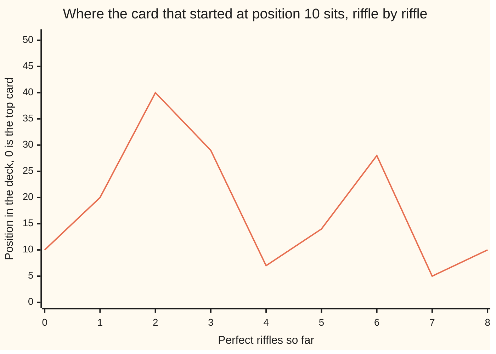

# Perfect shuffles: eight perfect riffles restore a 52-card deck, because doubling on a clock of 51 spots comes home in eight

[Syllabus](../../../SYLLABUS.md) → [Number theory](../README.md) → [Check Digits, Calendars and Cycles](../README.md#s05) → Perfect shuffles

---

## General Overview

Take a sealed deck of 52. Cut it into halves of 26 and riffle them so the cards fall strictly alternating, one from each hand, top card still on top. That is a perfect riffle, or out-shuffle: the outside cards stay outside. Eight of them and the deck is back in factory order.

Number the positions 0 to 51, top down. The card at position 10 goes to 20, then 40, 29, 7, 14, 28, 5, and the eighth riffle returns it to 10. Each riffle doubles the position, and 51 comes off when the doubling reaches it: 40 doubled is 80, less 51 is 29.

**A perfect riffle doubles a card's position on a clock of 51 spots, and eight doublings bring every position home.**

### The picture: one round trip



Doubling, dropping by 51, doubling again, home on the eighth. Every card rides its own version.

---

## The formula

One rule, on a clock of 51 spots, 0 to 50:

**new position = old position doubled, then keep taking 51s off until it is under 51 — and the bottom card, position 51, never moves.**

**Read it aloud:** double where the card is, then take 51s off until it is under 51.

| Piece | Plain meaning | In our example |
| --- | --- | --- |
| a position | where a card sits, top card is 0 | 10 |
| the 51-clock | keep taking 51s off until under 51 | 80 − 51 = 29 |
| the fixed cards | positions 0 and 51 never move | top, bottom |
| the order of 2 | fewest doublings bringing 1 back to 1 | 8 |

That last row is what this card turns on: [The order of a number and primitive roots](../04-Powers%20on%20the%20Clock/05-order-and-primitive-roots.md).

---

## Why it works

### Step 0: the riffle is a rule about seats

A perfect riffle does the same thing every time, whatever deck you hand it: position 10 always empties into position 20. So follow one seat; the deck is home when every seat has been round a loop.

### Step 1: both halves double

The card at position 10 has 10 cards above it, all from the top half. Riffle, and each gets a partner beside it: twenty above, so position 20. That argument never used the 10.

The bottom half doubles as well, once 51 comes off. Position 26, first of that half, falls second from the top, into position 1 — and doubling says 52, less 51 is 1. Position 40 falls into 29, and 80 − 51 = 29.

### Step 2: two cards never move

Position 0 has nothing above it before or after, so it stays, and doubling agrees: 0 doubled is 0. Position 51 falls last and stays too, but doubling disagrees — 102 is two whole 51s, which the clock reads as 0. That is the seam: 51 spots for 52 seats, both end cards parked on the clock's 0. Neither moves, so it costs nothing.

### Step 3: eight brings the deck home

Follow seat 1 on the 51-clock: 2, 4, 8, 16, 32, then 64, which is 51 + 13, so 13, then 26, then 52, which is 51 + 1, so 1. Home in eight.

That is multiplying by 256, and 256 = 5 × 51 + 1, which the clock reads as a multiplier of 1. Eight riffles therefore send seat 10 to 10 × 1, and every seat likewise. Seven leave seat 1 short, and 50 cards out of place.

<details>
<summary>The other perfect shuffle, and why nobody performs it</summary>

Riffle so the top card gets buried and you have the in-shuffle: the same rule on a clock of 53, once the seats are numbered 1 to 52. There, 1 needs 52 doublings — useless for resetting a deck. That 52 is its use instead: write a seat number in binary, in-shuffle on each 1 and out-shuffle on each 0, and the top card lands there.

</details>

Or skip the arithmetic: riffle a real deck until it is in order — the second road below. Landing a card after many riffles without doing them one by one is [Powers on the clock](../04-Powers%20on%20the%20Clock/01-modular-exponentiation.md).

---

## Worked numbers, by hand

Position 10's card, riffle by riffle.

| Riffle | Arithmetic | Value |
| --- | --- | --- |
| 1 | 10 doubled | 20 |
| 2 | 20 doubled | 40 |
| 3 | 40 doubled is 80, − 51 | 29 |
| 4 | 29 doubled is 58, − 51 | 7 |
| 5 | 7 doubled | 14 |
| 6 | 14 doubled | 28 |
| 7 | 28 doubled is 56, − 51 | 5 |
| 8 | 5 doubled | **10** |

Those eight riffles reset all 52 seats at once. Any even deck runs the same way, on a clock one spot smaller: a deck of 8 comes home after 3 riffles, a deck of 10 after 6, 52 after 8, 64 after 6. The bigger deck finishing sooner says the count is not about size.

### What breaks if you drop a piece

| Mistake | Number you get | What went wrong |
| --- | --- | --- |
| Using the deck size, 52, as the clock | position 12 | position 10 lands there after eight riffles, never home |
| Stopping after seven riffles | 50 cards | still out of place |
| Burying the top card, an in-shuffle | 52 riffles | that shuffle needs 52 |

---

## Code, from first principles, and it actually runs

Nothing is imported. The trip is doubled out on the 51-clock, then checked by a road that never divides: cut a real list in half, interleave, count riffles until it is in order.

### Python

```python
# Perfect shuffles -- the check behind the card.  Nothing is imported.  A deck
# of 52, positions 0 to 51.  One perfect out-riffle doubles a position on the
# 51-clock; 0 and 51 never move.  Two roads: the doubling, and a real riffle.
def moved(p, n, times=1):            # where the card at position p sits after some riffles
    for _ in range(times): p = p if p == n - 1 else (2 * p) % (n - 1)
    return p
def riffle(deck, inn=0):             # cut the deck in half and interleave the two halves
    half = len(deck) // 2
    top, bot = (deck[half:], deck[:half]) if inn else (deck[:half], deck[half:])
    return [c for pair in zip(top, bot) for c in pair]
def by_riffling(n, inn=0):           # riffle a real deck, counting until it is back in order
    home, deck, count = list(range(n)), list(range(n)), 0
    while count == 0 or deck != home: deck, count = riffle(deck, inn), count + 1
    return count
def by_doubling(n): return min(t for t in range(1, 999) if moved(1, n, t) == 1)
def row(name, *vals): print(f"{name:<42}" + "".join(f"{v:>4}" for v in vals))
row("one perfect riffle sends position 10 to", moved(10, 52))
row("all 52 home: by doubling, by real riffles", by_doubling(52), by_riffling(52))
row("1 doubled eight times, 256 = 5 x 51 + 1", 2 ** 8)
row("after seven riffles, cards out of place", sum(1 for p in range(52) if moved(p, 52, 7) != p))
row("on a 52-clock, position 10 after eight", (10 * 2 ** 8) % 52)
row("in-shuffles, on a 53-clock, come home in", by_riffling(52, 1))
row("cards that never move: positions", *[p for p in range(52) if moved(p, 52) == p])
row("the trip home from 10", *[moved(10, 52, t) for t in range(9)])
row("1 doubled on the 51-clock", *[moved(1, 52, t) for t in range(1, 9)])
row("decks of 8, 10, 52, 64 come home after", *[by_doubling(n) for n in (8, 10, 52, 64)])
assert [moved(10, 52, t) for t in range(9)] == [10, 20, 40, 29, 7, 14, 28, 5, 10]
assert by_doubling(52) == 8 == by_riffling(52) and 2 ** 8 == 5 * 51 + 1 and by_riffling(52, 1) == 52
assert [by_doubling(n) for n in (8, 10, 52, 64)] == [3, 6, 8, 6] and all(moved(p, 52, 8) == p for p in range(52))
print("ALL CHECKS PASS")
```

**Ran 2026-09-06 on macOS, Python 3.14.6, standard library only. All checks passed. Output, pasted from the run:**

```
one perfect riffle sends position 10 to     20
all 52 home: by doubling, by real riffles    8   8
1 doubled eight times, 256 = 5 x 51 + 1    256
after seven riffles, cards out of place     50
on a 52-clock, position 10 after eight      12
in-shuffles, on a 53-clock, come home in    52
cards that never move: positions             0  51
the trip home from 10                       10  20  40  29   7  14  28   5  10
1 doubled on the 51-clock                    2   4   8  16  32  13  26   1
decks of 8, 10, 52, 64 come home after       3   6   8   6
ALL CHECKS PASS
```

### Rust

Same labels and numbers; `rustc --edition 2021 -O`.

```rust
// Perfect shuffles -- the same check as perfect_shuffles_check.py, in Rust.  No
// crates.  A deck of 52, positions 0 to 51.  One perfect out-riffle doubles a
// position on the 51-clock; 0 and 51 never move.  Doubling, then a real riffle.
fn moved(mut p: i64, n: i64, times: i64) -> i64 {   // where the card at p sits after riffles
    for _ in 0..times { p = if p == n - 1 { p } else { (2 * p) % (n - 1) }; }
    p
}
fn riffle(deck: &[i64], inn: bool) -> Vec<i64> {          // cut in half, interleave the halves
    let half = deck.len() / 2;
    let (top, bot) = if inn { (&deck[half..], &deck[..half]) } else { (&deck[..half], &deck[half..]) };
    top.iter().zip(bot.iter()).flat_map(|(a, b)| [*a, *b]).collect()
}
fn by_riffling(n: i64, inn: bool) -> i64 {      // riffle a real deck until it is back in order
    let home: Vec<i64> = (0..n).collect();
    let (mut deck, mut count) = (home.clone(), 0i64);
    while count == 0 || deck != home { deck = riffle(&deck, inn); count += 1; }
    count
}
fn by_doubling(n: i64) -> i64 { (1..999).find(|&t| moved(1, n, t) == 1).unwrap() }
fn row(name: &str, vals: &[i64]) {
    println!("{:<42}{}", name, vals.iter().map(|v| format!("{:>4}", v)).collect::<Vec<String>>().join(""));
}
fn main() {
    let trip: Vec<i64> = (0..9).map(|t| moved(10, 52, t)).collect();
    let sizes: Vec<i64> = [8, 10, 52, 64].iter().map(|&n| by_doubling(n)).collect();
    row("one perfect riffle sends position 10 to", &[moved(10, 52, 1)]);
    row("all 52 home: by doubling, by real riffles", &[by_doubling(52), by_riffling(52, false)]);
    row("1 doubled eight times, 256 = 5 x 51 + 1", &[2i64.pow(8)]);
    row("after seven riffles, cards out of place", &[(0..52).filter(|&p| moved(p, 52, 7) != p).count() as i64]);
    row("on a 52-clock, position 10 after eight", &[(10 * 2i64.pow(8)) % 52]);
    row("in-shuffles, on a 53-clock, come home in", &[by_riffling(52, true)]);
    row("cards that never move: positions", &(0..52).filter(|&p| moved(p, 52, 1) == p).collect::<Vec<i64>>());
    row("the trip home from 10", &trip);
    row("1 doubled on the 51-clock", &(1..9).map(|t| moved(1, 52, t)).collect::<Vec<i64>>());
    row("decks of 8, 10, 52, 64 come home after", &sizes);
    assert!(trip == vec![10, 20, 40, 29, 7, 14, 28, 5, 10]);
    assert!(by_doubling(52) == 8 && by_riffling(52, false) == 8 && 2i64.pow(8) == 5 * 51 + 1 && by_riffling(52, true) == 52);
    assert!(sizes == vec![3, 6, 8, 6] && (0..52).all(|p| moved(p, 52, 8) == p));
    println!("ALL CHECKS PASS");
}
```

**Ran 2026-09-06 on macOS, rustc 1.98.1, no crates. All checks passed. Output, pasted from the run:**

```
one perfect riffle sends position 10 to     20
all 52 home: by doubling, by real riffles    8   8
1 doubled eight times, 256 = 5 x 51 + 1    256
after seven riffles, cards out of place     50
on a 52-clock, position 10 after eight      12
in-shuffles, on a 53-clock, come home in    52
cards that never move: positions             0  51
the trip home from 10                       10  20  40  29   7  14  28   5  10
1 doubled on the 51-clock                    2   4   8  16  32  13  26   1
decks of 8, 10, 52, 64 come home after       3   6   8   6
ALL CHECKS PASS
```

The two outputs match line for line: whole seats, nothing to round.

> [!TIP]
> **Try changing**
> Guess first, then run. Watch the count on the line you changed.
> - **Riffle the other way.** Pass 1 as the second argument to the real-deck road, burying the top card: 8 becomes 52.
> - **Change the deck size.** Ask the doubling road for 64: home in 6.

---

## The usual mistake

> [!warning]
> **A perfect shuffle does not shuffle.** It is a fixed rearrangement, identical every time; eight of them undo themselves. What mixes a deck is the sloppiness: the better your riffle, the less mixed the deck.
>
> - Using the deck size as the clock. Doubling on a 52-clock puts position 10 at 12 after eight riffles, and it never comes home.
> - Expecting the end cards to travel. Positions 0 and 51 sit still: hence 51 spots for 52 seats.
> - Stopping early. Seven riffles leave 50 cards adrift, one riffle from order.

---

## Where you meet it in real life

- **Card magic.** A performer with a perfect riffle hands you a deck "shuffled" eight times, in its opening order — the count is the secret, not the sleight.
- **Casinos.** Shuffling machines are built against this: one that interleaves too cleanly is predictable, so good ones drop uneven clumps.
- **Wiring.** Data crossing a parallel machine follows this pattern: each stage doubles an address.

> **Say it back**
> A perfect out-shuffle doubles a seat number, top card counted as 0, on a clock of 51 spots; the end cards never move. Follow seat 1: 2, 4, 8, 16, 32, 13, 26, 1 — home in eight, because 256 is 5 × 51 + 1. Eight riffles reset every card; seven reset almost none.

---

## What this builds on

- [The order of a number and primitive roots](../04-Powers%20on%20the%20Clock/05-order-and-primitive-roots.md): the count this card runs on, the fewest doublings bringing 1 back to 1. Here, 8.
- [Powers on the clock](../04-Powers%20on%20the%20Clock/01-modular-exponentiation.md): where a card sits after many riffles, without doing them one by one.

## Where this goes next

Nothing follows on the shelf. Its neighbours run this arithmetic on other clocks:

- [Barcode check digits](01-barcode-check-digit.md) and [ISBN-10 and the prime modulus 11](02-isbn-check-digit.md): a last digit chosen so a total lands on a fixed spot, on a clock of ten and a prime-sized one.
- [Day of the week for any date](03-day-of-the-week.md) and [When cycles meet again](04-cycles-that-realign.md): the calendar on a clock of seven, and two clocks at once.

---

## Sources

Verified 6 Sep 2026: every link below resolves.

- Diaconis, Persi, R. L. Graham and William M. Kantor. "The mathematics of perfect shuffles." *Advances in Applied Mathematics* 4 (1983): 175–196. [doi:10.1016/0196-8858(83)90009-X](https://doi.org/10.1016/0196-8858(83)90009-X). The doubling rule and both counts.
- Diaconis, Persi and Ron Graham. *Magical Mathematics*. Princeton, 2011. [Publisher page](https://press.princeton.edu/books/paperback/9780691169774/magical-mathematics). For the card table.
- Shoup, Victor. *A Computational Introduction to Number Theory and Algebra*. Cambridge University Press, 2009. [Author's full text](https://www.shoup.net/ntb/). Chapter 2, the count in general.
