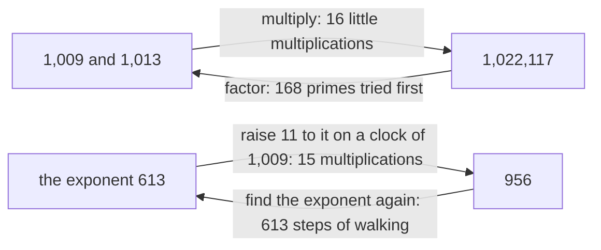

# One-way streets: multiplying two primes and raising to a power on the clock are easy, and undoing them is slow

[Syllabus](../../../SYLLABUS.md) → [Number theory](../../../SYLLABUS.md#w02) → [Codes and Secrets](../../../SYLLABUS.md#w02-s06) → One-way streets

---

## General Overview

Multiply 1,009 by 1,013. Four digits by four digits: sixteen little multiplications and a column of adding, about a minute on paper. It comes to 1,022,117.

Now the other way. Someone hands you 1,022,117 and says it is two primes multiplied — a **prime** being a number nothing divides but itself and 1 ([Primes and composites](../01-Divisibility%20and%20Primes/05-primes-and-composites.md)). Which two? There is no cheap way back: you try 2, then 3, then 5, on up. 1,009 is the 169th prime, so 168 tries fail first.

A minute out, an afternoon back, by hand; by machine, both under a second. Give each prime a few hundred digits: the way out is still under a second, the way back a research project. A 240-digit number came apart in 2020, after centuries of processor time.

There is a second street. Multiply 11 by itself 613 times on a **clock** of 1,009: each time the total passes 1,009, drop a whole clock and keep the rest ([Congruence](../03-Clock%20Arithmetic/01-congruence-mod-n.md)). It lands on 956 — fifteen multiplications, done cleverly. Backwards: 956 is 11 multiplied by itself how many times? The clock threw the size away. You walk: 11, 121, 322, and on, 613 steps.

Call it a one-way street to picture it. The real name is a **one-way function**: quick to do, slow to undo. Both are used: Diffie-Hellman rests on the clock, RSA on the primes.

**Every code on this shelf is a bet that some job is cheap in one direction and hopeless in the other.**

### The picture



Top row, factoring; bottom row, the clock.

---

## The formula

Two pairs of jobs: one easy, its undoing not.

**Easy: 1,009 × 1,013 = 1,022,117.  Hard: which two primes make 1,022,117?**

**Easy: 613 elevens on a clock of 1,009 land on 956.  Hard: 956 is 11 raised to what?**

**Read it aloud: going forward is arithmetic, coming back is a search.**

| Piece | Plain meaning | Here |
| --- | --- | --- |
| a prime | a number nothing divides but itself and 1 | 1,009 and 1,013 |
| the product | the two primes multiplied out | 1,022,117 |
| factoring | pulling the primes back out | 168 tries and counting |
| the clock | the size the count wraps at ([Congruence](../03-Clock%20Arithmetic/01-congruence-mod-n.md)) | 1,009 |
| raising to a power on the clock | multiply by 11, take off whole clocks | 613 times, landing on 956 |
| the discrete logarithm | the exponent found again from where it landed | 613 |

---

## Why it works

### Step 0: doing is a recipe, undoing is a hunt

Multiplying is a procedure: the work is fixed before you start, and you know when you are done. Factoring has methods too — one took that 240-digit number apart — but every one is a search, and searching is the expensive kind of work. That 2 fails tells you nothing about 3. A recipe against a hunt.

### Step 1: the hunt is long, and lengthens faster than the number grows

You only need primes up to the square root of 1,022,117, a shade over 1,010: past that, the other factor would be the smaller one, already found. That still leaves 168 failures. Extra digits do not add to the hunt, they multiply it ([Linear versus exponential growth](../../01-Foundations/03-Powers%2C%20Roots%20and%20Logarithms/02-linear-vs-exponential-growth.md)).

### Step 2: the clock throws away the size

Off the clock, 11 raised to a power grows steadily: bigger exponent, bigger answer. Read the exponent back off the size and you have done a logarithm ([Logarithms](../../01-Foundations/03-Powers%2C%20Roots%20and%20Logarithms/05-logarithms.md)).

On a clock of 1,009 the answer wraps every time it passes 1,009, and the size is gone. For all you can tell from looking at 956, it is the 2nd step or the 613th. Nothing steers you, so the only move left is to try exponents. The exponent you are hunting has a real name: the **discrete logarithm**, discrete because it is counted in whole steps.

11 is a **primitive root** of 1,009: its powers visit all 1,008 non-zero slots, each once ([The order of a number and primitive roots](../04-Powers%20on%20the%20Clock/05-order-and-primitive-roots.md)). So the exponent is unique.

### Step 3: fast up, slow down

Going up is not 613 multiplications. Square 11 for the 2nd power, square that for the 4th, multiply the pieces you need ([Powers on the clock](../04-Powers%20on%20the%20Clock/01-modular-exponentiation.md)): 15. Coming back, one multiply at a time, takes 613. Cleverer searches exist; they cut the count without closing the gap.

---

## Worked numbers, by hand

| Step | Arithmetic | Value |
| --- | --- | --- |
| multiply the two primes | 1,009 × 1,013 | 1,022,117 |
| what that cost | 4 × 4 | 16 |
| factor it back: primes that fail | 2, 3, 5, … up to 997 | 168 |
| the one that lands | 1,022,117 ÷ 1,009 | 1,013 |
| up the clock the fast way | squarings and multiplies | 15 |
| where 11 lands | 613 elevens on the clock | **956** |
| back down, walking | multiplies until 956 appears | **613** |

Sixteen against 168, fifteen against 613.

### What breaks if you drop a piece

| Mistake | Comes out at | What went wrong |
| --- | --- | --- |
| Trial dividing only up to 100 | 0 factors | 1,022,117 looks prime, and is not |
| Pricing the way back like the way out | 16 | Two different jobs |
| Undoing the power by dividing on the clock | 729 | Dividing undoes multiplying, not powers |

---

## Code, from first principles, and it actually runs

Nothing is imported. Both easy jobs are done the plain way, then undone by search.

### Python

```python
# One-way streets -- the check behind the card.  Nothing is imported.  Two easy
# jobs: 1,009 x 1,013 on paper, and 11 raised to the 613 on a clock of 1,009.
# Then both jobs backwards, counting what the way back costs.
A, B, BASE, SECRET, CLOCK = 1009, 1013, 11, 613, 1009
def row(name, value):
    print(f"{name:<40}{value:>9}")
n = A * B
row("1,009 x 1,013, the easy way", n)
row("digit by digit, that is 4 x 4", 4 * 4)
primes = [i for i in range(2, 1011) if all(i % d for d in range(2, i))]  # up to the square root of n
tries = next(i for i, p in enumerate(primes) if n % p == 0)              # trial division, the slow road back
row("primes tried before 1,009 turns up", tries)
row("the check, going back: 1022117 / 1009", n // primes[tries])
fast, steps = 1, 0
for bit in bin(SECRET)[2:]:                     # square and multiply; the first squaring, of 1, is free
    fast, steps = fast * fast % CLOCK, steps + 1
    if bit == "1": fast, steps = fast * BASE % CLOCK, steps + 1
slow, back = 1, 0
while slow != fast:                             # walking, one multiply at a time
    slow, back = slow * BASE % CLOCK, back + 1
row("11 to the 613 on a clock of 1,009", fast)
row("squarings and multiplies that took", steps)
row("walking one multiply at a time, steps", back)
inv = next(k for k in range(CLOCK) if BASE * k % CLOCK == 1)
stop100 = sum(1 for p in primes if p < 100 and n % p == 0)   # trial division stopped at 100
print(f"the three mistakes come out at {stop100}, {4 * 4} and {fast * inv % CLOCK}")
assert n == 1022117 and primes[tries] == A and n // primes[tries] == B
assert tries == 168 and all(n % p for p in primes[:tries]) and inv == 367 and stop100 == 0
assert fast == 956 and slow == fast and back == SECRET and fast * inv % CLOCK == 729
print("ALL CHECKS PASS")
```

**Ran 2026-09-06 on macOS, Python 3.14.6, standard library only. All checks passed. Output, pasted from the run:**

```
1,009 x 1,013, the easy way               1022117
digit by digit, that is 4 x 4                  16
primes tried before 1,009 turns up            168
the check, going back: 1022117 / 1009        1013
11 to the 613 on a clock of 1,009             956
squarings and multiplies that took             15
walking one multiply at a time, steps         613
the three mistakes come out at 0, 16 and 729
ALL CHECKS PASS
```

### Rust

Same numbers and labels, built with `rustc --edition 2021 -O`.

```rust
// One-way streets -- the same check as the Python twin, in Rust.  No crates.
// Two easy jobs: 1,009 x 1,013 on paper, and 11 raised to the 613 on a clock
// of 1,009.  Then both jobs backwards, counting what the way back costs.
const A: i64 = 1009;
const B: i64 = 1013;
const BASE: i64 = 11;
const SECRET: i64 = 613;
const CLOCK: i64 = 1009;
fn row(name: &str, value: i64) { println!("{:<40}{:>9}", name, value); }
fn main() {
    let n = A * B;
    row("1,009 x 1,013, the easy way", n);
    row("digit by digit, that is 4 x 4", 4 * 4);
    let primes: Vec<i64> = (2..1011).filter(|&i| (2..i).all(|d| i % d != 0)).collect();  // up to the square root of n
    let tries = primes.iter().position(|&p| n % p == 0).unwrap();                        // trial division, the slow road back
    row("primes tried before 1,009 turns up", tries as i64);
    row("the check, going back: 1022117 / 1009", n / primes[tries]);
    let (mut fast, mut steps) = (1i64, 0i64);
    let top = 63 - (SECRET as u64).leading_zeros() as i64;
    for i in (0..=top).rev() {                      // square and multiply; the first squaring, of 1, is free
        fast = fast * fast % CLOCK; steps += 1;
        if (SECRET >> i) & 1 == 1 { fast = fast * BASE % CLOCK; steps += 1; }
    }
    let (mut slow, mut back) = (1i64, 0i64);
    while slow != fast { slow = slow * BASE % CLOCK; back += 1; }   // walking, one multiply at a time
    row("11 to the 613 on a clock of 1,009", fast);
    row("squarings and multiplies that took", steps);
    row("walking one multiply at a time, steps", back);
    let inv = (0..CLOCK).find(|k| BASE * k % CLOCK == 1).unwrap();
    let stop100 = primes.iter().filter(|&&p| p < 100 && n % p == 0).count();   // trial division stopped at 100
    println!("the three mistakes come out at {}, {} and {}", stop100, 4 * 4, fast * inv % CLOCK);
    assert!(n == 1022117 && primes[tries] == A && n / primes[tries] == B);
    assert!(tries == 168 && primes[..tries].iter().all(|p| n % p != 0) && inv == 367 && stop100 == 0);
    assert!(fast == 956 && slow == fast && back == SECRET && fast * inv % CLOCK == 729);
    println!("ALL CHECKS PASS");
}
```

**Ran 2026-09-06 on macOS, rustc 1.98.1, no crates. All checks passed. Output, pasted from the run:**

```
1,009 x 1,013, the easy way               1022117
digit by digit, that is 4 x 4                  16
primes tried before 1,009 turns up            168
the check, going back: 1022117 / 1009        1013
11 to the 613 on a clock of 1,009             956
squarings and multiplies that took             15
walking one multiply at a time, steps         613
the three mistakes come out at 0, 16 and 729
ALL CHECKS PASS
```

> [!TIP]
> **Try changing**
> Guess first. The asserts are pinned to the house numbers, so one will fire.
> - **Make the secret 614.** One step further round: it lands on 426, and the walk costs 614.
> - **Set the clock to 1,013.** The power lands on 969, and the walk finds it in fifteen steps, not 613: there 11's powers reach only 46 slots, so the exponent is no longer unique. A short walk is a broken lock.

---

## The usual mistake

> [!warning]
> **Thinking a slow job is a broken job.** Factoring is not impossible: trial division on 1,022,117 finishes in under a second. A code is a bet on how long, and every bet has a date on it — a working quantum machine already has a factoring method waiting.
>
> - **Reading "hard" as "nobody has tried".** People have tried for centuries; what is missing is a shortcut.
> - **Assuming the clock is the hard part.** Multiplying on a clock is cheaply undoable ([The modular inverse](../03-Clock%20Arithmetic/04-modular-inverse.md)); raising to a power is not.
> - **Picking small numbers to be safe.** 168 tries is under a second by machine.

---

## Where you meet it in real life

- **Agreeing a secret out loud.** Two strangers trade numbers over an open line and end up sharing one no listener can compute: [Diffie-Hellman key exchange](02-diffie-hellman.md).
- **The padlock on a web address.** The public key is a product like 1,022,117 but far bigger; the private key is its two primes: [RSA in outline](03-rsa-in-outline.md).
- **Stored passwords.** A site keeps what your password turns into, never the password.

> **Say it back**
> Some jobs are cheap to do and dear to undo. 1,009 × 1,013 is sixteen little multiplications; getting 1,009 back out takes 168 failed tries first. 11 to the 613 on a clock of 1,009 is fifteen multiplications, landing on 956; finding the 613 again means walking all 613 steps, because the clock threw away the size. Neither is impossible; both are slow, and slow is the whole secret.

---

## What this builds on

- [Primes and composites](../01-Divisibility%20and%20Primes/05-primes-and-composites.md): what a prime is.
- [Congruence](../03-Clock%20Arithmetic/01-congruence-mod-n.md): the clock, and taking whole clocks off.
- [Powers on the clock](../04-Powers%20on%20the%20Clock/01-modular-exponentiation.md): 15 steps instead of 613.
- [The order of a number and primitive roots](../04-Powers%20on%20the%20Clock/05-order-and-primitive-roots.md): why 11 visits all 1,008 slots.
- [Linear versus exponential growth](../../01-Foundations/03-Powers%2C%20Roots%20and%20Logarithms/02-linear-vs-exponential-growth.md): a cost that doubles against one that squares.

## Where this goes next

- [Diffie-Hellman key exchange](02-diffie-hellman.md): the hard direction turned into a shared secret.
- [RSA in outline](03-rsa-in-outline.md): the same trick with factoring, plus locking and unlocking.

---

## Sources

Verified 6 Sep 2026: every link resolves.

- Diffie, Whitfield, and Martin E. Hellman. "New Directions in Cryptography." *IEEE Transactions on Information Theory* 22, no. 6 (1976): 644–654. [doi:10.1109/TIT.1976.1055638](https://doi.org/10.1109/TIT.1976.1055638). Where the one-way idea began.
- Boudot, Fabrice, Pierrick Gaudry, Aurore Guillevic, Nadia Heninger, Emmanuel Thomé and Paul Zimmermann. "Comparing the difficulty of factorization and discrete logarithm: a 240-digit experiment." Cryptology ePrint Archive, paper 2020/697. [eprint.iacr.org/2020/697](https://eprint.iacr.org/2020/697). The 2020 record run.
- Shoup, Victor. *A Computational Introduction to Number Theory and Algebra*, 2nd ed. Cambridge University Press, 2008. [Full text](https://shoup.net/ntb/). Chapter 11, both directions in full.
