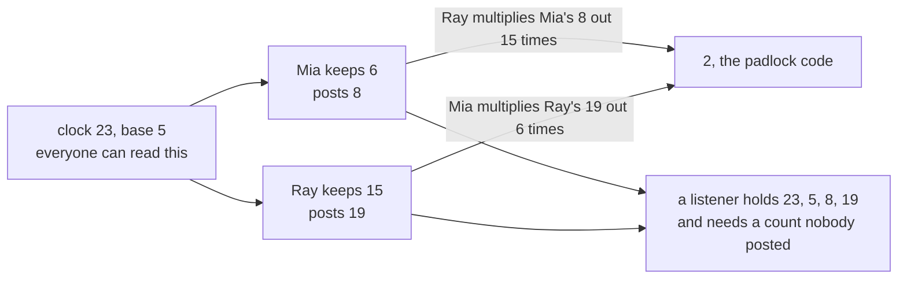

# Diffie-Hellman key exchange: two strangers agree a secret over an open line using powers on a clock

Number theory → Codes and Secrets → Shared secrets → Diffie-Hellman key exchange

---

## General Overview

Mia and Ray share a shed. The padlock takes a number. Their only channel is a group chat with eleven other people: every word they type, everyone reads.

Paint first. Both start from the same tin of yellow, in plain sight. Mia stirs in her blue, Ray his red, and both jars go on the table. Each then stirs their colour into the other's jar. The jars match; a watcher who copied both cannot unmix them.

From here the paint is a number. The yellow is the **base**, where everyone starts. Stirring is multiplying on a clock: multiply, then take off whole rounds of a fixed size. On a 23 clock, 5 × 5 = 25, one 23 off, reads as 2 ([congruence-mod-n](../03-Clock%20Arithmetic/01-congruence-mod-n.md), [modular-addition-and-multiplication](../03-Clock%20Arithmetic/02-modular-addition-and-multiplication.md), [modular-exponentiation](../04-Powers%20on%20the%20Clock/01-modular-exponentiation.md)). Lifting a colour out is the **discrete logarithm** — given the answer, find how many times the base went in ([one-way-streets](01-one-way-streets.md)). Everyone writes the whole exchange **DH**.

The chat sees clock size 23 and base 5. Mia keeps the count 6 and posts 8, Ray keeps 15 and posts 19. Both arrive at 2, which never crossed the line.

**Multiply the base into itself Mia's 6 times and then Ray's 15 times, and it lands where the other order lands: two strangers reach a number the open line never carried.**

### The picture



---

## The formula

"Multiplied out 6 times" means six 5s multiplied together.

**5 multiplied out 6 times, then that answer multiplied out 15 times, is 5 multiplied out 90 times.**

On the 23 clock, whole 23s dropped as you go, both routes land on the shed code:

**19 multiplied out 6 times is 2. So is 8 multiplied out 15 times.**

**Read it aloud: both end up multiplying 5 into itself ninety times, so both land on the same number.**

| Piece | Plain meaning | In the group chat |
| --- | --- | --- |
| the clock size | where counting wraps | 23 |
| the base | what everyone starts multiplying | 5 |
| a kept count | how many times you multiply it in, told to nobody | Mia's 6, Ray's 15 |
| a posted number | the base, multiplied out your count | Mia's 8, Ray's 19 |
| the shared number | their posted number, multiplied out your count | 2 |
| the discrete logarithm | the count behind a posted number | 6, behind 8 |

---

## Why it works

### Step 0: a product does not care how you group it

Mia's posting is six 5s multiplied together. Ray multiplies it out fifteen times: fifteen copies of six 5s, ninety 5s in a row. Ray's posting is fifteen 5s; Mia multiplies it out six times, ninety 5s again. Same pile, different order.

Neither multiplies ninety 5s out in full. They drop whole 23s as they go, and a clock keeps only the remainder ([modular-addition-and-multiplication](../03-Clock%20Arithmetic/02-modular-addition-and-multiplication.md)), so two stacks of one pile land on one slot: 2.

### Step 1: the line carries answers, never counts

Everything posted is an answer: 23, 5, 8, 19. Neither count was typed. To copy Mia a listener needs 6, the count behind 8: pulling a count out of an answer is the discrete logarithm, the slow direction ([one-way-streets](01-one-way-streets.md)).

### Step 2: at clock 23 the listener wins

There are 22 counts to try, and the code below finds 6 instantly: these numbers are small so you can follow them, not to hide anything. The gap widens with the clock: multiplying out stays cheap, working backwards does not. Base 5 earns its place too — its powers tour all 22 non-zero slots before repeating, base 2 only 11 ([order-and-primitive-roots](../04-Powers%20on%20the%20Clock/05-order-and-primitive-roots.md)).

<details>
<summary>What this card leaves out</summary>

Real exchanges use a clock hundreds of digits wide: RFC 3526 (2003) publishes standard primes from 1536 bits up, about 460 digits. The shared number is normally hashed into a key, not used raw.

</details>

---

## Worked numbers, by hand

Clock 23 and base 5, out loud.

| Step | Arithmetic | Value |
| --- | --- | --- |
| Mia multiplies out her 6 | 15625 = 679 × 23 + 8 | 8 |
| Ray multiplies out his 15 | 30517578125 = 1326851222 × 23 + 19 | 19 |
| Mia multiplies Ray's 19 out 6 times, Ray Mia's 8 out 15 times | 47045881 = 2045473 × 23 + 2 | **2** |
| either way, one pile | ninety 5s, on the 23 clock | **2** |
| the listener's job | every count 1 to 22, against 8 | 6 |

The padlock is set to 2, agreed in front of eleven readers.

### What breaks if you drop a piece

| Mistake | Comes out at | What went wrong |
| --- | --- | --- |
| Posting your count, not your answer | 2, in the open | The count is the only secret |
| Stirring the postings, 8 × 19 | 14 | Two public answers make a public answer |
| Running it on base 2 | 4 | It agrees, but 2 reaches 11 of 22 slots |

---

## Code, from first principles, and it actually runs

Nothing is imported. The exchange runs the plain way, one multiplication at a time. Square-and-multiply is a second road to the same three numbers, ninety 5s in a row a third, then the listener's search.

### Python

```python
# Diffie-Hellman -- the check behind the card.  Nothing is imported.  A group chat
# everyone can read: clock 23, base 5.  Mia keeps 6 to herself, Ray keeps 15.
P, G, MIA, RAY = 23, 5, 6, 15
def stepwise(base, count, p):          # the plain way: multiply, drop whole clocks
    out = 1
    for _ in range(count): out = out * base % p
    return out
def squaring(base, count, p):          # road two: square and multiply, same answer
    out, b = 1, base % p
    while count:
        if count % 2: out = out * b % p
        b, count = b * b % p, count // 2
    return out
pm, pr = stepwise(G, MIA, P), stepwise(G, RAY, P)
sm, sr = stepwise(pr, MIA, P), stepwise(pm, RAY, P)
both, counts = stepwise(G, MIA * RAY, P), [c for c in range(1, P) if stepwise(G, c, P) == pm]
two, reach = stepwise(stepwise(2, RAY, P), MIA, P), sorted({stepwise(2, c, P) for c in range(1, P)})
print(f"clock {P} and base {G} are public; Mia keeps {MIA}, Ray keeps {RAY}, and neither is ever posted")
print(f"Mia posts {G} multiplied out {MIA} times: {G ** MIA} = {G ** MIA // P} x {P} + {pm}")
print(f"Ray posts {G} multiplied out {RAY} times: {G ** RAY} = {G ** RAY // P} x {P} + {pr}")
print(f"Mia multiplies Ray's {pr} out {MIA} times: {pr ** MIA} = {pr ** MIA // P} x {P} + {sm}; Ray multiplies Mia's {pm} out {RAY} times: {sr}")
print(f"both are {G} multiplied out {MIA * RAY} times on the {P} clock: {both}")
print(f"by squaring instead of stepping: {squaring(G, MIA, P)}, {squaring(G, RAY, P)}, {squaring(pr, MIA, P)}")
print(f"a listener has {P}, {G}, {pm}, {pr}; every count 1 to {P - 1} tried against {pm} gives {counts}")
print(f"count {MIA + 1} would give {stepwise(G, MIA + 1, P)}, not {pm}: a near miss tells you nothing")
print(f"mistakes: {pm} x {pr} lands on {pm * pr % P}; base 2 shares {two} and reaches only {len(reach)} values")
assert pm == 8 and pr == 19 and sm == 2 and sm == sr and both == 2
assert squaring(G, MIA, P) == pm and squaring(G, RAY, P) == pr and squaring(pr, MIA, P) == sm and squaring(G, MIA * RAY, P) == 2
assert counts == [MIA] and stepwise(G, MIA + 1, P) == 17 and pm * pr % P == 14 and two == 4 and len(reach) == 11
print("ALL CHECKS PASS")
```

**Ran 2026-09-06 on macOS, Python 3.14.6, standard library only. All checks passed. Output, pasted from the run:**

```
clock 23 and base 5 are public; Mia keeps 6, Ray keeps 15, and neither is ever posted
Mia posts 5 multiplied out 6 times: 15625 = 679 x 23 + 8
Ray posts 5 multiplied out 15 times: 30517578125 = 1326851222 x 23 + 19
Mia multiplies Ray's 19 out 6 times: 47045881 = 2045473 x 23 + 2; Ray multiplies Mia's 8 out 15 times: 2
both are 5 multiplied out 90 times on the 23 clock: 2
by squaring instead of stepping: 8, 19, 2
a listener has 23, 5, 8, 19; every count 1 to 22 tried against 8 gives [6]
count 7 would give 17, not 8: a near miss tells you nothing
mistakes: 8 x 19 lands on 14; base 2 shares 4 and reaches only 11 values
ALL CHECKS PASS
```

### Rust

Same labels, same numbers, built with `rustc --edition 2021 -O`.

```rust
// Diffie-Hellman -- the same check as the Python twin, in Rust.  No crates.  A group
// chat everyone can read: clock 23, base 5.  Mia keeps 6 to herself, Ray keeps 15.
const P: i64 = 23;  const G: i64 = 5;
const MIA: u32 = 6;  const RAY: u32 = 15;
fn stepwise(base: i64, count: u32, p: i64) -> i64 {   // the plain way: multiply, drop whole clocks
    let mut out = 1;
    for _ in 0..count { out = out * base % p; }
    out
}
fn squaring(base: i64, count: u32, p: i64) -> i64 {   // road two: square and multiply, same answer
    let (mut out, mut b, mut c) = (1, base % p, count);
    while c > 0 {
        if c % 2 == 1 { out = out * b % p; }
        b = b * b % p;  c /= 2;
    }
    out
}
fn main() {
    let (pm, pr) = (stepwise(G, MIA, P), stepwise(G, RAY, P));
    let (sm, sr) = (stepwise(pr, MIA, P), stepwise(pm, RAY, P));
    let both = stepwise(G, MIA * RAY, P);
    let counts: Vec<u32> = (1..P as u32).filter(|&c| stepwise(G, c, P) == pm).collect();
    let two = stepwise(stepwise(2, RAY, P), MIA, P);
    let mut reach: Vec<i64> = (1..P as u32).map(|c| stepwise(2, c, P)).collect();
    reach.sort(); reach.dedup();
    println!("clock {} and base {} are public; Mia keeps {}, Ray keeps {}, and neither is ever posted", P, G, MIA, RAY);
    println!("Mia posts {} multiplied out {} times: {} = {} x {} + {}", G, MIA, G.pow(MIA), G.pow(MIA) / P, P, pm);
    println!("Ray posts {} multiplied out {} times: {} = {} x {} + {}", G, RAY, G.pow(RAY), G.pow(RAY) / P, P, pr);
    println!("Mia multiplies Ray's {} out {} times: {} = {} x {} + {}; Ray multiplies Mia's {} out {} times: {}", pr, MIA, pr.pow(MIA), pr.pow(MIA) / P, P, sm, pm, RAY, sr);
    println!("both are {} multiplied out {} times on the {} clock: {}", G, MIA * RAY, P, both);
    println!("by squaring instead of stepping: {}, {}, {}", squaring(G, MIA, P), squaring(G, RAY, P), squaring(pr, MIA, P));
    println!("a listener has {}, {}, {}, {}; every count 1 to {} tried against {} gives {:?}", P, G, pm, pr, P - 1, pm, counts);
    println!("count {} would give {}, not {}: a near miss tells you nothing", MIA + 1, stepwise(G, MIA + 1, P), pm);
    println!("mistakes: {} x {} lands on {}; base 2 shares {} and reaches only {} values", pm, pr, pm * pr % P, two, reach.len());
    assert!(pm == 8 && pr == 19 && sm == 2 && sm == sr && both == 2);
    assert!(squaring(G, MIA, P) == pm && squaring(G, RAY, P) == pr && squaring(pr, MIA, P) == sm && squaring(G, MIA * RAY, P) == 2);
    assert!(counts == vec![MIA] && stepwise(G, MIA + 1, P) == 17 && pm * pr % P == 14 && two == 4 && reach.len() == 11);
    println!("ALL CHECKS PASS");
}
```

**Ran 2026-09-06 on macOS, rustc 1.98.1, no crates. All checks passed. Output, pasted from the run:**

```
clock 23 and base 5 are public; Mia keeps 6, Ray keeps 15, and neither is ever posted
Mia posts 5 multiplied out 6 times: 15625 = 679 x 23 + 8
Ray posts 5 multiplied out 15 times: 30517578125 = 1326851222 x 23 + 19
Mia multiplies Ray's 19 out 6 times: 47045881 = 2045473 x 23 + 2; Ray multiplies Mia's 8 out 15 times: 2
both are 5 multiplied out 90 times on the 23 clock: 2
by squaring instead of stepping: 8, 19, 2
a listener has 23, 5, 8, 19; every count 1 to 22 tried against 8 gives [6]
count 7 would give 17, not 8: a near miss tells you nothing
mistakes: 8 x 19 lands on 14; base 2 shares 4 and reaches only 11 values
ALL CHECKS PASS
```

> [!TIP]
> **Try changing**
> Guess first; the asserts are pinned, so expect one to fire.
> - **Swap the kept counts.** Mia 15, Ray 6: the postings trade places, 8 for 19, and the shared number is still 2. The first assert fires: 8 is pinned to Mia.
> - **Set the base to 2.** They still agree, on 4. But Mia's posting becomes 18, not 8, so the first assert fires. The search then returns two counts, [6, 17]: base 2 reaches only 11 slots.

---

## The usual mistake

> [!warning]
> **Thinking the posted number hides the count because it looks scrambled.** It hides nothing: 22 tries, and the search prints 6. The defence is size, not scrambling.
>
> - **Posting the count, not the answer.** Mia posts 6, not 8, and anyone multiplies Ray's 19 out 6 times.
> - **Combining the two public numbers.** 8 × 19 lands on 14. Each side brings its own count.
> - **Trusting a near miss.** Count 7 gives 17. One off tells you nothing.
> - **Reading agreement as identity.** Landing on the same number says nothing about who is on the other end. Someone in the middle can run the exchange twice, once with each side; signatures and certificates are the fix.

---

## Where you meet it in real life

- **Browser connections.** A browser and a server that never met agree a key before any page content moves. TLS 1.3 builds its handshake on this exchange (RFC 8446, 2018), in practice on curve points, not a clock.
- **Starting from nothing.** No shared password, no private channel, same number at the end.
- **The rest of this shelf.** [rsa-in-outline](03-rsa-in-outline.md) locks a message with the same arithmetic; [fermat-test-and-carmichael](04-fermat-test-and-carmichael.md) and [miller-rabin](05-miller-rabin.md) supply the primes.

> **Say it back**
> Mia and Ray need a number, and every channel is public. Out loud they agree clock size 23 and base 5. Each keeps a count, Mia 6 and Ray 15, and posts the base multiplied out that many times: 8 and 19. Each then multiplies the other's posting out by their own count, and both land on 2, two stacks of ninety 5s. A listener holds 23, 5, 8, 19 and needs a count nobody sent.

---

## What this builds on

- [congruence-mod-n](../03-Clock%20Arithmetic/01-congruence-mod-n.md): what a clock size does.
- [modular-addition-and-multiplication](../03-Clock%20Arithmetic/02-modular-addition-and-multiplication.md): multiplying on a clock.
- [one-way-streets](01-one-way-streets.md): the quick-forwards, slow-backwards job this sits on.
- [modular-exponentiation](../04-Powers%20on%20the%20Clock/01-modular-exponentiation.md): multiplying out on a clock, and square-and-multiply.
- [order-and-primitive-roots](../04-Powers%20on%20the%20Clock/05-order-and-primitive-roots.md): why base 5 tours all 22 slots, base 2 only 11.

## Where this goes next

- [rsa-in-outline](03-rsa-in-outline.md): the same arithmetic, locking a message rather than agreeing a number.
- [miller-rabin](05-miller-rabin.md): where primes big enough to matter come from.

---

## Sources

Verified 6 Sep 2026: every link below resolves to the publisher's page.

- Diffie, Whitfield, and Martin E. Hellman. "New Directions in Cryptography." *IEEE Transactions on Information Theory* 22, no. 6 (1976): 644–654. [doi:10.1109/TIT.1976.1055638](https://doi.org/10.1109/TIT.1976.1055638). The paper this shrinks.
- Kivinen, T., and M. Kojo. *More Modular Exponential (MODP) Diffie-Hellman Groups for IKE*. RFC 3526, 2003. [rfc-editor.org](https://www.rfc-editor.org/rfc/rfc3526.html). Standard clock sizes, 1536 bits up.
- Rescorla, E. *The Transport Layer Security (TLS) Protocol Version 1.3*. RFC 8446, 2018. [rfc-editor.org](https://www.rfc-editor.org/rfc/rfc8446.html). Section 4.1, this exchange in a handshake.
