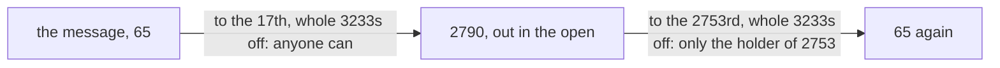

# RSA in outline: lock with e, unlock with d, and Euler's theorem is why the message comes back

[Syllabus](../../../SYLLABUS.md) → [Number theory](../../../SYLLABUS.md#w02) → [Codes and Secrets](../../../SYLLABUS.md#w02-s06) → RSA in outline

---

## General Overview

A stranger wants to send you one number, and everyone is listening.

So you publish a pair: 3233 and 17. To send you 65, the stranger raises 65 to the 17th power and takes off whole 3233s until what is left is under 3233 ([Powers on the clock](../04-Powers%20on%20the%20Clock/01-modular-exponentiation.md)). That leaves 2790, and that travels.

You held 2753 back. Raise 2790 to the 2753rd, take the 3233s off, and 65 is back. Everyone saw 3233, 17 and 2790; at real key sizes, none of it helps.

The pair is a padlock handed out open: anyone can shut it, nobody can open it. 3233 and 17 are the **public key**, 2753 the **private key**. And 3233 is not random: it is 61 × 53, two primes you told nobody.

**Locking is raising to 17 on a 3233 clock and unlocking is raising to 2753, and they undo each other because 17 × 2753 is one past a run of 3120s — the count Euler's theorem sends back to 1.**

### The picture



---

## The formula

Two lines do the work:

**lock: 65 to the 17th, whole 3233s taken off, is 2790**

**unlock: 2790 to the 2753rd, whole 3233s taken off, is 65**

Making the keys:

**3233 = 61 × 53** and **3120 = 60 × 52** and **17 × 2753 = 46801 = 15 × 3120 + 1**

**Read it aloud: two primes multiply to the clock size; one off each and multiply again is the hidden count; 2753 turns 17 into one past a run of it.**

| Piece | Plain meaning | Here |
| --- | --- | --- |
| the two primes | secret, never published | 61 and 53 |
| the clock size | published; where counting wraps ([Congruence](../03-Clock%20Arithmetic/01-congruence-mod-n.md)) | 3233 |
| the hidden count | the numbers up to 3233 sharing no factor above 1 with it ([Euler's totient](../04-Powers%20on%20the%20Clock/03-eulers-totient.md)) | 3120 |
| the public exponent | how many copies of the message multiply together | 17 |
| the private exponent | what undoes 17 on a clock of the hidden count ([The modular inverse](../03-Clock%20Arithmetic/04-modular-inverse.md)) | 2753 |
| the message | a number below the clock size, and what it becomes | 65, then 2790 |

---

## Why it works

### Step 0: locking then unlocking is one long power

Multiply 1 by 65 seventeen times, then multiply 1 by that result 2753 times: 65 is used as a factor 17 × 2753 = 46801 times ([Powers on the clock](../04-Powers%20on%20the%20Clock/01-modular-exponentiation.md)). The 3233s come off in the middle or at the end, no difference ([Adding and multiplying on the clock](../03-Clock%20Arithmetic/02-modular-addition-and-multiplication.md)).

### Step 1: 46801 is one past a run of 3120s

2753 was chosen to undo 17 on a clock of size 3120 ([The modular inverse](../03-Clock%20Arithmetic/04-modular-inverse.md)). So 46801 is 15 blocks of 3120, then one more.

### Step 2: a block of 3120 lands back on 1

3120 counts the numbers from 1 to 3233 sharing no factor with 3233 ([Euler's totient](../04-Powers%20on%20the%20Clock/03-eulers-totient.md)). Euler's theorem ([Euler's theorem](../04-Powers%20on%20the%20Clock/04-eulers-theorem.md)): any such number, used as a factor that many times with the 3233s off, lands on 1.

65 is one of them. So the long power falls apart in the hand: one 65 times fifteen blocks, every block 1. What is left is 65.

### Step 3: the hidden count, counted the other way

60 × 52 = 3120 needs 61 and 53. Count the other way: from 1 to 3233, the numbers sharing a factor are the 53 multiples of 61 and the 61 multiples of 53, with 3233 (it is 53 × 61) in both lists, so 3233 − 53 − 61 + 1 = 3120 ([Inclusion-exclusion](../../01-Foundations/07-Sets/04-inclusion-exclusion.md)).

An eavesdropper has 3233 and 17. To reach 3120 they must split 3233 into 61 × 53, the slow direction ([One-way streets](01-one-way-streets.md)) — and that is what keeps 2753 private.

Messages sharing a factor with 3233 sit outside Euler's theorem. They come home too, on a 61 clock and a 53 clock glued back ([The Chinese remainder theorem](../03-Clock%20Arithmetic/06-chinese-remainder-theorem.md)).

<details>
<summary>Two things this outline leaves out</summary>

- **Signatures.** Lock with the private 2753; unlocking with the public 17 then shows who sent it.
- **The speed-up.** Unlock on a 61 clock and a 53 clock, then glue ([The Chinese remainder theorem](../03-Clock%20Arithmetic/06-chinese-remainder-theorem.md)).

</details>

---

## Worked numbers, by hand

| Step | Arithmetic | Value |
| --- | --- | --- |
| the clock size | 61 × 53 | 3233 |
| how many share no factor with it | 60 × 52 | 3120 |
| the same count, the long way | 3233 − 53 − 61 + 1 | 3120 |
| pick 17, sharing no factor with 3120, and undo it on a 3120 clock | 17 × 2753 = 46801 = 15 × 3120 + 1 | 2753 |
| lock the message | 65 to the 17th, 3233s off | **2790** |
| unlock it | 2790 to the 2753rd, 3233s off | **65** |

Publish 3233 and 17, keep 2753, and 2790 crosses a room of listeners as 65.

### What breaks if you drop a piece

| Mistake | Comes out at | What went wrong |
| --- | --- | --- |
| Unlocking 2790 with the public 17 | 1452 | 17 only locks |
| Undoing 17 on a 3233 clock, not a 3120 one | 2699 | 17 and 2753 join on the 3120 clock |
| Sending 3298, which is 65 + 3233 | 65, not 3298 | Messages sit below the clock |

---

## Code, from first principles, and it actually runs

Nothing is imported. The power is done by squaring and multiplying, then again the plain way, 17 multiplications in a row. 3120 arrives twice: from the primes, and by walking every number to 3233. 2753 is found by search, not by Euclid.

### Python

```python
# RSA in outline -- the check behind the card.  Nothing is imported.  Two secret primes,
# 61 and 53, make the public clock size 3233.  The message 65 locks with the public
# exponent 17 and unlocks with the private one, 2753.
P, Q, E, MSG = 61, 53, 17, 65
def power(base, times, clock):          # square and multiply, remainder kept small
    out = 1
    while times:
        if times & 1: out = out * base % clock
        base, times = base * base % clock, times >> 1
    return out
def row(name, value): print(f"{name:<42}{value:>6}")
n, phi = P * Q, (P - 1) * (Q - 1)
count = sum(1 for k in range(1, n + 1) if k % P and k % Q)  # the same count, one at a time
d, slow = next(k for k in range(1, phi) if E * k % phi == 1), 1   # by search, not by Euclid
for _ in range(E): slow = slow * MSG % n                    # the plain way: 1 times 65, 17 times
c = power(MSG, E, n)
row("clock size, 61 x 53", n)
row("how many share no factor, 60 x 52", phi)
row("private exponent, 17 undone on 3120", d)
print(f"17 x {d} = {E * d} = {E * d // phi} x {phi} + {E * d % phi}")
row("lock: 65 to the 17th, 3233s off", c)
row("unlock: 2790 to the 2753rd, 3233s off", power(c, d, n))
row("65 to the 3120th, 3233s off", power(MSG, phi, n))
row("65 to the 46801st, 3233s off", power(MSG, E * d, n))
bad = next(k for k in range(1, n) if E * k % n == 1)        # a d built on 3233, not 3120
print(f"unlocked with 17: {power(c, E, n)}; with a d built on {n}: {power(c, bad, n)}; {MSG + n} comes back as {power(power(MSG + n, E, n), d, n)}")
assert n == 3233 and phi == count == 3120 and n - P - Q + 1 == phi
assert d == 2753 and E * d == 15 * phi + 1 and c == slow == 2790
assert power(c, d, n) == MSG and power(MSG, phi, n) == 1
print("ALL CHECKS PASS")
```

**Ran 2026-09-06 on macOS, Python 3.14.6, standard library only. All checks passed. Output, pasted from the run:**

```
clock size, 61 x 53                         3233
how many share no factor, 60 x 52           3120
private exponent, 17 undone on 3120         2753
17 x 2753 = 46801 = 15 x 3120 + 1
lock: 65 to the 17th, 3233s off             2790
unlock: 2790 to the 2753rd, 3233s off         65
65 to the 3120th, 3233s off                    1
65 to the 46801st, 3233s off                  65
unlocked with 17: 1452; with a d built on 3233: 2699; 3298 comes back as 65
ALL CHECKS PASS
```

### Rust

Same numbers, same labels, built with `rustc --edition 2021 -O`.

```rust
// RSA in outline -- the same check as the Python twin, in Rust.  No crates.  Two secret
// primes, 61 and 53, make the public clock size 3233.  The message 65 locks with the
// public exponent 17 and unlocks with the private one, 2753.
const P: u64 = 61;
const Q: u64 = 53;
const E: u64 = 17;
const MSG: u64 = 65;
fn power(mut base: u64, mut times: u64, clock: u64) -> u64 {   // square and multiply
    let mut out = 1;
    while times != 0 {
        if times & 1 == 1 { out = out * base % clock; }
        base = base * base % clock;
        times >>= 1;
    }
    out
}
fn row(name: &str, value: u64) { println!("{:<42}{:>6}", name, value); }
fn main() {
    let (n, phi) = (P * Q, (P - 1) * (Q - 1));
    let count = (1..=n).filter(|k| k % P != 0 && k % Q != 0).count() as u64;  // one at a time
    let d = (1..phi).find(|k| E * k % phi == 1).unwrap();      // by search, not by Euclid
    let mut slow = 1;
    for _ in 0..E { slow = slow * MSG % n; }                   // the plain way: 1 times 65, 17 times
    let c = power(MSG, E, n);
    row("clock size, 61 x 53", n);
    row("how many share no factor, 60 x 52", phi);
    row("private exponent, 17 undone on 3120", d);
    println!("17 x {} = {} = {} x {} + {}", d, E * d, E * d / phi, phi, E * d % phi);
    row("lock: 65 to the 17th, 3233s off", c);
    row("unlock: 2790 to the 2753rd, 3233s off", power(c, d, n));
    row("65 to the 3120th, 3233s off", power(MSG, phi, n));
    row("65 to the 46801st, 3233s off", power(MSG, E * d, n));
    let bad = (1..n).find(|k| E * k % n == 1).unwrap();        // a d built on 3233, not 3120
    println!("unlocked with 17: {}; with a d built on {}: {}; {} comes back as {}", power(c, E, n), n,
             power(c, bad, n), MSG + n, power(power(MSG + n, E, n), d, n));
    assert!(n == 3233 && phi == count && count == 3120 && n - P - Q + 1 == phi);
    assert!(d == 2753 && E * d == 15 * phi + 1 && c == slow && slow == 2790);
    assert!(power(c, d, n) == MSG && power(MSG, phi, n) == 1);
    println!("ALL CHECKS PASS");
}
```

**Ran 2026-09-06 on macOS, rustc 1.98.1, no crates. All checks passed. Output, pasted from the run:**

```
clock size, 61 x 53                         3233
how many share no factor, 60 x 52           3120
private exponent, 17 undone on 3120         2753
17 x 2753 = 46801 = 15 x 3120 + 1
lock: 65 to the 17th, 3233s off             2790
unlock: 2790 to the 2753rd, 3233s off         65
65 to the 3120th, 3233s off                    1
65 to the 46801st, 3233s off                  65
unlocked with 17: 1452; with a d built on 3233: 2699; 3298 comes back as 65
ALL CHECKS PASS
```

The two outputs match line for line.

> [!TIP]
> **Try changing**
> Guess first.
> - **Send 3298 instead of 65.** One clock over: it locks to 2790 and returns 65; a pinned assert fires.
> - **Set E to 15.** 15 and 3120 share a factor (15), so nothing undoes 15: the search runs off the end.

---

## The usual mistake

> [!warning]
> **Thinking the clock size is the secret.** 3233 is printed on the padlock. The secret is 3120, 60 × 52 — the primes, one step down each. Anyone who splits 3233 has 3120, and 2753 is a few lines from there.
>
> - **Unlocking with the public exponent.** 2790 read with 17 gives 1452.
> - **Undoing 17 on the wrong clock.** Built on 3233, it brings 2790 back as 2699.
> - **Shipping this raw.** 65 always locks to 2790, so a guess can be locked and checked. Multiply two locked numbers and you have multiplied the messages, no key. Real schemes pad.
> - **Reading these as real keys.** 3233 gives up its primes to trial division on paper.

---

## Where you meet it in real life

- **An SSH key pair.** The public half is a clock size and an exponent, given to every machine you log in to; the private half never leaves.
- **Locking a key, not a message.** Messages sit below the clock size, so this carries a short key and a faster cipher carries the rest.
- **Strangers with no keys at all.** [Diffie-Hellman key exchange](02-diffie-hellman.md), over an open line.

> **Say it back**
> Two secret primes: 61 × 53 = 3233, published. One off each and multiply: 3120, kept back. Publish 17; keep 2753, what undoes 17 on a 3120 clock. Lock: 65 to the 17th, 3233s off, is 2790. Unlock: 2790 to the 2753rd is 65. It comes home because 17 × 2753 is fifteen blocks of 3120 plus one, and every block lands on 1. It stays secret because 3120 needs the primes.

---

## What this builds on

- [Euler's theorem](../04-Powers%20on%20the%20Clock/04-eulers-theorem.md): the block of 3120 that lands on 1.
- [The modular inverse](../03-Clock%20Arithmetic/04-modular-inverse.md): how 2753 is found from 17 and 3120.
- [One-way streets](01-one-way-streets.md): why splitting 3233 into 61 × 53 is slow.

## Where this goes next

Nothing later rests on this card. The rest of the shelf supplies what it assumed: [The Fermat test](04-fermat-test-and-carmichael.md) and [The Miller-Rabin test](05-miller-rabin.md) find primes the size real keys need.

---

## Sources

Verified 6 Sep 2026: every link resolves.

- Rivest, R. L., A. Shamir, and L. Adleman. "A Method for Obtaining Digital Signatures and Public-Key Cryptosystems." *Communications of the ACM* 21, no. 2 (1978): 120–126. [doi:10.1145/359340.359342](https://doi.org/10.1145/359340.359342). The original; its example uses other numbers.
- Shoup, Victor. *A Computational Introduction to Number Theory and Algebra*, 2nd ed. Cambridge University Press, 2008. [Full text](https://shoup.net/ntb/). Chapter 8, making the keys.
- Menezes, A., P. van Oorschot, and S. Vanstone. *Handbook of Applied Cryptography*. CRC Press, 1996. [Free chapters](https://cacr.uwaterloo.ca/hac/). Chapter 8, the proof that covers every message.
