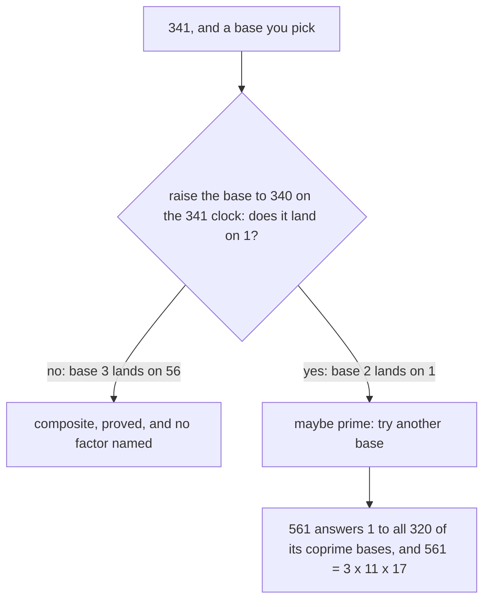

# The Fermat test: a quick primality check that can be fooled, and the Carmichael numbers that fool it every time

[Syllabus](../../../SYLLABUS.md) → [Number theory](../../../SYLLABUS.md#w02) → [Codes and Secrets](../../../SYLLABUS.md#w02-s06) → The Fermat test

---

## General Overview

A number lands in front of you: **341**. Prime, or not?

Dividing by 2, 3, 5, 7 and up settles it in a minute. For a number hundreds of digits long, the size a code needs ([RSA in outline](03-rsa-in-outline.md)), there is no time in the world.

So screen it. Pick a **base** — any number, say 2. Work on a clock of size 341: count round, keep only the remainder. Raise 2 to the 340, one less than the number under test. A few steps of squaring and multiplying ([Powers on the clock](../04-Powers%20on%20the%20Clock/01-modular-exponentiation.md)). It lands on **1**.

A prime would force exactly that ([Fermat's little theorem](../04-Powers%20on%20the%20Clock/02-fermats-little-theorem.md)). So 341 survives — a **pseudoprime**, a composite that passes for some base. It is still not prime: 341 = 11 × 31.

Base 3 lands on **56**. Not 1, so 341 is composite — proved, without naming 11 or 31.

**A fail proves the number composite. A pass is only a maybe — and 561 passes for every base that shares no factor with it.**

### The picture



---

## The formula

On 341, run twice:

**2 to the 340 ≡ 1 (mod 341), and yet 341 = 11 × 31**

**3 to the 340 ≡ 56 (mod 341), so 341 is composite**

The ≡ sign: both sides leave the same remainder on the clock in brackets ([Congruence](../03-Clock%20Arithmetic/01-congruence-mod-n.md)).

**Read it aloud: raise your base to one less than the number under test, on that number's clock. Land on 1 and it survives; land elsewhere and it is composite.**

| Piece | Plain meaning | Here |
| --- | --- | --- |
| the number under test | what needs a verdict | 341 |
| the base | any number you pick to raise | 2, then 3 |
| the exponent | one less than that number | 340 |
| the answer | where the power lands, whole clocks off | 1, then 56 |
| a witness | a base answering anything but 1 | 3 |

---

## Why it works

### Step 0: what a prime forces

On a clock of prime size, a base the prime does not divide, raised to one less than the prime, lands on 1 ([Fermat's little theorem](../04-Powers%20on%20the%20Clock/02-fermats-little-theorem.md)). Not rebuilt here.

### Step 1: the direction you may flip

"Prime, therefore the answer is 1" flips into its negative: **not 1, therefore not prime** ([If-then](../../01-Foundations/05-Logic/02-if-then.md), [Proof by contrapositive](../../01-Foundations/06-Proof/02-proof-by-contrapositive.md)). Base 3 lands on 56, so 341 is composite — a proof that never finds a factor. Not prime and not factored are different facts ([One-way streets](01-one-way-streets.md)).

### Step 2: the converse is false

"The answer is 1, therefore prime" is that sentence read backwards, and it is false. Base 2 on 341 is the counterexample: 1024 = 3 × 341 + 1, so 2 to the 10 already sits on 1, and 340 is 34 tens, so 2 to the 340 is that 1 raised to the 34th. Still 1, for a reason unrelated to being prime.

### Step 3: change the base

Of the 300 bases below 341 sharing no factor with it — coprime to it ([Coprime numbers](../02-Greatest%20Common%20Divisor%20and%20Euclid%27s%20Algorithm/05-coprime-numbers.md)) — only 100 land on 1. The other 200 are witnesses, so a coprime base picked at random exposes 341 two times in three. Only a coprime base can answer 1 at all ([The modular inverse](../03-Clock%20Arithmetic/04-modular-inverse.md)).

### Step 4: 561, where no base helps

561 = 3 × 11 × 17, and all 320 of its coprime bases answer 1. A fake ID that beats every bouncer — from here on, a **Carmichael number**. 1105 and 1729 are two more, and there are infinitely many (Alford, Granville and Pomerance, 1994).

<details>
<summary>Why 561 gets away with it</summary>

Each prime appears once, and 560 divides exactly by 2, by 10 and by 16 — that is 3 − 1, 11 − 1 and 17 − 1. So on each small clock the base is home on 1 early, and the three 1s glue into one on the 561 clock ([The Chinese remainder theorem](../03-Clock%20Arithmetic/06-chinese-remainder-theorem.md)). Korselt found the pattern in 1899, Carmichael the numbers in 1910.

</details>

The repair is not more bases but watching the power on the way up: [The Miller-Rabin test](05-miller-rabin.md).

---

## Worked numbers, by hand

341, both bases. 341 = 11 × 31, so its clock splits into an 11 clock and a 31 clock; the two answers glue back into one ([The Chinese remainder theorem](../03-Clock%20Arithmetic/06-chinese-remainder-theorem.md)).

| Step | Arithmetic | Value |
| --- | --- | --- |
| 2 to the 10, on the 341 clock | 1024 = 3 × 341 + 1 | 1 |
| so 2 to the 340, as 340 = 34 × 10 | that 1 raised to the 34th | **1** |
| base 3, on the 11 clock | 3 to the 10 lands on 1, and 340 = 34 × 10 | 1 |
| base 3, on the 31 clock | 3 to the 30 lands on 1, and 340 = 11 × 30 + 10, so 3 to the 10: 59049 = 31 × 1904 + 25 | 25 |
| glued back together | 1 on the 11 clock, 25 on the 31 clock | **56** |

Base 2 says maybe; base 3 says composite, and that is final.

### What breaks if you drop a piece

| Mistake | Comes out at | What went wrong |
| --- | --- | --- |
| Testing with base 1 | 1 | 1 to any power is 1: it passes everything |
| Raising to 341, not 340 | 2 | the other form, true only for primes; 341 is not prime, so a 2 proves nothing |
| Reading a pass as a verdict | calls 341 prime | base 3 answers 56 |

The code prints all three.

---

## Code, from first principles, and it actually runs

Nothing is imported. Road one squares and multiplies. Road two multiplies it out 340 times over, and must agree. Road three does base 3 by hand: 11 clock, 31 clock, glued back. Then the bases are counted.

### Python

```python
# The Fermat test -- the check behind the card.  Nothing is imported.  Is 341 prime?
# Base 2 answers 1, which says only maybe; base 3 answers 56, which proves composite.
def modpow(base, exp, n):                   # road one: square and multiply
    r, base = 1, base % n
    while exp:
        if exp & 1: r = r * base % n
        base, exp = base * base % n, exp >> 1
    return r
def slow_pow(base, exp, n):                 # road two: one multiplication at a time
    r = 1
    for _ in range(exp): r = r * base % n
    return r
def gcd(a, b): return a if b == 0 else gcd(b, a % b)
def fermat(n):                              # coprime bases, and how many answer 1
    co = [a for a in range(1, n) if gcd(a, n) == 1]
    return len(co), sum(1 for a in co if modpow(a, n - 1, n) == 1)
(co341, pass341), (co561, pass561) = fermat(341), fermat(561)
glued = next(x for x in range(341) if x % 11 == 1 and x % 31 == 25)   # road three
print(f"341 = 11 x 31 = {11 * 31}, composite; 561 = 3 x 11 x 17 = {3 * 11 * 17}, composite")
print(f"2 to the 10 is {2 ** 10} = {2 ** 10 // 341} x 341 + {2 ** 10 % 341}, so 2 to the 340 answers {modpow(2, 340, 341)}; 340 steps in a row: {slow_pow(2, 340, 341)}")
print(f"3 to the 340 on the 341 clock: {modpow(3, 340, 341)}; 340 steps in a row: {slow_pow(3, 340, 341)}")
print(f"340 = {340 // 10} x 10, so on the 11 clock 3 to the 340 is {modpow(3, 340, 11)}; 340 = {340 // 30} x 30 + {340 % 30}, so on the 31 clock it is 3 to the 10, {modpow(3, 10, 31)}; glued back: {glued}")
print(f"bases 1 to 340 sharing no factor with 341: {co341}, and {pass341} of them answer 1")
print(f"bases 1 to 560 sharing no factor with 561: {co561}, and {pass561} of them answer 1")
print(f"1105 and 1729 do it too: {fermat(1105)} and {fermat(1729)}, coprime bases and how many answer 1")
print(f"base 1 on 341 answers {modpow(1, 340, 341)}; the exponent 341 answers {modpow(2, 341, 341)}; base 3 answers {modpow(3, 340, 341)}")
assert modpow(2, 340, 341) == 1 == slow_pow(2, 340, 341) and 11 * 31 == 341 and 2 ** 10 == 3 * 341 + 1
assert modpow(3, 340, 341) == 56 == slow_pow(3, 340, 341) == glued and modpow(3, 340, 31) == 25 and modpow(3, 340, 11) == 1
assert co341 == 10 * 30 and pass341 == 100 and co561 == 2 * 10 * 16 and pass561 == co561 and fermat(1105) == (768, 768) and fermat(1729) == (1296, 1296)
print("ALL CHECKS PASS")
```

**Ran 2026-09-06 on macOS, Python 3.14.6, standard library only. All checks passed. Output, pasted from the run:**

```
341 = 11 x 31 = 341, composite; 561 = 3 x 11 x 17 = 561, composite
2 to the 10 is 1024 = 3 x 341 + 1, so 2 to the 340 answers 1; 340 steps in a row: 1
3 to the 340 on the 341 clock: 56; 340 steps in a row: 56
340 = 34 x 10, so on the 11 clock 3 to the 340 is 1; 340 = 11 x 30 + 10, so on the 31 clock it is 3 to the 10, 25; glued back: 56
bases 1 to 340 sharing no factor with 341: 300, and 100 of them answer 1
bases 1 to 560 sharing no factor with 561: 320, and 320 of them answer 1
1105 and 1729 do it too: (768, 768) and (1296, 1296), coprime bases and how many answer 1
base 1 on 341 answers 1; the exponent 341 answers 2; base 3 answers 56
ALL CHECKS PASS
```

### Rust

Same numbers, built with `rustc --edition 2021 -O`.

```rust
// The Fermat test -- the same check as the Python twin, in Rust.  No crates.  Is 341
// prime?  Base 2 answers 1, which says only maybe; base 3 answers 56, proving composite.
fn modpow(mut base: u64, mut exp: u64, n: u64) -> u64 {   // road one: square and multiply
    let mut r = 1; base %= n;
    while exp > 0 {
        if exp & 1 == 1 { r = r * base % n; }
        base = base * base % n; exp >>= 1;
    }
    r
}
fn slow_pow(base: u64, exp: u64, n: u64) -> u64 {         // road two: one multiplication at a time
    let mut r = 1;
    for _ in 0..exp { r = r * base % n; }
    r
}
fn gcd(a: u64, b: u64) -> u64 { if b == 0 { a } else { gcd(b, a % b) } }
fn fermat(n: u64) -> (usize, usize) {                     // coprime bases, and how many answer 1
    let co: Vec<u64> = (1..n).filter(|&a| gcd(a, n) == 1).collect();
    (co.len(), co.iter().filter(|&&a| modpow(a, n - 1, n) == 1).count())
}
fn main() {
    let ((co341, pass341), (co561, pass561)) = (fermat(341), fermat(561));
    let glued = (0..341).find(|x| x % 11 == 1 && x % 31 == 25).unwrap();   // road three
    let ten = 2u64.pow(10);
    println!("341 = 11 x 31 = {}, composite; 561 = 3 x 11 x 17 = {}, composite", 11 * 31, 3 * 11 * 17);
    println!("2 to the 10 is {} = {} x 341 + {}, so 2 to the 340 answers {}; 340 steps in a row: {}", ten, ten / 341, ten % 341, modpow(2, 340, 341), slow_pow(2, 340, 341));
    println!("3 to the 340 on the 341 clock: {}; 340 steps in a row: {}", modpow(3, 340, 341), slow_pow(3, 340, 341));
    println!("340 = {} x 10, so on the 11 clock 3 to the 340 is {}; 340 = {} x 30 + {}, so on the 31 clock it is 3 to the 10, {}; glued back: {}", 340 / 10, modpow(3, 340, 11), 340 / 30, 340 % 30, modpow(3, 10, 31), glued);
    println!("bases 1 to 340 sharing no factor with 341: {}, and {} of them answer 1", co341, pass341);
    println!("bases 1 to 560 sharing no factor with 561: {}, and {} of them answer 1", co561, pass561);
    println!("1105 and 1729 do it too: {:?} and {:?}, coprime bases and how many answer 1", fermat(1105), fermat(1729));
    println!("base 1 on 341 answers {}; the exponent 341 answers {}; base 3 answers {}", modpow(1, 340, 341), modpow(2, 341, 341), modpow(3, 340, 341));
    assert!(modpow(2, 340, 341) == 1 && slow_pow(2, 340, 341) == 1 && 11 * 31 == 341 && ten == 3 * 341 + 1);
    assert!(modpow(3, 340, 341) == 56 && slow_pow(3, 340, 341) == 56 && glued == 56 && modpow(3, 340, 31) == 25 && modpow(3, 340, 11) == 1);
    assert!(co341 == 10 * 30 && pass341 == 100 && co561 == 2 * 10 * 16 && pass561 == co561 && fermat(1105) == (768, 768) && fermat(1729) == (1296, 1296));
    println!("ALL CHECKS PASS");
}
```

**Ran 2026-09-06 on macOS, rustc 1.98.1, no crates. All checks passed. Output, pasted from the run:**

```
341 = 11 x 31 = 341, composite; 561 = 3 x 11 x 17 = 561, composite
2 to the 10 is 1024 = 3 x 341 + 1, so 2 to the 340 answers 1; 340 steps in a row: 1
3 to the 340 on the 341 clock: 56; 340 steps in a row: 56
340 = 34 x 10, so on the 11 clock 3 to the 340 is 1; 340 = 11 x 30 + 10, so on the 31 clock it is 3 to the 10, 25; glued back: 56
bases 1 to 340 sharing no factor with 341: 300, and 100 of them answer 1
bases 1 to 560 sharing no factor with 561: 320, and 320 of them answer 1
1105 and 1729 do it too: (768, 768) and (1296, 1296), coprime bases and how many answer 1
base 1 on 341 answers 1; the exponent 341 answers 2; base 3 answers 56
ALL CHECKS PASS
```

The two outputs match line for line.

> [!TIP]
> **Try changing**
> Guess first.
> - **Move the test to 561.** Swap the 341s for 561, the 340s for 560: base 2 answers 1 too, and the pinned asserts fire.
> - **Add 1105 to the count.** All 768 of its coprime bases answer 1, as the run prints.

---

## The usual mistake

> [!warning]
> **Reading a pass as a verdict.** The test never says prime. It says "not caught this time". The true sentence — prime, so the answer is 1 — does not run backwards.
>
> - **One base, then stopping.** 100 of 341's 300 coprime bases let it through, base 2 among them.
> - **More bases must eventually work.** On 561 they never do: all 320 answer 1.
> - **Testing with base 1.** It answers 1 for every number.

---

## Where you meet it in real life

- **Finding a prime for a code.** [RSA in outline](03-rsa-in-outline.md) needs primes nobody has met. This is the cheap screen; the verdict comes from [The Miller-Rabin test](05-miller-rabin.md).
- **Any screening test.** A fail rules out; a pass only fails to rule out — the converse trap in ordinary clothes ([If-then](../../01-Foundations/05-Logic/02-if-then.md)).
- **1729.** The taxicab number is Carmichael too, answering 1 to all 1296 coprime bases.

> **Say it back**
> Pick any base and raise it to one less than the number under test, on that number's clock. A prime forces a landing on 1, so landing elsewhere proves it composite without finding a factor: base 3 lands on 56 and settles 341. Landing on 1 proves nothing: base 2 lands on 1, yet 341 = 11 × 31. Most fakes fall to a second base; the Carmichael numbers, 561 the smallest, answer 1 to every coprime base.

---

## What this builds on

- [Fermat's little theorem](../04-Powers%20on%20the%20Clock/02-fermats-little-theorem.md): the fact the test rides on, a prime sending every base home to 1.
- [Powers on the clock](../04-Powers%20on%20the%20Clock/01-modular-exponentiation.md): squaring and multiplying, which makes raising to the 340 cheap.
- [If-then](../../01-Foundations/05-Logic/02-if-then.md): which way a true sentence turns, and which way traps you.

## Where this goes next

- [The Miller-Rabin test](05-miller-rabin.md): the same power, watched on the way up, catching 561 and every Carmichael number.

---

## Sources

Verified 6 Sep 2026: every link resolves.

- Crandall, Richard, and Carl Pomerance. *Prime Numbers: A Computational Perspective*, 2nd ed. Springer, 2005. [doi:10.1007/0-387-28979-8](https://doi.org/10.1007/0-387-28979-8). Pseudoprimes and Carmichael numbers.
- Alford, W. R., Andrew Granville, and Carl Pomerance. "There are Infinitely Many Carmichael Numbers." *Annals of Mathematics* 139 (1994). [doi:10.2307/2118576](https://doi.org/10.2307/2118576). Proof that the fakes never run out.
- Shoup, Victor. *A Computational Introduction to Number Theory and Algebra*, 2nd ed. Cambridge University Press, 2008. [Full text](https://shoup.net/ntb/). The primality chapter reads on from here.
