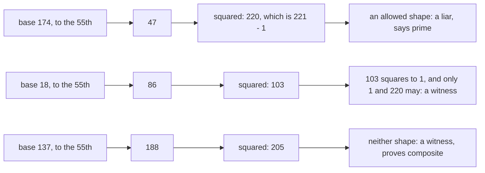

# The Miller-Rabin test: how RSA finds 300-digit primes, with an error as small as you like

Number theory → Codes and Secrets → Primality tests → The Miller-Rabin test

---

## General Overview

Is 221 prime? Divide and see. Not 2, not 3, not 5, not 7, not 11 — and 13 goes in. 221 = 13 × 17.

Now give it three hundred digits. RSA ([rsa-in-outline](03-rsa-in-outline.md)) wants two like that before lunch, and dividing up to the square root would outlast the sun. Miller-Rabin settles one in moments, at a price: it proves a number composite, but at that size never prime.

Back to 221, by hand. Pick a number below it — call it the **base**. Raise it to a power 221 fixes — the 55th, here — on the 221 clock ([congruence-mod-n](../03-Clock%20Arithmetic/01-congruence-mod-n.md)), square that, and read the result. Base 137 lands in a shape no prime could make. Base 174 looks blameless, and lies.

**A prime's chain of squarings has only two allowed shapes, and a chain with neither proves the number composite.**

### The picture: three chains



---

## The formula

Halve one-below until it stops: **221 − 1 = 220, and 220 = 4 × 55** — 220, 110, 55, odd. Halved twice, so the chain is two long: the base to the 55th, then that squared once. Three halvings, three long.

**Base 174: 174 to the 55th is 47 on the 221 clock, and 47 × 47 is 220 there — that is 221 − 1.**

**Read it aloud:** the chain reached one-below-the-number, a shape a prime allows.

| Piece | Plain meaning | Here |
| --- | --- | --- |
| the number under test | the odd number tested | 221 |
| the base | a number below it, drawn at random | 174, 18, 137 |
| the odd part | halve one-below until odd | 55 |
| the halvings | how far one-below halves | 2, so the chain is 2 long |
| the chain | the power, then its squaring | 47, then 220 |
| a liar, a witness | one passes on a composite, one proves it | 174; 18, 137 |

A chain passes if it starts at 1 or shows 221 − 1; anything else is a witness. A composite that passes is a **strong pseudoprime** to that base — the test's other name is the strong probable prime test.

---

## Why it works

### Step 0: on a prime clock, only two numbers square to 1

Say a number times itself lands on 1. Then the prime divides (the number minus 1) times (the number plus 1). A prime dividing a product divides one of them ([euclids-lemma](../02-Greatest%20Common%20Divisor%20and%20Euclid%27s%20Algorithm/06-euclids-lemma.md)), so the number is **1 or one-below**, never a third.

A composite clock can have more, and that extra root is the crack. On 221 four numbers square to 1: 1, 103, 118 and 220. Base 18's chain lands on 103, a root no prime clock owns. That is the conviction.

### Step 1: halve until the halving stops

The Fermat test ([fermat-test-and-carmichael](04-fermat-test-and-carmichael.md)) raises the base to the 220th and asks for 1. Miller-Rabin takes the same road and stops early: 220 = 4 × 55, so that power is the base to the 55th, squared twice. Each squaring is a chance to look.

### Step 2: a prime puts 1 at the top, and the walk down has two endings

If 221 were prime, Fermat's little theorem ([fermats-little-theorem](../04-Powers%20on%20the%20Clock/02-fermats-little-theorem.md)) would put that 1 at the top. The chain stops one squaring short of it on purpose: base 174's chain ends at 220, and squaring 220 gives the 1 — a squaring that tells you nothing.

The value below a 1 squares to it, so by Step 0 it is 1 or 221 − 1; if it is 1, drop a step and ask again. So the chain starts at 1 or shows 221 − 1. No third shape.

Base 137 gives 188, then 205: not 1, never 221 − 1. No prime could do that, so **221 is composite** — with no one finding 13 or 17.

### Step 3: why each base cuts the doubt fourfold

For any odd composite, at least three in four bases are witnesses — taken on trust here. On 221 it is generous: 214 witnesses, 6 liars. Fermat is fooled by 16.

Bases are drawn fresh, so doubts multiply: one leaves one chance in 4, two one in 16, twenty less than the machine miscounting.

<details>
<summary>What a real key-maker adds</summary>

Trial division by small primes clears most candidates cheaply. The one-in-four bound is a worst case: FIPS 186-5 Table B.1 asks only 4 or 5 rounds of a 1024-bit candidate.

</details>

---

## Worked numbers, by hand

| Step | Arithmetic | Value |
| --- | --- | --- |
| split one-below | 220 = 4 × 55, halved twice | 55 |
| base 174 | to the 55th ([modular-exponentiation](../04-Powers%20on%20the%20Clock/01-modular-exponentiation.md)) is 47, squared is 220 | **liar: 221 − 1 is allowed** |
| base 18 | to the 55th is 86, squared is 103 | **witness: 103 squares to 1, and only 1 and 220 may** |
| base 137 | to the 55th is 188, squared is 205 | **witness: neither shape** |

Bases 174 and 18 both pass Fermat. The squaring separates them.

### What breaks if you drop a piece

| Mistake | Comes out at | What went wrong |
| --- | --- | --- |
| Trusting base 174 alone | says prime | one of the 6 liars; 221 = 13 × 17 |
| Using the Fermat test instead | 18 to the 220th is 1, says prime | it reads only the top, never the 103 |

---

## Code, from first principles, and it actually runs

Nothing is imported. Every power on show is taken twice — square-and-multiply, then one multiplication at a time — and the roads must agree on all 220 bases. Then every base is tried, to count the liars.

### Python

```python
# Miller-Rabin -- the check behind the card.  Nothing is imported.  221 = 13 x 17, and
# 220 = 4 x 55, so every chain is one power then one squaring.  174 lies; 18 fools the
# older Fermat test and is caught here; 137 is caught by both.  Every power taken twice.
N, D = 221, 55
def fast(a, e):                  # square and multiply, on the 221 clock
    r, b = 1, a % N
    while e:
        if e % 2: r = r * b % N
        b = b * b % N; e //= 2
    return r
def slow(a, e):                  # the same power, one multiplication at a time
    r = 1
    for _ in range(e): r = r * a % N
    return r
def chain(a): f = fast(a, D); return [f, f * f % N]   # the base to the 55th, then squared
def passes(c): return c[0] == 1 or N - 1 in c         # not a witness: 1 first, or 220 anywhere
print("221 = 13 x 17, so composite; 220 = 4 x 55, so each chain is a power then a squaring")
print(f"square roots of 1 here: {[x for x in range(N) if x * x % N == 1]} -- a prime clock has only 1 and {N - 1}")
for a in (174, 18, 137):
    c, f = chain(a), fast(a, N - 1)
    v = "liar, says prime" if passes(c) else "witness, proves composite"
    print(f"base {a:>3}: to the 55th {c[0]:>3}, squared {c[1]:>3} -> {v:<25}; to the 220th {f:>3} -> Fermat says {'prime' if f == 1 else 'composite'}")
liars, fermat = [a for a in range(1, N) if passes(chain(a))], [a for a in range(1, N) if fast(a, N - 1) == 1]
print(f"of the 220 bases, {len(fermat)} fool Fermat but only {len(liars)} fool Miller-Rabin; a quarter of 220 is {(N - 1) // 4}")
assert chain(174) == [47, 220] and chain(18) == [86, 103] and chain(137) == [188, 205]
assert all(fast(a, D) == slow(a, D) for a in range(1, N)) and all(fast(a, 220) == slow(a, 220) for a in (174, 18, 137))
assert 13 * 17 == N and len(fermat) == 16 and 4 * len(liars) <= N - 1 and len(liars) == 6
print("ALL CHECKS PASS")
```

**Ran 2026-09-06 on macOS, Python 3.14.6, standard library only. All checks passed. Output, pasted from the run:**

```
221 = 13 x 17, so composite; 220 = 4 x 55, so each chain is a power then a squaring
square roots of 1 here: [1, 103, 118, 220] -- a prime clock has only 1 and 220
base 174: to the 55th  47, squared 220 -> liar, says prime         ; to the 220th   1 -> Fermat says prime
base  18: to the 55th  86, squared 103 -> witness, proves composite; to the 220th   1 -> Fermat says prime
base 137: to the 55th 188, squared 205 -> witness, proves composite; to the 220th  35 -> Fermat says composite
of the 220 bases, 16 fool Fermat but only 6 fool Miller-Rabin; a quarter of 220 is 55
ALL CHECKS PASS
```

### Rust

Same numbers, built with `rustc --edition 2021 -O`.

```rust
// Miller-Rabin -- the same check as miller_rabin_check.py, in Rust.  No crates.  221 =
// 13 x 17, and 220 = 4 x 55, so every chain is one power then one squaring.  174 lies;
// 18 fools the older Fermat test and is caught here; 137 is caught by both.
const N: u64 = 221;
const D: u64 = 55;
fn fast(a: u64, mut e: u64) -> u64 {   // square and multiply, on the 221 clock
    let (mut r, mut b) = (1u64, a % N);
    while e > 0 {
        if e % 2 == 1 { r = r * b % N; }
        b = b * b % N; e /= 2;
    }
    r
}
fn slow(a: u64, e: u64) -> u64 {       // the same power, one multiplication at a time
    let mut r = 1u64;
    for _ in 0..e { r = r * a % N; }
    r
}
// the base to the 55th, then that squared
fn chain(a: u64) -> [u64; 2] { let f = fast(a, D); [f, f * f % N] }
// not a witness: 1 first, or 220 anywhere
fn passes(c: [u64; 2]) -> bool { c[0] == 1 || c[0] == N - 1 || c[1] == N - 1 }
fn main() {
    println!("221 = 13 x 17, so composite; 220 = 4 x 55, so each chain is a power then a squaring");
    let roots: Vec<u64> = (0..N).filter(|x| x * x % N == 1).collect();
    println!("square roots of 1 here: {:?} -- a prime clock has only 1 and {}", roots, N - 1);
    for a in [174u64, 18, 137] {
        let (c, f) = (chain(a), fast(a, N - 1));
        let v = if passes(c) { "liar, says prime" } else { "witness, proves composite" };
        println!("base {:>3}: to the 55th {:>3}, squared {:>3} -> {:<25}; to the 220th {:>3} -> Fermat says {}", a, c[0], c[1], v, f, if f == 1 { "prime" } else { "composite" });
    }
    let liars = (1..N).filter(|&a| passes(chain(a))).count() as u64;
    let fermat = (1..N).filter(|&a| fast(a, N - 1) == 1).count() as u64;
    println!("of the 220 bases, {} fool Fermat but only {} fool Miller-Rabin; a quarter of 220 is {}", fermat, liars, (N - 1) / 4);
    assert!(chain(174) == [47, 220] && chain(18) == [86, 103] && chain(137) == [188, 205]);
    assert!((1..N).all(|a| fast(a, D) == slow(a, D)) && [174u64, 18, 137].iter().all(|&a| fast(a, 220) == slow(a, 220)));
    assert!(13 * 17 == N && fermat == 16 && 4 * liars <= N - 1 && liars == 6);
    println!("ALL CHECKS PASS");
}
```

**Ran 2026-09-06 on macOS, rustc 1.98.1, no crates. All checks passed. Output, pasted from the run:**

```
221 = 13 x 17, so composite; 220 = 4 x 55, so each chain is a power then a squaring
square roots of 1 here: [1, 103, 118, 220] -- a prime clock has only 1 and 220
base 174: to the 55th  47, squared 220 -> liar, says prime         ; to the 220th   1 -> Fermat says prime
base  18: to the 55th  86, squared 103 -> witness, proves composite; to the 220th   1 -> Fermat says prime
base 137: to the 55th 188, squared 205 -> witness, proves composite; to the 220th  35 -> Fermat says composite
of the 220 bases, 16 fool Fermat but only 6 fool Miller-Rabin; a quarter of 220 is 55
ALL CHECKS PASS
```

The two outputs match line for line.

> [!TIP]
> **Try changing**
> - **Stop looking at the squaring.** Have `passes` ask only about the first value: base 174 becomes a witness, and so would real primes. The last assert fires.
> - **Test base 13, a factor of 221.** Liar or witness? Witness: a base sharing a factor never climbs back to 1.

---

## The usual mistake

> [!warning]
> **Reading a pass as "prime".** It says only that this base found nothing: 174 passes on 13 × 17. With random bases the test convicts, never acquits.
>
> - **One base is enough.** It is not: 174 alone says prime, and three more cost nothing.
> - **"Probable prime" sounds shaky.** The doubt is a number you pick: twenty bases put it below one in a million million.
> - **A favourite base, reused.** Draw at random instead. Below a published bound a fixed list is a proof, not a guess: 2, 3, 5, 7, 11, 13 settle everything under 3,474,749,660,383 (Jaeschke).

---

## Where you meet it in real life

- **Making an RSA key.** The machine picks a huge odd number and tests it. NIST's 2023 standard puts the primes at 1024 bits and up — over three hundred digits — with Miller-Rabin as the test (FIPS 186-5, B.3.1). See [rsa-in-outline](03-rsa-in-outline.md) and [one-way-streets](01-one-way-streets.md).
- **"Probable prime" in software.** Big-number libraries run this test.
- **Setting up Diffie-Hellman.** It needs a big prime clock too ([diffie-hellman](02-diffie-hellman.md)).

> **Say it back**
> Take one less than the number and halve it until odd: 220 becomes 4 × 55. Raise a random base to the 55th, then keep squaring. A prime's chain starts at 1 or shows one-below, since only those two square to 1 there. Anything else proves it composite: that base is a witness. Base 18 fools the older Fermat test; this one catches it, on the 103.

---

## What this builds on

- [fermat-test-and-carmichael](04-fermat-test-and-carmichael.md): the weaker test this one repairs.
- [euclids-lemma](../02-Greatest%20Common%20Divisor%20and%20Euclid%27s%20Algorithm/06-euclids-lemma.md): why only two numbers square to 1 on a prime clock.
- [modular-exponentiation](../04-Powers%20on%20the%20Clock/01-modular-exponentiation.md): the base to the 55th, without 55 multiplications.

## Where this goes next

- randomised-algorithms-and-expectation: coin-flipping algorithms and their error bounds.
- p-and-np: where fast primality sits among problems computers solve quickly.


---

## Sources

Verified 6 Sep 2026: every link resolves to its publisher.

- Miller, Gary L. "Riemann's Hypothesis and Tests for Primality." *Journal of Computer and System Sciences* 13 (1976): 300–317. [doi:10.1016/S0022-0000(76)80043-8](https://doi.org/10.1016/S0022-0000(76)80043-8). The squaring chain.
- Rabin, Michael O. "Probabilistic Algorithm for Testing Primality." *Journal of Number Theory* 12 (1980): 128–138. [doi:10.1016/0022-314X(80)90084-0](https://doi.org/10.1016/0022-314X(80)90084-0). Random bases, and the error bound.
- Jaeschke, Gerhard. "On Strong Pseudoprimes to Several Bases." *Mathematics of Computation* 61 (1993): 915–926. [doi:10.1090/S0025-5718-1993-1192971-8](https://doi.org/10.1090/S0025-5718-1993-1192971-8). The decisive short lists.
- National Institute of Standards and Technology. *FIPS 186-5, Digital Signature Standard*, 2023. [doi:10.6028/NIST.FIPS.186-5](https://doi.org/10.6028/NIST.FIPS.186-5). Appendices B.3.1 and C.
