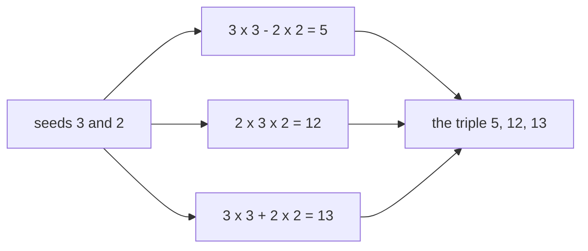

# Pythagorean triples: every whole-number right triangle comes from two smaller numbers

[Syllabus](../../../SYLLABUS.md) → [Number theory](../../../SYLLABUS.md#w02) → [For the Curious](../../../SYLLABUS.md#w02-s07) → Pythagorean triples

---

## General Overview

A builder wants a square corner and has no set square. She pegs out a knotted rope with sides of 3, 4 and 5 knot-lengths. The corner between the 3 and the 4 comes out square. Every time.

Behind the rope is arithmetic: 3 × 3 = 9, 4 × 4 = 16, and 9 + 16 = 25, which is 5 × 5. Three whole numbers where the two smaller ones, multiplied by themselves, add to the biggest multiplied by itself are a **Pythagorean triple**. Why that squares a corner is geometry, a later wing.

The rope has company: 5, 12, 13 works, and so does 8, 15, 17. Not luck.

**Pick two whole numbers, bigger first, and multiply each by itself. The difference of those answers, twice the two numbers multiplied together, and the sum of those answers are always a triple — and every triple comes out of that recipe, scaled up if need be.**

### The picture: seeds in, sides out



The two starting numbers are the **seeds**: 3 and 2 in, 5, 12, 13 out.

---

## The formula

The recipe on the seeds 3 and 2:

**3 × 3 − 2 × 2 = 5    and    2 × 3 × 2 = 12    and    3 × 3 + 2 × 2 = 13**

Those three pass the test: **5 × 5 + 12 × 12 = 25 + 144 = 169 = 13 × 13**

**Read it aloud:** nine take away four is one leg, twice three times two is the other, nine plus four the long side.

| Piece | Plain meaning | With seeds 3 and 2 |
| --- | --- | --- |
| the seeds | the two numbers you start from, bigger first; called m and n in textbooks and in the other cards | 3 and 2 |
| the odd leg | the seeds multiplied by themselves, subtracted ([Exponents](../../01-Foundations/03-Powers%2C%20Roots%20and%20Logarithms/01-exponents-and-powers.md)); odd whenever one seed is odd and one even | 9 − 4 = 5 |
| the even leg | twice the seeds multiplied | 2 × 3 × 2 = 12 |
| the long side | the same two, added | 9 + 4 = 13 |
| primitive | sides sharing no factor but 1, called coprime ([Coprime numbers](../02-Greatest%20Common%20Divisor%20and%20Euclid%27s%20Algorithm/05-coprime-numbers.md)); needs coprime seeds, one odd and one even | 5, 12, 13 |

---

## Why it works

### Step 0: a triple is arithmetic, not a drawing

The rope's whole claim is 9 + 16 = 25. Any three whole numbers passing that test are a triple.

### Step 1: run it

Seeds 3 and 2 give 5, 12, 13; seeds 4 and 1 give 8, 15 and 17; seeds 2 and 1 give the rope.

### Step 2: why it cannot miss

Take the long side and the odd leg, each multiplied by itself, and subtract: 169 − 25 = 144. A second route is sum times difference: (13 + 5) × (13 − 5) = 18 × 8 = 144. It agrees because the brackets multiply out to 13 × 13 + 5 × 13 − 13 × 5 − 5 × 5, and the middle two cancel.

Now read the brackets in seeds: the long side is 9 + 4 and the odd leg 9 − 4, so the sum is 18 and the difference 8 — twice 9 and twice 4. Their product is four lots of 9 × 4, which is the even leg 2 × 3 × 2 multiplied by itself. Nothing about 3 and 2 was used.

### Step 3: one leg is always even

The recipe's even leg is 2 × bigger × smaller, so it is even by construction. Stronger: no triple has two odd legs. An odd number multiplied by itself sits one above a multiple of 4 — 9 and 25 do — so two of them add to an even number sitting 2 above a multiple of 4. The long side would then be even, and even numbers multiplied by themselves are multiples of 4 ([Even and odd](../01-Divisibility%20and%20Primes/02-even-and-odd.md)). But a multiple of 4 is not 2 above a multiple of 4. So two odd legs is impossible.

### Step 4: nothing is missing from the list

A sketch. Copies first: 6, 8, 10 is the rope doubled, so keep to primitive triples ([Coprime numbers](../02-Greatest%20Common%20Divisor%20and%20Euclid%27s%20Algorithm/05-coprime-numbers.md)). Run Step 2 backwards: 12 × 12 = 18 × 8. A primitive triple has one even leg, so the odd leg and the long side are both odd and both brackets halve cleanly: 9 and 4. Those share no factor but 1, and multiply to 6 × 6, half the even leg multiplied by itself. Two coprime numbers whose product is a square are squares themselves ([Euclid's lemma](../02-Greatest%20Common%20Divisor%20and%20Euclid%27s%20Algorithm/06-euclids-lemma.md)): 9 is 3 × 3 and 4 is 2 × 2 — the seeds, recovered.

---

## Worked numbers, by hand

| Step | Arithmetic | Value |
| --- | --- | --- |
| the rope | 3 × 3 + 4 × 4 = 9 + 16 | **25** |
| seeds 3 and 2, three sides | 9 − 4, 2 × 3 × 2, 9 + 4 | **5, 12, 13** |
| the check | 25 + 144 | **169** |
| seeds 4 and 1 | 2 × 4 × 1, 16 − 1, 16 + 1 | **8, 15, 17** |

### What breaks if you drop a piece

| Mistake | Comes out at | What went wrong |
| --- | --- | --- |
| Seeds 3 and 1, both odd | 6, 8, 10 | Shared factor 2: the rope doubled |
| Smaller seed first, 2 and 3 | −5 | A leg goes negative: bigger seed leads |
| Adding sides, not squares | 7 | 3 + 4 is 7; the side is 5 |

The code prints all three.

---

## Code, from first principles, and it actually runs

Nothing comes from a library. The recipe runs on three pairs of seeds. The second road counts up until a leg fits.

### Python

```python
# Pythagorean triples -- the check behind the card.  Nothing is imported.  The
# builder's 3-4-5 rope, then the recipe: two whole numbers, bigger first, giving
# bigger x bigger - smaller x smaller, 2 x bigger x smaller, and the two sums.
def triple(big, small):                  # the recipe, straight off the card
    legs = sorted((big * big - small * small, 2 * big * small))
    return (legs[0], legs[1], big * big + small * small)
def missing_leg(leg, long_side):         # second road: count up until it fits
    other = 1
    while leg * leg + other * other < long_side * long_side:
        other += 1
    return other if leg * leg + other * other == long_side * long_side else 0
def row(name, value): print(f"{name:<44}{value:>24}")
row("the rope: 3 x 3 + 4 x 4", f"{3 * 3} + {4 * 4} = {3 * 3 + 4 * 4} = 5 x 5")
for big, small in ((3, 2), (4, 1), (2, 1)):
    row(f"seeds {big} and {small}: leg, leg, long side", " ".join(str(v) for v in triple(big, small)))
for a, b, c in (triple(3, 2), triple(4, 1)):
    row(f"{a} x {a} + {b} x {b}", f"{a * a} + {b * b} = {a * a + b * b} = {c} x {c}")
a, b, c = triple(3, 2)
row(f"({c} + {a}) x ({c} - {a}) = {c + a} x {c - a}", f"{(c + a) * (c - a)} = {b} x {b}")
row("missing legs by counting up: 5,13 and 8,17", f"{missing_leg(5, 13)} and {missing_leg(8, 17)}")
odd_seeds = triple(3, 1)
share = max(k for k in range(1, 11) if all(v % k == 0 for v in odd_seeds))
row("seeds 3 and 1, both odd", f"{odd_seeds[0]} {odd_seeds[1]} {odd_seeds[2]}, shared factor {share}")
row("adding the sides, not the squares", 3 + 4)
row("smaller seed first, 2 and 3", triple(2, 3)[0])
assert triple(3, 2) == (5, 12, 13) and triple(4, 1) == (8, 15, 17) and triple(2, 1) == (3, 4, 5)
assert missing_leg(5, 13) == 12 and missing_leg(8, 17) == 15 and 25 + 144 == 169
assert triple(3, 1) == (6, 8, 10) and share == 2 and (13 + 5) * (13 - 5) == 144
print("ALL CHECKS PASS")
```

**Ran 2026-09-06 on macOS, Python 3.14.6, standard library only. All checks passed. Output, pasted from the run:**

```
the rope: 3 x 3 + 4 x 4                          9 + 16 = 25 = 5 x 5
seeds 3 and 2: leg, leg, long side                           5 12 13
seeds 4 and 1: leg, leg, long side                           8 15 17
seeds 2 and 1: leg, leg, long side                             3 4 5
5 x 5 + 12 x 12                             25 + 144 = 169 = 13 x 13
8 x 8 + 15 x 15                             64 + 225 = 289 = 17 x 17
(13 + 5) x (13 - 5) = 18 x 8                           144 = 12 x 12
missing legs by counting up: 5,13 and 8,17                 12 and 15
seeds 3 and 1, both odd                      6 8 10, shared factor 2
adding the sides, not the squares                                  7
smaller seed first, 2 and 3                                       -5
ALL CHECKS PASS
```

### Rust

Same numbers, same labels, built with `rustc --edition 2021 -O`.

```rust
// Pythagorean triples -- the same check as pythagorean_triples_check.py, in Rust.
// No crates.  The builder's 3-4-5 rope, then the recipe: two whole numbers,
// bigger first, giving bigger x bigger - smaller x smaller and 2 x bigger x small.
fn triple(big: i64, small: i64) -> (i64, i64, i64) {   // the recipe, as on the card
    let (p, q) = (big * big - small * small, 2 * big * small);
    (p.min(q), p.max(q), big * big + small * small)
}
fn missing_leg(leg: i64, long_side: i64) -> i64 {      // count up until it fits
    let mut other = 1;
    while leg * leg + other * other < long_side * long_side { other += 1; }
    if leg * leg + other * other == long_side * long_side { other } else { 0 }
}
fn row(name: &str, value: &str) { println!("{:<44}{:>24}", name, value); }
fn main() {
    row("the rope: 3 x 3 + 4 x 4", &format!("{} + {} = {} = 5 x 5", 3 * 3, 4 * 4, 3 * 3 + 4 * 4));
    for (big, small) in [(3i64, 2i64), (4, 1), (2, 1)] {
        let (a, b, c) = triple(big, small);
        row(&format!("seeds {} and {}: leg, leg, long side", big, small), &format!("{} {} {}", a, b, c));
    }
    for (a, b, c) in [triple(3, 2), triple(4, 1)] {
        row(&format!("{} x {} + {} x {}", a, a, b, b),
            &format!("{} + {} = {} = {} x {}", a * a, b * b, a * a + b * b, c, c));
    }
    let (a, b, c) = triple(3, 2);
    row(&format!("({} + {}) x ({} - {}) = {} x {}", c, a, c, a, c + a, c - a),
        &format!("{} = {} x {}", (c + a) * (c - a), b, b));
    row("missing legs by counting up: 5,13 and 8,17",
        &format!("{} and {}", missing_leg(5, 13), missing_leg(8, 17)));
    let s = triple(3, 1);
    let share = (1i64..11).filter(|k| [s.0, s.1, s.2].iter().all(|v| v % k == 0)).max().unwrap();
    row("seeds 3 and 1, both odd", &format!("{} {} {}, shared factor {}", s.0, s.1, s.2, share));
    row("adding the sides, not the squares", &(3 + 4).to_string());
    row("smaller seed first, 2 and 3", &triple(2, 3).0.to_string());
    assert!(triple(3, 2) == (5, 12, 13) && triple(4, 1) == (8, 15, 17) && triple(2, 1) == (3, 4, 5));
    assert!(missing_leg(5, 13) == 12 && missing_leg(8, 17) == 15 && 25 + 144 == 169);
    assert!(triple(3, 1) == (6, 8, 10) && share == 2 && (13 + 5) * (13 - 5) == 144);
    println!("ALL CHECKS PASS");
}
```

**Ran 2026-09-06 on macOS, rustc 1.98.1, no crates. All checks passed. Output, pasted from the run:**

```
the rope: 3 x 3 + 4 x 4                          9 + 16 = 25 = 5 x 5
seeds 3 and 2: leg, leg, long side                           5 12 13
seeds 4 and 1: leg, leg, long side                           8 15 17
seeds 2 and 1: leg, leg, long side                             3 4 5
5 x 5 + 12 x 12                             25 + 144 = 169 = 13 x 13
8 x 8 + 15 x 15                             64 + 225 = 289 = 17 x 17
(13 + 5) x (13 - 5) = 18 x 8                           144 = 12 x 12
missing legs by counting up: 5,13 and 8,17                 12 and 15
seeds 3 and 1, both odd                      6 8 10, shared factor 2
adding the sides, not the squares                                  7
smaller seed first, 2 and 3                                       -5
ALL CHECKS PASS
```

> [!TIP]
> **Try changing**
> Guess first, then run it.
> - **New seeds.** Put (5, 2) in the loop instead of (3, 2): the row prints 20 21 29, no assert fires.
> - **Break the recipe.** Drop the 2 from the even leg, leaving big * small: seeds 3 and 2 give 5, 6, 13, and the first assert fires.

---

## The usual mistake

> [!warning]
> **Expecting every right corner to have whole-number sides.** Almost none do. Walk 1 along and 1 up: the way back is not a whole number, nor even a fraction. Triples are the rare cases that fit.
>
> - Seeds must share no factor but 1 **and** be one odd, one even, or you get a scaled copy: 3 and 1 give 6, 8, 10; 6 and 3 give 27, 36, 45 — the rope times 9.
> - The seeds are not the sides. 3 and 2 appear nowhere in 5, 12, 13.

---

## Where you meet it in real life

- **Squaring a corner on site.** Still used: 3 along one wall, 4 along the other, until the diagonal reads 5.
- **Clay tablets.** A Babylonian tablet in the Plimpton collection lists rows that are Pythagorean triples, including 45, 60, 75 — the rope times 15 — long before Euclid.
- **Grids in code.** A step of 3 across and 4 up is exactly 5 away — handy when distances must be whole.

> **Say it back**
> Three whole numbers are a triple when the two smaller ones, multiplied by themselves, add to the biggest multiplied by itself: 9 + 16 = 25, the rope. Every triple comes from two seeds, bigger first: 3 and 2 give 5, 12, 13. One leg is always even. Scale those and you have them all.

---

## What this builds on

- [Exponents](../../01-Foundations/03-Powers%2C%20Roots%20and%20Logarithms/01-exponents-and-powers.md): multiplying a number by itself, under every line.
- [Even and odd](../01-Divisibility%20and%20Primes/02-even-and-odd.md): what odds do under multiplication, hence the even leg.
- [Coprime numbers](../02-Greatest%20Common%20Divisor%20and%20Euclid%27s%20Algorithm/05-coprime-numbers.md): sharing no factor but 1, which makes a triple primitive.
- [Euclid's lemma](../02-Greatest%20Common%20Divisor%20and%20Euclid%27s%20Algorithm/06-euclids-lemma.md): why coprime numbers multiplying to a square are squares.

## Where this goes next

Nothing depends on this card, a detour. The rest of the shelf: [Perfect numbers and Mersenne primes](02-perfect-numbers-and-mersenne.md), [How primes thin out](03-how-primes-thin-out.md), [Goldbach, twin primes and friends](04-goldbach-and-open-problems.md), [Continued fractions](05-continued-fractions-and-leap-years.md).

---

## Sources

Verified 6 Sep 2026; every link resolves.

- Euclid. *Elements*, Book X, Lemma 1 to Proposition 29, c. 300 BC. [D. E. Joyce's edition](https://mathcs.clarku.edu/~djoyce/elements/bookX/propX29.html). This recipe, in the original.
- Silverman, Joseph H. *A Friendly Introduction to Number Theory*. [Author's page, triples chapter free](https://www.math.brown.edu/johsilve/frint.html). Step 4 in full.
- Robson, Eleanor. "Neither Sherlock Holmes nor Babylon: a reassessment of Plimpton 322." *Historia Mathematica*, 2001. [doi:10.1006/hmat.2001.2317](https://doi.org/10.1006/hmat.2001.2317). What the tablet holds.
