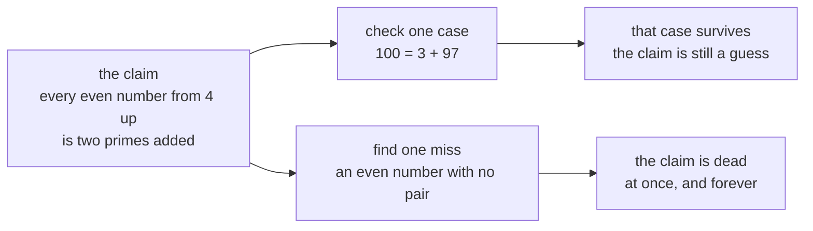

# Goldbach, twin primes and friends: the simple questions nobody has answered

[Syllabus](../../../SYLLABUS.md) → [Number theory](../../../SYLLABUS.md#w02) → [For the Curious](../../../SYLLABUS.md#w02-s07) → Goldbach, twin primes and friends

---

## General Overview

Take 100. Break it into two primes added together — a prime being a whole number above 1 that nothing divides but 1 and itself.

3 + 97. Both prime. That works. So do 11 + 89, 17 + 83, 29 + 71, 41 + 59 and 47 + 53. Six ways, and past the middle they repeat backwards. The neighbours behave too: 98 comes apart 3 ways, 102 comes apart 8 ways.

In 1742 Christian Goldbach and Leonhard Euler traded letters about it: is every even number two primes added together? That wording is Euler's, and nobody has answered it since. Computers have ground through every even number up to 4,000,000,000,000,000,000 — a 4 with eighteen zeros — without one failure. Still not a proof.

**One miss would kill the claim on the spot; no pile of hits will ever prove it.**

### The picture: what would settle it



Either road is open to anyone with a pencil. Only the bottom one finishes.

---

## The formula

Nothing to compute. The work is stating the claim tightly enough to recognise a miss.

**100 = 3 + 97 = 11 + 89 = 17 + 83 = 29 + 71 = 41 + 59 = 47 + 53**

**Read it aloud:** one hundred is two primes added together, six different ways.

Three famous claims, each covering every case:

- **Goldbach.** Every even number from 4 up is two primes added. **Open since 1742.**
- **Twin primes.** Pairs two apart, like 101 and 103, never stop coming. **Open.**
- **The odd cousin.** Every odd number from 7 up is three primes added. **Proved, 2013.**

| Piece | Plain meaning | In our example |
| --- | --- | --- |
| a prime | nothing divides it but 1 and itself | 3, 47, 97, 101, 103 |
| an even number | 2 divides it exactly | 4, 98, 100, 102 |
| a pair | two primes adding to it, smaller first | 3 + 97 |
| a for-all claim | every case, no exceptions | "every even number from 4 up…" |
| a counterexample | one case it gets wrong | an even number with no pair |

---

## Why it works

Nothing below proves Goldbach. The steps show where checking stops paying.

### Step 0: examples are not a proof

Goldbach's sentence covers infinitely many even numbers. Any check covers finitely many, so however long the list of successes, it never becomes the claim.

The other direction is quick. One even number with no pair, and Goldbach is dead. That asymmetry is the grammar of a for-all claim.

### Step 1: the count wobbles, never zero

98 has 3 ways, 100 has 6, 102 has 8. 4 has exactly 1: the pair 2 + 2. No tidy rule, and none is needed — Goldbach claims only that the count is never 0. Bigger numbers have more room, so it drifts upward. That is why nearly everyone believes the claim. Believing is not proving.

### Step 2: the twin claim cannot be checked at all

Goldbach checking does honest work: every even number cleared is a candidate counterexample gone. The twin claim gets no case cleared. Finding 101 and 103 says nothing about further out, and its counterexample would be a number beyond which twins never appear again — which no search can reach. Primes thin out as they climb ([How primes thin out](03-how-primes-thin-out.md)); the tight pairs seem to keep coming.

### Step 3: what has been proved

In 2013 Harald Helfgott proved the odd cousin: every odd number from 7 up is three primes added. The same year Yitang Zhang proved some fixed gap keeps recurring between primes forever, and within a year others had squeezed it to 246. The twin claim is that statement with the gap at 2: a short walk on paper that nobody can make.

---

## Worked numbers, by hand

Walk up the primes, subtract each from 100, ask whether what is left is prime. Stop at the middle: past it the pairs repeat, halves swapped.

| Prime tried | 100 minus it | Prime too? |
| --- | --- | --- |
| 3 | 97 | yes: 3 + 97 |
| 5 | 95 | no: 5 x 19 |
| 11 | 89 | yes: 11 + 89 |
| 17 | 83 | yes: 17 + 83 |
| 29 | 71 | yes: 29 + 71 |
| 41 | 59 | yes: 41 + 59 |
| 47 | 53 | yes: 47 + 53 |
| count them | | **6** |
| same hunt on 98, then 102 | | **3 and 8** |

5 fails and that is fine: Goldbach needs one pair, not all.

### What breaks if you drop a piece

| Mistake | Comes out at | What went wrong |
| --- | --- | --- |
| Counting 3 + 97 and 97 + 3 as two ways | 12 | They mirror at the middle; 100 has 6 |
| Dropping "even": try 11 | 0 | An odd number needs 2 as one prime, and 11 - 2 = 9 is not prime |
| Starting at 2, not 4 | 0 | Two primes added come to at least 4 |

The code prints all three.

---

## Code, from first principles, and it actually runs

Nothing is imported. The pairs of 100 are found the plain way, subtracting each prime in turn, then counted again with a second test of primeness, trial division. The roads have to agree.

### Python

```python
# Goldbach and twin primes -- the check behind the card.  Nothing is imported.
# Two roads to the same counts: a sieve of Eratosthenes to 200, and trial
# division.  House numbers 4, 98, 100, 102, and the twin pair 101 and 103.
flag = [True] * 201                  # road one: the sieve.  flag[m] means "m is prime"
flag[0] = flag[1] = False
for p in range(2, 15):
    if flag[p]:
        for k in range(p * p, 201, p): flag[k] = False
def by_division(n):                  # road two: hunt for a divisor, up to the square root
    d = 2
    while d * d <= n and n % d: d += 1
    return d * d > n
def pairs(n, is_prime):              # every way n = p + q, both prime, smaller one first
    return [(p, n - p) for p in range(2, n // 2 + 1) if is_prime(p) and is_prime(n - p)]

by_sieve = lambda m: flag[m]
six = pairs(100, by_sieve)
for p, q in six: print(f"100 = {p} + {q}")
counts = [len(pairs(n, by_sieve)) for n in (4, 98, 100, 102)]
checked = [len(pairs(n, by_division)) for n in (4, 98, 100, 102)]
twins = [(a, a + 2) for a in range(101, 199) if flag[a] and flag[a + 2]]
print("ways to write it as two primes: 4 has {}, 98 has {}, 100 has {}, 102 has {}".format(*counts))
print("the sieve and trial division agree on all four counts" if counts == checked else "the two roads disagree")
print(f"twin primes just above 100: {twins[0][0]} and {twins[0][1]}")
print("Goldbach checked to 4,000,000,000,000,000,000 by computer (published, not checked here)")
print(f"the three mistakes come out at {2 * len(six)} ordered pairs, {len(pairs(11, by_sieve))} ways for 11, {len(pairs(2, by_sieve))} for 2")
assert six == [(3, 97), (11, 89), (17, 83), (29, 71), (41, 59), (47, 53)]
assert counts == [1, 3, 6, 8] and checked == [1, 3, 6, 8] and all(flag[m] == by_division(m) for m in range(2, 201))
assert twins[0] == (101, 103) and by_division(101) and by_division(103)
print("ALL CHECKS PASS")
```

**Ran 2026-09-06 on macOS, Python 3.14.6, standard library only. All checks passed. Output, pasted from the run:**

```
100 = 3 + 97
100 = 11 + 89
100 = 17 + 83
100 = 29 + 71
100 = 41 + 59
100 = 47 + 53
ways to write it as two primes: 4 has 1, 98 has 3, 100 has 6, 102 has 8
the sieve and trial division agree on all four counts
twin primes just above 100: 101 and 103
Goldbach checked to 4,000,000,000,000,000,000 by computer (published, not checked here)
the three mistakes come out at 12 ordered pairs, 0 ways for 11, 0 for 2
ALL CHECKS PASS
```

### Rust

```rust
// Goldbach and twin primes -- the same check as goldbach_and_open_problems_check.py,
// in Rust.  No crates.  Two roads to the same counts: a sieve of Eratosthenes to
// 200, and trial division.  House numbers 4, 98, 100, 102, and the twins 101 and 103.
fn by_division(n: usize) -> bool {   // road two: hunt for a divisor, up to the square root
    let mut d = 2;
    while d * d <= n && n % d != 0 { d += 1; }
    d * d > n
}
fn pairs(n: usize, is_prime: &dyn Fn(usize) -> bool) -> Vec<(usize, usize)> {
    (2..=n / 2).filter(|&p| is_prime(p) && is_prime(n - p)).map(|p| (p, n - p)).collect()
}
fn main() {
    let mut flag = [true; 201];      // road one: the sieve.  flag[m] means "m is prime"
    flag[0] = false;
    flag[1] = false;
    for p in 2..15 {
        if flag[p] { let mut k = p * p; while k <= 200 { flag[k] = false; k += p; } }
    }
    let by_sieve = |m: usize| flag[m];
    let six = pairs(100, &by_sieve);
    for (p, q) in &six { println!("100 = {} + {}", p, q); }
    let counts: Vec<usize> = [4, 98, 100, 102].iter().map(|&n| pairs(n, &by_sieve).len()).collect();
    let checked: Vec<usize> = [4, 98, 100, 102].iter().map(|&n| pairs(n, &by_division).len()).collect();
    let twins: Vec<(usize, usize)> = (101..199).filter(|&a| flag[a] && flag[a + 2]).map(|a| (a, a + 2)).collect();
    println!("ways to write it as two primes: 4 has {}, 98 has {}, 100 has {}, 102 has {}",
             counts[0], counts[1], counts[2], counts[3]);
    println!("{}", if counts == checked { "the sieve and trial division agree on all four counts" }
                   else { "the two roads disagree" });
    println!("twin primes just above 100: {} and {}", twins[0].0, twins[0].1);
    println!("Goldbach checked to 4,000,000,000,000,000,000 by computer (published, not checked here)");
    println!("the three mistakes come out at {} ordered pairs, {} ways for 11, {} for 2",
             2 * six.len(), pairs(11, &by_sieve).len(), pairs(2, &by_sieve).len());
    assert!(six == vec![(3, 97), (11, 89), (17, 83), (29, 71), (41, 59), (47, 53)]);
    assert!(counts == vec![1, 3, 6, 8] && checked == vec![1, 3, 6, 8] && (2..201).all(|m| flag[m] == by_division(m)));
    assert!(twins[0] == (101, 103) && by_division(101) && by_division(103));
    println!("ALL CHECKS PASS");
}
```

**Ran 2026-09-06 on macOS, rustc 1.98.1, no crates. All checks passed. Output, pasted from the run:**

```
100 = 3 + 97
100 = 11 + 89
100 = 17 + 83
100 = 29 + 71
100 = 41 + 59
100 = 47 + 53
ways to write it as two primes: 4 has 1, 98 has 3, 100 has 6, 102 has 8
the sieve and trial division agree on all four counts
twin primes just above 100: 101 and 103
Goldbach checked to 4,000,000,000,000,000,000 by computer (published, not checked here)
the three mistakes come out at 12 ordered pairs, 0 ways for 11, 0 for 2
ALL CHECKS PASS
```

The two outputs match line for line: whole numbers, nothing to round.

> [!TIP]
> **Try changing**
> Guess first, then run it. The asserts are pinned to the house numbers, so one will fire.
> - **Move the house number.** Ask for the pairs of 102, not 100: eight lines print, still labelled 100 until you change the print too, and the first assert fires.
> - **Break the second road.** Make the trial-division test answer yes to everything: the roads disagree and the second assert fires.

---

## The usual mistake

> [!warning]
> **Treating a big enough check as a proof.** Every even number to 4,000,000,000,000,000,000 has been tried and none failed. That is evidence worth having, and nothing against the infinitely many past it.
>
> - **"The twins have been checked too."** They cannot be. 101 and 103 say nothing about further out, and no finite search could produce that counterexample either.
> - **"Zhang proved the twin conjecture."** He proved some fixed gap recurs forever, and the bound stands at 246. Getting it to 2 is the open part.

---

## Where you meet it in real life

- **Long silences.** A question a child can state has swallowed careers. That is why these are famous.
- **Any claim with "every" in it.** A drug trial, code that must never crash: one counterexample settles it, a thousand clean runs do not — [Negating a quantifier](../../01-Foundations/05-Logic/05-negating-quantifiers-and-counterexamples.md).
- **Prime hunting.** Checking Goldbach runs the machinery of [The sieve of Eratosthenes](../01-Divisibility%20and%20Primes/06-sieve-of-eratosthenes.md); the record hunt in [Perfect numbers and Mersenne primes](02-perfect-numbers-and-mersenne.md) is open at its far end too.

> **Say it back**
> 100 is two primes added six ways: 3 + 97, 11 + 89, 17 + 83, 29 + 71, 41 + 59, 47 + 53. Goldbach's guess is that every even number from 4 up can do that, and computers have checked to 4,000,000,000,000,000,000 without a miss. That proves nothing, because the claim covers every even number and a check covers finitely many. One even number with no pair would end it in a second.

---

## What this builds on

- [The sieve of Eratosthenes](../01-Divisibility%20and%20Primes/06-sieve-of-eratosthenes.md): every prime below a limit, so the code knows what is prime.
- [There are infinitely many primes](../02-Greatest%20Common%20Divisor%20and%20Euclid%27s%20Algorithm/08-infinitude-of-primes.md): the primes never run out — a big prime question that was settled.
- [Quantifiers](../../01-Foundations/05-Logic/04-quantifiers.md): what a sentence starting "every" claims.
- [Negating a quantifier](../../01-Foundations/05-Logic/05-negating-quantifiers-and-counterexamples.md): one counterexample kills it.

## Where this goes next

This shelf is a detour from the main line. The neighbours are [How primes thin out](03-how-primes-thin-out.md) and [Continued fractions](05-continued-fractions-and-leap-years.md), which ends the shelf on a question that has an answer.

---

## Sources

Verified 6 Sep 2026; every link resolves.

- Oliveira e Silva, Tomás, Siegfried Herzog and Silvio Pardi. "Empirical verification of the even Goldbach conjecture and computation of prime gaps up to 4·10<sup>18</sup>." *Mathematics of Computation* 83 (2014), 2033–2060. [doi:10.1090/S0025-5718-2013-02787-1](https://doi.org/10.1090/S0025-5718-2013-02787-1). The checked-to figure.
- Helfgott, Harald A. "The ternary Goldbach conjecture is true." 2013. [arXiv:1312.7748](https://arxiv.org/abs/1312.7748). The odd cousin.
- Zhang, Yitang. "Bounded gaps between primes." *Annals of Mathematics* 179 (2014), 1121–1174. [doi:10.4007/annals.2014.179.3.7](https://doi.org/10.4007/annals.2014.179.3.7). The first gap.
- Polymath, D. H. J. "Variants of the Selberg sieve, and bounded intervals containing many primes." *Research in the Mathematical Sciences* 1, article 12 (2014). [doi:10.1186/s40687-014-0012-7](https://doi.org/10.1186/s40687-014-0012-7). Down to 246.
