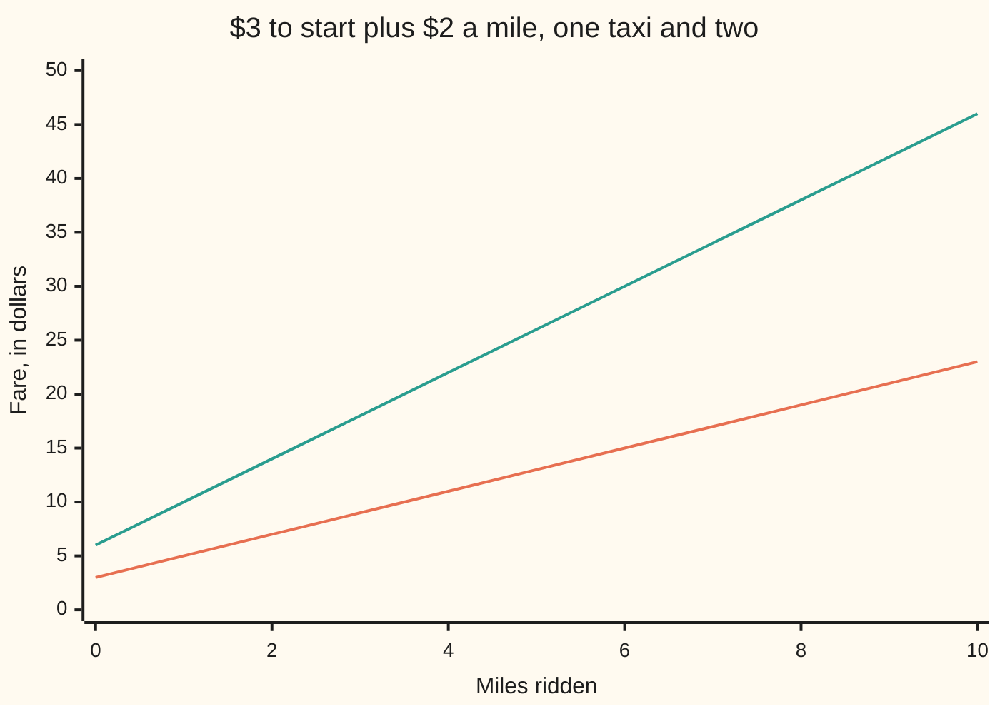
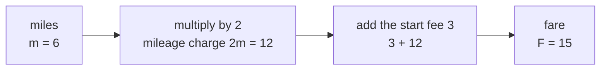

# Letters for numbers: a letter is a number you have not been told yet, and an expression is a recipe that uses one

[Syllabus](../../../SYLLABUS.md) → [Algebra](../../../SYLLABUS.md#w03) → [Letters and Equations](../../../SYLLABUS.md#w03-s01) → Letters for numbers

---

## General Overview

A taxi charges $3 the moment you close the door, then $2 for every mile. Ride 6 miles and the meter reads $15. Ride 10 miles and it reads $23.

One rule made both numbers: three dollars, plus two dollars a mile. Write the number of miles as m and the whole rule fits on one line: 3 + 2m. The 2m means 2 multiplied by m. In algebra a number written up against a letter means multiply, and the multiplication sign is dropped.

3 + 2m is not an answer. It is a recipe. Feed it a number of miles and it hands back a fare. Feed it 6 and $15 comes out. Feed it 10 and $23 comes out. A piece of arithmetic with letters in it and no equals sign is called an **expression**, and that is the word this card uses from here on.

**A letter is a slot for a number, and an expression is the instruction sheet you run once you know what goes in the slot.**

### The picture: one taxi and two, from 0 to 10 miles



The lower line is one taxi, 3 + 2m. The upper line is two taxis on the same trip, 6 + 4m, worked out in Step 2. Neither line starts at zero, because the $3 is charged before the wheels turn.

---

## The formula

The fare, written F, in dollars for a ride of m miles:

$$F = 3 + 2m$$

**Read it aloud:** the fare is three dollars, plus two dollars for every mile.

| Symbol | Plain meaning | In our example | Push it up and the fare… |
| --- | --- | --- | --- |
| $m$ | how many miles the ride is; you choose it | 6 | rises by $2 for each extra mile |
| $2m$ | the mileage charge: 2 multiplied by m | $12 | — |
| $3$ | the start fee, charged once however far you go | $3 | every fare lifts by the same amount, the line slides up |
| $F$ | the fare on the meter | $15 | — |
| $6 + 4m$ | two of these fares added together | $30 | — |
| $2(3 + 2m)$ | the same two fares, written as double one fare | $30 | — |

Each piece separated by a plus or minus sign is a **term**. So 3 + 2m has two terms: the number 3, and the term 2m. The 2 sitting in front of the m is the **coefficient**: how many of that letter you have.

---

## Why it works

### Step 0: the letter hides nothing

m is a slot. Whatever number goes in the slot, the recipe runs the same way and never argues. Put 6 in and 3 + 2m is 15. Put 10 in and it is 23. The letter did not change. Only what you dropped into it changed.

### Step 1: an expression is a recipe, run in order

Putting a number where the letter is and doing the arithmetic is called **substituting**. Two operations, and they happen in a fixed order: multiply first, then add ([Order of operations](../../01-Foundations/01-Everyday%20Arithmetic/04-order-of-operations.md)).



That order is the whole reason 3 + 2m cannot be squashed into 5m. The 2 is glued to the m, not to the 3.

### Step 2: only terms of the same kind can be joined

The 3 is a fixed number of dollars. The 2m is not a number yet: it moves with the miles. Nothing can be added until someone names m, so 3 + 2m stays as it is. That is not an unfinished answer. It is the answer.

Now put two taxis on the same trip. Two fares added:

3 + 2m + 3 + 2m

A sum may be reordered and regrouped freely ([The three rearranging laws](../../01-Foundations/01-Everyday%20Arithmetic/05-arithmetic-laws.md)), so bring the plain numbers together and the m terms together. 3 + 3 is 6. Two lots of 2m is 4 lots of m, so 2m + 2m is 4m. The two fares come to:

6 + 4m

Terms that carry the same letter — or no letter at all — are **like terms**, and joining them is called **collecting**. Only their coefficients are added; the letter is along for the ride. Note what did not happen: 6 and 4m were left apart, because 4m still moves with the miles and 6 does not.

### Step 3: a bracket multiplies everything inside it

Two identical fares is also just double one fare:

$$2(3 + 2m)$$

A bracket means do that part first, and a number written against a bracket multiplies it. Doubling a total is the same as doubling each part of it: double the 3 to get 6, double the 2m to get 4m. So 2(3 + 2m) is 6 + 4m — the same expression Step 2 reached by a different route.

That is the **distributive law**: a multiplier outside a bracket reaches every term inside, one at a time. It is the same law that lets 7 × 23 be done as 7 × 20 plus 7 × 3 ([The three rearranging laws](../../01-Foundations/01-Everyday%20Arithmetic/05-arithmetic-laws.md)); the only new thing is a letter sitting inside the bracket.

At 6 miles: one fare is $15, so two are $30. And 6 + 4 × 6 is 6 + 24, which is $30. The code checks that agreement at every distance from 0 to 20 miles.

### Step 4: the same letter doing two different jobs

On the price list, m stands for any number of miles at all. You pick it. A letter used that way is a **variable**.

Now flip the question. The meter says $15 — how far did the taxi go? Here m is one particular number that already exists in the world, and nobody has told you what it is. A letter used that way is an **unknown**. The card's title means this: a number you have not been told yet.

Trying values finds it. 6 miles gives $15 and no other whole number up to 20 does, which the code confirms. Trying works because the answer is a small whole number, and stops working the moment it is not. Finding an unknown without guessing is [Linear equations](02-linear-equations.md), the next card.

---

## Worked numbers, by hand

A 6-mile ride, then the same trip in two taxis.

| Step | Arithmetic | Value |
| --- | --- | --- |
| the miles | m = 6 | 6 |
| the mileage charge, 2m | 2 × 6 | 12 |
| add the start fee | 3 + 12 | **15** |
| a ten-mile ride instead | 3 + 2 × 10 | **23** |
| two taxis, fares added | 15 + 15 | 30 |
| two taxis, collected: 6 + 4m | 6 + 4 × 6 | 30 |
| two taxis, bracketed: 2(3 + 2m) | 2 × 15 | **30** |

Three ways of writing the two-taxi fare, one number on the meter: $30.

### What breaks if you drop a piece

Every wrong fare below is for the same 6-mile ride, where the meter really reads $15, or $30 for the pair.

| Mistake | Comes out at | What went wrong |
| --- | --- | --- |
| Reading 3 + 2m as 5m | 30 | The 2 belongs to the m, not to the 3; unlike terms were collected |
| Reading 2m as 2 + m | 11 | A number against a letter multiplies, it does not add |
| Reading 2(3 + 2m) as 6 + 2m | 18 | The 2 outside reached the first term only and never reached the 2m |
| Doubling the fare as 3 + 4m | 27 | The start fee is charged by each taxi, so it doubles too |

The code prints all four.

---

## Code, from first principles, and it actually runs

Nothing is imported. The fare is built twice by roads that share no arithmetic: once by the recipe 3 + 2m in a single line, and once by starting at $3 and adding $2 over and over, one mile at a time. Then the two-taxi fare is built three ways — two fares added, the collected form 6 + 4m, the bracketed form 2(3 + 2m) — and the three are compared at every distance from 0 to 20 miles. Last, the unknown: every whole number of miles up to 20 is tried against a $15 meter.

### Python

```python
# Letters for numbers -- the check behind the card.  Nothing is imported.  A
# taxi charges $3 to start plus $2 a mile, so the fare in dollars is 3 + 2m,
# where m is the number of miles.  Every number quoted on the card is printed
# here, and the fare is reached by two roads that share no arithmetic.
START, PER_MILE = 3, 2

def fare(m):                                   # road one: the recipe in one line
    return START + PER_MILE * m

def fare_a_mile_at_a_time(m):                  # road two: add $2, m times over
    total = START
    for _ in range(m):
        total = total + PER_MILE
    return total

def two_taxis_collected(m):                    # two fares, collected: 6 + 4m
    return 6 + 4 * m

def two_taxis_bracketed(m):                    # two fares, bracketed: 2(3 + 2m)
    return 2 * (START + PER_MILE * m)

miles = [0, 2, 4, 6, 8, 10]

def grid(name, values):
    print(f"{name:<24}" + "".join(f"{v:>6}" for v in values))

grid("miles m", miles)
grid("mileage charge, 2m", [PER_MILE * m for m in miles])
grid("one taxi, 3 + 2m", [fare(m) for m in miles])
grid("two taxis, 6 + 4m", [two_taxis_collected(m) for m in miles])
grid("two taxis, 2(3 + 2m)", [two_taxis_bracketed(m) for m in miles])
print(f"fare at m = 6 and at m = 10: {fare(6)} and {fare(10)}")
built = " + ".join([str(START)] + [str(PER_MILE)] * 6)
print(f"a mile at a time, m = 6: {built} = {fare_a_mile_at_a_time(6)}")
print(f"two fares at m = 6: {fare(6)} + {fare(6)} = {fare(6) + fare(6)}, "
      f"collected {two_taxis_collected(6)}, bracketed {two_taxis_bracketed(6)}")
hits = [m for m in range(0, 21) if fare(m) == 15]
print(f"whole miles from 0 to 20 with a fare of 15: {len(hits)}, namely m = {hits[0]}")
wrong = [5 * 6, START + PER_MILE + 6, 6 + PER_MILE * 6, START + 4 * 6]
print(f"the four mistakes at m = 6 come out at "
      f"{wrong[0]}, {wrong[1]}, {wrong[2]} and {wrong[3]}")
assert fare(0) == 3 and fare(6) == 15 and fare(10) == 23
assert all(fare_a_mile_at_a_time(m) == fare(m) for m in range(21))
assert all(two_taxis_collected(m) == two_taxis_bracketed(m) == fare(m) + fare(m)
           for m in range(21))
assert hits == [6] and wrong == [30, 11, 18, 27]
print("ALL CHECKS PASS")
```

**Ran 2026-09-07 on macOS, Python 3.14.6, standard library only. All checks passed. Output, pasted from the run:**

```
miles m                      0     2     4     6     8    10
mileage charge, 2m           0     4     8    12    16    20
one taxi, 3 + 2m             3     7    11    15    19    23
two taxis, 6 + 4m            6    14    22    30    38    46
two taxis, 2(3 + 2m)         6    14    22    30    38    46
fare at m = 6 and at m = 10: 15 and 23
a mile at a time, m = 6: 3 + 2 + 2 + 2 + 2 + 2 + 2 = 15
two fares at m = 6: 15 + 15 = 30, collected 30, bracketed 30
whole miles from 0 to 20 with a fare of 15: 1, namely m = 6
the four mistakes at m = 6 come out at 30, 11, 18 and 27
ALL CHECKS PASS
```

### Rust

Same numbers, same labels, built with `rustc --edition 2021 -O`.

```rust
// Letters for numbers -- the same check as the Python, in Rust.  No crates.  A
// taxi charges $3 to start plus $2 a mile, so the fare in dollars is 3 + 2m,
// where m is the number of miles.  Every number quoted on the card is printed
// here, and the fare is reached by two roads that share no arithmetic.
const START: i64 = 3;
const PER_MILE: i64 = 2;

fn fare(m: i64) -> i64 {                       // road one: the recipe in one line
    START + PER_MILE * m
}

fn fare_a_mile_at_a_time(m: i64) -> i64 {      // road two: add $2, m times over
    let mut total = START;
    for _ in 0..m {
        total = total + PER_MILE;
    }
    total
}

fn two_taxis_collected(m: i64) -> i64 {        // two fares, collected: 6 + 4m
    6 + 4 * m
}

fn two_taxis_bracketed(m: i64) -> i64 {        // two fares, bracketed: 2(3 + 2m)
    2 * (START + PER_MILE * m)
}

fn grid(name: &str, values: &[i64]) {
    let mut line = format!("{:<24}", name);
    for v in values {
        line.push_str(&format!("{:>6}", v));
    }
    println!("{}", line);
}

fn main() {
    let miles: [i64; 6] = [0, 2, 4, 6, 8, 10];
    let charge: Vec<i64> = miles.iter().map(|&m| PER_MILE * m).collect();
    let one: Vec<i64> = miles.iter().map(|&m| fare(m)).collect();
    let two_collected: Vec<i64> = miles.iter().map(|&m| two_taxis_collected(m)).collect();
    let two_bracketed: Vec<i64> = miles.iter().map(|&m| two_taxis_bracketed(m)).collect();
    grid("miles m", &miles);
    grid("mileage charge, 2m", &charge);
    grid("one taxi, 3 + 2m", &one);
    grid("two taxis, 6 + 4m", &two_collected);
    grid("two taxis, 2(3 + 2m)", &two_bracketed);
    println!("fare at m = 6 and at m = 10: {} and {}", fare(6), fare(10));
    let mut parts = vec![START.to_string()];
    for _ in 0..6 {
        parts.push(PER_MILE.to_string());
    }
    println!("a mile at a time, m = 6: {} = {}", parts.join(" + "), fare_a_mile_at_a_time(6));
    println!(
        "two fares at m = 6: {} + {} = {}, collected {}, bracketed {}",
        fare(6), fare(6), fare(6) + fare(6), two_taxis_collected(6), two_taxis_bracketed(6)
    );
    let hits: Vec<i64> = (0..=20).filter(|&m| fare(m) == 15).collect();
    println!(
        "whole miles from 0 to 20 with a fare of 15: {}, namely m = {}",
        hits.len(), hits[0]
    );
    let wrong = [5 * 6, START + PER_MILE + 6, 6 + PER_MILE * 6, START + 4 * 6];
    println!(
        "the four mistakes at m = 6 come out at {}, {}, {} and {}",
        wrong[0], wrong[1], wrong[2], wrong[3]
    );
    assert!(fare(0) == 3 && fare(6) == 15 && fare(10) == 23);
    assert!((0..=20).all(|m| fare_a_mile_at_a_time(m) == fare(m)));
    assert!((0..=20).all(|m| two_taxis_collected(m) == two_taxis_bracketed(m)
        && two_taxis_bracketed(m) == fare(m) + fare(m)));
    assert!(hits == vec![6] && wrong == [30, 11, 18, 27]);
    println!("ALL CHECKS PASS");
}
```

**Ran 2026-09-07 on macOS, rustc 1.98.1, no crates. All checks passed. Output, pasted from the run:**

```
miles m                      0     2     4     6     8    10
mileage charge, 2m           0     4     8    12    16    20
one taxi, 3 + 2m             3     7    11    15    19    23
two taxis, 6 + 4m            6    14    22    30    38    46
two taxis, 2(3 + 2m)         6    14    22    30    38    46
fare at m = 6 and at m = 10: 15 and 23
a mile at a time, m = 6: 3 + 2 + 2 + 2 + 2 + 2 + 2 = 15
two fares at m = 6: 15 + 15 = 30, collected 30, bracketed 30
whole miles from 0 to 20 with a fare of 15: 1, namely m = 6
the four mistakes at m = 6 come out at 30, 11, 18 and 27
ALL CHECKS PASS
```

The two outputs match line for line.

> [!TIP]
> **Try changing**
> Guess first, then run it. An assert is a line that stops the program if a number comes out wrong, and these are pinned to the taxi's numbers, so expect one to stop it.
> - **Raise the start fee.** Set `START` to `5`. Guess the 6-mile fare before you look: it is $17, and the first assert stops the program because that assert holds out for 15.
> - **Break a bracket.** In `two_taxis_bracketed`, change `2 * (START + PER_MILE * m)` to `2 * START + PER_MILE * m`. That is the 2 reaching only the first term. The row prints 18 at 6 miles instead of 30, and the third assert stops the program.
> - **Collect unlike terms.** In `two_taxis_collected`, change `6 + 4 * m` to `5 * m`. At 0 miles the row prints 0 rather than 6, because the start fees were swallowed into the mileage, and the third assert stops the program again.

---

## The usual mistake

> [!warning]
> **Squashing 3 + 2m into 5m.** The 2 is attached to the m, not to the 3, so there is nothing to add. At 6 miles 5m says $30 when the meter says $15. A plain number and a letter-term stay apart: one is fixed, the other moves with m.
>
> - **2m read as 2 + m.** A number written against a letter multiplies. Reading it as an addition gives $11 for the 6-mile ride.
> - **A bracket half-multiplied.** 2(3 + 2m) is 6 + 4m, not 6 + 2m. The half-done version gives $18 for two taxis instead of $30.
> - **Doubling only the part that moves.** Two taxis is 6 + 4m, not 3 + 4m: each cab charges its own start fee. The lazy version gives $27.
> - **Expecting 3 + 2m to reduce to one number.** It does not, and it should not. It is finished until someone tells you the miles.

---

## Where you meet it in real life

- **Any price with a fixed part and a rate.** A phone plan at $20 a month plus 5 cents a minute, a van hire at a day rate plus mileage, electricity at a standing charge plus a per-unit price. All are start fee plus rate, all are one expression.
- **Spreadsheets.** A cell formula is exactly this: a recipe with slots, where the cell reference is the letter. Change the input cell and the recipe re-runs, which is substituting.
- **Code.** A named value in a program is the same idea under a longer name. `miles` is m with more letters in it.
- **One formula, many questions.** Once a rule is written with letters you can turn it around and ask for a different piece of it: that is [Rearranging a formula](03-rearranging-formulas.md). Two rules with two letters at once is [Two equations, two unknowns](04-two-equations-two-unknowns.md).

> **Say it back**
> A letter is a slot where a number goes. An expression is a recipe with slots in it, so 3 + 2m turns miles into a taxi fare: 6 miles gives $15, 10 miles gives $23. Terms of the same kind can be collected and terms of different kinds cannot, which is why two fares come to 6 + 4m and why 3 + 2m stays as it is. A number outside a bracket multiplies everything inside, so 2(3 + 2m) is the same 6 + 4m. And a letter does two jobs: a number you choose, or a number the world already fixed and has not told you yet.

---

## What this builds on

- [The three rearranging laws](../../01-Foundations/01-Everyday%20Arithmetic/05-arithmetic-laws.md): reorder and regroup a sum, and multiply across a bracket — the permissions behind collecting terms and the distributive law.
- [Order of operations](../../01-Foundations/01-Everyday%20Arithmetic/04-order-of-operations.md): multiply before add, which is why 3 + 2m is not (3 + 2)m.
- [Negative numbers](../../01-Foundations/01-Everyday%20Arithmetic/06-negative-numbers.md): how a term is subtracted as well as added, so a discount fits the same expression.

## Where this goes next

- [Linear equations](02-linear-equations.md): finding the unknown without trying every value, by doing the same thing to both sides.
- [Polynomials](../02-Polynomials/01-polynomials.md): expressions where the letter carries powers, collected and bracketed by the same two moves.

---

## Sources

Verified 7 Sep 2026: every link below resolves to the publisher's page.

- *Prealgebra 2e*, section 2.2, "Evaluate, Simplify, and Translate Expressions." OpenStax, Rice University. [Textbook page](https://openstax.org/books/prealgebra-2e/pages/2-2-evaluate-simplify-and-translate-expressions). Substituting into an expression and collecting like terms, in the standard notation.
- *Prealgebra 2e*, section 2.1, "Use the Language of Algebra." OpenStax, Rice University. [Textbook page](https://openstax.org/books/prealgebra-2e/pages/2-1-use-the-language-of-algebra). Variables, terms and coefficients defined from scratch.
- O'Connor, J. J., and E. F. Robertson. "François Viète." MacTutor History of Mathematics Archive, University of St Andrews. [Biography](https://mathshistory.st-andrews.ac.uk/Biographies/Viete/). Viète's 1591 book is where letters first stand for numbers in general, not for one puzzle at a time.
- Cajori, Florian. *A History of Mathematical Notations*. Dover, 1993. [Publisher page](https://store.doverpublications.com/products/9780486677668). Where the dropped multiplication sign and the rest of the symbols came from.
