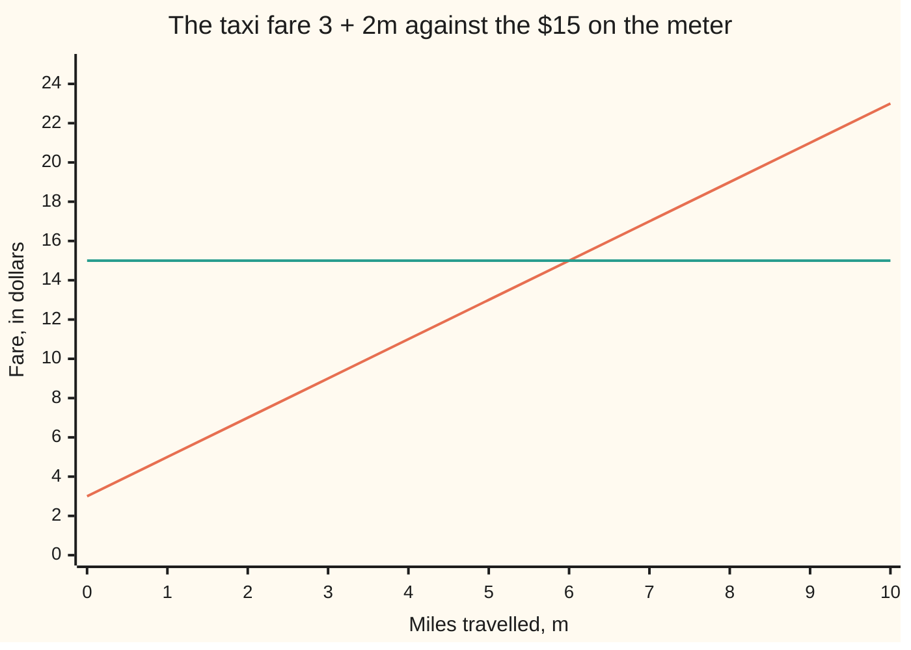

# Linear equations: undo the story step by step, doing the same thing to both sides

[Syllabus](../../../SYLLABUS.md) → [Algebra](../README.md) → [Letters and Equations](../README.md#s01) → Linear equations

---

## General Overview

A taxi charges $3 the moment you get in, then $2 for every mile. Ride 6 miles and the meter reads $15: three dollars, then six lots of two.

Now turn it around. The meter reads $15 and you were not watching the road. How far was the ride?

That question is an equation. The fare recipe is 3 + 2m, where m stands for the miles ([Letters for numbers](01-letters-for-numbers.md)). Set it against the meter and you get 3 + 2m = 15 — a sentence true for one value of m, false for every other. Finding that value is called solving.

The fare was built in two steps: multiply the miles by 2, then add 3. Take it apart in the opposite order. Lift the 3 off both sides and 12 is left, the mileage part. Halve it: 6 miles. One rule protects all of that: whatever you do, do it to both sides.

**An equation is a story about a number nobody told you; solving it is running the story backwards, doing the same thing to both sides at every step so it stays true.**

### The picture: meter against miles



The climbing line is the fare: it starts at 3 before you move, then rises 2 a mile. The flat line is the 15 on the meter. They cross at 6 miles, and the crossing is the answer. Left of it the fare is under 15, right of it over.

---

## The formula

Every equation on this card has one shape: an unknown is multiplied by a number, another number is added, and the total is stated. That shape is what linear means: the unknown is only multiplied and added to, never squared, never under a root. That is why the fare above drew a straight line. In letters:

$$ax + b = c$$

**Read it aloud:** something unknown, multiplied by $a$, with $b$ added on, comes to $c$.

Undo the two steps in reverse order — subtract $b$ from both sides, then divide both sides by $a$ — and the unknown stands alone:

$$x = \frac{c - b}{a}$$

The bar means divide: the top divided by the bottom ([Fractions](../../01-Foundations/01-Everyday%20Arithmetic/07-fractions.md)). It works whenever $a$ is not zero — Step 3 covers the rest.

| Symbol | Plain meaning | In our example | Push it up and the answer… |
| --- | --- | --- | --- |
| $x$ | the unknown, the number you were not told | the miles, written $m$ here | — |
| $a$ | what the unknown is multiplied by | 2, the dollars per mile | shrinks: fewer miles fit in the same fare |
| $b$ | what is added on top, whatever the unknown turns out to be | 3, the dollars charged before you move | shrinks: more of the fare goes before the wheels turn |
| $c$ | the total the equation lands on | 15, the meter reading in dollars | grows: a bigger fare is a longer ride |
| $m$ | this card's unknown, the miles | 6 | — |

Our taxi is that shape with $a$ = 2, $b$ = 3, $c$ = 15, and the unknown named $m$ because it counts miles: 2m + 3 = 15. Writing the fare as 3 + 2m or 2m + 3 changes nothing.

One more sign, from [The number line and inequalities](../../01-Foundations/02-The%20Number%20Line/02-number-line-and-inequalities.md): < means less than, its small end pointing at the smaller side. So 2m + 3 < 15 says the fare stays under fifteen.

---

## Why it works

### Step 0: both sides move together or not at all

An equation is two descriptions of one number: the fare 3 + 2m and the meter's 15 are the same money. Picture a balance scale, fare in the left pan, 15 in the right, level.

Take 3 off the left pan alone and it tips — the sentence has stopped being true. Take 3 off both pans and it stays level. Every step below is one use of that. Drop the scale now and say it plainly: do the same thing to both sides.

Four moves keep an equation true: add the same number to both sides, subtract it from both, multiply both by it, or divide both by it, so long as that number is not zero.

### Step 1: undo the story backwards

3 + 2m says: take the miles, multiply by 2, add 3. Two steps, in that order; the equation adds a third fact — the result was 15. Undo them last step first. The last thing done was adding 3, so subtract 3 from both sides:

2m + 3 − 3 = 15 − 3, which is 2m = 12.

Now the last thing done is multiplying by 2, so divide both sides by 2:

2m ÷ 2 = 12 ÷ 2, which is m = 6.

Six miles. Shoes and socks: the shoes went on last, so they come off first.

### Step 2: put the answer back in

Solving can go wrong quietly. Checking cannot. Take the 6 back to the recipe: 3 + 2 × 6 = 3 + 12 = 15. That is the meter reading, so 6 is right.

Putting a number where the letter was is called substitution ([Letters for numbers](01-letters-for-numbers.md)). It is the habit worth keeping: a dropped minus sign shows up in seconds.

A 45-dollar fare goes the same way: 45 − 3 = 42, halve, 21 miles. Check: 3 + 2 × 21 = 45.

### Step 3: when the unknown disappears

Two moments look like failure and are not.

A rival taxi charges 5 to start and the same 2 a mile. When do the fares match? 3 + 2m = 5 + 2m. Subtract 2m from both sides and the miles are gone: 3 = 5. False whatever m is, so there is no answer. The fares sit 2 apart forever.

Now the same taxi, billed as 3 to start plus 1 a mile plus another 1 a mile: 3 + m + m = 3 + 2m. Strip both sides down and you reach 0 = 0. True whatever m is, so every number works. Both sides were one recipe in different clothes.

The tell is the same either way: the unknown cancels and a plain number faces a plain number. False, no answer. True, every number.

### Step 4: less than, and the one place the sign flips

Change the question from "what was the fare" to "what can I afford". You have 15 dollars. Staying under it means 2m + 3 < 15: two times the miles, plus three, is less than fifteen.

Solve it exactly as before. Subtract 3 from both sides: 2m < 12. Halve both sides: m < 6. Anything under 6 miles keeps the fare under 15. At exactly 6 the fare is 15 — the boundary, not an answer to "under".

One thing behaves differently. Multiplying or dividing an inequality by a negative reverses the sign.

Trace the change in your pocket. Out of 15 dollars you keep 15 − (3 + 2m), which is 12 − 2m. Keeping anything means 12 − 2m > 0. Take 12 off both sides: −2m > −12. Divide by −2 and flip: m < 6. The same answer, from the other direction.

Why it flips: 4 is bigger than 3, but −4 is smaller than −3. A negative multiply reflects both numbers across zero on the number line ([The number line and inequalities](../../01-Foundations/02-The%20Number%20Line/02-number-line-and-inequalities.md)), so whichever was ahead is now behind. Adding and subtracting flip nothing.

Another route to the same 6: rearrange the recipe itself into m = (fare − 3) ÷ 2 — [Rearranging a formula](03-rearranging-formulas.md). When two unknowns turn up at once, one equation cannot pin both down; [Two equations, two unknowns](04-two-equations-two-unknowns.md) handles that.

---

## Worked numbers, by hand

The 15-dollar meter, in full.

| Step | Arithmetic | Value |
| --- | --- | --- |
| the recipe | 3 + 2m, m the miles | the fare, in dollars |
| the equation | fare against the meter | 2m + 3 = 15 |
| take the 3 off both sides | 15 − 3 | 2m = 12 |
| halve both sides | 12 ÷ 2 | **m = 6** |
| check by substituting | 3 + 2 × 6 | 15, the meter reading |
| a 45-dollar fare, same steps | (45 − 3) ÷ 2 | **m = 21** |
| check | 3 + 2 × 21 | 45 |
| staying under 15 dollars | 2m + 3 < 15, same steps | **m < 6** |

The same two undo steps read 21 miles off a 45-dollar fare, and turn "under 15 dollars" into "under 6 miles".

### What breaks if you drop a piece

| Mistake | Comes out at | What went wrong |
| --- | --- | --- |
| Halving before the 3 comes off | m = 4.5 | Wrong order. The 3 is not charged per mile, so it cannot be halved. Check: 3 + 2 × 4.5 = 12, not 15 |
| Taking the 3 off the left side only | m = 7.5 | The right side never moved, so 2m = 15 is a different sentence from 2m + 3 = 15 |
| Dividing −2m > −12 by −2 without flipping | m > 6 | The sign reverses when both sides cross zero. Unflipped it calls 7 miles affordable; at 7 miles the fare is 17 |

The code prints all three.

---

## Code, from first principles, and it actually runs

Nothing is imported. The code takes two roads to the same 6. The first undoes the equation: subtract the 3, halve what is left. The second runs backwards — pick an answer, push it through the fare recipe, solve the equation that comes out, and see whether it lands back where it started. Both roads run on the 15-dollar fare and the 45-dollar one. The no-answer case, the every-number case, the flip and the table's three wrong answers are printed too.

### Python

```python
# Linear equations -- the check behind the card.  Nothing is imported.  A taxi
# charges $3 to start plus $2 a mile, so the fare in dollars is 3 + 2m.  Every
# equation here is solved by undoing: subtract the 3 from both sides, then
# halve both sides.  A second road builds an equation from an answer picked
# first, then solves it back and must land on the answer it started from.
A, B = 2.0, 3.0                    # $2 a mile, $3 to start: fare = A*m + B

def fare(m):                       # the recipe, run forwards
    return A * m + B

def solve(a, b, c):                # a*x + b = c, undone in reverse order
    if a == 0:                     # the unknown has vanished from both sides
        return "every" if b == c else None
    return (c - b) / a             # subtract b from both sides, then divide by a

def n(v):                          # 6.0 prints as 6, 4.5 as 4.5
    return f"{v:g}"

def grid(name, values):
    print(f"{name:<32}" + "".join(f"{v:>5}" for v in values))

miles = [0.0, 1.0, 2.0, 3.0, 4.0, 5.0, 6.0, 7.0, 8.0, 9.0, 10.0]
grid("miles m", [n(m) for m in miles])
grid("fare 3 + 2m, in dollars", [n(fare(m)) for m in miles])
grid("the $15 target", [n(15.0) for _ in miles])
for c in (15.0, 45.0):             # one road: undo the two steps
    m = solve(A, B, c)
    print(f"2m + 3 = {n(c)}  ->  subtract 3: 2m = {n(c - B)},  halve: m = {n(m)},"
          f"  check: 3 + 2({n(m)}) = {n(fare(m))}")
for want in (6.0, 21.0):           # second road: build it from a known answer
    print(f"built from a known answer: m = {n(want)} gives fare {n(fare(want))},"
          f" solved back to m = {n(solve(A, B, fare(want)))}")
limit = solve(A, B, 15.0)
print(f"staying under $15: 2m + 3 < 15  ->  m < {n(limit)}; at m = 5 the fare is"
      f" {n(fare(5.0))}, at m = 7 it is {n(fare(7.0))}")
flip = solve(-A, 0.0, -12.0)       # 12 - 2m > 0 becomes -2m > -12
print(f"money left out of $15: 12 - 2m > 0  ->  -2m > -12  ->  m < {n(flip)} after the flip")
no_answer = solve(0.0, 3.0, 5.0)   # 3 + 2m = 5 + 2m, the 2m taken off both sides
every = solve(0.0, 0.0, 0.0)       # 3 + m + m = 3 + 2m, everything taken off
print("3 + 2m = 5 + 2m  ->  3 = 5, false: no answer")
print("3 + m + m = 3 + 2m  ->  0 = 0, true: every number works")
halved_first = 15.0 / A - B        # halving before the 3 comes off
one_side = 15.0 / A                # the 3 taken off the left side only
print(f"the three mistakes come out at {n(halved_first)}, {n(one_side)} and m > 6")
assert solve(A, B, 15.0) == 6.0 and solve(A, B, 45.0) == 21.0
assert solve(A, B, fare(6.0)) == 6.0 and solve(A, B, fare(21.0)) == 21.0
assert no_answer is None and every == "every" and flip == 6.0
assert fare(5.0) == 13.0 and fare(7.0) == 17.0 and halved_first == 4.5 and one_side == 7.5
print("ALL CHECKS PASS")
```

**Ran 2026-09-07 on macOS, Python 3.14.6, standard library only. All checks passed. Output, pasted from the run:**

```
miles m                             0    1    2    3    4    5    6    7    8    9   10
fare 3 + 2m, in dollars             3    5    7    9   11   13   15   17   19   21   23
the $15 target                     15   15   15   15   15   15   15   15   15   15   15
2m + 3 = 15  ->  subtract 3: 2m = 12,  halve: m = 6,  check: 3 + 2(6) = 15
2m + 3 = 45  ->  subtract 3: 2m = 42,  halve: m = 21,  check: 3 + 2(21) = 45
built from a known answer: m = 6 gives fare 15, solved back to m = 6
built from a known answer: m = 21 gives fare 45, solved back to m = 21
staying under $15: 2m + 3 < 15  ->  m < 6; at m = 5 the fare is 13, at m = 7 it is 17
money left out of $15: 12 - 2m > 0  ->  -2m > -12  ->  m < 6 after the flip
3 + 2m = 5 + 2m  ->  3 = 5, false: no answer
3 + m + m = 3 + 2m  ->  0 = 0, true: every number works
the three mistakes come out at 4.5, 7.5 and m > 6
ALL CHECKS PASS
```

### Rust

Same numbers, same labels, built with `rustc --edition 2021 -O`.

```rust
// Linear equations -- the same check as the Python, in Rust.  No crates.  A taxi
// charges $3 to start plus $2 a mile, so the fare in dollars is 3 + 2m.  Every
// equation here is solved by undoing: subtract the 3 from both sides, then
// halve both sides.  A second road builds an equation from an answer picked
// first, then solves it back and must land on the answer it started from.
const A: f64 = 2.0; // $2 a mile
const B: f64 = 3.0; // $3 to start: fare = A*m + B

enum Sol { One(f64), Every, None }          // what solving an equation can hand back

fn fare(m: f64) -> f64 { A * m + B }        // the recipe, run forwards

fn solve(a: f64, b: f64, c: f64) -> Sol {   // a*x + b = c, undone in reverse order
    if a == 0.0 {                           // the unknown has vanished from both sides
        if b == c { Sol::Every } else { Sol::None }
    } else {
        Sol::One((c - b) / a)               // subtract b from both sides, then divide by a
    }
}

fn x(s: Sol) -> f64 {                       // the one answer, when there is exactly one
    match s { Sol::One(v) => v, _ => panic!("expected one answer") }
}

fn n(v: f64) -> String { format!("{}", v) } // 6.0 prints as 6, 4.5 as 4.5

fn grid(name: &str, values: &[String]) {
    let mut line = format!("{:<32}", name);
    for v in values { line.push_str(&format!("{:>5}", v)); }
    println!("{}", line);
}

fn main() {
    let miles: Vec<f64> = (0..=10).map(|m| m as f64).collect();
    grid("miles m", &miles.iter().map(|m| n(*m)).collect::<Vec<String>>());
    grid("fare 3 + 2m, in dollars", &miles.iter().map(|m| n(fare(*m))).collect::<Vec<String>>());
    grid("the $15 target", &miles.iter().map(|_| n(15.0)).collect::<Vec<String>>());
    for c in [15.0, 45.0] {                 // one road: undo the two steps
        let m = x(solve(A, B, c));
        println!("2m + 3 = {}  ->  subtract 3: 2m = {},  halve: m = {},  check: 3 + 2({}) = {}",
                 n(c), n(c - B), n(m), n(m), n(fare(m)));
    }
    for want in [6.0, 21.0] {               // second road: build it from a known answer
        println!("built from a known answer: m = {} gives fare {}, solved back to m = {}",
                 n(want), n(fare(want)), n(x(solve(A, B, fare(want)))));
    }
    let limit = x(solve(A, B, 15.0));
    println!("staying under $15: 2m + 3 < 15  ->  m < {}; at m = 5 the fare is {}, at m = 7 it is {}",
             n(limit), n(fare(5.0)), n(fare(7.0)));
    let flip = x(solve(-A, 0.0, -12.0));    // 12 - 2m > 0 becomes -2m > -12
    println!("money left out of $15: 12 - 2m > 0  ->  -2m > -12  ->  m < {} after the flip", n(flip));
    let no_answer = matches!(solve(0.0, 3.0, 5.0), Sol::None);  // 3 + 2m = 5 + 2m
    let every = matches!(solve(0.0, 0.0, 0.0), Sol::Every);     // 3 + m + m = 3 + 2m
    println!("3 + 2m = 5 + 2m  ->  3 = 5, false: no answer");
    println!("3 + m + m = 3 + 2m  ->  0 = 0, true: every number works");
    let halved_first = 15.0 / A - B;        // halving before the 3 comes off
    let one_side = 15.0 / A;                // the 3 taken off the left side only
    println!("the three mistakes come out at {}, {} and m > 6", n(halved_first), n(one_side));
    assert!(x(solve(A, B, 15.0)) == 6.0 && x(solve(A, B, 45.0)) == 21.0);
    assert!(x(solve(A, B, fare(6.0))) == 6.0 && x(solve(A, B, fare(21.0))) == 21.0);
    assert!(no_answer && every && flip == 6.0);
    assert!(fare(5.0) == 13.0 && fare(7.0) == 17.0 && halved_first == 4.5 && one_side == 7.5);
    println!("ALL CHECKS PASS");
}
```

**Ran 2026-09-07 on macOS, rustc 1.98.1, no crates. All checks passed. Output, pasted from the run:**

```
miles m                             0    1    2    3    4    5    6    7    8    9   10
fare 3 + 2m, in dollars             3    5    7    9   11   13   15   17   19   21   23
the $15 target                     15   15   15   15   15   15   15   15   15   15   15
2m + 3 = 15  ->  subtract 3: 2m = 12,  halve: m = 6,  check: 3 + 2(6) = 15
2m + 3 = 45  ->  subtract 3: 2m = 42,  halve: m = 21,  check: 3 + 2(21) = 45
built from a known answer: m = 6 gives fare 15, solved back to m = 6
built from a known answer: m = 21 gives fare 45, solved back to m = 21
staying under $15: 2m + 3 < 15  ->  m < 6; at m = 5 the fare is 13, at m = 7 it is 17
money left out of $15: 12 - 2m > 0  ->  -2m > -12  ->  m < 6 after the flip
3 + 2m = 5 + 2m  ->  3 = 5, false: no answer
3 + m + m = 3 + 2m  ->  0 = 0, true: every number works
the three mistakes come out at 4.5, 7.5 and m > 6
ALL CHECKS PASS
```

The two outputs match line for line.

> [!TIP]
> **Try changing**
> Guess first, then run it. An assert is a line that halts the program when a number comes out wrong, and these are pinned to this taxi's numbers, so expect a halt.
> - **Make the first three dollars free.** Set `B` to `0.0`. Nothing is added on top, so nothing comes off: 2m = 15 straight away, and 15 dollars buys 7.5 miles — the table's wrong answer, now the right one for a different taxi. The first assert halts it.
> - **Overcharge the meter.** In `fare`, return `4.0 * m + B`. Solving still says 6, but the substitution check now reads 27, and the return road goes 6, fare 27, back to 12. The second assert halts it.

---

## The usual mistake

> [!warning]
> **Moving a term across the equals sign and flipping its sign.** It is a memory trick standing in for the real move, and misremembered it leaves nothing to fall back on. The honest version: subtract the same thing from both sides. In 2m + 3 = 15 the 3 travels nowhere. It is subtracted from the left, which forces the same subtraction on the right, leaving 15 − 3 = 12.
>
> - Undoing in the wrong order. Halve first and the answer is 4.5 miles, a fare of 12, not 15.
> - Reading a vanished unknown as a blunder. 3 = 5 means no answer, 0 = 0 means every number works. Both are results.
> - Dividing an inequality by a negative and leaving the sign alone. −2m > −12 becomes m < 6, never m > 6.
> - Skipping the check. One substitution, 3 + 2 × 6 = 15, catches most slips.

---

## Where you meet it in real life

- **Any bill with a standing charge.** Taxis, plumbers, electricity, a phone plan with a monthly fee plus usage: a fixed part plus a rate times an amount. Read the total, solve for the amount.
- **Budgets and limits.** "How far can I go on 15 dollars" is the inequality, not the equation. Its answer is a range with a boundary, m < 6.
- **Break-even.** Two pricing rules set equal, to find where one gets cheaper. Rules climbing at the same rate never meet — the no-answer case doing real work.

> **Say it back**
> A linear equation is a sentence about one unknown number: the miles were multiplied by 2, then 3 was added, and the result was 15. Solving it means undoing those steps in reverse order — take off the 3, then halve — doing the same thing to both sides so the sentence stays true. That gives 6 miles, and putting 6 back into 3 + 2m returns 15, which proves it. If the unknown cancels you land on a plain claim: 3 = 5 means no answer, 0 = 0 means every number works. Inequalities go the same way, with one extra rule: multiplying or dividing by a negative flips the sign, so −2m > −12 becomes m < 6.

---

## What this builds on

- [Letters for numbers](01-letters-for-numbers.md): why 3 + 2m is a recipe for the fare, and what substituting into it means.
- [The number line and inequalities](../../01-Foundations/02-The%20Number%20Line/02-number-line-and-inequalities.md): less-than and greater-than, and why crossing zero reverses which is bigger.
- [Fractions](../../01-Foundations/01-Everyday%20Arithmetic/07-fractions.md): dividing both sides, and reading (c − b) ÷ a as a fraction.

## Where this goes next

- [Rearranging a formula](03-rearranging-formulas.md): solve the fare recipe once for m and every fare is answered in one line.
- [Two equations, two unknowns](04-two-equations-two-unknowns.md): what to do when two numbers are unknown at once.

---

## Sources

Verified 7 Sep 2026; every link below resolves to the publisher's page.

- *Elementary Algebra 2e*, section 2.2, "Solve Equations using the Division and Multiplication Properties of Equality." OpenStax. [Textbook page](https://openstax.org/books/elementary-algebra-2e/pages/2-2-solve-equations-using-the-division-and-multiplication-properties-of-equality). The both-sides rule at length.
- *Elementary Algebra 2e*, section 2.7, "Solve Linear Inequalities." OpenStax. [Textbook page](https://openstax.org/books/elementary-algebra-2e/pages/2-7-solve-linear-inequalities). Where the negative-multiply flip is drilled.
- Lang, Serge. *Basic Mathematics*. Springer, 1988. [Publisher page](https://link.springer.com/book/9780387967875). Linear equations built up from the arithmetic laws.
- O'Connor, J. J., and E. F. Robertson. "Al-Khwarizmi." MacTutor History of Mathematics Archive, St Andrews. [Biography](https://mathshistory.st-andrews.ac.uk/Biographies/Al-Khwarizmi/). The ninth-century book on balancing equations that gave algebra its name.
