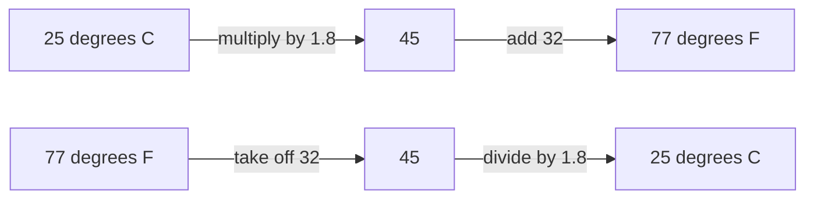
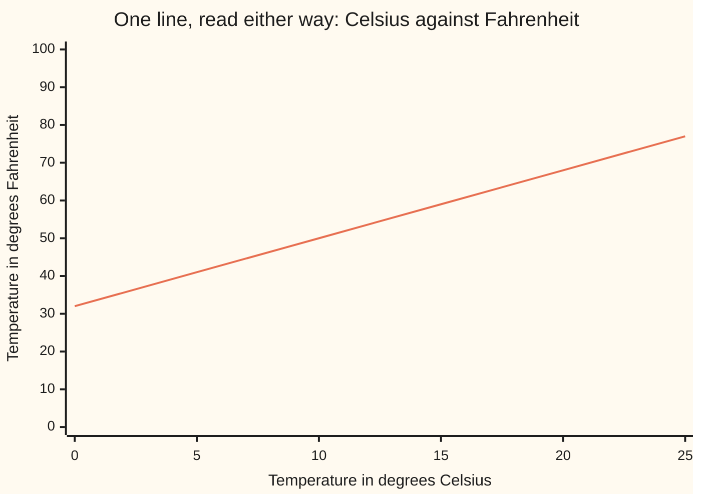

# Rearranging a formula: making a different letter the subject, so one formula answers many questions

[Syllabus](../../../SYLLABUS.md) → [Algebra](../../../SYLLABUS.md#w03) → [Letters and Equations](../../../SYLLABUS.md#w03-s01) → Rearranging a formula

---

## General Overview

A friend in Chicago texts that it is 77 degrees there. Your phone is set to Celsius, so the number tells you nothing. Warm? Hot?

The rule you half remember runs the wrong way. Take the Celsius number, multiply it by 1.8, add 32, and out comes the Fahrenheit number. It turns 25 into 77. You have the 77 and you want the 25.

You do not need a second rule. The one you have already holds the answer; it is pointed the wrong way. Run its two steps backwards, each one undone: take off the 32, then divide by 1.8. Feed it 77 and out comes 25. Chicago is at 25 degrees Celsius, which is a nice day.

The letter a formula hands you — the one sitting alone on one side — is called the **subject**. Fahrenheit was the subject; now Celsius is. Nothing about the relationship moved.

**A formula is one relationship between its letters, not one calculation, and rearranging it picks which letter it hands back.**

### The picture: the same two steps, forwards and backwards



The top row builds. The bottom row undoes: the same two steps, in reverse order, each swapped for its opposite. The 45 in the middle is the same 45 both times.

---

## The formula

Write $F$ for the Fahrenheit number and $C$ for the Celsius one — letters standing for numbers nobody has told you yet, as on [Letters for numbers](01-letters-for-numbers.md). The rule is:

$$F = 1.8C + 32$$

**Read it aloud:** every Celsius degree is worth 1.8 Fahrenheit degrees, and the two scales start 32 apart, so multiply then add.

The last two rows of the table are this shelf's taxi: $3 to start plus $2 a mile, so the fare is 3 + 2m, where $m$ is the miles.

| Symbol | Plain meaning | In our example | Push it up and the answer… |
| --- | --- | --- | --- |
| $F$ | the temperature in degrees Fahrenheit | 77 | the Celsius answer rises with it |
| $C$ | the same temperature in degrees Celsius | 25 | the Fahrenheit answer rises 1.8 times as fast |
| $1.8$ | Fahrenheit degrees per Celsius degree, a rate ([Ratios and rates](../../01-Foundations/01-Everyday%20Arithmetic/09-ratios-and-rates.md)) | 1.8, always | the two scales pull apart faster |
| $32$ | how far apart the scales start: 0 degrees C is 32 degrees F | 32, always | every Fahrenheit reading shifts up by the same amount |
| $m$ | miles travelled in the taxi | 5 | the fare rises $2 a mile |
| fare | what the taxi charges for the trip | $13.00 | the mileage it stands for rises |

Rearranged, with Celsius as the subject:

$$C = (F - 32) / 1.8$$

**Read it aloud:** take off the 32 the scales start apart, then share what is left out at 1.8 Fahrenheit degrees per Celsius degree.

The taxi behaves the same way. Make $m$ the subject and the meter reads backwards: m = (fare − 3) / 2. A $13.00 fare is 5 miles.

---

## Why it works

### Step 0: an equals sign is a promise, and both sides must keep it

$F = 1.8C + 32$ says the left side and the right side are the same number. Do the identical thing to both sides — take 32 off both, halve both, divide both by 1.8 — and they are still the same number. The promise holds. That is the entire permission slip, and [Linear equations](02-linear-equations.md) is where it gets earned. Nothing about it changes when the other side has letters in it instead of numbers.

### Step 1: read the steps that built the formula, in order

Start with $C$. Multiply by 1.8. Add 32. Two steps, in that order, because multiplying comes before adding when you work a formula out.

### Step 2: undo them in reverse order, last step first

Socks then shoes going on; shoes then socks coming off. The last thing done to $C$ was adding 32, so it is the first thing undone.

Take 32 off both sides:

$$F - 32 = 1.8C$$

Divide both sides by 1.8:

$$(F - 32) / 1.8 = C$$

### Step 3: the lone letter is the subject

$C$ now stands by itself, so write it on the left: $C = (F - 32) / 1.8$. The brackets are load-bearing. They say the subtraction finishes before the division starts, because that is the order the undoing has to happen in.

<details>
<summary>The same three lines, with the move named each time</summary>

$F = 1.8C + 32$ — the formula as given.
$F - 32 = 1.8C + 32 - 32$ — take 32 off **both** sides. On the right, $+32 - 32$ is nothing, so the 32 goes.
$F - 32 = 1.8C$ — tidy.
$(F - 32) / 1.8 = 1.8C / 1.8$ — divide **both** sides by 1.8. On the right, multiplying by 1.8 and then dividing by 1.8 leaves $C$ alone.
$(F - 32) / 1.8 = C$ — done. Flip the sides to read it forwards.

</details>

<details>
<summary>When the letter you want is squared, or raised to a power</summary>

A square is undone by a square root ([Roots](../../01-Foundations/03-Powers%2C%20Roots%20and%20Logarithms/03-roots-and-fractional-exponents.md)). The area of a circle is 3.14159… × radius × radius. Make the radius the subject: radius = the square root of (area / 3.14159…). A round rug of area 12.00 square feet has a radius of 1.9544 feet, so it is a little under four feet across.
Compound interest is the same move with a bigger power. A = P × (1 + r)^n, where P is the money put in, r the yearly rate, n the years and A the balance at the end. Solve it for the rate: r = (A / P)^(1/n) − 1, the n-th root undoing the n-th power. $100.00 that reached $162.89 in 10 years grew at 5.00% a year.

</details>

### The other route: put the number in first

You can skip rearranging. Write 77 = 1.8C + 32 and solve that single equation, exactly as [Linear equations](02-linear-equations.md) does: take off 32, divide by 1.8, C = 25. Same two undo steps, same answer.

The difference is how far the work goes. Solving with the number already in answers one question. Rearranging answers every question of that shape, once and for all. For one temperature, either way works. For a column of them, rearrange first.

---

## Worked numbers, by hand

| Step | Arithmetic | Value |
| --- | --- | --- |
| forwards, multiply | 1.8 × 25 | 45 |
| forwards, add | 45 + 32 | **77** |
| backwards, take off 32 | 77 − 32 | 45 |
| backwards, divide | 45 / 1.8 | **25** |
| taxi, take off the flagfall | 13.00 − 3 | 10.00 |
| taxi, divide by the rate per mile | 10.00 / 2 | **5** |

77 degrees Fahrenheit is 25 degrees Celsius, and a $13.00 taxi fare bought 5 miles. Both answers came out of a formula that was written to run the other way.

The same line drawn once answers both directions at once: pick a Celsius reading along the bottom and read the Fahrenheit off the side, or pick a Fahrenheit reading on the side and read the Celsius off the bottom.



The single line is F = 1.8C + 32. Chicago's day sits at 25 along the bottom and 77 up the side; the rearranged formula is that same point found from the other axis.

### What breaks if you drop a piece

| Mistake | Comes out at | What went wrong |
| --- | --- | --- |
| Dividing by 1.8 before taking off the 32 | 10.78 | The steps were undone in the order they were built, not in reverse |
| Losing the brackets: F − 32 / 1.8 | 59.22 | Only the 32 got divided. The whole of F − 32 has to be |
| Undoing the +32 with another +32 | 60.56 | The formula added 32, so the undo takes it off |
| Taxi: dividing the whole 13.00 fare by 2 | 6.5 miles | The 3 flagfall was never taken off, and it is not per mile |

The code prints all four.

---

## Code, from first principles, and it actually runs

Nothing is imported. One road is the rearranged formula: take off 32, divide by 1.8. The second road never rearranges anything at all — it feeds guesses of Celsius into the original formula and halves its range each time until the Fahrenheit comes out at 77. That is a root finder, written out from scratch. If the rearranging were wrong, the two roads would part company. The taxi both ways, the three wrong turnings, and the rug and the interest rate from the tip above are printed too.

### Python

```python
# Rearranging a formula -- the check behind the card.  Nothing is imported.
# F = 1.8C + 32 turns 25 degrees C into 77 degrees F.  Rearranged,
# C = (F - 32) / 1.8 turns 77 back into 25.  Two roads reach that 25: the
# rearranged formula, and a hunt that never rearranges anything at all.
SLOPE, OFFSET = 1.8, 32.0                      # the two numbers in F = 1.8C + 32

def to_f(c): return SLOPE * c + OFFSET         # the formula as it is written
def to_c(f): return (f - OFFSET) / SLOPE       # road one: the rearranged formula

def hunt(f):                                   # road two: no rearranging at all
    lo, hi = -100.0, 200.0                     # the Celsius number is in here
    for _ in range(200):                       # halve the range, 200 times over
        mid = (lo + hi) / 2
        if to_f(mid) < f: lo = mid             # too cold, keep the upper half
        else: hi = mid                         # too warm, keep the lower half
    return (lo + hi) / 2

def fare(m): return 3.0 + 2.0 * m              # the taxi: $3 to start, $2 a mile
def miles(f): return (f - 3.0) / 2.0           # the same formula, rearranged

def grid(name, values): print(f"{name:<26}" + "".join(f"{v:>7}" for v in values))
def one(name, value): print(f"{name:<48}{value:>10}")

print(f"forward   1.8 x 25 = {SLOPE * 25:.1f}, then {SLOPE * 25:.1f} + 32 = "
      f"{to_f(25):.1f} degrees F")
print(f"backward  77 - 32 = {77 - OFFSET:.1f}, then {77 - OFFSET:.1f} / 1.8 = "
      f"{to_c(77):.1f} degrees C")
cs = [0, 5, 10, 15, 20, 25]
fs = [to_f(c) for c in cs]
grid("C, degrees Celsius", [f"{c:.0f}" for c in cs])
grid("F, degrees Fahrenheit", [f"{f:.0f}" for f in fs])
grid("back to C, rearranged", [f"{to_c(f):.0f}" for f in fs])
one("77 F in Celsius, the rearranged formula", f"{to_c(77.0):.1f}")
one("77 F in Celsius, hunted in the original formula", f"{hunt(77.0):.1f}")
one("5 miles in the taxi costs", f"${fare(5):.2f}")
print(f"taxi      13.00 - 3 = {13.0 - 3.0:.2f}, then {13.0 - 3.0:.2f} / 2 = "
      f"{miles(13.0):.1f} miles")
wrong_order = 77 / SLOPE - OFFSET              # divided before subtracting
no_brackets = 77 - OFFSET / SLOPE              # only the 32 got divided
wrong_sign = (77 + OFFSET) / SLOPE             # added instead of subtracted
print(f"the three wrong roads give {wrong_order:.2f}, {no_brackets:.2f} and "
      f"{wrong_sign:.2f} degrees C, not {to_c(77.0):.1f}")
one("a $13.00 fare with the $3 flagfall forgotten", f"{13.0 / 2.0:.1f} miles")
PI = 3.14159265358979                          # written out, nothing imported
radius = (12.0 / PI) ** 0.5                    # area = PI x radius x radius
one("a rug of area 12.00 square feet has radius", f"{radius:.4f} feet")
rate = (162.89 / 100.0) ** (1 / 10) - 1        # a tenth power, undone the same way
one("$100.00 to $162.89 in 10 years is a rate of", f"{rate * 100:.2f}% a year")
assert (to_f(25) == 77.0 and to_c(77.0) == 25.0 and fs == [32, 41, 50, 59, 68, 77]
        and abs(hunt(77.0) - 25.0) < 1e-9 and abs(hunt(212.0) - 100.0) < 1e-9)
assert fare(5) == 13.0 and miles(13.0) == 5.0 and 13.0 / 2.0 == 6.5
assert (round(wrong_order, 2), round(no_brackets, 2), round(wrong_sign, 2)) == (10.78, 59.22, 60.56)
assert round(radius, 4) == 1.9544 and round(rate * 100, 2) == 5.00
print("ALL CHECKS PASS")
```

**Ran 2026-09-07 on macOS, Python 3.14.6, standard library only. All checks passed. Output, pasted from the run:**

```
forward   1.8 x 25 = 45.0, then 45.0 + 32 = 77.0 degrees F
backward  77 - 32 = 45.0, then 45.0 / 1.8 = 25.0 degrees C
C, degrees Celsius              0      5     10     15     20     25
F, degrees Fahrenheit          32     41     50     59     68     77
back to C, rearranged           0      5     10     15     20     25
77 F in Celsius, the rearranged formula               25.0
77 F in Celsius, hunted in the original formula       25.0
5 miles in the taxi costs                           $13.00
taxi      13.00 - 3 = 10.00, then 10.00 / 2 = 5.0 miles
the three wrong roads give 10.78, 59.22 and 60.56 degrees C, not 25.0
a $13.00 fare with the $3 flagfall forgotten     6.5 miles
a rug of area 12.00 square feet has radius      1.9544 feet
$100.00 to $162.89 in 10 years is a rate of     5.00% a year
ALL CHECKS PASS
```

### Rust

Same numbers, same labels, built with `rustc --edition 2021 -O`.

```rust
// Rearranging a formula -- the same check as the Python, in Rust.  No crates.
// F = 1.8C + 32 turns 25 degrees C into 77 degrees F.  Rearranged,
// C = (F - 32) / 1.8 turns 77 back into 25.  Two roads reach that 25: the
// rearranged formula, and a hunt that never rearranges anything at all.
const SLOPE: f64 = 1.8;                          // the two numbers in F = 1.8C + 32
const OFFSET: f64 = 32.0;

fn to_f(c: f64) -> f64 { SLOPE * c + OFFSET }    // the formula as it is written
fn to_c(f: f64) -> f64 { (f - OFFSET) / SLOPE }  // road one: the rearranged formula

fn hunt(f: f64) -> f64 {                         // road two: no rearranging at all
    let (mut lo, mut hi) = (-100.0, 200.0);      // the Celsius number is in here
    for _ in 0..200 {                            // halve the range, 200 times over
        let mid = (lo + hi) / 2.0;
        if to_f(mid) < f { lo = mid; }           // too cold, keep the upper half
        else { hi = mid; }                       // too warm, keep the lower half
    }
    (lo + hi) / 2.0
}

fn fare(m: f64) -> f64 { 3.0 + 2.0 * m }         // the taxi: $3 to start, $2 a mile
fn miles(f: f64) -> f64 { (f - 3.0) / 2.0 }      // the same formula, rearranged

fn grid(name: &str, values: &[String]) {
    let mut line = format!("{:<26}", name);
    for v in values { line.push_str(&format!("{:>7}", v)); }
    println!("{}", line);
}
fn one(name: &str, value: String) { println!("{:<48}{:>10}", name, value); }
fn round2(x: f64) -> f64 { (x * 100.0).round() / 100.0 }

fn main() {
    println!("forward   1.8 x 25 = {:.1}, then {:.1} + 32 = {:.1} degrees F",
             SLOPE * 25.0, SLOPE * 25.0, to_f(25.0));
    println!("backward  77 - 32 = {:.1}, then {:.1} / 1.8 = {:.1} degrees C",
             77.0 - OFFSET, 77.0 - OFFSET, to_c(77.0));
    let cs = [0.0, 5.0, 10.0, 15.0, 20.0, 25.0];
    let fs: Vec<f64> = cs.iter().map(|c| to_f(*c)).collect();
    grid("C, degrees Celsius", &cs.iter().map(|c| format!("{:.0}", c)).collect::<Vec<String>>());
    grid("F, degrees Fahrenheit", &fs.iter().map(|f| format!("{:.0}", f)).collect::<Vec<String>>());
    grid("back to C, rearranged", &fs.iter().map(|f| format!("{:.0}", to_c(*f))).collect::<Vec<String>>());
    one("77 F in Celsius, the rearranged formula", format!("{:.1}", to_c(77.0)));
    one("77 F in Celsius, hunted in the original formula", format!("{:.1}", hunt(77.0)));
    one("5 miles in the taxi costs", format!("${:.2}", fare(5.0)));
    println!("taxi      13.00 - 3 = {:.2}, then {:.2} / 2 = {:.1} miles",
             13.0 - 3.0, 13.0 - 3.0, miles(13.0));
    let wrong_order = 77.0 / SLOPE - OFFSET;     // divided before subtracting
    let no_brackets = 77.0 - OFFSET / SLOPE;     // only the 32 got divided
    let wrong_sign = (77.0 + OFFSET) / SLOPE;    // added instead of subtracted
    println!("the three wrong roads give {:.2}, {:.2} and {:.2} degrees C, not {:.1}",
             wrong_order, no_brackets, wrong_sign, to_c(77.0));
    one("a $13.00 fare with the $3 flagfall forgotten", format!("{:.1} miles", 13.0 / 2.0));
    const PI: f64 = 3.14159265358979;            // written out, no crates
    let radius = (12.0 / PI).sqrt();             // area = PI x radius x radius
    one("a rug of area 12.00 square feet has radius", format!("{:.4} feet", radius));
    let rate = (162.89 / 100.0f64).powf(1.0 / 10.0) - 1.0;  // a tenth power, undone
    one("$100.00 to $162.89 in 10 years is a rate of", format!("{:.2}% a year", rate * 100.0));
    assert!(to_f(25.0) == 77.0 && to_c(77.0) == 25.0 && fs == [32.0, 41.0, 50.0, 59.0, 68.0, 77.0]
            && (hunt(77.0) - 25.0).abs() < 1e-9 && (hunt(212.0) - 100.0).abs() < 1e-9);
    assert!(fare(5.0) == 13.0 && miles(13.0) == 5.0 && 13.0 / 2.0 == 6.5);
    assert!(round2(wrong_order) == 10.78 && round2(no_brackets) == 59.22 && round2(wrong_sign) == 60.56);
    assert!((radius * 10000.0).round() / 10000.0 == 1.9544 && round2(rate * 100.0) == 5.00);
    println!("ALL CHECKS PASS");
}
```

**Ran 2026-09-07 on macOS, rustc 1.98.1, no crates. All checks passed. Output, pasted from the run:**

```
forward   1.8 x 25 = 45.0, then 45.0 + 32 = 77.0 degrees F
backward  77 - 32 = 45.0, then 45.0 / 1.8 = 25.0 degrees C
C, degrees Celsius              0      5     10     15     20     25
F, degrees Fahrenheit          32     41     50     59     68     77
back to C, rearranged           0      5     10     15     20     25
77 F in Celsius, the rearranged formula               25.0
77 F in Celsius, hunted in the original formula       25.0
5 miles in the taxi costs                           $13.00
taxi      13.00 - 3 = 10.00, then 10.00 / 2 = 5.0 miles
the three wrong roads give 10.78, 59.22 and 60.56 degrees C, not 25.0
a $13.00 fare with the $3 flagfall forgotten     6.5 miles
a rug of area 12.00 square feet has radius      1.9544 feet
$100.00 to $162.89 in 10 years is a rate of     5.00% a year
ALL CHECKS PASS
```

The two outputs match line for line.

> [!TIP]
> **Try changing**
> Guess first, then run it. An assert is a line that stops the program if a number comes out wrong, and these are pinned to Chicago's 77 degrees, so expect one to stop it.
> - **Undo in the wrong order.** In `to_c`, write `f / SLOPE - OFFSET` instead of `(f - OFFSET) / SLOPE`. The rearranged road now says 10.8 while the hunting road still says 25.0, the two roads disagree in print, and the first assert stops it.
> - **Change the scale.** Set `SLOPE` to `2.0`, the rough rule of thumb that doubles and adds 32. 25 degrees C now reads 82 degrees F, both roads still agree with each other at 22.5, and the first assert stops it because 77 is no longer the answer.
> - **Raise the flagfall.** Change both `3.0`s in the taxi to `5.0`. Five miles now costs $15.00, a $13.00 fare falls to 4.0 miles, and the second assert stops it.

---

## The usual mistake

> [!warning]
> **Undoing the steps in the order they were built.** The formula multiplies, then adds. So the undoing takes off, then divides. Divide 77 by 1.8 first and take off 32 after, and Chicago comes out at 10.78 degrees Celsius — cold enough for a coat, on a day people are in shorts.
>
> - **Losing the brackets.** F − 32 / 1.8 divides only the 32, and gives 59.22.
> - **Undoing with the same sign.** The formula adds 32, so the undo takes 32 off. Adding again gives 60.56.
> - **Doing it to one side only.** Take 32 off the right and not the left and the two sides stop being the same number. Everything after that is untrue.
> - **Skipping the flagfall.** Dividing a $13.00 fare straight by 2 gives 6.5 miles, not 5. The first $3 bought no distance.

---

## Where you meet it in real life

- **Any bill with a standing charge.** Electricity, phone, a tradesman's call-out: total = fixed charge + rate × usage. Rearranged, it tells you the usage a bill implies, which is how you check the bill.
- **Money that grows.** The compound interest formula is normally run forwards for the balance ([Compound interest](../../01-Foundations/04-Compound%20Growth%20and%20Discounting/03-compound-interest.md)). Rearranged, it answers "what rate did this account actually pay?" and "how many years to get there?" — the same two questions every savings comparison asks.
- **Cooking.** A recipe scaled by a ratio ([Ratios and rates](../../01-Foundations/01-Everyday%20Arithmetic/09-ratios-and-rates.md)) runs forwards; how many portions the flour left in the bag allows is the same formula run backwards.
- **Spreadsheets.** The "goal seek" button is the hunting road in the code above: it tries values until the answer lands. Rearranging is the exact version, and it is instant.

> **Say it back**
> A formula is a relationship between its letters, and the letter left alone on one side is the subject. To change which letter that is, list the steps that built the formula, then undo them in reverse order, doing the same thing to both sides every time. F = 1.8C + 32 multiplies by 1.8 and adds 32, so going back takes off 32 and divides by 1.8: C = (F − 32) / 1.8. It turns 25 into 77 one way and 77 into 25 the other. Check it by putting the number back into the original formula.

---

## What this builds on

- [Letters for numbers](01-letters-for-numbers.md): a letter standing for a number nobody has told you yet. This card lets that letter change places.
- [Linear equations](02-linear-equations.md): doing the same thing to both sides, and undoing a story step by step. This card runs that move on letters instead of numbers.
- [Decimals](../../01-Foundations/01-Everyday%20Arithmetic/08-decimals.md): dividing by 1.8 and reading an answer of 10.78.
- [Ratios and rates](../../01-Foundations/01-Everyday%20Arithmetic/09-ratios-and-rates.md): 1.8 is a rate — Fahrenheit degrees per Celsius degree — and $2 a mile is another.

## Where this goes next

- [Two equations, two unknowns](04-two-equations-two-unknowns.md): what to do when one formula is not enough to pin the letters down, and two of them are needed at once. Rearranging one of them to make a letter the subject is the first move.

---

## Sources

Verified 7 Sep 2026: every link below resolves to the publisher's page.

- *Elementary Algebra 2e*, section 2.6, "Solve a Formula for a Specific Variable." OpenStax, Rice University. [Textbook page](https://openstax.org/books/elementary-algebra-2e/pages/2-6-solve-a-formula-for-a-specific-variable). The standard treatment of this exact move, with worked examples.
- "SI Units — Temperature." NIST Office of Weights and Measures. [Agency page](https://www.nist.gov/pml/owm/si-units-temperature). Gives the exact conversion both ways, (°C × 1.8) + 32 and (°F − 32) / 1.8, which is this card's example rearranged.
- *Intermediate Algebra 2e*, section 2.3, "Solve a Formula for a Specific Variable." OpenStax, Rice University. [Textbook page](https://openstax.org/books/intermediate-algebra-2e/pages/2-3-solve-a-formula-for-a-specific-variable). The same move on formulas with squares and several letters.
