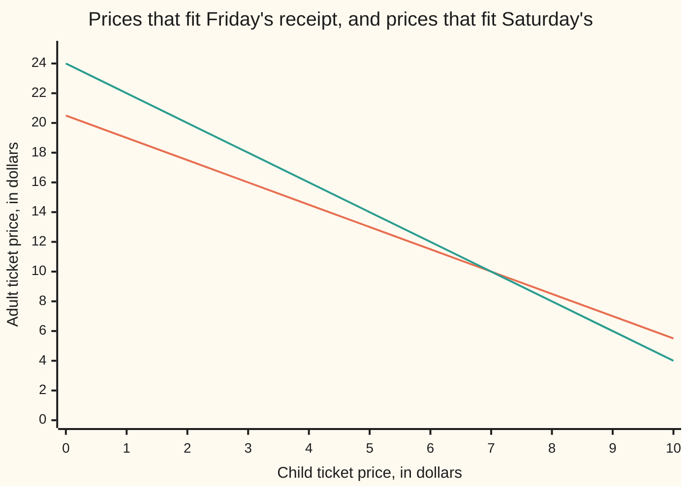
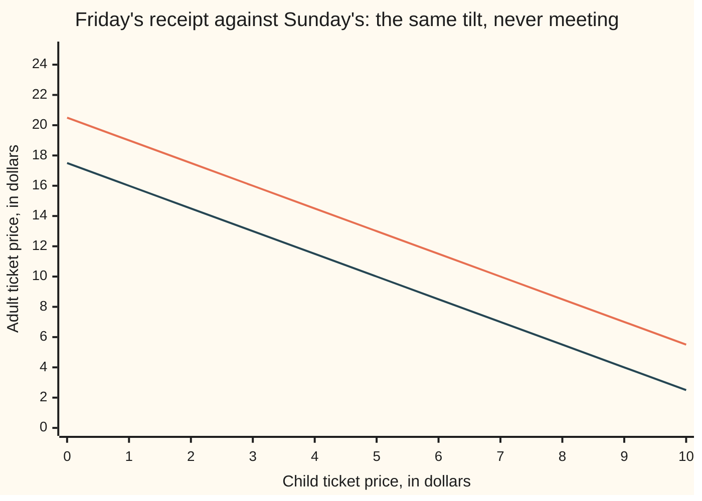

# Two equations, two unknowns: substitute or eliminate, and the two ways a crossing fails

[Syllabus](../../../SYLLABUS.md) → [Algebra](../../../SYLLABUS.md#w03) → [Letters and Equations](../../../SYLLABUS.md#w03-s01) → Two equations, two unknowns

---

## General Overview

The museum does not post its ticket prices. You have two receipts.

Friday: two adults and three children, 41.00 dollars. Saturday: one adult and two children, 24.00 dollars.

Neither receipt on its own tells you a price. Friday's total fits an adult at 10.00 with a child at 7.00. It also fits an adult at 13.00 with a child at 5.00, and a hundred other pairs. Saturday's is just as loose.

Hold both receipts at once and one pair survives. Doubling Saturday gives two adults and four children for 48.00. That is Friday's receipt plus one extra child, and it costs 7.00 more. So a child is 7.00, and Saturday then says an adult is 24.00 − 14.00 = 10.00.

**Two unknown prices need two facts that are not the same fact; put the two together and the pair is pinned.**

### The picture: each receipt is a line of possible prices



The lower line at the left edge is Friday's receipt: every pair of prices that comes to 41.00 for two adults and three children. The upper one is Saturday's, every pair that comes to 24.00 for one adult and two children. They touch at exactly one place: a child at 7.00, an adult at 10.00. In both pictures the child price runs across the bottom and the adult price up the side.

---

## The formula

Call the adult price $x$ and the child price $y$. Both are numbers you have not been told yet ([Letters for numbers](01-letters-for-numbers.md)). Each receipt is then one equation:

$$2x + 3y = 41 \qquad x + 2y = 24$$

**Read it aloud:** two adult tickets and three child tickets came to 41 dollars, and one adult ticket and two child tickets came to 24 dollars.

Put letters where the counts and totals are and you have the general pair, the shape every such problem takes:

$$ax + by = p \qquad cx + dy = q$$

| Symbol | Plain meaning | In our example | Push it up and… |
| --- | --- | --- | --- |
| $x$ | the first unknown: the adult ticket price | 10.00 | — |
| $y$ | the second unknown: the child ticket price | 7.00 | — |
| $a$ | adults on the first receipt | 2 | the first line tilts flatter |
| $b$ | children on the first receipt | 3 | the first line tilts steeper |
| $p$ | what the first receipt came to | 41.00 | the adult price rises and the child price falls |
| $c$ | adults on the second receipt | 1 | the second line tilts flatter |
| $d$ | children on the second receipt | 2 | the second line tilts steeper |
| $q$ | what the second receipt came to | 24.00 | the adult price falls and the child price rises |

Solve that general pair once and out comes a formula for every version of the problem:

$$x = \frac{pd - bq}{ad - bc} \qquad y = \frac{aq - cp}{ad - bc}$$

The number underneath both, $ad - bc$, decides everything. Call it the **crossing number**: multiply along one diagonal of the four counts, multiply along the other, subtract. For our receipts it is 2 × 2 − 3 × 1 = 1. Not zero means the lines cross once and the prices are pinned. Zero means they do not, and Step 4 says what happens instead.

---

## Why it works

### Step 0: one receipt is a line, not an answer

An equation with two unknowns is not a puzzle with a missing number. It is a rule that endlessly many pairs obey. Friday's rule, 2x + 3y = 41, is obeyed by (10.00, 7.00) — adult first, child second — by (13.00, 5.00) and by every pair between and beyond them. Draw them all and you get a straight line, which is the first picture above.

A pair that obeys both rules must sit on both lines. That is the crossing point, and finding it is the whole job.

### Step 1: substitution, trade one letter away

Take Saturday's receipt, x + 2y = 24, and make the adult price the subject ([Rearranging a formula](03-rearranging-formulas.md)):

$$x = 24 - 2y$$

That is what Saturday allows: pick a child price and the adult price follows. Now put that expression into Friday's receipt wherever an $x$ stands:

$$2(24 - 2y) + 3y = 41$$

Multiply out the bracket ([The three rearranging laws](../../01-Foundations/01-Everyday%20Arithmetic/05-arithmetic-laws.md)): 48 − 4y + 3y = 41, so 48 − y = 41, so y = 7. One equation, one unknown, undone step by step — that is the card before this one ([Linear equations](02-linear-equations.md)). Feed 7.00 back into x = 24 − 2y and the adult price is 10.00.

### Step 2: elimination, make one letter cancel

Doing the same thing to both sides of an equation leaves it true, so double Saturday's whole receipt — every count and the total:

$$2x + 4y = 48$$

Two adults now appear on both receipts. Subtract Friday from this one: equal amounts taken from equal amounts leave equal amounts, so the result is still true. The adults cancel. The children do not: 4y − 3y = y. The totals give 48 − 41 = 7. So y = 7, with no rearranging at all, and either receipt then returns the adult price: 24.00 − 2 × 7.00 = 10.00.

Substitution and elimination reach the same pair because they do the same thing in different clothes: both spend one equation to kill one letter.

### Step 3: do it once with letters and you never do it again

Run elimination on the general pair and the formulas above fall out.

<details>
<summary>The algebra behind the general pair</summary>

Multiply the first equation by $c$ and the second by $a$, so both carry the same amount of $x$:
$$acx + bcy = cp \qquad acx + ady = aq$$
Subtract the first from the second. The $x$ terms cancel and what is left is $(ad - bc)\,y = aq - cp$, so $y = (aq - cp) / (ad - bc)$. Doing it the other way round, killing $y$ instead, gives $x = (pd - bq) / (ad - bc)$. Both carry the same crossing number underneath: it is the same subtraction.

</details>

With our numbers the crossing number is 1, so x = (41 × 2 − 3 × 24) / 1 = 10.00 and y = (2 × 24 − 1 × 41) / 1 = 7.00. The same pair, a third time.

### Step 4: the two ways a crossing can fail

A third receipt turns up. Sunday: four adults and six children, 70.00.

Four adults and six children is exactly Friday's receipt twice over, and twice Friday's total is 82.00. The Sunday slip says 70.00. Both cannot be true. Check the crossing number for Friday against Sunday: 2 × 6 − 3 × 4 = 0. No prices fit both. On a picture, the two lines run at the same tilt and never meet — they are **parallel**.



The upper line is Friday's receipt again, the lower one Sunday's claim of 70.00. The gap between them never closes.

Now suppose the slip had read 82.00 instead. The crossing number is still 0, but the receipt is now Friday's doubled, word for word. It adds no fact. The two lines lie on top of one another and every pair on that line fits both: (10.00, 7.00) does, and so does (13.00, 5.00). That is **infinitely many** answers — the same failure wearing the other face, a second fact that was never a second fact.

So the crossing number sorts the three outcomes. Not zero: one answer. Zero, with the totals disagreeing: no answer, parallel lines. Zero, with the totals agreeing too: a whole line of answers, one line drawn twice.

A fourth route: draw both lines and read the crossing off the paper — honest, fast, and only as accurate as your pencil. [Solving A x = b](../05-Solving%20Systems/01-matrix-equation-ax-b.md) runs this same elimination with the counts stacked in a grid, which is what you want with ten unknowns rather than two.

---

## Worked numbers, by hand

Elimination, to the cent.

| Step | Arithmetic | Value |
| --- | --- | --- |
| Friday's receipt | 2 adults and 3 children | 41.00 |
| Saturday's receipt | 1 adult and 2 children | 24.00 |
| double Saturday | 2 adults and 4 children, 2 × 24.00 | 48.00 |
| subtract Friday | one child is left over, 48.00 − 41.00 | **child 7.00** |
| back into Saturday | 24.00 − 2 × 7.00 | **adult 10.00** |
| check Friday | 20.00 + 21.00 | 41.00 |
| check Saturday | 10.00 + 14.00 | 24.00 |

An adult ticket is 10.00 dollars and a child ticket 7.00 — the only prices that explain both receipts.

### What breaks if you drop a piece

| Mistake | Comes out at | What went wrong |
| --- | --- | --- |
| Doubling Saturday's tickets but not its total | child −17.00, adult 58.00 | Half an equation was doubled, so it stopped being true |
| Putting x = 24 − 2y back into Saturday | 24.00 = 24.00 | True, and empty: that equation was already spent making x the subject |
| Trusting Friday alone | adult 13.00, child 5.00 | It fits Friday's 41.00 perfectly, and makes Saturday 23.00 |

The code prints all three.

---

## Code, from first principles, and it actually runs

Nothing is imported. Money is held in whole cents, so nothing rounds. The pair is reached by three roads that share no arithmetic: elimination, which doubles Saturday and subtracts; substitution, which makes the adult price the subject and pushes it into Friday; and the cross-multiplied formulas, built from the four counts and two totals. Then both receipts are paid out from the answer, the three mistakes are shown, and both charts' lines are printed point by point.

### Python

```python
# Two equations, two unknowns -- the check behind the card.  Nothing is imported.
# Friday: 2 adults and 3 children pay $41.  Saturday: 1 adult and 2 children pay
# $24.  x is the adult price, y is the child price, both held in whole cents.
FRI = (2, 3, 4100)                    # adults, children, total in cents
SAT = (1, 2, 2400)
SUN = (4, 6, 7000)                    # a third receipt that cannot be right
GUESS = (1300, 500)                   # a pair that fits Friday and nothing else
a, b, p = FRI
c, d, q = SAT

def m(cents): return f"{cents / 100:.2f}"
def one(name, value): print(f"{name:<58}{value:>8}")
def row(name, cents): print(f"{name:<26}" + "".join(f"{m(v):>7}" for v in cents))

# road one: elimination.  Double Saturday so both receipts carry two adults.
dbl = (2 * c, 2 * d, 2 * q)
y1 = (dbl[2] - p) // (dbl[1] - b)     # the one child left over
x1 = (q - d * y1) // c                # that price back into Saturday
# road two: substitution.  Saturday says x = (q - d*y)/c; put that into Friday.
y2 = (p * c - a * q) // (b * c - a * d)
x2 = (q - d * y2) // c
# road three: the crossing number, then the cross-multiplied pair
cross = a * d - b * c
x3, y3 = (p * d - b * q) // cross, (a * q - c * p) // cross
wy = q - p                            # mistake: only the tickets doubled
wx = q - d * wy

one("Friday, 2 adults and 3 children", m(p))
one("Saturday, 1 adult and 2 children", m(q))
one("elimination -- Saturday doubled, 2 adults and 4 children", m(dbl[2]))
one("minus Friday, leaving one child", m(y1))
one("that price back into Saturday, one adult", m(x1))
one(f"substitution -- child {m(y2)}, adult", m(x2))
one(f"crossing number {cross} -- cross-multiplied child {m(y3)}, adult", m(x3))
one(f"Friday checks, {m(a * x1)} + {m(b * y1)}", m(a * x1 + b * y1))
one(f"Saturday checks, {m(c * x1)} + {m(d * y1)}", m(c * x1 + d * y1))
one("Sunday claims 4 adults and 6 children cost", m(SUN[2]))
one(f"Friday doubled says they cost, crossing number {a * SUN[1] - b * SUN[0]}", m(2 * p))
one(f"had Sunday read {m(2 * p)}, ({m(x1)}, {m(y1)}) fits and so does",
    f"({m(GUESS[0])}, {m(GUESS[1])})")

def at(r, y): return (r[2] - r[1] * 100 * y) // r[0]      # a receipt's line
row("child price, dollars", [100 * y for y in range(11)])
row("adults on Friday's line", [at(FRI, y) for y in range(11)])
row("adults on Saturday's line", [at(SAT, y) for y in range(11)])
row("adults on Sunday's line", [at(SUN, y) for y in range(11)])

one(f"mistake -- only the tickets doubled: child {m(wy)}, adult", m(wx))
one("mistake -- the rearranged adult back into Saturday", f"{m(q)} = {m(q)}")
one(f"mistake -- Friday alone at {m(GUESS[0])} and {m(GUESS[1])}, Saturday",
    m(c * GUESS[0] + d * GUESS[1]))

assert (x1, y1) == (x2, y2) == (x3, y3)                   # three roads, one pair
assert a * 1000 + b * 700 == p and c * 1000 + d * 700 == q and (x1, y1) == (1000, 700)
assert a * GUESS[0] + b * GUESS[1] == p and c * GUESS[0] + d * GUESS[1] == 2300
assert a * SUN[1] - b * SUN[0] == 0 and 2 * p == 8200 and SUN[2] != 8200
print("ALL CHECKS PASS")
```

**Ran 2026-09-07 on macOS, Python 3.14.6, standard library only. All checks passed. Output, pasted from the run:**

```
Friday, 2 adults and 3 children                              41.00
Saturday, 1 adult and 2 children                             24.00
elimination -- Saturday doubled, 2 adults and 4 children     48.00
minus Friday, leaving one child                               7.00
that price back into Saturday, one adult                     10.00
substitution -- child 7.00, adult                            10.00
crossing number 1 -- cross-multiplied child 7.00, adult      10.00
Friday checks, 20.00 + 21.00                                 41.00
Saturday checks, 10.00 + 14.00                               24.00
Sunday claims 4 adults and 6 children cost                   70.00
Friday doubled says they cost, crossing number 0             82.00
had Sunday read 82.00, (10.00, 7.00) fits and so does     (13.00, 5.00)
child price, dollars         0.00   1.00   2.00   3.00   4.00   5.00   6.00   7.00   8.00   9.00  10.00
adults on Friday's line     20.50  19.00  17.50  16.00  14.50  13.00  11.50  10.00   8.50   7.00   5.50
adults on Saturday's line   24.00  22.00  20.00  18.00  16.00  14.00  12.00  10.00   8.00   6.00   4.00
adults on Sunday's line     17.50  16.00  14.50  13.00  11.50  10.00   8.50   7.00   5.50   4.00   2.50
mistake -- only the tickets doubled: child -17.00, adult     58.00
mistake -- the rearranged adult back into Saturday        24.00 = 24.00
mistake -- Friday alone at 13.00 and 5.00, Saturday          23.00
ALL CHECKS PASS
```

### Rust

Same numbers, same labels, built with `rustc --edition 2021 -O`.

```rust
// Two equations, two unknowns -- the same check as the Python, in Rust.  No
// crates.  Friday: 2 adults and 3 children pay $41.  Saturday: 1 adult and 2
// children pay $24.  x is the adult price, y the child price, held in cents.
const FRI: (i64, i64, i64) = (2, 3, 4100);   // adults, children, total in cents
const SAT: (i64, i64, i64) = (1, 2, 2400);
const SUN: (i64, i64, i64) = (4, 6, 7000);   // a third receipt that cannot be right
const GUESS: (i64, i64) = (1300, 500);       // a pair that fits Friday and nothing else

fn m(cents: i64) -> String { format!("{:.2}", cents as f64 / 100.0) }
fn one(name: String, value: String) { println!("{:<58}{:>8}", name, value); }
fn row(name: &str, cents: &[i64]) {
    let mut line = format!("{:<26}", name);
    for v in cents { line.push_str(&format!("{:>7}", m(*v))); }
    println!("{}", line);
}
fn at(r: (i64, i64, i64), y: i64) -> i64 { (r.2 - r.1 * 100 * y) / r.0 }

fn main() {
    let (a, b, p) = FRI;
    let (c, d, q) = SAT;
    // road one: elimination.  Double Saturday so both receipts carry two adults.
    let dbl = (2 * c, 2 * d, 2 * q);
    let y1 = (dbl.2 - p) / (dbl.1 - b);          // the one child left over
    let x1 = (q - d * y1) / c;                   // that price back into Saturday
    // road two: substitution.  Saturday says x = (q - d*y)/c; put that into Friday.
    let y2 = (p * c - a * q) / (b * c - a * d);
    let x2 = (q - d * y2) / c;
    // road three: the crossing number, then the cross-multiplied pair
    let cross = a * d - b * c;
    let (x3, y3) = ((p * d - b * q) / cross, (a * q - c * p) / cross);
    let wy = q - p;                              // mistake: only the tickets doubled
    let wx = q - d * wy;

    one("Friday, 2 adults and 3 children".to_string(), m(p));
    one("Saturday, 1 adult and 2 children".to_string(), m(q));
    one("elimination -- Saturday doubled, 2 adults and 4 children".to_string(), m(dbl.2));
    one("minus Friday, leaving one child".to_string(), m(y1));
    one("that price back into Saturday, one adult".to_string(), m(x1));
    one(format!("substitution -- child {}, adult", m(y2)), m(x2));
    one(format!("crossing number {} -- cross-multiplied child {}, adult", cross, m(y3)), m(x3));
    one(format!("Friday checks, {} + {}", m(a * x1), m(b * y1)), m(a * x1 + b * y1));
    one(format!("Saturday checks, {} + {}", m(c * x1), m(d * y1)), m(c * x1 + d * y1));
    one("Sunday claims 4 adults and 6 children cost".to_string(), m(SUN.2));
    one(format!("Friday doubled says they cost, crossing number {}", a * SUN.1 - b * SUN.0), m(2 * p));
    one(format!("had Sunday read {}, ({}, {}) fits and so does", m(2 * p), m(x1), m(y1)),
        format!("({}, {})", m(GUESS.0), m(GUESS.1)));

    let ys: Vec<i64> = (0..11).map(|y| 100 * y).collect();
    row("child price, dollars", &ys);
    row("adults on Friday's line", &(0..11).map(|y| at(FRI, y)).collect::<Vec<i64>>());
    row("adults on Saturday's line", &(0..11).map(|y| at(SAT, y)).collect::<Vec<i64>>());
    row("adults on Sunday's line", &(0..11).map(|y| at(SUN, y)).collect::<Vec<i64>>());

    one(format!("mistake -- only the tickets doubled: child {}, adult", m(wy)), m(wx));
    one("mistake -- the rearranged adult back into Saturday".to_string(),
        format!("{} = {}", m(q), m(q)));
    one(format!("mistake -- Friday alone at {} and {}, Saturday", m(GUESS.0), m(GUESS.1)),
        m(c * GUESS.0 + d * GUESS.1));

    assert!((x1, y1) == (x2, y2) && (x2, y2) == (x3, y3));   // three roads, one pair
    assert!(a * 1000 + b * 700 == p && c * 1000 + d * 700 == q && (x1, y1) == (1000, 700));
    assert!(a * GUESS.0 + b * GUESS.1 == p && c * GUESS.0 + d * GUESS.1 == 2300);
    assert!(a * SUN.1 - b * SUN.0 == 0 && 2 * p == 8200 && SUN.2 != 8200);
    println!("ALL CHECKS PASS");
}
```

**Ran 2026-09-07 on macOS, rustc 1.98.1, no crates. All checks passed. Output, pasted from the run:**

```
Friday, 2 adults and 3 children                              41.00
Saturday, 1 adult and 2 children                             24.00
elimination -- Saturday doubled, 2 adults and 4 children     48.00
minus Friday, leaving one child                               7.00
that price back into Saturday, one adult                     10.00
substitution -- child 7.00, adult                            10.00
crossing number 1 -- cross-multiplied child 7.00, adult      10.00
Friday checks, 20.00 + 21.00                                 41.00
Saturday checks, 10.00 + 14.00                               24.00
Sunday claims 4 adults and 6 children cost                   70.00
Friday doubled says they cost, crossing number 0             82.00
had Sunday read 82.00, (10.00, 7.00) fits and so does     (13.00, 5.00)
child price, dollars         0.00   1.00   2.00   3.00   4.00   5.00   6.00   7.00   8.00   9.00  10.00
adults on Friday's line     20.50  19.00  17.50  16.00  14.50  13.00  11.50  10.00   8.50   7.00   5.50
adults on Saturday's line   24.00  22.00  20.00  18.00  16.00  14.00  12.00  10.00   8.00   6.00   4.00
adults on Sunday's line     17.50  16.00  14.50  13.00  11.50  10.00   8.50   7.00   5.50   4.00   2.50
mistake -- only the tickets doubled: child -17.00, adult     58.00
mistake -- the rearranged adult back into Saturday        24.00 = 24.00
mistake -- Friday alone at 13.00 and 5.00, Saturday          23.00
ALL CHECKS PASS
```

The two outputs match line for line.

> [!TIP]
> **Try changing**
> Guess first, then run it. An assert is a line that stops the program when a number comes out wrong, and these are pinned to the museum's prices, so expect one to stop it.
> - **Make Saturday 23.00.** Set `SAT` to `(1, 2, 2300)`. The answer becomes the adult at 13.00 and the child at 5.00 — the pair that fitted Friday alone, now fitting both because Saturday moved to meet it.
> - **Let the Sunday slip read 82.00.** Set `SUN` to `(4, 6, 8200)`. Sunday's row in the grid becomes Friday's row exactly, the two lines coincide, and the last assert stops the program.
> - **Make Friday two adults and four children.** Set `FRI` to `(2, 4, 4100)`. The crossing number is now zero and the elimination divides by it, so the program stops with a division-by-zero error — the parallel case announcing itself.

---

## The usual mistake

> [!warning]
> **Treating one receipt as an answer.** An adult at 13.00 with a child at 5.00 explains Friday's 41.00 to the cent. It is still wrong: Saturday would have come to 23.00, not 24.00. One equation with two unknowns never names a pair. It names a line of pairs.
>
> - Doubling a receipt means doubling the tickets *and* the total. Doubling only the tickets gives a child at −17.00 and an adult at 58.00.
> - Substituting Saturday's rearranged adult price back into Saturday gives 24.00 = 24.00. True, useless: the new expression has to go into the *other* receipt.
> - "No solution" is not a sign you did the algebra wrong. When the crossing number is zero and the totals disagree, no prices exist. The Sunday slip at 70.00 is a till error, not a puzzle.

---

## Where you meet it in real life

- **Two bills over the same two items.** Any two receipts or invoices covering the same two unknown unit prices are this card, unchanged.
- **Choosing between two plans.** Two phone tariffs, each a starting charge plus a rate, meet at one number of minutes — the crossing of two lines.
- **Mixing to a target.** Two ingredients, one target weight and one target strength: two facts, two unknown amounts.
- **Every later system.** Ten unknowns and ten equations yield to exactly this doubling and subtracting, done in an orderly sweep — what [Solving A x = b](../05-Solving%20Systems/01-matrix-equation-ax-b.md) sets up.

> **Say it back**
> One equation with two unknowns is a line of possible pairs, not an answer. Two of them cross at one pair, and that pair is the answer. You find it by substitution — make one letter the subject and push it into the other equation — or by elimination — scale one equation until a letter matches, then subtract it away. Both give an adult ticket at 10.00 dollars and a child ticket at 7.00. If the crossing number is zero the lines are parallel and nothing fits, or identical and everything on them fits, which means the second receipt never told you anything new.

---

## What this builds on

- [Linear equations](02-linear-equations.md): undoing one equation with one unknown, which is what both routes reduce the problem to.
- [The three rearranging laws](../../01-Foundations/01-Everyday%20Arithmetic/05-arithmetic-laws.md): multiplying out 2(24 − 2y), and why doubling a whole equation keeps it true.

## Where this goes next

- [Linear combinations and span](../03-Vectors/03-linear-combinations-and-span.md): the same two equations read as a question about mixing two lists of numbers to hit a target.
- [Solving A x = b](../05-Solving%20Systems/01-matrix-equation-ax-b.md): the counts stacked in a grid, the crossing number given its real name, and the same three outcomes for any number of unknowns.

---

## Sources

Verified 7 Sep 2026: every link below resolves to the publisher's page.

- *Intermediate Algebra 2e*, section 4.1, "Solve Systems of Linear Equations with Two Variables." OpenStax, Rice University. [Textbook page](https://openstax.org/books/intermediate-algebra-2e/pages/4-1-solve-systems-of-linear-equations-with-two-variables). Substitution and elimination set out in the standard school notation.
- *Elementary Algebra 2e*, section 5.1, "Solve Systems of Equations by Graphing." OpenStax, Rice University. [Textbook page](https://openstax.org/books/elementary-algebra-2e/pages/5-1-solve-systems-of-equations-by-graphing). Where the three outcomes appear as crossing, parallel and identical lines.
- Hefferon, Jim. *Linear Algebra*, 4th ed. Saint Michael's College, 2020. [Book page, free PDF](https://hefferon.net/linearalgebra/). Chapter One opens with this elimination and carries it to any number of unknowns.
