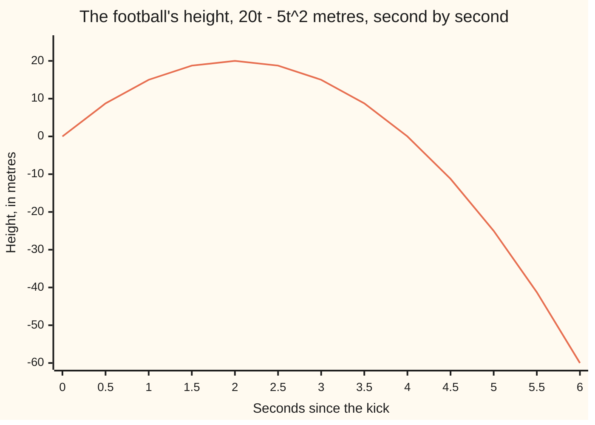

# Polynomials: sums of powers of one letter, their degree, and where they cross zero

[Syllabus](../../../SYLLABUS.md) → [Algebra](../README.md) → [Polynomials](../README.md#s02) → Polynomials

---

## General Overview

A football is kicked straight up at 20 metres a second. Ignore the air. After t seconds it is 20t − 5t^2 metres above the grass: the 20t is the kick lifting it, the 5t^2 is gravity hauling it back.

Put whole seconds in and the flight appears. One second: 15 metres. Two: 20. Three: 15 again. Four: 0, back on the grass.

That height rule is a **polynomial**: whole-number powers of one letter, each multiplied by a plain number, added up. The numbers out front, 20 and −5, are its **coefficients**. The biggest power, the 2, is its **degree**. And 4 is a **root**: putting 4 in makes it come out zero.

**A polynomial is powers of one letter, each multiplied by a plain number and added together; its degree is the biggest power, and a root is an input that makes it come out zero.**

### The picture: the whole flight



The line is the height. It meets zero twice, at 0 and at 4 seconds: the two roots. The top is 20 metres at 2 seconds. Past 4 seconds the line keeps diving, because the squared piece has taken over. The polynomial dives; the ball does not — it is on the grass.

---

## The formula

Biggest power first, each power of the letter carrying a plain number in front:

$$h(t) = -5t^2 + 20t$$

**Read it aloud:** the height after $t$ seconds is twenty times the seconds, minus five times the seconds squared.

Each piece is a **term**, and the number in front is its **coefficient**. No term here stands alone without a $t$, so the **constant term** is 0: the ball starts on the grass.

| Symbol | Plain meaning | In the ball's flight | Push it up and the answer… |
| --- | --- | --- | --- |
| $t$ | the letter, the input; seconds since the kick | 0 to 4 | later in the flight |
| $h$ | what comes back; metres above the grass | 15 at 1 second | — |
| $n$ | the **degree**: the biggest power present | 2 | more bends, wilder far end |
| $r$ | a **root**: an input giving 0 | 0 and 4 | — |
| $s$ | seconds either side of the top | 0, 1 or 2 | the ball is lower |
| $a$ | first piece of a two-term bracket | 2, in (2 + $s$) | — |
| $b$ | second piece of a two-term bracket | $s$, in (2 + $s$) | — |

Two products turn up often enough to know on sight.

$$(a + b)^2 = a^2 + 2ab + b^2$$

Squaring a two-term bracket gives the two squares **and**, between them, twice the product. That middle term is the one people drop.

$$(a - b)(a + b) = a^2 - b^2$$

A difference times a sum leaves the two squares: the middle terms cancel.

---

## Why it works

### Step 0: only three moves are allowed

Raise the letter to a whole-number power. Multiply by a number. Add. That is the whole kit, and the restriction is the point: nothing is ever divided by the letter and no half powers get in, so a polynomial never has a gap and never blows up. Put any number in, get a number out.

1 divided by t is not a polynomial: the letter is underneath. The square root of t is not one either: a square root is a half power.

### Step 1: putting a number in is arithmetic

Substitute the seconds for $t$ and work the two terms out separately. They pull against each other.

The 20t piece climbs in even steps: 20, 40, 60, 80 metres at 1, 2, 3 and 4 seconds. The 5t^2 piece starts smaller and climbs faster: 5, 20, 45, 80. Subtract and you get 15, 20, 15, 0 — the flight. At 4 seconds the squared piece has caught up exactly, both are 80, and the ball is down.

The arc came out of two terms racing.

### Step 2: the degree is the top power, and the top power owns the far end

The degree is 2, because t^2 is the biggest power present. Degree 2 has a name you will hear: **quadratic**.

Look far out and the top power wins. At 10 seconds 20t is 200 but 5t^2 is 500, so the height reads −300. Squaring outruns multiplying and keeps outrunning it, so the far end belongs to the biggest term alone.

| Degree | What it has in it | The shape |
| --- | --- | --- |
| 0 | a plain number, no letter | flat |
| 1 | a number times the letter, plus a plain number | a straight line, no bends |
| 2 | a squared term as well | one bend, up then down or down then up |

Degree 3 adds a cubed term and a second bend, and so on up: a polynomial of degree $n$ bends at most $n$ − 1 times and crosses zero at most $n$ times — the job of [Roots and factors](05-roots-and-the-factor-theorem.md).

### Step 3: adding is collecting like terms, and the degree can fall

Someone on a 3-metre wall throws a second ball up at 12 metres a second. Its height is 3 + 12t − 5t^2: also degree 2, dragged down by the same gravity.

Take the first height from the second, one power at a time. The plain numbers give 3. The t terms give 12t − 20t = −8t. The t^2 terms cancel outright.

The gap is **3 − 8t** — degree 1, a straight line. Both balls are pulled down by the same 5t^2, so gravity leaves the difference entirely: the gap closes at a steady 8 metres a second, from 3 metres at the kick to nothing at 0.375 seconds, where both are 6.796875 metres up.

Adding never pushes the degree above the bigger of the two, and can pull it down, as it just did.

### Step 4: multiplying is every term against every term; degrees add

Multiply 5t by (4 − t): 5t × 4 = 20t, and 5t × (−t) = −5t^2. That is the ball's height again. Degree 1 times degree 1 came out degree 2, and it always does — the top term of one times the top term of the other is the only product reaching that power, so the degrees add.

Add two polynomials, or multiply them, and another polynomial comes back. The family is closed under both, which earns polynomials a name of their own in [Rings](../09-Rings%20and%20Fields/01-rings.md).

Now put the squaring pattern to work. Why is the flight symmetric, 15, 20, 15? Write the time as 2 + $s$, meaning $s$ seconds either side of the top, and expand the square with $a$ = 2 and $b$ = $s$:

$$h(2 + s) = 20(2 + s) - 5(4 + 4s + s^2) = 40 + 20s - 20 - 20s - 5s^2 = 20 - 5s^2$$

The $s$ terms cancel, and what is left depends on $s$ squared, which does not care which side of the top you stepped. One second before and one after both give 20 − 5 = 15 metres. That is why the heights read 15, 20, 15.

The roots drop out of the second pattern. The ball is down when 20 − 5$s$^2 = 0, so when 4 − $s$^2 = 0, and a^2 − b^2 = (a − b)(a + b) turns that into (2 − $s$)(2 + $s$): zero when $s$ is 2 or −2, two seconds after the top or two before. In seconds since the kick, 4 and 0.

### Step 5: a root is an input, not an output

Put 4 in: 80 − 80 = 0. So $r$ = 4 is a root. The 4 is a time and the 0 is a height, and it is the time that gets the name. On the chart the roots are where the line meets the axis.

The other route: leave 5t(4 − t) in brackets. A product is zero only when a piece of it is, so 5t = 0 or 4 − t = 0 — both roots by inspection. That is [Factoring](02-factoring-quadratics.md).

---

## Worked numbers, by hand

To two decimals.

| Step | Arithmetic | Value |
| --- | --- | --- |
| height at 1 second | 20.00 − 5.00 | 15.00 |
| at 2 seconds | 40.00 − 20.00 | 20.00 |
| at 3 seconds | 60.00 − 45.00 | 15.00 |
| at 4 seconds | 80.00 − 80.00 | **0.00** |
| the degree | biggest power present | **2** |
| the roots | inputs giving height zero | **t = 0 and t = 4** |
| 5t × (4 − t) | every term against every term | **20t − 5t^2** |
| second ball minus first | (3 + 12t − 5t^2) − (20t − 5t^2) | **3 − 8t**, degree 1 |
| the far end, at 10 seconds | 200 − 500 | **−300** |

### What breaks if you drop a piece

| Mistake | Comes out at | What went wrong |
| --- | --- | --- |
| Reading 5t^2 as (5t)^2 | −165.00 at 3 seconds | The power sits on the letter alone: square the seconds, then multiply by 5 — 45.00 |
| Multiplying 5t × (4 − t) as 5 × 4 and t × (−t) | 11.00 at 3 seconds | That reads 20 − t^2. Every term must meet every term: 5t × 4 = 20t, then 5t × (−t) = −5t^2 |
| Reading (2 + $s$)^2 as 4 + $s$^2 | 35.00 at 3 seconds, where $s$ = 1 | The middle term 2ab is missing |

The code prints all three.

---

## Code, from first principles, and it actually runs

Nothing is imported. The ball is kept as a coefficient list, [0, 20, −5], read from the plain number upward. One road works out each power and adds the terms: the hand method. The second never raises anything to a power — it multiplies and adds down the list — and must land on the same heights. A third check rebuilds the ball from 5t times (4 − t).

### Python

```python
# Polynomials -- the check behind the card.  Nothing is imported.  A football
# kicked straight up at 20 m/s is 20t - 5t^2 metres up after t seconds.  A
# coefficient list runs from the plain number upward: the ball is [0, 20, -5],
# a second ball thrown off a 3 m wall is [3, 12, -5].
BALL, WALL = [0, 20, -5], [3, 12, -5]
def plain(c, t):                    # one road: work out each power, then add
    total = 0.0
    for i, a in enumerate(c):
        power = 1.0
        for _ in range(i): power *= t
        total += a * power
    return total
def nested(c, t):                   # second road: multiply and add, no powers
    total = 0.0
    for a in reversed(c): total = total * t + a
    return total
def add(c, d):                      # line the lists up, add what sits together
    return [(c[i] if i < len(c) else 0) + (d[i] if i < len(d) else 0)
            for i in range(max(len(c), len(d)))]
def mul(c, d):                      # every term of one times every term of the other
    out = [0] * (len(c) + len(d) - 1)
    for i, a in enumerate(c):
        for j, b in enumerate(d): out[i + j] += a * b
    return out
def degree(c): return max(i for i, a in enumerate(c) if a != 0)
def row(name, vals): print(f"{name:<15}" + "".join(f"{v:>7}" for v in vals))
ts = [i / 2 for i in range(13)]     # 0, 0.5, 1.0 ... 6.0 seconds
row("t, seconds", [f"{t:.1f}" for t in ts])
row("height, m", [f"{plain(BALL, t):.2f}" for t in ts])
print(f"degree {degree(BALL)}; coefficients {BALL[2]} for t^2, {BALL[1]} for t, {BALL[0]} plain")
print("height at t = 1, 2, 3, 4: "
      + ", ".join(f"{plain(BALL, t):.2f}" for t in (1.0, 2.0, 3.0, 4.0)) + " metres")
print("the piece 20t: " + ", ".join(f"{20 * t:.2f}" for t in (1.0, 2.0, 3.0, 4.0))
      + "; the piece 5t^2: " + ", ".join(f"{5 * t * t:.2f}" for t in (1.0, 2.0, 3.0, 4.0)))
print("the roots, where the height is zero: t = 0 and t = 4")
far = max(abs(plain(BALL, t) - nested(BALL, t)) for t in ts)
print(f"the nested route gives the same heights; biggest difference {far:.8f}")
print(f"far end at t = 10: 20t is {20 * 10.0:.2f}, 5t^2 is {5 * 100.0:.2f}, "
      f"height {plain(BALL, 10.0):.2f}")
e = mul([0, 5], [4, -1])
print(f"5t times (4 - t): plain {e[0]}, t coefficient {e[1]}, t^2 coefficient {e[2]}; "
      f"degrees add, 1 + 1 = {degree(e)}")
print(f"second ball: plain {WALL[0]}, t coefficient {WALL[1]}, t^2 coefficient {WALL[2]}, "
      f"degree {degree(WALL)}")
d = add(WALL, [-a for a in BALL])
print(f"the gap between them: plain {d[0]}, t coefficient {d[1]}, t^2 coefficient {d[2]}, "
      f"degree {degree(d)}")
level = 3 / 8
print(f"the balls are level at t = {level:.3f} s, both at {plain(BALL, level):.6f} m")
print("h(2 + s) = 20 - 5s^2, so at s = 0, 1, 2 the heights are "
      + ", ".join(f"{plain(BALL, 2 + s):.2f}" for s in (0.0, 1.0, 2.0)))
print(f"three mistakes at t = 3: {20 * 3.0 - (5 * 3.0) ** 2:.2f}, {20 - 3.0 * 3.0:.2f} and "
      f"{20 * (2 + 1.0) - 5 * (4 + 1.0 * 1.0):.2f} instead of {plain(BALL, 3.0):.2f}")
assert [plain(BALL, t) for t in (1.0, 2.0, 3.0, 4.0)] == [15, 20, 15, 0]
assert far == 0.0 and degree(BALL) == 2 and degree(d) == 1 and e == BALL
assert d == [3, -8, 0] and mul([0, 5], [4, -1]) == mul([4, -1], [0, 5])
assert all(plain(BALL, 2 + s) == 20 - 5 * s * s for s in (0.0, 1.0, 2.0))
print("ALL CHECKS PASS")
```

**Ran 2026-09-07 on macOS, Python 3.14.6, standard library only. All checks passed. Output, pasted from the run:**

```
t, seconds         0.0    0.5    1.0    1.5    2.0    2.5    3.0    3.5    4.0    4.5    5.0    5.5    6.0
height, m         0.00   8.75  15.00  18.75  20.00  18.75  15.00   8.75   0.00 -11.25 -25.00 -41.25 -60.00
degree 2; coefficients -5 for t^2, 20 for t, 0 plain
height at t = 1, 2, 3, 4: 15.00, 20.00, 15.00, 0.00 metres
the piece 20t: 20.00, 40.00, 60.00, 80.00; the piece 5t^2: 5.00, 20.00, 45.00, 80.00
the roots, where the height is zero: t = 0 and t = 4
the nested route gives the same heights; biggest difference 0.00000000
far end at t = 10: 20t is 200.00, 5t^2 is 500.00, height -300.00
5t times (4 - t): plain 0, t coefficient 20, t^2 coefficient -5; degrees add, 1 + 1 = 2
second ball: plain 3, t coefficient 12, t^2 coefficient -5, degree 2
the gap between them: plain 3, t coefficient -8, t^2 coefficient 0, degree 1
the balls are level at t = 0.375 s, both at 6.796875 m
h(2 + s) = 20 - 5s^2, so at s = 0, 1, 2 the heights are 20.00, 15.00, 0.00
three mistakes at t = 3: -165.00, 11.00 and 35.00 instead of 15.00
ALL CHECKS PASS
```

### Rust

Same numbers, same labels, built with `rustc --edition 2021 -O`.

```rust
// Polynomials -- the same check as the Python, in Rust.  No crates.  A football
// kicked straight up at 20 m/s is 20t - 5t^2 metres up after t seconds.  A
// coefficient list runs from the plain number upward: the ball is [0, 20, -5],
// a second ball thrown off a 3 m wall is [3, 12, -5].
const BALL: [i64; 3] = [0, 20, -5];
const WALL: [i64; 3] = [3, 12, -5];
fn plain(c: &[i64], t: f64) -> f64 {      // one road: work out each power, then add
    let mut total = 0.0_f64;
    for (i, &a) in c.iter().enumerate() {
        let mut power = 1.0_f64;
        for _ in 0..i { power *= t; }
        total += a as f64 * power;
    }
    total
}
fn nested(c: &[i64], t: f64) -> f64 {     // second road: multiply and add, no powers
    let mut total = 0.0_f64;
    for &a in c.iter().rev() { total = total * t + a as f64; }
    total
}
fn add(c: &[i64], d: &[i64]) -> Vec<i64> {   // line the lists up, add what sits together
    (0..c.len().max(d.len()))
        .map(|i| c.get(i).copied().unwrap_or(0) + d.get(i).copied().unwrap_or(0)).collect()
}
fn mul(c: &[i64], d: &[i64]) -> Vec<i64> {   // every term of one times every term of the other
    let mut out = vec![0i64; c.len() + d.len() - 1];
    for (i, &a) in c.iter().enumerate() {
        for (j, &b) in d.iter().enumerate() { out[i + j] += a * b; }
    }
    out
}
fn degree(c: &[i64]) -> usize {
    c.iter().enumerate().filter(|(_, &a)| a != 0).map(|(i, _)| i).max().unwrap()
}
fn row(name: &str, vals: Vec<String>) {
    let mut line = format!("{:<15}", name);
    for v in &vals { line.push_str(&format!("{:>7}", v)); }
    println!("{}", line);
}
fn list(vals: Vec<String>) -> String { vals.join(", ") }
fn main() {
    let ts: Vec<f64> = (0..13).map(|i| i as f64 / 2.0).collect();   // 0, 0.5 ... 6.0 seconds
    row("t, seconds", ts.iter().map(|&t| format!("{:.1}", t)).collect());
    row("height, m", ts.iter().map(|&t| format!("{:.2}", plain(&BALL, t))).collect());
    println!("degree {}; coefficients {} for t^2, {} for t, {} plain",
             degree(&BALL), BALL[2], BALL[1], BALL[0]);
    println!("height at t = 1, 2, 3, 4: {} metres",
             list([1.0, 2.0, 3.0, 4.0].iter().map(|&t| format!("{:.2}", plain(&BALL, t))).collect()));
    println!("the piece 20t: {}; the piece 5t^2: {}",
             list([1.0, 2.0, 3.0, 4.0].iter().map(|&t| format!("{:.2}", 20.0 * t)).collect()),
             list([1.0, 2.0, 3.0, 4.0].iter().map(|&t| format!("{:.2}", 5.0 * t * t)).collect()));
    println!("the roots, where the height is zero: t = 0 and t = 4");
    let far = ts.iter().map(|&t| (plain(&BALL, t) - nested(&BALL, t)).abs()).fold(0.0_f64, f64::max);
    println!("the nested route gives the same heights; biggest difference {:.8}", far);
    println!("far end at t = 10: 20t is {:.2}, 5t^2 is {:.2}, height {:.2}",
             20.0 * 10.0, 5.0 * 100.0, plain(&BALL, 10.0));
    let e = mul(&[0, 5], &[4, -1]);
    println!("5t times (4 - t): plain {}, t coefficient {}, t^2 coefficient {}; \
              degrees add, 1 + 1 = {}", e[0], e[1], e[2], degree(&e));
    println!("second ball: plain {}, t coefficient {}, t^2 coefficient {}, degree {}",
             WALL[0], WALL[1], WALL[2], degree(&WALL));
    let neg: Vec<i64> = BALL.iter().map(|&a| -a).collect();
    let d = add(&WALL, &neg);
    println!("the gap between them: plain {}, t coefficient {}, t^2 coefficient {}, degree {}",
             d[0], d[1], d[2], degree(&d));
    let level = 3.0 / 8.0;
    println!("the balls are level at t = {:.3} s, both at {:.6} m", level, plain(&BALL, level));
    println!("h(2 + s) = 20 - 5s^2, so at s = 0, 1, 2 the heights are {}",
             list([0.0, 1.0, 2.0].iter().map(|&s| format!("{:.2}", plain(&BALL, 2.0 + s))).collect()));
    println!("three mistakes at t = 3: {:.2}, {:.2} and {:.2} instead of {:.2}",
             20.0 * 3.0 - (5.0 * 3.0) * (5.0 * 3.0), 20.0 - 3.0 * 3.0,
             20.0 * (2.0 + 1.0) - 5.0 * (4.0 + 1.0 * 1.0), plain(&BALL, 3.0));
    let four: Vec<f64> = [1.0, 2.0, 3.0, 4.0].iter().map(|&t| plain(&BALL, t)).collect();
    assert!(four == vec![15.0, 20.0, 15.0, 0.0]);
    assert!(far == 0.0 && degree(&BALL) == 2 && degree(&d) == 1 && e == BALL.to_vec());
    assert!(d == vec![3, -8, 0] && mul(&[0, 5], &[4, -1]) == mul(&[4, -1], &[0, 5]));
    assert!([0.0, 1.0, 2.0].iter().all(|&s| plain(&BALL, 2.0 + s) == 20.0 - 5.0 * s * s));
    println!("ALL CHECKS PASS");
}
```

**Ran 2026-09-07 on macOS, rustc 1.98.1, no crates. All checks passed. Output, pasted from the run:**

```
t, seconds         0.0    0.5    1.0    1.5    2.0    2.5    3.0    3.5    4.0    4.5    5.0    5.5    6.0
height, m         0.00   8.75  15.00  18.75  20.00  18.75  15.00   8.75   0.00 -11.25 -25.00 -41.25 -60.00
degree 2; coefficients -5 for t^2, 20 for t, 0 plain
height at t = 1, 2, 3, 4: 15.00, 20.00, 15.00, 0.00 metres
the piece 20t: 20.00, 40.00, 60.00, 80.00; the piece 5t^2: 5.00, 20.00, 45.00, 80.00
the roots, where the height is zero: t = 0 and t = 4
the nested route gives the same heights; biggest difference 0.00000000
far end at t = 10: 20t is 200.00, 5t^2 is 500.00, height -300.00
5t times (4 - t): plain 0, t coefficient 20, t^2 coefficient -5; degrees add, 1 + 1 = 2
second ball: plain 3, t coefficient 12, t^2 coefficient -5, degree 2
the gap between them: plain 3, t coefficient -8, t^2 coefficient 0, degree 1
the balls are level at t = 0.375 s, both at 6.796875 m
h(2 + s) = 20 - 5s^2, so at s = 0, 1, 2 the heights are 20.00, 15.00, 0.00
three mistakes at t = 3: -165.00, 11.00 and 35.00 instead of 15.00
ALL CHECKS PASS
```

The two outputs match line for line.

> [!TIP]
> **Try changing**
> Guess first, then run it. An assert is a line that halts the program when a number comes out wrong; these are pinned to the ball's numbers, so expect one to halt it.
> - **Throw the second ball instead.** Swap `BALL` and `WALL`. The flight starts 3 metres up and lands sooner, near 2.6 seconds; the first assert halts it.
> - **Read the coefficient list backwards.** In `nested`, drop the `reversed`. The two roads stop agreeing, their biggest difference is no longer zero, and the second assert halts it.
> - **Multiply coefficient against coefficient.** In `mul`, change `out[i + j] += a * b` to `out[i] += a * b`. The expansion no longer comes back to the ball; the second assert halts it.

---

## The usual mistake

> [!warning]
> **Thinking the root is the height.** A root is an *input*. Putting 4 into 20t − 5t^2 gives 0, so the root is 4, the time; the 0 is only what came out. Say "the root is at 4 seconds", not "the root is 0".
>
> - 5t^2 is not (5t)^2. Square the seconds, then multiply by 5: at 3 seconds that piece is 45.00. Squaring 5t makes the height −165.00 rather than 15.00.
> - (a + b)^2 is not a^2 + b^2. The middle 2ab is real; dropping it puts the ball 35.00 metres up at 3 seconds, not 15.00.
> - Brackets are not multiplied numbers with numbers and letters with letters: that reads 5t × (4 − t) as 20 − t^2, which is 11.00 at 3 seconds.
> - The polynomial does not stop when the ball does. At 6 seconds it says −60.00 metres. It describes the flight, not the grass.

---

## Where you meet it in real life

- **Anything thrown, dropped or fired.** Height against time is degree 2 whenever gravity is all that acts: same shape, different numbers.
- **Spreadsheet trend lines.** The "polynomial fit" option is this: powers of one column, each with a number chosen to fit your data.
- **Areas and volumes.** Write a shape's edges in one letter: its area is degree 2, its volume degree 3 — the box in [Polynomial long division](04-polynomial-division.md).

> **Say it back**
> A polynomial is whole-number powers of one letter, each multiplied by a plain number, added up. The football's height 20t − 5t^2 is one: coefficients 20 and −5, degree 2. Put a number in and a number comes out: 15, 20, 15, 0 metres at 1, 2, 3 and 4 seconds. Add or multiply two of them and another polynomial comes back. A root is an input that makes the answer zero — here 0 and 4 seconds, the kick and the landing.

---

## What this builds on

- [Letters for numbers](../01-Letters%20and%20Equations/01-letters-for-numbers.md): a letter standing for a number nobody has told you yet, and collecting like terms.
- [Exponents](../../01-Foundations/03-Powers%2C%20Roots%20and%20Logarithms/01-exponents-and-powers.md): what t^2 means, and why these powers must be whole numbers.
- [The three rearranging laws](../../01-Foundations/01-Everyday%20Arithmetic/05-arithmetic-laws.md): the law that lets a bracket be multiplied out a term at a time.

## Where this goes next

- [Factoring](02-factoring-quadratics.md): running the multiplying backwards into brackets, so the roots read straight off.
- [Polynomial long division](04-polynomial-division.md): dividing one polynomial by another, quotient and remainder, as with whole numbers.
- [Rings](../09-Rings%20and%20Fields/01-rings.md): the name for a family closed under adding and multiplying, which is Step 4's last fact.

---

## Sources

Verified 7 Sep 2026; every link below resolves to the publisher's page.

- *Intermediate Algebra 2e*, 5.1, "Add and Subtract Polynomials." OpenStax, Rice University. [Textbook page](https://openstax.org/books/intermediate-algebra-2e/pages/5-1-add-and-subtract-polynomials). Degree, coefficients, naming.
- *Intermediate Algebra 2e*, 5.3, "Multiply Polynomials." OpenStax, Rice University. [Textbook page](https://openstax.org/books/intermediate-algebra-2e/pages/5-3-multiply-polynomials). Every term against every term, and both patterns.
- *College Algebra 2e*, 5.2, "Power Functions and Polynomial Functions." OpenStax, Rice University. [Textbook page](https://openstax.org/books/college-algebra-2e/pages/5-2-power-functions-and-polynomial-functions). The far end and the biggest power.
- Gelfand, I. M., and A. Shen. *Algebra*. Birkhäuser, 1993. [Publisher page](https://link.springer.com/book/9780817636777). The two patterns as things to see, not memorise.
