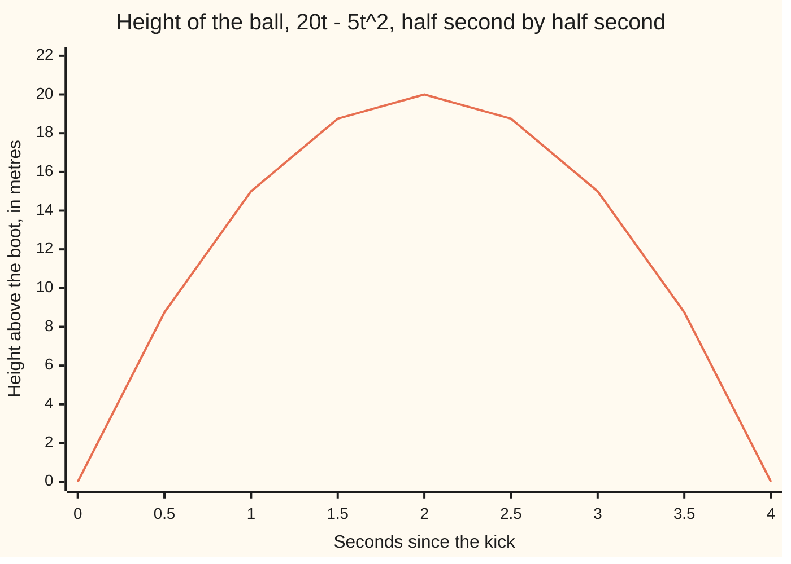
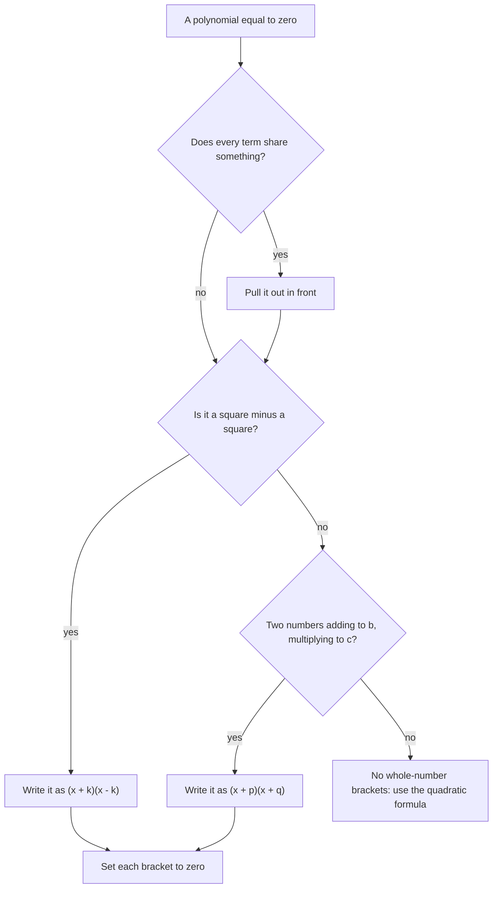

# Factoring: un-multiplying a polynomial, because a product is zero only when one factor is

[Syllabus](../../../SYLLABUS.md) → [Algebra](../README.md) → [Polynomials](../README.md#s02) → Factoring

---

## General Overview

A football is kicked straight up at 20 metres a second. After t seconds it stands 20t - 5t^2 metres above the boot.

When does it land? Landing means the height is zero. You can guess: 15 m up at 1 second, 20 m at 2, back to 15 m at 3. Still guessing.

One move ends the guessing. Both terms contain 5t: 20t is 5t times 4, and 5t^2 is 5t times t. Drag the 5t out in front of a bracket.

20t - 5t^2 = 5t(4 - t)

The height is no longer a sum of two terms. It is one thing multiplied by another. And two numbers multiply to zero only when one of them is zero. So either 5t = 0, which is t = 0, the kick, or 4 - t = 0, which is t = 4. The ball lands 4 seconds after it leaves the boot.

**Factoring is rewriting a sum of terms as a product of brackets, and a product hands you its zeros for free.**

### The picture: the flight, and the two zeros



The curve touches the bottom at t = 0 and t = 4: one touch per bracket of 5t(4 - t).

---

## The formula

The rule underneath all of it, the arrow below read as "so": if two things multiply to zero, at least one of them is zero.

$$A \times B = 0 \;\Longrightarrow\; A = 0 \;\text{ or }\; B = 0$$

Three rewrites get a polynomial into that shape. First, the common factor: what every term shares comes out front.

$$20t - 5t^2 = 5t(4 - t)$$

Second, reverse-multiplying a quadratic — a polynomial whose highest power is 2 ([Polynomials](01-polynomials.md)). Here x is the unknown, $b$ the number stuck to it, $c$ the one on its own, $p$ and $q$ the two you are hunting:

$$x^2 + bx + c = (x + p)(x + q) \quad\text{whenever}\quad p + q = b \;\text{ and }\; p \times q = c$$

That x^2 is bare, no number in front. With a number there the hunt changes; [The quadratic formula](03-quadratic-formula.md) still works.

Third, a square minus a square, with $k$ the number being squared:

$$x^2 - k^2 = (x + k)(x - k)$$

**Read it aloud:** find two numbers that add to the middle one and multiply to the last, put them in brackets, and the polynomial is zero wherever a bracket is.

| Symbol | Plain meaning | In our example | Push it up and the answer… |
| --- | --- | --- | --- |
| $t$ | seconds since the kick | 0 to 4 | past 4 the height goes negative, meaning below the boot: the model has stopped |
| $x$ | the side of the square slab, in metres | 11 | the patio grows both ways at once, so its area climbs faster than x |
| $b$ | the middle number, stuck to x | −11 | the bracket numbers add to more, so the zeros slide |
| $c$ | the last number, with no x | 30 | the bracket numbers multiply to more, and whole-number pairs get rarer |
| $p$, $q$ | the two numbers inside the brackets | −5 and −6 | the zeros sit at −p and −q, so both move |
| $k$ | the number squared in a square-minus-a-square | 3 | the pond is wider, less paving left |
| $A$, $B$ | two things multiplied | 5t and 4 − t | — |

---

## Why it works

### Step 0: a product is zero only when a factor is

Two numbers multiplied give zero only if one is zero. 7 × 0 = 0. No pair of non-zero numbers multiplies out to nothing.

That is the whole reason factoring pays, and it works against zero only. (x − 5)(x − 6) = 0 says a bracket is zero. The same brackets equal to 2 say nothing: plenty of pairs multiply to 2.

### Step 1: pull out what every term shares

Both terms are 5t times something, so the 5t comes out front and the somethings stay inside:

20t - 5t^2 = 5t(4 - t)

Multiply back to check: 5t × 4 = 20t, 5t × (−t) = −5t^2. Same polynomial, new costume. Do this first every time; it costs nothing and shrinks what is left. Same instinct as pulling primes out of a whole number ([Prime factorisation](../../02-Number%20theory/01-Divisibility%20and%20Primes/07-prime-factorisation.md)).

### Step 2: reverse-multiply the middle

Multiply two brackets out and watch where the pieces land:

$$(x + p)(x + q) = x^2 + qx + px + pq = x^2 + (p + q)x + pq$$

The middle number is p + q. The last is p × q. Run it backwards: hunt two numbers that add to the middle one and multiply to the last.

Now a patio. A square slab, x metres a side. Trim 5 m off one side and 6 m off the other. What is left is (x − 5) by (x − 6) metres: x^2 - 11x + 30 square metres.

Handed x^2 - 11x + 30 cold, hunt two numbers adding to −11 and multiplying to +30. Both must be negative. The whole-number pairs multiplying to 30 are 1 and 30, 2 and 15, 3 and 10, 5 and 6. Only 5 and 6 add to 11, so −5 and −6:

$$x^2 - 11x + 30 = (x - 5)(x - 6)$$

At x = 11 the slab leaves 6 m by 5 m: 30 square metres, both forms agreeing. Same move as the football, on a quadratic with no common factor.

<details>
<summary>The four multiplications, written out</summary>

Every term of the first bracket times every term of the second: $x \times x = x^2$, $x \times q = qx$, $p \times x = px$, $p \times q = pq$. With $p = -5$, $q = -6$: $x^2 - 6x - 5x + 30$.

</details>

### Step 3: a square minus a square collapses

Same slab, different job: a square pond k metres a side, here 3, cut from the middle. The paving left is x^2 - k^2.

Multiply (x + k)(x − k) out and the middle disappears: x^2 − kx + kx − k^2 = x^2 - k^2. The middle pieces are equal and opposite, so they cancel. At x = 11 with k = 3: 121 − 9 = 112 square metres, and 14 × 8 = 112.

A square *plus* a square does not split into brackets like these. That is the trap below.

### Step 4: set each bracket to zero

5t(4 − t) = 0 needs 5t = 0 or 4 − t = 0, so t = 0 or t = 4. (x − 5)(x − 6) = 0 needs x = 5 or x = 6: the slab sizes at which nothing is left over.

### Which move to try, and in what order



The bottom exit is not a failure. Most quadratics have no whole-number pair, and [The quadratic formula](03-quadratic-formula.md) finds their zeros anyway; [Polynomial long division](04-polynomial-division.md) divides out a bracket you already know.

---

## Worked numbers, by hand

The football, then the patio.

| Step | Arithmetic | Value |
| --- | --- | --- |
| the ball at its highest | 20 × 2 − 5 × 2 × 2 | 20.00 |
| what both terms share | 20t = 5t × 4, 5t^2 = 5t × t | 5t |
| factored | pull the 5t out | 5t(4 − t) |
| first bracket zero | 5t = 0 | t = 0 |
| second bracket zero | 4 − t = 0 | **t = 4** |
| pairs multiplying to 30 | 1 and 30, 2 and 15, 3 and 10, 5 and 6 | four pairs |
| the pair adding to −11 | −5 + −6 = −11, −5 × −6 = 30 | −5 and −6 |
| patio, factored | x^2 − 11x + 30 | **(x − 5)(x − 6)** |
| patio at x = 11 | 121 − 121 + 30, and 6 × 5 | **30** |
| pond patio at x = 11 | 121 − 9, and 14 × 8 | **112** |

The ball is in the air 4 seconds; an 11 m slab trimmed by 5 m and 6 m leaves a 30 square metre patio.

### What breaks if you drop a piece

| Mistake | Comes out at | What went wrong |
| --- | --- | --- |
| Reading (x − 5)(x − 6) = 30 as x − 5 = 30 | 870, not 30 | The rule works against zero only; x = 35 solves nothing |
| Taking −3 and −10, which multiply to 30 | 8, not 30 | They add to −13: wrong middle number |
| Splitting x^2 + 9 into (x + 3)(x − 3) | 112, not 130 | That is x^2 − 9. A sum of squares has no brackets |
| Pulling out 5 instead of 5t | 10, not 20 | The t was left behind, so the bracket is wrong |

The code prints all four beside the right answers.

---

## Code, from first principles, and it actually runs

Nothing is imported; a library that factors polynomials would do the one thing this card is about. Two roads to each answer: one adds the terms up, the other multiplies the brackets out. The code checks they agree at every point tested: nine times through the flight, twenty whole values of x across the patio. The brackets are found as a person finds them: list the whole-number pairs multiplying to the last number, keep the pair that adds to the middle one.

### Python

```python
# Factoring quadratics -- the check behind the card.  Nothing is imported.
# A football kicked straight up at 20 m/s stands 20t - 5t^2 metres high after
# t seconds.  A square slab x metres a side, trimmed 5 m one way and 6 m the
# other, leaves x^2 - 11x + 30 square metres.  Each is worked two ways: the
# sum form term by term, and the product form with the brackets multiplied.
def height_sum(t): return 20 * t - 5 * t * t        # the football, as a sum
def height_prod(t): return 5 * t * (4 - t)          # the same, as a product
def patio_sum(x): return x * x - 11 * x + 30        # the slab, as a sum
def patio_prod(x): return (x - 5) * (x - 6)         # the same, as a product

def pairs(c):                                       # whole-number pairs multiplying to c
    return [(d, c // d) for d in range(1, abs(c) + 1) if c % d == 0 and d * d <= abs(c)]

def brackets(b, c):                                 # hunt p, q with p + q = b and p * q = c
    for d, e in pairs(c):
        for p, q in ((d, e), (-d, -e)):
            if p + q == b: return p, q
    return None

times = [i / 2 for i in range(9)]                   # 0.0, 0.5, ... 4.0 seconds
print("football height 20t - 5t^2, t = 0.0 to 4.0 in half seconds: "
      + " ".join(f"{height_sum(t):.2f}" for t in times))
same = sum(1 for t in times if height_sum(t) == height_prod(t))
print(f"sum and product forms agree at all {same} of those times")
print("20t - 5t^2 = 5t(4 - t), so the factors vanish at t = 0 and t = 4")
print("whole-number pairs multiplying to 30: "
      + ", ".join(f"{d} and {e}" for d, e in pairs(30)))
p, q = brackets(-11, 30)
print(f"the pair adding to -11 is {p} and {q}, so x^2 - 11x + 30 = (x - {-p})(x - {-q})")
print(f"the brackets vanish at x = {-p} and x = {-q}")
agree = sum(1 for x in range(-4, 16) if patio_sum(x) == patio_prod(x))
print(f"sum and product forms agree at all {agree} whole x from -4 to 15")
print(f"patio at x = 11: sum form {patio_sum(11)}, product form 6 * 5 = {patio_prod(11)}")
print(f"pond patio at x = 11: x^2 - 9 gives {11 * 11 - 9}, "
      f"(x + 3)(x - 3) gives 14 * 8 = {(11 + 3) * (11 - 3)}")
print("x^2 + 9: no whole-number pair, so no brackets" if brackets(0, 9) is None
      else "x^2 + 9 factors, which cannot happen")
print(f"the four mistakes come out at {patio_sum(35)}, {(11 - 3) * (11 - 10)}, "
      f"{(11 + 3) * (11 - 3)} and {5 * (4 - 2)}")
print(f"against the right answers {patio_sum(0)}, {patio_sum(11)}, "
      f"{11 * 11 + 9} and {int(height_sum(2))}")
assert brackets(-11, 30) == (-5, -6) and p + q == -11 and p * q == 30
assert agree == 20 and same == 9
assert height_sum(0) == 0 and height_sum(4) == 0 and height_sum(2) == 20
assert brackets(0, 9) is None and patio_sum(0) == 30 and patio_sum(5) == 0 and patio_sum(6) == 0
print("ALL CHECKS PASS")
```

**Ran 2026-09-07 on macOS, Python 3.14.6, standard library only. All checks passed. Output, pasted from the run:**

```
football height 20t - 5t^2, t = 0.0 to 4.0 in half seconds: 0.00 8.75 15.00 18.75 20.00 18.75 15.00 8.75 0.00
sum and product forms agree at all 9 of those times
20t - 5t^2 = 5t(4 - t), so the factors vanish at t = 0 and t = 4
whole-number pairs multiplying to 30: 1 and 30, 2 and 15, 3 and 10, 5 and 6
the pair adding to -11 is -5 and -6, so x^2 - 11x + 30 = (x - 5)(x - 6)
the brackets vanish at x = 5 and x = 6
sum and product forms agree at all 20 whole x from -4 to 15
patio at x = 11: sum form 30, product form 6 * 5 = 30
pond patio at x = 11: x^2 - 9 gives 112, (x + 3)(x - 3) gives 14 * 8 = 112
x^2 + 9: no whole-number pair, so no brackets
the four mistakes come out at 870, 8, 112 and 10
against the right answers 30, 30, 130 and 20
ALL CHECKS PASS
```

### Rust

Same numbers, same labels, built with `rustc --edition 2021 -O`.

```rust
// Factoring quadratics -- the same check as the Python, in Rust.  No crates.
// A football kicked straight up at 20 m/s stands 20t - 5t^2 metres high after
// t seconds.  A square slab x metres a side, trimmed 5 m one way and 6 m the
// other, leaves x^2 - 11x + 30 square metres.  Each is worked two ways: the
// sum form term by term, and the product form with the brackets multiplied.
fn height_sum(t: f64) -> f64 { 20.0 * t - 5.0 * t * t }   // the football, as a sum
fn height_prod(t: f64) -> f64 { 5.0 * t * (4.0 - t) }     // the same, as a product
fn patio_sum(x: i64) -> i64 { x * x - 11 * x + 30 }       // the slab, as a sum
fn patio_prod(x: i64) -> i64 { (x - 5) * (x - 6) }        // the same, as a product

fn pairs(c: i64) -> Vec<(i64, i64)> {                     // whole-number pairs multiplying to c
    let mut out: Vec<(i64, i64)> = Vec::new();
    let mut d: i64 = 1;
    while d <= c.abs() {
        if c % d == 0 && d * d <= c.abs() { out.push((d, c / d)); }
        d += 1;
    }
    out
}

fn brackets(b: i64, c: i64) -> Option<(i64, i64)> {       // hunt p, q with p + q = b and p * q = c
    for (d, e) in pairs(c) {
        for (p, q) in [(d, e), (-d, -e)] {
            if p + q == b { return Some((p, q)); }
        }
    }
    None
}

fn main() {
    let times: Vec<f64> = (0..9).map(|i| i as f64 / 2.0).collect();   // 0.0, 0.5, ... 4.0 seconds
    let hs: Vec<String> = times.iter().map(|&t| format!("{:.2}", height_sum(t))).collect();
    println!("football height 20t - 5t^2, t = 0.0 to 4.0 in half seconds: {}", hs.join(" "));
    let same = times.iter().filter(|&&t| height_sum(t) == height_prod(t)).count();
    println!("sum and product forms agree at all {} of those times", same);
    println!("20t - 5t^2 = 5t(4 - t), so the factors vanish at t = 0 and t = 4");
    let ps: Vec<String> = pairs(30).iter().map(|(d, e)| format!("{} and {}", d, e)).collect();
    println!("whole-number pairs multiplying to 30: {}", ps.join(", "));
    let (p, q) = brackets(-11, 30).expect("x^2 - 11x + 30 must factor");
    println!("the pair adding to -11 is {} and {}, so x^2 - 11x + 30 = (x - {})(x - {})", p, q, -p, -q);
    println!("the brackets vanish at x = {} and x = {}", -p, -q);
    let agree = (-4..16).filter(|&x| patio_sum(x) == patio_prod(x)).count();
    println!("sum and product forms agree at all {} whole x from -4 to 15", agree);
    println!("patio at x = 11: sum form {}, product form 6 * 5 = {}", patio_sum(11), patio_prod(11));
    println!("pond patio at x = 11: x^2 - 9 gives {}, (x + 3)(x - 3) gives 14 * 8 = {}",
             11 * 11 - 9, (11 + 3) * (11 - 3));
    println!("{}", if brackets(0, 9).is_none() { "x^2 + 9: no whole-number pair, so no brackets" }
                   else { "x^2 + 9 factors, which cannot happen" });
    println!("the four mistakes come out at {}, {}, {} and {}",
             patio_sum(35), (11 - 3) * (11 - 10), (11 + 3) * (11 - 3), 5 * (4 - 2));
    println!("against the right answers {}, {}, {} and {}",
             patio_sum(0), patio_sum(11), 11 * 11 + 9, height_sum(2.0) as i64);
    assert!(brackets(-11, 30) == Some((-5, -6)) && p + q == -11 && p * q == 30);
    assert!(agree == 20 && same == 9);
    assert!(height_sum(0.0) == 0.0 && height_sum(4.0) == 0.0 && height_sum(2.0) == 20.0);
    assert!(brackets(0, 9).is_none() && patio_sum(0) == 30 && patio_sum(5) == 0 && patio_sum(6) == 0);
    println!("ALL CHECKS PASS");
}
```

**Ran 2026-09-07 on macOS, rustc 1.98.1, no crates. All checks passed. Output, pasted from the run:**

```
football height 20t - 5t^2, t = 0.0 to 4.0 in half seconds: 0.00 8.75 15.00 18.75 20.00 18.75 15.00 8.75 0.00
sum and product forms agree at all 9 of those times
20t - 5t^2 = 5t(4 - t), so the factors vanish at t = 0 and t = 4
whole-number pairs multiplying to 30: 1 and 30, 2 and 15, 3 and 10, 5 and 6
the pair adding to -11 is -5 and -6, so x^2 - 11x + 30 = (x - 5)(x - 6)
the brackets vanish at x = 5 and x = 6
sum and product forms agree at all 20 whole x from -4 to 15
patio at x = 11: sum form 30, product form 6 * 5 = 30
pond patio at x = 11: x^2 - 9 gives 112, (x + 3)(x - 3) gives 14 * 8 = 112
x^2 + 9: no whole-number pair, so no brackets
the four mistakes come out at 870, 8, 112 and 10
against the right answers 30, 30, 130 and 20
ALL CHECKS PASS
```

The two outputs match line for line.

> [!TIP]
> **Try changing**
> Guess first, then run it. An assert is a line that halts the program when a number comes out wrong, and these are pinned to the ball and the patio, so expect a halt.
> - **Ask for a quadratic that will not factor.** Change `brackets(-11, 30)` to `brackets(-11, 31)`. 31 is prime, its only pair is 1 and 31, the hunt returns nothing, unpacking p and q fails.
> - **Break the second road.** Change `patio_prod` to `(x - 5) * (x - 7)`. The forms now agree at 1 of the 20 values, and the second assert halts it.
> - **Kick it harder.** Change `height_sum` to `30 * t - 5 * t * t` and `height_prod` to `5 * t * (6 - t)`. The roads still agree and the ball lands at t = 6, but the height at t = 4 is not zero, so the third assert halts it.

---

## The usual mistake

> [!warning]
> **A sum of squares does not factor.** x^2 + 9 is not (x + 3)(x − 3), nor (x + 3)(x + 3). Multiply the first out and you get x^2 − 9; at x = 11 that reads 112 while x^2 + 9 is 130. Only a *difference* of squares splits. No two real numbers multiply to +9 and add to 0, so the code's hunt returns nothing.
>
> - Setting the brackets equal to anything but zero. From (x − 5)(x − 6) = 30, "x − 5 = 30" gives x = 35, where the polynomial reads 870. The true solutions are x = 0 and x = 11.
> - A pair that multiplies right but adds wrong. −3 and −10 multiply to 30, but their quadratic reads 8 at x = 11, not 30.
> - Leaving the letter behind. 20t − 5t^2 is 5t(4 − t), not 5(4 − t); at t = 2 that gives 10 against the true 20.
> - Expecting every quadratic to factor. Most do not, in whole numbers. That is why [The quadratic formula](03-quadratic-formula.md) exists.

---

## Where you meet it in real life

- **Anything thrown, launched or dropped.** Height against time is a quadratic, and its zeros are when the thing is at ground level — usually the question being asked.
- **Areas with a bit trimmed off.** Slabs, borders, margins, offcuts: an area in one unknown is nearly always a quadratic, and the zeros are where the shape runs out.
- **Break-even points.** Profit that rises then falls with price is a quadratic; its zeros are where the money is level.
- **Reading a graph.** Where a curve crosses the bottom it has a bracket: [Roots and factors](05-roots-and-the-factor-theorem.md).

> **Say it back**
> Factoring turns a sum of terms into a product of brackets. A product is zero only when one factor is zero, so a factored polynomial gives up its zeros with no searching. Three moves cover most of it: pull out what every term shares, spot a square minus a square, or find two numbers that add to the middle number and multiply to the last. The ball's 20t − 5t^2 is 5t(4 − t), so it lands at t = 4. The patio's x^2 − 11x + 30 is (x − 5)(x − 6), zero at x = 5 and x = 6. A sum of squares never factors, and a quadratic with no whole-number pair is a job for the formula, not a mistake.

---

## What this builds on

- [Polynomials](01-polynomials.md): what a polynomial and its degree are, and what crossing zero means.
- [Prime factorisation](../../02-Number%20theory/01-Divisibility%20and%20Primes/07-prime-factorisation.md): splitting a whole number into the pieces it is built from — the same instinct, earlier.

## Where this goes next

- [The quadratic formula](03-quadratic-formula.md): the zeros of every quadratic, including the ones no whole-number pair will factor.
- [Polynomial long division](04-polynomial-division.md): dividing a known bracket out to get at what is left.

---

## Sources

Verified 7 Sep 2026: every link below resolves to the publisher's page.

- *College Algebra 2e*, section 1.5, "Factoring Polynomials." OpenStax, Rice University. [Textbook page](https://openstax.org/books/college-algebra-2e/pages/1-5-factoring-polynomials). The common factor, the two-number hunt, the difference of squares.
- *Elementary Algebra 2e*, section 7.4, "Factor Special Products." OpenStax, Rice University. [Textbook page](https://openstax.org/books/elementary-algebra-2e/pages/7-4-factor-special-products). Why a difference of squares splits and a sum of squares does not.
- *Elementary Algebra 2e*, section 7.6, "Quadratic Equations." OpenStax, Rice University. [Textbook page](https://openstax.org/books/elementary-algebra-2e/pages/7-6-quadratic-equations). The zero-product rule.
- Lang, Serge. *Basic Mathematics*. Springer, 1988. [Publisher page](https://link.springer.com/book/9780387967875). Multiplying and un-multiplying polynomials from the ground up.
