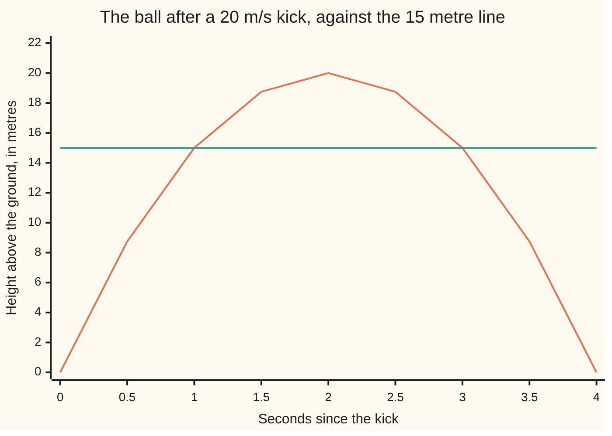
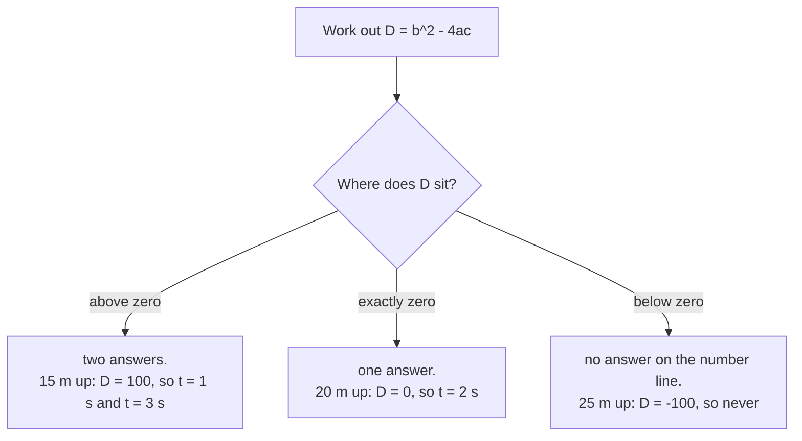

# The quadratic formula: complete the square once and every quadratic is solved, and the discriminant says how many answers

[Syllabus](../../../SYLLABUS.md) → [Algebra](../../../SYLLABUS.md#w03) → [Polynomials](../../../SYLLABUS.md#w03-s02) → The quadratic formula

---

## General Overview

A football is kicked straight up at 20 metres a second. Its height t seconds later is 20t - 5t^2 metres — a polynomial of degree 2 ([Polynomials](01-polynomials.md)).

Forwards is easy: put t = 2 in and the height is 20 metres.

Backwards is harder: the height is handed to you and the time is missing. **When is the ball 15 metres up?**

Set the height to 15 and move everything to one side:

5t^2 - 20t + 15 = 0.

Factoring cracks that one. Divide by 5 to get t^2 - 4t + 3 = 0, which un-multiplies into (t - 1)(t - 3) = 0. A product is zero only when one of its factors is zero ([Factoring](02-factoring-quadratics.md)). So t = 1 and t = 3.

Move the height a little and those whole numbers stop being whole; factoring goes quiet.

The quadratic formula never goes quiet. Hand it the three numbers the equation is built from and back come the answers. It also carries the **discriminant**: one number, worked out first, saying whether there are two answers, one, or none.

**Completing the square turns any quadratic into "something squared equals a number"; do it once with letters instead of numbers and out comes a formula that solves every quadratic there will ever be.**

### The picture: the ball, and the 15 metre line



The arch is the ball's height, the flat line 15 metres. They meet at 1 second going up and 3 seconds coming down — the two crossings 5t^2 - 20t + 15 = 0 asks for.

---

## The formula

A **quadratic** is any equation written as a squared term, a plain term and a number, adding to zero:

$$a x^2 + b x + c = 0$$

The letter $x$ is the unknown; here it is the time $t$ in seconds. The numbers $a$, $b$ and $c$ are the coefficients ([Polynomials](01-polynomials.md)). Only $a$ has a condition: not zero. A zero $a$ kills the squared term and leaves a straight-line equation ([Linear equations](../01-Letters%20and%20Equations/02-linear-equations.md)).

The answers are

$$x = \frac{-b \pm \sqrt{b^2 - 4ac}}{2a}$$

**Read it aloud:** start with minus $b$; add the square root of $b$ squared minus four $a c$ for one answer, subtract it for the other; divide each by two $a$.

The plus-or-minus sign is not a hedge: it is two answers on one line.

| Symbol | Plain meaning | In our example | Push it up and the answer… |
| --- | --- | --- | --- |
| $x$ | the unknown being solved for | the time in seconds | — |
| $t$ | seconds since the kick | 1 and 3 | — |
| $a$ | the number in front of the squared term | 5 | the arch narrows, the answers close in |
| $b$ | the number in front of the plain term | -20 | the pair slides sideways along the arch |
| $c$ | the number standing alone | 15 | both walk toward the middle, then vanish |
| $D$ | the discriminant, under the square root | 100 | the answers pull further apart |

One helper, already inside the formula:

$$D = b^2 - 4ac$$

Square $b$, then subtract four times $a$ times $c$. Work it out first: it settles the answer's shape before any root is taken.



---

## Why it works

### Step 0: a square is the one thing that unwinds in a single move

Suppose you reach (t - 2)^2 = 1. That is finished work. Something squared is 1, so that something is 1 or -1, because squaring throws the sign away ([Roots](../../01-Foundations/03-Powers%2C%20Roots%20and%20Logarithms/03-roots-and-fractional-exponents.md)). So t = 3 or t = 1.

Nothing else in algebra opens that cleanly, so the plan is to force every quadratic into that shape: **completing the square**.

### Step 1: get the squared term bare

Divide 5t^2 - 20t + 15 = 0 by 5:

t^2 - 4t + 3 = 0.

Same equation, squared term now alone. With letters, divide by $a$:

$$x^2 + \frac{b}{a}x + \frac{c}{a} = 0$$

### Step 2: add the missing corner, then take it straight back off

A perfect square opens out like this, where h is whatever sits inside the bracket:

$$(x + h)^2 = x^2 + 2hx + h^2$$

The middle term is that inside number doubled, times $x$. So the number is half the middle coefficient, and the leftover is it squared.

On the numbers: half of -4 is -2, and (t - 2)^2 = t^2 - 4t + 4 — what we have, plus 4. So t^2 - 4t + 3 = 0 becomes (t - 2)^2 - 4 + 3 = 0, and (t - 2)^2 = 1.

Step 0 finishes it: t = 1 and t = 3.

On the letters: half of b/a is b/(2a), and the leftover is its square:

$$\left(x + \frac{b}{2a}\right)^2 - \frac{b^2}{4a^2} + \frac{c}{a} = 0$$

### Step 3: move the loose numbers across

$$\left(x + \frac{b}{2a}\right)^2 = \frac{b^2}{4a^2} - \frac{c}{a} = \frac{b^2 - 4ac}{4a^2}$$

<details>
<summary>Putting those two fractions over one line</summary>

Give them the same bottom: multiply top and bottom of c/a by 4a and it becomes 4ac over 4a^2. The top then reads b^2 - 4ac. The discriminant is not invented; it turns up here.

</details>

### Step 4: take the square root of both sides, both signs

The bottom is 4a^2, whose square root is 2a. (If $a$ is negative the root is -2a, and the plus-or-minus covers it.)

$$x + \frac{b}{2a} = \pm\,\frac{\sqrt{b^2 - 4ac}}{2a}$$

Take b/(2a) off both sides. Both pieces sit over 2a, so they join up:

$$x = \frac{-b \pm \sqrt{b^2 - 4ac}}{2a}$$

That is the formula: those four steps done on letters instead of numbers.

### Step 5: the discriminant was in the derivation all along

Everything there is ordinary arithmetic except the square root, and under it sits the discriminant.

- Above zero: the root is a real number, so adding and subtracting it give two answers.
- Exactly zero: the root is zero, so both signs give the same answer, -b/(2a) — one moment, counted twice.
- Below zero: nothing on the number line squares to a negative, so there is no root and no answer.

When the discriminant is not a perfect square the root runs on forever without repeating, and the answers are irrational ([Irrational numbers](../../01-Foundations/02-The%20Number%20Line/03-irrational-numbers.md)). Ours is 100, so the root is exactly 10 and the times are whole.

<details>
<summary>The two answers add and multiply to something you can read off the equation</summary>

Add them: the plus root and the minus root cancel, leaving (-b + -b) / (2a), which is -b/a. Multiply them: a difference of two squares, b^2 - (b^2 - 4ac) = 4ac, over 4a^2, which is c/a.
So the answers of any quadratic add to -b/a and multiply to c/a — Vieta's formulas, after François Viète. The fastest check there is.
For the ball: -b/a is 20/5 = 4 and c/a is 15/5 = 3, and the answers 1 and 3 add to 4 and multiply to 3.

</details>

Factoring is quicker when it works: 5t^2 - 20t + 15 is 5(t - 1)(t - 3), read off the brackets ([Factoring](02-factoring-quadratics.md)). It needs kind numbers; the formula needs nothing.

---

## Worked numbers, by hand

The ball at 15 metres is 5t^2 - 20t + 15 = 0, so a = 5, b = -20 and c = 15.

| Step | Arithmetic | Value |
| --- | --- | --- |
| $b$ squared | (-20) × (-20) | 400 |
| four $a c$ | 4 × 5 × 15 | 300 |
| the discriminant | 400 - 300 | 100 |
| its square root | the number that squares to 100 | 10 |
| minus $b$ | -(-20) | 20 |
| two $a$ | 2 × 5 | 10 |
| the minus answer | (20 - 10) / 10 | **1** |
| the plus answer | (20 + 10) / 10 | **3** |

15 metres is passed twice: at 1 second climbing, 3 seconds falling. Sum and product agree: 1 + 3 = 4 is -b/a = 20/5, and 1 × 3 = 3 is c/a = 15/5.

Two more heights, only $c$ changing.

- **20 metres.** 5t^2 - 20t + 20 = 0, discriminant 400 - 400 = 0. One answer, t = 20/10 = 2: the top of the arch.
- **25 metres.** 5t^2 - 20t + 25 = 0, discriminant 400 - 500 = -100. Below zero, no answer: this kick does not reach 25 metres.

### What breaks if you drop a piece

| Mistake | Comes out at | What went wrong |
| --- | --- | --- |
| Using $b$ where the formula says minus $b$ | t = -3.00 and -1.00 | b is -20, so minus b is +20. Both answers land before the kick. |
| Dividing only the square root by two $a$ | t = 19.00 and 21.00 | The 2a sits under the whole top, brackets and all. |
| Rooting $b$ squared and four $a c$ apart | t = 1.73 and 2.27 | The root of a difference is not the difference of the roots. |

Both checks print all three. The third is dangerous: 1.73 and 2.27 straddle the top of the arch and look reasonable.

---

## Code, from first principles, and it actually runs

Neither script imports anything, and neither gets a ready-made square root: both build one by Newton's method, averaging a guess with the number divided by that guess. Road one is the formula. Road two completes the square in arithmetic and must land on the same two times. Each answer then goes back into 5t^2 - 20t + 15 to watch zero come out, and the sum and product are checked against -b/a and c/a.

### Python

```python
# The quadratic formula -- the check behind the card.  Nothing is imported; the
# square root is built here by Newton's method.  A football is kicked straight up
# at 20 m/s, so its height t seconds later is 20t - 5t^2 metres.  Asking when the
# ball is H metres up means solving 5t^2 - 20t + H = 0.
def root(v):                                   # square root, built from scratch
    g = v if v > 1.0 else 1.0
    for _ in range(60):                        # Newton: average a guess with v/guess
        g = (g + v / g) / 2.0
    return g

def height(t): return 20 * t - 5 * t * t       # the ball, t seconds after the kick

def poly(t): return 5 * t * t - 20 * t + 15    # 5t^2 - 20t + 15, the 15 m question

def formula(a, b, c):                          # road one: the quadratic formula
    d = b * b - 4 * a * c
    if d < 0:
        return d, []
    if d == 0:
        return d, [-b / (2 * a)]
    s = root(float(d))
    return d, [(-b - s) / (2 * a), (-b + s) / (2 * a)]

def by_square(a, b, c):                        # road two: completing the square
    p, q = b / a, c / a                        # divide through: t^2 + p*t + q = 0
    m = -p / 2.0                               # the middle, halfway between answers
    k = m * m - q                              # (t - m)^2 = k
    return m, k, [m - root(k), m + root(k)]

ts = [0.0, 0.5, 1.0, 1.5, 2.0, 2.5, 3.0, 3.5, 4.0]
print("the ball's height, 20t - 5t^2 metres")
print("t, seconds      " + "".join(f"{t:>7.1f}" for t in ts))
print("height, metres  " + "".join(f"{height(t):>7.2f}" for t in ts))
words = ["no answers", "one answer", "two answers"]
for want in (15, 20, 25):
    d, r = formula(5, -20, want)
    shown = " and ".join(f"{x:.2f}" for x in r) if r else "never"
    print(f"{want} m up:  5t^2 - 20t + {want} = 0   b^2 = {20 * 20}   4ac = {4 * 5 * want}"
          f"   D = {d:>4}   t = {shown:<17} ({words[len(r)]})")
r15 = formula(5, -20, 15)[1]
mid, k, sq = by_square(5, -20, 15)
print(f"the 15 m arithmetic:  -b = {20},  2a = {2 * 5},  the root of D = {root(100.0):.2f},"
      f"  so t = ({20} - {root(100.0):.2f}) / {2 * 5} and ({20} + {root(100.0):.2f}) / {2 * 5}")
print(f"completing the square:  (t - {mid:.2f})^2 = {k:.2f}, so t = {mid:.2f} minus "
      f"{root(k):.2f} and {mid:.2f} plus {root(k):.2f}, landing on {sq[0]:.2f} and {sq[1]:.2f}")
print(f"put each answer back into 5t^2 - 20t + 15:  {poly(r15[0]):.2f} at t = {r15[0]:.2f}, "
      f"{poly(r15[1]):.2f} at t = {r15[1]:.2f}")
print(f"sum and product:  {r15[0]:.2f} + {r15[1]:.2f} = {r15[0] + r15[1]:.2f} = -b/a,  "
      f"{r15[0]:.2f} x {r15[1]:.2f} = {r15[0] * r15[1]:.2f} = c/a")
split = root(400.0) - root(300.0)                       # rooting b^2 and 4ac apart
m1 = [(-20 - 10) / 10, (-20 + 10) / 10]                 # the minus sign on -b dropped
m2 = [20 - 10 / 10, 20 + 10 / 10]                       # only the root divided by 2a
m3 = [(20 - split) / 10, (20 + split) / 10]
print(f"the three mistakes come out at:  {m1[0]:.2f} and {m1[1]:.2f}, {m2[0]:.2f} and "
      f"{m2[1]:.2f}, {m3[0]:.2f} and {m3[1]:.2f}")
assert abs(r15[0] - 1.0) < 1e-12 and abs(r15[1] - 3.0) < 1e-12
assert abs(sq[0] - 1.0) < 1e-12 and abs(sq[1] - 3.0) < 1e-12 and abs(poly(r15[0])) < 1e-12
assert abs(r15[0] + r15[1] - 20 / 5) < 1e-12 and abs(r15[0] * r15[1] - 15 / 5) < 1e-12
assert [formula(5, -20, h)[0] for h in (15, 20, 25)] == [100, 0, -100]
print("ALL CHECKS PASS")
```

**Ran 2026-09-07 on macOS, Python 3.14.6, standard library only. All checks passed. Output, pasted from the run:**

```
the ball's height, 20t - 5t^2 metres
t, seconds          0.0    0.5    1.0    1.5    2.0    2.5    3.0    3.5    4.0
height, metres     0.00   8.75  15.00  18.75  20.00  18.75  15.00   8.75   0.00
15 m up:  5t^2 - 20t + 15 = 0   b^2 = 400   4ac = 300   D =  100   t = 1.00 and 3.00     (two answers)
20 m up:  5t^2 - 20t + 20 = 0   b^2 = 400   4ac = 400   D =    0   t = 2.00              (one answer)
25 m up:  5t^2 - 20t + 25 = 0   b^2 = 400   4ac = 500   D = -100   t = never             (no answers)
the 15 m arithmetic:  -b = 20,  2a = 10,  the root of D = 10.00,  so t = (20 - 10.00) / 10 and (20 + 10.00) / 10
completing the square:  (t - 2.00)^2 = 1.00, so t = 2.00 minus 1.00 and 2.00 plus 1.00, landing on 1.00 and 3.00
put each answer back into 5t^2 - 20t + 15:  0.00 at t = 1.00, 0.00 at t = 3.00
sum and product:  1.00 + 3.00 = 4.00 = -b/a,  1.00 x 3.00 = 3.00 = c/a
the three mistakes come out at:  -3.00 and -1.00, 19.00 and 21.00, 1.73 and 2.27
ALL CHECKS PASS
```

### Rust

Same numbers and labels, built with `rustc --edition 2021 -O`.

```rust
// The quadratic formula -- the same check as the Python, in Rust.  No crates; the
// square root is built here by Newton's method.  A football is kicked straight up
// at 20 m/s, so its height t seconds later is 20t - 5t^2 metres.  Asking when the
// ball is H metres up means solving 5t^2 - 20t + H = 0.
fn root(v: f64) -> f64 {                       // square root, built from scratch
    let mut g = if v > 1.0 { v } else { 1.0 };
    for _ in 0..60 {                           // Newton: average a guess with v/guess
        g = (g + v / g) / 2.0;
    }
    g
}

fn height(t: f64) -> f64 { 20.0 * t - 5.0 * t * t }        // the ball, t seconds on

fn poly(t: f64) -> f64 { 5.0 * t * t - 20.0 * t + 15.0 }   // the 15 m question

fn formula(a: i64, b: i64, c: i64) -> (i64, Vec<f64>) {    // road one: the formula
    let d = b * b - 4 * a * c;
    if d < 0 { return (d, Vec::new()); }
    let (af, bf) = (a as f64, b as f64);
    if d == 0 { return (d, vec![-bf / (2.0 * af)]); }
    let s = root(d as f64);
    (d, vec![(-bf - s) / (2.0 * af), (-bf + s) / (2.0 * af)])
}

fn by_square(a: f64, b: f64, c: f64) -> (f64, f64, Vec<f64>) {  // road two
    let (p, q) = (b / a, c / a);               // divide through: t^2 + p*t + q = 0
    let m = -p / 2.0;                          // the middle, halfway between answers
    let k = m * m - q;                         // (t - m)^2 = k
    (m, k, vec![m - root(k), m + root(k)])
}

fn main() {
    let ts = [0.0, 0.5, 1.0, 1.5, 2.0, 2.5, 3.0, 3.5, 4.0];
    println!("the ball's height, 20t - 5t^2 metres");
    let mut secs = String::from("t, seconds      ");
    let mut mets = String::from("height, metres  ");
    for &t in ts.iter() {
        secs.push_str(&format!("{:>7.1}", t));
        mets.push_str(&format!("{:>7.2}", height(t)));
    }
    println!("{}", secs);
    println!("{}", mets);
    let words = ["no answers", "one answer", "two answers"];
    for want in [15i64, 20, 25] {
        let (d, r) = formula(5, -20, want);
        let shown = if r.is_empty() { "never".to_string() } else {
            r.iter().map(|x| format!("{:.2}", x)).collect::<Vec<_>>().join(" and ")
        };
        println!("{} m up:  5t^2 - 20t + {} = 0   b^2 = {}   4ac = {}   D = {:>4}   \
                  t = {:<17} ({})", want, want, 20 * 20, 4 * 5 * want, d, shown, words[r.len()]);
    }
    let r15 = formula(5, -20, 15).1;
    let (mid, k, sq) = by_square(5.0, -20.0, 15.0);
    println!("the 15 m arithmetic:  -b = {},  2a = {},  the root of D = {:.2},  so t = \
              ({} - {:.2}) / {} and ({} + {:.2}) / {}",
             20, 2 * 5, root(100.0), 20, root(100.0), 2 * 5, 20, root(100.0), 2 * 5);
    println!("completing the square:  (t - {:.2})^2 = {:.2}, so t = {:.2} minus {:.2} and \
              {:.2} plus {:.2}, landing on {:.2} and {:.2}",
             mid, k, mid, root(k), mid, root(k), sq[0], sq[1]);
    println!("put each answer back into 5t^2 - 20t + 15:  {:.2} at t = {:.2}, {:.2} at \
              t = {:.2}", poly(r15[0]), r15[0], poly(r15[1]), r15[1]);
    println!("sum and product:  {:.2} + {:.2} = {:.2} = -b/a,  {:.2} x {:.2} = {:.2} = c/a",
             r15[0], r15[1], r15[0] + r15[1], r15[0], r15[1], r15[0] * r15[1]);
    let split = root(400.0) - root(300.0);                    // rooting b^2 and 4ac apart
    let m1 = [(-20.0 - 10.0) / 10.0, (-20.0 + 10.0) / 10.0];  // the minus on -b dropped
    let m2 = [20.0 - 10.0 / 10.0, 20.0 + 10.0 / 10.0];        // only the root over 2a
    let m3 = [(20.0 - split) / 10.0, (20.0 + split) / 10.0];
    println!("the three mistakes come out at:  {:.2} and {:.2}, {:.2} and {:.2}, {:.2} \
              and {:.2}", m1[0], m1[1], m2[0], m2[1], m3[0], m3[1]);
    assert!((r15[0] - 1.0).abs() < 1e-12 && (r15[1] - 3.0).abs() < 1e-12);
    assert!((sq[0] - 1.0).abs() < 1e-12 && (sq[1] - 3.0).abs() < 1e-12 && poly(r15[0]).abs() < 1e-12);
    assert!((r15[0] + r15[1] - 20.0 / 5.0).abs() < 1e-12 && (r15[0] * r15[1] - 15.0 / 5.0).abs() < 1e-12);
    assert_eq!([15i64, 20, 25].map(|h| formula(5, -20, h).0), [100, 0, -100]);
    println!("ALL CHECKS PASS");
}
```

**Ran 2026-09-07 on macOS, rustc 1.98.1, no crates. All checks passed. Output, pasted from the run:**

```
the ball's height, 20t - 5t^2 metres
t, seconds          0.0    0.5    1.0    1.5    2.0    2.5    3.0    3.5    4.0
height, metres     0.00   8.75  15.00  18.75  20.00  18.75  15.00   8.75   0.00
15 m up:  5t^2 - 20t + 15 = 0   b^2 = 400   4ac = 300   D =  100   t = 1.00 and 3.00     (two answers)
20 m up:  5t^2 - 20t + 20 = 0   b^2 = 400   4ac = 400   D =    0   t = 2.00              (one answer)
25 m up:  5t^2 - 20t + 25 = 0   b^2 = 400   4ac = 500   D = -100   t = never             (no answers)
the 15 m arithmetic:  -b = 20,  2a = 10,  the root of D = 10.00,  so t = (20 - 10.00) / 10 and (20 + 10.00) / 10
completing the square:  (t - 2.00)^2 = 1.00, so t = 2.00 minus 1.00 and 2.00 plus 1.00, landing on 1.00 and 3.00
put each answer back into 5t^2 - 20t + 15:  0.00 at t = 1.00, 0.00 at t = 3.00
sum and product:  1.00 + 3.00 = 4.00 = -b/a,  1.00 x 3.00 = 3.00 = c/a
the three mistakes come out at:  -3.00 and -1.00, 19.00 and 21.00, 1.73 and 2.27
ALL CHECKS PASS
```

The two outputs match line for line.

> [!TIP]
> **Try changing**
> Guess first, then run it. An assert halts the program when a number comes out wrong, and these are pinned to the ball.
> - **Ask for a lower height.** Add 10 to the list of heights. Its discriminant is 200: above zero, but not a perfect square, so the times are not whole. They print as 0.59 and 3.41. Nothing halts.
> - **Kick it harder.** Change every `-20` passed to `formula` into `-30`. The ball clears 25 metres, so that row stops saying never, and the first assert halts it: 1.00 and 3.00 belong to the slower kick.
> - **Break road two.** In `by_square`, drop the minus in `m = -p / 2.0`. Road two returns -3.00 and -1.00 while road one still says 1.00 and 3.00, and the second assert halts it.

---

## The usual mistake

> [!warning]
> **Reading a negative discriminant as "the question is broken".** It means no answer on the number line, a fact about the world: 5t^2 - 20t + 25 = 0 says a ball kicked at 20 metres a second never reaches 25 metres. On [The fundamental theorem of algebra](../10-For%20the%20Curious/01-fundamental-theorem-of-algebra.md) the number line grows and the missing answers come back.
>
> - **Forgetting that b carries its own sign.** Here b is -20, so minus b is +20. Backwards gives -3.00 and -1.00: times before the kick.
> - **Dividing only part of the top by two a.** All of minus b, plus or minus the root, goes over 2a.
> - **Splitting the square root.** What is under the root is one number, rooted last.
> - **Reading a, b and c off an equation not set to zero.** 20t - 5t^2 = 15 must become 5t^2 - 20t + 15 = 0 first.

---

## Where you meet it in real life

- **Anything thrown, dropped or fired.** Height under gravity is a quadratic in time. "When does it pass this height" and "when does it land" are one question asked twice: the landing is 20t - 5t^2 = 0, answered at 0 and 4 seconds.
- **Break-even in a plan.** Sales fall as the price rises, so revenue — price times sales — is a quadratic in price. Set it against costs and the answers are the break-even prices; the discriminant says whether any price pays at all.
- **Inside bigger machinery.** [Eigenvalues and eigenvectors](../07-Eigenvalues%20and%20Symmetric%20Matrices/02-eigenvalues-and-eigenvectors.md) ends on a quadratic, solved by this formula.

> **Say it back**
> A quadratic has a squared unknown, a plain unknown and a number. The one shape that unwinds in a single step is "something squared equals a number", so force the equation into it: halve the middle coefficient, square it, add it, take it back off. Do that once on letters and out drops the quadratic formula. Under its square root sits the discriminant, counting the answers before you find them: above zero two, exactly zero one, below zero none. The ball is 15 metres up at 1 second and again at 3, touches 20 metres at 2 seconds, and never sees 25.

---

## What this builds on

- [Factoring](02-factoring-quadratics.md): un-multiplying a quadratic into two brackets — the lucky road this card replaces with a guaranteed one.
- [Roots](../../01-Foundations/03-Powers%2C%20Roots%20and%20Logarithms/03-roots-and-fractional-exponents.md): square roots, and why taking one gives a plus and a minus answer.
- [Irrational numbers](../../01-Foundations/02-The%20Number%20Line/03-irrational-numbers.md): the answers when the discriminant is not a perfect square.

## Where this goes next

- [Roots and factors](05-roots-and-the-factor-theorem.md): each answer r becomes a factor x - r, so a squared term gives at most two answers.
- [The fundamental theorem of algebra](../10-For%20the%20Curious/01-fundamental-theorem-of-algebra.md): where the answers go when the discriminant is negative.
- [Why there is no quintic formula](../10-For%20the%20Curious/02-why-no-quintic-formula.md): degree 3 and 4 have formulas like this one; degree 5 provably has none.
- [Eigenvalues and eigenvectors](../07-Eigenvalues%20and%20Symmetric%20Matrices/02-eigenvalues-and-eigenvectors.md): a 2 by 2 matrix hands you a quadratic; this formula finishes it.

---

## Sources

Verified 7 Sep 2026: every link below resolves to the publisher's page.

- *College Algebra 2e*, section 2.5, "Quadratic Equations." OpenStax, Rice University. [Textbook page](https://openstax.org/books/college-algebra-2e/pages/2-5-quadratic-equations). Completing the square and the discriminant, side by side.
- Stillwell, John. *Mathematics and Its History*. Springer. [Publisher page](https://link.springer.com/book/10.1007/978-1-4419-6053-5). Where the formula came from.
- "Quadratic, cubic and quartic equations." MacTutor History of Mathematics Archive, University of St Andrews. [Archive page](https://mathshistory.st-andrews.ac.uk/HistTopics/Quadratic_etc_equations/). Babylonian and Arabic history of the method.
- Loh, Po-Shen. "A Simple Proof of the Quadratic Formula." arXiv, 2019. [arXiv:1910.06709](https://arxiv.org/abs/1910.06709). A recent rederivation via the sum and product of the answers.
