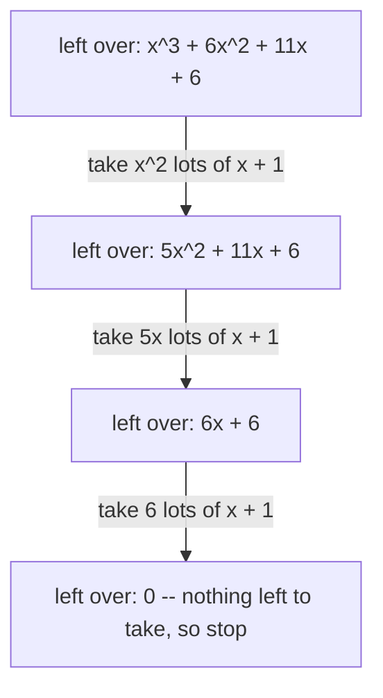
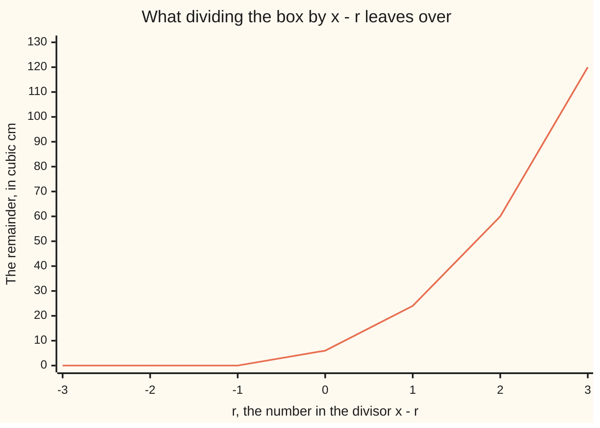

# Polynomial long division: divide with a remainder exactly as with whole numbers, and the remainder is the value at the root

[Syllabus](../../../SYLLABUS.md) → [Algebra](../README.md) → [Polynomials](../README.md#s02) → Polynomial long division

---

## General Overview

A cardboard box holds x^3 + 6x^2 + 11x + 6 cubic cm. One edge has been measured: x + 1 cm. Nobody measured the other two.

The box stands on a face, and volume is that face's area times the height. So the face's area is the volume divided by the edge you know. That division is the job.

Do it and the face, or cross-section, comes out at x^2 + 5x + 6 square cm, which un-multiplies into (x + 2)(x + 3) ([Factoring](02-factoring-quadratics.md)). So the other two edges are x + 2 and x + 3. Set x = 2 and the box is 3 by 4 by 5 cm, holding 60 cubic cm.

Dividing 17 by 5 gives 3 with 2 left over, and the 2 stays put because it is smaller than 5 ([Division with a remainder](../../02-Number%20theory/01-Divisibility%20and%20Primes/04-division-with-remainder.md)). Polynomials do the same with one word swapped: the leftover has to be a *lower power* than the divisor, not a smaller number.

**Divide one polynomial by another the way you divide whole numbers. Stop when what is left has a lower highest power than the thing you divided by. And if you divided by x minus a number, what is left is that polynomial worked out at that number.**

### The picture: the loop, one step at a time



Each arrow removes the biggest power still standing. The labels, added up, are the answer: x^2 + 5x + 6.

---

## The formula

$$p(x) = d(x)\,q(x) + s(x)$$

**Read it aloud:** what you started with is the divisor, times how many of it fit, plus a scrap too small to divide again.

The size rule is half the formula: the scrap's degree must be lower than the divisor's. Degree is the highest power of x present ([Polynomials](01-polynomials.md)). Divide by a degree-1 thing like x + 1 and the scrap is a plain number. And only one pair fits: for a given p and d, one quotient and one scrap.

| Symbol | Plain meaning | In our example | Push it up and the answer… |
| --- | --- | --- | --- |
| $p(x)$ | the polynomial you are cutting up | the volume, x^3 + 6x^2 + 11x + 6 | a higher power here means a longer quotient |
| $d(x)$ | the divisor: what you divide by | the known edge, x + 1 | a higher power leaves a shorter quotient, a roomier scrap |
| $q(x)$ | the quotient: how many of the divisor fit | the face, x^2 + 5x + 6 | its degree is p's degree minus d's |
| $s(x)$ | the scrap left at the end, always lower degree than the divisor | 0 for this edge; 60 for x - 2 | raise d's degree and the scrap may keep an x |
| $r$ | a root: the number that makes x - r equal zero | -1 for the edge x + 1; 2 for x - 2 | move r and the scrap traces the curve of p |

Now the second formula. Divide by x - r and the scrap is a plain number — and that number is p worked out at r:

$$p(x) = (x - r)\,q(x) + p(r)$$

**Read it aloud:** dividing by x minus a number leaves the polynomial's value at that number.

---

## Why it works

### Step 0: what a remainder is for

17 = 5 × 3 + 2. The 2 sits there because 5 will not go in again. That is a remainder: what is left when you cannot take another bite. Whole numbers judge that by size, polynomials by degree.

### Step 1: kill the biggest power, then look again

Start with the volume, x^3 + 6x^2 + 11x + 6, and the edge x + 1. The biggest power is x^3, and to make an x^3 out of x + 1 you need x^2 lots of it. Multiply out: x^2 times (x + 1) is x^3 + x^2. Subtract. The x^3 cancels, and 6x^2 - x^2 leaves 5x^2 + 11x + 6.

Look again. The biggest power is 5x^2, so take 5x lots of x + 1, which is 5x^2 + 5x. Subtract: 6x + 6.

Look again. Take 6 lots of x + 1, which is 6x + 6 exactly. Subtract: nothing left.

Add up what you took: x^2 + 5x + 6. That is the quotient, the face of the box.

<details>
<summary>The short way once you trust it: synthetic division</summary>

Dividing by x + 1 means r = -1. Write the coefficients 1, 6, 11, 6. Bring the 1 down. Multiply by -1 and add to the 6: 5. Multiply by -1, add to the 11: 6. Multiply by -1, add to the 6: 0. What you wrote is 1, 5, 6, then 0 — the quotient x^2 + 5x + 6, remainder 0. Same arithmetic, no x's on the page. It only works for a divisor of the form x minus a number.

</details>

### Step 2: the loop cannot run forever

Every pass cancels the leading term, so the highest power drops by at least one. Degrees are whole numbers going down, so within a few passes the degree falls below the divisor's. At that point there is no bite left to take, and what is sitting there is the remainder.

One catch. Each pass divides the leading number by the divisor's leading number. Here that is 1 both times, so the arithmetic stays whole. Divide by 2x + 1 and you divide by 2 every pass, and fractions turn up. The method still works.

### Step 3: why dividing by x - r leaves p(r)

Put the number r in place of x:

$$p(r) = (r - r)\,q(r) + s = 0 \times q(r) + s = s$$

x - r was built to vanish at r, so whatever the quotient is worth there gets multiplied by zero and disappears. Only the scrap survives, and a degree-1 divisor leaves it a plain number.

For the box: x + 1 is x - (-1), so r is -1. The volume at -1 is -1 + 6 - 11 + 6 = 0. Remainder zero, so x + 1 really is an edge.

Divide the same box by x - 2 and the remainder is 60 — the volume at x = 2, the 3 by 4 by 5 box.

### The picture: the remainder, as the root moves



The line is the remainder from the full division, and also the volume worked out at r: one line does for both. It sits on zero at r = -3, -2 and -1, where the divisor goes in exactly, matching the edges x + 3, x + 2 and x + 1. At r = 2 it is 60, the 3 by 4 by 5 box.

A remainder of zero means a factor, and a factor means a root ([Roots and factors](05-roots-and-the-factor-theorem.md)).

---

## Worked numbers, by hand

The box: volume x^3 + 6x^2 + 11x + 6, known edge x + 1.

| Step | Arithmetic | Value |
| --- | --- | --- |
| what you start with | the volume | x^3 + 6x^2 + 11x + 6 |
| take x^2 lots of x + 1 | subtract x^3 + x^2 | 5x^2 + 11x + 6 |
| take 5x lots of x + 1 | subtract 5x^2 + 5x | 6x + 6 |
| take 6 lots of x + 1 | subtract 6x + 6 | **0** |
| the quotient | x^2 and 5x and 6, added up | **x^2 + 5x + 6** |
| check by multiplying back | (x + 1)(x^2 + 5x + 6) | **x^3 + 6x^2 + 11x + 6** |

The face is x^2 + 5x + 6 square cm, which un-multiplies into (x + 2)(x + 3): the edges are x + 1, x + 2 and x + 3. At x = 2 that is the 3 by 4 by 5 box, 60 cubic cm.

Divide the same volume by x - 2 and it does not go exactly: quotient x^2 + 8x + 27, remainder 60 — the volume at x = 2.

### What breaks if you drop a piece

| Mistake | Comes out at | What went wrong |
| --- | --- | --- |
| Stopping while an x is still standing | quotient x^2 + 5x, leftover 6x + 6 | the leftover is degree 1, same as x + 1: one more bite left |
| Binning the remainder 60 | 0 at x = 2, not 60 | x - 2 is zero at x = 2, so the quotient contributes nothing there |
| Reading the root of x + 1 as 1 | p(1) = 24, so x + 1 looks like no factor | the root is what makes the divisor zero, which is -1 |

The code prints all three.

---

## Code, from first principles, and it actually runs

Nothing is imported. The division is the loop from Step 1: kill the leading power, subtract, repeat. It runs on x + 1, then on x - 2. Two roads check it. The first multiplies the quotient back out against the volume, and against (x + 2)(x + 3). The second drops polynomials: at x = 10 the box is 11 by 12 by 13 cm, so 1716 divided by 11 gives 156, the face at 10. Last, the remainder for x - r is matched to the volume at r, at seven values of r.

### Python

```python
# Polynomial long division -- the check behind the card.  Nothing is imported.  A box
# holds x^3 + 6x^2 + 11x + 6 cubic cm, one edge is x + 1 cm.  Coefficients are listed
# highest power first: [1, 6, 11, 6] is the volume, [1, 1] the edge.  Both divisors start with 1.
P, D, E = [1, 6, 11, 6], [1, 1], [1, -2]      # the volume, the edge x + 1, and x - 2

def show(c):                                  # coefficients back into readable form
    out = ""
    for i, a in enumerate(c):
        k = len(c) - 1 - i                    # the power this coefficient sits on
        if a == 0: continue
        t = ("" if abs(a) == 1 and k else str(abs(a))) + ("x" if k else "") + (f"^{k}" if k > 1 else "")
        out += (" + " if a > 0 else " - ") + t if out else (("-" if a < 0 else "") + t)
    return out or "0"
def divide(p, d):                             # long division, one leading term a step
    q, s, steps = [], list(p), []
    while len(s) >= len(d):
        c = s[0] // d[0]                      # the term that kills the leading term
        q.append(c)
        for i in range(len(d)): s[i] -= c * d[i]
        s.pop(0)                              # the leading term is now zero: drop it
        steps.append(show(s))
    return q, s, steps
def value(p, x): return sum(a * x ** (len(p) - 1 - i) for i, a in enumerate(p))
def mul(a, b):                                # multiply two polynomials back together
    out = [0] * (len(a) + len(b) - 1)
    for i, u in enumerate(a):
        for j, w in enumerate(b): out[i + j] += u * w
    return out
def add(a, b): return [u + w for u, w in zip(a, [0] * (len(a) - len(b)) + b)]
def line(name, text): print(f"{name:<30}{text}")

q, s, steps = divide(P, D)                    # one road: divide by the edge x + 1
q2, s2, _ = divide(P, E)                      # the same box divided by x - 2
line("p(x), the volume", show(P))
line("d(x), the edge", show(D))
line("leftovers as the loop runs", " | ".join(steps))
line("q(x), the cross-section", show(q))
line("s(x), the remainder", show(s))
line("d(x) q(x) + s(x)", show(add(mul(D, q), s)))
line("(x + 2)(x + 3) multiplied out", show(mul([1, 2], [1, 3])))
line("p(-1), at the root of x + 1", value(P, -1))
edge = [value(D, 2), value([1, 2], 2), value([1, 3], 2)]
print(f"at x = 2 the box is {edge[0]} by {edge[1]} by {edge[2]}, volume {value(P, 2)}")
ten = [value(D, 10), value([1, 2], 10), value([1, 3], 10)]   # second road: plain numbers
print(f"at x = 10 the box is {ten[0]} by {ten[1]} by {ten[2]}: {value(P, 10)} / {ten[0]} = "
      f"{value(P, 10) // ten[0]} remainder {value(P, 10) % ten[0]}")
line("divide p(x) by x - 2", f"{show(q2)}   remainder {show(s2)}")
line("p(2), at the root of x - 2", value(P, 2))
roots = list(range(-3, 4))
line("r", "".join(f"{r:>4}" for r in roots))
line("remainder, dividing by x - r", "".join(f"{divide(P, [1, -r])[1][0]:>4}" for r in roots))
line("p(r)", "".join(f"{value(P, r):>4}" for r in roots))
print(f"stopping a step early: quotient {show(q[:2] + [0])}, leftover {steps[1]}")
print(f"dropping the remainder 60 leaves {value(mul(q2, E), 2)} at x = 2; "
      f"the root of x + 1 read as 1 gives p(1) = {value(P, 1)}")
assert q == mul([1, 2], [1, 3]) and s == [0]        # the cross-section, from the factors
assert add(mul(D, q), s) == P and add(mul(E, q2), s2) == P
assert [divide(P, [1, -r])[1][0] for r in roots] == [value(P, r) for r in roots]
assert value(P, 10) == 1716 and value(P, 10) // ten[0] == value(q, 10) and value(P, 10) % ten[0] == 0
print("ALL CHECKS PASS")
```

**Ran 2026-09-07 on macOS, Python 3.14.6, standard library only. All checks passed. Output, pasted from the run:**

```
p(x), the volume              x^3 + 6x^2 + 11x + 6
d(x), the edge                x + 1
leftovers as the loop runs    5x^2 + 11x + 6 | 6x + 6 | 0
q(x), the cross-section       x^2 + 5x + 6
s(x), the remainder           0
d(x) q(x) + s(x)              x^3 + 6x^2 + 11x + 6
(x + 2)(x + 3) multiplied out x^2 + 5x + 6
p(-1), at the root of x + 1   0
at x = 2 the box is 3 by 4 by 5, volume 60
at x = 10 the box is 11 by 12 by 13: 1716 / 11 = 156 remainder 0
divide p(x) by x - 2          x^2 + 8x + 27   remainder 60
p(2), at the root of x - 2    60
r                               -3  -2  -1   0   1   2   3
remainder, dividing by x - r     0   0   0   6  24  60 120
p(r)                             0   0   0   6  24  60 120
stopping a step early: quotient x^2 + 5x, leftover 6x + 6
dropping the remainder 60 leaves 0 at x = 2; the root of x + 1 read as 1 gives p(1) = 24
ALL CHECKS PASS
```

### Rust

Same numbers, same labels, built with `rustc --edition 2021 -O`.

```rust
// Polynomial long division -- the same check as the Python, in Rust.  No crates.  A box holds
// x^3 + 6x^2 + 11x + 6 cubic cm, edge x + 1 cm.  Highest power first; both divisors start with 1.
fn show(c: &[i64]) -> String {                // coefficients back into readable form
    let mut out = String::new();
    for (i, &a) in c.iter().enumerate() {
        let k = c.len() - 1 - i;              // the power this coefficient sits on
        if a == 0 { continue; }
        let mut t = String::new();
        if !(a.abs() == 1 && k > 0) { t += &a.abs().to_string(); }
        if k > 0 { t.push('x'); }
        if k > 1 { t += &format!("^{}", k); }
        if out.is_empty() { out = if a < 0 { format!("-{}", t) } else { t }; }
        else { out += if a > 0 { " + " } else { " - " }; out += &t; }
    }
    if out.is_empty() { "0".to_string() } else { out }
}
fn divide(p: &[i64], d: &[i64]) -> (Vec<i64>, Vec<i64>, Vec<String>) {
    let (mut q, mut s, mut steps) = (Vec::new(), p.to_vec(), Vec::new());
    while s.len() >= d.len() {                // long division, one leading term a step
        let c = s[0] / d[0];                  // the term that kills the leading term
        q.push(c);
        for i in 0..d.len() { s[i] -= c * d[i]; }
        s.remove(0);                          // the leading term is now zero: drop it
        steps.push(show(&s));
    }
    (q, s, steps)
}
fn value(p: &[i64], x: i64) -> i64 {          // the polynomial worked out at a number
    (0..p.len()).map(|i| p[i] * x.pow((p.len() - 1 - i) as u32)).sum()
}
fn mul(a: &[i64], b: &[i64]) -> Vec<i64> {    // multiply two polynomials back together
    let mut out = vec![0; a.len() + b.len() - 1];
    for (i, &u) in a.iter().enumerate() {
        for (j, &w) in b.iter().enumerate() { out[i + j] += u * w; }
    }
    out
}
fn add(a: &[i64], b: &[i64]) -> Vec<i64> {
    let mut out = a.to_vec();                 // b is the shorter one: line up the ends
    for (i, &w) in b.iter().enumerate() { out[a.len() - b.len() + i] += w; }
    out
}
fn line(name: &str, text: &str) { println!("{:<30}{}", name, text); }
fn row(v: &[i64]) -> String { v.iter().map(|n| format!("{:>4}", n)).collect() }
fn main() {
    let (p, d, e) = ([1i64, 6, 11, 6], [1i64, 1], [1i64, -2]);   // volume, x + 1, x - 2
    let (q, s, steps) = divide(&p, &d);       // one road: divide by the edge x + 1
    let (q2, s2, _) = divide(&p, &e);         // the same box divided by x - 2
    line("p(x), the volume", &show(&p));
    line("d(x), the edge", &show(&d));
    line("leftovers as the loop runs", &steps.join(" | "));
    line("q(x), the cross-section", &show(&q));
    line("s(x), the remainder", &show(&s));
    line("d(x) q(x) + s(x)", &show(&add(&mul(&d, &q), &s)));
    line("(x + 2)(x + 3) multiplied out", &show(&mul(&[1, 2], &[1, 3])));
    line("p(-1), at the root of x + 1", &value(&p, -1).to_string());
    println!("at x = 2 the box is {} by {} by {}, volume {}",
             value(&d, 2), value(&[1, 2], 2), value(&[1, 3], 2), value(&p, 2));
    let ten = value(&d, 10);                  // second road: plain numbers
    println!("at x = 10 the box is {} by {} by {}: {} / {} = {} remainder {}",
             ten, value(&[1, 2], 10), value(&[1, 3], 10), value(&p, 10), ten,
             value(&p, 10) / ten, value(&p, 10) % ten);
    line("divide p(x) by x - 2", &format!("{}   remainder {}", show(&q2), show(&s2)));
    line("p(2), at the root of x - 2", &value(&p, 2).to_string());
    let roots: Vec<i64> = (-3..4).collect();
    let rems: Vec<i64> = roots.iter().map(|&r| divide(&p, &[1, -r]).1[0]).collect();
    let vals: Vec<i64> = roots.iter().map(|&r| value(&p, r)).collect();
    line("r", &row(&roots));
    line("remainder, dividing by x - r", &row(&rems));
    line("p(r)", &row(&vals));
    let mut part = q[..2].to_vec(); part.push(0);
    println!("stopping a step early: quotient {}, leftover {}", show(&part), steps[1]);
    println!("dropping the remainder 60 leaves {} at x = 2; the root of x + 1 read as 1 \
              gives p(1) = {}", value(&mul(&q2, &e), 2), value(&p, 1));
    assert!(q == mul(&[1, 2], &[1, 3]) && s == [0]);   // the cross-section, from the factors
    assert!(add(&mul(&d, &q), &s) == p && add(&mul(&e, &q2), &s2) == p);
    assert!(rems == vals);
    assert!(value(&p, 10) == 1716 && value(&p, 10) / ten == value(&q, 10) && value(&p, 10) % ten == 0);
    println!("ALL CHECKS PASS");
}
```

**Ran 2026-09-07 on macOS, rustc 1.98.1, no crates. All checks passed. Output, pasted from the run:**

```
p(x), the volume              x^3 + 6x^2 + 11x + 6
d(x), the edge                x + 1
leftovers as the loop runs    5x^2 + 11x + 6 | 6x + 6 | 0
q(x), the cross-section       x^2 + 5x + 6
s(x), the remainder           0
d(x) q(x) + s(x)              x^3 + 6x^2 + 11x + 6
(x + 2)(x + 3) multiplied out x^2 + 5x + 6
p(-1), at the root of x + 1   0
at x = 2 the box is 3 by 4 by 5, volume 60
at x = 10 the box is 11 by 12 by 13: 1716 / 11 = 156 remainder 0
divide p(x) by x - 2          x^2 + 8x + 27   remainder 60
p(2), at the root of x - 2    60
r                               -3  -2  -1   0   1   2   3
remainder, dividing by x - r     0   0   0   6  24  60 120
p(r)                             0   0   0   6  24  60 120
stopping a step early: quotient x^2 + 5x, leftover 6x + 6
dropping the remainder 60 leaves 0 at x = 2; the root of x + 1 read as 1 gives p(1) = 24
ALL CHECKS PASS
```

The two outputs match line for line.

> [!TIP]
> **Try changing**
> Guess first, then run it. An assert is a line that stops the program when a number comes out wrong; these are pinned to this box.
> - **Divide by x + 2 instead.** Set `D` to `[1, 2]`. The remainder stays 0, since -2 is the chart's second zero, but the quotient is a different quadratic, so the first assert stops it.
> - **Make the box bigger by one.** Set `P` to `[1, 6, 11, 7]`. The value at -1 is no longer zero, so x + 1 stops fitting, a remainder appears, and the first assert stops it.
> - **Divide by x^2.** Set `E` to `[1, 0, 0]`. The scrap now only has to come in under degree 2, so it may keep an x. The loop stops a step earlier and the reconstruction assert still passes.

---

## The usual mistake

> [!warning]
> **Flipping the sign of the root.** To test whether x + 1 is a factor, work the polynomial out at -1, not at 1. The divisor x + 1 is x - (-1), and the root is whatever makes the divisor zero. At 1 the box comes to 24, and you would throw away a divisor that fits perfectly.
>
> - Stopping while the leftover still has an x in it. 6x + 6 is not lower degree than x + 1: one more bite is owed.
> - Writing the answer as just the quotient. (x - 2) times x^2 + 8x + 27 comes to 0 at x = 2, not 60. A remainder is part of the answer, not a failure.
> - Subtracting only the leading term of the divisor. Every term of it gets multiplied and subtracted.
> - Missing a power. If the volume had no x^2 term, hold the place for it, the way 1002 holds two zeros.

---

## Where you meet it in real life

- **Testing a factor without factoring.** Working the polynomial out at -1 takes one line and tells you x + 1 divides exactly. That is [Roots and factors](05-roots-and-the-factor-theorem.md).
- **Ordinary long division.** The same loop with 10 in place of x: 1716 divided by 11 is 156, nothing left over. That is [Polynomials behave like integers](../09-Rings%20and%20Fields/03-polynomials-behave-like-integers.md).
- **Sizing a part.** A container of known volume with one edge fixed by the shelf it sits on: divide, and the allowed face comes out at once.
- **Check digits on a disc or a network packet.** They are the remainder of a polynomial division, and the receiver divides again. A remainder of zero means the check passed.

> **Say it back**
> Polynomials divide like whole numbers. Take away multiples of the divisor, biggest power first, and stop when what is left has a lower highest power than the divisor. Divisor times quotient plus remainder is what you started with, and that pair is the only one that fits. The box of volume x^3 + 6x^2 + 11x + 6 with edge x + 1 has face x^2 + 5x + 6, which is (x + 2)(x + 3): at x = 2, the 3 by 4 by 5 box, 60 cubic cm. Divide by x minus a number and the remainder is the polynomial worked out at that number, so a remainder of zero means a factor.

---

## What this builds on

- [Polynomials](01-polynomials.md): what a polynomial is, and what degree means — the "size" that decides when the division stops.
- [Factoring](02-factoring-quadratics.md): un-multiplying the face x^2 + 5x + 6 into (x + 2)(x + 3), the other two edges.
- [Division with a remainder](../../02-Number%20theory/01-Divisibility%20and%20Primes/04-division-with-remainder.md): the whole-number original, where the leftover has to be smaller than the divisor.

## Where this goes next

- [Roots and factors](05-roots-and-the-factor-theorem.md): a remainder of zero means x - r is a factor, which caps a degree-n polynomial at n roots.
- [Polynomials behave like integers](../09-Rings%20and%20Fields/03-polynomials-behave-like-integers.md): gcds, the Euclidean algorithm and factoring, carried over from whole numbers on the back of this division.

---

## Sources

Verified 7 Sep 2026: every link below resolves to the publisher's page.

- *College Algebra 2e*, section 5.4, "Dividing Polynomials." OpenStax, Rice University. [Textbook page](https://openstax.org/books/college-algebra-2e/pages/5-4-dividing-polynomials). Long division and synthetic division worked at this level, free.
- Dummit, David S., and Richard M. Foote. *Abstract Algebra*, 3rd ed. Wiley, 2003. [Wiley](https://www.wiley.com/en-us/Abstract+Algebra%2C+3rd+Edition-p-9780471433347). The grown-up statement: the quotient and remainder exist, and are the only pair that works. Publisher page; the book is paid.
- Artin, Michael. *Algebra*, Classic Version, 2nd ed. Pearson. [Pearson](https://www.pearson.com/en-us/subject-catalog/p/Artin-Algebra-Classic-Version-2nd-Edition/P200000006078/9780137980994). Sets this division beside the whole-number one. Publisher page; the book is paid.
