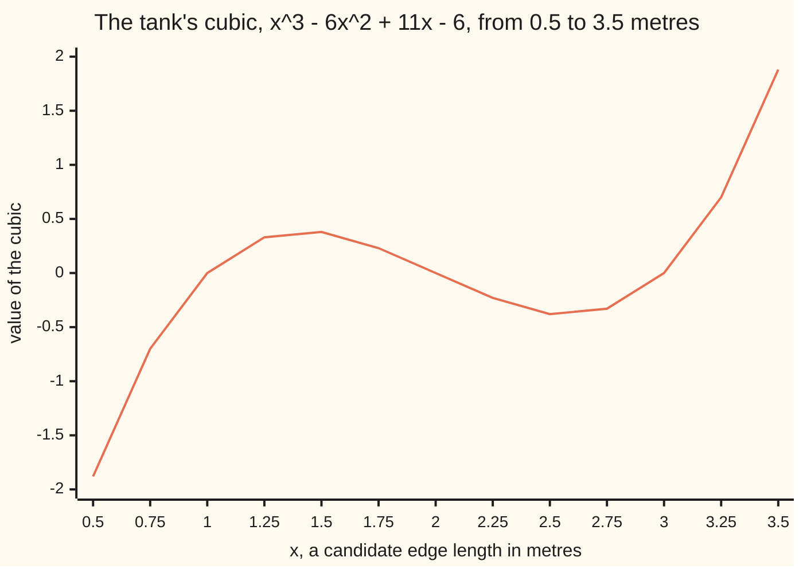
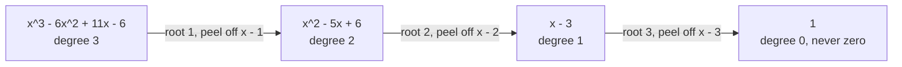

# Roots and factors: a root r means a factor x - r, so a degree-n polynomial has at most n roots

[Syllabus](../../../SYLLABUS.md) → [Algebra](../../../SYLLABUS.md#w03) → [Polynomials](../../../SYLLABUS.md#w03-s02) → Roots and factors

---

## General Overview

A builder measures a rectangular water tank and writes down three numbers. The three edge lengths add to 6 metres. The three pairwise products — length times width, length times height, width times height — add to 11 square metres. The volume, all three edges multiplied, is 6 cubic metres.

What are the edges?

Call one edge x. Those three measurements collapse into one polynomial:

**x^3 - 6x^2 + 11x - 6 = 0**

That comes straight from the measurements. Multiply out (x - first)(x - second)(x - third) for any three numbers and you get x^3, minus their sum times x^2, plus their pairwise products times x, minus their product. Take that on trust here; the two-number version is the sum-and-product check on [The quadratic formula](03-quadratic-formula.md).

So the edges are the inputs that make the cubic come out zero — its roots ([Polynomials](01-polynomials.md)). Try 1: that is 1 - 6 + 11 - 6, which is 0. A hit, and a hit buys more than one answer. Because 1 is a root, the bracket x - 1 divides the cubic exactly, leaving x^2 - 5x + 6 = (x - 2)(x - 3) ([Factoring](02-factoring-quadratics.md)). The tank is 1 metre by 2 metres by 3 metres.

**A root and a factor are one fact in two costumes: the polynomial comes out zero at r exactly when x - r divides it, and since every root uses up one bracket and a polynomial whose highest power is n has only n brackets to give, n is the ceiling on how many different roots it can have.**

### The picture: three crossings, and that is the lot



The line touches zero at 1, 2 and 3 — the three edges. It never does so a fourth time, and the rest of this card is why it cannot.

---

## The formula

Two statements. The first is the factor theorem:

$$p(r) = 0 \quad\text{exactly when}\quad p(x) = (x - r)\,q(x) \text{ for some polynomial } q$$

**Read it aloud:** if the polynomial comes out zero at the number r, then the bracket x - r divides it exactly with nothing left over — and if x - r divides it, the polynomial comes out zero at r.

The second is the ceiling that follows:

$$\text{a polynomial of degree } n \text{, not the flat zero, has at most } n \text{ different roots}$$

**Read it aloud:** the highest power caps how many different inputs can give zero.

| Symbol | Plain meaning | In our tank | Change it and the answer… |
| --- | --- | --- | --- |
| $p$ | the polynomial in hand | x^3 - 6x^2 + 11x - 6 | different tank, different roots |
| $n$ | its degree: the highest power of x in it | 3 | a higher degree allows more roots |
| $r$ | a root: an input where the polynomial comes out zero | 1, 2 and 3 metres | — |
| $x - r$ | the linear factor that root forces | x - 1, x - 2, x - 3 | — |
| $q$ | the quotient: what is left after peeling one factor off | x^2 - 5x + 6 after peeling x - 1 | its degree is always one below $n$ |
| $c$ | the remainder: the plain number left after dividing by x - r | 0 at r = 1, -24 at r = -1 | anything but zero and x - r is not a factor |

---

## Why it works

### Step 0: dividing by x - r always leaves a plain number

Polynomial long division ([Polynomial long division](04-polynomial-division.md)) hands you a quotient and a remainder whose degree sits below the divisor's. The bracket x - r has degree 1, so the remainder has degree 0: a plain number, no x in it. Call it $c$.

$$p(x) = (x - r)\,q(x) + c$$

Now feed in r. The bracket becomes r - r, which is 0, so the whole first term is 0 whatever $q$ is. What survives is

$$p(r) = c.$$

The remainder is the value at r. That is the remainder theorem, already on the division card.

### Step 1: a root and a factor are the same fact

Read that identity in each direction.

If $p(r) = 0$, then $c$ is 0, so the identity reads $p(x) = (x - r)q(x)$. The bracket divides exactly. A root produces a factor.

If instead x - r divides $p$, feed in r: the bracket is 0, so $p(r) = 0$. A factor produces a root.

The tank, twice through: the cubic at 1 is 1 - 6 + 11 - 6 = 0, so x - 1 is a factor and dividing leaves x^2 - 5x + 6. The cubic at -1 is -24, not zero, so x + 1 is not a factor.

### Step 2: each root eats one degree, so the degree is the ceiling

This is a direct proof ([Direct proof](../../01-Foundations/06-Proof/01-direct-proof.md)), and it is peeling.

Take a polynomial $p$ of degree $n$. If it has no root at all, 0 is under the ceiling and there is nothing to argue. If it has a root r, peel: $p(x) = (x - r)q(x)$, and $q$ has degree n - 1, because degrees add when brackets are multiplied.

Now take any other root s, a different number from r. Then $0 = p(s) = (s - r)\,q(s)$. The first bracket is not zero, because s and r differ. A product is zero only when one factor is zero ([Factoring](02-factoring-quadratics.md)), so $q(s) = 0$. Every remaining root of $p$ is a root of the shorter $q$.

Repeat. Each peel costs one root and one degree. After n peels you hold a plain number that is not zero, and so nothing is left to be a root. At most n roots.



Three peels, three roots, and the cubic is spent.

Note the wording: **at most** n, not exactly n. Change the tank's volume from 6 to 12 and the cubic becomes x^3 - 6x^2 + 11x - 12, zero at 4 and nowhere else — one root, degree 3, no such tank. Exactly-n needs numbers this wing has not built yet: [The fundamental theorem of algebra](../10-For%20the%20Curious/01-fundamental-theorem-of-algebra.md).

<details>
<summary>Where to look for the first root</summary>

Peeling needs a first root, and guessing is slow. If a whole number r is a root of the tank's cubic, then r^3 - 6r^2 + 11r = 6, and the left side is r times a whole number, so r divides 6 ([Divides](../../02-Number%20theory/01-Divisibility%20and%20Primes/01-divides.md)). Eight candidates instead of infinitely many: -6, -3, -2, -1, 1, 2, 3, 6. The cubic at those is -504, -120, -60, -24, 0, 0, 0 and 60. Three hits, and they are the whole answer.
This is the rational-root test, stripped to the case where the highest power has a plain 1 in front of it. The full version: a fraction in lowest terms can only be a root if its top divides the constant term and its bottom divides the number in front of the highest power.

</details>

For a quadratic none of this is needed: the quadratic formula hands you both roots at once ([The quadratic formula](03-quadratic-formula.md)). Peeling earns its keep from degree 3 up, where no formula is coming.

---

## Worked numbers, by hand

The tank, start to finish.

| Step | Arithmetic | Value |
| --- | --- | --- |
| test the candidate 1 | 1 - 6 + 11 - 6 | 0, so it is a root |
| peel off x - 1 | divide the cubic by x - 1 | x^2 - 5x + 6, remainder 0 |
| peel off x - 2 | divide that by x - 2 | x - 3, remainder 0 |
| peel off x - 3 | divide that by x - 3 | 1, remainder 0 |
| the roots | | 1, 2, 3 |
| check the edge sum | 1 + 2 + 3 | 6 |
| check the pairwise products | 1×2 + 1×3 + 2×3 | 11 |
| check the volume | 1 × 2 × 3 | **6** |

The tank is **1 metre by 2 metres by 3 metres**: 6 cubic metres, or 6,000 litres.

### What breaks if you drop a piece

| Mistake | Comes out at | What went wrong |
| --- | --- | --- |
| Testing x + 1 instead of x - 1 | remainder -24 | The factor for the root 1 is x - 1. The sign flips. |
| Expecting a cubic to have 3 roots always | 1 root, for x^3 - 6x^2 + 11x - 12 | The ceiling is at most n, not exactly n |
| Counting a repeated root twice | 2 distinct roots, for x^3 - 6x^2 + 9x - 4 | 1 is a root twice over; it is still one number |
| Testing 4, which does not divide 6 | 6, not 0 | A whole-number root has to divide the constant term |

The code prints all four.

---

## Code, from first principles, and it actually runs

The code peels by hand: evaluate the cubic, divide by x - 1, then x - 2, then x - 3, printing each quotient and remainder. A second road runs the other way, multiplying (x - 1)(x - 2)(x - 3) back out from scratch and checking the coefficients land on 1, -6, 11, -6. Then it sweeps every whole number from -20 to 20 for two more cubics.

### Python

```python
# Roots and the factor theorem -- the check behind the card.  Nothing imported.
# The tank: three edges adding to 6 m, pairwise products 11 m^2, volume 6 m^3.
# Its cubic is x^3 - 6x^2 + 11x - 6, written highest power first.
TANK, REPEAT, VOL12 = [1, -6, 11, -6], [1, -6, 9, -4], [1, -6, 11, -12]

def value(p, x):                          # p at x, by nested multiplication
    out = 0
    for c in p:
        out = out * x + c
    return out

def peel(p, r):                           # divide p by x - r: quotient, remainder
    out = [p[0]]
    for c in p[1:]:
        out.append(out[-1] * r + c)
    return out[:-1], out[-1]

def multiply(p, q):                       # road two: multiply two polynomials out
    out = [0] * (len(p) + len(q) - 1)
    for i, a in enumerate(p):
        for j, b in enumerate(q):
            out[i + j] += a * b
    return out

def whole_roots(p):                       # every whole number from -20 to 20 giving 0
    return [x for x in range(-20, 21) if value(p, x) == 0]

def show(p):                              # a list of numbers, as one line
    return " ".join(str(c) for c in p)

print("tank cubic, highest power first:", show(TANK))
print("p at 0, 1, 2, 3, 4:", show([value(TANK, x) for x in range(5)]))
left = TANK
for r in (1, 2, 3):
    q, rem = peel(left, r)
    print(f"peel x - {r}: quotient {show(q)}, remainder {rem}")
    assert rem == 0 and value(TANK, r) == 0
    left = q
rebuilt = multiply(multiply([1, -1], [1, -2]), [1, -3])
print("rebuilt (x - 1)(x - 2)(x - 3):", show(rebuilt))
a, b, c = 1, 2, 3
print(f"edges: sum {a + b + c}, pairwise products {a * b + a * c + b * c}, volume {a * b * c}")
cands = [d for d in range(-6, 7) if d != 0 and 6 % d == 0]
print("whole-number candidates, the divisors of 6:", show(cands))
print("p at those candidates:", show([value(TANK, d) for d in cands]))
print(f"whole roots of the tank cubic in -20..20: {show(whole_roots(TANK))}  (3 of them, degree 3)")
print(f"volume 12 instead, x^3 - 6x^2 + 11x - 12: {show(whole_roots(VOL12))}  (1 root, degree 3)")
print(f"repeated root, x^3 - 6x^2 + 9x - 4: {show(whole_roots(REPEAT))}  (2 distinct, degree 3)")
print("p at -1, the sign slip:", value(TANK, -1))
print("p at 4, a number that does not divide 6:", value(TANK, 4))
xs = [0.5 + 0.25 * i for i in range(13)]
print("chart x:", " ".join(f"{x:.2f}" for x in xs))
print("chart p:", " ".join(f"{value(TANK, x):.2f}" for x in xs))
assert rebuilt == TANK and multiply([1, -1], [1, -2]) == [1, -3, 2]
assert whole_roots(TANK) == [1, 2, 3] and whole_roots(REPEAT) == [1, 4] and whole_roots(VOL12) == [4]
assert value(TANK, -1) == -24 and value(TANK, 4) == 6 and left == [1]
print("ALL CHECKS PASS")
```

**Ran 2026-09-07 on macOS, Python 3.14.6, standard library only. All checks passed. Output, pasted from the run:**

```
tank cubic, highest power first: 1 -6 11 -6
p at 0, 1, 2, 3, 4: -6 0 0 0 6
peel x - 1: quotient 1 -5 6, remainder 0
peel x - 2: quotient 1 -3, remainder 0
peel x - 3: quotient 1, remainder 0
rebuilt (x - 1)(x - 2)(x - 3): 1 -6 11 -6
edges: sum 6, pairwise products 11, volume 6
whole-number candidates, the divisors of 6: -6 -3 -2 -1 1 2 3 6
p at those candidates: -504 -120 -60 -24 0 0 0 60
whole roots of the tank cubic in -20..20: 1 2 3  (3 of them, degree 3)
volume 12 instead, x^3 - 6x^2 + 11x - 12: 4  (1 root, degree 3)
repeated root, x^3 - 6x^2 + 9x - 4: 1 4  (2 distinct, degree 3)
p at -1, the sign slip: -24
p at 4, a number that does not divide 6: 6
chart x: 0.50 0.75 1.00 1.25 1.50 1.75 2.00 2.25 2.50 2.75 3.00 3.25 3.50
chart p: -1.88 -0.70 0.00 0.33 0.38 0.23 0.00 -0.23 -0.38 -0.33 0.00 0.70 1.88
ALL CHECKS PASS
```

### Rust

Same rows, same labels, built with `rustc --edition 2021 -O`.

```rust
// Roots and the factor theorem -- the same check as the Python, in Rust.  No crates.
// The tank: three edges adding to 6 m, pairwise products 11 m^2, volume 6 m^3.
// Its cubic is x^3 - 6x^2 + 11x - 6, written highest power first.
fn value(p: &[i64], x: i64) -> i64 {              // p at x, by nested multiplication
    let mut out = 0;
    for c in p { out = out * x + c; }
    out
}
fn value_f(p: &[i64], x: f64) -> f64 {            // the same at a fractional x, for the chart
    let mut out = 0.0;
    for c in p { out = out * x + *c as f64; }
    out
}
fn peel(p: &[i64], r: i64) -> (Vec<i64>, i64) {   // divide p by x - r: quotient, remainder
    let mut out = vec![p[0]];
    for c in &p[1..] {
        let last = out[out.len() - 1];
        out.push(last * r + c);
    }
    let rem = out.pop().unwrap();
    (out, rem)
}
fn multiply(p: &[i64], q: &[i64]) -> Vec<i64> {   // road two: multiply two polynomials out
    let mut out = vec![0; p.len() + q.len() - 1];
    for (i, a) in p.iter().enumerate() {
        for (j, b) in q.iter().enumerate() { out[i + j] += a * b; }
    }
    out
}
fn whole_roots(p: &[i64]) -> Vec<i64> {           // every whole number from -20 to 20 giving 0
    (-20..=20).filter(|&x| value(p, x) == 0).collect()
}
fn show(p: &[i64]) -> String {                    // a list of numbers, as one line
    p.iter().map(|c| c.to_string()).collect::<Vec<String>>().join(" ")
}
fn main() {
    let tank: Vec<i64> = vec![1, -6, 11, -6];
    let repeat: Vec<i64> = vec![1, -6, 9, -4];
    let vol12: Vec<i64> = vec![1, -6, 11, -12];
    println!("tank cubic, highest power first: {}", show(&tank));
    let first_five: Vec<i64> = (0..5).map(|x| value(&tank, x)).collect();
    println!("p at 0, 1, 2, 3, 4: {}", show(&first_five));
    let mut left = tank.clone();
    for r in [1, 2, 3] {
        let (q, rem) = peel(&left, r);
        println!("peel x - {}: quotient {}, remainder {}", r, show(&q), rem);
        assert!(rem == 0 && value(&tank, r) == 0);
        left = q;
    }
    let rebuilt = multiply(&multiply(&[1, -1], &[1, -2]), &[1, -3]);
    println!("rebuilt (x - 1)(x - 2)(x - 3): {}", show(&rebuilt));
    let (a, b, c) = (1, 2, 3);
    println!("edges: sum {}, pairwise products {}, volume {}",
             a + b + c, a * b + a * c + b * c, a * b * c);
    let cands: Vec<i64> = (-6..=6).filter(|&d| d != 0 && 6 % d == 0).collect();
    println!("whole-number candidates, the divisors of 6: {}", show(&cands));
    let at: Vec<i64> = cands.iter().map(|&d| value(&tank, d)).collect();
    println!("p at those candidates: {}", show(&at));
    println!("whole roots of the tank cubic in -20..20: {}  (3 of them, degree 3)", show(&whole_roots(&tank)));
    println!("volume 12 instead, x^3 - 6x^2 + 11x - 12: {}  (1 root, degree 3)", show(&whole_roots(&vol12)));
    println!("repeated root, x^3 - 6x^2 + 9x - 4: {}  (2 distinct, degree 3)", show(&whole_roots(&repeat)));
    println!("p at -1, the sign slip: {}", value(&tank, -1));
    println!("p at 4, a number that does not divide 6: {}", value(&tank, 4));
    let xs: Vec<f64> = (0..13).map(|i| 0.5 + 0.25 * i as f64).collect();
    let sx: Vec<String> = xs.iter().map(|x| format!("{:.2}", x)).collect();
    let sp: Vec<String> = xs.iter().map(|&x| format!("{:.2}", value_f(&tank, x))).collect();
    println!("chart x: {}", sx.join(" "));
    println!("chart p: {}", sp.join(" "));
    assert!(rebuilt == tank && multiply(&[1, -1], &[1, -2]) == vec![1, -3, 2]);
    assert!(whole_roots(&tank) == vec![1, 2, 3] && whole_roots(&repeat) == vec![1, 4] && whole_roots(&vol12) == vec![4]);
    assert!(value(&tank, -1) == -24 && value(&tank, 4) == 6 && left == vec![1]);
    println!("ALL CHECKS PASS");
}
```

**Ran 2026-09-07 on macOS, rustc 1.98.1, no crates. All checks passed. Output, pasted from the run:**

```
tank cubic, highest power first: 1 -6 11 -6
p at 0, 1, 2, 3, 4: -6 0 0 0 6
peel x - 1: quotient 1 -5 6, remainder 0
peel x - 2: quotient 1 -3, remainder 0
peel x - 3: quotient 1, remainder 0
rebuilt (x - 1)(x - 2)(x - 3): 1 -6 11 -6
edges: sum 6, pairwise products 11, volume 6
whole-number candidates, the divisors of 6: -6 -3 -2 -1 1 2 3 6
p at those candidates: -504 -120 -60 -24 0 0 0 60
whole roots of the tank cubic in -20..20: 1 2 3  (3 of them, degree 3)
volume 12 instead, x^3 - 6x^2 + 11x - 12: 4  (1 root, degree 3)
repeated root, x^3 - 6x^2 + 9x - 4: 1 4  (2 distinct, degree 3)
p at -1, the sign slip: -24
p at 4, a number that does not divide 6: 6
chart x: 0.50 0.75 1.00 1.25 1.50 1.75 2.00 2.25 2.50 2.75 3.00 3.25 3.50
chart p: -1.88 -0.70 0.00 0.33 0.38 0.23 0.00 -0.23 -0.38 -0.33 0.00 0.70 1.88
ALL CHECKS PASS
```

The two outputs match line for line.

> [!TIP]
> **Try changing**
> Guess first, then run it. An assert is a line that stops the program when a number comes out wrong; these are pinned to the tank.
> - **Peel in a different order.** Change `for r in (1, 2, 3)` to `for r in (3, 2, 1)`. Every remainder is still 0 and the last quotient is still 1: the order brackets come off in does not matter.
> - **Peel a number that is not a root.** Change that loop to `for r in (1, 2, 4)`. The third peel leaves a remainder of 1, not 0, and the assert stops it.
> - **Widen the sweep.** Change `range(-20, 21)` to `range(-500, 501)`. Still 1, 2, 3. The ceiling does not care how far you look.

---

## The usual mistake

> [!warning]
> **Believing a degree-3 polynomial has 3 roots.** It has at most 3. Move the tank's volume from 6 cubic metres to 12 and the cubic x^3 - 6x^2 + 11x - 12 is zero at 4 and nowhere else — one root, and no tank with those measurements exists. The ceiling is a ceiling, not a promise.
>
> - Flipping the sign of the bracket. The root 1 gives the factor x - 1, not x + 1. Divide the tank's cubic by x + 1 and you get remainder -24.
> - Counting a repeated root twice. x^3 - 6x^2 + 9x - 4 is (x - 1)(x - 1)(x - 4). Degree 3, but only 2 different numbers are roots.
> - Hunting whole-number roots at numbers that do not divide the constant term. The tank's cubic at 4 comes out 6, not 0, and 4 was never a candidate.
> - Reading "no whole-number root" as "no root". The test rules out fractions and whole numbers only.

---

## Where you meet it in real life

- **Any box or tank problem.** Volume, edge total and pairwise products land in the coefficients of a cubic, exactly as they did here.
- **Sanity-checking a solver.** A calculator that reports four different roots for a cubic has a bug, and this card is why you can say so without redoing the arithmetic.
- **Fitting a curve through points.** Two different degree-2 curves through the same three points would differ by a polynomial of degree at most 2, not the flat zero, with three roots. Impossible, so the curve is the only one.
- **Error-correcting codes.** A scratched disc is repaired on the same ceiling: two short polynomials cannot agree at too many places.

> **Say it back**
> Divide a polynomial by x - r and the remainder is the polynomial's value at r. So the remainder is zero exactly when r is a root, which is exactly when x - r is a factor. Root and factor are the same fact twice. Each root peels off one bracket and drops the degree by one, so the tank's x^3 - 6x^2 + 11x - 6 runs out after three: 1, 2 and 3 metres. Degree n allows at most n roots, often fewer.

---

## What this builds on

- [Polynomial long division](04-polynomial-division.md): the quotient-and-remainder machinery, and the remainder theorem Step 0 leans on entirely.
- [The quadratic formula](03-quadratic-formula.md): finishes the job once peeling has cut the cubic to a quadratic, and carries the sum-and-product fact behind the tank's cubic.
- [Direct proof](../../01-Foundations/06-Proof/01-direct-proof.md): the shape of Step 2 — assume a root, follow the consequences, arrive at the ceiling.
- [Divides](../../02-Number%20theory/01-Divisibility%20and%20Primes/01-divides.md): what "r divides 6" means, which shortens the root hunt to eight candidates.
- [Polynomials](01-polynomials.md): degree, coefficients and what a root is.
- [Factoring](02-factoring-quadratics.md): the zero-product fact Step 2 turns on.

## Where this goes next

- [Polynomials behave like integers](../09-Rings%20and%20Fields/03-polynomials-behave-like-integers.md): peeling factors off a polynomial is the same move as pulling primes out of a whole number.
- [The fundamental theorem of algebra](../10-For%20the%20Curious/01-fundamental-theorem-of-algebra.md): what it takes to turn "at most n" into "exactly n".

---

## Sources

Verified 7 Sep 2026: every link below resolves to the publisher's page.

- *College Algebra 2e*, section 5.5, "Zeros of Polynomial Functions." OpenStax, Rice University. [Textbook page](https://openstax.org/books/college-algebra-2e/pages/5-5-zeros-of-polynomial-functions). The factor theorem, the rational-root test and the root ceiling, free, in the standard school notation.
- Dummit, David S., and Richard M. Foote. *Abstract Algebra*, 3rd ed. Wiley, 2003. [Publisher page](https://www.wiley.com/en-us/Abstract+Algebra%2C+3rd+Edition-p-9780471433347). Chapter 9 gives the factor theorem and the at-most-n bound in their general setting; paid book.
- Artin, Michael. *Algebra*, Classic Version, 2nd ed. Pearson. [Publisher page](https://www.pearson.com/en-us/subject-catalog/p/Artin-Algebra-Classic-Version-2nd-Edition/P200000006078/9780137980994). The same two results, with the peeling argument written out; paid book.
