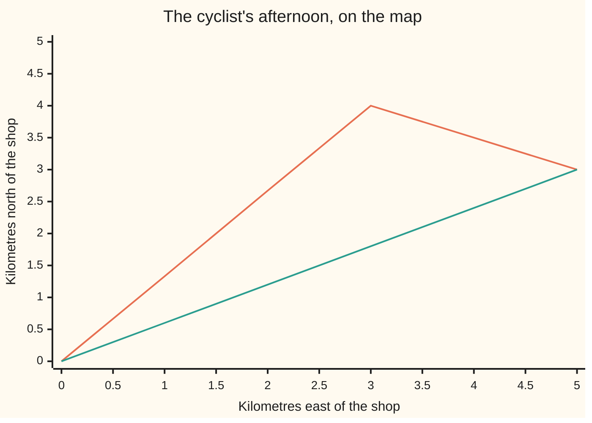
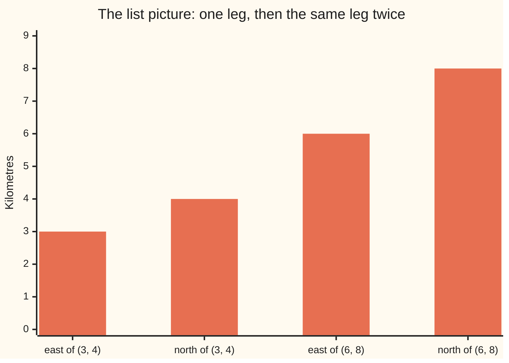

# Vectors: a list of numbers that is also an arrow, and the two things you can do to it

[Syllabus](../../../SYLLABUS.md) → [Algebra](../../../SYLLABUS.md#w03) → [Vectors](../../../SYLLABUS.md#w03-s03) → Vectors

---

## General Overview

A delivery cyclist leaves the shop. First run: 3 km east, then 4 km north. Write the whole run as one thing: (3, 4). Round brackets, two numbers, in a fixed order — east first, north second. That pair is a **vector**.

Second run: 2 km east, then 1 km south. South is north gone negative, so the second run is (2, -1).

Where is the bike now? East: 3 + 2 = 5. North: 4 - 1 = 3. So (5, 3). East never touched north. Each slot — each place in the list — kept to itself.

Now ride the first run twice. That is 6 km east and 8 km north: (6, 8). Both numbers doubled, nothing else changed. Adding and scaling: those are the only two moves there are.

There are two ways to see (3, 4), and they are one object. The **list picture**: two numbers in order. The **arrow picture**: an arrow from the shop to the spot 3 east and 4 north of it.

**A vector is an ordered list of numbers; add two of them by adding matching slots, scale one by multiplying every slot, and that is everything a vector does.**

### The picture: two legs, one arrow



The bent line is the two legs drawn as arrows, tail to head: out to (3, 4), then on to (5, 3). The straight line is the single arrow from the shop to (5, 3). Two legs and one arrow finish in the same place. That is what adding two vectors means.

---

## The formula

A vector is written as its numbers in order inside round brackets: (3, 4). That notation is used from here on.

Name the two runs. Let $u$ = (3, 4) be the first leg and $v$ = (2, -1) the second. The numbers inside get slot numbers: $u_1$ = 3 and $u_2$ = 4, $v_1$ = 2 and $v_2$ = -1. The small number says which slot, not a power. The proper name for the number in a slot is a **component**, which is the word the code below uses.

Adding, slot against matching slot:

$$u + v = (u_1 + v_1, \; u_2 + v_2)$$

Scaling, where $a$ is a **scalar** — one plain number, not a list:

$$a u = (a u_1, \; a u_2)$$

**Read it aloud:** to add, add the firsts and add the seconds; to scale, multiply every number by the same amount.

| Symbol | Plain meaning | In our example | Push it up and the answer… |
| --- | --- | --- | --- |
| $u$ | the first vector: the first leg of the ride | (3, 4) | the finish moves with it |
| $v$ | the second vector: the second leg | (2, -1) | the two legs count equally |
| $u_1$, $u_2$ | the numbers inside the first vector, east then north | 3 and 4 | only that slot changes |
| $v_1$, $v_2$ | the numbers inside the second vector | 2 and -1 | only that slot changes |
| $u + v$ | the two legs added, slot by slot | (5, 3) | — |
| $a$ | a scalar: one plain number, not a list | 2 | the arrow gets longer, same direction |
| $a u$ | the scaled vector: every slot multiplied by $a$ | (6, 8) | — |
| $n$ | how many numbers the list holds | 2 | a longer list; the two rules do not change |

Two numbers is not special. A vector holding $n$ numbers lives in R^n, said "R n": R for the real numbers, the raised $n$ for how many are in the list. R^2 is the flat map, R^3 the room you are sitting in, R^4 and upward no picture at all — n-dimensional just means n numbers. The two rules run down a longer list and are otherwise identical.

One vector gets its own name. The **zero vector**, written 0, is all zeros: (0, 0) in R^2, (0, 0, 0) in R^3. It is the ride that never left the shop. Add it to anything and nothing moves.

---

## Why it works

### Step 0: the slots are separate accounts

Kilometres east and kilometres north do not convert into each other. Riding north never moves the bike east. So a two-number vector is two independent tallies carried around together, and any rule that let them mix would be lying about the road.

### Step 1: adding is doing one leg, then the other

The east tally is 3 + 2 = 5. The north tally is 4 + (-1) = 3. Neither sum consulted the other. Adding vectors is settling each tally on its own: (3, 4) + (2, -1) = (5, 3).

In the arrow picture: park the tail of the second arrow on the head of the first, and the arrow from start to end is the sum. That is the straight line on the chart above.

### Step 2: scaling is repeating the same leg

Ride (3, 4) twice and each tally doubles: 3 + 3 = 6 east, 4 + 4 = 8 north. So 2 × (3, 4) = (6, 8). The code reaches (6, 8) both ways, by multiplying and by adding the leg to itself.

Scaling by a whole number is repeated adding, but the rule works for any number. Scale by 0.5 and the cyclist rides half the run. Scale by -1 and the ride reverses: (-3, -4), the same road home. In the arrow picture, scaling changes the arrow's length and leaves its direction alone — unless the scalar is negative, which flips it end for end.

### Step 3: nothing, and the opposite of something

Scale any vector by 0 and every slot goes to zero. That is the zero vector: (3, 4) scaled by 0 is (0, 0), the ride that never happened. Add it to (3, 4) and (3, 4) comes back.

Scale by -1 and add: (3, 4) + (-3, -4) = (0, 0). Every vector has an opposite that cancels it exactly. A do-nothing vector, and an undo for each one: those two facts are what turn a pile of lists into a structure with rules, which is the next card ([Vector spaces and subspaces](02-vector-spaces-and-subspaces.md)).

The subject can be built from the other end: start with arrows on a page, define adding as head-to-tail and scaling as stretching, then pin each arrow to coordinates and the arithmetic above falls out. The list route is used here because it survives into R^4, where there is nothing left to draw.

---

## Worked numbers, by hand

The cyclist's afternoon, slot by slot.

| Step | Arithmetic | Value |
| --- | --- | --- |
| first leg | 3 km east, 4 km north | (3, 4) |
| second leg | 2 km east, 1 km south | (2, -1) |
| east tally | 3 + 2 | 5 |
| north tally | 4 + (-1) | 3 |
| the two legs added | (3, 4) + (2, -1) | **(5, 3)** |
| the same ride walked 1 km at a time | 3 east, 4 north, 2 east, 1 south | **(5, 3)** |
| the first leg ridden twice | 2 × (3, 4) | **(6, 8)** |
| never left the shop | 0 × (3, 4) | **(0, 0)** |

The bike finishes 5 km east and 3 km north of the shop. One arrow now says everything the two legs said.

Nothing here depends on there being two numbers. Kilometres ridden Monday to Thursday, (12, 9, 15, 11), plus the evening runs, (3, 4, 2, 6), gives (15, 13, 17, 17). Same rule, longer list, no picture — a vector in R^4.

### The picture: the list, doubled



The first two bars are the numbers in (3, 4). The last two are (6, 8), the same leg ridden twice. Scaling lifts every bar by the same factor, never one and not the other.

### What breaks if you drop a piece

| Mistake | Comes out at | What went wrong |
| --- | --- | --- |
| Adding all four numbers into one total | 8 | East was added to north; 8 is not a place |
| Multiplying slot by slot, (3 × 2, 4 × (-1)) | (6, -4) | Multiplying two vectors is a different operation ([The dot product](../06-Dot%20Products%20and%20Best%20Fits/01-dot-product.md)) |
| Doubling only the first number | (6, 4) | Scaling touches every slot or it is not scaling |

The code prints all three.

---

## Code, from first principles, and it actually runs

Nothing is imported. The two legs are added slot by slot. Then the same ride is walked one kilometre at a time — 3 east, 4 north, 2 east, 1 south — by a running tally that never handles a vector. Two roads, one finish. The doubling is done twice over: every slot times 2, and the leg added to itself. A four-number vector runs the identical code, and the three wrong answers from the table are printed too.

### Python

```python
# Vectors -- the check behind the card.  Nothing is imported.  A delivery
# cyclist rides (3 km east, 4 km north), then rides (2, -1).  Two roads to the
# finish: adding the two legs component by component, and walking the whole
# ride one kilometre at a time to see where the bike actually stops.
U, V = (3, 4), (2, -1)                 # the two legs, each a list of two numbers
WEEK, EVENING = (12, 9, 15, 11), (3, 4, 2, 6)   # the same two rules on four numbers

def add(p, q):   return tuple(a + b for a, b in zip(p, q))   # slot by slot
def scale(k, p): return tuple(k * a for a in p)              # every slot times k

def show(name, value): print(f"{name:<46}{str(value):>18}")
def row(name, values): print(f"{name:<46}" + " ".join(f"{v:.2f}" for v in values))

total = add(U, V)                              # road one: add the two lists
east, north = 0, 0                             # road two: walk it, 1 km at a time
for de, dn in [(1, 0)] * 3 + [(0, 1)] * 4 + [(1, 0)] * 2 + [(0, -1)] * 1:
    east, north = east + de, north + dn
walked = (east, north)
zero = scale(0, U)                             # the ride that never happened

show("first leg u", U)
show("second leg v", V)
show("u + v, added component by component", total)
show("where the ride ends, walked one km at a time", walked)
show("2u, the first leg ridden twice", scale(2, U))
show("u + u, the same doubling by adding", add(U, U))
show("the zero vector, never left the shop", zero)
show("u + 0", add(U, zero))
show("u + (-u)", add(U, scale(-1, U)))
path  = [4 * x / 3 if x <= 3 else 4 - (x - 3) / 2 for x in range(6)]   # the two legs
arrow = [total[1] * x / total[0] for x in range(6)]                    # the one arrow
row("path chart, km north at 0,1,2,3,4,5 km east", path)
row("arrow chart, km north at the same six points", arrow)
show("bar chart, east and north of u then of 2u", U + scale(2, U))
show("a week of rides in R^4, WEEK + EVENING", add(WEEK, EVENING))
print(f"the three mistakes come out at {sum(U) + sum(V)}, "
      f"{tuple(a * b for a, b in zip(U, V))} and {(2 * U[0], U[1])}")
assert total == (5, 3) and walked == total          # two roads, one finish
assert scale(2, U) == (6, 8) and add(U, U) == scale(2, U)
assert add(U, zero) == U and add(U, scale(-1, U)) == (0, 0)
assert add(WEEK, EVENING) == (15, 13, 17, 17) and len(add(WEEK, EVENING)) == 4
print("ALL CHECKS PASS")
```

**Ran 2026-09-07 on macOS, Python 3.14.6, standard library only. All checks passed. Output, pasted from the run:**

```
first leg u                                               (3, 4)
second leg v                                             (2, -1)
u + v, added component by component                       (5, 3)
where the ride ends, walked one km at a time              (5, 3)
2u, the first leg ridden twice                            (6, 8)
u + u, the same doubling by adding                        (6, 8)
the zero vector, never left the shop                      (0, 0)
u + 0                                                     (3, 4)
u + (-u)                                                  (0, 0)
path chart, km north at 0,1,2,3,4,5 km east   0.00 1.33 2.67 4.00 3.50 3.00
arrow chart, km north at the same six points  0.00 0.60 1.20 1.80 2.40 3.00
bar chart, east and north of u then of 2u           (3, 4, 6, 8)
a week of rides in R^4, WEEK + EVENING          (15, 13, 17, 17)
the three mistakes come out at 8, (6, -4) and (6, 4)
ALL CHECKS PASS
```

### Rust

Same numbers, same labels, built with `rustc --edition 2021 -O`.

```rust
// Vectors -- the same check as the Python, in Rust.  No crates.  A delivery
// cyclist rides (3 km east, 4 km north), then rides (2, -1).  Two roads to the
// finish: adding the two legs component by component, and walking the whole
// ride one kilometre at a time to see where the bike actually stops.
fn add(p: &[i64], q: &[i64]) -> Vec<i64> {          // slot by slot
    p.iter().zip(q.iter()).map(|(a, b)| a + b).collect()
}
fn scale(k: i64, p: &[i64]) -> Vec<i64> {           // every slot times k
    p.iter().map(|a| k * a).collect()
}
fn fmt(v: &[i64]) -> String {
    let parts: Vec<String> = v.iter().map(|a| a.to_string()).collect();
    format!("({})", parts.join(", "))
}
fn show(name: &str, value: String) { println!("{:<46}{:>18}", name, value); }
fn row(name: &str, values: &[f64]) {
    let parts: Vec<String> = values.iter().map(|v| format!("{:.2}", v)).collect();
    println!("{:<46}{}", name, parts.join(" "));
}
fn main() {
    let u: Vec<i64> = vec![3, 4];                   // the two legs, two numbers each
    let v: Vec<i64> = vec![2, -1];
    let week: Vec<i64> = vec![12, 9, 15, 11];       // the same two rules on four numbers
    let evening: Vec<i64> = vec![3, 4, 2, 6];
    let total = add(&u, &v);                        // road one: add the two lists
    let (mut east, mut north) = (0i64, 0i64);       // road two: walk it, 1 km at a time
    let mut steps: Vec<(i64, i64)> = vec![(1, 0); 3];
    steps.extend(vec![(0, 1); 4]);
    steps.extend(vec![(1, 0); 2]);
    steps.extend(vec![(0, -1); 1]);
    for (de, dn) in &steps { east += de; north += dn; }
    let walked = vec![east, north];
    let zero = scale(0, &u);                        // the ride that never happened
    show("first leg u", fmt(&u));
    show("second leg v", fmt(&v));
    show("u + v, added component by component", fmt(&total));
    show("where the ride ends, walked one km at a time", fmt(&walked));
    show("2u, the first leg ridden twice", fmt(&scale(2, &u)));
    show("u + u, the same doubling by adding", fmt(&add(&u, &u)));
    show("the zero vector, never left the shop", fmt(&zero));
    show("u + 0", fmt(&add(&u, &zero)));
    show("u + (-u)", fmt(&add(&u, &scale(-1, &u))));
    let path: Vec<f64> = (0..6).map(|i| {           // the two legs, bent at (3, 4)
        let x = i as f64;
        if x <= 3.0 { 4.0 * x / 3.0 } else { 4.0 - (x - 3.0) / 2.0 }
    }).collect();
    let arrow: Vec<f64> = (0..6)                    // the one arrow, straight to (5, 3)
        .map(|i| total[1] as f64 * i as f64 / total[0] as f64).collect();
    row("path chart, km north at 0,1,2,3,4,5 km east", &path);
    row("arrow chart, km north at the same six points", &arrow);
    let mut bars = u.clone();
    bars.extend(scale(2, &u));
    show("bar chart, east and north of u then of 2u", fmt(&bars));
    show("a week of rides in R^4, WEEK + EVENING", fmt(&add(&week, &evening)));
    let flattened: i64 = u.iter().sum::<i64>() + v.iter().sum::<i64>();
    let multiplied: Vec<i64> = u.iter().zip(v.iter()).map(|(a, b)| a * b).collect();
    let half_scaled = vec![2 * u[0], u[1]];
    println!("the three mistakes come out at {}, {} and {}",
             flattened, fmt(&multiplied), fmt(&half_scaled));
    assert!(total == vec![5, 3] && walked == total);     // two roads, one finish
    assert!(scale(2, &u) == vec![6, 8] && add(&u, &u) == scale(2, &u));
    assert!(add(&u, &zero) == u && add(&u, &scale(-1, &u)) == vec![0, 0]);
    assert!(add(&week, &evening) == vec![15, 13, 17, 17] && add(&week, &evening).len() == 4);
    println!("ALL CHECKS PASS");
}
```

**Ran 2026-09-07 on macOS, rustc 1.98.1, no crates. All checks passed. Output, pasted from the run:**

```
first leg u                                               (3, 4)
second leg v                                             (2, -1)
u + v, added component by component                       (5, 3)
where the ride ends, walked one km at a time              (5, 3)
2u, the first leg ridden twice                            (6, 8)
u + u, the same doubling by adding                        (6, 8)
the zero vector, never left the shop                      (0, 0)
u + 0                                                     (3, 4)
u + (-u)                                                  (0, 0)
path chart, km north at 0,1,2,3,4,5 km east   0.00 1.33 2.67 4.00 3.50 3.00
arrow chart, km north at the same six points  0.00 0.60 1.20 1.80 2.40 3.00
bar chart, east and north of u then of 2u           (3, 4, 6, 8)
a week of rides in R^4, WEEK + EVENING          (15, 13, 17, 17)
the three mistakes come out at 8, (6, -4) and (6, 4)
ALL CHECKS PASS
```

The two outputs match line for line.

> [!TIP]
> **Try changing**
> Guess first, then run it. An assert is a line that stops the program if a number comes out wrong, and these are pinned to the cyclist's numbers, so expect one to stop it.
> - **Send the second leg north instead of south.** Set `V` to `(2, 1)`. The addition now says (5, 5), but the walk still rides that last kilometre south and says (5, 3). The first assert stops it: the two roads have to agree.
> - **Give one leg a third number.** Set `U` to `(3, 4, 0)`. The addition quietly stops at the shorter list and still says (5, 3) — which is why the second assert exists: 2u comes out (6, 8, 0), not (6, 8). Vectors of different lengths do not add.
> - **Cancel Monday to Thursday.** Set `WEEK` to `(0, 0, 0, 0)`. The week's total drops to the evening runs alone, (3, 4, 2, 6), and the last assert stops it.

---

## The usual mistake

> [!warning]
> **Adding a vector's own numbers together.** (3, 4) is not 7. Those two numbers are different quantities — kilometres east and kilometres north — and squashing them into one throws the direction away. Do it to both legs of the ride and you get 8, which is not a place on any map.
>
> - Scaling means every slot. Doubling (3, 4) into (6, 4) has doubled nothing.
> - (3, 4) × (2, -1) is not (6, -4). Multiplying two vectors is a separate operation, and the usual one hands back a single number ([The dot product](../06-Dot%20Products%20and%20Best%20Fits/01-dot-product.md)).
> - Vectors of different lengths do not add. (3, 4) + (1, 2, 5) has no answer; there is no third slot for the 5 to land in.
> - The zero vector (0, 0) and the plain number 0 behave alike but are not the same kind of thing: one is a list, one is a scalar.

---

## Where you meet it in real life

- **Anything with a direction.** A wind blowing 12 km/h east and 5 km/h north is (12, 5). Forces, speeds and displacements add the way the cyclist's legs do.
- **Screens.** Every point in a game or a font is a short list of numbers, and moving it is adding a vector.
- **Spreadsheets.** A row of twelve monthly figures is a vector in R^12. Adding two rows, or scaling one by 1.05, is the same pair of operations with no arrow in sight.
- **Recommendations and search.** A user, a song, a photo is stored as a list of hundreds of numbers. Everything on this card runs on those lists unchanged.

> **Say it back**
> A vector is an ordered list of numbers, written in round brackets: (3, 4). It is also an arrow from the start to that spot, and the two pictures are one object. Add two vectors by adding matching slots: (3, 4) + (2, -1) = (5, 3), the cyclist's two legs and where the bike ends up. Scale by multiplying every slot by the same number: twice (3, 4) is (6, 8). The zero vector is all zeros — never left the shop — and adding it changes nothing. However long the list, the rules are those same two.

---

## What this builds on

- [Negative numbers](../../01-Foundations/01-Everyday%20Arithmetic/06-negative-numbers.md): why 1 km south is -1 km north, and how the north tally reaches 3 by adding a negative.
- [Ordered pairs and the Cartesian product](../../01-Foundations/07-Sets/05-ordered-pairs-and-cartesian-product.md): why (3, 4) and (4, 3) differ — order is part of the object.

## Where this goes next

- [Vector spaces and subspaces](02-vector-spaces-and-subspaces.md): the rules adding and scaling obey, written out, so anything obeying them inherits the whole subject.
- [Matrices](../04-Matrices/01-matrices-and-the-matrix-zoo.md): the grid of numbers that takes a vector in and hands a different vector back.
- [The dot product](../06-Dot%20Products%20and%20Best%20Fits/01-dot-product.md): multiplying two vectors into a single number, and where the length of an arrow finally comes from.

---

## Sources

Verified 7 Sep 2026; every link below resolves to the publisher's page.

- Axler, Sheldon. *Linear Algebra Done Right*, 4th ed. Springer, 2024. [doi:10.1007/978-3-031-41026-0](https://doi.org/10.1007/978-3-031-41026-0), full text free at [linear.axler.net](https://linear.axler.net/). Builds R^n from lists and the two operations, before anything geometric.
- Strang, Gilbert. *Introduction to Linear Algebra*, 6th ed. Wellesley-Cambridge Press, 2023. [Author's edition page at MIT](https://math.mit.edu/~gs/linearalgebra/ila6/indexila6.html). Opens on the list picture and the arrow picture side by side.
- Hefferon, Jim. *Linear Algebra*, 4th ed. [Free textbook, hefferon.net](https://hefferon.net/linearalgebra/). A slow first chapter on vectors as lists.
- *Calculus Volume 3*, section 2.1, "Vectors in the Plane." OpenStax, Rice University. [Textbook page](https://openstax.org/books/calculus-volume-3/pages/2-1-vectors-in-the-plane). Component addition and scaling, on a displacement example.
