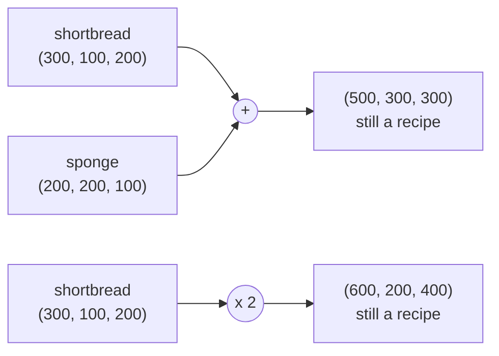
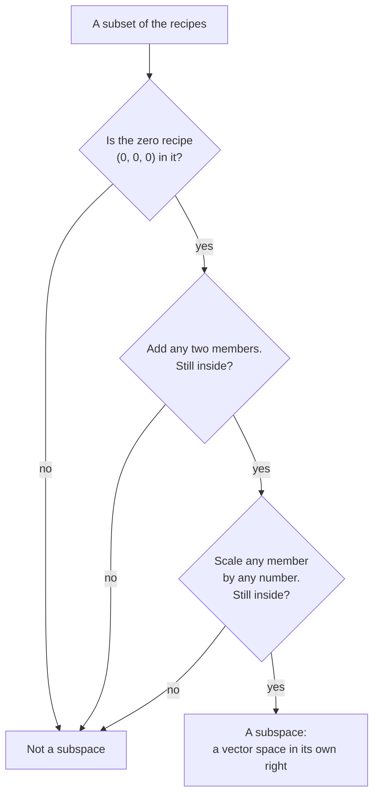

# Vector spaces and subspaces: any collection you can add and scale by the usual rules, and the flat pieces inside it that close up

[Syllabus](../../../SYLLABUS.md) → [Algebra](../../../SYLLABUS.md#w03) → [Vectors](../../../SYLLABUS.md#w03-s03) → Vector spaces and subspaces

---

## General Overview

A shortbread recipe is three numbers: 300 grams of flour, 100 of sugar, 200 of butter. As a list, in that order: (300, 100, 200). A sponge is (200, 200, 100). An oat biscuit is (150, 50, 100).

Two things you can do. Double the shortbread: (600, 200, 400), still a recipe. Bake shortbread and sponge together and the shopping list is the two added slot by slot: (500, 300, 300), also a recipe. Add, scale: you never land outside the recipes.

A collection like that — adding and scaling never take you outside, and the rearranging you already do with numbers still works — is a **vector space**. Recipes are one. Arrows drawn from a corner of a page are another. So are quadratics, the expressions with an x-squared in them. Prove something about a vector space and it holds for all of them.

Some subsets are little vector spaces themselves. The sugar-free recipes are: add two, still sugar-free; scale one, still sugar-free. Those are **subspaces**. The recipes with exactly 200 grams of flour are not: add two of them and you have 400 grams of flour.

**A vector space is a collection with an add and a scale that behave the way adding and scaling numbers behave; a subspace is a subset you cannot get out of by adding or scaling.**

### The picture: both doors lead back inside



---

## The formula

A vector is a list in round brackets, and single letters stand for whole lists: $u$, $v$, $w$ are recipes, $a$ and $b$ are numbers ([Vectors](01-vectors.md)). A number you scale by is a **scalar**, and in this wing scalars are always real numbers.

The two operations:

**$u + v$: add slot by slot. (300, 100, 200) + (200, 200, 100) = (500, 300, 300).**

**$a u$: multiply every slot by $a$. 2 × (300, 100, 200) = (600, 200, 400).**

A collection $V$ carrying those two operations is a **vector space** when every result lands back in $V$ and the rearranging laws you use on numbers still hold: order and grouping do not matter, there is a zero, everything has an opposite, scaling spreads across a sum ([The three rearranging laws](../../01-Foundations/01-Everyday%20Arithmetic/05-arithmetic-laws.md)). Written out, that is a list of eight.

<details>
<summary>The eight rules in full, if you want them</summary>

For all recipes $u$, $v$, $w$ and all numbers $a$, $b$:
1. $u + v = v + u$. Order does not matter.
2. $(u + v) + w = u + (v + w)$. Grouping does not matter.
3. There is a zero $0$ with $u + 0 = u$: the recipe (0, 0, 0).
4. Every $u$ has an opposite $-u$ with $u + (-u) = 0$.
5. $a(u + v) = a u + a v$. Scaling spreads across a sum of recipes.
6. $(a + b) u = a u + b u$. Scaling spreads across a sum of numbers.
7. $a(b u) = (a b) u$. Twice, or once by the product.
8. $1 u = u$.

Rules 1 to 4 are adding, 5 to 8 scaling: the arithmetic laws of wing 01, one slot at a time.

</details>

Now the subset test. A subset $W$ of $V$ is a **subspace** when three things hold:

**$0$ is in $W$; if $u$ and $v$ are in $W$ then $u + v$ is in $W$; and if $u$ is in $W$ then $a u$ is in $W$ for every number $a$.**

**Read it aloud:** a subspace holds the zero, and adding or scaling things inside it lands you back inside it.

| Symbol | Plain meaning | In our recipes | Change it and… |
| --- | --- | --- | --- |
| $u$, $v$, $w$ | whole vectors, as lists | shortbread, sponge, oat biscuit | — |
| $a$, $b$ | scalars: the numbers you scale by | 2 and −3 | negative takes out |
| $0$ | the zero vector, every slot zero | (0, 0, 0) | — |
| $-u$ | the opposite of $u$ | (−300, −100, −200) | without it, rule 4 fails |
| $V$ | the whole vector space | every recipe | — |
| $W$ | the subset under test | the sugar-free recipes | — |
| $u + v$, $a u$ | added slot by slot; every slot scaled | (500, 300, 300); (600, 200, 400) | — |

---

## Why it works

### Step 0: the rules are a contract, not a description

Nobody discovered that recipes obey eight laws. The laws were chosen, because they are what a proof needs. Any collection that signs gets every vector-space theorem for free, whether its members are recipes, arrows or quadratics. That is why the definition is a list of rules, not a picture.

### Step 1: recipes sign it, one slot at a time

Adding recipes is adding numbers in three parallel channels: flour to flour, sugar to sugar, butter to butter. Each rule is a fact about numbers, repeated three times.

Rule 6 is the awkward one, $(a + b) u = a u + b u$. At $a$ = 2 and $b$ = −3 it scales shortbread by −1, and both sides give (−300, −100, −200): 2 × 300 − 3 × 300 = −300 in the flour slot, then twice more.

Fractions and negatives have to be allowed. Half a batch is a recipe. A negative gram means "take that much out", which is what makes rule 4 true. Insist grams are never negative and the collection loses its opposites, and stops being a vector space.

### Step 2: a subset needs three checks, not eight

Here is the saving. If $W$ sits inside a vector space, the eight rules already hold for its members: they held outside, and a subset does not change what adding means. All that can go wrong is leaving, so that is all you check.

The zero check looks free: scale any member by 0 and out comes the zero vector. But an empty set has no member to scale, and the check rejects a candidate fastest.

### Step 3: one subset closes, the other comes apart

Sugar-free means the sugar slot is 0. Add (300, 0, 200) and (100, 0, 50): the sugar slots add to 0, so (400, 0, 250) is sugar-free. Triple (300, 0, 200) and the sugar slot is 3 × 0, still 0. The zero recipe has no sugar. Three passes: a subspace.

Exactly 200 grams of flour fails all three. Add (200, 100, 50) and (200, 50, 150): the flour is 400. Triple the first: 600. The zero recipe has 0 grams of flour, not 200.

One line of arithmetic says why, and it is the second road the code takes. Any one slot of a mix $a u + b v$ is $a$ times that slot of $u$ plus $b$ times that slot of $v$. For sugar-free that is $a$ × 0 + $b$ × 0 = 0, whatever the weights. For the 200-gram set it is $a$ × 200 + $b$ × 200, back to 200 only when the weights add to 1; at $a$ = 2 and $b$ = −3 it is −200. Pinned at zero, a set closes up. Pinned anywhere else, it slides off the zero vector.

Mixes with any weights, which is what a subspace is closed under, are the next card: [Linear combinations and span](03-linear-combinations-and-span.md).

### The picture: the three questions



Three yeses and the subset is a vector space itself. One no and it is just a set of recipes.

---

## Worked numbers, by hand

Grams throughout, on the recipes above:

| Step | Arithmetic | Value |
| --- | --- | --- |
| bake both | (300, 100, 200) + (200, 200, 100) | (500, 300, 300) |
| double the shortbread | 2 × (300, 100, 200) | (600, 200, 400) |
| sugar-free, added | (300, 0, 200) + (100, 0, 50) | (400, 0, 250), sugar 0 |
| sugar-free, tripled | 3 × (300, 0, 200) | (900, 0, 600), sugar 0 |
| 200 g flour, added | (200, 100, 50) + (200, 50, 150) | (400, 150, 200), flour 400 |
| 200 g flour, tripled | 3 × (200, 100, 50) | (600, 300, 150), flour 600 |

Zero in, adding in, scaling in: the sugar-free recipes are **a subspace**. Zero out, adding out, scaling out: the 200-gram-of-flour recipes are **not a subspace**, a shelf you fall off as soon as you combine two.

### What breaks if you drop a piece

| Mistake | Comes out at | What went wrong |
| --- | --- | --- |
| Adding two recipes with exactly 200 g of flour | flour 400 | The flour totals add; the set is pinned to a number, not zero |
| Tripling one of them | flour 600 | The same failure through the other door |
| Skipping the zero check | flour 0, not 200 | The set never held the zero recipe; one glance says so |
| Insisting grams are never negative | the opposite of shortbread is (−300, −100, −200) | No opposites: rule 4 fails, so it is no longer a vector space |

The code prints all four.

---

## Code, from first principles, and it actually runs

Nothing is imported. A recipe is three numbers of grams, kept whole here so the arithmetic is exact; adding and scaling are written by hand. The first road walks the eight rules, then runs the three subspace checks on both candidate subsets. The second road reaches the same verdicts without testing membership: it works out one slot of a mix $a u + b v$ from that slot of $u$ and of $v$.

### Python

```python
# Vector spaces and subspaces -- the check behind the card.  Nothing is imported.
# A recipe is three numbers: grams of flour, grams of sugar, grams of butter.
# Adding two recipes adds slot by slot; scaling multiplies every slot.  Road one
# walks the eight rules and the three subspace tests on named recipes.  Road two
# reaches the same two verdicts another way: one slot of a mix a u + b v is
# a times that slot of u plus b times that slot of v, so a set pinned at
# "this slot equals c" closes up when c is 0 and comes apart when it is not.
def add(u, v):   return tuple(x + y for x, y in zip(u, v))
def scale(a, u): return tuple(a * x for x in u)
def show(u):     return "(" + ", ".join(str(x) for x in u) + ")"
def line(name, text): print(f"{name:<22}{text}")

SHORT, SPONGE, OAT, ZERO = (300, 100, 200), (200, 200, 100), (150, 50, 100), (0, 0, 0)
a, b = 2, -3
F1, F2 = (300, 0, 200), (100, 0, 50)        # sugar-free: the sugar slot is 0
G1, G2 = (200, 100, 50), (200, 50, 150)     # exactly 200 g of flour

print("recipes are (flour, sugar, butter) in grams")
line("shortbread", show(SHORT))
line("sponge", show(SPONGE))
line("oat biscuit", show(OAT))
line("shortbread + sponge", show(add(SHORT, SPONGE)))
line("2 x shortbread", show(scale(2, SHORT)))
line("(2 + -3) x shortbread", show(scale(a + b, SHORT)))

rules = [add(SHORT, SPONGE) == add(SPONGE, SHORT),                                 # order
         add(add(SHORT, SPONGE), OAT) == add(SHORT, add(SPONGE, OAT)),             # grouping
         add(SHORT, ZERO) == SHORT,                                                # a zero
         add(SHORT, scale(-1, SHORT)) == ZERO,                                     # an opposite
         scale(a, add(SHORT, SPONGE)) == add(scale(a, SHORT), scale(a, SPONGE)),   # spread over recipes
         scale(a + b, SHORT) == add(scale(a, SHORT), scale(b, SHORT)),             # spread over numbers
         scale(a, scale(b, SHORT)) == scale(a * b, SHORT),                         # scale twice, or once
         scale(1, SHORT) == SHORT]                                                 # scaling by 1
print(f"all eight rules on these three, a = {a}, b = {b}: {'OK' if all(rules) else 'FAILED'}")

line("sugar-free, added", f"{show(add(F1, F2))}   sugar {add(F1, F2)[1]}")
line("sugar-free, tripled", f"{show(scale(3, F1))}   sugar {scale(3, F1)[1]}")
line("sugar-free, zero", f"{show(ZERO)}   sugar {ZERO[1]}")
line("200 g flour, added", f"{show(add(G1, G2))}   flour {add(G1, G2)[0]}")
line("200 g flour, tripled", f"{show(scale(3, G1))}   flour {scale(3, G1)[0]}")
line("200 g flour, zero", f"{show(ZERO)}   flour {ZERO[0]}")
line("grams kept positive", f"the opposite of shortbread is {show(scale(-1, SHORT))}")

sugar_mix = add(scale(a, F1), scale(b, F2))[1]        # road two: one slot of a mix
flour_mix = add(scale(a, G1), scale(b, G2))[0]
print(f"second road: the slot of the mix {a} u + {b} v, worked from the two slots alone")
line("sugar of the mix", f"{sugar_mix} = {a} x {F1[1]} + {b} x {F2[1]}   still sugar-free")
line("flour of the mix", f"{flour_mix} = {a} x {G1[0]} + {b} x {G2[0]}   not 200")

assert add(SHORT, SPONGE) == (500, 300, 300) and scale(2, SHORT) == (600, 200, 400)
assert all(rules) and scale(a + b, SHORT) == (-300, -100, -200)
assert add(F1, F2)[1] == 0 and scale(3, F1)[1] == 0 and sugar_mix == 0
assert add(G1, G2)[0] == 400 and scale(3, G1)[0] == 600 and flour_mix == -200 and ZERO[0] != 200
print("ALL CHECKS PASS")
```

**Ran 2026-09-07 on macOS, Python 3.14.6, standard library only. All checks passed. Output, pasted from the run:**

```
recipes are (flour, sugar, butter) in grams
shortbread            (300, 100, 200)
sponge                (200, 200, 100)
oat biscuit           (150, 50, 100)
shortbread + sponge   (500, 300, 300)
2 x shortbread        (600, 200, 400)
(2 + -3) x shortbread (-300, -100, -200)
all eight rules on these three, a = 2, b = -3: OK
sugar-free, added     (400, 0, 250)   sugar 0
sugar-free, tripled   (900, 0, 600)   sugar 0
sugar-free, zero      (0, 0, 0)   sugar 0
200 g flour, added    (400, 150, 200)   flour 400
200 g flour, tripled  (600, 300, 150)   flour 600
200 g flour, zero     (0, 0, 0)   flour 0
grams kept positive   the opposite of shortbread is (-300, -100, -200)
second road: the slot of the mix 2 u + -3 v, worked from the two slots alone
sugar of the mix      0 = 2 x 0 + -3 x 0   still sugar-free
flour of the mix      -200 = 2 x 200 + -3 x 200   not 200
ALL CHECKS PASS
```

### Rust

Same numbers, same labels, built with `rustc --edition 2021 -O`.

```rust
// Vector spaces and subspaces -- the same check as vector_spaces_and_subspaces_check.py,
// in Rust.  Standard library only, no crates.  A recipe is three numbers: grams of
// flour, grams of sugar, grams of butter.  Adding two recipes adds slot by slot;
// scaling multiplies every slot.  Road one walks the eight rules and the three
// subspace tests on named recipes.  Road two reaches the same two verdicts another
// way: one slot of a mix a u + b v is a times that slot of u plus b times that slot
// of v, so a set pinned at "this slot equals c" closes up when c is 0 and comes
// apart when it is not.
// Compile: rustc --edition 2021 -O vector_spaces_and_subspaces_check.rs -o vs_check
type R = [i64; 3];

fn add(u: R, v: R) -> R { [u[0] + v[0], u[1] + v[1], u[2] + v[2]] }
fn scale(a: i64, u: R) -> R { [a * u[0], a * u[1], a * u[2]] }
fn show(u: R) -> String { format!("({}, {}, {})", u[0], u[1], u[2]) }
fn line(name: &str, text: String) { println!("{:<22}{}", name, text); }

fn main() {
    let (short, sponge, oat, zero): (R, R, R, R) =
        ([300, 100, 200], [200, 200, 100], [150, 50, 100], [0, 0, 0]);
    let (a, b) = (2i64, -3i64);
    let (f1, f2): (R, R) = ([300, 0, 200], [100, 0, 50]);      // sugar-free: the sugar slot is 0
    let (g1, g2): (R, R) = ([200, 100, 50], [200, 50, 150]);   // exactly 200 g of flour

    println!("recipes are (flour, sugar, butter) in grams");
    line("shortbread", show(short));
    line("sponge", show(sponge));
    line("oat biscuit", show(oat));
    line("shortbread + sponge", show(add(short, sponge)));
    line("2 x shortbread", show(scale(2, short)));
    line("(2 + -3) x shortbread", show(scale(a + b, short)));

    let rules = [
        add(short, sponge) == add(sponge, short),                                // order
        add(add(short, sponge), oat) == add(short, add(sponge, oat)),            // grouping
        add(short, zero) == short,                                               // a zero
        add(short, scale(-1, short)) == zero,                                    // an opposite
        scale(a, add(short, sponge)) == add(scale(a, short), scale(a, sponge)),  // spread over recipes
        scale(a + b, short) == add(scale(a, short), scale(b, short)),            // spread over numbers
        scale(a, scale(b, short)) == scale(a * b, short),                        // scale twice, or once
        scale(1, short) == short,                                                // scaling by 1
    ];
    let all_hold = rules.iter().all(|&r| r);
    println!("all eight rules on these three, a = {}, b = {}: {}", a, b,
             if all_hold { "OK" } else { "FAILED" });

    line("sugar-free, added", format!("{}   sugar {}", show(add(f1, f2)), add(f1, f2)[1]));
    line("sugar-free, tripled", format!("{}   sugar {}", show(scale(3, f1)), scale(3, f1)[1]));
    line("sugar-free, zero", format!("{}   sugar {}", show(zero), zero[1]));
    line("200 g flour, added", format!("{}   flour {}", show(add(g1, g2)), add(g1, g2)[0]));
    line("200 g flour, tripled", format!("{}   flour {}", show(scale(3, g1)), scale(3, g1)[0]));
    line("200 g flour, zero", format!("{}   flour {}", show(zero), zero[0]));
    line("grams kept positive", format!("the opposite of shortbread is {}", show(scale(-1, short))));

    let sugar_mix = add(scale(a, f1), scale(b, f2))[1];        // road two: one slot of a mix
    let flour_mix = add(scale(a, g1), scale(b, g2))[0];
    println!("second road: the slot of the mix {} u + {} v, worked from the two slots alone", a, b);
    line("sugar of the mix", format!("{} = {} x {} + {} x {}   still sugar-free",
                                     sugar_mix, a, f1[1], b, f2[1]));
    line("flour of the mix", format!("{} = {} x {} + {} x {}   not 200",
                                     flour_mix, a, g1[0], b, g2[0]));

    assert!(add(short, sponge) == [500, 300, 300] && scale(2, short) == [600, 200, 400]);
    assert!(all_hold && scale(a + b, short) == [-300, -100, -200]);
    assert!(add(f1, f2)[1] == 0 && scale(3, f1)[1] == 0 && sugar_mix == 0);
    assert!(add(g1, g2)[0] == 400 && scale(3, g1)[0] == 600 && flour_mix == -200 && zero[0] != 200);
    println!("ALL CHECKS PASS");
}
```

**Ran 2026-09-07 on macOS, rustc 1.98.1, no crates. All checks passed. Output, pasted from the run:**

```
recipes are (flour, sugar, butter) in grams
shortbread            (300, 100, 200)
sponge                (200, 200, 100)
oat biscuit           (150, 50, 100)
shortbread + sponge   (500, 300, 300)
2 x shortbread        (600, 200, 400)
(2 + -3) x shortbread (-300, -100, -200)
all eight rules on these three, a = 2, b = -3: OK
sugar-free, added     (400, 0, 250)   sugar 0
sugar-free, tripled   (900, 0, 600)   sugar 0
sugar-free, zero      (0, 0, 0)   sugar 0
200 g flour, added    (400, 150, 200)   flour 400
200 g flour, tripled  (600, 300, 150)   flour 600
200 g flour, zero     (0, 0, 0)   flour 0
grams kept positive   the opposite of shortbread is (-300, -100, -200)
second road: the slot of the mix 2 u + -3 v, worked from the two slots alone
sugar of the mix      0 = 2 x 0 + -3 x 0   still sugar-free
flour of the mix      -200 = 2 x 200 + -3 x 200   not 200
ALL CHECKS PASS
```

The two outputs match line for line.

> [!TIP]
> **Try changing**
> Guess first, then run it. An assert is a line that stops the program if a number comes out wrong.
> - **Put sugar in a sugar-free recipe.** Set `F1` to the sponge, `(200, 200, 100)`. Both sugar-free lines carry sugar now, and the third assert stops it.
> - **Scale by 0 instead of 3.** Both tripled lines land on (0, 0, 0). Sugar-free survives; the 200 g flour line reads flour 0, the missing zero in a second disguise. The fourth assert stops it.
> - **Make the weights add to 1.** Set `a, b = 4, -3`. The flour of the mix comes out at 200, so that mix does stay in the 200 g set: the near-miss the set is made of. The second assert stops it.

---

## The usual mistake

> [!warning]
> **Calling a set a subspace because it looks flat.** The recipes with exactly 200 grams of flour form a flat slab, and it is not a subspace: two of them add to 400 grams of flour. Flat is not the test. Flat *and holding the zero vector* is, which is what a book means by "through the origin".
>
> - **Checking adding and forgetting scaling.** Both are needed: the recipes using a whole number of grams of sugar survive adding and die on scaling by a half.
> - **Skipping the zero check.** It is the cheapest of the three and kills the most candidates. The 200 g flour set dies on it: the zero recipe has 0 grams of flour, not 200.
> - **Mixing up the zero vector and the number zero.** In rule 3 the zero is the list (0, 0, 0). In rule 6, $a$ and $b$ are scalars. Different objects, one name.
> - **Thinking a vector space has to be arrows.** Anything you can add and scale by the eight rules qualifies. Quadratics do: add two, scale one, the degree never climbs past 2.

---

## Where you meet it in real life

- **Blends and mixes.** Fertiliser blends, paint mixes, alloys, portfolio weights: lists you add and scale.
- **Solution sets.** Solutions of a batch of equations that all read "= 0" form a subspace. Put a nonzero number on the right of one and they slide off the zero vector, like the 200-gram flour set.
- **Quadratics.** Polynomials of degree at most 2 are a vector space; those with no constant term are a subspace of it. Nothing there is an arrow.
- **Lines and planes through the origin.** In the arrows picture those are the subspaces, along with the zero on its own and the whole space.

> **Say it back**
> A vector space is any collection where you can add two members, scale a member by a number, never land outside, and rearrange the way you rearrange numbers. Recipes as (flour, sugar, butter) are one: shortbread plus sponge is (500, 300, 300), double shortbread is (600, 200, 400), both still recipes. A subspace is a subset you cannot escape. Three checks: the zero is in, adding keeps you in, scaling keeps you in. The sugar-free recipes pass all three; the exactly-200-grams-of-flour recipes fail all three.

---

## What this builds on

- [Vectors](01-vectors.md): a vector as a list in round brackets, and the two things you do to it.
- [Sets](../../01-Foundations/07-Sets/01-sets-and-membership.md): what it means to be in a set, and how a rule such as "the sugar slot is zero" carves one out.
- [The three rearranging laws](../../01-Foundations/01-Everyday%20Arithmetic/05-arithmetic-laws.md): order, grouping and distributing — the eight rules, one slot at a time.

## Where this goes next

- [Linear combinations and span](03-linear-combinations-and-span.md): what you can reach by mixing a few vectors with any weights. Every such collection is a subspace, and the usual way to build one on purpose.

---

## Sources

Verified 7 Sep 2026: every link below resolves to the publisher's page.

- Axler, Sheldon. *Linear Algebra Done Right*, 4th ed. Springer, 2024. [doi:10.1007/978-3-031-41026-0](https://doi.org/10.1007/978-3-031-41026-0); free at [linear.axler.net](https://linear.axler.net/). Chapter 1: the eight rules and the subspace test.
- Strang, Gilbert. *Introduction to Linear Algebra*, 6th ed. Wellesley-Cambridge Press, 2023. [Author's edition page](https://math.mit.edu/~gs/linearalgebra/ila6/indexila6.html). Subspaces of lists of numbers, and the zero-vector rule.
- *18.06SC Linear Algebra*. MIT OpenCourseWare. [Course page](https://ocw.mit.edu/courses/18-06sc-linear-algebra-fall-2011/). Free lectures on the same material.
- Hefferon, Jim. *Linear Algebra*, 4th ed. [Book page](https://hefferon.net/linearalgebra/). A free textbook that works the subspace test slowly, with plenty of failing examples.
