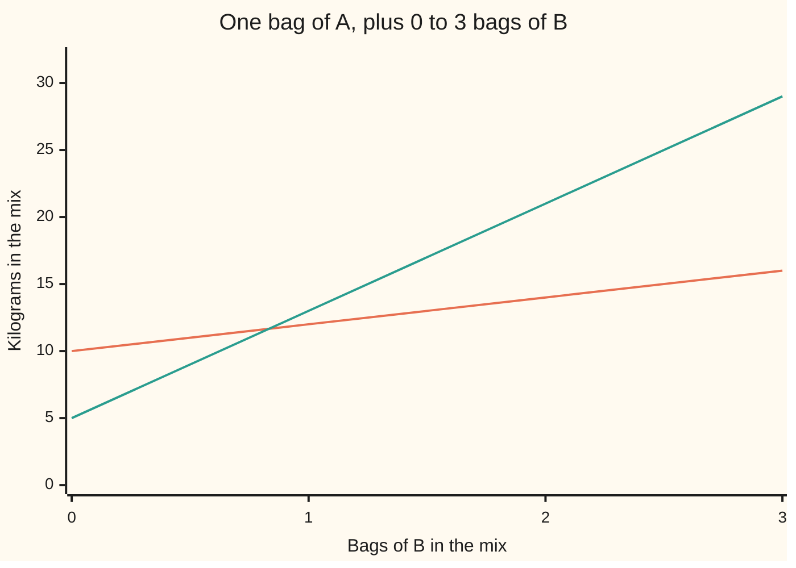

# Linear combinations and span: everything you can reach by mixing a few vectors

Algebra → Vectors → Span and independence → Linear combinations and span

---

## General Overview

A garden centre stocks two fertiliser blends. Bag A holds 10 kg of nitrogen and 5 kg of phosphorus. As a vector — a list of numbers in round brackets ([vectors](01-vectors.md)) — that is A = (10, 5). Bag B holds 2 kg of nitrogen and 8 kg of phosphorus: B = (2, 8).

A lawn needs 14 kg of nitrogen and 21 kg of phosphorus. Can these two bags supply it?

Buy one bag of A and two bags of B. Nitrogen: 10 + 2 × 2 = 14. Phosphorus: 5 + 2 × 8 = 21. Exact, with nothing left over.

That mix — so much of one vector, so much of another, added together — is a **linear combination**. The set of every target such mixes can reach is the **span** of those vectors.

The span here is generous. Ask for (14, 22) instead and you get that too, using 34/35 of a bag of A and 15/7 bags of B. Fractions of a bag are allowed, and so are negative amounts: taking a bag back out. With these two blends nothing in the plane — the flat sheet of every pair of numbers you could name — is out of reach.

**A linear combination is one mix: this vector scaled, plus that vector scaled, added up. The span is the whole set of targets those mixes can reach.**

### The picture: one bag of A, then adding bags of B



The flatter line is nitrogen, the steeper one phosphorus. Each extra bag of B lifts phosphorus by 8 and nitrogen by 2. At two bags of B they read 14 and 21: the target.

---

## The formula

Two names first, in words. The number of bags of the first blend is the unknown x, the number of bags of the second is y. Those two numbers are the **coefficients** of the mix: the amounts each vector is multiplied by.

Call the two bags $a$ and $b$ — lower case, the same two bags — and the target $t$. A linear combination of $a$ and $b$ is:

$$x\,a + y\,b$$

The target sits in the span exactly when some pair of numbers makes that combination land on it:

$$x\,a + y\,b = t$$

**Read it aloud:** some amount of the first bag, plus some amount of the second, added together, has to land exactly on what the lawn needs.

The span is the whole collection of those mixes, written span{$a$, $b$}:

$$\mathrm{span}\{a, b\} = \{\, x\,a + y\,b \ :\ x \text{ and } y \text{ any numbers} \,\}$$

Read the colon as "such that". Three vectors would mean a third amount and a third scaled term; nothing else changes.

| Symbol | Plain meaning | In our example | Push it up and the answer… |
| --- | --- | --- | --- |
| $a$ | the first vector: a list of numbers in round brackets | bag A = (10, 5): 10 kg nitrogen, 5 kg phosphorus | raise a slot and the mix leans that way |
| $b$ | the second vector | bag B = (2, 8) | the mix leans further towards phosphorus |
| $x$ | the coefficient on $a$: how many bags of it the mix uses | 1 bag | every slot of $a$ contributes more |
| $y$ | the coefficient on $b$ | 2 bags | every slot of $b$ contributes more |
| $t$ | the target you are trying to land on | (14, 21) | the amounts needed grow with it |
| span{$a$, $b$} | every target the mixes can reach | the whole flat plane | — |
| the cross-number | one number saying whether the two vectors reach everything | 70 | nothing changes; only zero versus not-zero matters |

The cross-number of two vectors in the plane: the first slot of $a$ times the second slot of $b$, minus the first slot of $b$ times the second slot of $a$. Here, 10 × 8 − 2 × 5 = 70. Not zero, and that is the whole test: $a$ and $b$ span the entire plane. That number's real name is the **determinant**, taken further in [determinants](../05-Solving%20Systems/04-determinants.md).

---

## Why it works

### Step 0: a vector equation is really one equation per slot

Two lists are equal when they agree slot by slot. So $x\,a + y\,b = t$ is not one equation. It is two — one for nitrogen, one for phosphorus — sharing the same two unknowns.

### Step 1: write the two slot equations out

Nitrogen: 10x + 2y = 14. Phosphorus: 5x + 8y = 21.

Two equations, two unknowns: the shape solved on [two-equations-two-unknowns](../01-Letters%20and%20Equations/04-two-equations-two-unknowns.md).

### Step 2: solve, and the solution is the verdict

The answer is x = 1, y = 2. A pair of numbers exists, so (14, 21) is in the span. Had the two equations contradicted each other, the target would sit outside the span.

Membership in a span is a solve, not a squint.

### Step 3: the cross-number decides whether everything is reachable

Multiply the nitrogen equation by 5 and the phosphorus equation by 10, so both start with the same amount of x:

- 50x + 10y = 5 × 14 = 70
- 50x + 80y = 10 × 21 = 210

Subtract the first from the second: 70y = 140, so y = 2.

Look at what sits in front of the y: 80 − 10, which is 10 × 8 − 2 × 5 — the cross-number. No part of the target went into it. It came only from the two bags.

That number is the divisor for every target you will ever try. Divide by it and you have y; back-substitute and you have x. The only way it fails is a cross-number of 0, which happens exactly when one bag is a multiple of the other, adding no new direction. Bag C = (20, 10) is two bags of A: its cross-number with A is 10 × 10 − 20 × 5 = 0. Pair A with C and every mix stays stuck on the single line through (10, 5).

### Step 4: a span always closes up

Add two mixes and the result is a mix: add the amounts. Scale a mix and the result is a mix: scale the amounts. Set both amounts to zero and you get the zero vector, (0, 0), so the span always contains it.

Those three facts are precisely the test for a subspace ([vector-spaces-and-subspaces](02-vector-spaces-and-subspaces.md)). So the span of any list of vectors is a subspace — and the smallest one containing them: any subspace holding $a$ and $b$ must hold every mix of them too.

### The shapes a span takes

Any one vector but the zero one: its span is a line through the origin, every scaling of it. Two vectors pointing different ways: a flat plane. Three vectors in space, none of them a mix of the other two: all of space. A vector already a mix of the others adds nothing — the question [linear-independence](04-linear-independence.md) answers.

Once matrices exist this shortens to one line: stack the bags as the columns of a matrix and ask whether the matrix times some list of amounts hits the target ([matrix-times-vector](../04-Matrices/02-matrix-times-vector.md)).

---

## Worked numbers, by hand

The lawn target, one step at a time.

| Step | Arithmetic | Value |
| --- | --- | --- |
| the nitrogen equation | 10x + 2y | 14 |
| the phosphorus equation | 5x + 8y | 21 |
| halve the nitrogen equation | 5x + 1y | 7 |
| subtract it from the phosphorus one | (8 − 1)y = 21 − 7 | 7y = 14 |
| bags of B | 14 ÷ 7 | **y = 2** |
| bags of A, with y put back in | (14 − 2 × 2) ÷ 10 | **x = 1** |
| rebuild the mix | 1 × (10, 5) + 2 × (2, 8) | **(14, 21)** |

Now ask for (14, 22) — one extra kilogram of phosphorus. The same steps run again: 22 − 7 = 15, so 7y = 15 and y = 15/7, then x = (14 − 2 × 15/7) ÷ 10 = 34/35. Both are fractions of a bag, so (14, 22) is in the span too. The span does not care whether the answer is tidy.

### What breaks if you drop a piece

| Mistake | Comes out at | What went wrong |
| --- | --- | --- |
| Buying bag A alone | (14, 7) | One vector spans a line, not a plane. 1.4 bags fixes the nitrogen and leaves the phosphorus far short. |
| One of each bag | (12, 13) | The amounts are 1 and 2, not 1 and 1. |
| Two of A and one of B | (22, 18) | The right pair of amounts, on the wrong bags. |
| Pairing A with C = (20, 10) | cross-number 0 | C is two bags of A, so the span is one line, and (14, 21) is not on it. |

The code prints the first three, and the cross-number of the fourth.

---

## Code, from first principles, and it actually runs

Nothing is imported. Every amount is reached twice. Road one is elimination in decimals, the same steps as the table above. Road two never leaves whole numbers: each amount is one cross-number divided by another, so no rounding can hide in it. Both targets go down both roads, and the amounts are multiplied back out to confirm they land.

### Python

```python
# Linear combinations and span -- the check behind the card.  Nothing is
# imported.  Fertiliser bag A = (10, 5) and bag B = (2, 8), counted in kg of
# nitrogen and kg of phosphorus.  Which targets can a mix of the two bags hit?
A, B, C = (10, 5), (2, 8), (20, 10)     # C is two bags of A, so no new direction

def mix(x, y):                          # x bags of A plus y bags of B
    return (x * A[0] + y * B[0], x * A[1] + y * B[1])

def cross(u, v):                        # the cross-number of two vectors
    return u[0] * v[1] - v[0] * u[1]

def eliminate(t):                       # road one: elimination, in decimals
    f = A[1] / A[0]                     # scale the nitrogen row by this to kill x
    y = (t[1] - f * t[0]) / (B[1] - f * B[0])
    x = (t[0] - B[0] * y) / A[0]        # back-substitute
    return x, y

def gcd(a, b):
    while b: a, b = b, a % b
    return abs(a)

def frac(n, d):                         # a whole-number fraction, tidied
    g = gcd(n, d)
    n, d = n // g, d // g
    return str(n) if d == 1 else f"{n}/{d}"

def rule(t):                            # road two: the cross-number rule, exact
    return cross(t, B), cross(A, t)     # both divided by cross(A, B)

d = cross(A, B)
print(f"bag A = {A} and bag B = {B}, in kg of nitrogen and kg of phosphorus")
print(f"{'the cross-number of A and B':<52}{d:>10}")
for t in ((14, 21), (14, 22)):
    x, y = eliminate(t)
    nx, ny = rule(t)
    g = mix(x, y)
    print(f"target {t}: elimination gives x = {x:.4f}, y = {y:.4f}")
    print(f"target {t}: the cross-number rule gives x = {frac(nx, d)}, y = {frac(ny, d)}")
    print(f"target {t}: rebuilt, {x:.4f} x A + {y:.4f} x B = ({g[0]:.4f}, {g[1]:.4f}) -> in the span")
grid = [mix(1, b) for b in (0, 1, 2, 3)]
print("one bag of A with 0, 1, 2 and 3 bags of B")
print("  nitrogen, kg    " + ", ".join(str(p[0]) for p in grid))
print("  phosphorus, kg  " + ", ".join(str(p[1]) for p in grid))
print(f"bag C = {C} is two bags of A: the cross-number of A and C is {cross(A, C)}")
m1, m2, m3 = mix(1.4, 0), mix(1, 1), mix(2, 1)
print(f"the three mistakes come out at ({m1[0]:.4f}, {m1[1]:.4f}), {m2} and {m3}")
assert rule((14, 21)) == (70, 140) and d == 70      # 14x8-2x21, 10x21-14x5, 10x8-2x5
assert rule((14, 22)) == (68, 150) and cross(A, C) == 0
assert abs(eliminate((14, 21))[0] - 1) < 1e-12 and abs(eliminate((14, 21))[1] - 2) < 1e-12
assert m2 == (12, 13) and m3 == (22, 18) and abs(m1[0] - 14) < 1e-9 and abs(m1[1] - 7) < 1e-9
print("ALL CHECKS PASS")
```

**Ran 2026-09-07 on macOS, Python 3.14.6, standard library only. All checks passed. Output, pasted from the run:**

```
bag A = (10, 5) and bag B = (2, 8), in kg of nitrogen and kg of phosphorus
the cross-number of A and B                                 70
target (14, 21): elimination gives x = 1.0000, y = 2.0000
target (14, 21): the cross-number rule gives x = 1, y = 2
target (14, 21): rebuilt, 1.0000 x A + 2.0000 x B = (14.0000, 21.0000) -> in the span
target (14, 22): elimination gives x = 0.9714, y = 2.1429
target (14, 22): the cross-number rule gives x = 34/35, y = 15/7
target (14, 22): rebuilt, 0.9714 x A + 2.1429 x B = (14.0000, 22.0000) -> in the span
one bag of A with 0, 1, 2 and 3 bags of B
  nitrogen, kg    10, 12, 14, 16
  phosphorus, kg  5, 13, 21, 29
bag C = (20, 10) is two bags of A: the cross-number of A and C is 0
the three mistakes come out at (14.0000, 7.0000), (12, 13) and (22, 18)
ALL CHECKS PASS
```

### Rust

Same numbers, same labels, built with `rustc --edition 2021 -O`.

```rust
// Linear combinations and span -- the same check as the Python, in Rust.  No
// crates.  Fertiliser bag A = (10, 5) and bag B = (2, 8), counted in kg of
// nitrogen and kg of phosphorus.  Which targets can a mix of the two bags hit?
const A: (i64, i64) = (10, 5);
const B: (i64, i64) = (2, 8);
const C: (i64, i64) = (20, 10);         // C is two bags of A, so no new direction

fn mix_i(x: i64, y: i64) -> (i64, i64) { (x * A.0 + y * B.0, x * A.1 + y * B.1) }

fn mix_f(x: f64, y: f64) -> (f64, f64) {          // x bags of A plus y bags of B
    (x * A.0 as f64 + y * B.0 as f64, x * A.1 as f64 + y * B.1 as f64)
}

fn cross(u: (i64, i64), v: (i64, i64)) -> i64 { u.0 * v.1 - v.0 * u.1 }

fn eliminate(t: (i64, i64)) -> (f64, f64) {       // road one: elimination, in decimals
    let f = A.1 as f64 / A.0 as f64;              // scale the nitrogen row by this to kill x
    let y = (t.1 as f64 - f * t.0 as f64) / (B.1 as f64 - f * B.0 as f64);
    let x = (t.0 as f64 - B.0 as f64 * y) / A.0 as f64;   // back-substitute
    (x, y)
}

fn gcd(mut a: i64, mut b: i64) -> i64 {
    while b != 0 { let t = a % b; a = b; b = t; }
    a.abs()
}

fn frac(n: i64, d: i64) -> String {               // a whole-number fraction, tidied
    let g = gcd(n, d);
    let (n, d) = (n / g, d / g);
    if d == 1 { format!("{}", n) } else { format!("{}/{}", n, d) }
}

fn rule(t: (i64, i64)) -> (i64, i64) { (cross(t, B), cross(A, t)) }   // over cross(A, B)

fn tup(v: (i64, i64)) -> String { format!("({}, {})", v.0, v.1) }

fn main() {
    let d = cross(A, B);
    println!("bag A = {} and bag B = {}, in kg of nitrogen and kg of phosphorus", tup(A), tup(B));
    println!("{:<52}{:>10}", "the cross-number of A and B", d);
    for t in [(14_i64, 21_i64), (14, 22)] {
        let (x, y) = eliminate(t);
        let (nx, ny) = rule(t);
        let g = mix_f(x, y);
        println!("target {}: elimination gives x = {:.4}, y = {:.4}", tup(t), x, y);
        println!("target {}: the cross-number rule gives x = {}, y = {}", tup(t), frac(nx, d), frac(ny, d));
        println!("target {}: rebuilt, {:.4} x A + {:.4} x B = ({:.4}, {:.4}) -> in the span",
                 tup(t), x, y, g.0, g.1);
    }
    let grid: Vec<(i64, i64)> = (0..4).map(|b| mix_i(1, b)).collect();
    println!("one bag of A with 0, 1, 2 and 3 bags of B");
    let n: Vec<String> = grid.iter().map(|p| p.0.to_string()).collect();
    let p: Vec<String> = grid.iter().map(|p| p.1.to_string()).collect();
    println!("  nitrogen, kg    {}", n.join(", "));
    println!("  phosphorus, kg  {}", p.join(", "));
    println!("bag C = {} is two bags of A: the cross-number of A and C is {}", tup(C), cross(A, C));
    let (m1, m2, m3) = (mix_f(1.4, 0.0), mix_i(1, 1), mix_i(2, 1));
    println!("the three mistakes come out at ({:.4}, {:.4}), {} and {}", m1.0, m1.1, tup(m2), tup(m3));
    assert!(rule((14, 21)) == (70, 140) && d == 70);   // 14x8-2x21, 10x21-14x5, 10x8-2x5
    assert!(rule((14, 22)) == (68, 150) && cross(A, C) == 0);
    assert!((eliminate((14, 21)).0 - 1.0).abs() < 1e-12 && (eliminate((14, 21)).1 - 2.0).abs() < 1e-12);
    assert!(m2 == (12, 13) && m3 == (22, 18) && (m1.0 - 14.0).abs() < 1e-9 && (m1.1 - 7.0).abs() < 1e-9);
    println!("ALL CHECKS PASS");
}
```

**Ran 2026-09-07 on macOS, rustc 1.98.1, no crates. All checks passed. Output, pasted from the run:**

```
bag A = (10, 5) and bag B = (2, 8), in kg of nitrogen and kg of phosphorus
the cross-number of A and B                                 70
target (14, 21): elimination gives x = 1.0000, y = 2.0000
target (14, 21): the cross-number rule gives x = 1, y = 2
target (14, 21): rebuilt, 1.0000 x A + 2.0000 x B = (14.0000, 21.0000) -> in the span
target (14, 22): elimination gives x = 0.9714, y = 2.1429
target (14, 22): the cross-number rule gives x = 34/35, y = 15/7
target (14, 22): rebuilt, 0.9714 x A + 2.1429 x B = (14.0000, 22.0000) -> in the span
one bag of A with 0, 1, 2 and 3 bags of B
  nitrogen, kg    10, 12, 14, 16
  phosphorus, kg  5, 13, 21, 29
bag C = (20, 10) is two bags of A: the cross-number of A and C is 0
the three mistakes come out at (14.0000, 7.0000), (12, 13) and (22, 18)
ALL CHECKS PASS
```

The two outputs match line for line.

> [!TIP]
> **Try changing**
> Guess first, then run it. An assert is a line that stops the program when a number comes out wrong; these are pinned to the two bags and the two targets.
> - **Move the target.** In the loop, change the second target from `(14, 22)` to `(14, 20)`. The two printed amounts change but stay ordinary numbers: still in the span. Every assert passes, because each names its own target.
> - **Make the second bag a copy of the first.** Set `B` to `(20, 10)`, two bags of A. The cross-number falls to 0, the elimination divides by zero, and the Python stops before printing an answer. Two bags pointing the same way span a line.
> - **Nudge one number in bag B.** Set `B` to `(2, 9)`. The cross-number is no longer 70, but still not zero, so the plane is still covered. The amounts move, and the first assert stops the run.

---

## The usual mistake

> [!warning]
> **Treating the span as the handful of vectors you were given, or as a short list of mixes.** It is the entire set of mixes, and it is infinite. Two bags pointing different ways reach every point of the plane — (14, 22) included — using fractional and negative amounts.
>
> - Adding the bags instead of scaling them. One of each gives (12, 13), not (14, 21).
> - Getting the amounts the wrong way round. Two of A and one of B gives (22, 18).
> - Assuming a longer list means a bigger span. Bag C = (20, 10) is two bags of A, so adding it changes nothing: cross-number 0, still one line.
> - Matching one slot and stopping. 1.4 bags of A alone hits 14 kg of nitrogen exactly and delivers (14, 7). The other slot decides.

---

## Where you meet it in real life

- **Mixing anything to a specification.** Fertiliser, paint, animal feed, concrete, alloy. Each ingredient is a vector of contents, the recipe is a linear combination, the specification is the target.
- **Portfolios.** Two funds, each with a known split across assets, blended to hit a chosen split. The span says which splits are available at all.
- **Balancing a chemical reaction.** Each compound is a vector of atom counts. Balancing hunts for a combination that lands on the target; it either exists or the equation cannot be balanced.
- **Solving equations.** Asking whether two equations in two unknowns have a solution is the same question as asking whether the target is in the span of the two columns ([two-equations-two-unknowns](../01-Letters%20and%20Equations/04-two-equations-two-unknowns.md)).

> **Say it back**
> A linear combination is a mix: so much of one vector, so much of another, added together. The span is every target those mixes reach. Bag A = (10, 5) and bag B = (2, 8): one A and two B land exactly on (14, 21), so (14, 21) is in the span. To test any target, match slot by slot and solve the two equations you get. The cross-number here is 70, not zero, so these bags reach the whole plane — (14, 22) too, with fractions of a bag. One vector spans a line, two spread-out vectors a plane, three a whole space.

---

## What this builds on

- [vector-spaces-and-subspaces](02-vector-spaces-and-subspaces.md): what it means for a collection to be closed under adding and scaling. A span is always one of those.
- [two-equations-two-unknowns](../01-Letters%20and%20Equations/04-two-equations-two-unknowns.md): the elimination that turns "can these bags reach that target?" into two numbers.

## Where this goes next

- [linear-independence](04-linear-independence.md): whether any vector in the list was redundant — already a mix of the others, adding nothing to the span.
- [matrix-times-vector](../04-Matrices/02-matrix-times-vector.md): the same mix written as a matrix times a list of amounts, which shortens everything here.

---

## Sources

Verified 7 Sep 2026; every link below resolves to the publisher's page.

- Axler, Sheldon. *Linear Algebra Done Right*, 4th ed. Springer, 2024. [Springer](https://link.springer.com/book/10.1007/978-3-031-41026-0); open-access author edition at [linear.axler.net](https://linear.axler.net/). Defines the span of a list and proves it is the smallest subspace containing it.
- Strang, Gilbert. *Introduction to Linear Algebra*, 6th ed. Wellesley-Cambridge Press, 2023. [Author's edition page at MIT](https://math.mit.edu/~gs/linearalgebra/ila6/indexila6.html). Treats a combination of columns as the basic object, and the column span as where a target must live.
- Hefferon, Jim. *Linear Algebra*, 4th ed. Free and openly licensed. [hefferon.net](https://hefferon.net/linearalgebra/). Works membership in a span as an elimination problem, with the same arithmetic used here.
- *18.06SC Linear Algebra*. MIT OpenCourseWare, Fall 2011. [Course page](https://ocw.mit.edu/courses/18-06sc-linear-algebra-fall-2011/). Lectures and notes on the column space and when a target is reachable.
