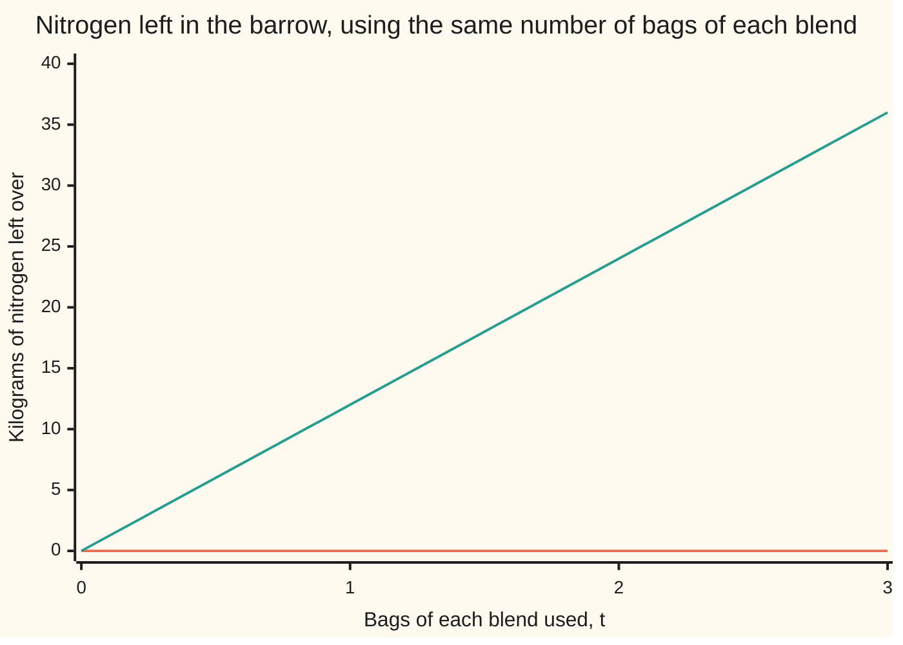
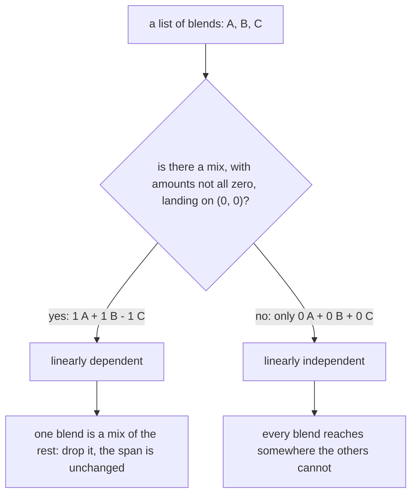

# Linear independence: no vector in the list is a mix of the others, so nothing is redundant

Algebra → Vectors → Span and independence → Linear independence

---

## General Overview

The garden centre stocks two fertiliser blends. Bag A holds 10 kg of nitrogen and 5 kg of phosphorus — as a vector, a list of numbers in round brackets ([vectors](01-vectors.md)), A = (10, 5). Bag B holds 2 kg of nitrogen and 8 kg of phosphorus: B = (2, 8).

A supplier turns up with a third blend, bag C = (12, 13). Worth stocking?

Tip one bag of A and one bag of B into the same barrow. Nitrogen: 10 + 2 = 12. Phosphorus: 5 + 8 = 13. That is bag C, to the kilogram. Anything a customer could hit with C, the shop can already mix from the shelf. C is redundant.

Redundant has a proper name. The list A, B, C is **linearly dependent**: one of them is a mix of the others. Drop C and the two that remain are **linearly independent** — neither is a multiple of the other, so neither can be rebuilt from it.

There is a tidier way to say that, and it is the one everyone uses. One bag of A, plus one bag of B, minus one bag of C leaves nothing at all: (0, 0). Amounts 1, 1 and −1 are not all zero, and they got back to nothing. That is the giveaway.

**A list of vectors is linearly independent when the only mix of them landing on the zero vector is the mix that uses zero of everything. If any other mix lands there, one of the vectors was already reachable from the rest.**

### The picture: mixes that get back to nothing



The flat line is t bags of A, t of B and t of C taken back out: an empty barrow whatever t is. The rising line is the same amounts of A and B with no C: 12 kg of nitrogen at one bag each, then 24, then 36. Only t = 0 empties that barrow, and the cross-number below rules out the uneven mixes too.

---

## The formula

Name the amounts first, in words: the mix uses x bags of A, y bags of B and z bags of C. A negative amount means bags taken back out; fractions are allowed. Set the mix equal to nothing:

$$x\,A + y\,B + z\,C = 0$$

The 0 on the right is the **zero vector**, (0, 0): nothing in either slot. The list A, B, C is **linearly independent** when the only amounts making that true are $x$ = 0, $y$ = 0, $z$ = 0, and **linearly dependent** when some other choice works.

**Read it aloud:** if the only way to mix these bags and end up with an empty barrow is to use none of any of them, then no bag is redundant.

The sentence is a *for every*: for every set of amounts landing on nothing, every amount is zero. One counter-example kills it ([quantifiers](../../01-Foundations/05-Logic/04-quantifiers.md)). Zero of everything always lands on nothing, whatever the list, so that mix proves nothing.

| Symbol | Plain meaning | In our example | Push it up and the answer… |
| --- | --- | --- | --- |
| $A$ | the first blend, in kg of nitrogen and kg of phosphorus | (10, 5) | the relation shifts, the trio stays dependent |
| $B$ | the second blend | (2, 8) | same again |
| $C$ | the blend being offered | (12, 13) | the amounts change; C is still a mix of A and B |
| $x$ | bags of A in the mix; negative means taken back out | 1 | more in the barrow |
| $y$ | bags of B | 1 | same again, in B's proportions |
| $z$ | bags of C | −1 | more taken back out |
| $0$ | the zero vector, (0, 0): nothing in either slot | (0, 0) | — |
| the cross-number | first slot times the other's second slot, minus the other way round | 70, for A and B | only zero against not-zero matters |

A second wording: a list is dependent exactly when one of its vectors sits in the span of the rest ([linear-combinations-and-span](03-linear-combinations-and-span.md)).

$$C = x\,A + y\,B$$

Here x = 1 and y = 1 do it.

Two vectors get a shortcut: they are dependent exactly when one is a multiple of the other, and the cross-number tests that in one line. For A and B it is 10 × 8 − 2 × 5 = 70. Not zero, so A and B are independent.

---

## Why it works

### Step 0: redundant means already reachable

The span of A and B is every target those two bags can be mixed to hit. C = (12, 13) is one of them, so adding C widens the range by nothing: any mix using C can be rewritten with A and B alone.

### Step 1: "already a mix" and "a mix that lands on nothing" are one statement

Start from C = 1A + 1B. Subtract C from both sides:

$$1\,A + 1\,B - 1\,C = 0$$

Amounts 1, 1 and −1: not all zero, and the barrow is empty. Dependence found.

It runs backwards. Take a mix landing on nothing whose amount of C is not zero, divide the relation by that amount and move the rest across: C is a mix of A and B. Same for whichever amount is not zero, so the vector it belongs to is the redundant one.

So the zero test asks one question of the whole list, in any order, with no guessing at which vector is spare.

### Step 2: the test is one solve, slot by slot

Two vectors are equal when they agree slot by slot, so the vector equation is two ordinary equations sharing three unknowns:

- nitrogen: 10x + 2y + 12z = 0
- phosphorus: 5x + 8y + 13z = 0

Independence is the claim that this pair has no solution but all zeros. A solve, not a squint at the numbers.

### Step 3: two vectors, and the cross-number

Drop C and the equations lose their z, leaving the cross-number to decide. It is 70, not zero, so nothing but x = 0 and y = 0 gets back to (0, 0): A and B are independent. Had one bag been a multiple of the other, the cross-number would be 0 and the pair dependent.

### Step 4: three vectors in the plane are always dependent

Two equations cannot pin down three unknowns. Fix two amounts with them and the third is free: choose it to be anything but zero and a relation appears. Any three vectors in the plane are dependent, however carefully picked — here every pair passes the cross-number test, 70, 70 and −70, and the trio fails anyway. The proof of that cap is on [basis-and-dimension](05-basis-and-dimension.md).



---

## Worked numbers, by hand

Every mix landing on nothing satisfies both slot equations at once.

| Step | Arithmetic | Value |
| --- | --- | --- |
| the nitrogen slot | 10x + 2y + 12z | 0 |
| the phosphorus slot | 5x + 8y + 13z | 0 |
| take one bag of C back out, z = −1 | 10x + 2y = 12 and 5x + 8y = 13 | |
| double the phosphorus equation | 10x + 16y = 26 | |
| subtract the nitrogen equation | (16 − 2)y = 26 − 12 | 14y = 14 |
| bags of B | 14 ÷ 14 | **y = 1** |
| bags of A, back-substituted | (12 − 2 × 1) ÷ 10 | **x = 1** |
| the relation, rebuilt | 1 × (10, 5) + 1 × (2, 8) − 1 × (12, 13) | **(0, 0)** |
| the pair A and B on their own | cross-number 10 × 8 − 2 × 5 | **70, so independent** |

One bag of A and one of B, with one bag of C taken back out, leaves an empty barrow. Amounts 1, 1 and −1 are not all zero, so A, B, C is dependent and stocking C widens the range by nothing.

### What breaks if you drop a piece

| Mistake | Comes out at | What went wrong |
| --- | --- | --- |
| Testing the bags two at a time | cross-numbers 70, 70 and −70 | Every pair is independent, the trio dependent anyway |
| Offering the all-zero mix as proof | (0, 0) | Every list does that; only a not-zero amount counts |
| Insisting on positive amounts | (24, 26) | All three added fills the barrow; one bag must come back out |
| Dropping A rather than C | cross-number of B and C is −70 | Either works: B and C still reach everything |

The code prints all of those numbers.

---

## Code, from first principles, and it actually runs

Nothing is imported. Road one is elimination on the two slot equations, in decimals: fix the amount of C at one bag taken back out, solve for the other two. Road two never leaves whole numbers — the three amounts come straight out of the three cross-numbers, tidied by their common factor — so no rounding can hide in it. The amounts are multiplied back out to confirm the barrow is empty; A and B go through the same solver as a second case.

### Python

```python
# Linear independence -- the check behind the card.  Nothing is imported.
# Fertiliser bag A = (10, 5), bag B = (2, 8) and a third blend C = (12, 13),
# counted in kg of nitrogen and kg of phosphorus.  Is any one of the three
# already a mix of the other two?
A, B, C = (10, 5), (2, 8), (12, 13)

def mix(x, y, z):                       # x bags of A, y of B, z of C
    return (x * A[0] + y * B[0] + z * C[0], x * A[1] + y * B[1] + z * C[1])

def cross(u, v):                        # the cross-number of two vectors
    return u[0] * v[1] - v[0] * u[1]

def eliminate(z):                       # road one: fix z, solve the two slots
    f = A[1] / A[0]                     # scale the nitrogen row by this to kill x
    r0, r1 = -z * C[0], -z * C[1]       # what the C bags leave on the right
    y = (r1 - f * r0) / (B[1] - f * B[0])
    x = (r0 - B[0] * y) / A[0]          # back-substitute
    return x, y

def gcd(a, b):
    while b: a, b = b, a % b
    return abs(a)

def term(k, name):                      # "+ 1 x B" or "- 1 x C"
    return f"{'+' if k >= 0 else '-'} {abs(k)} x {name}"

def tup(v): return f"({v[0]}, {v[1]})"

print(f"bag A = {tup(A)}, bag B = {tup(B)}, bag C = {tup(C)}, in kg of nitrogen and kg of phosphorus")
print(f"the cross-numbers: A with B = {cross(A, B)}, A with C = {cross(A, C)}, B with C = {cross(B, C)}")
x1, y1 = eliminate(-1)
print(f"road one, elimination on the two slots: x = {x1:.4f}, y = {y1:.4f}, z = -1.0000")
n, m, p = cross(B, C), cross(C, A), cross(A, B)   # road two: the exact relation
g = gcd(gcd(n, m), p)
n, m, p = n // g, m // g, p // g
if n < 0: n, m, p = -n, -m, -p
print(f"road two, from the cross-numbers:       x = {n}, y = {m}, z = {p}")
r = mix(n, m, p)
print(f"the relation rebuilt: {n} x A {term(m, 'B')} {term(p, 'C')} = {tup(r)} -> A, B, C are dependent")
print(f"C is one bag of A plus one bag of B: 1 x A + 1 x B = {tup(mix(1, 1, 0))}")
x0, y0 = eliminate(0)
print(f"the pair A and B alone: cross-number {cross(A, B)}, and the only mix landing on (0, 0) is x = {x0:.4f}, y = {y0:.4f}")
trio = [mix(t, t, -t) for t in range(4)]
pair = [mix(t, t, 0) for t in range(4)]
print("left over from t bags of A, t of B and t of C taken back out, t = 0, 1, 2, 3")
print("  nitrogen, kg     " + ", ".join(str(v[0]) for v in trio))
print("  phosphorus, kg   " + ", ".join(str(v[1]) for v in trio))
print("left over from t bags of A and t of B, no C, t = 0, 1, 2, 3")
print("  nitrogen, kg     " + ", ".join(str(v[0]) for v in pair))
print("  phosphorus, kg   " + ", ".join(str(v[1]) for v in pair))
print(f"the two mistakes come out at {tup(mix(0, 0, 0))} for the all-zero mix and {tup(mix(1, 1, 1))} for all three added")
print(f"dropping A instead of C: the cross-number of B and C is {cross(B, C)}, still not zero")
assert (n, m, p) == (1, 1, -1) and r == (0, 0) and mix(1, 1, 0) == (12, 13)
assert abs(x1 - 1) < 1e-12 and abs(y1 - 1) < 1e-12 and (x0, y0) == (0.0, 0.0)
assert (cross(A, B), cross(A, C), cross(B, C)) == (70, 70, -70) and mix(1, 1, 1) == (24, 26)
assert [v[0] for v in trio] == [0, 0, 0, 0] and [v[0] for v in pair] == [0, 12, 24, 36]
print("ALL CHECKS PASS")
```

**Ran 2026-09-07 on macOS, Python 3.14.6, standard library only. All checks passed. Output, pasted from the run:**

```
bag A = (10, 5), bag B = (2, 8), bag C = (12, 13), in kg of nitrogen and kg of phosphorus
the cross-numbers: A with B = 70, A with C = 70, B with C = -70
road one, elimination on the two slots: x = 1.0000, y = 1.0000, z = -1.0000
road two, from the cross-numbers:       x = 1, y = 1, z = -1
the relation rebuilt: 1 x A + 1 x B - 1 x C = (0, 0) -> A, B, C are dependent
C is one bag of A plus one bag of B: 1 x A + 1 x B = (12, 13)
the pair A and B alone: cross-number 70, and the only mix landing on (0, 0) is x = 0.0000, y = 0.0000
left over from t bags of A, t of B and t of C taken back out, t = 0, 1, 2, 3
  nitrogen, kg     0, 0, 0, 0
  phosphorus, kg   0, 0, 0, 0
left over from t bags of A and t of B, no C, t = 0, 1, 2, 3
  nitrogen, kg     0, 12, 24, 36
  phosphorus, kg   0, 13, 26, 39
the two mistakes come out at (0, 0) for the all-zero mix and (24, 26) for all three added
dropping A instead of C: the cross-number of B and C is -70, still not zero
ALL CHECKS PASS
```

### Rust

Same numbers, same labels, built with `rustc --edition 2021 -O`.

```rust
// Linear independence -- the same check as the Python, in Rust.  No crates.
// Fertiliser bag A = (10, 5), bag B = (2, 8) and a third blend C = (12, 13),
// counted in kg of nitrogen and kg of phosphorus.  Is any one of the three
// already a mix of the other two?
const A: (i64, i64) = (10, 5);
const B: (i64, i64) = (2, 8);
const C: (i64, i64) = (12, 13);

fn mix(x: i64, y: i64, z: i64) -> (i64, i64) {        // x bags of A, y of B, z of C
    (x * A.0 + y * B.0 + z * C.0, x * A.1 + y * B.1 + z * C.1)
}

fn cross(u: (i64, i64), v: (i64, i64)) -> i64 { u.0 * v.1 - v.0 * u.1 }

fn eliminate(z: i64) -> (f64, f64) {                  // road one: fix z, solve the two slots
    let f = A.1 as f64 / A.0 as f64;                  // scale the nitrogen row by this to kill x
    let (r0, r1) = ((-z * C.0) as f64, (-z * C.1) as f64);   // what the C bags leave on the right
    let y = (r1 - f * r0) / (B.1 as f64 - f * B.0 as f64);
    let x = (r0 - B.0 as f64 * y) / A.0 as f64;       // back-substitute
    (x, y)
}

fn gcd(mut a: i64, mut b: i64) -> i64 {
    while b != 0 { let t = a % b; a = b; b = t; }
    a.abs()
}

fn term(k: i64, name: &str) -> String {               // "+ 1 x B" or "- 1 x C"
    format!("{} {} x {}", if k >= 0 { "+" } else { "-" }, k.abs(), name)
}

fn tup(v: (i64, i64)) -> String { format!("({}, {})", v.0, v.1) }

fn join(vs: &[(i64, i64)], slot: usize) -> String {
    let parts: Vec<String> = vs.iter()
        .map(|v| if slot == 0 { v.0.to_string() } else { v.1.to_string() }).collect();
    parts.join(", ")
}

fn main() {
    println!("bag A = {}, bag B = {}, bag C = {}, in kg of nitrogen and kg of phosphorus",
             tup(A), tup(B), tup(C));
    println!("the cross-numbers: A with B = {}, A with C = {}, B with C = {}",
             cross(A, B), cross(A, C), cross(B, C));
    let (x1, y1) = eliminate(-1);
    println!("road one, elimination on the two slots: x = {:.4}, y = {:.4}, z = -1.0000", x1, y1);
    let (mut n, mut m, mut p) = (cross(B, C), cross(C, A), cross(A, B));  // road two: the exact relation
    let g = gcd(gcd(n, m), p);
    n /= g; m /= g; p /= g;
    if n < 0 { n = -n; m = -m; p = -p; }
    println!("road two, from the cross-numbers:       x = {}, y = {}, z = {}", n, m, p);
    let r = mix(n, m, p);
    println!("the relation rebuilt: {} x A {} {} = {} -> A, B, C are dependent",
             n, term(m, "B"), term(p, "C"), tup(r));
    println!("C is one bag of A plus one bag of B: 1 x A + 1 x B = {}", tup(mix(1, 1, 0)));
    let (x0, y0) = eliminate(0);
    println!("the pair A and B alone: cross-number {}, and the only mix landing on (0, 0) is x = {:.4}, y = {:.4}",
             cross(A, B), x0, y0);
    let trio: Vec<(i64, i64)> = (0..4).map(|t| mix(t, t, -t)).collect();
    let pair: Vec<(i64, i64)> = (0..4).map(|t| mix(t, t, 0)).collect();
    println!("left over from t bags of A, t of B and t of C taken back out, t = 0, 1, 2, 3");
    println!("  nitrogen, kg     {}", join(&trio, 0));
    println!("  phosphorus, kg   {}", join(&trio, 1));
    println!("left over from t bags of A and t of B, no C, t = 0, 1, 2, 3");
    println!("  nitrogen, kg     {}", join(&pair, 0));
    println!("  phosphorus, kg   {}", join(&pair, 1));
    println!("the two mistakes come out at {} for the all-zero mix and {} for all three added",
             tup(mix(0, 0, 0)), tup(mix(1, 1, 1)));
    println!("dropping A instead of C: the cross-number of B and C is {}, still not zero", cross(B, C));
    assert!((n, m, p) == (1, 1, -1) && r == (0, 0) && mix(1, 1, 0) == (12, 13));
    assert!((x1 - 1.0).abs() < 1e-12 && (y1 - 1.0).abs() < 1e-12 && x0 == 0.0 && y0 == 0.0);
    assert!((cross(A, B), cross(A, C), cross(B, C)) == (70, 70, -70) && mix(1, 1, 1) == (24, 26));
    assert!(join(&trio, 0) == "0, 0, 0, 0" && join(&pair, 0) == "0, 12, 24, 36");
    println!("ALL CHECKS PASS");
}
```

**Ran 2026-09-07 on macOS, rustc 1.98.1, no crates. All checks passed. Output, pasted from the run:**

```
bag A = (10, 5), bag B = (2, 8), bag C = (12, 13), in kg of nitrogen and kg of phosphorus
the cross-numbers: A with B = 70, A with C = 70, B with C = -70
road one, elimination on the two slots: x = 1.0000, y = 1.0000, z = -1.0000
road two, from the cross-numbers:       x = 1, y = 1, z = -1
the relation rebuilt: 1 x A + 1 x B - 1 x C = (0, 0) -> A, B, C are dependent
C is one bag of A plus one bag of B: 1 x A + 1 x B = (12, 13)
the pair A and B alone: cross-number 70, and the only mix landing on (0, 0) is x = 0.0000, y = 0.0000
left over from t bags of A, t of B and t of C taken back out, t = 0, 1, 2, 3
  nitrogen, kg     0, 0, 0, 0
  phosphorus, kg   0, 0, 0, 0
left over from t bags of A and t of B, no C, t = 0, 1, 2, 3
  nitrogen, kg     0, 12, 24, 36
  phosphorus, kg   0, 13, 26, 39
the two mistakes come out at (0, 0) for the all-zero mix and (24, 26) for all three added
dropping A instead of C: the cross-number of B and C is -70, still not zero
ALL CHECKS PASS
```

The two outputs match line for line.

> [!TIP]
> **Try changing**
> Guess first, then run it. An assert is a line that stops the program when a number comes out wrong; these are pinned to the three bags.
> - **Move the third blend.** Set `C` to `(12, 14)`. It is no longer one A plus one B. The trio stays dependent — three vectors in the plane always are — but the amounts come out 34, 40 and −35, and the first assert stops it.
> - **Make C two bags of A.** Set `C` to `(20, 10)`. Still dependent, but now A and C are the parallel pair: their cross-number falls to 0 and the relation found is two bags of A against one of C. The first assert stops it.
> - **Aim somewhere other than nothing.** In `eliminate`, change `r0, r1` to `14 - z * C[0], 21 - z * C[1]`. That solves for a mix hitting (14, 21) — a target question, not an independence one ([linear-combinations-and-span](03-linear-combinations-and-span.md)). The amounts stop being 1 and 1, and the second assert stops it.

---

## The usual mistake

> [!warning]
> **Checking the vectors two at a time and calling the list independent.** Every pair here passes: cross-numbers 70 for A and B, 70 for A and C, −70 for B and C, not one pair parallel. The trio is dependent anyway, because C is a mix of *both* the others at once. Independence belongs to the whole list, never to its pairs.
>
> - The all-zero mix always lands on (0, 0) and proves nothing. Dependence needs an amount that is not zero.
> - Positive amounts only. All three bags added give (24, 26). The relation needs a bag taken back out: 1A + 1B − 1C.
> - "C is the redundant one." Any of the three can go: drop A instead, and B with C still reach every target, cross-number −70.
> - "A bag of nothing is harmless." Any list holding (0, 0) is dependent on the spot: one bag of it already lands on nothing, and 1 is not zero.
> - "Different vectors must be independent." C = (12, 13) equals neither bag on the shelf and is still a mix of them. What counts is what is buildable.

---

## Where you meet it in real life

- **Product ranges.** A line that is exactly a blend of two you already carry adds no reach, only shelf space.
- **Survey questions and sensor readings.** A column that is a fixed mix of two others carries no new information, and methods assuming otherwise misbehave.
- **Solving equations.** Stack the vectors as the columns of a matrix: dependence is exactly the statement that the equation has a solution other than all zeros ([matrix-equation-ax-b](../05-Solving%20Systems/01-matrix-equation-ax-b.md)).

> **Say it back**
> A list of vectors is linearly independent when the only mix landing on the zero vector uses zero of every one. Any other mix landing there means some vector was already a mix of the rest, and the list is dependent. Bag A = (10, 5), bag B = (2, 8), bag C = (12, 13): one A plus one B minus one C leaves an empty barrow, so the three are dependent and C is redundant. Take C away and A and B are independent, cross-number 70. Checking pairs is not enough: three vectors in the plane are always dependent.

---

## What this builds on

- [linear-combinations-and-span](03-linear-combinations-and-span.md): what a mix is, what a span reaches, and the cross-number reused here as the two-vector test.
- [quantifiers](../../01-Foundations/05-Logic/04-quantifiers.md): the "for every mix, every amount is zero" shape of the definition, and why one counter-example settles it.

## Where this goes next

- [basis-and-dimension](05-basis-and-dimension.md): an independent list that also spans everything, and the proof that the number of slots caps how many independent vectors fit.
- [matrix-equation-ax-b](../05-Solving%20Systems/01-matrix-equation-ax-b.md): the same test as one matrix equation, where dependence is a solution other than zero.

---

## Sources

Verified 7 Sep 2026; every link below resolves to the publisher's page.

- Axler, Sheldon. *Linear Algebra Done Right*, 4th ed. Springer, 2024. [Springer](https://link.springer.com/book/10.1007/978-3-031-41026-0); open-access author edition at [linear.axler.net](https://linear.axler.net/). Defines independence as the uniqueness of the all-zero relation, and proves a dependent list can lose a vector without losing its span.
- Strang, Gilbert. *Introduction to Linear Algebra*, 6th ed. Wellesley-Cambridge Press, 2023. [Author's edition page at MIT](https://math.mit.edu/~gs/linearalgebra/ila6/indexila6.html). Treats independence as a columns question: which combinations give the zero vector.
- Hefferon, Jim. *Linear Algebra*, 4th ed. Free and openly licensed. [hefferon.net](https://hefferon.net/linearalgebra/). Works independence as elimination on the slot equations, the arithmetic used here.
- Margalit, Dan, and Joseph Rabinoff. *Interactive Linear Algebra*. Georgia Institute of Technology. [Linear independence chapter](https://textbooks.math.gatech.edu/ila/linear-independence.html). Moving pictures of dependent and independent sets.
