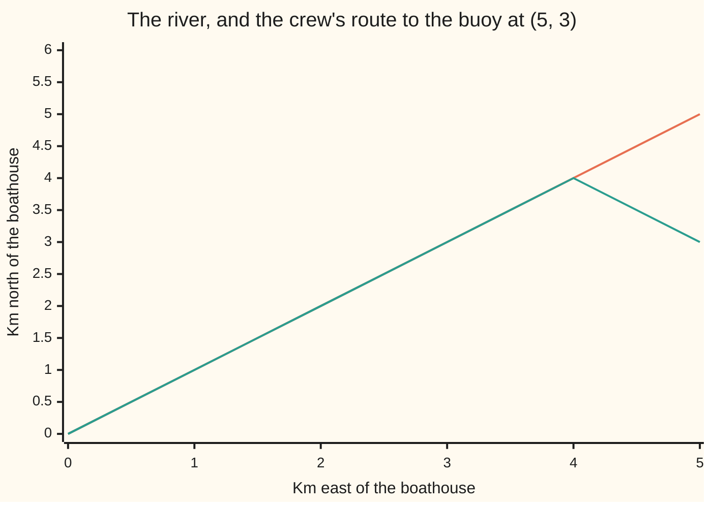
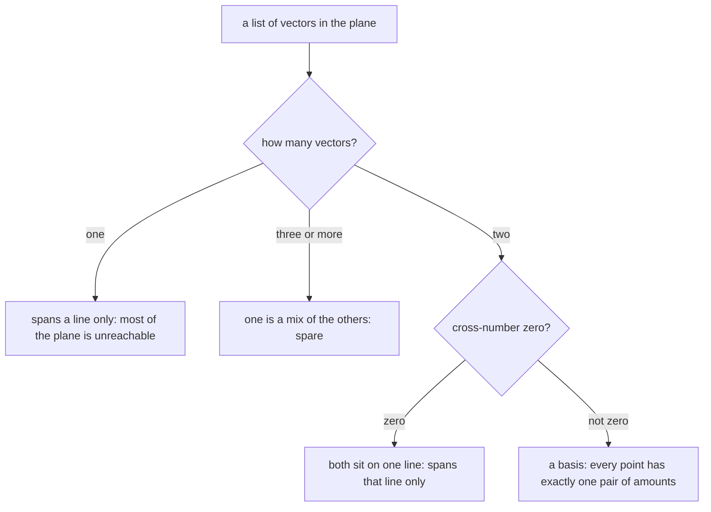

# Basis and dimension: the smallest set that reaches everything, and the count that never changes

Algebra → Vectors → Span and independence → Basis and dimension

---

## General Overview

A rowing crew launches from a boathouse. A buoy sits 5 km east and 3 km north of it. As a vector — a list of numbers in round brackets ([vectors](01-vectors.md)) — the buoy is at (5, 3).

That pair is not the buoy. It is an instruction: go 5 east, then 3 north. Two directions, one amount each.

The crew does not steer in east and north. They steer in the river, which runs northeast. One stroke downstream carries them 1 km east and 1 km north, the vector (1, 1). Straight across it, at right angles, is (-1, 1). In those two directions the buoy is 4 downstream and 1 back across, because 4 × (1, 1) − 1 × (-1, 1) = (5, 3).

Same buoy, two pairs of numbers: (5, 3) one way, (4, -1) the other. Neither is more real. What did not change is the number two. Each way needed two directions. No set of directions that covers this plane ever has one, or three.

**A basis is a list of vectors that reaches every point with nothing spare; each point then has exactly one list of amounts against it, and every basis of the same space is the same length — that length is the dimension.**

### The picture: two ways to the buoy



The straight climbing line is the river: every point reachable going downstream only. The second line rides the river for 4 strokes, to (4, 4), then cuts 1 stroke back across onto the buoy. Neither direction alone gets there. Together they reach anywhere.

---

## The formula

Two names first, in words. The list you steer by is the **basis**; write its members $b_1$ and $b_2$. The amounts used against them are the vector's **coordinates relative to that basis**, written with the vector in square brackets and the basis name attached: $[v]_B$.

A vector $v$ is rebuilt by scaling each basis vector and adding:

$$v = x\,b_1 + y\,b_2$$

The two amounts, in order, are the coordinates:

$$[v]_B = (x, y)$$

**Read it aloud:** so much of the first direction plus so much of the second lands on the point, and those two amounts are its address in that basis.

The list $b_1$, $b_2$ is a basis when both hold: it **spans**, so every point is some mix of the two ([linear-combinations-and-span](03-linear-combinations-and-span.md)), and it is **independent**, so neither is a multiple of the other and neither is spare ([linear-independence](04-linear-independence.md)).

| Symbol | Plain meaning | In our example | Push it up and the answer… |
| --- | --- | --- | --- |
| $v$ | the vector being described | the buoy, (5, 3) | the coordinates move with it |
| $b_1$ | the first basis vector | (1, 1): one stroke downstream | fewer strokes needed: $x$ falls |
| $b_2$ | the second basis vector | (-1, 1): one stroke across | the crossing shrinks: $y$ moves toward 0 |
| $x$ | the amount of $b_1$ in the mix | 4 strokes downstream | the point slides downstream |
| $y$ | the amount of $b_2$ in the mix | -1: one stroke back across | the point slides across |
| $[v]_B$ | the coordinates of $v$ in that basis | (4, -1) | — |
| $e_1$ and $e_2$ | the **standard basis**: (1, 0) and (0, 1), one east and one north | coordinates against these are just the entries, (5, 3) | — |
| the cross-number | whether two vectors reach the whole plane ([linear-combinations-and-span](03-linear-combinations-and-span.md)) | 1 × 1 − (-1) × 1 = 2 | only zero versus not-zero matters |

The number of vectors in a basis is the space's **dimension**: 2 here, under either basis.

### Basis or not



---

## Why it works

### Step 0: two demands pulling against each other

Spanning asks for more vectors: add enough and you reach anything. Independence asks for fewer: drop whatever is already a mix of the others. A basis satisfies both — a spanning list with nothing left to throw away.

### Step 1: spanning gives at least one answer

If the list spans the plane, some mix of it lands on the buoy, so at least one pair of amounts exists. Downstream (1, 1) and across (-1, 1) span the plane, so the buoy has an address.

### Step 2: independence makes it the only answer

Suppose the buoy had two addresses in the river basis:

$$x\,b_1 + y\,b_2 = v \quad\text{and}\quad x'\,b_1 + y'\,b_2 = v$$

for two different pairs. Subtract: the right side is the zero vector, the left is $(x - x')\,b_1 + (y - y')\,b_2$. The pairs differ, so one bracket is not zero — a mix of $b_1$ and $b_2$ with a non-zero amount landing on the zero vector, which independence forbids ([linear-independence](04-linear-independence.md)). The assumption of two addresses collapses ([proof-by-contradiction](../../01-Foundations/06-Proof/03-proof-by-contradiction.md)).

That is the payoff of independence: not a tidier list, a *unique* address.

### Step 3: reading the address is a solve

Two lists are equal when they agree slot by slot, so $x\,b_1 + y\,b_2 = v$ is two equations sharing two unknowns. For the buoy:

- east: $x$ × 1 + $y$ × (-1) = 5, so $x - y = 5$
- north: $x$ × 1 + $y$ × 1 = 3, so $x + y = 3$

Add them and $y$ cancels: 2$x$ = 8, so $x$ = 4. Back into the second: $y$ = 3 − 4 = -1. The address is (4, -1). Coordinates are computed, not eyeballed.

### Step 4: why every basis of this plane has exactly two vectors

Two facts, each ruling out one side.

**One vector is never enough.** Its scalings make a line at best, and the plane is not a line — the buoy at (5, 3) is not on the river — so one vector does not span.

**Three are never independent.** Suppose three vectors in the plane were independent. The first two are then independent (three with nothing spare gives two with nothing spare), so their cross-number is not zero, so they already span the plane. The third lies in the plane, so it is a mix of those two: spare. That contradicts independence.

A basis must be independent, so it cannot be three or longer; it must span, so it cannot be one or shorter. Two is all that is left, and 2 is the plane's dimension.

<details>
<summary>The same argument, in general</summary>

One lemma does it in any space: an independent list can never be longer than a spanning list. Swap the independent vectors into the spanning list one at a time, each throwing out a spanning vector it replaces; the list keeps spanning, so the swaps cannot run out. Two bases are each independent and each spanning, so each is at most as long as the other. Same length. The plane argument above is that lemma with numbers in it.

</details>

### The other route

Stack the vectors as the columns of a matrix and all of this becomes one question: is that matrix invertible? The cross-number is then the determinant — the route taken properly on [linear-maps-as-matrices](../04-Matrices/04-linear-maps-as-matrices.md).

---

## Worked numbers, by hand

The buoy at (5, 3), read against the river basis $b_1$ = (1, 1) and $b_2$ = (-1, 1).

| Step | Arithmetic | Value |
| --- | --- | --- |
| is the river basis independent? | cross-number 1 × 1 − (-1) × 1 | 2, not zero |
| east | $x$ − $y$ | 5 |
| north | $x$ + $y$ | 3 |
| add them | 2$x$ = 5 + 3 | **$x$ = 4** |
| back-substitute | $y$ = 3 − 4 | **$y$ = -1** |
| rebuild the buoy | 4 × (1, 1) − 1 × (-1, 1) = (4 + 1, 4 − 1) | **(5, 3)** |
| the buoy in the standard basis | 5 × (1, 0) + 3 × (0, 1) | **(5, 3)** |
| vectors in each basis | 2 and 2 | **dimension 2** |

The crew rows 4 downstream and 1 back across; a walker goes 5 east and 3 north. Same buoy. The finish marker at (0, 6) works the same way: 3 downstream, 3 across.

### What breaks if you drop a piece

| Mistake | Comes out at | What went wrong |
| --- | --- | --- |
| East-north numbers used as river coordinates | (2, 8) | 5 × (1, 1) + 3 × (-1, 1) is a real point, just not the buoy. Coordinates belong to a basis. |
| The pair read in the other order | (-5, 3) | -1 × (1, 1) + 4 × (-1, 1). A basis is ordered; swapping the amounts moves the point. |
| Steering by (1, 1) and (2, 2) | cross-number 0 | Twice the first: both lie on the river, so nothing off it is reachable. |
| A spare third direction, (1, 0), kept | (4, -1, 0) and (3, 0, 2) | Still spans, but the address is no longer unique, so not a basis. |

The code prints all four.

---

## Code, from first principles, and it actually runs

Nothing is imported. The coordinates are found twice: road one is the elimination from Step 3, road two the cross-number rule from [linear-combinations-and-span](03-linear-combinations-and-span.md), where each amount is one cross-number divided by another. It never touches those equations. Both run on the buoy and on the finish marker at (0, 6), and each answer is multiplied back out to confirm where it lands.

### Python

```python
# Basis and dimension -- the check behind the card.  Nothing is imported.  A
# rowing crew on a river; positions in km east and km north of the boathouse.
# Two bases of the same plane: east-north (1, 0) and (0, 1), and the river
# basis (1, 1) downstream and (-1, 1) across.  The buoy sits at (5, 3).
E1, E2 = (1, 0), (0, 1)                  # the standard basis: one east, one north
B1, B2 = (1, 1), (-1, 1)                 # downstream along the river, and across it
SPARE = (1, 0)                           # a spare third vector: spans, but not a basis

def combo(cs, vs):                       # so much of each vector, added up
    return (sum(c * v[0] for c, v in zip(cs, vs)),
            sum(c * v[1] for c, v in zip(cs, vs)))

def cross(u, v):                         # zero exactly when the two are dependent
    return u[0] * v[1] - v[0] * u[1]

def eliminate(t):                        # road one: x - y = east, x + y = north
    x = (t[0] + t[1]) / 2
    return x, t[1] - x

def rule(t, b1, b2):                     # road two: the cross-number rule
    d = cross(b1, b2)
    return cross(t, b2) / d, cross(b1, t) / d

def tup(v): return f"({v[0]:.0f}, {v[1]:.0f})"
def trip(c): return f"({c[0]:.0f}, {c[1]:.0f}, {c[2]:.0f})"
def show(name, value): print(f"{name:<48}{value:>12}")

show("cross-number, river basis then east-north basis",
     f"{cross(B1, B2)} and {cross(E1, E2)}")
for t in ((5, 3), (0, 6)):
    ex, ey = eliminate(t)
    rx, ry = rule(t, B1, B2)
    show(f"point {tup(t)}: east-north coordinates", tup(combo(t, (E1, E2))))
    show(f"point {tup(t)}: river coordinates, by elimination", tup((ex, ey)))
    show(f"point {tup(t)}: river coordinates, by cross-number", tup((rx, ry)))
    show(f"point {tup(t)}: rebuilt from the river basis", tup(combo((ex, ey), (B1, B2))))
wrong_read = combo((5, 3), (B1, B2))     # east-north numbers used as river ones
wrong_order = combo((-1, 4), (B1, B2))   # the two coordinates the wrong way round
show("wrong: (5, 3) read as river coordinates", tup(wrong_read))
show("wrong: the river coordinates in the other order", tup(wrong_order))
show("wrong: cross-number of (1, 1) and (2, 2)", cross((1, 1), (2, 2)))
first, second = (4, -1, 0), (3, 0, 2)
show("with a spare third vector, one answer", trip(first))
show("with a spare third vector, another answer", trip(second))
show("both of those rebuild the buoy",
     tup(combo(first, (B1, B2, SPARE))) + " " + tup(combo(second, (B1, B2, SPARE))))
river = [combo((s, 0), (B1, B2)) for s in range(6)]
route = [combo((s, 0), (B1, B2)) for s in range(5)] + [combo((4, -1), (B1, B2))]
def row(name, vals): print(f"{name:<48}" + " ".join(f"{v:>2}" for v in vals))
row("chart, km east", [p[0] for p in river])
row("chart, the river, km north", [p[1] for p in river])
row("chart, the crew's route, km north", [p[1] for p in route])
show("vectors in each basis, so the dimension", f"{len((B1, B2))} and {len((E1, E2))}")
assert eliminate((5, 3)) == (4, -1) and rule((5, 3), B1, B2) == (4, -1) and combo((4, -1), (B1, B2)) == (5, 3)
assert eliminate((0, 6)) == (3, 3) and rule((0, 6), B1, B2) == (3, 3) and combo((3, 3), (B1, B2)) == (0, 6)
assert cross(B1, B2) == 2 and cross(E1, E2) == 1 and cross((1, 1), (2, 2)) == 0
assert wrong_read == (2, 8) and wrong_order == (-5, 3) and first != second and \
    combo(first, (B1, B2, SPARE)) == combo(second, (B1, B2, SPARE)) == (5, 3)
print("ALL CHECKS PASS")
```

**Ran 2026-09-07 on macOS, Python 3.14.6, standard library only. All checks passed. Output, pasted from the run:**

```
cross-number, river basis then east-north basis      2 and 1
point (5, 3): east-north coordinates                  (5, 3)
point (5, 3): river coordinates, by elimination      (4, -1)
point (5, 3): river coordinates, by cross-number     (4, -1)
point (5, 3): rebuilt from the river basis            (5, 3)
point (0, 6): east-north coordinates                  (0, 6)
point (0, 6): river coordinates, by elimination       (3, 3)
point (0, 6): river coordinates, by cross-number      (3, 3)
point (0, 6): rebuilt from the river basis            (0, 6)
wrong: (5, 3) read as river coordinates               (2, 8)
wrong: the river coordinates in the other order      (-5, 3)
wrong: cross-number of (1, 1) and (2, 2)                   0
with a spare third vector, one answer             (4, -1, 0)
with a spare third vector, another answer          (3, 0, 2)
both of those rebuild the buoy                  (5, 3) (5, 3)
chart, km east                                   0  1  2  3  4  5
chart, the river, km north                       0  1  2  3  4  5
chart, the crew's route, km north                0  1  2  3  4  3
vectors in each basis, so the dimension              2 and 2
ALL CHECKS PASS
```

### Rust

Same numbers, same labels, built with `rustc --edition 2021 -O`.

```rust
// Basis and dimension -- the same check as the Python, in Rust.  No crates.  A
// rowing crew on a river; positions in km east and km north of the boathouse.
// Two bases of the same plane: east-north (1, 0) and (0, 1), and the river
// basis (1, 1) downstream and (-1, 1) across.  The buoy sits at (5, 3).
const E1: (i64, i64) = (1, 0);           // the standard basis: one east, one north
const E2: (i64, i64) = (0, 1);
const B1: (i64, i64) = (1, 1);           // downstream along the river
const B2: (i64, i64) = (-1, 1);          // across it
const SPARE: (i64, i64) = (1, 0);        // a spare third vector: spans, but not a basis

fn combo(cs: &[f64], vs: &[(i64, i64)]) -> (f64, f64) {   // so much of each, added up
    let (mut e, mut n) = (0.0, 0.0);
    for (c, v) in cs.iter().zip(vs.iter()) { e += c * v.0 as f64; n += c * v.1 as f64; }
    (e, n)
}

fn cross(u: (i64, i64), v: (i64, i64)) -> i64 { u.0 * v.1 - v.0 * u.1 }  // zero when dependent

fn eliminate(t: (i64, i64)) -> (f64, f64) {        // road one: x - y = east, x + y = north
    let x = (t.0 + t.1) as f64 / 2.0;
    (x, t.1 as f64 - x)
}

fn rule(t: (i64, i64), b1: (i64, i64), b2: (i64, i64)) -> (f64, f64) {   // road two: cross-numbers
    let d = cross(b1, b2) as f64;
    (cross(t, b2) as f64 / d, cross(b1, t) as f64 / d)
}

fn tup(v: (f64, f64)) -> String { format!("({:.0}, {:.0})", v.0, v.1) }
fn trip(c: &[f64]) -> String { format!("({:.0}, {:.0}, {:.0})", c[0], c[1], c[2]) }
fn show(name: &str, value: String) { println!("{:<48}{:>12}", name, value); }

fn main() {
    show("cross-number, river basis then east-north basis",
         format!("{} and {}", cross(B1, B2), cross(E1, E2)));
    for t in [(5_i64, 3_i64), (0, 6)] {
        let (ex, ey) = eliminate(t);
        let (rx, ry) = rule(t, B1, B2);
        let tf = (t.0 as f64, t.1 as f64);
        show(&format!("point {}: east-north coordinates", tup(tf)),
             tup(combo(&[tf.0, tf.1], &[E1, E2])));
        show(&format!("point {}: river coordinates, by elimination", tup(tf)), tup((ex, ey)));
        show(&format!("point {}: river coordinates, by cross-number", tup(tf)), tup((rx, ry)));
        show(&format!("point {}: rebuilt from the river basis", tup(tf)),
             tup(combo(&[ex, ey], &[B1, B2])));
    }
    let wrong_read = combo(&[5.0, 3.0], &[B1, B2]);     // east-north numbers used as river ones
    let wrong_order = combo(&[-1.0, 4.0], &[B1, B2]);   // the coordinates the wrong way round
    show("wrong: (5, 3) read as river coordinates", tup(wrong_read));
    show("wrong: the river coordinates in the other order", tup(wrong_order));
    show("wrong: cross-number of (1, 1) and (2, 2)", format!("{}", cross((1, 1), (2, 2))));
    let (first, second) = ([4.0, -1.0, 0.0], [3.0, 0.0, 2.0]);
    show("with a spare third vector, one answer", trip(&first));
    show("with a spare third vector, another answer", trip(&second));
    show("both of those rebuild the buoy",
         format!("{} {}", tup(combo(&first, &[B1, B2, SPARE])),
                 tup(combo(&second, &[B1, B2, SPARE]))));
    let river: Vec<(f64, f64)> = (0..6).map(|s| combo(&[s as f64, 0.0], &[B1, B2])).collect();
    let mut route: Vec<(f64, f64)> = (0..5).map(|s| combo(&[s as f64, 0.0], &[B1, B2])).collect();
    route.push(combo(&[4.0, -1.0], &[B1, B2]));
    let row = |name: &str, vals: Vec<f64>| {
        let cells: Vec<String> = vals.iter().map(|v| format!("{:>2}", *v as i64)).collect();
        println!("{:<48}{}", name, cells.join(" "));
    };
    row("chart, km east", river.iter().map(|p| p.0).collect());
    row("chart, the river, km north", river.iter().map(|p| p.1).collect());
    row("chart, the crew's route, km north", route.iter().map(|p| p.1).collect());
    show("vectors in each basis, so the dimension",
         format!("{} and {}", [B1, B2].len(), [E1, E2].len()));
    assert!(eliminate((5, 3)) == (4.0, -1.0) && rule((5, 3), B1, B2) == (4.0, -1.0)
            && combo(&[4.0, -1.0], &[B1, B2]) == (5.0, 3.0));
    assert!(eliminate((0, 6)) == (3.0, 3.0) && rule((0, 6), B1, B2) == (3.0, 3.0)
            && combo(&[3.0, 3.0], &[B1, B2]) == (0.0, 6.0));
    assert!(cross(B1, B2) == 2 && cross(E1, E2) == 1 && cross((1, 1), (2, 2)) == 0);
    assert!(wrong_read == (2.0, 8.0) && wrong_order == (-5.0, 3.0) && first != second
            && combo(&first, &[B1, B2, SPARE]) == (5.0, 3.0)
            && combo(&second, &[B1, B2, SPARE]) == (5.0, 3.0));
    println!("ALL CHECKS PASS");
}
```

**Ran 2026-09-07 on macOS, rustc 1.98.1, no crates. All checks passed. Output, pasted from the run:**

```
cross-number, river basis then east-north basis      2 and 1
point (5, 3): east-north coordinates                  (5, 3)
point (5, 3): river coordinates, by elimination      (4, -1)
point (5, 3): river coordinates, by cross-number     (4, -1)
point (5, 3): rebuilt from the river basis            (5, 3)
point (0, 6): east-north coordinates                  (0, 6)
point (0, 6): river coordinates, by elimination       (3, 3)
point (0, 6): river coordinates, by cross-number      (3, 3)
point (0, 6): rebuilt from the river basis            (0, 6)
wrong: (5, 3) read as river coordinates               (2, 8)
wrong: the river coordinates in the other order      (-5, 3)
wrong: cross-number of (1, 1) and (2, 2)                   0
with a spare third vector, one answer             (4, -1, 0)
with a spare third vector, another answer          (3, 0, 2)
both of those rebuild the buoy                  (5, 3) (5, 3)
chart, km east                                   0  1  2  3  4  5
chart, the river, km north                       0  1  2  3  4  5
chart, the crew's route, km north                0  1  2  3  4  3
vectors in each basis, so the dimension              2 and 2
ALL CHECKS PASS
```

The two outputs match line for line.

> [!TIP]
> **Try changing**
> Guess first, then run it. An assert is a line that stops the program when a number comes out wrong; these are pinned to the two bases and the two points.
> - **Tilt the across vector.** Set `B2` to `(1, -1)`. Still a basis: cross-number -2, buoy's address (4, 1). The elimination is written for the old basis, so the first assert stops the run.
> - **Make the river vectors parallel.** Set `B2` to `(2, 2)`, twice `B1`. The cross-number falls to 0, the rule divides by zero, and the script stops before printing an address.
> - **Move the second point.** Change `(0, 6)` to `(7, 1)`. Both roads print (4, -3) and the rebuild lands on (7, 1), but the second assert is pinned to (0, 6) and stops it.

---

## The usual mistake

> [!warning]
> **Believing a vector's coordinates are the vector.** (5, 3) is the buoy's name in the east-north basis; in the river basis the same buoy is (4, -1). A name means nothing until the basis is on the table. Feed (5, 3) to the river basis and you land on (2, 8).
>
> - Spanning alone is not a basis. Add (1, 0) to the river pair and the plane is still covered, but the buoy has two addresses: (4, -1, 0) and (3, 0, 2).
> - Independence alone is not a basis either. The single vector (1, 1) is independent and spans only the river.
> - Order matters: the same amounts backwards, -1 and 4, put you at (-5, 3).
> - Dimension is not how many numbers a vector holds. The river is a line inside the plane, written as pairs: dimension 1.
> - A basis is never unique. Only the count, 2, is fixed.

---

## Where you meet it in real life

- **Choosing better axes.** Measuring along a natural grain — downstream and across, or with the wind and across it — is a change of basis, and the numbers get easier ([change-of-basis](../07-Eigenvalues%20and%20Symmetric%20Matrices/01-change-of-basis.md)).
- **File and audio compression.** A sound clip is a vector with thousands of entries. Rewriting it in a basis where most coordinates land near zero, then discarding those, is most of a codec.
- **Data with too many columns.** A spreadsheet of 200 measurements often holds a handful of independent directions. The dimension of the span says how many quantities it really records.
- **Engineering.** The independent forces on a truss are a basis for every other force in it. Count them and you know how many to measure.

> **Say it back**
> A basis spans the space and has nothing spare in it. Spanning gives every point at least one address; independence stops any point having two. Together: one address per point, found by solving one equation per slot. The buoy at (5, 3) is 5 east and 3 north in the standard basis, 4 downstream and 1 back across in the river basis — same point, two names. Every basis of this plane holds two vectors, because one never spans it and three are never independent. That count is the dimension, and it belongs to the space, not to the basis you picked.

---

## What this builds on

- [linear-combinations-and-span](03-linear-combinations-and-span.md): span, and the cross-number that tests it.
- [linear-independence](04-linear-independence.md): the nothing-is-spare half of the definition, and the reason an address cannot be written two ways.
- [proof-by-contradiction](../../01-Foundations/06-Proof/03-proof-by-contradiction.md): the shape of Steps 2 and 4 — assume the opposite, watch it break.

## Where this goes next

- [linear-maps-as-matrices](../04-Matrices/04-linear-maps-as-matrices.md): with a basis fixed, a linear map is just the matrix of what it does to the basis vectors.
- [rank-nullity](../05-Solving%20Systems/05-rank-nullity.md): what a map does to dimension — how many directions survive, how many are flattened.
- [gram-schmidt-and-orthonormal-bases](../06-Dot%20Products%20and%20Best%20Fits/03-gram-schmidt-and-orthonormal-bases.md): straightening any basis into one whose vectors are at right angles and one unit long.
- [change-of-basis](../07-Eigenvalues%20and%20Symmetric%20Matrices/01-change-of-basis.md): translating an address from one basis to another, both ways.

---

## Sources

Verified 7 Sep 2026; every link below resolves to the publisher's page.

- Axler, Sheldon. *Linear Algebra Done Right*, 4th ed. Springer, 2024. [Springer](https://link.springer.com/book/10.1007/978-3-031-41026-0); open-access author edition at [linear.axler.net](https://linear.axler.net/). Defines a basis as an independent spanning list; proves unique coordinates and equal length.
- Strang, Gilbert. *Introduction to Linear Algebra*, 6th ed. Wellesley-Cambridge Press, 2023. [Author's edition page at MIT](https://math.mit.edu/~gs/linearalgebra/ila6/indexila6.html). Builds dimension out of independent columns.
- Hefferon, Jim. *Linear Algebra*, 4th ed. Free and openly licensed. [hefferon.net](https://hefferon.net/linearalgebra/). Works coordinates as a solve, with the exchange argument behind equal length in full.
- *18.06SC Linear Algebra*. MIT OpenCourseWare, Fall 2011. [Course page](https://ocw.mit.edu/courses/18-06sc-linear-algebra-fall-2011/). Lectures on independence, basis and dimension.
