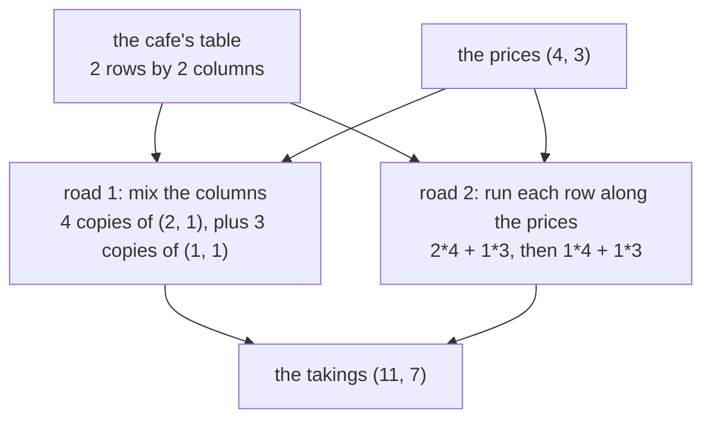

# Matrix times vector: mix the columns, or run each row along the list, and get the same answer

Algebra → Matrices → Matrices as tables → Matrix times vector

---

## General Overview

A cafe keeps one table of what it sold. Monday: 2 coffees and 1 pastry. Tuesday: 1 coffee and 1 pastry. Written row by row in square brackets, that table is the matrix `[[2, 1], [1, 1]]`: two rows, one per day, two columns, one per product ([matrices-and-the-matrix-zoo](01-matrices-and-the-matrix-zoo.md)).

A coffee costs $4, a pastry $3. That is a list of two numbers, a vector, written in round brackets: (4, 3).

Hold the table against the prices and out come the takings: $11 Monday, $7 Tuesday. Written down, matrix and vector sit side by side: A x, "run the table over the list". That is the new notation on this card; the rest is two ways of seeing one piece of arithmetic.

The first way looks down the columns. The coffee column is (2, 1): two coffees Monday, one Tuesday. Each coffee brings in $4, so four copies of it make (8, 4). Three copies of the pastry column (1, 1) make (3, 3). Added: (11, 7).

The second way looks across the rows: 2*4 + 1*3 = 11 for Monday, 1*4 + 1*3 = 7 for Tuesday. The same two numbers.

**A x is the columns of the matrix mixed together, with the entries of the vector as the weights — and that same mix can be read off one row at a time.**

**What kind of fact this is:** a definition — the product *is* that mix of the columns; that the row reading gives the same answer is a theorem, proved on this card in Why it works.



Two roads, one answer: the column road says what a matrix *is*, the row road is what gets computed.

---

## The formula

Write a 2 by 2 matrix row by row as `[[a, b], [c, d]]`, and the vector it eats as (x, y). Then:

$$A\,(x,\,y) \;=\; x\,(a,\,c) \;+\; y\,(b,\,d) \;=\; (a x + b y,\; c x + d y)$$

**Read it aloud:** weigh each column by its own number in the list, then add the weighed columns. The bracket on the right is that answer read across the rows.

The first column is (a, c), not (a, b): a column is read *down* the table. That habit is most of what goes wrong.

| Symbol | Plain meaning | In our cafe | Push it up and the answer… |
| --- | --- | --- | --- |
| $A$ | a table of numbers, row by row in square brackets, sized rows × columns | `[[2, 1], [1, 1]]` — days down, products across | more rows means more numbers come out |
| $a$, $b$, $c$, $d$ | the four entries, read across row 1 then row 2 | 2, 1, 1, 1 | each entry counts one product on one day |
| $x$, $y$ | the two numbers in the vector: here, the two prices | 4, 3 | raise $x$ and the first column pushes harder |
| $m$ | how many rows, so how many numbers come out | 2 | one more day, one more taking |
| $n$ | how many columns, so how many numbers go in | 2 | one more product, one more price |

So an $m$ by $n$ matrix eats a vector of length $n$ and hands back one of length $m$: columns in, rows out.

### When it holds

- **The lengths must match.** Hand the 2 by 2 table three prices and there is no answer at all, not a wrong one.
- **One weight per column, in order.** Prices (3, 4) instead of (4, 3) still give an answer, (10, 7), with nothing marking it wrong.
- **The table is fixed while the list varies.** If Tuesday's prices differ from Monday's, that is two products, not one.
- **Nothing is added on.** All-zero weights give an all-zero answer, so a fixed daily fee needs its own term ([linear-maps-as-matrices](04-linear-maps-as-matrices.md)).

---

## Why it works

### Step 0: a column is one object, not a stack of loose numbers

The column (2, 1) is not a 2 and a 1. It is one object: the coffee, Monday then Tuesday. Scaling it by the $4 price scales both entries at once, to (8, 4). That is the whole mechanism: the matrix supplies a fixed set of columns, and the vector says how much of each to take.

### Step 1: the mix, and where the answer is allowed to land

Some of this column plus some of that one, the weights any numbers at all, is a linear combination ([linear-combinations-and-span](../03-Vectors/03-linear-combinations-and-span.md)). So A x is one of those, the entries of the vector being the weights.

Whatever list goes in, **A x lands in the span of the columns** — everything those columns can build between them. Nothing outside is reachable. That sentence later decides which systems of equations have answers.

### Step 2: the same mix, read across

Add the two weighed columns entry by entry and read the first entry: 4*2 + 3*1, the numbers in Monday's row, each meeting its own price. The second entry is 4*1 + 3*1, Tuesday's row against the prices.

So the row road is not a second rule, only the same additions in a different order: finish each column and add, or finish each output number in turn. Pairing two lists, multiplying the pairs and adding, has its own card: the dot product ([dot-product](../06-Dot%20Products%20and%20Best%20Fits/01-dot-product.md)).

### Step 3: why the two roads must agree

Both roads multiply the same numbers: every entry against the weight of its own column. The column road totals them product by product, the row road day by day. Addition does not care how a sum is grouped ([arithmetic-laws](../../01-Foundations/01-Everyday%20Arithmetic/05-arithmetic-laws.md)), so the totals match, for any table.

<details>
<summary>Detailed proof: the two roads agree at every size</summary>

Take a table of $m$ rows and $n$ columns and a list of $n$ weights, one per column. Road 1 scales each column by its weight and adds the scaled columns entry by entry. In any row, row i, column 1 leaves (weight 1) × (its entry in row i), column 2 leaves (weight 2) × (its entry in row i), and so on, so row i of the answer holds

(weight 1) × (row i, column 1) + … + (weight $n$) × (row i, column $n$),

which runs along row i pairing each entry with the weight of its own column: road 2's answer for row i. Row i was any row. Two facts did it — scaling a column scales each entry, a sum may be regrouped — and neither mentions the numbers, so this holds at every size.

</details>

### Step 4: a pile of equations becomes one line

Turn the cafe around: the till totals are known, $11 and $7, the prices are not. Call the coffee price x and the pastry price y. The two days say:

$$2x + y \;=\; 11, \qquad x + y \;=\; 7$$

Those are linear equations: each unknown only multiplied by a number and added. The numbers multiplying them are exactly the cafe's table, so the pair is one statement:

$$[[2,\,1],\,[1,\,1]]\,(x,\,y) \;=\; (11,\,7)$$

Collect the unknowns into one list, x, and the totals into another, b. Any system of linear equations is then one line:

$$A\,x \;=\; b$$

One row of the table is one equation, one entry of b one till total, one entry of x one unknown. Both letters do double duty: x is one unknown inside the brackets and the whole list outside, b the list of totals and not the matrix entry b. By Step 1, A x is a mix of the columns, so "has this system an answer?" becomes "can b be built from the columns?" — the question [matrix-equation-ax-b](../05-Solving%20Systems/01-matrix-equation-ax-b.md) answers. Here it is (4, 3), where the card started.

---

## Worked numbers, by hand

The cafe's table `[[2, 1], [1, 1]]` against the prices (4, 3), both roads.

| Step | Arithmetic | Value |
| --- | --- | --- |
| the coffee column, weighed by $4 | 4 × (2, 1) | (8, 4) |
| the pastry column, weighed by $3 | 3 × (1, 1) | (3, 3) |
| add the two weighed columns | (8 + 3, 4 + 3) | **(11, 7)** |
| Monday's row against the prices | 2*4 + 1*3 | **11** |
| Tuesday's row against the prices | 1*4 + 1*3 | **7** |
| add Wednesday, 3 coffees + 2 pastries | 3*4 + 2*3 | **18** |

Monday's till should read $11, Tuesday's $7. Add Wednesday and the table is 3 by 2: two prices in, three takings out, (11, 7, 18).

### What breaks if you drop a piece

| Mistake | Comes out at | What went wrong |
| --- | --- | --- |
| Adding the columns and forgetting the prices | (3, 2) | That is the table against (1, 1): things sold, not money |
| Swapping the prices to (3, 4) | (10, 7) | Weights go on the columns in order, first with first |
| Handing the 2 by 2 table three prices | nothing; it is refused | Two columns can only take two weights |

The code prints all three.

---

## Code, from first principles, and it actually runs

Nothing is imported. The cafe's table meets the prices twice, by two routines that share no code: one scales each column and adds, the other runs each row along the prices. A third routine tests the sizes, so the two roads assume the lengths match. Wednesday is then added, making a 3 by 2 table. Four asserts pin the output to the numbers worked by hand.

### Python

```python
# Matrix times vector -- the check behind the card.  Nothing is imported.
# The cafe's table A = [[2, 1], [1, 1]] holds the two days down and the two
# products across: Monday 2 coffees + 1 pastry, Tuesday 1 coffee + 1 pastry.
# The price vector x = (4, 3) is a $4 coffee and a $3 pastry.  The takings are
# reached by two roads that share no code, then again with a third day added.
A = [[2, 1], [1, 1]]
B = [[2, 1], [1, 1], [3, 2]]          # Wednesday as well: 3 coffees + 2 pastries
x = [4, 3]

def columns(M):                       # the table read down instead of across
    return [[row[j] for row in M] for j in range(len(M[0]))]

def by_columns(M, v):                 # road 1: weigh each column, add them up
    out = [0] * len(M)
    for weight, col in zip(v, columns(M)):
        out = [o + weight * c for o, c in zip(out, col)]
    return out

def by_rows(M, v):                    # road 2: each row against v, entry by entry
    return [sum(e * p for e, p in zip(row, v)) for row in M]

def fits(M, v):                       # the size rule: n columns eat n entries
    return all(len(row) == len(v) for row in M)

def show(name, v):
    print(f"{name:<32}{'(' + ', '.join(str(k) for k in v) + ')':>14}")

show("the coffee column, weighed by 4", [4 * c for c in columns(A)[0]])
show("the pastry column, weighed by 3", [3 * c for c in columns(A)[1]])
show("road 1: the columns, mixed", by_columns(A, x))
for i, row in enumerate(A):
    parts = " + ".join(f"{e}*{p}" for e, p in zip(row, x))
    print(f"road 2: row {i + 1} against the prices   {parts} = {by_rows(A, x)[i]}")
show("road 2: row by entry, added", by_rows(A, x))
print(f"sizes: A is {len(A)} by {len(A[0])}, x has {len(x)} entries, "
      f"the answer has {len(by_rows(A, x))}")
show("wrong: columns added, no prices", by_columns(A, [1, 1]))
show("wrong: prices swapped to (3, 4)", by_columns(A, [3, 4]))
print("a 2 by 2 handed three prices: "
      f"{'fits' if fits(A, [4, 3, 5]) else 'refused, the sizes do not fit'}")
show("third day added, road 1", by_columns(B, x))
show("third day added, road 2", by_rows(B, x))
print(f"sizes: B is {len(B)} by {len(B[0])}, x has {len(x)} entries, "
      f"the answer has {len(by_rows(B, x))}")
assert by_columns(A, x) == [11, 7] and by_rows(A, x) == [11, 7]
assert by_columns(B, x) == [11, 7, 18] and by_rows(B, x) == [11, 7, 18]
assert by_columns(A, [1, 1]) == [3, 2] and by_columns(A, [3, 4]) == [10, 7]
assert not fits(A, [4, 3, 5]) and fits(B, x) and len(by_rows(B, x)) == 3
print("ALL CHECKS PASS")
```

**Ran 2026-09-19 on macOS, Python 3.14.6, standard library only. All checks passed. Output, pasted from the run:**

```
the coffee column, weighed by 4         (8, 4)
the pastry column, weighed by 3         (3, 3)
road 1: the columns, mixed             (11, 7)
road 2: row 1 against the prices   2*4 + 1*3 = 11
road 2: row 2 against the prices   1*4 + 1*3 = 7
road 2: row by entry, added            (11, 7)
sizes: A is 2 by 2, x has 2 entries, the answer has 2
wrong: columns added, no prices         (3, 2)
wrong: prices swapped to (3, 4)        (10, 7)
a 2 by 2 handed three prices: refused, the sizes do not fit
third day added, road 1            (11, 7, 18)
third day added, road 2            (11, 7, 18)
sizes: B is 3 by 2, x has 2 entries, the answer has 3
ALL CHECKS PASS
```

### Rust

Same numbers, same labels, built with `rustc --edition 2021 -O`.

```rust
// Matrix times vector -- the same check as the Python, in Rust.  No crates.
// The cafe's table A = [[2, 1], [1, 1]] holds the two days down and the two
// products across: Monday 2 coffees + 1 pastry, Tuesday 1 coffee + 1 pastry.
// The price vector x = (4, 3) is a $4 coffee and a $3 pastry.  The takings are
// reached by two roads that share no code, then again with a third day added.

fn columns(m: &[Vec<i64>]) -> Vec<Vec<i64>> {          // the table read down
    (0..m[0].len()).map(|j| m.iter().map(|row| row[j]).collect()).collect()
}

fn by_columns(m: &[Vec<i64>], v: &[i64]) -> Vec<i64> {  // road 1: weigh the columns
    let mut out = vec![0i64; m.len()];
    for (weight, col) in v.iter().zip(columns(m).iter()) {
        for (o, c) in out.iter_mut().zip(col.iter()) { *o += weight * c; }
    }
    out
}

fn by_rows(m: &[Vec<i64>], v: &[i64]) -> Vec<i64> {     // road 2: row against v
    m.iter()
        .map(|row| row.iter().zip(v.iter()).map(|(e, p)| e * p).sum::<i64>())
        .collect()
}

fn fits(m: &[Vec<i64>], v: &[i64]) -> bool {            // the size rule
    m.iter().all(|row| row.len() == v.len())
}

fn show(name: &str, v: &[i64]) {
    let body: Vec<String> = v.iter().map(|k| k.to_string()).collect();
    println!("{:<32}{:>14}", name, format!("({})", body.join(", ")));
}

fn main() {
    let a: Vec<Vec<i64>> = vec![vec![2, 1], vec![1, 1]];
    let b: Vec<Vec<i64>> = vec![vec![2, 1], vec![1, 1], vec![3, 2]];   // Wednesday
    let x: Vec<i64> = vec![4, 3];
    let ca = columns(&a);
    let coffee: Vec<i64> = ca[0].iter().map(|c| 4 * c).collect();
    let pastry: Vec<i64> = ca[1].iter().map(|c| 3 * c).collect();
    show("the coffee column, weighed by 4", &coffee);
    show("the pastry column, weighed by 3", &pastry);
    show("road 1: the columns, mixed", &by_columns(&a, &x));
    let ra = by_rows(&a, &x);
    for (i, row) in a.iter().enumerate() {
        let parts: Vec<String> =
            row.iter().zip(x.iter()).map(|(e, p)| format!("{}*{}", e, p)).collect();
        println!("road 2: row {} against the prices   {} = {}", i + 1, parts.join(" + "), ra[i]);
    }
    show("road 2: row by entry, added", &ra);
    println!("sizes: A is {} by {}, x has {} entries, the answer has {}",
             a.len(), a[0].len(), x.len(), ra.len());
    show("wrong: columns added, no prices", &by_columns(&a, &[1, 1]));
    show("wrong: prices swapped to (3, 4)", &by_columns(&a, &[3, 4]));
    println!("a 2 by 2 handed three prices: {}",
             if fits(&a, &[4, 3, 5]) { "fits" } else { "refused, the sizes do not fit" });
    show("third day added, road 1", &by_columns(&b, &x));
    let rb = by_rows(&b, &x);
    show("third day added, road 2", &rb);
    println!("sizes: B is {} by {}, x has {} entries, the answer has {}",
             b.len(), b[0].len(), x.len(), rb.len());
    assert!(by_columns(&a, &x) == vec![11, 7] && ra == vec![11, 7]);
    assert!(by_columns(&b, &x) == vec![11, 7, 18] && rb == vec![11, 7, 18]);
    assert!(by_columns(&a, &[1, 1]) == vec![3, 2] && by_columns(&a, &[3, 4]) == vec![10, 7]);
    assert!(!fits(&a, &[4, 3, 5]) && fits(&b, &x) && rb.len() == 3);
    println!("ALL CHECKS PASS");
}
```

**Ran 2026-09-19 on macOS, rustc 1.98.1, no crates. All checks passed. Output, pasted from the run:**

```
the coffee column, weighed by 4         (8, 4)
the pastry column, weighed by 3         (3, 3)
road 1: the columns, mixed             (11, 7)
road 2: row 1 against the prices   2*4 + 1*3 = 11
road 2: row 2 against the prices   1*4 + 1*3 = 7
road 2: row by entry, added            (11, 7)
sizes: A is 2 by 2, x has 2 entries, the answer has 2
wrong: columns added, no prices         (3, 2)
wrong: prices swapped to (3, 4)        (10, 7)
a 2 by 2 handed three prices: refused, the sizes do not fit
third day added, road 1            (11, 7, 18)
third day added, road 2            (11, 7, 18)
sizes: B is 3 by 2, x has 2 entries, the answer has 3
ALL CHECKS PASS
```

The two outputs match line for line.

> [!TIP]
> **Try changing**
> Guess first, then run it. An assert stops the program when a number comes out wrong; these are pinned to the cafe's numbers, so expect one to stop.
> - **Give the pastry away.** Set `x = [4, 0]`: the pastry column drops out, both roads give (8, 4), and the first assert stops the run.
> - **Swap the prices.** Set `x = [3, 4]`: both roads give (10, 7), the wrong-answer row above, and the first assert stops the run.
> - **Add a fourth day.** Append `[5, 0]` to `B`: four rows in, four takings out, (11, 7, 18, 20). The second assert stops the run.

---

## The usual mistake

> [!warning]
> **Reading the table the wrong way round.** Columns are read down, rows across. This cafe's table hides the error: `[[2, 1], [1, 1]]` reads the same both ways, so swapping rows for columns still gives (11, 7). Add Wednesday's 3 coffees and 2 pastries and the table is 3 by 2: three rows against two prices, and weighing the rows is not even possible.
>
> - **Multiplying and never adding.** (2, 1) against (4, 3) is not (8, 3). The products get added, to 11: one row gives one number, not a list.
> - **Dropping the weights.** The columns added bare give (3, 2): things sold, not money.
> - **Expecting the answer to be as long as the list fed in.** It is as long as the matrix has rows: the 3 by 2 table takes two prices, gives three takings.

---

## Where you meet it in real life

- **Any till, payroll or invoice.** One table of quantities, one list of unit prices, one multiplication, every total at once.
- **Screens and games.** Turning or stretching a point about the origin is a small matrix times its coordinates, the columns saying where the axes end up. Sliding every point a fixed distance needs an added list too ([linear-maps-as-matrices](04-linear-maps-as-matrices.md)).
- **Machine learning.** A network layer multiplies by a matrix, adds a fixed list, then bends each number. The matrices are enormous; this card's rule is the whole multiplication.

> **Say it back**
> A matrix is a table with a size, a vector is a list. Multiplying them mixes the matrix's columns, with the vector's numbers as the weights: the cafe's `[[2, 1], [1, 1]]` against (4, 3) is four copies of the coffee column plus three of the pastry column, the takings (11, 7). Running each row along the list gives the same answer, and that is how it is done on paper. Because the answer is a mix of the columns, it can only land where those columns reach. And once a pile of equations reads A x = b, the subject becomes questions about one table.

---

## What this builds on

- [matrices-and-the-matrix-zoo](01-matrices-and-the-matrix-zoo.md): what a matrix is, how its size is written rows × columns, and how to read a row against a column.
- [linear-combinations-and-span](../03-Vectors/03-linear-combinations-and-span.md): weighing a set of vectors and adding them, and the name for everything they reach between them.

## Where this goes next

- [matrix-multiplication](03-matrix-multiplication.md): a matrix times a *matrix*: this card, once per column of the second.
- [matrix-equation-ax-b](../05-Solving%20Systems/01-matrix-equation-ax-b.md): turning A x = b around to the prices, and when that fails.
- [dot-product](../06-Dot%20Products%20and%20Best%20Fits/01-dot-product.md): the row-against-list step alone, where it starts measuring length and angle.
- [discrete-fourier-transform](../../07-Complex%20analysis/08-Transforms%20in%20Outline/02-discrete-fourier-transform.md): one fixed table, its columns waves, times a list of samples.
- [from-one-equation-to-a-system](../../08-Differential%20equations%20and%20dynamics/04-Systems%20and%20the%20Matrix%20Exponential/01-from-one-equation-to-a-system.md): this product as the rule pushing a state forward in time.
- error-correcting-codes-hamming-and-reed-solomon: a table times a message, the answer betraying which bit flipped.
- perceptron-and-neural-networks: one layer is one such product, with a bend after it.
- integral-operators-and-the-shift: the list becomes a function, the table an integral, the rule unchanged.

This card mixes the columns for one list of weights; many lists at once, each wanting the same table, is [matrix-multiplication](03-matrix-multiplication.md).

---

## Sources

Verified 19 Sep 2026: every link below resolves to the publisher's page.

- Strang, Gilbert. *18.06 Linear Algebra*, lecture 1, "The Geometry of Linear Equations." MIT OpenCourseWare, Spring 2010. [Lecture page](https://ocw.mit.edu/courses/18-06-linear-algebra-spring-2010/resources/lecture-1-the-geometry-of-linear-equations/). Sets the row method, the column method and the matrix form side by side.
- Strang, Gilbert. *Introduction to Linear Algebra*, 6th ed. Wellesley-Cambridge Press, 2023. [Publisher page](https://math.mit.edu/~gs/linearalgebra/ila6/indexila6.html). The textbook behind that lecture; chapter 1 builds the product from column combinations.
- *College Algebra 2e*, section 7.5, "Matrices and Matrix Operations." OpenStax, Rice University. [Textbook page](https://openstax.org/books/college-algebra-2e/pages/7-5-matrices-and-matrix-operations). A free, step-by-step treatment in the standard notation.
