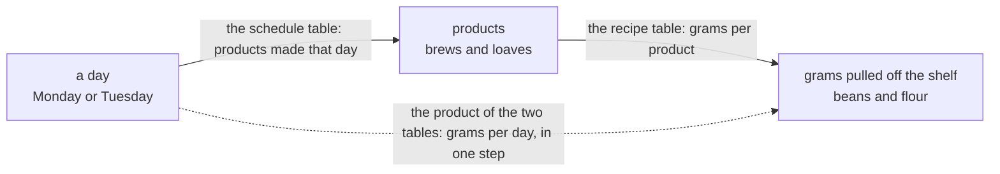
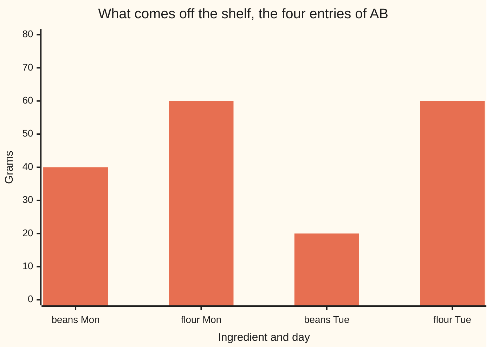

# Matrix multiplication: row by column, because it is 'do this, then that', and why the order matters

[Syllabus](../../../SYLLABUS.md) → [Algebra](../../../SYLLABUS.md#w03) → [Matrices](../../../SYLLABUS.md#w03-s04) → Matrix multiplication

---

## General Overview

A workshop makes cold brew and sourdough. A batch of brew takes 20 g of coffee beans and no flour; a loaf takes 60 g of flour and no beans. Monday they make 2 batches of brew and 1 loaf. Tuesday, 1 of each.

The question: how many grams of beans and of flour come down each day?

Two steps answer it: one turns a day into a count of products, the other turns products into grams. Multiplying those tables builds the single table that does both at once, and its recipe — a row of the first against a column of the second, multiplied in pairs and added — is no convention someone picked. It is what "do this, then that" comes out as when both steps are tables.

**Multiplying matrices is chaining two steps into one, and row-by-column is the arithmetic that chaining forces.**

**What kind of fact this is:** a definition, but a forced one: Why it works derives it from composition and proves the size and grouping rules.



Solid arrows: the two steps. Dotted: the table replacing them.

---

## The formula

Shorthand, in words: the entry in row $i$, column $j$ of $A$ is written $A_{ij}$ — letter, row, column, that order always. The product of $A$ and $B$ is written $AB$, nothing between.

The rule for every entry of the answer:

$$(AB)_{ij} = A_{i1}B_{1j} + A_{i2}B_{2j} + \dots + A_{in}B_{nj}$$

**Read it aloud:** slide a finger across row $i$ of the left matrix and down column $j$ of the right at the same speed, multiply each pair, add the results.

That is the dot product of [Matrix times vector](02-matrix-times-vector.md), once per row-and-column pairing.

| Symbol | Plain meaning | In our example | Change it and… |
| --- | --- | --- | --- |
| $A$ | left matrix: grams per product, rows beans/flour | `[[20, 0], [0, 60]]` | gram totals change |
| $B$ | right matrix: products per day, columns Mon/Tue | `[[2, 1], [1, 1]]` | daily totals change |
| $C$ | a third matrix, right of both, so acting first | `[[4], [4]]`, four of each day | monthly totals change |
| $AB$, $BA$, $BC$ | a product, in that order | $AB$ is `[[40, 20], [60, 60]]`, $BA$ is `[[40, 60], [20, 60]]` | the answer changes |
| $A_{ij}$ | the entry at row $i$, column $j$ | $A$ row 2, column 1 is 0: no flour in a brew | — |
| $i$, $j$, and $m$, $n$, $p$ | row, column; the sizes | $A$ is 2 × 2, $C$ is 2 × 1 | — |

**The size rule.** With $A$ of size $m$ × $n$ ($m$ rows, $n$ columns) and $B$ of size $n$ × $p$, $AB$ exists and is $m$ × $p$. The inner numbers must match, or there is no product.

### When it holds

- **The inner numbers match.** Padding a table to force a product invents numbers.
- **The middle labels agree, in the same order** — here brews and loaves. Sizes can match while labels do not, and then the arithmetic means nothing.
- **The entries are plain numbers**, so sums and products regroup freely: the grouping rule rests on that.
- **One fixed table per step.** A brew takes 20 g whether the workshop makes one or ten.

---

## Why it works

### Step 0: a matrix is a machine, not a spreadsheet

A matrix takes a list of numbers in and hands a list back ([Matrix times vector](02-matrix-times-vector.md)): feed the schedule matrix a day, get products; feed the recipe matrix products, get grams.

Two machines in a row is composition, one function inside another ([Composing functions](../../01-Foundations/08-Relations%20and%20Functions/03-composition.md)), whose order is baked in: the inner one first.

### Step 1: run Monday through both machines

Monday is column 1 of the schedule matrix, (2, 1): 2 brews and 1 loaf. Feed it to the recipe matrix. Beans: 20 g per brew times 2, plus 0 g per loaf times 1, so 40 g. Flour: 0 times 2 plus 60 times 1, so 60 g.

### Step 2: the recipe falls out of that arithmetic

Monday's beans paired the beans row of the recipe matrix with the Monday column of the schedule matrix: multiply, add. Every entry comes out that way, one row of the left against one column of the right — Tuesday's column (1, 1) too, giving 20 g and 60 g. Nothing imposed it: it is what running the second machine on the first one's output does.

Stack the two days side by side: the grams-per-day table `[[40, 20], [60, 60]]`, rows beans and flour, columns Monday and Tuesday.

### Step 3: the size rule is the recipe, not red tape

Pairing a row with a column entry by entry needs equal lengths: a row is as long as the matrix has columns, a column as long as it has rows. So the left's column count must equal the right's row count, and the answer has one entry per row of the left and column of the right: $m$ × $p$.

### Step 4: the order carries the meaning

Recipes times schedule asks: for each ingredient and each day, how many grams? Flipped, the schedule matrix has to eat ingredients and the recipe matrix days. Nothing lines up.

Both matrices here happen to be 2 × 2, so the flipped arithmetic still runs, giving `[[40, 60], [20, 60]]` beside `[[40, 20], [60, 60]]`: same matrices, different answer. Under the same labels the flipped table claims 60 g of beans on Tuesday, against a true 20 g. Some pairs do agree either way — a square matrix and the do-nothing matrix of [Matrices](01-matrices-and-the-matrix-zoo.md) — but nothing makes that the rule, and at other sizes only one order runs.

### Step 5: brackets do not carry meaning

Chain on a third matrix: $C$ counts each weekday in a four-week month, four Mondays and four Tuesdays, the column `[[4], [4]]`. It stands right of the others, so it acts first.

Two routes to the month's list. Grams per day first, then the days: `[[40, 20], [60, 60]]` times `[[4], [4]]` gives `[[240], [480]]`. Or products per month first — `[[2, 1], [1, 1]]` times `[[4], [4]]` gives `[[12], [8]]`, twelve brews and eight loaves — then the recipes: `[[240], [480]]`.

Both give 240 g of beans and 480 g of flour, and must: each is "do $C$, then $B$, then $A$". Order is load-bearing; grouping is not.

<details>
<summary>Detailed proof: why the grouping never matters</summary>

Expand one entry both ways. An entry of $(AB)C$ adds, over the days, a grams-per-day figure times that weekday's count; each such figure is a sum over the products, so multiplying out leaves one term per product-and-day pairing: grams per unit, times units that day, times that day's count.
An entry of $A(BC)$ groups the same multiplication the other way, over the products first, and multiplies out to the same terms for the same pairings.
One identical list either way, and a finite sum totals the same in any order, so $(AB)C = A(BC)$ whenever the sizes fit.

</details>

<details>
<summary>One column times one row, and why it is worth knowing</summary>

Take column 1 of $A$, one brew's ingredients (20, 0) standing up, and row 1 of $B$, brews each day (2, 1) lying down. Multiply tall by wide: out comes a 2 × 2 grid, `[[40, 20], [0, 0]]`, the whole brew business. A column times a row, a grid instead of one number, is an **outer product**.
Column 2 of $A$ against row 2 of $B$ gives the loaves, `[[0, 0], [60, 60]]`; added, the grids give $AB$. So the product reads entry by entry, or slice by slice, and the code does both.

</details>

A second route reaches the recipe from the other end: compose two rules that keep lines straight and read off the table, the job of [Linear maps](04-linear-maps-as-matrices.md).

---

## Worked numbers, by hand

| Step | Arithmetic | Value |
| --- | --- | --- |
| beans on Monday | 20×2 + 0×1 | 40 |
| beans on Tuesday | 20×1 + 0×1 | 20 |
| flour on Monday | 0×2 + 60×1 | 60 |
| flour on Tuesday | 0×1 + 60×1 | 60 |
| the grams-per-day table, $AB$ | rows beans/flour, columns Mon/Tue | **`[[40, 20], [60, 60]]`** |
| four weeks of it, $(AB)C$ | `[[40, 20], [60, 60]]` × `[[4], [4]]` | **`[[240], [480]]`** |

Monday takes 40 g of beans and 60 g of flour, Tuesday 20 g and 60 g; four weeks, 240 g and 480 g.



The flour bars match, one loaf a day; the beans bars do not, since Monday runs two brews.

### What breaks if you drop a piece

| Mistake | Comes out at | What went wrong |
| --- | --- | --- |
| Multiplying entry by entry | `[[40, 0], [0, 60]]` | Tuesday's beans and Monday's flour vanish |
| Flipping the order to $BA$ | `[[40, 60], [20, 60]]` | The arithmetic runs; the labels stop meaning anything |
| Stopping after the first product | `[[40, 20], [0, 0]]` | Only the brew half is counted |
| $C$ on the left of $AB$ | no product at all | 2 × 1 then 2 × 2: inner numbers 1 and 2 |

The code prints all four.

---

## Code, from first principles, and it actually runs

Nothing is imported. One road is the definition itself: three nested loops, across a row and down a column. A second adds up outer products, one grid per product line, in a different order of operations, so a swapped index shows as a mismatch. Both groupings of the chain are compared, and every mistake above is printed.

### Python

```python
# Matrix multiplication -- the check behind the card.  Nothing is imported.
# A: grams per product.  B: products per day.  C: weekdays in four weeks.  Each
# product is reached twice: by the row-by-column definition, and by slices.
A = [[20, 0], [0, 60]]      # rows: beans, flour.     columns: brew, loaf
B = [[2, 1], [1, 1]]        # rows: brew, loaf.       columns: Monday, Tuesday
C = [[4], [4]]              # rows: Monday, Tuesday.  one column: four weeks

def size(M): return len(M), len(M[0])

def times(M, N):                                   # road 1: the definition itself
    (rm, cm), (rn, cn) = size(M), size(N)
    if cm != rn: return None                       # inner sizes disagree: no product
    out = []
    for i in range(rm):
        row = []
        for j in range(cn):
            total = 0
            for k in range(cm):                    # across M's row, down N's column
                total += M[i][k] * N[k][j]
            row.append(total)
        out.append(row)
    return out

def slice_k(M, N, k):                              # road 2: column k of M times row k of N
    return [[M[i][k] * N[k][j] for j in range(size(N)[1])] for i in range(size(M)[0])]

def add(M, N):
    return [[M[i][j] + N[i][j] for j in range(len(M[0]))] for i in range(len(M))]

def show(name, value): print(f"{name:<52}{value}")

AB, BA, BC = times(A, B), times(B, A), times(B, C)
s1, s2, t1, t2 = slice_k(A, B, 0), slice_k(A, B, 1), slice_k(AB, C, 0), slice_k(AB, C, 1)
ABC, A_BC = times(AB, C), times(A, BC)
show("A  grams per product, beans/flour by brew/loaf", A)
show("B  products per day, brew/loaf by Mon/Tue", B)
show("C  count of each day in four weeks", C)
show("AB grams per day, beans/flour by Mon/Tue", AB)
for nm, i, j in (("beans on Monday", 0, 0), ("beans on Tuesday", 0, 1),
                 ("flour on Monday", 1, 0), ("flour on Tuesday", 1, 1)):
    parts = " + ".join(f"{A[i][k]}*{B[k][j]}" for k in range(2))
    print(f"   {nm:<18}{parts} = {AB[i][j]}")
show("BA the swapped order, same numbers, no meaning", BA)
show("BC products in four weeks, brew/loaf", BC)
show("(AB)C grams in four weeks, grams per day first", ABC)
show("A(BC) grams in four weeks, products first", A_BC)
show("slice 1, beans column times the brew row", s1)
show("slice 2, flour column times the loaf row", s2)
show("(AB)C again, as slices of AB against C", f"{t1} + {t2} = {add(t1, t2)}")
show("wrong: entry by entry", [[A[i][j] * B[i][j] for j in range(2)] for i in range(2)])
show("wrong: first product only, rest of the sum dropped", s1)
show("wrong: C on the left of AB", "no product: 2x1 then 2x2, inner sizes 1 and 2")
print(f"sizes: {size(A)[0]}x{size(A)[1]} times {size(B)[0]}x{size(B)[1]} -> {size(AB)[0]}x{size(AB)[1]}"
      f", and {size(AB)[0]}x{size(AB)[1]} times {size(C)[0]}x{size(C)[1]} -> {size(ABC)[0]}x{size(ABC)[1]}")
assert AB == [[40, 20], [60, 60]] and BA == [[40, 60], [20, 60]] and AB != BA
assert add(s1, s2) == AB and s1 == [[40, 20], [0, 0]] and s2 == [[0, 0], [60, 60]]
assert (ABC == [[240], [480]] and A_BC == [[240], [480]] and BC == [[12], [8]]
        and t1 == [[160], [240]] and t2 == [[80], [240]] and add(t1, t2) == ABC)
assert times(C, AB) is None and size(A_BC) == (2, 1)
print("ALL CHECKS PASS")
```

**Ran 2026-09-19 on macOS, Python 3.14.6, standard library only. All checks passed. Output, pasted from the run:**

```
A  grams per product, beans/flour by brew/loaf      [[20, 0], [0, 60]]
B  products per day, brew/loaf by Mon/Tue           [[2, 1], [1, 1]]
C  count of each day in four weeks                  [[4], [4]]
AB grams per day, beans/flour by Mon/Tue            [[40, 20], [60, 60]]
   beans on Monday   20*2 + 0*1 = 40
   beans on Tuesday  20*1 + 0*1 = 20
   flour on Monday   0*2 + 60*1 = 60
   flour on Tuesday  0*1 + 60*1 = 60
BA the swapped order, same numbers, no meaning      [[40, 60], [20, 60]]
BC products in four weeks, brew/loaf                [[12], [8]]
(AB)C grams in four weeks, grams per day first      [[240], [480]]
A(BC) grams in four weeks, products first           [[240], [480]]
slice 1, beans column times the brew row            [[40, 20], [0, 0]]
slice 2, flour column times the loaf row            [[0, 0], [60, 60]]
(AB)C again, as slices of AB against C              [[160], [240]] + [[80], [240]] = [[240], [480]]
wrong: entry by entry                               [[40, 0], [0, 60]]
wrong: first product only, rest of the sum dropped  [[40, 20], [0, 0]]
wrong: C on the left of AB                          no product: 2x1 then 2x2, inner sizes 1 and 2
sizes: 2x2 times 2x2 -> 2x2, and 2x2 times 2x1 -> 2x1
ALL CHECKS PASS
```

### Rust

Same numbers and labels, built with `rustc --edition 2021 -O`.

```rust
// Matrix multiplication -- the same check as the Python, in Rust.  No crates.
// A: grams per product.  B: products per day.  C: weekdays in four weeks.  Each
// product is reached twice: by the row-by-column definition, and by slices.
type Mat = Vec<Vec<i64>>;

fn size(m: &Mat) -> (usize, usize) { (m.len(), m[0].len()) }

fn times(m: &Mat, n: &Mat) -> Option<Mat> {          // road 1: the definition itself
    let ((rm, cm), (rn, cn)) = (size(m), size(n));
    if cm != rn { return None; }                     // inner sizes disagree: no product
    let mut out: Mat = Vec::new();
    for i in 0..rm {
        let mut row: Vec<i64> = Vec::new();
        for j in 0..cn {
            let mut total = 0;
            for k in 0..cm {                         // across m's row, down n's column
                total += m[i][k] * n[k][j];
            }
            row.push(total);
        }
        out.push(row);
    }
    Some(out)
}

fn slice_k(m: &Mat, n: &Mat, k: usize) -> Mat {      // road 2: column k of m times row k of n
    (0..size(m).0).map(|i| (0..size(n).1).map(|j| m[i][k] * n[k][j]).collect()).collect()
}

fn add(m: &Mat, n: &Mat) -> Mat {
    (0..m.len()).map(|i| (0..m[0].len()).map(|j| m[i][j] + n[i][j]).collect()).collect()
}

fn show(name: &str, value: &Mat) { println!("{:<52}{:?}", name, value); }
fn show_s(name: &str, value: &str) { println!("{:<52}{}", name, value); }

fn main() {
    let a: Mat = vec![vec![20, 0], vec![0, 60]];   // rows: beans, flour.     cols: brew, loaf
    let b: Mat = vec![vec![2, 1], vec![1, 1]];     // rows: brew, loaf.       cols: Monday, Tuesday
    let c: Mat = vec![vec![4], vec![4]];           // rows: Monday, Tuesday.  one column
    let (ab, ba, bc) = (times(&a, &b).unwrap(), times(&b, &a).unwrap(), times(&b, &c).unwrap());
    let (s1, s2) = (slice_k(&a, &b, 0), slice_k(&a, &b, 1));
    let (t1, t2) = (slice_k(&ab, &c, 0), slice_k(&ab, &c, 1));
    let (abc, a_bc) = (times(&ab, &c).unwrap(), times(&a, &bc).unwrap());
    show("A  grams per product, beans/flour by brew/loaf", &a);
    show("B  products per day, brew/loaf by Mon/Tue", &b);
    show("C  count of each day in four weeks", &c);
    show("AB grams per day, beans/flour by Mon/Tue", &ab);
    for &(nm, i, j) in [("beans on Monday", 0usize, 0usize), ("beans on Tuesday", 0, 1),
                        ("flour on Monday", 1, 0), ("flour on Tuesday", 1, 1)].iter() {
        let parts: Vec<String> = (0..2).map(|k| format!("{}*{}", a[i][k], b[k][j])).collect();
        println!("   {:<18}{} = {}", nm, parts.join(" + "), ab[i][j]);
    }
    show("BA the swapped order, same numbers, no meaning", &ba);
    show("BC products in four weeks, brew/loaf", &bc);
    show("(AB)C grams in four weeks, grams per day first", &abc);
    show("A(BC) grams in four weeks, products first", &a_bc);
    show("slice 1, beans column times the brew row", &s1);
    show("slice 2, flour column times the loaf row", &s2);
    show_s("(AB)C again, as slices of AB against C",
           &format!("{:?} + {:?} = {:?}", t1, t2, add(&t1, &t2)));
    let ew: Mat = (0..2).map(|i| (0..2).map(|j| a[i][j] * b[i][j]).collect()).collect();
    show("wrong: entry by entry", &ew);
    show("wrong: first product only, rest of the sum dropped", &s1);
    show_s("wrong: C on the left of AB", "no product: 2x1 then 2x2, inner sizes 1 and 2");
    println!("sizes: {}x{} times {}x{} -> {}x{}, and {}x{} times {}x{} -> {}x{}",
             size(&a).0, size(&a).1, size(&b).0, size(&b).1, size(&ab).0, size(&ab).1,
             size(&ab).0, size(&ab).1, size(&c).0, size(&c).1, size(&abc).0, size(&abc).1);
    assert!(ab == vec![vec![40, 20], vec![60, 60]] && ba == vec![vec![40, 60], vec![20, 60]] && ab != ba);
    assert!(add(&s1, &s2) == ab && s1 == vec![vec![40, 20], vec![0, 0]] && s2 == vec![vec![0, 0], vec![60, 60]]);
    assert!(abc == vec![vec![240], vec![480]] && a_bc == vec![vec![240], vec![480]] && bc == vec![vec![12], vec![8]]
            && t1 == vec![vec![160], vec![240]] && t2 == vec![vec![80], vec![240]] && add(&t1, &t2) == abc);
    assert!(times(&c, &ab).is_none() && size(&a_bc) == (2, 1));
    println!("ALL CHECKS PASS");
}
```

**Ran 2026-09-19 on macOS, rustc 1.98.1, no crates. All checks passed. Output, pasted from the run:**

```
A  grams per product, beans/flour by brew/loaf      [[20, 0], [0, 60]]
B  products per day, brew/loaf by Mon/Tue           [[2, 1], [1, 1]]
C  count of each day in four weeks                  [[4], [4]]
AB grams per day, beans/flour by Mon/Tue            [[40, 20], [60, 60]]
   beans on Monday   20*2 + 0*1 = 40
   beans on Tuesday  20*1 + 0*1 = 20
   flour on Monday   0*2 + 60*1 = 60
   flour on Tuesday  0*1 + 60*1 = 60
BA the swapped order, same numbers, no meaning      [[40, 60], [20, 60]]
BC products in four weeks, brew/loaf                [[12], [8]]
(AB)C grams in four weeks, grams per day first      [[240], [480]]
A(BC) grams in four weeks, products first           [[240], [480]]
slice 1, beans column times the brew row            [[40, 20], [0, 0]]
slice 2, flour column times the loaf row            [[0, 0], [60, 60]]
(AB)C again, as slices of AB against C              [[160], [240]] + [[80], [240]] = [[240], [480]]
wrong: entry by entry                               [[40, 0], [0, 60]]
wrong: first product only, rest of the sum dropped  [[40, 20], [0, 0]]
wrong: C on the left of AB                          no product: 2x1 then 2x2, inner sizes 1 and 2
sizes: 2x2 times 2x2 -> 2x2, and 2x2 times 2x1 -> 2x1
ALL CHECKS PASS
```

The two outputs match line for line.

> [!TIP]
> **Try changing**
> Guess first, then run it. An assert is a line that stops the program when a number comes out wrong; these are pinned to the workshop's numbers.
> - **Swap the order.** Compute `times(B, A)` on the `AB` line: the labels stop matching, and the first assert halts it.
> - **Open on Wednesday too.** Give `B` a third column; `A` never changes, and `AB` becomes 2 × 3. The rest is built for two days, so `C` no longer fits `B` and the run stops there, before any assert.
> - **Let the loaf take a little coffee.** Put a positive number in the top-right slot of `A`: both beans sums gain a live term, and the first assert stops it.

---

## The usual mistake

> [!warning]
> **Assuming $AB$ and $BA$ are the same thing.** With ordinary numbers 3 × 7 and 7 × 3 both give 21; matrices are not like that. Here $AB$ is `[[40, 20], [60, 60]]` and $BA$ is `[[40, 60], [20, 60]]`: same tables, other order, different answer. The order says which step happens first.
>
> - **Multiplying entry by entry** gives `[[40, 0], [0, 60]]`: nothing was added.
> - **Stopping after the first product** gives `[[40, 20], [0, 0]]`: row against column means multiply *and add*.
> - **Treating the size rule as bureaucracy.** $C$ on the left of $AB$ is no product — not a zero, not an error.
> - **Losing the labels.** Rows come from the left matrix, columns from the right.

---

## Where you meet it in real life

- **Costing a production run.** Recipes times a schedule gives a shopping list, as above. Change the schedule and the list follows.
- **Moving things on a screen.** Turning a shape and stretching it are each a matrix; design tools multiply the chain into one and apply it to every point. Turn then stretch lands elsewhere than stretch then turn.
- **Neural networks.** Each layer multiplies its input by a table of learned numbers, and a step between layers that is no matrix keeps the stack from collapsing into one. Nearly all the electricity a large model burns goes on these products.

> **Say it back**
> To multiply two matrices, take a row from the left and a column from the right, multiply the pairs and add them up, and put that number at that row and column of the answer. Recipes times schedule gave `[[40, 20], [60, 60]]`: 40 g of beans and 60 g of flour on Monday, 20 g and 60 g on Tuesday. It works that way because a product means one step and then the other, so swapping the order asks a different question.

---

## What this builds on

- [Matrix times vector](02-matrix-times-vector.md): one matrix acting on one list of numbers, done here once per column of the second matrix.
- [Composing functions](../../01-Foundations/08-Relations%20and%20Functions/03-composition.md): one function inside another, inner first. That order is where $AB$ against $BA$ comes from.

## Where this goes next

- [Linear maps](04-linear-maps-as-matrices.md): why keeping lines straight forces this recipe.
- [The inverse matrix](../05-Solving%20Systems/03-inverse-matrix.md): the matrix undoing another, defined through this product.
- [Least squares](../06-Dot%20Products%20and%20Best%20Fits/04-least-squares.md): a best-fit line, from a matrix times a rearranged copy.
- [Rings](../09-Rings%20and%20Fields/01-rings.md): multiplication that need not answer the same either way.
- [A recurrence is a matrix](../../04-Combinatorics%20and%20graphs/05-Recurrences/06-recurrences-as-matrix-powers.md): a growth rule as one matrix multiplied by itself.
- [The adjacency matrix](../../04-Combinatorics%20and%20graphs/09-Graphs%20-%20Dots%20and%20Lines/07-adjacency-matrix-and-walk-counting.md): powers of a table of links count routes.
- [Chain rule in several variables](../../06-Calculus%20and%20analysis/07-Several%20Variables/04-multivariable-chain-rule-and-jacobians.md): chained rates of change, a product per link.
- [Mobius transformations](../../07-Complex%20analysis/07-Conformal%20Maps%20and%20Harmonic%20Functions/02-mobius-transformations-and-the-point-at-infinity.md): maps of the plane chained as 2 × 2 products.
- [The matrix exponential](../../08-Differential%20equations%20and%20dynamics/04-Systems%20and%20the%20Matrix%20Exponential/04-the-matrix-exponential.md): matrix powers added up to move a system in time.
- [Markov chains](../../11-Stochastic%20processes%20and%20calculus/03-Markov%20Chains/01-markov-chains.md): a table of chances multiplied per step.
- [Rating transition matrices](../../12-Financial%20mathematics/41-Default%2C%20Survival%20and%20the%20Hazard%20Rate/04-rating-transition-matrix-and-cumulative-default-rates.md): a year of rating moves multiplied out.
- Riemann curvature tensor: products of tables of rates, measuring how space bends.

Nothing here says which matrix, if any, undoes a step once taken: that is [The inverse matrix](../05-Solving%20Systems/03-inverse-matrix.md).

---

## Sources

Verified 19 Sep 2026: every link below resolves to the publisher's page.

- Strang, Gilbert. *Introduction to Linear Algebra*, 6th ed. Wellesley-Cambridge Press, 2023. [Author's edition page at MIT](https://math.mit.edu/~gs/linearalgebra/ila6/indexila6.html). Reads the product four ways, outer products among them.
- MIT OpenCourseWare, 18.06SC *Linear Algebra*. [Course page](https://ocw.mit.edu/courses/18-06sc-linear-algebra-fall-2011/). Free lectures on the same ground.
- Axler, Sheldon. *Linear Algebra Done Right*, 4th ed. Springer, 2024. [Publisher page](https://link.springer.com/book/10.1007/978-3-031-41026-0); free copy at [linear.axler.net](https://linear.axler.net/). Defines the product as the matrix of a composition, the argument in Step 2.
- Hefferon, Jim. *Linear Algebra*. [Free textbook and exercises](https://hefferon.net/linearalgebra/). A slower, exercise-heavy route to the same definition.
