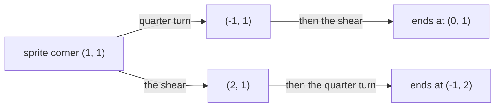

# Linear maps: a rule that keeps lines straight and the origin fixed is secretly a matrix, whose columns say where the axes go

[Syllabus](../../../SYLLABUS.md) → [Algebra](../../../SYLLABUS.md#w03) → [Matrices](../../../SYLLABUS.md#w03-s04) → Linear maps

---

## General Overview

A game sprite is drawn on the unit square: corners (0, 0), (1, 0), (1, 1), (0, 1). Two buttons move it.

The first leans it: the bottom edge stays put, the top edge slides one step right, and the square becomes a slanted parallelogram — a **shear**. The second spins the sprite a quarter turn anticlockwise about (0, 0).

Both buttons are rules: feed in a point, get a point back. Neither bends a straight edge, and neither budges the corner at (0, 0). Those habits mark a **linear map**; two exact tests pin it down below.

Such a map needs no rule written out: four numbers hold it. Watch where it sends (1, 0), one step along the bottom, and (0, 1), one step up the side. Those two answers, down the columns of a table, reproduce the map everywhere. The shear's table is `[[1, 1], [0, 1]]`, the turn's `[[0, -1], [1, 0]]` — matrices ([Matrices](01-matrices-and-the-matrix-zoo.md)), 2 × 2, rows × columns. Press both buttons in a row and the trip is one matrix, the product of theirs.

**A rule that respects adding and stretching is pinned down by where it sends the two axis arrows — which is why it is a matrix, and why one rule after another is those matrices multiplied, first move on the right.**

**What kind of fact this is:** a theorem, proved on this card in Why it works; "linear map" is a definition.

### The picture: one corner, two orders



Same corner, same two moves, different finish: the "order matters" of [Matrix multiplication](03-matrix-multiplication.md), with a reason attached.

---

## The formula

A rule $T$ is a linear map when both hold, for every pair of vectors and every number:

$$T(u + v) = T(u) + T(v) \qquad\text{and}\qquad T(cu) = c\,T(u)$$

**Read it aloud:** add two points then move them, or move each then add: same landing spot. Stretching before the move stretches the answer to match.

Put 0 in for the number and the second test says the map sends (0, 0) to (0, 0).

Now the build. Name the axis arrows $e_1$ = (1, 0) and $e_2$ = (0, 1), and write their answers as columns:

$$A = [\;T(e_1)\;\;T(e_2)\;] \qquad\text{and then}\qquad T(v) = A v \text{ for every } v$$

**Read it aloud:** each axis arrow's answer is a column, and from then on the matrix *is* the map.

Then the composition, with $A$ the shear's matrix and $B$ the turn's:

$$\text{turn, then shear} = A B \qquad\text{and}\qquad \text{shear, then turn} = B A$$

**Read it aloud:** the move made first sits on the right.

| Symbol | Plain meaning | In our example | Push it up and the answer… |
| --- | --- | --- | --- |
| $T$ | takes a vector in, hands one back | the shear, or the turn | — |
| $u$, $v$ | any two vectors, in round brackets | (1, 0) and (0, 1) | both tests hold for every pair |
| $c$ | any plain number, stretching a vector | 3 | every number, not just this one |
| $e_1$, $e_2$ | the two axis arrows | (1, 0) and (0, 1) | — |
| $A$, $B$ | a map's two answers as columns, 2 × 2 | the shear's `[[1, 1], [0, 1]]`, the turn's `[[0, -1], [1, 0]]` | change a column and one axis arrow moves |
| $AB$ | the matrix of "turn first, then shear" | `[[1, -1], [1, 0]]` | — |
| $BA$ | the matrix of "shear first, then turn" | `[[0, -1], [1, 1]]` | swap the order, the sprite finishes elsewhere |

### When it holds

- **Both tests, at every input.** Agreeing with a matrix on the four corners settles nothing; a rule can pass there and fail elsewhere.
- **A fixed origin is not enough.** Squaring the first number of the pair keeps (0, 0) in place and still fails: it sends (1, 1) to (1, 1) but (2, 2) to (4, 2), where doubling the input should have doubled the answer.
- **One column per axis arrow.** The plane has two, so the matrix is 2 × 2; between spaces of different sizes it is rectangular.
- **The same axes throughout.** The columns are answers read against (1, 0) and (0, 1); measure against other arrows and the matrix changes ([Change of basis](../07-Eigenvalues%20and%20Symmetric%20Matrices/01-change-of-basis.md)).

---

## Why it works

### Step 0: every point is a mix of the two axis arrows

The corner (1, 1) is one step right plus one step up: (1, 1) = 1 × (1, 0) + 1 × (0, 1). Any point (x, y) is x of the first arrow plus y of the second — [Basis and dimension](../03-Vectors/05-basis-and-dimension.md) calling (1, 0) and (0, 1) a **basis**: every vector is their mix, in exactly one way.

### Step 1: the tests move the pieces instead of the point

Feed (x, y) into a linear map. The first test splits the sum: the map of the mix is the map of one piece plus the map of the other. The second pulls x and y out in front:

$$T(v) = x\,T(e_1) + y\,T(e_2)$$

The map is never asked about (x, y): ask the two arrows once and everything else is answered.

### Step 2: two answers, stacked as columns, make the matrix

Ask the shear. The bottom edge is left alone, so (1, 0) stays at (1, 0); the top slides one step right, so (0, 1) goes to (1, 1). As columns: `[[1, 1], [0, 1]]`.

Ask the turn. One step right becomes one step up, so (1, 0) goes to (0, 1); one step up becomes one step left, so (0, 1) goes to (-1, 0). As columns: `[[0, -1], [1, 0]]`.

Two questions each; nothing else.

### Step 3: mixing the columns is exactly matrix times vector

[Matrix times vector](02-matrix-times-vector.md) said a matrix times a vector mixes the columns: x copies of the first, y of the second. Step 1 said the map of (x, y) is x copies of the first answer, y of the second. The columns hold those answers: the same sentence twice.

On (1, 1) under the shear: one copy of each column, (1, 0) + (1, 1) = (2, 1), the lean itself.

### Step 4: one map after another is one product

Now turn, then shear. The trip is still linear, because each half is, so by Step 2 it is a matrix, its columns wherever the trip sends the two arrows. To find them, push each column of the turn's matrix through the shear: the row-by-column recipe of [Matrix multiplication](03-matrix-multiplication.md), which gives `[[1, -1], [1, 0]]`. Shear first instead and it gives `[[0, -1], [1, 1]]`.

So matrix multiplication is no arbitrary recipe: it is whatever it must be for "do this, then that" to be one matrix.

<details>
<summary>Detailed proof: linear everywhere, and no other matrix fits</summary>

**The shear** sends the pair (x, y) to (x + y, y). Add it to a second pair (x', y') first and (x + x', y + y') goes to (x + x' + y + y', y + y'), the sum of the separate answers. Stretch first and (cx, cy) goes to (cx + cy, cy), c times the answer for (x, y). Both tests hold everywhere, not only at the corners. **The turn** sends (x, y) to (-y, x): a swap with one sign change survives both tests by the same two lines.

**Only one matrix fits.** Two matrices agreeing on (1, 0) and (0, 1) share both columns, so they are equal.

**Every matrix is a map too.** Matrix times vector mixes the columns, and mixing respects adding and stretching: linear map and 2 × 2 matrix name one thing.

</details>

---

## Worked numbers, by hand

The sprite, its two buttons, the corner (1, 1).

| Step | Arithmetic | Value |
| --- | --- | --- |
| the shear's two answers, as columns | (1, 0) stays, (0, 1) goes to (1, 1) | `[[1, 1], [0, 1]]` |
| the turn's two answers, as columns | (1, 0) goes to (0, 1), (0, 1) to (-1, 0) | `[[0, -1], [1, 0]]` |
| (1, 1), turn then shear, two steps | turn to (-1, 1), then shear | **(0, 1)** |
| (1, 1), turn then shear, one matrix | `[[1, -1], [1, 0]]` on (1, 1) | **(0, 1)** |
| (1, 1), shear then turn, two steps | shear to (2, 1), then turn | **(-1, 2)** |
| (1, 1), shear then turn, one matrix | `[[0, -1], [1, 1]]` on (1, 1) | **(-1, 2)** |

Two orders, two landing spots; in each the single matrix agrees with the two-step trip.

### What breaks if you drop a piece

| Mistake | Corner (1, 1) lands at | What went wrong |
| --- | --- | --- |
| Multiplying in the spoken order | (-1, 2) | The move done first belongs on the right; this is the other order. |
| Answers laid in as rows, shear as `[[1, 0], [1, 1]]` | (1, 2) | Rows mix the inputs; columns hold the outputs. |
| Minus sign dropped, turn as `[[0, 1], [1, 0]]` | (1, 1) | A mirror flip, not a turn; it leaves this corner alone. |

The code prints all three.

---

## Code, from first principles, and it actually runs

The two moves are written as plain rules, not matrices. Every answer is reached twice: by applying the rules, and by building each matrix from the two axis arrows and using it instead. Corners and trips agree on both roads. Both tests run on the shear, the slide is shown failing, and the wrong answers above are printed.

### Python

```python
# Linear maps as matrices -- the check behind the card.  Nothing is imported.
# A game sprite sits on the unit square.  Two moves: a shear that leans it, and
# a quarter turn.  Each is tested for linearity, turned into a matrix from the
# images of the two axis arrows, run by rule and by matrix, then composed.

def shear(v):  return (v[0] + v[1], v[1])        # lean the top to the right
def turn(v):   return (-v[1], v[0])              # quarter turn, anticlockwise
def slide(v):  return (v[0] + 1, v[1])           # NOT linear: it moves (0, 0)

E1, E2, C = (1, 0), (0, 1), (1, 1)               # the axis arrows, and the corner followed
SQUARE = [(0, 0), (1, 0), (1, 1), (0, 1)]        # the sprite's four corners

def matrix_of(f):                                # columns are the images of the axes
    a, b = f(E1), f(E2)
    return [[a[0], b[0]], [a[1], b[1]]]

def apply(M, v):                                 # matrix times vector: mix the columns
    return (M[0][0] * v[0] + M[0][1] * v[1], M[1][0] * v[0] + M[1][1] * v[1])
def times(M, N):                                 # M after N: push each column of N through M
    c1, c2 = apply(M, (N[0][0], N[1][0])), apply(M, (N[0][1], N[1][1]))
    return [[c1[0], c2[0]], [c1[1], c2[1]]]

def add(a, b):    return (a[0] + b[0], a[1] + b[1])
def scale(k, a):  return (k * a[0], k * a[1])
def s(v):         return f"({v[0]}, {v[1]})"
def m(M):         return f"[[{M[0][0]}, {M[0][1]}], [{M[1][0]}, {M[1][1]}]]"

S, R = matrix_of(shear), matrix_of(turn)
print(f"shear: e1 -> {s(shear(E1))}, e2 -> {s(shear(E2))}, so the matrix is {m(S)}")
print(f"turn:  e1 -> {s(turn(E1))}, e2 -> {s(turn(E2))}, so the matrix is {m(R)}")
print("the sprite's corners             " + "  ".join(s(v) for v in SQUARE))
print("after the shear, by the rule     " + "  ".join(s(shear(v)) for v in SQUARE))
print("after the shear, by its matrix   " + "  ".join(s(apply(S, v)) for v in SQUARE))
print("after the turn, by the rule      " + "  ".join(s(turn(v)) for v in SQUARE))
print("after the turn, by its matrix    " + "  ".join(s(apply(R, v)) for v in SQUARE))

TS, ST = times(S, R), times(R, S)
print(f"turn first, then shear: one matrix {m(TS)}")
print(f"  two steps, corner {s(C)}: turn -> {s(turn(C))}, then shear -> {s(shear(turn(C)))}")
print(f"  that one matrix, corner {s(C)}: {s(apply(TS, C))}")
print(f"shear first, then turn: one matrix {m(ST)}")
print(f"  two steps, corner {s(C)}: shear -> {s(shear(C))}, then turn -> {s(turn(shear(C)))}")
print(f"  that one matrix, corner {s(C)}: {s(apply(ST, C))}")

u, v, k = (1, 0), (0, 1), 3
print(f"linearity of the shear, with u = {s(u)}, v = {s(v)}, c = {k}")
print(f"  T(u + v) = {s(shear(add(u, v)))} and T(u) + T(v) = {s(add(shear(u), shear(v)))}")
print(f"  T(cu) = {s(shear(scale(k, u)))} and cT(u) = {s(scale(k, shear(u)))}")
print(f"slide right by 1 fails: D(u + v) = {s(slide(add(u, v)))} but D(u) + D(v) = {s(add(slide(u), slide(v)))}")

rows_not_cols, no_minus = [[1, 0], [1, 1]], [[0, 1], [1, 0]]
print(f"mistakes on corner {s(C)}: wrong order {s(apply(ST, C))}, "
      f"rows not columns {s(apply(rows_not_cols, C))}, turn with no minus {s(apply(no_minus, C))}")

assert S == [[1, 1], [0, 1]] and R == [[0, -1], [1, 0]]
assert all(apply(S, w) == shear(w) and apply(R, w) == turn(w) for w in SQUARE)
assert TS == [[1, -1], [1, 0]] and ST == [[0, -1], [1, 1]]
assert apply(TS, C) == shear(turn(C)) == (0, 1) and apply(ST, C) == turn(shear(C)) == (-1, 2)
print("ALL CHECKS PASS")
```

**Ran 2026-09-19 on macOS, Python 3.14.6, standard library only. All checks passed. Output, pasted from the run:**

```
shear: e1 -> (1, 0), e2 -> (1, 1), so the matrix is [[1, 1], [0, 1]]
turn:  e1 -> (0, 1), e2 -> (-1, 0), so the matrix is [[0, -1], [1, 0]]
the sprite's corners             (0, 0)  (1, 0)  (1, 1)  (0, 1)
after the shear, by the rule     (0, 0)  (1, 0)  (2, 1)  (1, 1)
after the shear, by its matrix   (0, 0)  (1, 0)  (2, 1)  (1, 1)
after the turn, by the rule      (0, 0)  (0, 1)  (-1, 1)  (-1, 0)
after the turn, by its matrix    (0, 0)  (0, 1)  (-1, 1)  (-1, 0)
turn first, then shear: one matrix [[1, -1], [1, 0]]
  two steps, corner (1, 1): turn -> (-1, 1), then shear -> (0, 1)
  that one matrix, corner (1, 1): (0, 1)
shear first, then turn: one matrix [[0, -1], [1, 1]]
  two steps, corner (1, 1): shear -> (2, 1), then turn -> (-1, 2)
  that one matrix, corner (1, 1): (-1, 2)
linearity of the shear, with u = (1, 0), v = (0, 1), c = 3
  T(u + v) = (2, 1) and T(u) + T(v) = (2, 1)
  T(cu) = (3, 0) and cT(u) = (3, 0)
slide right by 1 fails: D(u + v) = (2, 1) but D(u) + D(v) = (3, 1)
mistakes on corner (1, 1): wrong order (-1, 2), rows not columns (1, 2), turn with no minus (1, 1)
ALL CHECKS PASS
```

### Rust

Same numbers and labels, built with `rustc --edition 2021 -O`.

```rust
// Linear maps as matrices -- the same check as the Python, in Rust.  No crates.
// A game sprite sits on the unit square.  Two moves: a shear that leans it, and
// a quarter turn.  Each is tested for linearity, turned into a matrix from the
// images of the two axis arrows, run by rule and by matrix, then composed.
type V = (i64, i64);
type M = [[i64; 2]; 2];

fn shear(v: V) -> V { (v.0 + v.1, v.1) }        // lean the top to the right
fn turn(v: V) -> V { (-v.1, v.0) }              // quarter turn, anticlockwise
fn slide(v: V) -> V { (v.0 + 1, v.1) }          // NOT linear: it moves (0, 0)

const E1: V = (1, 0);                           // the two axis arrows
const E2: V = (0, 1);
const C: V = (1, 1);                            // the corner followed

fn matrix_of(f: fn(V) -> V) -> M {              // columns are the images of the axes
    let (a, b) = (f(E1), f(E2));
    [[a.0, b.0], [a.1, b.1]]
}
fn apply(m: M, v: V) -> V {                     // matrix times vector: mix the columns
    (m[0][0] * v.0 + m[0][1] * v.1, m[1][0] * v.0 + m[1][1] * v.1)
}
fn times(m: M, n: M) -> M {                     // m after n: push each column of n through m
    let (c1, c2) = (apply(m, (n[0][0], n[1][0])), apply(m, (n[0][1], n[1][1])));
    [[c1.0, c2.0], [c1.1, c2.1]]
}
fn add(a: V, b: V) -> V { (a.0 + b.0, a.1 + b.1) }
fn scale(k: i64, a: V) -> V { (k * a.0, k * a.1) }
fn s(v: V) -> String { format!("({}, {})", v.0, v.1) }
fn mm(m: M) -> String {
    format!("[[{}, {}], [{}, {}]]", m[0][0], m[0][1], m[1][0], m[1][1])
}
fn row<F: Fn(V) -> V>(label: &str, f: F, square: &[V]) -> String {
    let parts: Vec<String> = square.iter().map(|&v| s(f(v))).collect();
    format!("{}{}", label, parts.join("  "))
}

fn main() {
    let square: Vec<V> = vec![(0, 0), (1, 0), (1, 1), (0, 1)];   // the sprite's four corners
    let (sm, rm) = (matrix_of(shear), matrix_of(turn));
    println!("shear: e1 -> {}, e2 -> {}, so the matrix is {}", s(shear(E1)), s(shear(E2)), mm(sm));
    println!("turn:  e1 -> {}, e2 -> {}, so the matrix is {}", s(turn(E1)), s(turn(E2)), mm(rm));
    println!("{}", row("the sprite's corners             ", |v| v, &square));
    println!("{}", row("after the shear, by the rule     ", shear, &square));
    println!("{}", row("after the shear, by its matrix   ", |v| apply(sm, v), &square));
    println!("{}", row("after the turn, by the rule      ", turn, &square));
    println!("{}", row("after the turn, by its matrix    ", |v| apply(rm, v), &square));

    let (ts, st) = (times(sm, rm), times(rm, sm));
    println!("turn first, then shear: one matrix {}", mm(ts));
    println!("  two steps, corner {}: turn -> {}, then shear -> {}", s(C), s(turn(C)), s(shear(turn(C))));
    println!("  that one matrix, corner {}: {}", s(C), s(apply(ts, C)));
    println!("shear first, then turn: one matrix {}", mm(st));
    println!("  two steps, corner {}: shear -> {}, then turn -> {}", s(C), s(shear(C)), s(turn(shear(C))));
    println!("  that one matrix, corner {}: {}", s(C), s(apply(st, C)));

    let (u, v, k) = ((1, 0), (0, 1), 3);
    println!("linearity of the shear, with u = {}, v = {}, c = {}", s(u), s(v), k);
    println!("  T(u + v) = {} and T(u) + T(v) = {}", s(shear(add(u, v))), s(add(shear(u), shear(v))));
    println!("  T(cu) = {} and cT(u) = {}", s(shear(scale(k, u))), s(scale(k, shear(u))));
    println!("slide right by 1 fails: D(u + v) = {} but D(u) + D(v) = {}",
             s(slide(add(u, v))), s(add(slide(u), slide(v))));

    let rows_not_cols: M = [[1, 0], [1, 1]];
    let no_minus: M = [[0, 1], [1, 0]];
    println!("mistakes on corner {}: wrong order {}, rows not columns {}, turn with no minus {}",
             s(C), s(apply(st, C)), s(apply(rows_not_cols, C)), s(apply(no_minus, C)));

    assert!(sm == [[1, 1], [0, 1]] && rm == [[0, -1], [1, 0]]);
    assert!(square.iter().all(|&w| apply(sm, w) == shear(w) && apply(rm, w) == turn(w)));
    assert!(ts == [[1, -1], [1, 0]] && st == [[0, -1], [1, 1]]);
    assert!(apply(ts, C) == shear(turn(C)) && apply(ts, C) == (0, 1)
            && apply(st, C) == turn(shear(C)) && apply(st, C) == (-1, 2));
    println!("ALL CHECKS PASS");
}
```

**Ran 2026-09-19 on macOS, rustc 1.98.1, no crates. All checks passed. Output, pasted from the run:**

```
shear: e1 -> (1, 0), e2 -> (1, 1), so the matrix is [[1, 1], [0, 1]]
turn:  e1 -> (0, 1), e2 -> (-1, 0), so the matrix is [[0, -1], [1, 0]]
the sprite's corners             (0, 0)  (1, 0)  (1, 1)  (0, 1)
after the shear, by the rule     (0, 0)  (1, 0)  (2, 1)  (1, 1)
after the shear, by its matrix   (0, 0)  (1, 0)  (2, 1)  (1, 1)
after the turn, by the rule      (0, 0)  (0, 1)  (-1, 1)  (-1, 0)
after the turn, by its matrix    (0, 0)  (0, 1)  (-1, 1)  (-1, 0)
turn first, then shear: one matrix [[1, -1], [1, 0]]
  two steps, corner (1, 1): turn -> (-1, 1), then shear -> (0, 1)
  that one matrix, corner (1, 1): (0, 1)
shear first, then turn: one matrix [[0, -1], [1, 1]]
  two steps, corner (1, 1): shear -> (2, 1), then turn -> (-1, 2)
  that one matrix, corner (1, 1): (-1, 2)
linearity of the shear, with u = (1, 0), v = (0, 1), c = 3
  T(u + v) = (2, 1) and T(u) + T(v) = (2, 1)
  T(cu) = (3, 0) and cT(u) = (3, 0)
slide right by 1 fails: D(u + v) = (2, 1) but D(u) + D(v) = (3, 1)
mistakes on corner (1, 1): wrong order (-1, 2), rows not columns (1, 2), turn with no minus (1, 1)
ALL CHECKS PASS
```

The two outputs match line for line.

> [!TIP]
> **Try changing**
> Guess first, then run it; an assert stops the program when a number is wrong.
> - **Swap the order.** Change `TS, ST = times(S, R), times(R, S)` to `times(R, S), times(S, R)`. The matrices trade places and so do the corner answers: (-1, 2) where (0, 1) was. The third assert stops it.
> - **Mix rows instead of columns.** In `apply`, swap `M[0][1]` with `M[1][0]`. Rule and matrix disagree on the corners, and the second assert stops it.
> - **Build a matrix for the slide.** Pass `slide` to `matrix_of` instead of `shear`. It hands back `[[2, 1], [0, 1]]`, which holds (0, 0) still while the slide sends it to (1, 0): build from a rule that is not linear and the matrix is not the rule.

---

## The usual mistake

> [!warning]
> **Assuming anything that moves shapes around is a matrix.** A linear map must leave (0, 0) alone, so "shift the sprite two steps left and one up" — the commonest thing a game does — is not one, and no 2 × 2 matrix performs it. Turning, leaning, stretching, squashing, flipping: linear. Sliding: not.
>
> - **Writing it in the order it was said.** "Turn, then shear" puts the shear's matrix on the left; the other way round, the corner (1, 1) lands at (-1, 2), not (0, 1).
> - **Rows instead of columns.** The answers go down the columns. As rows, the shear reads `[[1, 0], [1, 1]]` and the corner goes to (1, 2).
> - **The straight line from school.** There, "linear" means $y = mx + b$, a graph. Here it means the two tests, with the origin fixed.

---

## Where you meet it in real life

- **Every screen.** Rotating, scaling, flipping and skewing a sprite is one matrix per move, and a chain collapses into one matrix before a pixel is drawn — [Matrix multiplication](03-matrix-multiplication.md) earning its keep.
- **Photo filters.** Converting an image between colour systems multiplies each pixel's three numbers by a fixed 3 × 3 matrix: three axis arrows instead of two.
- **Fixed weighted sums.** Ingredients per product, nutrients per serving, sensor readings per source: if doubling every input doubles every output, a matrix is hiding there.

> **Say it back**
> A linear map is a rule on vectors that survives adding and stretching, which forces it to leave the origin alone. Every point is a mix of the two axis arrows, so those two answers, written down the columns, give a matrix that does the job. One map then another is the two matrices multiplied, first move on the right. The corner (1, 1) ends at (0, 1) turning then leaning, at (-1, 2) leaning then turning.

---

## What this builds on

- [Matrix multiplication](03-matrix-multiplication.md): the row-by-column recipe, and that AB and BA differ; this card says why the recipe has that shape.
- [Basis and dimension](../03-Vectors/05-basis-and-dimension.md): why (1, 0) and (0, 1) describe every point, in exactly one way; without it, two answers would not be enough.
- [Functions](../../01-Foundations/08-Relations%20and%20Functions/02-functions.md): a rule with an input and an output, which is all a map is.
- [Composing functions](../../01-Foundations/08-Relations%20and%20Functions/03-composition.md): doing one function after another — what a matrix product turns out to be.

## Where this goes next

- [Determinants](../05-Solving%20Systems/04-determinants.md): one number off the matrix: how much the map stretches area, and whether it flattened the sprite.
- [Rank and nullity](../05-Solving%20Systems/05-rank-nullity.md): what a map keeps and what it destroys, and why the counts add up.
- [Change of basis](../07-Eigenvalues%20and%20Symmetric%20Matrices/01-change-of-basis.md): the same map against different axis arrows, and how its matrix changes.
- [Moving shapes with matrices](../../05-Geometry%20and%20trig/05-Vectors%20in%20Space/04-transformations-with-matrices.md): the same recipe in space, three axis arrows and a 3 × 3 matrix.
- Bounded operators: linear maps whose input lists never end, sized by the most they stretch a vector.

The matrix says where every point goes, but not how much room it leaves: whether the sprite is leaned or flattened onto a line is the one number [Determinants](../05-Solving%20Systems/04-determinants.md) reads off.

---

## Sources

Verified 19 Sep 2026: every link below resolves to the publisher's page.

- Axler, Sheldon. *Linear Algebra Done Right*, 4th ed. Springer, 2024. [Publisher page](https://link.springer.com/book/10.1007/978-3-031-41026-0). Open access; builds a map's matrix from the images of a basis.
- Strang, Gilbert. *Linear Algebra*, MIT 18.06, Spring 2010. MIT OpenCourseWare. [Lecture 30, "Linear transformations and their matrices"](https://ocw.mit.edu/courses/18-06-linear-algebra-spring-2010/resources/lecture-30-linear-transformations-and-their-matrices/). The same construction on video.
- Hefferon, Jim. *Linear Algebra*. [Book page](https://hefferon.net/linearalgebra/). Free textbook covering linear maps and matrices, with proofs.
