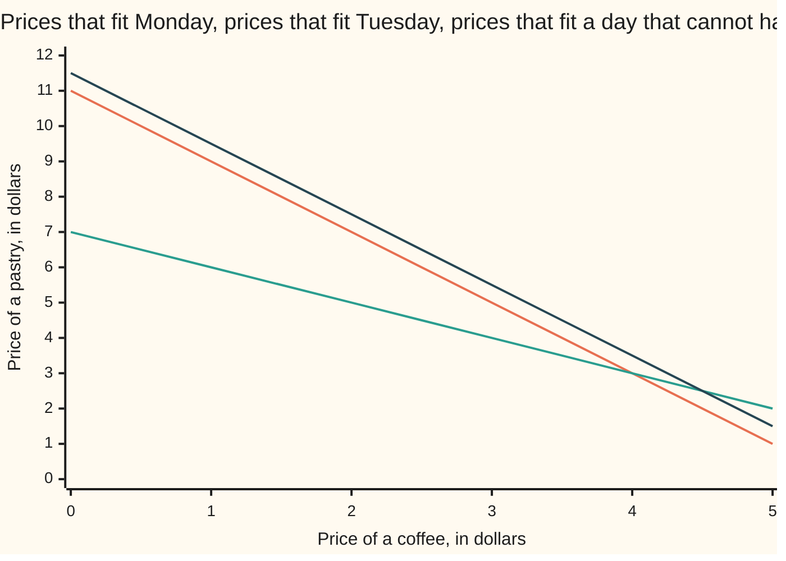

# Solving A x = b: one answer, no answer or a line of answers, and how to tell which before you start

Algebra → Solving Systems → Systems → Solving A x = b

---

## General Overview

A cafe keeps two days of till slips and no price list. Monday: 2 coffees and 1 pastry, $11. Tuesday: 1 coffee and 1 pastry, $7. What is a coffee?

Subtract Tuesday's slip from Monday's. The pastries cancel, one coffee is left, and $11 minus $7 is $4. A coffee is $4.00, and Tuesday then makes a pastry $3.00.

That worked because each price is only multiplied by a count and added on: such an equation is **linear**, and a pile that must all hold at once is a **system**.

Strip the words off the slips and only the counts are left, written row by row in square brackets, one row per day: `[[2, 1], [1, 1]]`, a matrix of size 2 by 2. The prices are a list, $(x, y)$, the takings another, $(11, 7)$; multiplying counts into prices rebuilds both totals ([matrix-times-vector](../04-Matrices/02-matrix-times-vector.md)). The cafe is one line:

**counts × prices = takings**, or in letters, $A x = b$.

**That line asks one question: which mix of $A$'s columns lands exactly on $b$? One mix, a whole line of mixes, or none — and the columns of $A$ settle which case before $b$ is read.**

**What kind of fact this is:** a theorem, proved on this card in Why it works; $A x = b$ itself is a definition.

### The picture: three days, three lines



The steeper line is Monday: the price pairs with 2 coffees and 1 pastry adding to $11. The shallower one is Tuesday. They cross once, at a $4.00 coffee and a $3.00 pastry — the answer. The third line is 4 coffees and 2 pastries for $23, parallel to Monday's and half a dollar above: parallel means no prices fit both.

---

## The formula

The cafe, as one equation:

$$[[2,\,1],\,[1,\,1]]\,(x,\,y) \;=\; (11,\,7)$$

Put letters where the numbers are and every system has this shape:

$$A x = b$$

**Read it aloud:** the counts, multiplied into the unknown prices, give the takings.

| Symbol | Plain meaning | In our example | Change it and the answer… |
| --- | --- | --- | --- |
| $A$ | the counts: a row per equation, a column per unknown | `[[2, 1], [1, 1]]` | different slips, different prices |
| $x$ | the unknowns being solved for | $(4, 3)$: coffee $4.00, pastry $3.00 | the answer, not an input |
| $y$ | the pastry price, the second entry of $x$ | $3.00 | fixed by the slips too |
| $b$ | the totals, one per row of $A$ | $(11, 7)$ | move $b$, the answer moves |
| $A x$ | $A$'s columns mixed, with $x$'s entries as the amounts | $(11, 7)$, the takings rebuilt | — |
| $A^{-1}$ | the matrix that undoes $A$, when it exists | exists here, not needed here | [inverse-matrix](03-inverse-matrix.md) |

Two words do the classifying, both about $A$ alone. The **span** of the columns is every list their mixes reach; the columns are **independent** when neither is a multiple of the other ([linear-independence](../03-Vectors/04-linear-independence.md)).

One warning about $x$: alone it is the coffee price, but in $A x = b$ the letter means the whole list $(x, y)$.

### When it holds

- **Each total is a price times a count, added up.** A two-for-one deal is not linear, and no matrix holds it.
- **The prices hold still across the days.** If coffee rose on Tuesday, three unknowns face two rows and nothing is pinned.
- **The totals are exact.** Rounded takings leave $b$ just off the span, so nothing fits at all.

---

## Why it works

### Step 0: the columns are the things being mixed

Multiply $A$ into $(4, 3)$ the column way ([matrix-times-vector](../04-Matrices/02-matrix-times-vector.md)):

**4.00 × (2, 1) + 3.00 × (1, 1) = (11.00, 7.00)**

Read the first column, $(2, 1)$, as *one coffee*: twice in Monday's total, once in Tuesday's. The second, $(1, 1)$, is *one pastry*, once each day. $A x$ mixes one coffee with one pastry, the amounts being the prices.

Solving $A x = b$ is that sentence backwards: **find the amounts that mix the columns onto the takings.**

### Step 1: elimination knocks one unknown out

Written out, the system is 2x + y = 11 and x + y = 7. Subtract 0.50 of row one from row two: the x terms cancel, since 1 minus 0.50 × 2 is 0. That leaves 0.50 y = 1.50, a $3.00 pastry, and Monday's row then gives (11 − 1 × 3.00) / 2 = 4.00, a $4.00 coffee.

That is **elimination**: subtract a multiple of one row from another to kill an unknown, then read the answers back up. Nothing is lost or invented: adding the multiple back restores the old row, so both systems have the same answers. Organised for bigger systems, it is [gaussian-elimination](02-gaussian-elimination.md).

The till-slip subtraction at the top is the code's second road: Tuesday says y = 7 − x, so Monday becomes 2x + (7 − x) = 11, giving x = 11 − 7 = 4.00 and y = 3.00.

### Step 2: when the two rows say the same thing

Suppose Tuesday had been 4 coffees and 2 pastries for $22. The counts are `[[2, 1], [4, 2]]`, row two exactly twice row one: Tuesday adds nothing, it is Monday said louder.

Look at the columns, $(2, 4)$ and $(1, 2)$: the first is twice the second. Both lie along one line, so they are **dependent**, and every mix lands on that line, the multiples of $(1, 2)$: the span has collapsed from the plane to a line.

Now the takings decide. $(11, 22)$ is 11 × $(1, 2)$, so it sits on the line: mixes exist, and once one does, a whole line does. Any prices with 2x + y = 11 fit — the code prints $(0.00, 11.00)$, $(2.00, 7.00)$, $(4.00, 3.00)$, $(5.50, 0.00)$ — and row two vanishes to 0 = 0.

Change that total to $23 and $(11, 23)$ is off the line: no mix reaches it, and elimination ends at 0 = 1.00, which nothing can satisfy.

### Step 3: the three outcomes, in one table

| The columns of $A$ | Where $b$ sits | Outcome | The cafe |
| --- | --- | --- | --- |
| independent, neither a multiple of the other | anywhere: they span the whole plane | exactly one answer | prices (4.00, 3.00) |
| dependent, one a multiple of the other | on their line | a line of answers | takings (11, 22) |
| dependent, one a multiple of the other | off their line | no answer | takings (11, 23) |

That is the "before you start" in the title: for a square system, independent columns give one answer for every $b$, while dependent columns give none or infinitely many, and only then does $b$ matter. One number runs the test: top-left times bottom-right, minus top-right times bottom-left — 1 for the cafe, 0 for the doubled Tuesday, and zero is the collapse. That number is the determinant, [determinants](04-determinants.md).

<details>
<summary>Detailed proof: why there is no fourth outcome</summary>

Suppose two price pairs both fit, $(x, y)$ and $(x', y')$. Monday gives 2x + y = 11 and 2x' + y' = 11; subtracting, 2(x − x') + (y − y') = 0, and every row does the same. So the difference $d$, not itself zero, mixes the columns onto $(0, 0)$: the columns are dependent. Backwards: independent columns allow at most one answer, and they span the plane, so every $b$ is reached.

Adding any multiple of $d$ to a pair that fits changes no total, so two answers force infinitely many — a line along $d$. For the doubled Tuesday $d = (1, -2)$, one more coffee and two fewer pastries: the code adds it to (4.00, 3.00), landing on (5.00, 1.00).

</details>

The top row has a shortcut: with independent columns and $A$ square, one matrix undoes $A$, written $A^{-1}$, so $x = A^{-1} b$ in one multiplication ([inverse-matrix](03-inverse-matrix.md)). Counting the surviving columns, and the directions squashed flat, is [rank-nullity](05-rank-nullity.md).

---

## Worked numbers, by hand

The cafe, to the cent.

| Step | Arithmetic | Value |
| --- | --- | --- |
| Monday's row | 2x + y | 11 |
| Tuesday's row | x + y | 7 |
| row two minus 0.50 × row one | the x terms cancel | 0.50 y = 1.50 |
| the pastry | 1.50 / 0.50 | **y = 3.00** |
| back up into Monday's row | (11 − 1 × 3.00) / 2 | **x = 4.00** |
| second road, substitution | x = 11 − 7, then y = 7 − 4.00 | **(4.00, 3.00)** |
| multiply back | 4.00 × (2, 1) + 3.00 × (1, 1) | (11.00, 7.00) |
| the columns test | 2 × 1 − 1 × 1 | **1.00, not zero** |

A coffee is $4.00 and a pastry is $3.00 — the only pair that fits both days.

### What breaks if you drop a piece

| Mistake | Comes out at | What went wrong |
| --- | --- | --- |
| Dividing takings by coffee counts, 11 / 2 and 7 / 1 | (5.50, 7.00) | No dividing by a matrix, and each total mixes both prices. |
| Feeding the totals in the wrong order, $b$ = (7, 11) | (-4.00, 15.00) | Rows of $A$ and entries of $b$ are days in the same order; swapped, a different cafe. |
| Reporting one answer for the doubled Tuesday | (4.00, 3.00) | They fit, but so do (0.00, 11.00), (2.00, 7.00) and (5.50, 0.00) — one point is not *the* answer. |

The code prints all three.

---

## Code, from first principles, and it actually runs

Nothing is imported. Three functions: one eliminates a 2 by 2 system and names the outcome, one multiplies a matrix into prices the column way, one runs the columns test. The cafe is solved twice, then multiplied back; the doubled Tuesday runs at $22 and at $23.

### Python

```python
# Solving A x = b -- the check behind the card.  Nothing is imported.  The cafe:
# Monday 2 coffees + 1 pastry = $11, Tuesday 1 coffee + 1 pastry = $7, so
# A = [[2, 1], [1, 1]] and b = (11, 7).  Two roads to the same prices, then the
# two look-alike days: totals $22 (a line of answers) and $23 (no answer).

def eliminate(A, b):                           # row two minus (its left entry / row one's) x row one
    (p, q), (r, s) = A                         # every case here has a nonzero top left: no row swap
    f = r / p                                  # the multiple of row one to remove
    s2, t2 = s - f * q, b[1] - f * b[0]        # row two after the subtraction
    if s2 != 0:                                # one unknown left: read it, then back up
        y = t2 / s2
        return "one answer", (b[0] - q * y) / p, y, f, s2, t2
    if t2 != 0:                                # row two now reads 0 = t2
        return "no answer", 0.0, 0.0, f, s2, t2
    return "a line of answers", 0.0, 0.0, f, s2, t2

def times(A, v):                               # A x: the mix of A's columns
    return (A[0][0] * v[0] + A[0][1] * v[1], A[1][0] * v[0] + A[1][1] * v[1])

def columns_test(A):                           # zero when one column is a multiple of the other
    return A[0][0] * A[1][1] - A[0][1] * A[1][0]

A, b = [[2, 1], [1, 1]], (11.0, 7.0)
kind, x, y, f, s2, t2 = eliminate(A, b)
x2 = b[0] - b[1]                               # second road: y = 7 - x put into
y2 = b[1] - x2                                 # 2x + y = 11 leaves x = 11 - 7
ax, ay = times(A, (x, y))
same = [[2, 1], [4, 2]]                        # Tuesday doubled: 4 coffees + 2 pastries
k22, _, _, _, _, _ = eliminate(same, (11.0, 22.0))
k23, _, _, _, _, gap = eliminate(same, (11.0, 23.0))
fits = [(t, 11.0 - 2.0 * t) for t in (0.0, 2.0, 4.0, 5.5)]
free = (same[0][1], -same[0][0])               # one more coffee, two fewer pastries
zz = times(same, free)                         # and neither day's total budges
_, xw, yw, _, _, _ = eliminate(A, (7.0, 11.0))         # the totals in the wrong order

print("A = [[2, 1], [1, 1]] and b = (11, 7), so 2x + y = 11 and x + y = 7")
print(f"elimination: row two minus {f:.2f} x row one leaves {s2:.2f} y = {t2:.2f}")
print(f"read it back up: y = {y:.2f}, then x = (11 - 1 x {y:.2f}) / 2 = {x:.2f}")
print(f"second road, substitution: x = 11 - 7 = {x2:.2f}, then y = 7 - {x2:.2f} = {y2:.2f}")
print(f"so a coffee is ${x:.2f} and a pastry is ${y:.2f}, and that is {kind}")
print(f"multiply back: A x = ({ax:.2f}, {ay:.2f}) and b = (11.00, 7.00)")
print(f"as a column mix: {x:.2f} x (2, 1) + {y:.2f} x (1, 1) = ({ax:.2f}, {ay:.2f})")
for lab, c, m in (("2x + y = 11", 11.0, 2.0), ("x + y = 7", 7.0, 1.0), ("4x + 2y = 23", 23.0 / 2, 2.0)):
    print(f"the line {lab}, y at x = 0, 1, 2, 3, 4, 5: "
          + ", ".join(f"{c - m * k:.2f}" for k in range(6)))
print(f"columns test, zero when dependent: {columns_test(A):.2f} for the cafe, {columns_test(same):.2f} for the doubled Tuesday")
print(f"[[2, 1], [4, 2]] x = (11, 22): {k22}, and four prices that all fit are "
      + " ".join(f"({t:.2f}, {u:.2f})" for t, u in fits))
print(f"the free direction ({free[0]:.2f}, {free[1]:.2f}) adds ({zz[0]:.2f}, {zz[1]:.2f}) to the "
      f"totals, so (4.00, 3.00) plus it, ({4.0 + free[0]:.2f}, {3.0 + free[1]:.2f}), fits too")
print(f"[[2, 1], [4, 2]] x = (11, 23): {k23}, elimination ends at 0 = {gap:.2f}, so every "
      f"price on the line above misses the $23 day by {gap:.2f}")
print(f"mistakes: b divided entry by entry gives ({b[0] / 2:.2f}, {b[1] / 1:.2f}), "
      f"b in the wrong order gives ({xw:.2f}, {yw:.2f})")
assert (round(x, 9), round(y, 9)) == (4.0, 3.0) and columns_test(A) == 1.0   # by hand: 2x1 - 1x1
assert (round(x2, 9), round(y2, 9)) == (4.0, 3.0) and (round(ax, 9), round(ay, 9)) == (11.0, 7.0)
assert columns_test(same) == 0.0 and zz == (0.0, 0.0) and times(same, (5.0, 1.0)) == (11.0, 22.0)
assert (k22, k23, round(gap, 9)) == ("a line of answers", "no answer", 1.0)
print("ALL CHECKS PASS")
```

**Ran 2026-09-19 on macOS, Python 3.14.6, standard library only. All checks passed. Output, pasted from the run:**

```
A = [[2, 1], [1, 1]] and b = (11, 7), so 2x + y = 11 and x + y = 7
elimination: row two minus 0.50 x row one leaves 0.50 y = 1.50
read it back up: y = 3.00, then x = (11 - 1 x 3.00) / 2 = 4.00
second road, substitution: x = 11 - 7 = 4.00, then y = 7 - 4.00 = 3.00
so a coffee is $4.00 and a pastry is $3.00, and that is one answer
multiply back: A x = (11.00, 7.00) and b = (11.00, 7.00)
as a column mix: 4.00 x (2, 1) + 3.00 x (1, 1) = (11.00, 7.00)
the line 2x + y = 11, y at x = 0, 1, 2, 3, 4, 5: 11.00, 9.00, 7.00, 5.00, 3.00, 1.00
the line x + y = 7, y at x = 0, 1, 2, 3, 4, 5: 7.00, 6.00, 5.00, 4.00, 3.00, 2.00
the line 4x + 2y = 23, y at x = 0, 1, 2, 3, 4, 5: 11.50, 9.50, 7.50, 5.50, 3.50, 1.50
columns test, zero when dependent: 1.00 for the cafe, 0.00 for the doubled Tuesday
[[2, 1], [4, 2]] x = (11, 22): a line of answers, and four prices that all fit are (0.00, 11.00) (2.00, 7.00) (4.00, 3.00) (5.50, 0.00)
the free direction (1.00, -2.00) adds (0.00, 0.00) to the totals, so (4.00, 3.00) plus it, (5.00, 1.00), fits too
[[2, 1], [4, 2]] x = (11, 23): no answer, elimination ends at 0 = 1.00, so every price on the line above misses the $23 day by 1.00
mistakes: b divided entry by entry gives (5.50, 7.00), b in the wrong order gives (-4.00, 15.00)
ALL CHECKS PASS
```

### Rust

Same numbers, same labels, built with `rustc --edition 2021 -O`.

```rust
// Solving A x = b -- the same check as the Python, in Rust.  No crates.  The
// cafe: Monday 2 coffees + 1 pastry = $11, Tuesday 1 coffee + 1 pastry = $7, so
// A = [[2, 1], [1, 1]] and b = (11, 7).  Two roads to the same prices, then the
// two look-alike days: totals $22 (a line of answers) and $23 (no answer).

// Row two minus (its left entry over row one's left entry) times row one.
// Every case here has a nonzero top left, so no row swap is needed.
fn eliminate(a: [[f64; 2]; 2], b: (f64, f64)) -> (&'static str, f64, f64, f64, f64, f64) {
    let (p, q, r, s) = (a[0][0], a[0][1], a[1][0], a[1][1]);
    let f = r / p;                             // the multiple of row one to remove
    let (s2, t2) = (s - f * q, b.1 - f * b.0); // row two after the subtraction
    if s2 != 0.0 {                             // one unknown left: read it, then back up
        let y = t2 / s2;
        return ("one answer", (b.0 - q * y) / p, y, f, s2, t2);
    }
    if t2 != 0.0 {                             // row two now reads 0 = t2
        return ("no answer", 0.0, 0.0, f, s2, t2);
    }
    ("a line of answers", 0.0, 0.0, f, s2, t2)
}

fn times(a: [[f64; 2]; 2], v: (f64, f64)) -> (f64, f64) {   // A x: the mix of A's columns
    (a[0][0] * v.0 + a[0][1] * v.1, a[1][0] * v.0 + a[1][1] * v.1)
}

fn columns_test(a: [[f64; 2]; 2]) -> f64 {     // zero when one column is a multiple of the other
    a[0][0] * a[1][1] - a[0][1] * a[1][0]
}

fn main() {
    let a = [[2.0, 1.0], [1.0, 1.0]];
    let b = (11.0, 7.0);
    let (kind, x, y, f, s2, t2) = eliminate(a, b);
    let x2 = b.0 - b.1;                        // second road: y = 7 - x put into
    let y2 = b.1 - x2;                         // 2x + y = 11 leaves x = 11 - 7
    let (ax, ay) = times(a, (x, y));
    let same = [[2.0, 1.0], [4.0, 2.0]];       // Tuesday doubled: 4 coffees + 2 pastries
    let (k22, _, _, _, _, _) = eliminate(same, (11.0, 22.0));
    let (k23, _, _, _, _, gap) = eliminate(same, (11.0, 23.0));
    let fits: Vec<(f64, f64)> = [0.0, 2.0, 4.0, 5.5].iter().map(|t| (*t, 11.0 - 2.0 * t)).collect();
    let free = (same[0][1], -same[0][0]);      // one more coffee, two fewer pastries
    let zz = times(same, free);                // and neither day's total budges
    let (_, xw, yw, _, _, _) = eliminate(a, (7.0, 11.0));   // the totals in the wrong order

    println!("A = [[2, 1], [1, 1]] and b = (11, 7), so 2x + y = 11 and x + y = 7");
    println!("elimination: row two minus {:.2} x row one leaves {:.2} y = {:.2}", f, s2, t2);
    println!("read it back up: y = {:.2}, then x = (11 - 1 x {:.2}) / 2 = {:.2}", y, y, x);
    println!("second road, substitution: x = 11 - 7 = {:.2}, then y = 7 - {:.2} = {:.2}", x2, x2, y2);
    println!("so a coffee is ${:.2} and a pastry is ${:.2}, and that is {}", x, y, kind);
    println!("multiply back: A x = ({:.2}, {:.2}) and b = (11.00, 7.00)", ax, ay);
    println!("as a column mix: {:.2} x (2, 1) + {:.2} x (1, 1) = ({:.2}, {:.2})", x, y, ax, ay);
    for (lab, c, m) in [("2x + y = 11", 11.0, 2.0), ("x + y = 7", 7.0, 1.0), ("4x + 2y = 23", 23.0 / 2.0, 2.0)] {
        let ys: Vec<String> = (0..6).map(|k| format!("{:.2}", c - m * k as f64)).collect();
        println!("the line {}, y at x = 0, 1, 2, 3, 4, 5: {}", lab, ys.join(", "));
    }
    println!("columns test, zero when dependent: {:.2} for the cafe, {:.2} for the doubled Tuesday",
             columns_test(a), columns_test(same));
    let fl: Vec<String> = fits.iter().map(|(t, u)| format!("({:.2}, {:.2})", t, u)).collect();
    println!("[[2, 1], [4, 2]] x = (11, 22): {}, and four prices that all fit are {}", k22, fl.join(" "));
    println!("the free direction ({:.2}, {:.2}) adds ({:.2}, {:.2}) to the totals, so (4.00, 3.00) \
              plus it, ({:.2}, {:.2}), fits too", free.0, free.1, zz.0, zz.1, 4.0 + free.0, 3.0 + free.1);
    println!("[[2, 1], [4, 2]] x = (11, 23): {}, elimination ends at 0 = {:.2}, so every price \
              on the line above misses the $23 day by {:.2}", k23, gap, gap);
    println!("mistakes: b divided entry by entry gives ({:.2}, {:.2}), b in the wrong order gives ({:.2}, {:.2})",
             b.0 / 2.0, b.1 / 1.0, xw, yw);
    assert!(x == 4.0 && y == 3.0 && columns_test(a) == 1.0);       // by hand: 2x1 - 1x1
    assert!(x2 == 4.0 && y2 == 3.0 && ax == 11.0 && ay == 7.0);    // second road agrees, A x hits b
    assert!(columns_test(same) == 0.0 && zz == (0.0, 0.0) && times(same, (5.0, 1.0)) == (11.0, 22.0));
    assert!(k22 == "a line of answers" && k23 == "no answer" && gap == 1.0);
    println!("ALL CHECKS PASS");
}
```

**Ran 2026-09-19 on macOS, rustc 1.98.1, no crates. All checks passed. Output, pasted from the run:**

```
A = [[2, 1], [1, 1]] and b = (11, 7), so 2x + y = 11 and x + y = 7
elimination: row two minus 0.50 x row one leaves 0.50 y = 1.50
read it back up: y = 3.00, then x = (11 - 1 x 3.00) / 2 = 4.00
second road, substitution: x = 11 - 7 = 4.00, then y = 7 - 4.00 = 3.00
so a coffee is $4.00 and a pastry is $3.00, and that is one answer
multiply back: A x = (11.00, 7.00) and b = (11.00, 7.00)
as a column mix: 4.00 x (2, 1) + 3.00 x (1, 1) = (11.00, 7.00)
the line 2x + y = 11, y at x = 0, 1, 2, 3, 4, 5: 11.00, 9.00, 7.00, 5.00, 3.00, 1.00
the line x + y = 7, y at x = 0, 1, 2, 3, 4, 5: 7.00, 6.00, 5.00, 4.00, 3.00, 2.00
the line 4x + 2y = 23, y at x = 0, 1, 2, 3, 4, 5: 11.50, 9.50, 7.50, 5.50, 3.50, 1.50
columns test, zero when dependent: 1.00 for the cafe, 0.00 for the doubled Tuesday
[[2, 1], [4, 2]] x = (11, 22): a line of answers, and four prices that all fit are (0.00, 11.00) (2.00, 7.00) (4.00, 3.00) (5.50, 0.00)
the free direction (1.00, -2.00) adds (0.00, 0.00) to the totals, so (4.00, 3.00) plus it, (5.00, 1.00), fits too
[[2, 1], [4, 2]] x = (11, 23): no answer, elimination ends at 0 = 1.00, so every price on the line above misses the $23 day by 1.00
mistakes: b divided entry by entry gives (5.50, 7.00), b in the wrong order gives (-4.00, 15.00)
ALL CHECKS PASS
```

The two outputs match line for line.

> [!TIP]
> **Try changing**
> Guess first, then run it. The asserts are pinned to the cafe's numbers, so expect one to stop the program.
> - **Make the $23 day a $22 day.** In the second `eliminate(same, ...)` call, change `(11.0, 23.0)` to `(11.0, 22.0)`: no answer flips to a line, and the last assert stops it.
> - **Put the takings in the wrong order.** Set `b` to `(7.0, 11.0)`: the prices come out (-4.00, 15.00), a coffee at minus $4.00, and the first assert stops it.
> - **Un-double Tuesday.** Change `same` to `[[2, 1], [4, 3]]`: the columns stop being dependent, both look-alike days get one answer, and the third stops it.

---

## The usual mistake

> [!warning]
> **Two equations and two unknowns do not guarantee one answer.** The doubled Tuesday has two of each and a square block of counts, yet its answers number infinitely many or none. What decides is whether the columns are independent.
>
> - **"Just divide by $A$."** There is no dividing by a matrix; the nearest thing is the inverse, [inverse-matrix](03-inverse-matrix.md), which exists only when the columns are independent.
> - **"No answer means I slipped up."** No: the $23 day is impossible, two days contradicting each other, and 0 = 1.00 says so.
> - **"A line of answers means any prices at all."** They still satisfy 2x + y = 11: one choice is free, the other follows.

---

## Where you meet it in real life

- **Recovering prices from totals.** Splitting a bill from each order and each round's total is this card exactly.
- **Circuits and pipe networks.** The rule for currents at a junction is linear, so a circuit is one $A x = b$.
- **Fitting a line to data.** More rows than unknowns, so $b$ almost never lands on the span: no exact answer, and the closest miss is taken by least squares.

> **Say it back**
> A pile of linear equations is one matrix equation, $A x = b$: counts in $A$, unknowns in $x$, totals in $b$. Multiplying $A$ into $x$ mixes $A$'s columns, so solving means finding the mix that lands on $b$. Elimination does it: subtract a multiple of one row from another to kill an unknown, then read the answers back up. Independent columns in a square $A$ give one answer whatever $b$ is — the cafe's $4.00 coffee and $3.00 pastry. Collapsed onto one line, $b$ on the line gives a line of answers, $b$ off it none.

---

## What this builds on

- [matrix-times-vector](../04-Matrices/02-matrix-times-vector.md): why $A x$ mixes $A$'s columns.
- [two-equations-two-unknowns](../01-Letters%20and%20Equations/04-two-equations-two-unknowns.md): the same job with no matrices.
- [linear-independence](../03-Vectors/04-linear-independence.md): the test that picks the outcome.

## Where this goes next

- [gaussian-elimination](02-gaussian-elimination.md): the same row moves, organised, past 2 by 2.
- [eigenvalues-and-eigenvectors](../07-Eigenvalues%20and%20Symmetric%20Matrices/02-eigenvalues-and-eigenvectors.md): the other question, $b$ a multiple of $x$.
- [multiple-regression-and-gauss-markov](../../09-Probability%20and%20statistics/09-Regression/03-multiple-regression-and-gauss-markov.md): far more rows than unknowns.
- [delta-gamma-vega-hedging](../../12-Financial%20mathematics/40-Hedging%2C%20Volatility%20Forecasts%20and%20Stress/02-delta-gamma-vega-hedging.md): hedge sizes as the cancelling $x$.
- kirchhoffs-laws-and-equivalent-circuits: junction and loop rules, one system.
- finite-element-method-in-outline: a heat or stress field, chopped up.
- modelling-with-linear-programs: the same rows, plus inequalities and a cost.
- conjugate-gradient-method: huge systems by descent, no $A^{-1}$.
- linear-programs-and-polyhedra: rows as walls, answers as corners.
- newton-for-systems-and-broyden: a curved system, one solve per step.
- matrix-norms-and-the-condition-number: how far $x$ moves when $b$ is rounded.
- lagrange-and-newton-interpolation: a curve through points, solved for coefficients.

Which outcome holds is settled here; reaching the answer when the counts fill a page is the bookkeeping of [gaussian-elimination](02-gaussian-elimination.md).

---

## Sources

Verified 19 Sep 2026: every link below resolves to the publisher's page.

- Strang, Gilbert. *Introduction to Linear Algebra*, 6th ed. Wellesley-Cambridge Press, 2023. [Publisher page](https://www.wellesleycambridge.com/). Chapters 1 and 2: the column picture, then elimination, in that order.
- Strang, Gilbert. *Linear Algebra*, 18.06, Massachusetts Institute of Technology, Spring 2010. [Course page](https://ocw.mit.edu/courses/18-06-linear-algebra-spring-2010/). The first three lectures do these outcomes on video.
- *Intermediate Algebra 2e*, section 4.5, "Solve Systems of Equations Using Matrices." OpenStax, Rice University. [Textbook page](https://openstax.org/books/intermediate-algebra-2e/pages/4-5-solve-systems-of-equations-using-matrices). A slower walk through the row moves.
